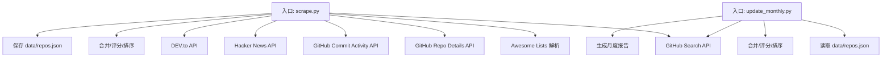
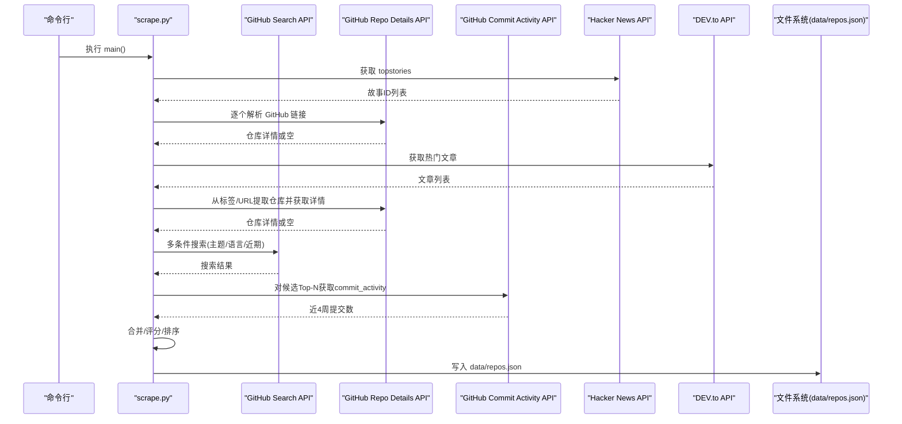
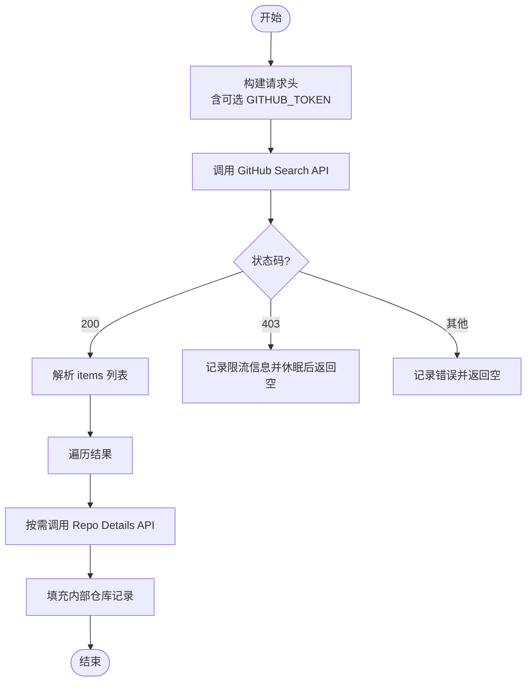
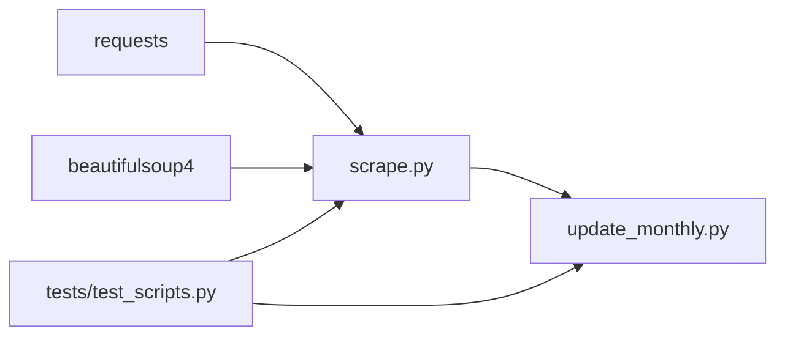

# API 参考文档

<cite>
**本文引用的文件**
- [README.md](file://README.md)
- [requirements.txt](file://requirements.txt)
- [scripts/scrape.py](file://scripts/scrape.py)
- [scripts/update_monthly.py](file://scripts/update_monthly.py)
- [tests/test_scripts.py](file://tests/test_scripts.py)
- [data/monthly_report_2026_05.md](file://data/monthly_report_2026_05.md)
</cite>

## 目录
1. [简介](#简介)
2. [项目结构](#项目结构)
3. [核心组件](#核心组件)
4. [架构总览](#架构总览)
5. [详细组件分析](#详细组件分析)
6. [依赖关系分析](#依赖关系分析)
7. [性能与限流](#性能与限流)
8. [故障排查指南](#故障排查指南)
9. [结论](#结论)
10. [附录：数据模型与示例](#附录数据模型与示例)

## 简介
本仓库是一个开源的“高质量 GitHub 项目聚合器”，通过多源采集（Awesome Lists、GitHub Search API、Hacker News、DEV.to）并统一评分排序，生成可浏览的数据集。本文档聚焦于所有外部 API 集成接口与内部数据处理函数的接口定义、参数规范、返回值格式、请求头设置、错误处理策略与速率限制说明，并提供调用示例与常见问题解决方案。

## 项目结构
- 脚本层
  - scripts/scrape.py：多源聚合主流程，包含 Awesome Lists 解析、GitHub API 搜索/详情、Hacker News、DEV.to 抓取与合并输出。
  - scripts/update_monthly.py：按月增量抓取新仓库，并与已有数据集合并，支持生成月度报告。
- 测试层
  - tests/test_scripts.py：对关键函数进行单元测试，覆盖评分算法、头部构造、解析逻辑等。
- 数据层
  - data/repos.json：聚合后的仓库数据（由脚本写入）。
  - data/monthly_report_*.md：月度报告 Markdown 文件。
- 前端层
  - web/*：静态页面与服务端渲染无关，仅消费 data/repos.json。

图表来源
- [scripts/scrape.py:173-222](file://scripts/scrape.py#L173-L222)
- [scripts/scrape.py:247-278](file://scripts/scrape.py#L247-L278)
- [scripts/scrape.py:315-382](file://scripts/scrape.py#L315-L382)
- [scripts/scrape.py:384-441](file://scripts/scrape.py#L384-L441)
- [scripts/scrape.py:443-508](file://scripts/scrape.py#L443-L508)
- [scripts/update_monthly.py:78-135](file://scripts/update_monthly.py#L78-L135)
- [scripts/update_monthly.py:162-203](file://scripts/update_monthly.py#L162-L203)
- [scripts/update_monthly.py:226-297](file://scripts/update_monthly.py#L226-L297)

章节来源
- [README.md:98-148](file://README.md#L98-L148)
- [scripts/scrape.py:1-12](file://scripts/scrape.py#L1-L12)
- [scripts/update_monthly.py:1-10](file://scripts/update_monthly.py#L1-L10)

## 核心组件
- 请求头构建与认证
  - get_headers()：根据环境变量 GITHUB_TOKEN 动态注入 Authorization 头；未配置时以匿名访问运行。
- Awesome Lists 解析
  - parse_awesome_list(content)：从 Markdown 文本中抽取 GitHub 仓库链接，过滤非仓库路径与自引用，返回去重列表（上限 50）。
- GitHub API 集成
  - search_github_repos(query, min_stars=1000, per_page=30)：基于查询语法搜索仓库，支持 stars 阈值与分页。
  - fetch_github_repo_details(owner, repo)：获取单个仓库详情，处理 404/403 等状态码。
  - fetch_commit_activity(owner, repo)：获取最近 4 周提交活跃度（免费接口），用于趋势增强。
- Hacker News 集成
  - fetch_hackernews()：拉取 Top Stories，筛选指向 GitHub 的链接并补充仓库详情。
- DEV.to 集成
  - fetch_devto_articles()：拉取热门文章，从标签与文章 URL 中提取 GitHub 仓库链接并补充详情。
- 数据处理与评分
  - format_api_repo(r)：将 GitHub API 响应标准化为内部仓库记录。
  - estimate_today_stars(repo_data)：基于推送时间与创建时间估算“今日星标增长”。
  - calculate_score(repo)：综合 stars/forks/today_stars/commit_activity 计算总分。
  - merge_and_sort(all_repos)：跨源合并、字段级取优、去重与排序。
- 月度更新
  - fetch_monthly_repos(year, month)：按月份维度多维度检索新仓库。
  - merge_with_existing(new_repos)：与现有 data/repos.json 合并并持久化。
  - generate_report(merged, month_tag, year, month, new_count, updated)：生成月度 Markdown 报告。

章节来源
- [scripts/scrape.py:103-111](file://scripts/scrape.py#L103-L111)
- [scripts/scrape.py:130-150](file://scripts/scrape.py#L130-L150)
- [scripts/scrape.py:224-245](file://scripts/scrape.py#L224-L245)
- [scripts/scrape.py:152-171](file://scripts/scrape.py#L152-L171)
- [scripts/scrape.py:114-127](file://scripts/scrape.py#L114-L127)
- [scripts/scrape.py:384-441](file://scripts/scrape.py#L384-L441)
- [scripts/scrape.py:443-508](file://scripts/scrape.py#L443-L508)
- [scripts/scrape.py:525-539](file://scripts/scrape.py#L525-L539)
- [scripts/scrape.py:281-313](file://scripts/scrape.py#L281-L313)
- [scripts/scrape.py:541-552](file://scripts/scrape.py#L541-L552)
- [scripts/scrape.py:555-602](file://scripts/scrape.py#L555-L602)
- [scripts/update_monthly.py:78-135](file://scripts/update_monthly.py#L78-L135)
- [scripts/update_monthly.py:162-203](file://scripts/update_monthly.py#L162-L203)
- [scripts/update_monthly.py:226-297](file://scripts/update_monthly.py#L226-L297)

## 架构总览
下图展示了主要外部 API 与内部处理模块之间的交互关系。

图表来源
- [scripts/scrape.py:384-441](file://scripts/scrape.py#L384-L441)
- [scripts/scrape.py:443-508](file://scripts/scrape.py#L443-L508)
- [scripts/scrape.py:247-278](file://scripts/scrape.py#L247-L278)
- [scripts/scrape.py:315-382](file://scripts/scrape.py#L315-L382)
- [scripts/scrape.py:555-602](file://scripts/scrape.py#L555-L602)
- [scripts/scrape.py:605-628](file://scripts/scrape.py#L605-L628)

## 详细组件分析

### GitHub API 集成
- 认证与请求头
  - 使用 get_headers() 统一构造请求头，若存在 GITHUB_TOKEN 则附加 Authorization: Bearer <token>。
  - 默认 User-Agent 与 Accept 已设置，满足 GitHub API v3 要求。
- 搜索接口
  - 端点：https://api.github.com/search/repositories
  - 参数：q（查询表达式）、sort=stars、order=desc、per_page、page
  - 查询语法示例（来自代码中的实际用法）：
    - 主题/关键词：如 "agent skills", "claude-code", "AI framework", "LLM inference", "RAG"
    - 语言限定：language:<lang>
    - 时间范围：created:YYYY-MM-DD..YYYY-MM-DD、pushed:>YYYY-MM-DD
    - 星级区间：stars:>N、stars:M..N
- 仓库详情接口
  - 端点：https://api.github.com/repos/{owner}/{repo}
  - 用途：获取仓库元信息（描述、语言、star/fork 计数等）
- 提交活跃度接口
  - 端点：https://api.github.com/repos/{owner}/{repo}/stats/commit_activity
  - 用途：获取最近 4 周每周提交总数之和，作为新鲜度信号
- 错误处理与限流
  - 403：打印 rate limited 消息并休眠重试（search 与 details 均处理）
  - 404：视为仓库不存在，返回空
  - 其他异常：捕获并返回空结果，保证整体流程健壮性
- 调用示例（概念性）
  - 搜索“本月新增且星标大于 10”的仓库，按 star 降序，每页 100 条，第 1 页。
  - 获取某个仓库的详情与最近 4 周提交活动。

图表来源
- [scripts/scrape.py:103-111](file://scripts/scrape.py#L103-L111)
- [scripts/scrape.py:224-245](file://scripts/scrape.py#L224-L245)
- [scripts/scrape.py:152-171](file://scripts/scrape.py#L152-L171)
- [scripts/scrape.py:114-127](file://scripts/scrape.py#L114-L127)

章节来源
- [scripts/scrape.py:103-111](file://scripts/scrape.py#L103-L111)
- [scripts/scrape.py:224-245](file://scripts/scrape.py#L224-L245)
- [scripts/scrape.py:152-171](file://scripts/scrape.py#L152-L171)
- [scripts/scrape.py:114-127](file://scripts/scrape.py#L114-L127)
- [tests/test_scripts.py:240-249](file://tests/test_scripts.py#L240-L249)

### Hacker News API 集成
- 端点
  - https://hacker-news.firebaseio.com/v0/topstories.json
  - https://hacker-news.firebaseio.com/v0/item/{id}.json
- 流程
  - 获取 top stories ID 列表（前 30）
  - 逐个获取 item，筛选 url 中包含 github.com 的条目
  - 正则提取 owner/repo，调用 GitHub Repo Details API 补充详情
  - 将 title 作为 description 的备选值
- 错误处理
  - 网络异常或状态码非 200 直接跳过
  - 外层 try-except 保护整个流程

章节来源
- [scripts/scrape.py:384-441](file://scripts/scrape.py#L384-L441)

### DEV.to API 集成
- 端点
  - https://dev.to/api/articles?per_page=50&top=7
- 流程
  - 获取热门文章列表
  - 从 tag_list 与 article.url 中匹配 GitHub 仓库链接
  - 去重后调用 GitHub Repo Details API 补充详情
  - 将文章标题作为 description 的备选值
- 错误处理
  - 非 200 状态码直接返回空字典
  - 异常捕获避免中断整体流程

章节来源
- [scripts/scrape.py:443-508](file://scripts/scrape.py#L443-L508)

### Awesome Lists 解析接口
- 输入
  - content：Markdown 文本（各 awesome list 的 README 原始内容）
- 处理
  - 正则匹配形如 [text](https://github.com/owner/repo) 的链接
  - 过滤 GitHub 非仓库路径（features、explore、trending 等）与 awesome-* 自引用
  - 清理尾部片段与查询参数，返回去重列表（最多 50）
- 输出
  - 列表形式，元素为 "owner/repo" 字符串

章节来源
- [scripts/scrape.py:130-150](file://scripts/scrape.py#L130-L150)
- [tests/test_scripts.py:111-140](file://tests/test_scripts.py#L111-L140)

### 内部数据处理函数接口

#### 标准化与评分
- format_api_repo(r)
  - 输入：GitHub API 仓库对象
  - 输出：内部仓库记录（包含 name/url/description/stars/forks/language/today_stars/score/fetched_at/source）
- estimate_today_stars(repo_data)
  - 输入：包含 pushed_at/created_at/stargazers_count 的仓库对象
  - 输出：估算的“今日星标增长”数值（0..~150）
- calculate_score(repo)
  - 输入：内部仓库记录
  - 输出：综合评分（stars + forks + (forks/stars)*1000 + today_stars*10 + commit_activity*2）

章节来源
- [scripts/scrape.py:525-539](file://scripts/scrape.py#L525-L539)
- [scripts/scrape.py:281-313](file://scripts/scrape.py#L281-L313)
- [scripts/scrape.py:541-552](file://scripts/scrape.py#L541-L552)
- [tests/test_scripts.py:38-53](file://tests/test_scripts.py#L38-L53)

#### 合并与排序
- merge_and_sort(all_repos)
  - 输入：多源仓库字典（键为 full_name）
  - 处理：字段级取最大值（stars/forks/today_stars/commit_activity），合并 source 标签，选择最新 fetched_at
  - 输出：按 score 降序排列的仓库列表

章节来源
- [scripts/scrape.py:555-602](file://scripts/scrape.py#L555-L602)

#### 月度更新接口
- fetch_monthly_repos(year, month)
  - 输入：年、月
  - 处理：按日期范围与多种维度（全语言、语言、热点话题、低星但近期推送）检索新仓库
  - 输出：仓库列表（带 month_tag 标记）
- merge_with_existing(new_repos)
  - 输入：当月新仓库列表
  - 处理：读取 data/repos.json，合并并重新计算分数，持久化
  - 输出：合并后的仓库列表、新增数量、更新数量
- generate_report(merged, month_tag, year, month, new_count, updated)
  - 输入：合并后的仓库列表与统计信息
  - 输出：生成 data/monthly_report_{year}_{month}.md

章节来源
- [scripts/update_monthly.py:78-135](file://scripts/update_monthly.py#L78-L135)
- [scripts/update_monthly.py:162-203](file://scripts/update_monthly.py#L162-L203)
- [scripts/update_monthly.py:226-297](file://scripts/update_monthly.py#L226-L297)

## 依赖关系分析
- 外部依赖
  - requests：HTTP 客户端
  - beautifulsoup4：在 requirements 中声明，当前脚本未直接使用（可能用于扩展）
- 内部依赖
  - scrape.py 与 update_monthly.py 共享评分与格式化思路，但各自实现独立
  - 测试用例验证头部构造、评分算法、解析逻辑等

图表来源
- [requirements.txt:1-2](file://requirements.txt#L1-L2)
- [scripts/scrape.py:14-20](file://scripts/scrape.py#L14-L20)
- [scripts/update_monthly.py:19-24](file://scripts/update_monthly.py#L19-L24)
- [tests/test_scripts.py:14-15](file://tests/test_scripts.py#L14-L15)

章节来源
- [requirements.txt:1-2](file://requirements.txt#L1-L2)
- [scripts/scrape.py:14-20](file://scripts/scrape.py#L14-L20)
- [scripts/update_monthly.py:19-24](file://scripts/update_monthly.py#L19-L24)
- [tests/test_scripts.py:14-15](file://tests/test_scripts.py#L14-L15)

## 性能与限流
- GitHub API 限流
  - 未配置 GITHUB_TOKEN：60 次/小时
  - 配置 GITHUB_TOKEN：5000 次/小时
  - 建议：在生产环境务必设置 GITHUB_TOKEN，并在遇到 403 时自动退避重试
- 请求间隔控制
  - Awesome Lists 与 Trending 循环中对每个仓库请求间插入 sleep（0.1~1 秒）
  - 月度更新在多语言/话题维度间也加入 sleep，降低瞬时压力
- 超时设置
  - 多数请求设置 timeout 10~30 秒，避免长时间阻塞
- 数据去重与字段取优
  - 合并阶段对重复仓库进行字段级取最大值，减少冗余并提升质量

章节来源
- [README.md:169-171](file://README.md#L169-L171)
- [scripts/scrape.py:211-218](file://scripts/scrape.py#L211-L218)
- [scripts/scrape.py:234-245](file://scripts/scrape.py#L234-L245)
- [scripts/scrape.py:342-358](file://scripts/scrape.py#L342-L358)
- [scripts/update_monthly.py:104-124](file://scripts/update_monthly.py#L104-L124)

## 故障排查指南
- “页面加载数据失败”
  - 原因：浏览器在 file:// 协议下禁止 fetch 本地 JSON
  - 解决：通过 HTTP 服务器提供静态资源（例如 python3 -m http.server 8000）
- “触发 GitHub API 限流”
  - 现象：出现 403 并提示 rate limited
  - 解决：设置 GITHUB_TOKEN 环境变量，提高配额；必要时增加 sleep 或减少并发
- “找不到仓库或 404”
  - 现象：fetch_github_repo_details 返回 None
  - 解决：确认 owner/repo 名称正确，或仓库已被删除/私有
- “DEV.to/HN 无结果”
  - 现象：返回空字典
  - 解决：检查网络连通性与第三方服务可用性；查看日志中的状态码与异常信息

章节来源
- [README.md:166-171](file://README.md#L166-L171)
- [scripts/scrape.py:152-171](file://scripts/scrape.py#L152-L171)
- [scripts/scrape.py:384-441](file://scripts/scrape.py#L384-L441)
- [scripts/scrape.py:443-508](file://scripts/scrape.py#L443-L508)

## 结论
本项目通过统一的请求头与错误处理机制，稳定地集成了 GitHub、Hacker News 与 DEV.to 三大外部 API，并以 Awesome Lists 作为种子源，形成高覆盖、可解释的数据采集流水线。内部评分与合并逻辑确保最终输出的仓库具备较高质量与可比性。建议在部署时始终配置 GITHUB_TOKEN，并根据需要调整查询维度与分页策略以获得更丰富的数据。

## 附录：数据模型与示例

### 内部仓库记录字段
- name：仓库全名（owner/repo）
- url：仓库主页链接
- description：描述（优先使用来源提供的标题或仓库描述）
- stars：星标数
- forks：分叉数
- language：编程语言
- today_stars：估算的“今日星标增长”
- score：综合评分
- fetched_at：抓取时间戳
- source：数据来源（awesome_list/github_api/trending/hackernews/devto/monthly_new 等）
- commit_activity：近 4 周提交总数（可选）
- created_at：创建时间（月度更新场景）
- month_tag：月份标记（月度更新场景）

章节来源
- [scripts/scrape.py:525-539](file://scripts/scrape.py#L525-L539)
- [scripts/update_monthly.py:137-152](file://scripts/update_monthly.py#L137-L152)

### 月度报告结构（Markdown）
- 概览：本月新增仓库数、本次新增/更新数量、数据库总量
- 语言分布：Top N 语言及其数量
- 热门新仓库：Top 30 列表（含描述摘要）
- 上升之星：高 fork ratio 的项目

章节来源
- [scripts/update_monthly.py:226-297](file://scripts/update_monthly.py#L226-L297)
- [data/monthly_report_2026_05.md:1-141](file://data/monthly_report_2026_05.md#L1-L141)