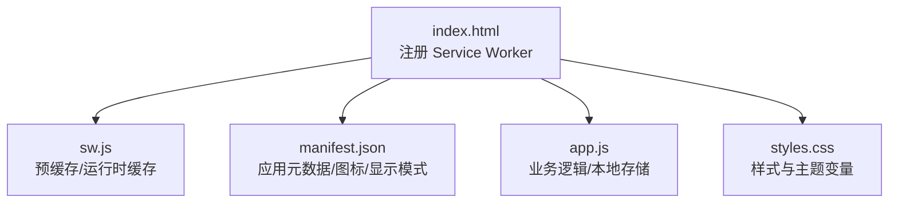
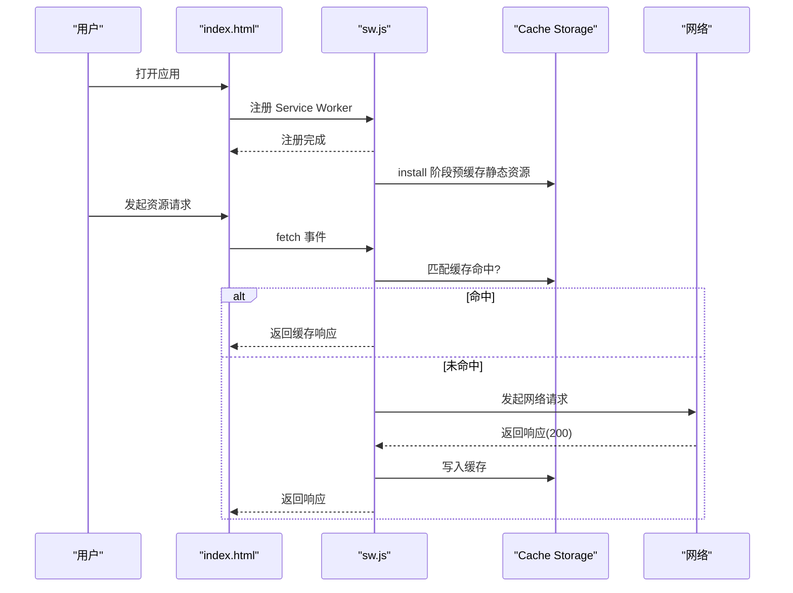
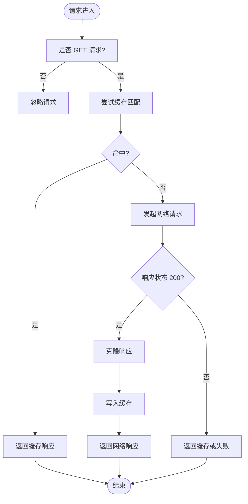
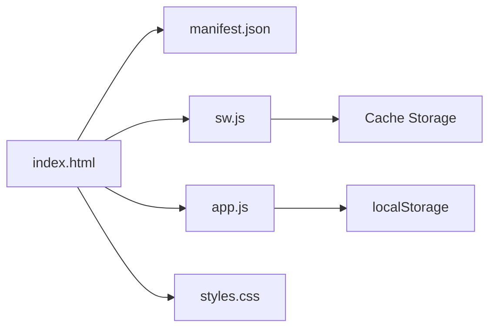

# PWA 功能实现

<cite>
**本文引用的文件**   
- [web/index.html](file://web/index.html)
- [web/manifest.json](file://web/manifest.json)
- [web/sw.js](file://web/sw.js)
- [web/app.js](file://web/app.js)
- [web/styles.css](file://web/styles.css)
</cite>

## 目录
1. [简介](#简介)
2. [项目结构](#项目结构)
3. [核心组件](#核心组件)
4. [架构总览](#架构总览)
5. [详细组件分析](#详细组件分析)
6. [依赖关系分析](#依赖关系分析)
7. [性能考量](#性能考量)
8. [故障排查指南](#故障排查指南)
9. [结论](#结论)
10. [附录：配置示例与最佳实践](#附录配置示例与最佳实践)

## 简介
本技术文档聚焦于仓库中 PWA（渐进式 Web 应用）功能的实现，围绕 Service Worker 的注册、安装、激活与请求拦截策略，以及 manifest.json 的应用元数据、显示模式、主题色与启动页等配置进行系统化说明。同时，结合前端主逻辑对离线访问、缓存更新机制、应用安装流程、推送通知与后台同步的支持现状进行分析，并给出跨浏览器兼容性处理建议与优化路径。

## 项目结构
PWA 相关的关键文件位于 web 目录下，包含入口页面、清单文件、Service Worker 脚本与应用主逻辑。

图表来源
- [web/index.html:276-282](file://web/index.html#L276-L282)
- [web/sw.js:1-50](file://web/sw.js#L1-L50)
- [web/manifest.json:1-16](file://web/manifest.json#L1-L16)
- [web/app.js:1-20](file://web/app.js#L1-L20)
- [web/styles.css:1-36](file://web/styles.css#L1-L36)

章节来源
- [web/index.html:1-20](file://web/index.html#L1-L20)
- [web/manifest.json:1-16](file://web/manifest.json#L1-L16)
- [web/sw.js:1-50](file://web/sw.js#L1-L50)
- [web/app.js:1-20](file://web/app.js#L1-L20)
- [web/styles.css:1-36](file://web/styles.css#L1-L36)

## 核心组件
- 入口页面 index.html：声明 manifest、注册 Service Worker、引入样式与主脚本。
- 清单 manifest.json：定义应用名称、短名、描述、启动页、显示模式、主题色与图标。
- Service Worker sw.js：监听 install、activate、fetch 事件，实现资源预缓存与运行时缓存策略。
- 应用逻辑 app.js：负责数据加载、过滤排序、书签与预设、推荐与灵感模式等；使用 localStorage 做本地持久化。
- 样式 styles.css：提供主题变量与 UI 样式。

章节来源
- [web/index.html:1-20](file://web/index.html#L1-L20)
- [web/manifest.json:1-16](file://web/manifest.json#L1-L16)
- [web/sw.js:1-50](file://web/sw.js#L1-L50)
- [web/app.js:1-20](file://web/app.js#L1-L20)
- [web/styles.css:1-36](file://web/styles.css#L1-L36)

## 架构总览
PWA 在浏览器中的关键交互流程如下：

图表来源
- [web/index.html:276-282](file://web/index.html#L276-L282)
- [web/sw.js:10-17](file://web/sw.js#L10-L17)
- [web/sw.js:19-30](file://web/sw.js#L19-L30)
- [web/sw.js:32-50](file://web/sw.js#L32-L50)

## 详细组件分析

### Service Worker 配置与缓存策略
- 安装阶段（install）
  - 打开指定版本缓存空间，批量预缓存静态资源列表，确保首屏资源可用。
  - 调用 skipWaiting 以尽快激活新版本。
- 激活阶段（activate）
  - 清理旧版本缓存，避免占用存储空间。
  - 调用 clients.claim 使当前客户端立即受新 SW 控制。
- 请求拦截（fetch）
  - 仅处理 GET 请求。
  - 优先从缓存匹配；若命中则直接返回。
  - 若未命中或需要更新，发起网络请求；成功时克隆响应并写入缓存，再返回响应。
  - 网络失败时回退到缓存结果，提升离线可用性。

图表来源
- [web/sw.js:32-50](file://web/sw.js#L32-L50)

章节来源
- [web/sw.js:1-50](file://web/sw.js#L1-L50)

### manifest.json 配置选项
- 应用元数据
  - name：应用全名
  - short_name：短名（用于桌面/主屏幕）
  - description：应用描述
- 启动与显示
  - start_url：应用启动入口
  - display：standalone（全屏独立窗口）
- 主题与外观
  - theme_color：主题色（影响系统栏颜色）
  - background_color：背景色
- 图标
  - icons：至少一个 SVG 图标，sizes 为 any，type 为 image/svg+xml

章节来源
- [web/manifest.json:1-16](file://web/manifest.json#L1-L16)

### 离线访问与数据持久化
- 离线访问
  - 通过 Service Worker 的预缓存与运行时缓存策略，首次加载后静态资源可离线访问。
  - 对于动态数据（如 repos.json），当前 fetch 策略会尝试网络并在成功后写入缓存；若网络不可用且无缓存，将返回空或错误提示。
- 数据持久化
  - 书签、语言偏好、主题、筛选预设、灵感模式浏览历史等均使用 localStorage 持久化。
  - 应用初始化时会读取这些值并恢复界面状态。

章节来源
- [web/sw.js:32-50](file://web/sw.js#L32-L50)
- [web/app.js:296-309](file://web/app.js#L296-L309)
- [web/app.js:1718-1790](file://web/app.js#L1718-L1790)
- [web/app.js:1889-1926](file://web/app.js#L1889-L1926)

### 应用安装流程
- 入口页面在支持 serviceWorker 的浏览器中注册 sw.js。
- 当 manifest.json 满足条件（name、short_name、icons、display、start_url 等），浏览器会提示“添加到主屏幕”。
- standalone 显示模式有助于获得原生应用般的体验。

章节来源
- [web/index.html:276-282](file://web/index.html#L276-L282)
- [web/manifest.json:1-16](file://web/manifest.json#L1-L16)

### 推送通知支持与后台同步
- 推送通知
  - 当前代码库未实现 Push API 与 Notification API 的使用。
  - 如需支持，需在 Service Worker 中订阅 push 事件并展示通知，同时在服务端维护订阅端点。
- 后台同步
  - 当前代码库未使用 Background Sync API。
  - 如需支持，可在 Service Worker 中注册 sync 任务，在网络恢复后执行队列操作。

章节来源
- [web/sw.js:1-50](file://web/sw.js#L1-L50)
- [web/app.js:1-20](file://web/app.js#L1-L20)

### 跨浏览器兼容性处理
- Service Worker 检测
  - 入口页面通过 'serviceWorker' in navigator 判断能力后再注册，避免在不支持的浏览器报错。
- 协议限制
  - 部分浏览器在 file:// 协议下不支持 Service Worker 与 fetch 跨域访问，需通过本地服务器运行。
- 图标与清单
  - 使用 SVG 图标与任意尺寸 sizes 能提升多设备适配性；但某些平台仍要求 PNG 图标，建议补充多种尺寸 PNG 以提升兼容性。

章节来源
- [web/index.html:276-282](file://web/index.html#L276-L282)
- [web/app.js:428-443](file://web/app.js#L428-L443)
- [web/manifest.json:1-16](file://web/manifest.json#L1-L16)

## 依赖关系分析
- index.html 依赖 manifest.json 与 sw.js，并通过 script 标签引入 app.js 与 styles.css。
- sw.js 独立运行，不依赖其他前端模块，仅与 Cache Storage 和 Network 交互。
- app.js 主要依赖 DOM API、localStorage、navigator.clipboard 等浏览器能力。

图表来源
- [web/index.html:1-20](file://web/index.html#L1-L20)
- [web/sw.js:1-50](file://web/sw.js#L1-L50)
- [web/app.js:1-20](file://web/app.js#L1-L20)
- [web/styles.css:1-36](file://web/styles.css#L1-L36)

章节来源
- [web/index.html:1-20](file://web/index.html#L1-L20)
- [web/sw.js:1-50](file://web/sw.js#L1-L50)
- [web/app.js:1-20](file://web/app.js#L1-L20)
- [web/styles.css:1-36](file://web/styles.css#L1-L36)

## 性能考量
- 预缓存关键静态资源，减少首屏加载时间。
- 运行时缓存采用“先缓存后返回”的策略，保证后续访问更快，但需注意响应克隆带来的内存开销。
- 大列表渲染使用虚拟滚动（app.js 中根据数量切换），降低 DOM 压力。
- 建议在 Service Worker 中对大型 JSON 数据实施更精细的缓存策略（如按版本号或时间戳更新）。

[本节为通用指导，无需具体文件引用]

## 故障排查指南
- 无法安装或提示无效清单
  - 检查 manifest.json 字段完整性与路径正确性。
- Service Worker 未生效
  - 确认通过 HTTPS 或 localhost 提供服务；检查浏览器控制台是否有注册错误。
- 离线无法加载数据
  - 当前 fetch 策略仅在网络成功时写入缓存；若首次无网络，repos.json 不会被缓存。可通过预缓存该文件或增加缓存回退逻辑解决。
- 本地 file:// 协议问题
  - 使用本地服务器（如 python3 -m http.server 8000）运行，避免协议限制。

章节来源
- [web/manifest.json:1-16](file://web/manifest.json#L1-L16)
- [web/sw.js:32-50](file://web/sw.js#L32-L50)
- [web/app.js:428-443](file://web/app.js#L428-L443)

## 结论
当前 PWA 实现已具备基础能力：清单配置完整、Service Worker 注册与安装/激活/请求拦截流程清晰，静态资源预缓存与运行时缓存策略有效提升了首屏与重复访问性能。离线访问方面，静态资源可离线，动态数据需完善缓存策略。推送通知与后台同步尚未实现，可按需扩展。整体方案具备良好的可扩展性与跨浏览器兼容基础。

[本节为总结，无需具体文件引用]

## 附录：配置示例与最佳实践

- Service Worker 最佳实践
  - 使用明确的缓存命名与版本号，便于升级与清理。
  - 对动态数据采用“网络优先+缓存回退”或“缓存优先+后台更新”策略，依据业务需求选择。
  - 在 activate 阶段清理旧缓存，避免存储膨胀。
  - 使用 skipWaiting 与 clients.claim 加速新版本部署。

- manifest.json 最佳实践
  - 提供 name、short_name、description、start_url、display、theme_color、background_color、icons。
  - 图标建议提供多种尺寸 PNG 与 SVG，覆盖不同平台与分辨率。
  - 使用 standalone 以获得更好的沉浸式体验。

- 离线与数据持久化
  - 将关键数据（如 repos.json）加入预缓存或通过后台更新策略保持最新。
  - 使用 localStorage 保存用户偏好与状态，注意容量限制与异常处理。

- 跨浏览器兼容性
  - 始终检测 serviceWorker 能力后再注册。
  - 通过本地服务器运行以避免 file:// 限制。
  - 针对不支持 Clipboard API 的环境提供降级方案。

章节来源
- [web/sw.js:1-50](file://web/sw.js#L1-L50)
- [web/manifest.json:1-16](file://web/manifest.json#L1-L16)
- [web/index.html:276-282](file://web/index.html#L276-L282)
- [web/app.js:428-443](file://web/app.js#L428-L443)