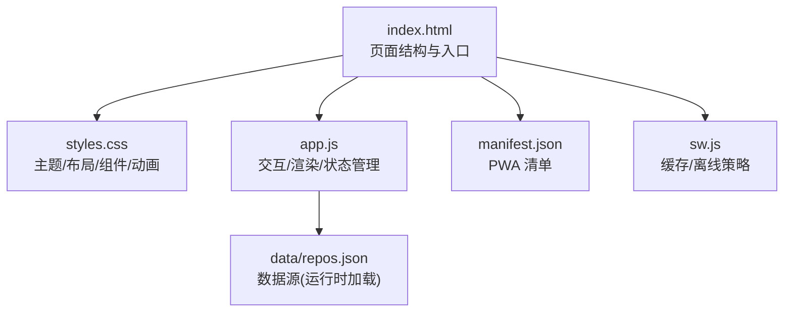
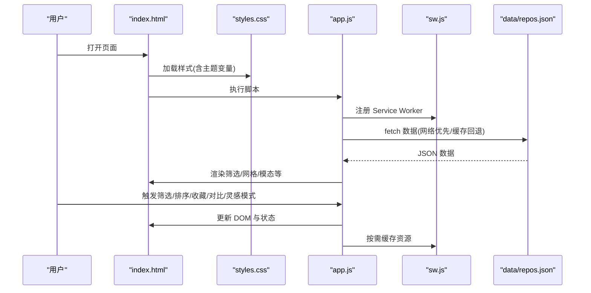
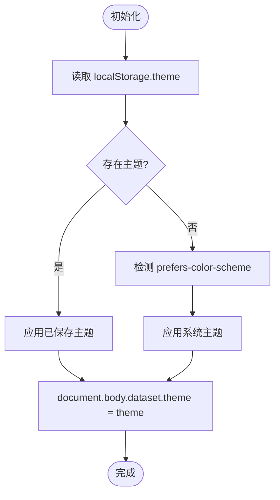
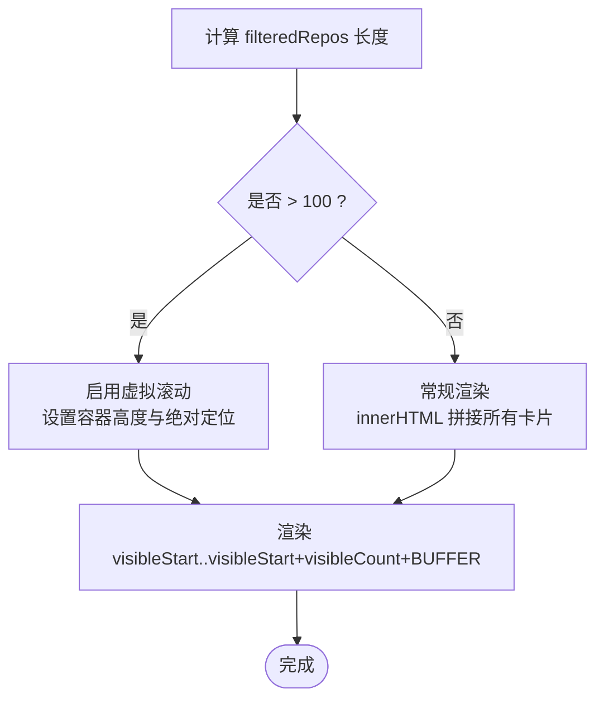
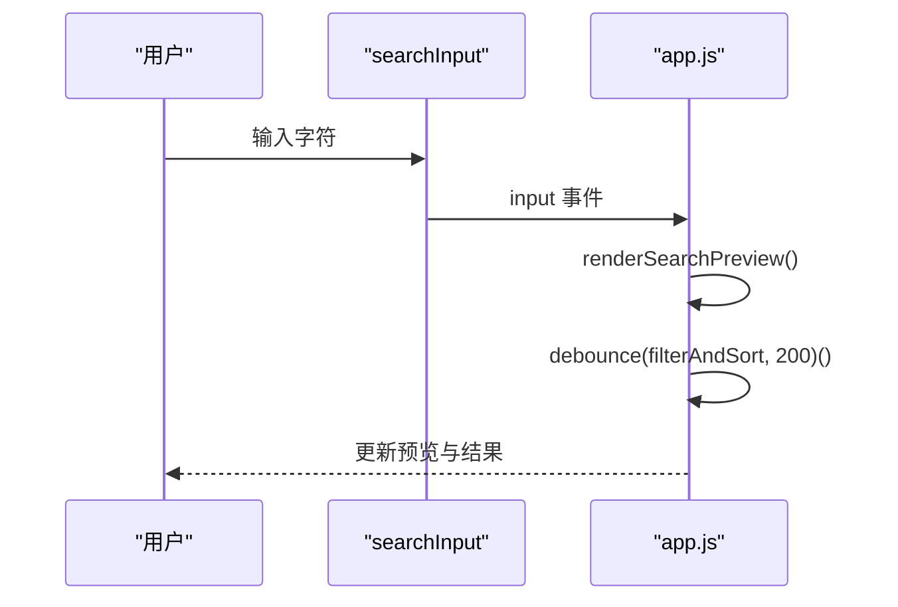
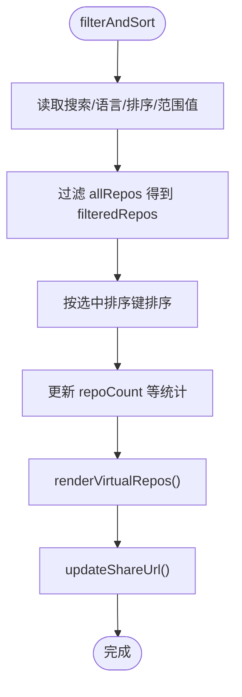
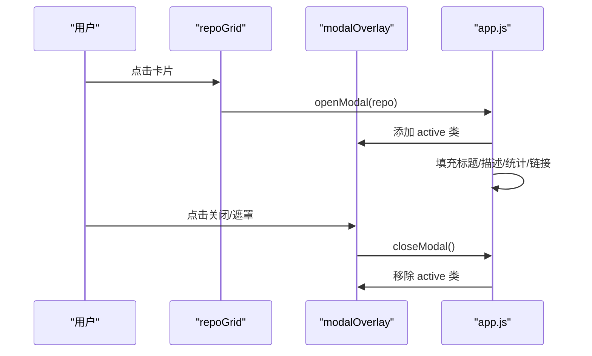
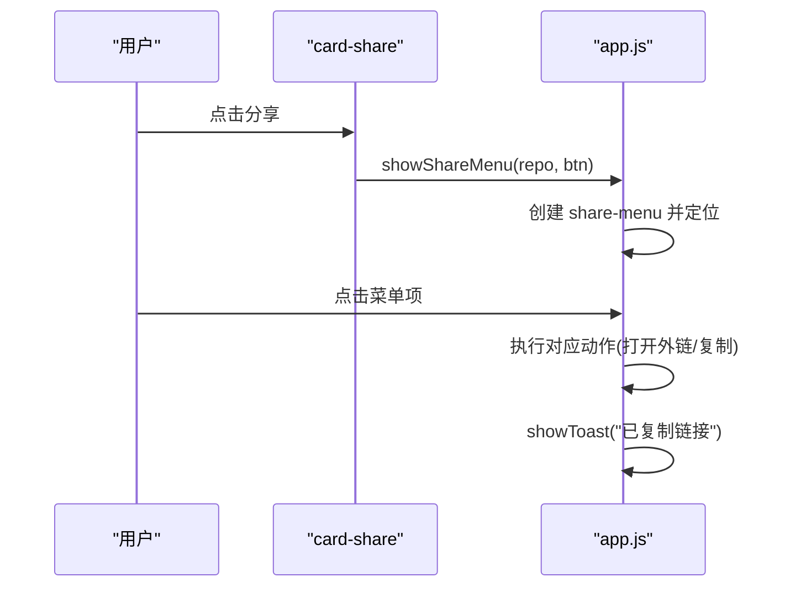
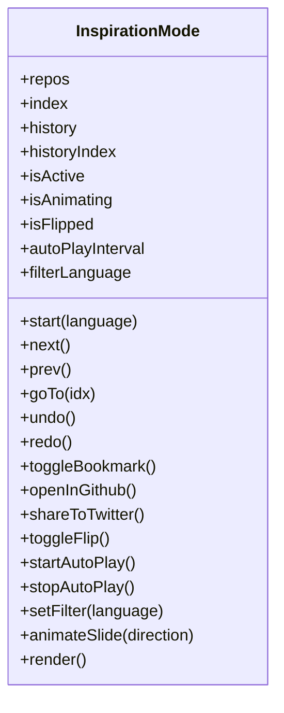
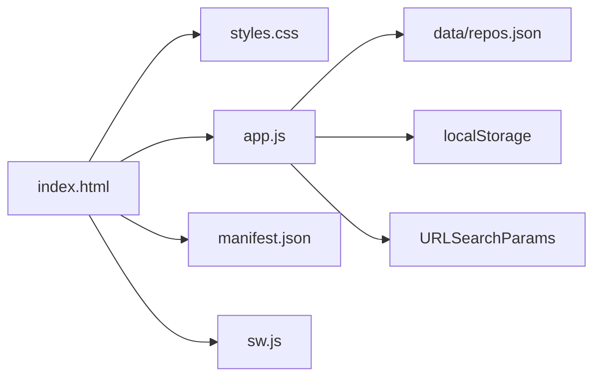

# UI 组件系统

<cite>
**本文引用的文件**   
- [web/index.html](file://web/index.html)
- [web/styles.css](file://web/styles.css)
- [web/app.js](file://web/app.js)
- [web/manifest.json](file://web/manifest.json)
- [web/sw.js](file://web/sw.js)
- [README.md](file://README.md)
</cite>

## 目录
1. [简介](#简介)
2. [项目结构](#项目结构)
3. [核心组件](#核心组件)
4. [架构总览](#架构总览)
5. [详细组件分析](#详细组件分析)
6. [依赖关系分析](#依赖关系分析)
7. [性能考量](#性能考量)
8. [故障排查指南](#故障排查指南)
9. [结论](#结论)
10. [附录：样式配置与复用模式](#附录样式配置与复用模式)

## 简介
本技术文档聚焦于仓库中的前端 UI 组件系统，围绕以下目标展开：
- 基于 CSS 变量的主题系统（深色/浅色切换、动态样式更新）
- 响应式网格布局与卡片自适应排列、移动端适配策略
- 用户交互组件：搜索框、筛选器、模态框、分享菜单、提示等
- 动画与过渡效果：CSS 动画与 JavaScript 驱动交互动画
- 样式配置示例与组件复用模式

该 UI 采用零构建的纯 HTML/CSS/JS 实现，通过 Service Worker 提供 PWA 离线能力，并通过 URL 查询参数同步筛选状态。

## 项目结构
前端位于 web 目录下，包含入口页面、样式、脚本、PWA 清单与服务端缓存逻辑。整体结构清晰，职责分离明确：
- index.html：页面骨架与关键 DOM 节点
- styles.css：主题变量、布局、组件样式、动画与响应式规则
- app.js：业务逻辑、事件绑定、渲染与交互控制
- manifest.json：PWA 应用元信息
- sw.js：Service Worker 缓存策略与离线回退

图表来源
- [web/index.html:1-284](file://web/index.html#L1-L284)
- [web/styles.css:1-2574](file://web/styles.css#L1-L2574)
- [web/app.js:1-2621](file://web/app.js#L1-L2621)
- [web/manifest.json:1-16](file://web/manifest.json#L1-L16)
- [web/sw.js:1-128](file://web/sw.js#L1-L128)

章节来源
- [README.md:123-148](file://README.md#L123-L148)

## 核心组件
- 主题切换按钮：支持深色/浅色主题切换并持久化到 localStorage
- 语言切换按钮：中英文界面切换
- 筛选面板：搜索输入、语言下拉、排序下拉、范围滑块、重置按钮
- 统计栏：展示项目数量、Stars 总量、语言种类、更新时间与新鲜度
- 标签分类：根据描述关键词自动归类并生成可点击过滤标签
- 仓库网格：响应式 Grid 布局 + 虚拟滚动（大数据量时）
- 仓库卡片：图标、名称、作者、描述、指标、许可证、活跃度指示、收藏/对比/分享/批量选择按钮
- 详情模态框：展示详细信息、操作按钮、克隆命令
- 对比模态框：两项目横向对比
- 灵感模式：全屏滑动浏览、历史撤销/重做、自动播放、翻转卡片、键盘导航、无障碍播报
- 分享菜单与 Toast 提示：社交分享、复制链接反馈
- 预设保存与恢复：将当前筛选条件保存为本地预设

章节来源
- [web/index.html:21-284](file://web/index.html#L21-L284)
- [web/styles.css:84-121](file://web/styles.css#L84-L121)
- [web/styles.css:202-374](file://web/styles.css#L202-L374)
- [web/styles.css:426-577](file://web/styles.css#L426-L577)
- [web/styles.css:721-950](file://web/styles.css#L721-L950)
- [web/styles.css:1215-1452](file://web/styles.css#L1215-L1452)
- [web/styles.css:1457-1526](file://web/styles.css#L1457-L1526)
- [web/styles.css:1770-1804](file://web/styles.css#L1770-L1804)
- [web/styles.css:1818-1895](file://web/styles.css#L1818-L1895)
- [web/styles.css:2067-2131](file://web/styles.css#L2067-L2131)
- [web/styles.css:2185-2574](file://web/styles.css#L2185-L2574)
- [web/app.js:193-218](file://web/app.js#L193-L218)
- [web/app.js:224-291](file://web/app.js#L224-L291)
- [web/app.js:514-542](file://web/app.js#L514-L542)
- [web/app.js:846-993](file://web/app.js#L846-L993)
- [web/app.js:1013-1046](file://web/app.js#L1013-L1046)
- [web/app.js:1095-1172](file://web/app.js#L1095-L1172)
- [web/app.js:1337-1390](file://web/app.js#L1337-L1390)
- [web/app.js:1392-1524](file://web/app.js#L1392-L1524)
- [web/app.js:1585-1679](file://web/app.js#L1585-L1679)
- [web/app.js:1688-1712](file://web/app.js#L1688-L1712)
- [web/app.js:1714-1787](file://web/app.js#L1714-L1787)
- [web/app.js:1789-2400](file://web/app.js#L1789-L2400)

## 架构总览
UI 层由 HTML 提供语义化结构，CSS 通过 :root 和 [data-theme] 定义主题变量，JS 负责数据加载、筛选、渲染与交互。PWA 通过 manifest.json 与 sw.js 提供离线体验。

图表来源
- [web/index.html:275-284](file://web/index.html#L275-L284)
- [web/sw.js:1-78](file://web/sw.js#L1-L78)
- [web/app.js:401-440](file://web/app.js#L401-L440)

## 详细组件分析

### 主题系统与动态样式更新
- 使用 :root 定义默认深色主题变量，[data-theme="light"] 覆盖为浅色主题
- body 上设置 data-theme 属性，配合 CSS transition 平滑过渡背景与文字色
- JS 初始化时读取 localStorage 或系统偏好，切换时写入 localStorage 并更新 data-theme
- 主题切换按钮与语言切换按钮固定定位在右上角，具备 hover 动效

图表来源
- [web/styles.css:5-36](file://web/styles.css#L5-L36)
- [web/app.js:193-205](file://web/app.js#L193-L205)

章节来源
- [web/styles.css:5-36](file://web/styles.css#L5-L36)
- [web/styles.css:48-56](file://web/styles.css#L48-L56)
- [web/app.js:193-205](file://web/app.js#L193-L205)

### 响应式网格布局与卡片自适应
- 使用 CSS Grid：grid-template-columns: repeat(auto-fill, minmax(340px, 1fr)) 实现自适应列数
- 小屏媒体查询下，网格切换为单列，筛选区纵向堆叠，滑块项自适应宽度
- 大数据量场景启用虚拟滚动：当结果超过阈值时，仅渲染可视区域卡片，提升滚动性能
- 卡片内元素采用 Flex 布局，指标行 flex-wrap 换行，保证内容可读性

图表来源
- [web/styles.css:426-430](file://web/styles.css#L426-L430)
- [web/styles.css:625-685](file://web/styles.css#L625-L685)
- [web/app.js:861-912](file://web/app.js#L861-L912)

章节来源
- [web/styles.css:426-430](file://web/styles.css#L426-L430)
- [web/styles.css:625-685](file://web/styles.css#L625-L685)
- [web/app.js:861-912](file://web/app.js#L861-L912)

### 搜索框与实时预览
- 输入框带搜索图标与占位符，支持 input 事件触发防抖筛选
- 实时预览下拉列表显示匹配的前若干条结果，点击后直接打开详情
- 预览列表样式包含图标、名称、描述片段与 Stars 数

图表来源
- [web/index.html:54-61](file://web/index.html#L54-L61)
- [web/app.js:1097-1100](file://web/app.js#L1097-L1100)
- [web/app.js:718-774](file://web/app.js#L718-L774)

章节来源
- [web/index.html:54-61](file://web/index.html#L54-L61)
- [web/app.js:718-774](file://web/app.js#L718-L774)
- [web/app.js:1097-1100](file://web/app.js#L1097-L1100)

### 筛选器与排序
- 语言下拉动态填充，按字母序显示语言及计数
- 排序选项包括综合评分、Stars、Forks、今日增长、飙升指数
- 范围滑块支持 Stars/Forks/Score 的最小值过滤，实时更新数值显示
- 重置按钮一键清空所有筛选条件

图表来源
- [web/app.js:1013-1046](file://web/app.js#L1013-L1046)
- [web/app.js:1048-1063](file://web/app.js#L1048-L1063)
- [web/app.js:1337-1390](file://web/app.js#L1337-L1390)

章节来源
- [web/app.js:819-844](file://web/app.js#L819-L844)
- [web/app.js:1013-1046](file://web/app.js#L1013-L1046)
- [web/app.js:1337-1390](file://web/app.js#L1337-L1390)

### 模态框与对比
- 详情模态框展示图标、标题、作者、描述、统计数据、来源、GitHub 链接、复制 URL、收藏按钮
- 对比模态框以左右分栏展示两个项目的关键指标对比条
- 模态框通过 overlay.active 控制显隐，body 溢出隐藏避免背景滚动

图表来源
- [web/index.html:219-267](file://web/index.html#L219-L267)
- [web/app.js:349-399](file://web/app.js#L349-L399)
- [web/app.js:1424-1519](file://web/app.js#L1424-L1519)

章节来源
- [web/index.html:219-267](file://web/index.html#L219-L267)
- [web/app.js:349-399](file://web/app.js#L349-L399)
- [web/app.js:1424-1519](file://web/app.js#L1424-L1519)

### 分享菜单与 Toast 提示
- 分享菜单动态定位在触发按钮下方，支持 Twitter/X、LinkedIn、复制链接
- Toast 提示通过创建 DOM 节点并添加 show 类实现淡入淡出

图表来源
- [web/app.js:670-716](file://web/app.js#L670-L716)
- [web/app.js:651-668](file://web/app.js#L651-L668)

章节来源
- [web/app.js:670-716](file://web/app.js#L670-L716)
- [web/app.js:651-668](file://web/app.js#L651-L668)

### 灵感模式（全屏滑动浏览）
- 状态管理：维护 repos、index、history/historyIndex、isAnimating、isFlipped、autoPlayInterval 等
- 交互：前后翻页、撤销/重做、自动播放、翻转卡片、语言筛选、进度条、已浏览标记
- 动画：使用 transform 与 opacity 进行进出场动画，requestAnimationFrame 确保流畅
- 无障碍：aria-live 播报当前卡片信息与操作反馈
- 持久化：记录已浏览集合与最后位置，刷新后可恢复

图表来源
- [web/app.js:1789-2400](file://web/app.js#L1789-L2400)

章节来源
- [web/app.js:1789-2400](file://web/app.js#L1789-L2400)

### 动画与过渡效果
- CSS 动画：fadeUp、pulse、spin、shimmer、bookmarkPop、slideUp、fadeIn 等
- 过渡：主题切换、卡片悬停、模态框显隐、按钮 hover 均有 ease 过渡
- 性能优化：大量使用 will-change、transform、opacity 等合成层属性；虚拟滚动减少 DOM 节点；debounce 节流高频事件

章节来源
- [web/styles.css:150-179](file://web/styles.css#L150-L179)
- [web/styles.css:599-601](file://web/styles.css#L599-L601)
- [web/styles.css:1191-1195](file://web/styles.css#L1191-L1195)
- [web/styles.css:1201-1209](file://web/styles.css#L1201-L1209)
- [web/styles.css:1232-1235](file://web/styles.css#L1232-L1235)
- [web/styles.css:2079-2082](file://web/styles.css#L2079-L2082)
- [web/app.js:1065-1071](file://web/app.js#L1065-L1071)
- [web/app.js:1335](file://web/app.js#L1335)

## 依赖关系分析
- 页面依赖样式与脚本，脚本依赖数据文件
- Service Worker 对 shell 资产与数据文件采用不同缓存策略
- 主题与语言状态通过 localStorage 持久化
- 筛选状态通过 URL 查询参数共享与恢复

图表来源
- [web/index.html:1-284](file://web/index.html#L1-L284)
- [web/sw.js:1-78](file://web/sw.js#L1-L78)
- [web/app.js:1337-1390](file://web/app.js#L1337-L1390)

章节来源
- [web/sw.js:1-78](file://web/sw.js#L1-L78)
- [web/app.js:1337-1390](file://web/app.js#L1337-L1390)

## 性能考量
- 虚拟滚动：大数据量时仅渲染可视区域，降低 DOM 压力
- 防抖与节流：输入与滚动事件使用 debounce，避免频繁重排重绘
- 动画优化：使用 transform/opacity/will-change 等 GPU 友好属性
- 预取与缓存：Service Worker 网络优先/缓存回退，shell 资源 stale-while-revalidate
- 图片与 SVG：使用内联 SVG 减少请求，必要时预加载相邻卡片资源

章节来源
- [web/app.js:861-912](file://web/app.js#L861-L912)
- [web/app.js:1065-1071](file://web/app.js#L1065-L1071)
- [web/app.js:1335](file://web/app.js#L1335)
- [web/sw.js:1-78](file://web/sw.js#L1-L78)

## 故障排查指南
- 数据加载失败
  - 现象：页面显示“无法加载数据”
  - 原因：浏览器 file:// 协议阻止 fetch；未运行数据抓取脚本
  - 处理：通过本地 HTTP 服务器访问；在项目根目录运行抓取脚本生成 data/repos.json
- Service Worker 不生效
  - 现象：离线不可用或缓存未更新
  - 原因：未在 HTTPS 或 localhost 环境；缓存版本未递增
  - 处理：确保在 http://localhost 或 https 环境；修改 CACHE_VERSION 触发更新
- 筛选无结果
  - 现象：筛选后显示“没有找到符合条件的项目”
  - 原因：过滤条件过严或数据为空
  - 处理：重置筛选或检查数据源

章节来源
- [web/app.js:425-440](file://web/app.js#L425-L440)
- [web/app.js:846-859](file://web/app.js#L846-L859)
- [web/sw.js:1-78](file://web/sw.js#L1-L78)

## 结论
该 UI 组件系统以 CSS 变量为核心实现主题化，结合响应式 Grid 与虚拟滚动达成高性能与良好体验。交互层面涵盖搜索、筛选、模态、分享、提示与灵感模式，辅以完善的动画与无障碍支持。通过 Service Worker 与 URL 状态同步，进一步提升了可用性与可分享性。

## 附录：样式配置与复用模式

### 主题变量与配色规范
- 在 :root 中集中定义基础色板（背景、边框、文本、强调色、阴影、字体族）
- 通过 [data-theme="light"] 覆盖变量实现浅色主题
- 组件样式统一引用变量，确保一致性与易维护性

章节来源
- [web/styles.css:5-36](file://web/styles.css#L5-L36)

### 组件复用模式
- 卡片模板：createCard 函数生成标准化卡片 HTML，便于批量渲染与虚拟滚动
- 模态复用：同一 modalOverlay/modal 承载详情、对比、推荐、帮助等不同视图，通过 JS 动态填充
- 筛选复用：filterAndSort 统一处理多条件组合，配合 updateRangeDisplay 与 resetFilters 形成闭环
- 预设机制：saveCurrentAsPreset/applyPreset 将筛选状态序列化为本地对象，支持快速恢复

章节来源
- [web/app.js:914-993](file://web/app.js#L914-L993)
- [web/app.js:1013-1046](file://web/app.js#L1013-L1046)
- [web/app.js:1714-1787](file://web/app.js#L1714-L1787)