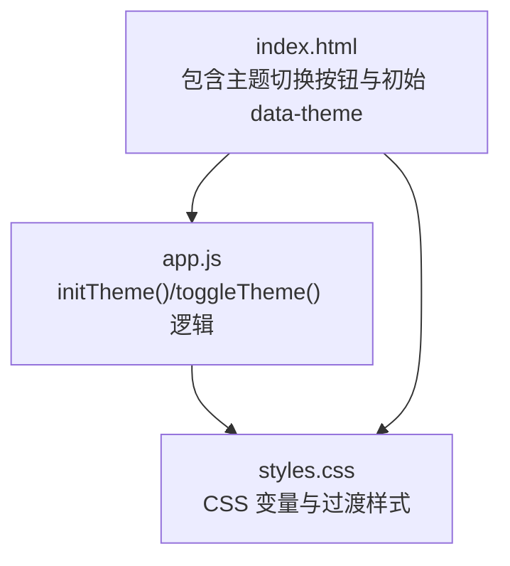
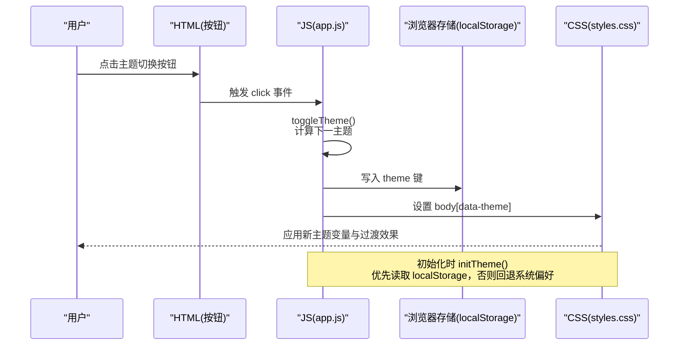
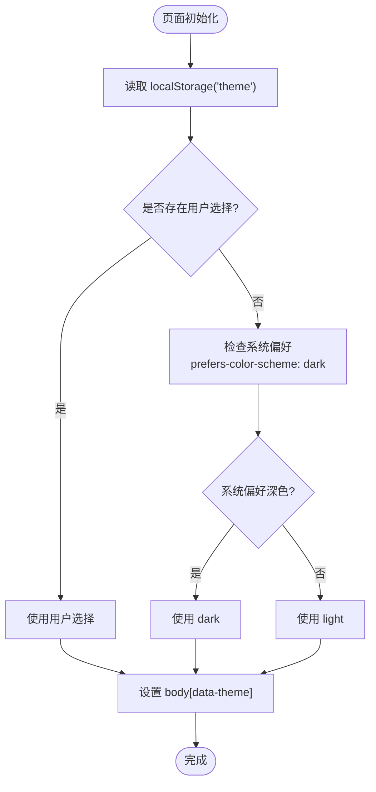
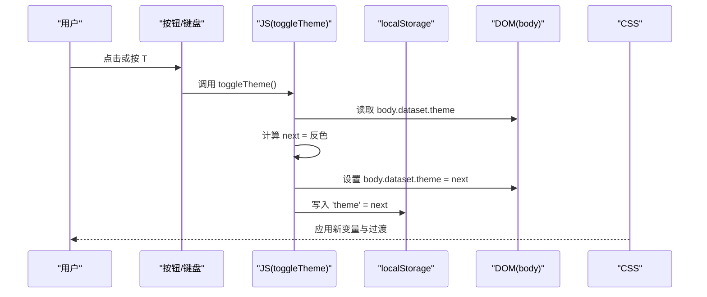
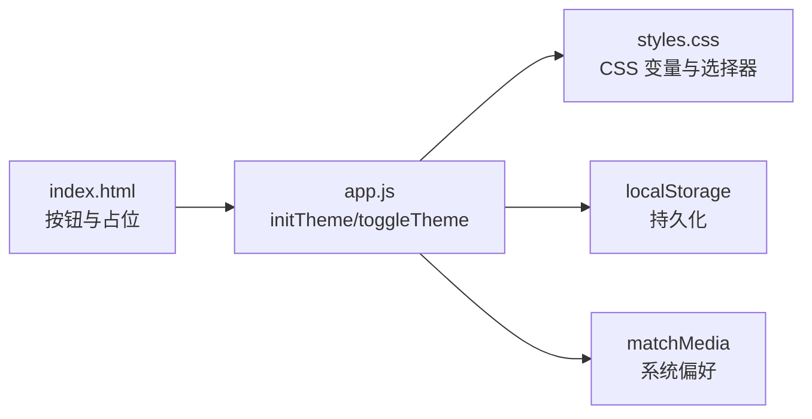

# 主题系统

<cite>
**本文档引用的文件**   
- [web/app.js](file://web/app.js)
- [web/styles.css](file://web/styles.css)
- [web/index.html](file://web/index.html)
</cite>

## 目录
1. [简介](#简介)
2. [项目结构](#项目结构)
3. [核心组件](#核心组件)
4. [架构总览](#架构总览)
5. [详细组件分析](#详细组件分析)
6. [依赖关系分析](#依赖关系分析)
7. [性能与动画优化](#性能与动画优化)
8. [故障排查指南](#故障排查指南)
9. [结论](#结论)
10. [附录：CSS 变量清单与自定义指南](#附录css-变量清单与自定义指南)

## 简介
本主题系统通过 CSS 变量实现深色/浅色主题切换，结合 JavaScript 在页面初始化时检测系统主题偏好并持久化用户选择。核心流程包括：
- 定义全局 CSS 变量（:root 默认深色，[data-theme="light"] 覆盖为浅色）
- 初始化时读取 localStorage 中的用户选择，若未设置则回退到系统 prefers-color-scheme
- 将最终主题写入 body 的 data-theme 属性，驱动 CSS 变量生效
- 提供切换按钮与键盘快捷键 T，支持即时切换与持久化存储

该方案具备低耦合、高扩展性、可维护性强等特点，适合在单页应用中快速集成与扩展更多主题变体。

## 项目结构
主题相关代码分布在以下文件中：
- web/index.html：包含主题切换按钮与初始 data-theme 占位
- web/styles.css：定义 :root 与 [data-theme="light"] 两套 CSS 变量及过渡动画
- web/app.js：实现 initTheme()、toggleTheme() 以及事件绑定与键盘快捷键

图表来源
- [web/index.html:15-30](file://web/index.html#L15-L30)
- [web/app.js:193-205](file://web/app.js#L193-L205)
- [web/styles.css:5-36](file://web/styles.css#L5-L36)

章节来源
- [web/index.html:15-30](file://web/index.html#L15-L30)
- [web/app.js:193-205](file://web/app.js#L193-L205)
- [web/styles.css:5-36](file://web/styles.css#L5-L36)

## 核心组件
- 主题变量定义（CSS）
  - 使用 :root 声明默认深色主题变量
  - 使用 [data-theme="light"] 覆盖为浅色主题变量
  - 关键变量包括背景、卡片背景、边框、文本色、强调色、阴影等
- 初始化函数 initTheme()
  - 从 localStorage 读取用户选择的主题键值
  - 若未保存，则通过 window.matchMedia('(prefers-color-scheme: dark)') 检测系统偏好
  - 将最终主题写入 document.body.dataset.theme
- 切换函数 toggleTheme()
  - 根据当前 body 的 data-theme 计算下一个主题
  - 更新 body 的 data-theme 并写入 localStorage
- 交互入口
  - 点击按钮触发 toggleTheme()
  - 键盘快捷键 T 触发 toggleTheme()
  - 图标显示由 CSS 根据 data-theme 控制（太阳/月亮图标切换）

章节来源
- [web/styles.css:5-36](file://web/styles.css#L5-L36)
- [web/app.js:193-205](file://web/app.js#L193-L205)
- [web/index.html:22-30](file://web/index.html#L22-L30)

## 架构总览
主题系统采用“数据属性 + CSS 变量”的模式，JS 仅负责状态管理与持久化，样式层完全由 CSS 变量驱动，职责清晰、易于扩展。

图表来源
- [web/app.js:193-205](file://web/app.js#L193-L205)
- [web/styles.css:5-36](file://web/styles.css#L5-L36)
- [web/index.html:22-30](file://web/index.html#L22-L30)

## 详细组件分析

### 初始化与优先级策略
- 初始化顺序
  - 页面加载后执行 initTheme()
  - 读取 localStorage 中 'theme' 的值
  - 若为空，则通过 matchMedia 判断系统是否偏好深色
  - 将最终主题写入 body.dataset.theme
- 优先级规则
  - 用户选择（localStorage）优先于系统偏好
  - 若无用户选择，则回退到系统偏好
  - 若系统也不存在偏好，则使用默认深色（:root 定义）

图表来源
- [web/app.js:193-198](file://web/app.js#L193-L198)

章节来源
- [web/app.js:193-198](file://web/app.js#L193-L198)

### 切换逻辑与持久化
- 切换流程
  - 读取当前 body.dataset.theme
  - 若为 'dark' 则切换到 'light'，反之亦然
  - 更新 body.dataset.theme 并写入 localStorage('theme')
- 交互入口
  - 按钮点击事件绑定到 toggleTheme()
  - 键盘快捷键 T 也调用 toggleTheme()
- 图标切换
  - 通过 CSS 选择器 [data-theme="light"] 控制太阳/月亮图标的显隐

图表来源
- [web/app.js:200-205](file://web/app.js#L200-L205)
- [web/index.html:22-30](file://web/index.html#L22-L30)
- [web/styles.css:113-121](file://web/styles.css#L113-L121)

章节来源
- [web/app.js:200-205](file://web/app.js#L200-L205)
- [web/index.html:22-30](file://web/index.html#L22-L30)
- [web/styles.css:113-121](file://web/styles.css#L113-L121)

### 事件绑定与快捷键
- 按钮点击
  - 通过 DOMContentLoaded 后绑定 #themeToggle 的 click 事件到 toggleTheme()
- 键盘快捷键
  - 监听 keydown 事件，当按下 T/t 时调用 toggleTheme()
  - 其他快捷键如 B/L 用于书签视图与语言切换，不影响主题逻辑

章节来源
- [web/app.js:1095](file://web/app.js#L1095)
- [web/app.js:1270-1272](file://web/app.js#L1270-L1272)

### 样式与过渡
- CSS 变量
  - :root 定义深色主题变量集合
  - [data-theme="light"] 覆盖为浅色主题变量集合
- 过渡动画
  - body 对 background 和 color 设置 0.3s ease 过渡
  - .bg 背景网格对 background 设置 0.3s ease 过渡
  - 主题切换按钮 hover 时有 transform 旋转动画
- 图标显隐
  - 通过 [data-theme="light"] 控制 .icon-sun 与 .icon-moon 的 display

章节来源
- [web/styles.css:5-36](file://web/styles.css#L5-L36)
- [web/styles.css:48-56](file://web/styles.css#L48-L56)
- [web/styles.css:62-68](file://web/styles.css#L62-L68)
- [web/styles.css:84-121](file://web/styles.css#L84-L121)

## 依赖关系分析
- 模块耦合
  - app.js 依赖 styles.css 的 CSS 变量与选择器
  - index.html 提供按钮与初始 data-theme 占位
- 外部依赖
  - localStorage 用于持久化用户选择
  - window.matchMedia 用于系统主题偏好检测
- 潜在循环依赖
  - 无直接循环依赖；JS 仅操作 DOM 属性与存储，不反向引入 CSS

图表来源
- [web/index.html:22-30](file://web/index.html#L22-L30)
- [web/app.js:193-205](file://web/app.js#L193-L205)
- [web/styles.css:5-36](file://web/styles.css#L5-L36)

章节来源
- [web/app.js:193-205](file://web/app.js#L193-L205)
- [web/styles.css:5-36](file://web/styles.css#L5-L36)
- [web/index.html:22-30](file://web/index.html#L22-L30)

## 性能与动画优化
- 过渡开销控制
  - 仅对必要属性（background、color）启用过渡，避免重排重绘过多元素
  - 背景网格使用固定定位与 pointer-events: none，不参与交互，减少渲染压力
- 动画时长与缓动
  - 使用 0.3s ease 平衡流畅性与响应速度
  - 按钮 hover 使用 transform 旋转，GPU 加速友好
- 可扩展性建议
  - 如需更复杂主题（多品牌色），可在 :root 下增加命名空间变量，并通过 data-theme 组合选择器覆盖
  - 可将常用颜色分组为语义变量（如 --color-primary、--color-bg-card），便于统一替换

章节来源
- [web/styles.css:48-56](file://web/styles.css#L48-L56)
- [web/styles.css:62-68](file://web/styles.css#L62-L68)
- [web/styles.css:84-121](file://web/styles.css#L84-L121)

## 故障排查指南
- 问题：切换后颜色未变化
  - 检查 body 的 data-theme 是否正确设置
  - 确认 CSS 选择器 [data-theme="light"] 未被覆盖或优先级错误
- 问题：刷新后主题恢复为系统偏好
  - 检查 localStorage 是否被禁用或清除
  - 确认 initTheme() 是否在页面加载早期执行
- 问题：图标未切换
  - 检查 .icon-sun/.icon-moon 的 display 规则是否匹配当前 data-theme
- 问题：过渡卡顿
  - 检查是否有大量元素同时 transition，必要时限制过渡范围或使用 will-change

章节来源
- [web/app.js:193-205](file://web/app.js#L193-L205)
- [web/styles.css:113-121](file://web/styles.css#L113-L121)

## 结论
本主题系统以最小成本实现了稳定的深色/浅色切换能力，遵循“JS 管理状态、CSS 驱动样式”的职责分离原则。通过 localStorage 与系统偏好检测，确保用户体验一致且可预期。配合合理的过渡与动画策略，整体性能良好，易于扩展与维护。

## 附录：CSS 变量清单与自定义指南

### 变量清单（节选）
- 背景与卡片
  - --bg、--bg-soft、--bg-card、--bg-card-hover
- 边框与阴影
  - --border、--border-light、--shadow
- 文本与强调
  - --text、--text-secondary、--text-muted、--accent、--accent-dim
- 字体
  - --font-mono、--font-sans

说明：
- :root 定义深色主题变量
- [data-theme="light"] 覆盖为浅色主题变量

章节来源
- [web/styles.css:5-36](file://web/styles.css#L5-L36)

### 自定义主题开发指南
- 新增主题步骤
  - 在 styles.css 中添加新的 data-theme 选择器（例如 [data-theme="high-contrast"]）
  - 在该选择器下覆盖需要的 CSS 变量
  - 在 app.js 的 toggleTheme() 中扩展主题枚举与切换逻辑（或改为多主题轮转）
  - 在 index.html 中提供对应入口（按钮或下拉菜单）
- 最佳实践
  - 保持变量命名语义化，避免硬编码颜色
  - 控制过渡范围，仅对必要属性启用 transition
  - 测试不同设备与浏览器的 prefers-color-scheme 行为
  - 考虑无障碍对比度要求，确保文本可读性

章节来源
- [web/styles.css:5-36](file://web/styles.css#L5-L36)
- [web/app.js:200-205](file://web/app.js#L200-L205)
- [web/index.html:22-30](file://web/index.html#L22-L30)