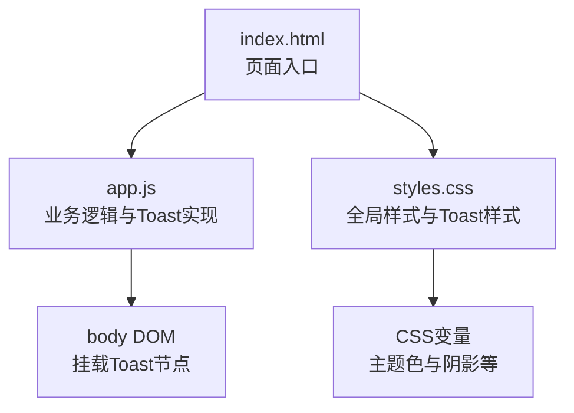
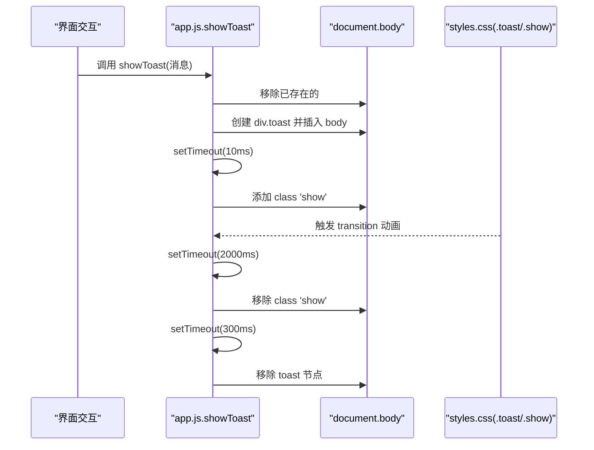
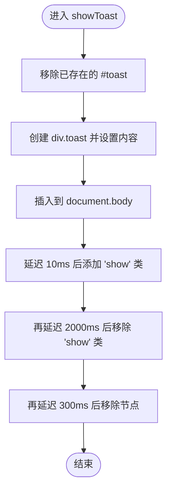
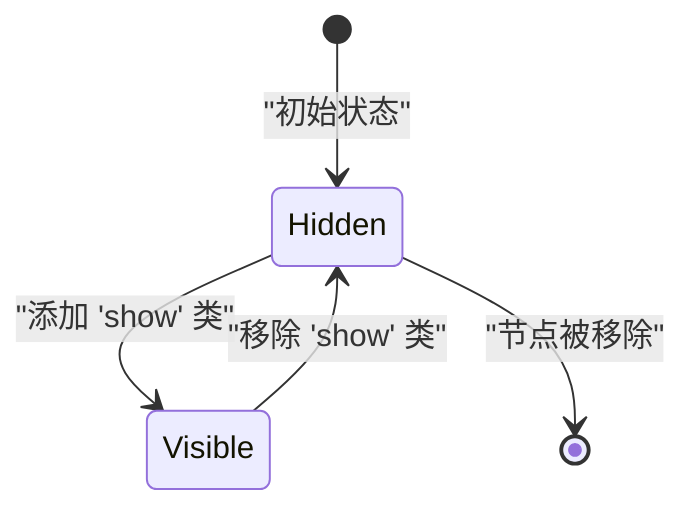
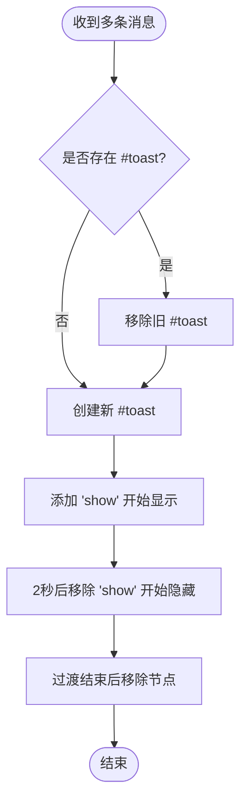
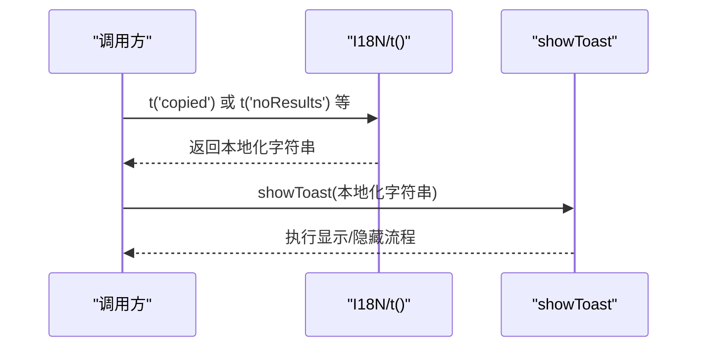
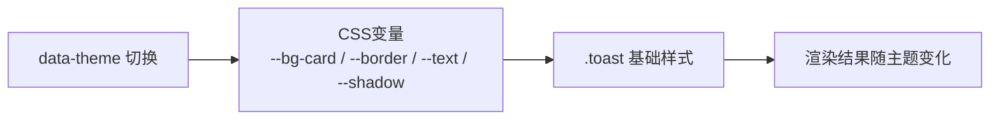
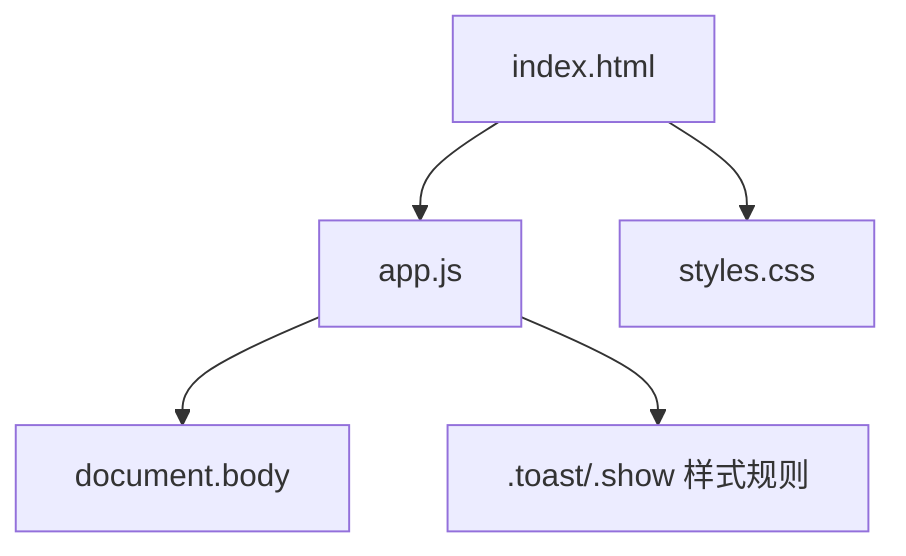

# Toast通知组件

<cite>
**本文引用的文件**   
- [web/app.js](file://web/app.js)
- [web/styles.css](file://web/styles.css)
- [web/index.html](file://web/index.html)
</cite>

## 目录
1. [简介](#简介)
2. [项目结构](#项目结构)
3. [核心组件](#核心组件)
4. [架构总览](#架构总览)
5. [详细组件分析](#详细组件分析)
6. [依赖关系分析](#依赖关系分析)
7. [性能考量](#性能考量)
8. [故障排查指南](#故障排查指南)
9. [结论](#结论)
10. [附录](#附录)

## 简介
本技术文档聚焦于仓库中的Toast通知组件，系统性说明其创建与销毁机制、动态DOM生命周期管理、显示/隐藏动画（CSS类切换与过渡）、消息队列处理逻辑（多Toast排队与自动清理）、国际化文本支持、样式定制接口与主题适配方案。文档同时提供代码级图示与调用时序，帮助读者快速理解并扩展该组件。

## 项目结构
Toast通知相关实现位于前端静态资源中：
- 逻辑层：web/app.js
- 样式层：web/styles.css
- 入口页：web/index.html（引入JS/CSS）

图表来源
- [web/index.html:1-20](file://web/index.html#L1-L20)
- [web/app.js:664-681](file://web/app.js#L664-L681)
- [web/styles.css:2110-2130](file://web/styles.css#L2110-L2130)

章节来源
- [web/index.html:1-20](file://web/index.html#L1-L20)
- [web/app.js:664-681](file://web/app.js#L664-L681)
- [web/styles.css:2110-2130](file://web/styles.css#L2110-L2130)

## 核心组件
- 函数：showToast(message)
  - 职责：创建并展示一条Toast消息，负责生命周期管理与动画控制。
- 样式：.toast 与 .toast.show
  - 职责：定义Toast的固定定位、外观、初始隐藏状态与显示过渡。
- 国际化：t(key) 与 I18N 字典
  - 职责：根据当前语言返回对应文案，供调用处传入message使用。

章节来源
- [web/app.js:664-681](file://web/app.js#L664-L681)
- [web/styles.css:2110-2130](file://web/styles.css#L2110-L2130)
- [web/app.js:38-191](file://web/app.js#L38-L191)

## 架构总览
下图展示了Toast从触发到销毁的完整流程，包括DOM创建、类名切换触发动画、定时器驱动的自动清理。

图表来源
- [web/app.js:664-681](file://web/app.js#L664-L681)
- [web/styles.css:2110-2130](file://web/styles.css#L2110-L2130)

## 详细组件分析

### 创建与销毁机制（动态DOM生命周期）
- 唯一性约束：每次调用前会尝试移除已存在的 #toast，确保同一时刻仅存在一个Toast节点。
- 创建步骤：
  - 新建元素，设置 id="toast"、class="toast"，写入消息文本。
  - 将元素追加至 document.body。
- 销毁步骤：
  - 在显示完成后，先移除 show 类以触发隐藏过渡。
  - 等待过渡时长后，从DOM中彻底移除节点，释放内存。

图表来源
- [web/app.js:664-681](file://web/app.js#L664-L681)

章节来源
- [web/app.js:664-681](file://web/app.js#L664-L681)

### 显示/隐藏动画（CSS类切换与过渡）
- 初始态：.toast 默认 opacity: 0，并通过 transform 进行轻微位移，配合 transition 实现淡入/淡出与滑入/滑出效果。
- 激活态：.toast.show 将 opacity 设为 1，并修正 transform 位置，形成“上移+渐显”的入场动画。
- 过渡时长：transition 统一为 0.3s ease，保证动画平滑一致。

图表来源
- [web/styles.css:2110-2130](file://web/styles.css#L2110-L2130)

章节来源
- [web/styles.css:2110-2130](file://web/styles.css#L2110-L2130)

### 消息队列与自动清理（多Toast处理）
- 当前实现：不支持并发多Toast。每次新消息到来时，会先移除已有 #toast，再创建新的Toast节点。因此旧消息会被立即中断并销毁，不会排队显示。
- 自动清理：通过多级setTimeout完成“显示→隐藏→移除”的自动化流程，无需外部干预。

图表来源
- [web/app.js:664-681](file://web/app.js#L664-L681)

章节来源
- [web/app.js:664-681](file://web/app.js#L664-L681)

### 国际化文本支持
- 语言包：I18N 对象维护了 zh/en 两套文案键值。
- 翻译函数：t(key) 根据 currentLang 返回对应文案，若缺失则回退到 key 本身。
- Toast文案：调用处根据当前语言选择中文或英文文案，作为 message 参数传入 showToast。

图表来源
- [web/app.js:38-191](file://web/app.js#L38-L191)
- [web/app.js:664-681](file://web/app.js#L664-L681)

章节来源
- [web/app.js:38-191](file://web/app.js#L38-L191)
- [web/app.js:664-681](file://web/app.js#L664-L681)

### 样式定制接口与主题适配
- 主题变量：通过 CSS 自定义属性（如 --bg-card、--border、--text、--shadow）驱动深色/浅色主题。Toast背景、边框、文字颜色均继承这些变量，随主题切换自动适配。
- 定位与层级：position: fixed + z-index: 2000，确保Toast始终浮于页面顶部区域且不被其他元素遮挡。
- 可定制点：
  - 尺寸与间距：padding、font-size、border-radius
  - 视觉风格：background、border、box-shadow
  - 动画参数：transition-duration、transform 偏移量
  - 主题适配：修改根变量即可影响所有组件，包括Toast

图表来源
- [web/styles.css:5-36](file://web/styles.css#L5-L36)
- [web/styles.css:2110-2130](file://web/styles.css#L2110-L2130)

章节来源
- [web/styles.css:5-36](file://web/styles.css#L5-L36)
- [web/styles.css:2110-2130](file://web/styles.css#L2110-L2130)

## 依赖关系分析
- app.js 依赖 styles.css 提供的 .toast 与 .toast.show 样式规则。
- app.js 依赖 index.html 引入的脚本与样式资源。
- showToast 内部依赖 document.body 作为挂载容器。

图表来源
- [web/index.html:1-20](file://web/index.html#L1-L20)
- [web/app.js:664-681](file://web/app.js#L664-L681)
- [web/styles.css:2110-2130](file://web/styles.css#L2110-L2130)

章节来源
- [web/index.html:1-20](file://web/index.html#L1-L20)
- [web/app.js:664-681](file://web/app.js#L664-L681)
- [web/styles.css:2110-2130](file://web/styles.css#L2110-L2130)

## 性能考量
- 单例策略：通过移除已有 #toast 避免重复节点累积，减少DOM压力。
- 动画开销：使用CSS transition而非JS动画，GPU友好，性能更优。
- 定时器链：多级setTimeout用于显示/隐藏/清理，注意在高频率触发场景下可能频繁重建节点；如需高频提示，建议引入队列与节流策略。

[本节为通用指导，不直接分析具体文件]

## 故障排查指南
- 问题：多次快速触发导致Toast闪烁或丢失
  - 原因：当前实现会立即移除旧Toast，未做排队。
  - 解决思路：引入消息队列，按顺序显示并保留历史消息；或在短时间内合并相同消息。
- 问题：Toast被其他弹窗遮挡
  - 检查z-index是否足够高，确认未被更高优先级的覆盖层拦截。
- 问题：主题切换后Toast颜色异常
  - 确认CSS变量是否正确更新，检查[data-theme]作用域是否生效。

章节来源
- [web/app.js:664-681](file://web/app.js#L664-L681)
- [web/styles.css:2110-2130](file://web/styles.css#L2110-L2130)

## 结论
当前Toast组件实现了简洁可靠的单条消息提示能力，具备清晰的创建/销毁生命周期、基于CSS类的过渡动画以及良好的主题适配。由于未内置消息队列，高频触发时会覆盖旧消息。若需支持多消息排队与自动清理，可在现有基础上扩展队列管理器与定时器调度逻辑。

[本节为总结性内容，不直接分析具体文件]

## 附录

### 关键API与调用示例路径
- 显示Toast
  - 实现位置：[web/app.js:664-681](file://web/app.js#L664-L681)
  - 典型调用（复制链接成功提示）：[web/app.js:659-662](file://web/app.js#L659-L662)
  - 筛选无结果提示：[web/app.js:1854](file://web/app.js#L1854)
  - 收藏状态反馈：[web/app.js:2038](file://web/app.js#L2038)
  - 语言未浏览提示：[web/app.js:2102](file://web/app.js#L2102)

- 国际化文案
  - 语言包与翻译函数：[web/app.js:38-191](file://web/app.js#L38-L191)

- 样式与主题
  - Toast样式：[web/styles.css:2110-2130](file://web/styles.css#L2110-L2130)
  - 主题变量与切换：[web/styles.css:5-36](file://web/styles.css#L5-L36)

章节来源
- [web/app.js:659-662](file://web/app.js#L659-L662)
- [web/app.js:1854](file://web/app.js#L1854)
- [web/app.js:2038](file://web/app.js#L2038)
- [web/app.js:2102](file://web/app.js#L2102)
- [web/app.js:38-191](file://web/app.js#L38-L191)
- [web/styles.css:2110-2130](file://web/styles.css#L2110-L2130)
- [web/styles.css:5-36](file://web/styles.css#L5-L36)