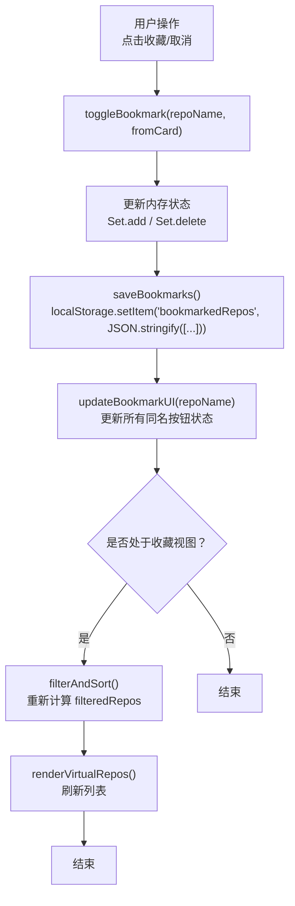
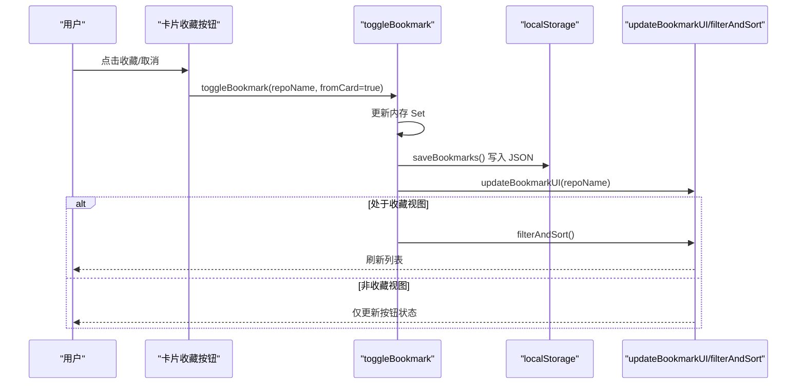
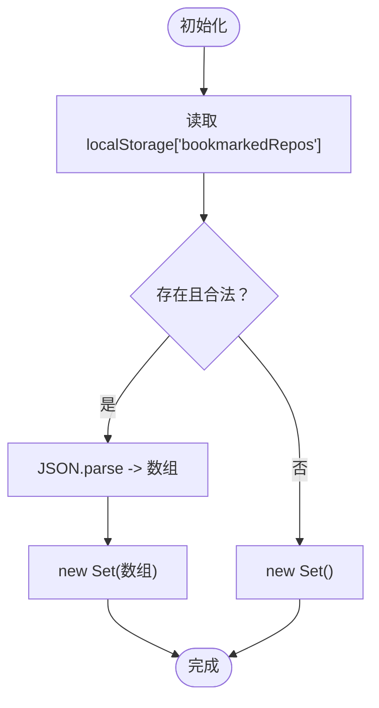
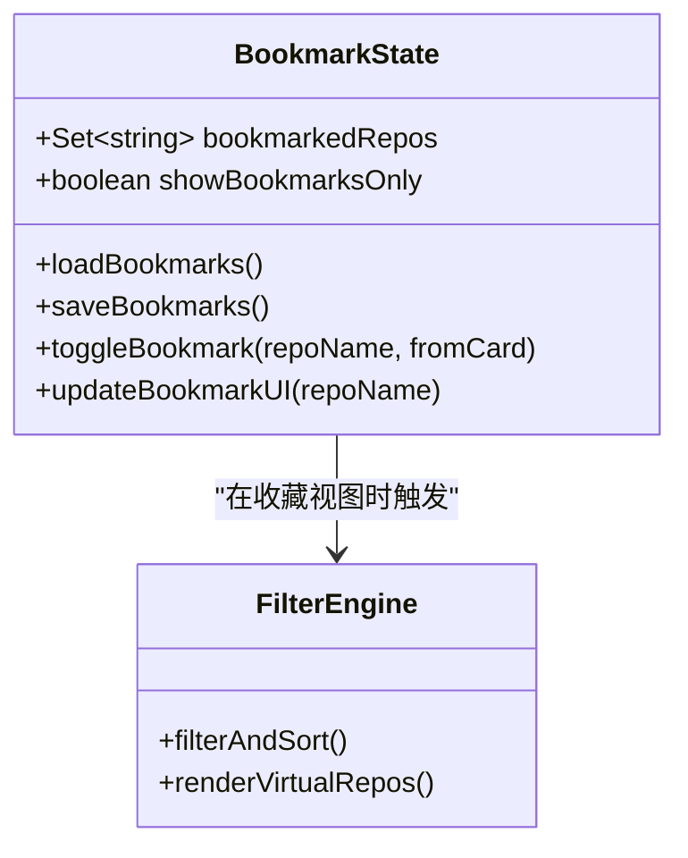
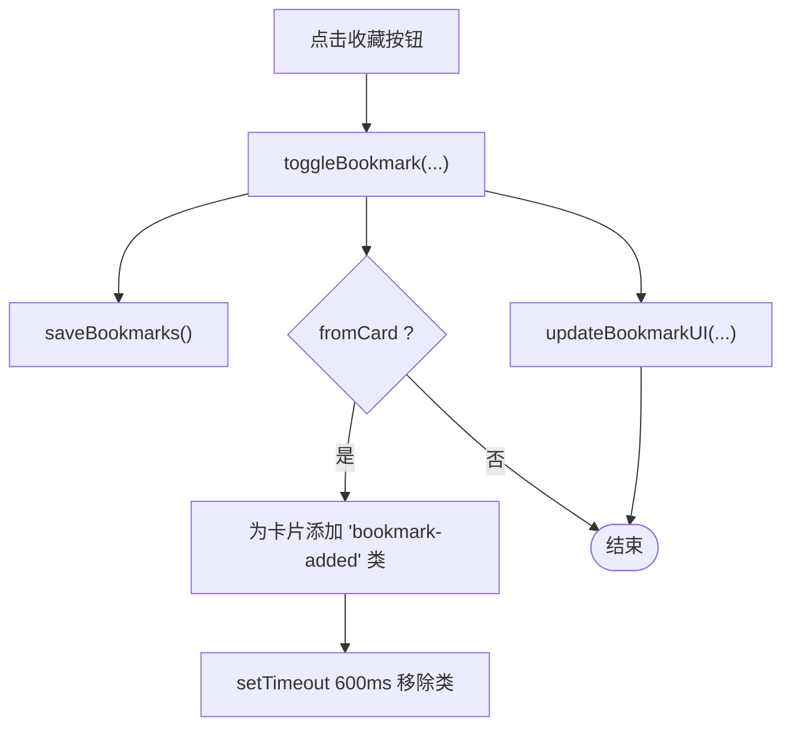
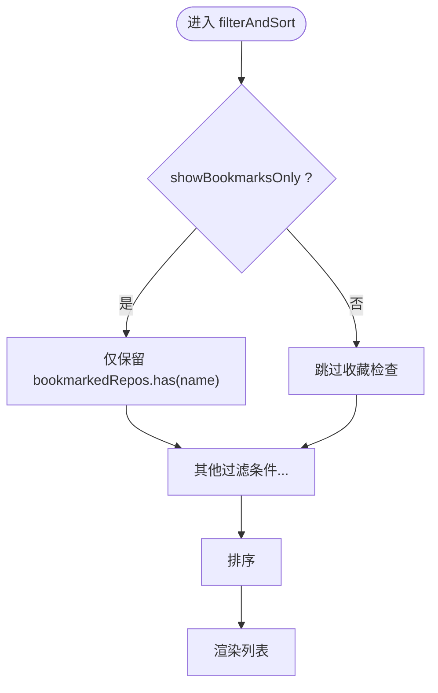
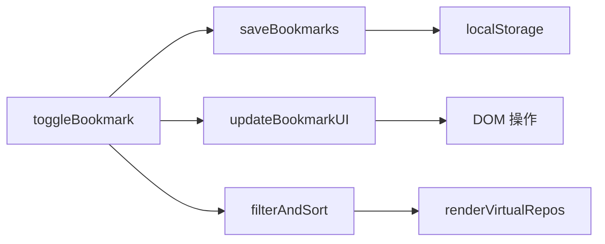

# 书签组件

<cite>
**本文引用的文件**   
- [web/app.js](file://web/app.js)
- [web/index.html](file://web/index.html)
- [web/styles.css](file://web/styles.css)
</cite>

## 目录
1. [简介](#简介)
2. [项目结构](#项目结构)
3. [核心组件](#核心组件)
4. [架构总览](#架构总览)
5. [详细组件分析](#详细组件分析)
6. [依赖关系分析](#依赖关系分析)
7. [性能考量](#性能考量)
8. [故障排查指南](#故障排查指南)
9. [结论](#结论)
10. [附录](#附录)

## 简介
本技术文档聚焦于“书签”功能，围绕以下目标展开：
- 本地存储机制：基于 localStorage 的书签数据持久化与序列化策略
- 状态双向同步：UI 状态与持久化数据的一致性保证
- 动画反馈：卡片添加动画、按钮状态变化等交互体验
- 视图过滤逻辑：仅显示收藏项目的筛选算法
- 错误处理与数据迁移：异常捕获、降级策略与兼容性考虑

该功能由前端单页应用实现，核心逻辑集中在 web/app.js，界面结构与样式分别位于 web/index.html 与 web/styles.css。

## 项目结构
书签相关的关键位置：
- 数据与状态：在 app.js 中维护内存中的 Set 集合（bookmarkedRepos）以及全局开关（showBookmarksOnly）
- 本地存储：通过 localStorage 读写 JSON 字符串，键名为 bookmarkedRepos
- UI 交互：卡片上的收藏按钮、顶部“我的收藏”切换按钮、详情弹窗中的收藏按钮
- 过滤渲染：filterAndSort 根据 showBookmarksOnly 与 bookmarkedRepos 进行筛选
- 动画与样式：styles.css 定义收藏按钮样式、激活态、弹出动画等

图表来源
- [web/app.js:293-329](file://web/app.js#L293-L329)
- [web/app.js:1026-1059](file://web/app.js#L1026-L1059)
- [web/app.js:874-903](file://web/app.js#L874-L903)

章节来源
- [web/app.js:293-329](file://web/app.js#L293-L329)
- [web/app.js:1026-1059](file://web/app.js#L1026-L1059)
- [web/app.js:874-903](file://web/app.js#L874-L903)

## 核心组件
- 书签状态容器
  - 使用 Set 保存已收藏仓库名，避免重复并支持 O(1) 查找
  - 提供加载与保存方法，将 Set 序列化为数组后写入 localStorage
- 书签切换流程
  - 切换时先修改内存状态，再持久化，最后更新 UI；若处于收藏视图则触发重过滤
- 书签视图过滤
  - filterAndSort 在条件链中优先判断 showBookmarksOnly，仅保留已收藏项
- 动画与视觉反馈
  - 新增收藏时给卡片添加临时类以触发缩放动画
  - 收藏按钮在 hover 与选中态下有不同的填充与边框颜色
- 导出与批量操作
  - 支持导出当前收藏为 JSON 文件；批量选择后可一键收藏全部

章节来源
- [web/app.js:293-329](file://web/app.js#L293-L329)
- [web/app.js:1026-1059](file://web/app.js#L1026-L1059)
- [web/app.js:1092-1105](file://web/app.js#L1092-L1105)
- [web/app.js:1571-1579](file://web/app.js#L1571-L1579)
- [web/styles.css:954-1001](file://web/styles.css#L954-L1001)
- [web/styles.css:1006-1036](file://web/styles.css#L1006-L1036)
- [web/styles.css:1200-1209](file://web/styles.css#L1200-L1209)

## 架构总览
书签子系统与整体应用的交互关系如下：
- 事件层：卡片收藏按钮、顶部收藏视图切换、键盘快捷键 Space/B 等
- 控制层：toggleBookmark、saveBookmarks、updateBookmarkUI、filterAndSort
- 视图层：createCard 渲染收藏按钮初始状态；renderVirtualRepos 渲染列表
- 存储层：localStorage 读写 JSON 字符串

图表来源
- [web/app.js:1141-1185](file://web/app.js#L1141-L1185)
- [web/app.js:293-329](file://web/app.js#L293-L329)
- [web/app.js:1026-1059](file://web/app.js#L1026-L1059)

## 详细组件分析

### 本地存储机制（localStorage 与序列化）
- 读取
  - 启动时从 localStorage 读取键 'bookmarkedRepos'，解析为数组并重建 Set
  - 解析失败时回退为空 Set，确保页面可正常渲染
- 写入
  - 将 Set 转为数组后 JSON.stringify 写入 localStorage
- 键名与格式
  - 键名：'bookmarkedRepos'
  - 值：字符串化的数组，元素为仓库全名（如 'owner/repo'）

图表来源
- [web/app.js:293-302](file://web/app.js#L293-L302)
- [web/app.js:304-306](file://web/app.js#L304-L306)

章节来源
- [web/app.js:293-306](file://web/app.js#L293-L306)

### 状态双向同步（UI 与持久化一致性）
- 变更路径
  - 点击收藏按钮或弹窗收藏按钮 -> toggleBookmark -> 更新内存 Set -> 持久化 -> 更新 UI
- 多入口一致
  - 卡片收藏按钮、弹窗收藏按钮、灵感模式收藏按钮均调用同一函数
  - 键盘快捷键 Space 也委托到同一函数
- UI 更新范围
  - 更新所有同 repo 名的收藏按钮（含卡片与弹窗）
  - 若处于收藏视图，立即重算过滤结果并刷新列表
- URL 分享参数
  - 当处于收藏视图时，URL 会包含 bookmarks=1，便于分享与恢复

图表来源
- [web/app.js:293-329](file://web/app.js#L293-L329)
- [web/app.js:1026-1059](file://web/app.js#L1026-L1059)
- [web/app.js:1351-1370](file://web/app.js#L1351-L1370)

章节来源
- [web/app.js:293-329](file://web/app.js#L293-L329)
- [web/app.js:1026-1059](file://web/app.js#L1026-L1059)
- [web/app.js:1351-1370](file://web/app.js#L1351-L1370)

### 书签切换的动画反馈效果
- 卡片添加动画
  - 新增收藏时，为对应卡片添加临时类，触发 0.3s 缩放弹跳动画
  - 动画结束后移除类，避免影响后续交互
- 按钮状态变化
  - 默认隐藏收藏按钮，hover 时显示
  - 已收藏状态下按钮常驻显示，图标填充色与边框高亮
  - 顶部“我的收藏”按钮在激活态有背景与边框高亮

图表来源
- [web/app.js:308-329](file://web/app.js#L308-L329)
- [web/styles.css:1200-1209](file://web/styles.css#L1200-L1209)
- [web/styles.css:954-1001](file://web/styles.css#L954-L1001)
- [web/styles.css:1006-1036](file://web/styles.css#L1006-L1036)

章节来源
- [web/app.js:308-329](file://web/app.js#L308-L329)
- [web/styles.css:954-1001](file://web/styles.css#L954-L1001)
- [web/styles.css:1006-1036](file://web/styles.css#L1006-L1036)
- [web/styles.css:1200-1209](file://web/styles.css#L1200-L1209)

### 书签视图的过滤逻辑（只显示收藏项目）
- 过滤入口
  - filterAndSort 在条件链中首先检查 showBookmarksOnly，若为真且未收藏则直接过滤掉
- 排序与渲染
  - 过滤完成后按所选维度排序，随后渲染虚拟列表
- 视图切换
  - 点击“我的收藏”按钮或按下快捷键 B 切换 showBookmarksOnly，并立即重算

图表来源
- [web/app.js:1026-1059](file://web/app.js#L1026-L1059)
- [web/app.js:1128-1133](file://web/app.js#L1128-L1133)
- [web/app.js:1286-1291](file://web/app.js#L1286-L1291)

章节来源
- [web/app.js:1026-1059](file://web/app.js#L1026-L1059)
- [web/app.js:1128-1133](file://web/app.js#L1128-L1133)
- [web/app.js:1286-1291](file://web/app.js#L1286-L1291)

### 具体错误处理机制
- 读取异常保护
  - 读取 localStorage 时包裹 try/catch，解析失败则回退为空集合，避免崩溃
- 空数据提示
  - 当无收藏项目时，收藏视图显示友好文案
- 网络与数据加载错误
  - 数据加载失败时给出重试按钮与运行指引，不影响书签功能可用性

章节来源
- [web/app.js:293-302](file://web/app.js#L293-L302)
- [web/app.js:862-869](file://web/app.js#L862-L869)
- [web/app.js:428-453](file://web/app.js#L428-L453)

### 数据迁移策略
- 兼容旧数据
  - 读取时尝试解析，失败则清空集合，保证新数据结构可用
- 版本演进建议
  - 可在读取阶段增加版本号字段校验与转换逻辑，例如对历史数据进行去重、规范化仓库名等
  - 建议在写入前做一次轻量级清洗，减少未来迁移成本

章节来源
- [web/app.js:293-302](file://web/app.js#L293-L302)

## 依赖关系分析
- 模块内依赖
  - toggleBookmark 依赖 saveBookmarks 与 updateBookmarkUI
  - updateBookmarkUI 依赖 DOM 查询与类名切换
  - filterAndSort 依赖 showBookmarksOnly 与 bookmarkedRepos
- 外部依赖
  - localStorage API
  - DOM API（querySelectorAll、classList、innerHTML 等）
- 耦合与内聚
  - 书签逻辑集中，内聚度高；与渲染逻辑通过函数调用解耦，便于测试与维护

图表来源
- [web/app.js:293-329](file://web/app.js#L293-L329)
- [web/app.js:1026-1059](file://web/app.js#L1026-L1059)
- [web/app.js:874-903](file://web/app.js#L874-L903)

章节来源
- [web/app.js:293-329](file://web/app.js#L293-L329)
- [web/app.js:1026-1059](file://web/app.js#L1026-L1059)
- [web/app.js:874-903](file://web/app.js#L874-L903)

## 性能考量
- 时间复杂度
  - 切换收藏：O(1) 集合操作 + O(n) 遍历同名按钮更新（n 为同名按钮数量，通常很小）
  - 收藏视图过滤：O(m) 遍历 m 个候选项
- 空间复杂度
  - 内存中 Set 大小等于收藏数，localStorage 存储为字符串化数组
- 渲染优化
  - 大数据量时使用虚拟滚动，仅渲染可视区域，降低重排开销
- 建议
  - 若同名按钮过多，可缓存其引用或使用更精确的选择器以减少遍历
  - 对频繁更新的 UI 可使用 requestAnimationFrame 批处理

[本节为通用指导，不直接分析具体文件]

## 故障排查指南
- 现象：收藏后刷新页面丢失
  - 检查浏览器是否禁用 localStorage 或存储空间不足
  - 确认键名是否为 'bookmarkedRepos'
- 现象：收藏按钮状态不同步
  - 确认是否调用了 updateBookmarkUI 且选择器匹配 data-repo
  - 检查是否存在多个同名仓库导致误匹配
- 现象：收藏视图无结果
  - 确认 showBookmarksOnly 状态与 URL 参数 bookmarks=1 是否一致
  - 检查 filterAndSort 是否正确执行
- 现象：动画不生效
  - 确认 CSS 类名 'bookmark-added' 与关键帧定义是否存在
  - 检查浏览器是否支持相应动画属性

章节来源
- [web/app.js:293-329](file://web/app.js#L293-L329)
- [web/app.js:1026-1059](file://web/app.js#L1026-L1059)
- [web/styles.css:1200-1209](file://web/styles.css#L1200-L1209)

## 结论
书签组件通过简洁的状态管理与清晰的职责划分，实现了可靠的本地持久化、一致的双向同步、流畅的动画反馈与高效的过滤渲染。结合完善的错误处理与可扩展的数据迁移策略，具备良好的稳定性与可维护性。

[本节为总结性内容，不直接分析具体文件]

## 附录
- 相关 HTML 节点
  - 收藏视图切换按钮：id="bookmarkToggle"
  - 导出收藏按钮：id="exportBookmarks"
  - 详情弹窗收藏按钮：id="modalBookmark"
- 相关 CSS 类
  - 卡片收藏按钮：.card-bookmark
  - 收藏视图按钮：.bookmark-toggle
  - 收藏动画：@keyframes bookmarkPop 与 .repo-card.bookmark-added

章节来源
- [web/index.html:96-108](file://web/index.html#L96-L108)
- [web/index.html:229-233](file://web/index.html#L229-L233)
- [web/styles.css:954-1001](file://web/styles.css#L954-L1001)
- [web/styles.css:1006-1036](file://web/styles.css#L1006-L1036)
- [web/styles.css:1200-1209](file://web/styles.css#L1200-L1209)