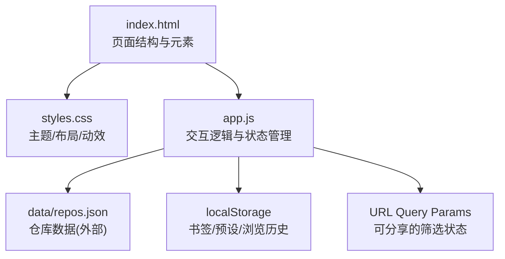
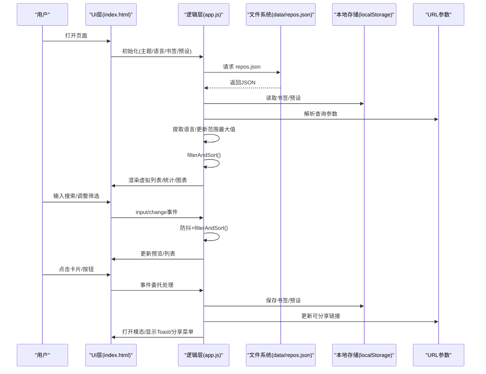
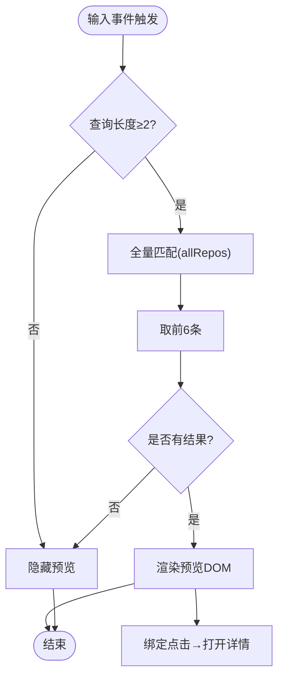
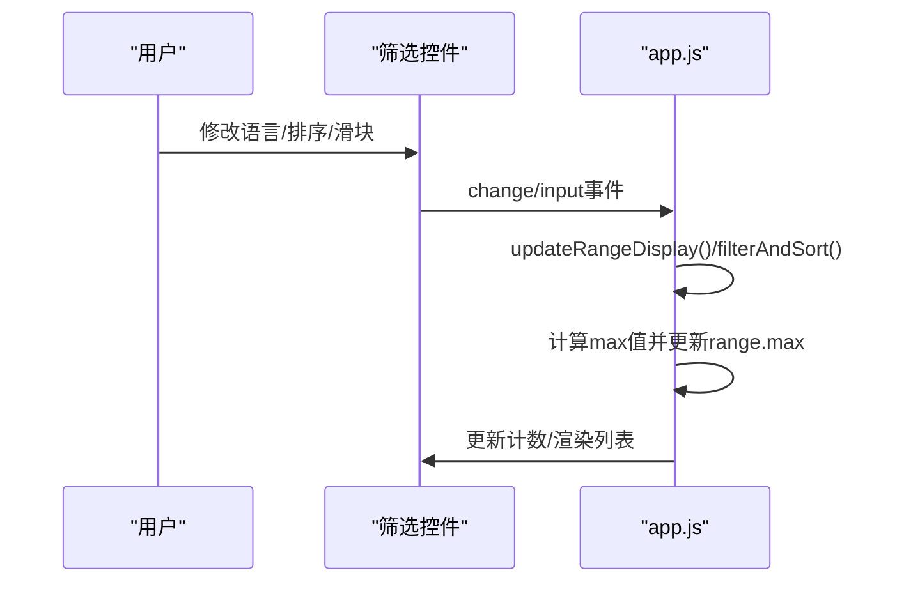
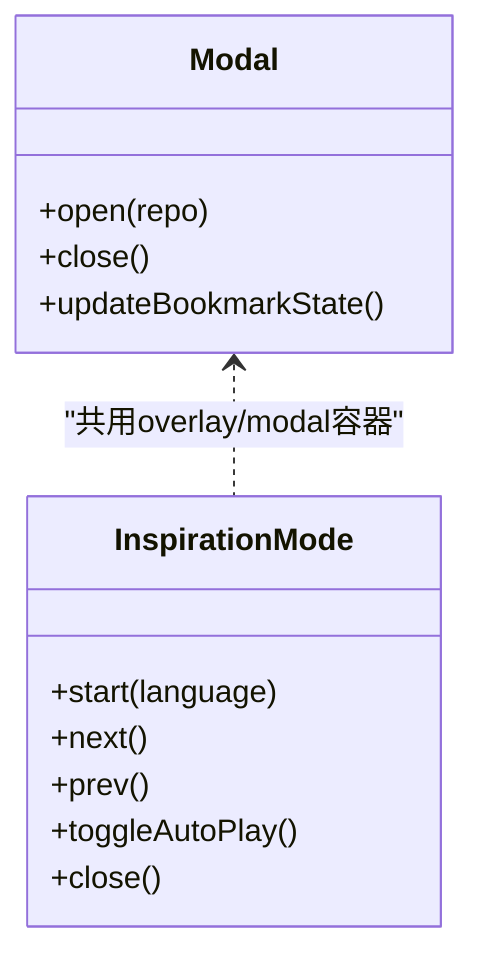
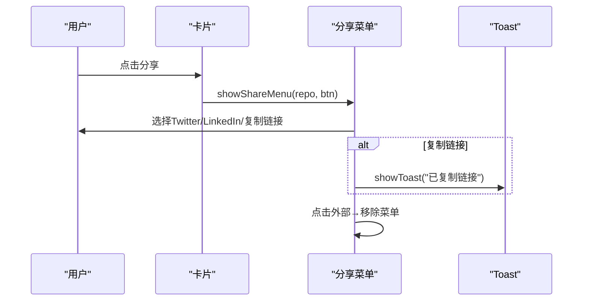
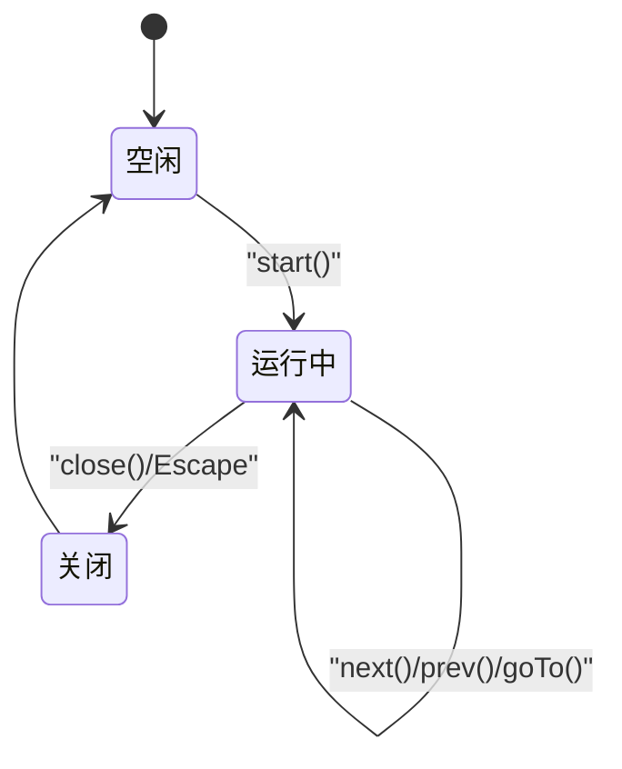
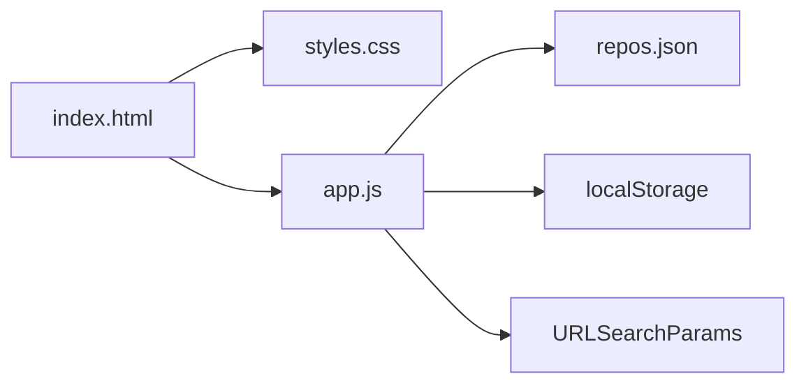

# 交互组件系统

<cite>
**本文引用的文件**   
- [web/app.js](file://web/app.js)
- [web/index.html](file://web/index.html)
- [web/styles.css](file://web/styles.css)
- [README.md](file://README.md)
</cite>

## 目录
1. [简介](#简介)
2. [项目结构](#项目结构)
3. [核心组件](#核心组件)
4. [架构总览](#架构总览)
5. [详细组件分析](#详细组件分析)
6. [依赖关系分析](#依赖关系分析)
7. [性能考量](#性能考量)
8. [故障排查指南](#故障排查指南)
9. [结论](#结论)
10. [附录](#附录)

## 简介
本技术文档聚焦于仓库前端交互组件系统，围绕以下能力进行系统化说明：
- 搜索框组件：实时预览、防抖处理与键盘导航
- 筛选器组件：语言筛选、排序选项与范围滑块的用户交互逻辑
- 模态框组件：打开/关闭动画、焦点管理与键盘事件处理
- 辅助交互组件：分享菜单、Toast 通知等（未实现独立“工具提示”组件）
- 事件绑定模式与用户反馈机制

该应用采用原生 HTML/CSS/JS 构建，无构建步骤，通过 Service Worker 提供 PWA 离线支持。

## 项目结构
前端代码位于 web 目录，包含入口页面、样式与主逻辑脚本；数据由后端脚本生成后以静态 JSON 形式提供。

图表来源
- [web/index.html:1-284](file://web/index.html#L1-L284)
- [web/styles.css:1-800](file://web/styles.css#L1-L800)
- [web/app.js:1-200](file://web/app.js#L1-L200)

章节来源
- [web/index.html:1-284](file://web/index.html#L1-L284)
- [web/styles.css:1-800](file://web/styles.css#L1-L800)
- [web/app.js:1-200](file://web/app.js#L1-L200)
- [README.md:123-148](file://README.md#L123-L148)

## 核心组件
- 搜索框与实时预览：输入时即时匹配并展示前若干结果，点击可直接打开详情
- 筛选器面板：语言下拉、排序下拉、Stars/Forks/评分范围滑块，支持一键重置
- 模态框：项目详情、对比视图、智能推荐、灵感模式、键盘快捷键帮助等复用同一容器
- 辅助组件：分享菜单、Toast 通知、批量选择栏、对比栏、标签分类按钮
- 键盘导航：全局快捷键、卡片网格方向键导航、灵感模式手势与键盘控制

章节来源
- [web/app.js:1108-1185](file://web/app.js#L1108-L1185)
- [web/app.js:1246-1346](file://web/app.js#L1246-L1346)
- [web/app.js:731-787](file://web/app.js#L731-L787)
- [web/app.js:1026-1076](file://web/app.js#L1026-L1076)
- [web/app.js:683-729](file://web/app.js#L683-L729)
- [web/app.js:664-681](file://web/app.js#L664-L681)

## 架构总览
整体为单页应用，数据加载后在内存中维护 allRepos、filteredRepos 等状态，所有交互均基于 DOM 事件驱动与局部渲染更新。

图表来源
- [web/app.js:401-453](file://web/app.js#L401-L453)
- [web/app.js:1026-1076](file://web/app.js#L1026-L1076)
- [web/app.js:1350-1403](file://web/app.js#L1350-L1403)
- [web/app.js:1108-1185](file://web/app.js#L1108-L1185)

## 详细组件分析

### 搜索框组件（含实时预览与防抖）
- 实时预览
  - 监听输入事件，当查询长度≥2时，从 allRepos 中按名称/描述模糊匹配，最多展示6条
  - 每条预览项包含语言图标、名称、描述片段与 Stars，点击后直接打开对应项目详情
- 防抖处理
  - 使用通用 debounce(fn, delay) 包装 filterAndSort，避免频繁过滤造成卡顿
- 键盘导航
  - 全局快捷键 “/” 聚焦搜索框
  - 配合卡片网格的上下左右导航，Enter 打开详情

图表来源
- [web/app.js:731-787](file://web/app.js#L731-L787)
- [web/app.js:1078-1084](file://web/app.js#L1078-L1084)
- [web/app.js:1110-1113](file://web/app.js#L1110-L1113)
- [web/app.js:1279-1282](file://web/app.js#L1279-L1282)

章节来源
- [web/app.js:731-787](file://web/app.js#L731-L787)
- [web/app.js:1078-1084](file://web/app.js#L1078-L1084)
- [web/app.js:1110-1113](file://web/app.js#L1110-L1113)
- [web/app.js:1279-1282](file://web/app.js#L1279-L1282)

### 筛选器组件（语言/排序/范围滑块）
- 语言筛选
  - 动态从 allRepos 提取唯一语言集合，填充下拉框，支持“全部”
- 排序选项
  - 综合评分、Stars、Forks、今日增长、飙升指数（today_stars/stars）
- 范围滑块
  - Stars/Forks/评分三个 range 控件，根据数据最大值动态设置 max 与 step
  - 拖动时实时更新数值显示并触发过滤
- 重置
  - 一键清空所有筛选条件并恢复默认排序

图表来源
- [web/app.js:832-857](file://web/app.js#L832-L857)
- [web/app.js:1026-1076](file://web/app.js#L1026-L1076)
- [web/app.js:1114-1126](file://web/app.js#L1114-L1126)

章节来源
- [web/app.js:832-857](file://web/app.js#L832-L857)
- [web/app.js:1026-1076](file://web/app.js#L1026-L1076)
- [web/app.js:1114-1126](file://web/app.js#L1114-L1126)

### 模态框组件（打开/关闭动画、焦点与键盘）
- 打开/关闭动画
  - 通过 overlay 的 active 类切换透明度与可见性，内容区使用 transform scale/translate 过渡
- 焦点管理
  - 打开时将 body overflow 设为 hidden，关闭时恢复
  - 点击遮罩或关闭按钮均可关闭
- 键盘事件
  - 全局 Escape 关闭模态
  - 在“键盘快捷键帮助”、“对比视图”、“智能推荐”、“灵感模式”等不同模式下，复用同一容器并动态替换内容
- 多用途复用
  - 详情、对比、推荐、灵感模式、帮助等均通过 openModal/closeModal 或 InspirationMode 控制

图表来源
- [web/app.js:349-399](file://web/app.js#L349-L399)
- [web/app.js:789-830](file://web/app.js#L789-L830)
- [web/app.js:1187-1193](file://web/app.js#L1187-L1193)
- [web/app.js:1268-1346](file://web/app.js#L1268-L1346)
- [web/app.js:1830-2616](file://web/app.js#L1830-L2616)

章节来源
- [web/app.js:349-399](file://web/app.js#L349-L399)
- [web/app.js:789-830](file://web/app.js#L789-L830)
- [web/app.js:1187-1193](file://web/app.js#L1187-L1193)
- [web/app.js:1268-1346](file://web/app.js#L1268-L1346)
- [web/app.js:1830-2616](file://web/app.js#L1830-L2616)

### 辅助交互组件
- 分享菜单
  - 点击卡片分享按钮弹出定位到按钮下方的菜单，支持 Twitter/X、LinkedIn、复制链接
  - 点击外部区域自动收起
- Toast 通知
  - 统一在页面底部居中显示，带淡入/淡出动画，用于复制成功、收藏状态等轻量反馈
- 批量选择栏/对比栏
  - 选中多个项目后出现底部操作栏，支持批量收藏/导出/清空
  - 对比栏支持选择两个项目进行指标对比

图表来源
- [web/app.js:683-729](file://web/app.js#L683-L729)
- [web/app.js:664-681](file://web/app.js#L664-L681)
- [web/app.js:1539-1596](file://web/app.js#L1539-L1596)
- [web/app.js:1405-1437](file://web/app.js#L1405-L1437)

章节来源
- [web/app.js:683-729](file://web/app.js#L683-L729)
- [web/app.js:664-681](file://web/app.js#L664-L681)
- [web/app.js:1539-1596](file://web/app.js#L1539-L1596)
- [web/app.js:1405-1437](file://web/app.js#L1405-L1437)

### 灵感模式（全屏滑动/键盘/自动播放）
- 状态与持久化
  - 记录已浏览项目、当前位置、语言筛选，写入 localStorage
- 交互方式
  - 键盘：← → 翻页、Space 收藏、Enter 打开 GitHub、F 翻转、T 分享、P 自动播放、U/R 撤销/重做、Home/End 首尾、Esc 关闭
  - 触摸：滑动手势触发翻页，带旋转/缩放指示
  - 自动播放：定时翻页，到达末尾停止
- 无障碍
  - aria-live 区域播报当前进度与状态
  - 按钮具备 aria-label/aria-pressed 等属性

图表来源
- [web/app.js:1830-2616](file://web/app.js#L1830-L2616)

章节来源
- [web/app.js:1830-2616](file://web/app.js#L1830-L2616)

## 依赖关系分析
- 模块耦合
  - app.js 集中管理状态与事件，通过 DOM ID 与 index.html 强耦合
  - styles.css 提供主题变量与组件样式，被 app.js 通过类名引用
- 外部依赖
  - data/repos.json 为数据源，fetch 失败会回退重试并给出友好错误提示
  - localStorage 用于书签、预设、灵感模式状态
  - URL 查询参数用于分享筛选状态
- 潜在循环
  - 未发现循环依赖；事件委托集中在 repoGrid 与 modalOverlay

图表来源
- [web/app.js:401-453](file://web/app.js#L401-L453)
- [web/app.js:1350-1403](file://web/app.js#L1350-L1403)

章节来源
- [web/app.js:401-453](file://web/app.js#L401-L453)
- [web/app.js:1350-1403](file://web/app.js#L1350-L1403)

## 性能考量
- 虚拟滚动
  - 当结果数 > 100 时启用虚拟列表，仅渲染可视区域及缓冲项，提升长列表滚动性能
- 防抖
  - 搜索输入与滚动事件使用 debounce，降低高频回调开销
- 预渲染与缓存
  - 语言图标 SVG 常量缓存，避免重复创建
  - 灵感模式对相邻卡片进行占位预加载（预留接口）
- 动画优化
  - 大量使用 transform/opacity 与 will-change，减少重排重绘

章节来源
- [web/app.js:874-925](file://web/app.js#L874-L925)
- [web/app.js:1348](file://web/app.js#L1348)
- [web/app.js:16-36](file://web/app.js#L16-L36)
- [web/styles.css:2198-2207](file://web/styles.css#L2198-L2207)

## 故障排查指南
- 无法加载数据
  - 现象：页面显示“无法加载数据”，并提供本地服务启动命令
  - 原因：浏览器 file:// 协议下 fetch 受限
  - 解决：通过本地 HTTP 服务器访问
- API 速率限制
  - 现象：抓取失败或数据缺失
  - 解决：配置 GITHUB_TOKEN 环境变量提高配额
- 书签/预设丢失
  - 检查浏览器隐私模式或清除站点数据导致 localStorage 失效

章节来源
- [web/app.js:428-453](file://web/app.js#L428-L453)
- [README.md:166-171](file://README.md#L166-L171)

## 结论
该交互组件系统以极简的前端栈实现了丰富的用户体验：实时搜索预览、多维筛选、模态框复用、分享与通知、以及高完成度的灵感模式。通过虚拟滚动与防抖策略保障了大数据量下的流畅度，并通过 URL 参数与 localStorage 实现了状态可分享与可恢复。建议后续可考虑引入更完善的 Tooltip 组件与更细粒度的无障碍测试，进一步提升可访问性与一致性。

## 附录
- 键盘快捷键速查
  - / 聚焦搜索、T 切换主题、B 书签视图、L 切换语言、? 帮助、↑↓←→ 导航、Enter 打开、Space 收藏、C 加入对比、← → 灵感模式翻页、P 自动播放、F 翻转卡片

章节来源
- [README.md:79-95](file://README.md#L79-L95)
- [web/app.js:1268-1346](file://web/app.js#L1268-L1346)
- [web/app.js:2541-2603](file://web/app.js#L2541-L2603)