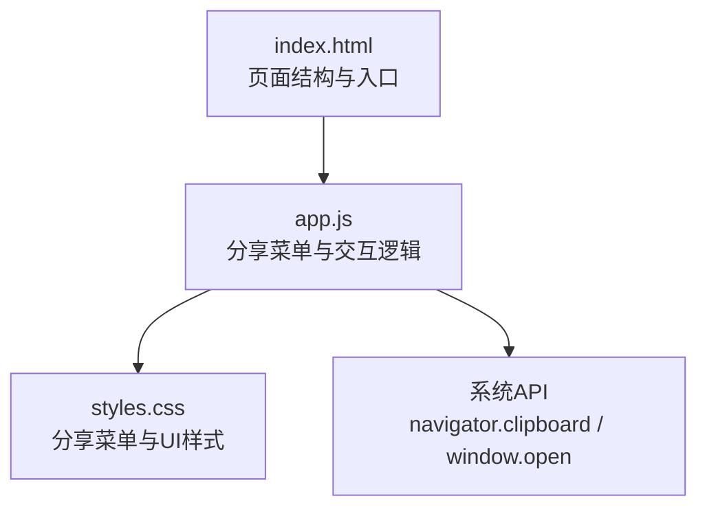
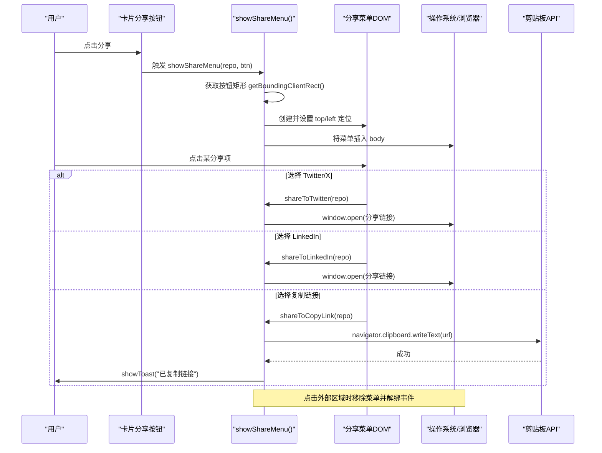
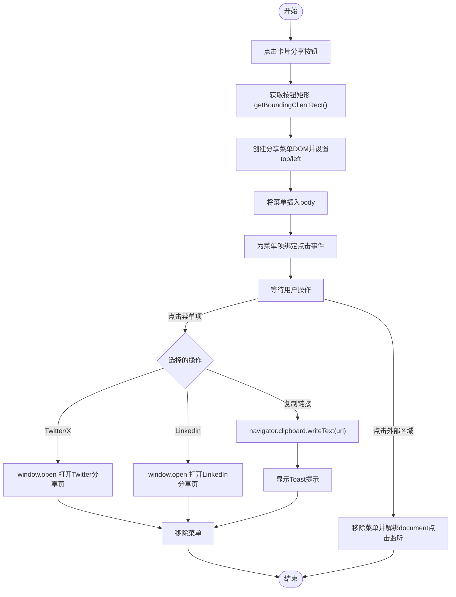
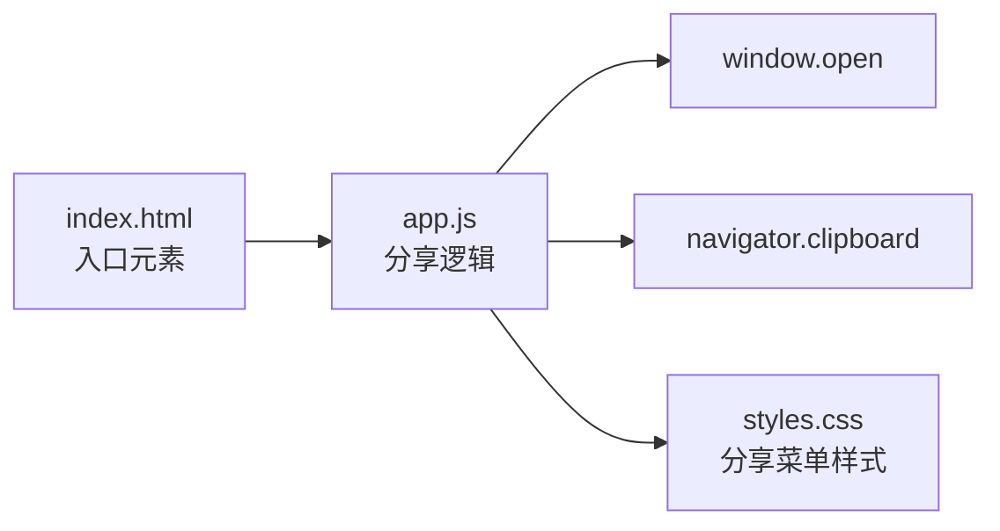

# 分享组件

<cite>
**本文引用的文件**   
- [web/app.js](file://web/app.js)
- [web/styles.css](file://web/styles.css)
- [web/index.html](file://web/index.html)
</cite>

## 目录
1. [简介](#简介)
2. [项目结构](#项目结构)
3. [核心组件](#核心组件)
4. [架构总览](#架构总览)
5. [详细组件分析](#详细组件分析)
6. [依赖关系分析](#依赖关系分析)
7. [性能考量](#性能考量)
8. [故障排查指南](#故障排查指南)
9. [结论](#结论)
10. [附录](#附录)

## 简介
本技术文档聚焦于“分享组件”的实现与使用，覆盖以下关键点：
- 分享菜单的动态定位逻辑（相对于触发按钮的位置计算与边界检测）
- 多种分享渠道实现（Twitter/X、LinkedIn、复制链接）
- 菜单显示/隐藏控制（点击外部区域自动关闭、事件冒泡处理）
- 剪贴板 API 的使用与权限处理
- 跨浏览器兼容性与移动端适配方案

该分享功能在仓库前端页面中通过卡片上的分享按钮触发，弹出包含多个分享选项的浮动菜单。

## 项目结构
分享相关代码主要分布在三个文件中：
- web/index.html：页面结构与入口元素（如分享按钮、详情弹窗等）
- web/app.js：分享菜单渲染、定位、事件绑定、分享渠道逻辑、剪贴板操作
- web/styles.css：分享菜单、分享按钮、Toast 通知等样式

图表来源
- [web/index.html:1-284](file://web/index.html#L1-L284)
- [web/app.js:646-729](file://web/app.js#L646-L729)
- [web/styles.css:2022-2130](file://web/styles.css#L2022-L2130)

章节来源
- [web/index.html:1-284](file://web/index.html#L1-L284)
- [web/app.js:646-729](file://web/app.js#L646-L729)
- [web/styles.css:2022-2130](file://web/styles.css#L2022-L2130)

## 核心组件
- 分享触发按钮：位于每个仓库卡片的右上角，鼠标悬停时可见
- 分享菜单：动态创建的固定定位浮层，包含 Twitter/X、LinkedIn、复制链接三项
- 分享渠道函数：分别负责打开社交平台分享页或调用剪贴板写入
- Toast 提示：用于反馈复制成功等状态

章节来源
- [web/app.js:958-964](file://web/app.js#L958-L964)
- [web/app.js:682-729](file://web/app.js#L682-L729)
- [web/app.js:646-662](file://web/app.js#L646-L662)
- [web/styles.css:2022-2130](file://web/styles.css#L2022-L2130)

## 架构总览
分享功能的整体流程如下：
- 用户点击卡片分享按钮
- 根据按钮位置计算并渲染分享菜单
- 监听菜单项点击执行对应分享动作
- 监听 document 点击以支持点击外部区域关闭菜单
- 复制链接时调用剪贴板 API 并展示 Toast

图表来源
- [web/app.js:1166-1175](file://web/app.js#L1166-L1175)
- [web/app.js:682-729](file://web/app.js#L682-L729)
- [web/app.js:646-662](file://web/app.js#L646-L662)

## 详细组件分析

### 分享菜单动态定位与边界检测
- 定位策略
  - 使用触发按钮的 getBoundingClientRect() 获取其相对视口的位置
  - 将菜单设置为 fixed 定位，top 为按钮底部 + 间距，left 对齐按钮左侧
- 边界检测
  - 当前实现未进行边界检测与自适应翻转，若按钮靠近视口右侧或底部，菜单可能溢出屏幕
- 建议改进
  - 在渲染后测量菜单尺寸与视口大小，必要时调整 left/top 使其完全可见
  - 当菜单右边缘超出视口时，可改为 right 对齐到按钮右侧，或向左偏移

章节来源
- [web/app.js:705-708](file://web/app.js#L705-L708)
- [web/styles.css:2067-2077](file://web/styles.css#L2067-L2077)

### 分享渠道实现
- Twitter/X 分享
  - 构造文本与目标 URL 参数，调用 window.open 打开 Twitter 分享页
- LinkedIn 分享
  - 构造目标 URL 参数，调用 window.open 打开 LinkedIn 分享页
- 复制链接
  - 使用 navigator.clipboard.writeText 写入目标 URL，成功后通过 Toast 提示

章节来源
- [web/app.js:646-662](file://web/app.js#L646-L662)
- [web/app.js:682-729](file://web/app.js#L682-L729)

### 菜单显示/隐藏控制与事件冒泡
- 显示
  - 点击卡片分享按钮时，动态创建分享菜单 DOM 并插入 body
- 隐藏
  - 点击菜单项后，立即移除菜单
  - 在稍后时间注册 document 级 click 监听器，若点击目标不在菜单内则移除菜单并解绑监听器
- 事件冒泡
  - 卡片容器上对分享按钮做了 e.stopPropagation()，避免冒泡到卡片导致误触打开详情弹窗

章节来源
- [web/app.js:1166-1175](file://web/app.js#L1166-L1175)
- [web/app.js:721-728](file://web/app.js#L721-L728)

### 剪贴板 API 与权限处理
- 使用方式
  - 通过 navigator.clipboard.writeText 写入文本
- 权限与安全上下文
  - 现代浏览器要求安全上下文（HTTPS 或 localhost），且部分场景需要用户手势触发
- 兼容性
  - 旧版浏览器不支持 clipboard API，应提供降级方案（例如临时 <textarea> + document.execCommand('copy')）
- 错误处理
  - 建议在 Promise 链中添加 catch 分支，捕获权限拒绝或不可用情况，并向用户友好提示

章节来源
- [web/app.js:657-662](file://web/app.js#L657-L662)
- [web/app.js:1395-1403](file://web/app.js#L1395-L1403)

### 跨浏览器兼容性与移动端适配
- 兼容性要点
  - window.open 在不同浏览器行为略有差异，需确保 target="_blank" 与 rel="noopener" 的安全写法（社交平台分享页通常由第三方处理）
  - navigator.clipboard 在 HTTP 或非安全上下文中可能被禁用，需在 HTTPS 环境运行
- 移动端适配
  - 分享菜单采用 fixed 定位，在小屏设备上需注意菜单是否被键盘遮挡
  - 建议增加滚动监听或在键盘出现时重新计算菜单位置
- 建议优化
  - 在菜单渲染后执行一次边界检测，必要时翻转方向或调整对齐
  - 为移动端提供更合适的触控区域与反馈

章节来源
- [web/styles.css:2067-2077](file://web/styles.css#L2067-L2077)
- [web/app.js:705-708](file://web/app.js#L705-L708)

### 流程图：分享菜单渲染与关闭

图表来源
- [web/app.js:682-729](file://web/app.js#L682-L729)
- [web/app.js:646-662](file://web/app.js#L646-L662)

## 依赖关系分析
- 模块耦合
  - 分享菜单逻辑集中在 app.js 的若干函数中，与 UI 渲染和事件绑定紧密耦合
- 外部依赖
  - 浏览器原生 API：getBoundingClientRect、window.open、navigator.clipboard
- 潜在问题
  - 缺少边界检测可能导致菜单溢出
  - 未对剪贴板权限失败做显式处理
  - 未在滚动或窗口尺寸变化时更新菜单位置

图表来源
- [web/app.js:646-729](file://web/app.js#L646-L729)
- [web/styles.css:2067-2130](file://web/styles.css#L2067-L2130)
- [web/index.html:1-284](file://web/index.html#L1-L284)

章节来源
- [web/app.js:646-729](file://web/app.js#L646-L729)
- [web/styles.css:2067-2130](file://web/styles.css#L2067-L2130)
- [web/index.html:1-284](file://web/index.html#L1-L284)

## 性能考量
- 菜单 DOM 的创建与销毁频率较低，影响有限
- 每次点击外部区域都会添加/移除 document 级监听器，注意及时解绑以避免内存泄漏
- 建议在菜单关闭后统一清理所有事件监听，避免重复绑定

[本节为通用指导，不直接分析具体文件]

## 故障排查指南
- 菜单溢出屏幕
  - 现象：菜单出现在视口外或被遮挡
  - 原因：未进行边界检测与自适应调整
  - 解决：在渲染后测量菜单尺寸与视口，必要时调整 left/top 或改为右对齐
- 复制链接失败
  - 现象：无提示或报错
  - 原因：非安全上下文或权限被拒绝
  - 解决：确保在 HTTPS 环境下运行；添加 catch 分支并提供降级方案
- 点击外部区域无法关闭
  - 现象：点击空白处菜单仍保留
  - 原因：事件监听未正确绑定或提前解绑
  - 解决：确认在菜单创建后延迟绑定 document 点击监听，并在关闭时移除监听

章节来源
- [web/app.js:721-728](file://web/app.js#L721-L728)
- [web/app.js:657-662](file://web/app.js#L657-L662)

## 结论
分享组件实现了基础的社交分享与复制链接能力，具备清晰的交互流程与良好的视觉反馈。当前实现的主要改进点在于：
- 增加菜单边界检测与自适应定位
- 完善剪贴板权限失败的错误处理与降级方案
- 在滚动或窗口尺寸变化时更新菜单位置，提升移动端体验

[本节为总结性内容，不直接分析具体文件]

## 附录
- 关键实现路径参考
  - 分享菜单渲染与定位：[web/app.js:682-729](file://web/app.js#L682-L729)
  - 分享渠道函数：[web/app.js:646-662](file://web/app.js#L646-L662)
  - 分享按钮事件绑定：[web/app.js:1166-1175](file://web/app.js#L1166-L1175)
  - 分享菜单样式：[web/styles.css:2067-2130](file://web/styles.css#L2067-L2130)
  - 页面入口元素：[web/index.html:1-284](file://web/index.html#L1-L284)