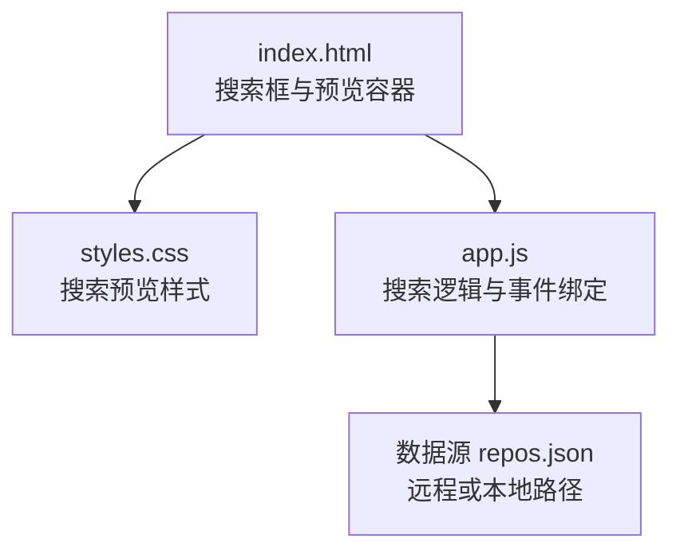
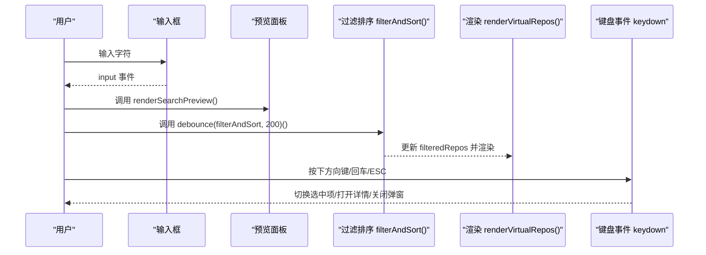
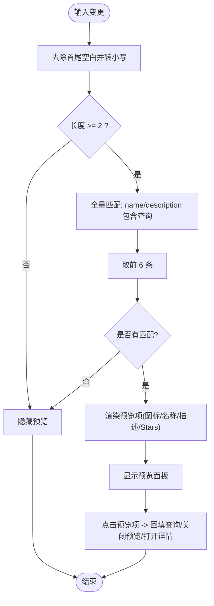
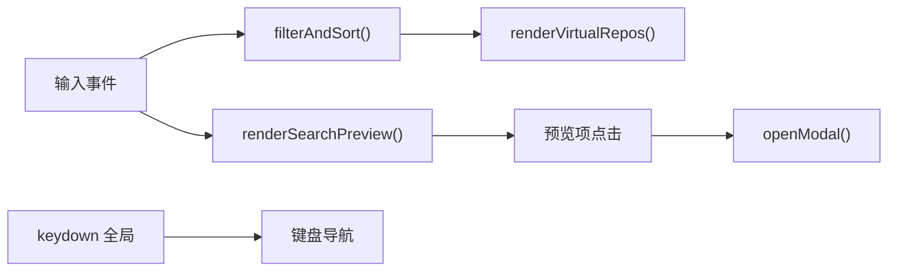

# 搜索组件

<cite>
**本文引用的文件**   
- [web/app.js](file://web/app.js)
- [web/index.html](file://web/index.html)
- [web/styles.css](file://web/styles.css)
</cite>

## 目录
1. [简介](#简介)
2. [项目结构](#项目结构)
3. [核心组件](#核心组件)
4. [架构总览](#架构总览)
5. [详细组件分析](#详细组件分析)
6. [依赖分析](#依赖分析)
7. [性能考虑](#性能考虑)
8. [故障排查指南](#故障排查指南)
9. [结论](#结论)
10. [附录](#附录)

## 简介
本技术文档聚焦于仓库中的“搜索组件”，围绕实时搜索预览、输入监听与防抖、匹配算法、键盘导航（上下箭头选择、回车确认、ESC关闭）、结果渲染（图标、名称高亮、星级展示）以及显示/隐藏控制与点击事件处理进行系统化说明。同时提供代码级流程图与时序图，帮助读者快速理解实现细节与优化点。

## 项目结构
前端由三个核心文件组成：
- HTML 页面定义搜索框与预览容器等 DOM 结构
- CSS 样式定义搜索预览的布局与交互状态
- JS 逻辑负责数据加载、过滤排序、搜索预览渲染、事件绑定与键盘导航

图表来源
- [web/index.html:54-61](file://web/index.html#L54-L61)
- [web/styles.css:1817-1894](file://web/styles.css#L1817-L1894)
- [web/app.js:1110-1113](file://web/app.js#L1110-L1113)

章节来源
- [web/index.html:54-61](file://web/index.html#L54-L61)
- [web/styles.css:1817-1894](file://web/styles.css#L1817-L1894)
- [web/app.js:1110-1113](file://web/app.js#L1110-L1113)

## 核心组件
- 搜索输入与预览容器
  - 输入框：id="searchInput"
  - 预览面板：class="search-preview"，id="searchPreview"
- 实时预览渲染函数：renderSearchPreview()
- 过滤与排序函数：filterAndSort()
- 防抖工具：debounce(fn, delay)
- 事件绑定：input 事件触发预览与过滤；全局 keydown 处理键盘导航
- 样式：搜索预览定位、滚动、悬停、图标与文字排版

章节来源
- [web/index.html:54-61](file://web/index.html#L54-L61)
- [web/app.js:731-787](file://web/app.js#L731-L787)
- [web/app.js:1026-1059](file://web/app.js#L1026-L1059)
- [web/app.js:1078-1084](file://web/app.js#L1078-L1084)
- [web/app.js:1110-1113](file://web/app.js#L1110-L1113)
- [web/styles.css:1817-1894](file://web/styles.css#L1817-L1894)

## 架构总览
搜索组件的数据流与交互流程如下：

图表来源
- [web/app.js:1110-1113](file://web/app.js#L1110-L1113)
- [web/app.js:731-787](file://web/app.js#L731-L787)
- [web/app.js:1026-1059](file://web/app.js#L1026-L1059)
- [web/app.js:1268-1346](file://web/app.js#L1268-L1346)

## 详细组件分析

### 实时搜索预览功能
- 输入监听
  - 在输入框上绑定 input 事件，每次输入时立即调用预览渲染与过滤排序（后者通过防抖）。
- 防抖处理机制
  - 使用通用 debounce 包装 filterAndSort，延迟 200ms 执行，避免频繁重排。
- 搜索结果匹配算法
  - 预览匹配：对 allRepos 按 name 与 description 做小写包含匹配，最多返回前 6 条。
  - 列表过滤：filterAndSort 中同样基于 name/description 的小写包含匹配，并结合语言、Stars/Forks/Score 范围筛选与多种排序策略。
- 预览渲染逻辑
  - 根据匹配结果生成预览项，包含语言图标、项目名称、描述摘要与 Stars 数。
  - 为每个预览项绑定 click 事件：回填查询、关闭预览、打开详情弹窗。
- 显示/隐藏控制
  - 当查询长度小于 2 或无匹配时，隐藏预览面板；否则显示并设置 display:block。
  - 提供 closeSearchPreview 统一关闭逻辑。

图表来源
- [web/app.js:731-787](file://web/app.js#L731-L787)
- [web/app.js:1026-1059](file://web/app.js#L1026-L1059)
- [web/app.js:1078-1084](file://web/app.js#L1078-L1084)

章节来源
- [web/app.js:731-787](file://web/app.js#L731-L787)
- [web/app.js:1026-1059](file://web/app.js#L1026-L1059)
- [web/app.js:1078-1084](file://web/app.js#L1078-L1084)
- [web/styles.css:1817-1894](file://web/styles.css#L1817-L1894)

### 搜索框的事件绑定模式
- 输入事件
  - 绑定 input 事件，触发预览渲染与防抖后的过滤排序。
- 键盘导航支持
  - 全局 keydown 监听，非输入态下支持：
    - 上下左右箭头：网格卡片选择导航（行内左右、跨行上下），Enter 打开详情，Esc 关闭弹窗并清空选择。
    - / 快捷聚焦搜索框。
    - T/B/L 快捷键用于主题、书签视图、语言切换。
- 注意
  - 当前实现未对“搜索预览下拉”的上下箭头选择与回车确认进行专门处理，键盘导航作用于主结果卡片区域。如需增强，可在预览层增加焦点管理与键盘事件。

章节来源
- [web/app.js:1110-1113](file://web/app.js#L1110-L1113)
- [web/app.js:1268-1346](file://web/app.js#L1268-L1346)

### 搜索结果渲染逻辑
- 项目图标显示
  - 根据语言映射到 SVG 图标集合，未知语言回退默认图标。
- 名称与描述展示
  - 预览项中显示完整名称与截断的描述摘要；主列表中对名称与描述进行转义输出，防止 XSS。
- 星级展示
  - 预览项右侧显示 Stars 数值；主列表中以徽章形式展示 Stars、Forks、语言、今日增长与综合评分。
- 虚拟滚动优化
  - 当结果数量超过阈值时启用虚拟滚动，仅渲染可视区域及缓冲区的卡片，减少 DOM 节点数量。

章节来源
- [web/app.js:16-36](file://web/app.js#L16-L36)
- [web/app.js:755-782](file://web/app.js#L755-L782)
- [web/app.js:927-1006](file://web/app.js#L927-L1006)
- [web/app.js:874-925](file://web/app.js#L874-L925)

### 搜索预览的显示隐藏控制与点击事件处理
- 显示/隐藏
  - 依据查询长度与匹配结果动态设置 display:none/block。
- 点击事件
  - 点击预览项后回填查询文本、关闭预览并打开对应项目的详情弹窗。
- 关闭入口
  - 提供 closeSearchPreview 方法集中管理关闭行为。

章节来源
- [web/app.js:731-787](file://web/app.js#L731-L787)

### 高效字符串匹配与 DOM 操作优化示例（以源码路径引用）
- 高效字符串匹配
  - 预览匹配：对 name 与 description 进行小写包含判断，限制返回数量，降低渲染压力。
    - 参考：[web/app.js:743-748](file://web/app.js#L743-L748)
  - 列表过滤：在 filterAndSort 中组合多条件过滤与排序，避免重复计算。
    - 参考：[web/app.js:1034-1053](file://web/app.js#L1034-L1053)
- DOM 操作优化
  - 批量拼接 HTML 后一次性写入 innerHTML，减少多次重排。
    - 参考：[web/app.js:755-767](file://web/app.js#L755-L767)、[web/app.js:871-872](file://web/app.js#L871-L872)
  - 虚拟滚动：仅渲染可见区与缓冲区节点，并按固定高度绝对定位，提升长列表性能。
    - 参考：[web/app.js:874-925](file://web/app.js#L874-L925)
  - 防抖：对高频输入事件进行节流，避免频繁触发过滤与渲染。
    - 参考：[web/app.js:1078-1084](file://web/app.js#L1078-L1084)、[web/app.js:1110-1113](file://web/app.js#L1110-L1113)

章节来源
- [web/app.js:743-748](file://web/app.js#L743-L748)
- [web/app.js:1034-1053](file://web/app.js#L1034-L1053)
- [web/app.js:755-767](file://web/app.js#L755-L767)
- [web/app.js:871-872](file://web/app.js#L871-L872)
- [web/app.js:874-925](file://web/app.js#L874-L925)
- [web/app.js:1078-1084](file://web/app.js#L1078-L1084)
- [web/app.js:1110-1113](file://web/app.js#L1110-L1113)

## 依赖分析
- 模块耦合
  - 搜索预览与过滤排序共享 allRepos 与 filteredRepos 数据，低耦合、高内聚。
  - 事件绑定集中在 app.js 底部，便于维护。
- 外部依赖
  - 数据源 repos.json 通过 fetch 获取，支持多路径重试与错误提示。
- 潜在循环依赖
  - 未见循环导入；所有逻辑均位于单文件脚本中。

图表来源
- [web/app.js:1110-1113](file://web/app.js#L1110-L1113)
- [web/app.js:731-787](file://web/app.js#L731-L787)
- [web/app.js:1026-1059](file://web/app.js#L1026-L1059)
- [web/app.js:1268-1346](file://web/app.js#L1268-L1346)

章节来源
- [web/app.js:1110-1113](file://web/app.js#L1110-L1113)
- [web/app.js:731-787](file://web/app.js#L731-L787)
- [web/app.js:1026-1059](file://web/app.js#L1026-L1059)
- [web/app.js:1268-1346](file://web/app.js#L1268-L1346)

## 性能考虑
- 防抖与节流
  - 输入事件使用 200ms 防抖，滚动事件使用 16ms 节流，平衡响应与性能。
- 虚拟滚动
  - 大数据集采用虚拟滚动，显著降低 DOM 节点数量与重排开销。
- 最小化匹配范围
  - 预览匹配限制返回数量，避免过多 DOM 更新。
- 字符串处理
  - 统一转为小写后再匹配，减少分支复杂度。
- 建议
  - 若需更复杂匹配（如分词、模糊匹配），可引入轻量索引或预计算字段，避免每次输入都遍历全量数据。

## 故障排查指南
- 预览不显示
  - 检查查询长度是否小于 2；确认 preview 元素存在且未被其他样式覆盖。
  - 参考：[web/app.js:737-741](file://web/app.js#L737-L741)、[web/styles.css:1817-1832](file://web/styles.css#L1817-L1832)
- 过滤无效
  - 确认 filterAndSort 读取的表单值是否正确；检查 range 最大值初始化是否完成。
  - 参考：[web/app.js:1026-1059](file://web/app.js#L1026-L1059)、[web/app.js:849-857](file://web/app.js#L849-L857)
- 键盘导航异常
  - 确认当前焦点不在输入控件；检查 selectedCardIndex 与每行列数计算。
  - 参考：[web/app.js:1268-1346](file://web/app.js#L1268-L1346)、[web/app.js:1261-1266](file://web/app.js#L1261-L1266)
- 数据加载失败
  - 检查网络协议与服务器配置；查看错误提示与重试逻辑。
  - 参考：[web/app.js:401-453](file://web/app.js#L401-L453)

章节来源
- [web/app.js:737-741](file://web/app.js#L737-L741)
- [web/styles.css:1817-1832](file://web/styles.css#L1817-L1832)
- [web/app.js:1026-1059](file://web/app.js#L1026-L1059)
- [web/app.js:849-857](file://web/app.js#L849-L857)
- [web/app.js:1268-1346](file://web/app.js#L1268-L1346)
- [web/app.js:1261-1266](file://web/app.js#L1261-L1266)
- [web/app.js:401-453](file://web/app.js#L401-L453)

## 结论
该搜索组件实现了高效的实时预览与过滤能力，结合防抖与虚拟滚动，在大数据集场景下仍保持良好交互体验。键盘导航完善，但尚未针对“搜索预览下拉”的上下选择与回车确认进行专门处理，后续可按需扩展以提升无障碍体验。整体代码结构清晰，易于维护与扩展。

## 附录
- 相关 HTML 结构
  - 搜索框与预览容器位置：[web/index.html:54-61](file://web/index.html#L54-L61)
- 关键样式
  - 搜索预览容器与条目样式：[web/styles.css:1817-1894](file://web/styles.css#L1817-L1894)
- 核心函数路径
  - 预览渲染：[web/app.js:731-787](file://web/app.js#L731-L787)
  - 过滤排序：[web/app.js:1026-1059](file://web/app.js#L1026-L1059)
  - 防抖工具：[web/app.js:1078-1084](file://web/app.js#L1078-L1084)
  - 事件绑定：[web/app.js:1110-1113](file://web/app.js#L1110-L1113)
  - 键盘导航：[web/app.js:1268-1346](file://web/app.js#L1268-L1346)