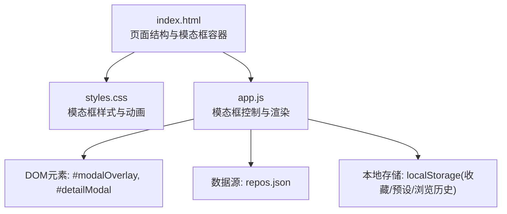
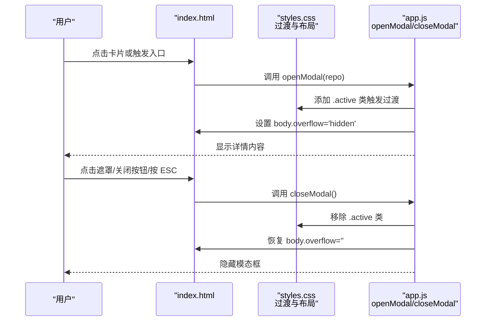
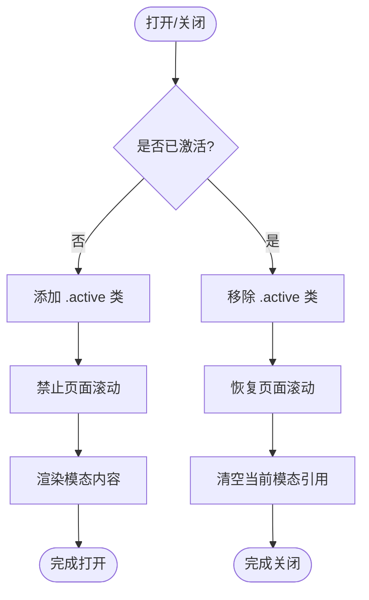
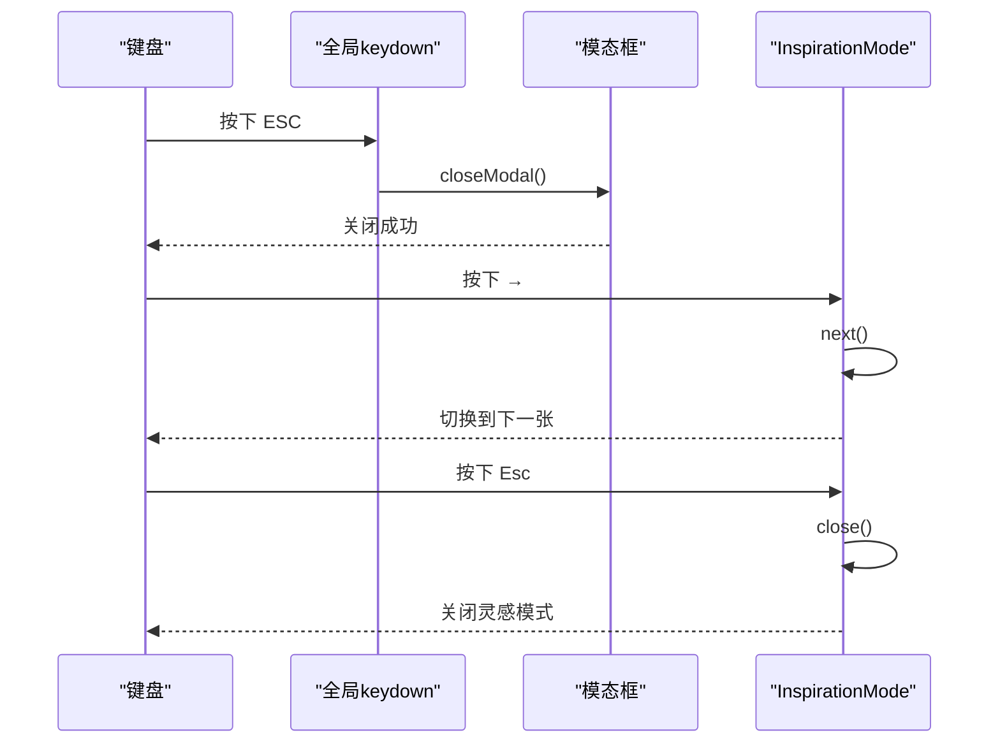
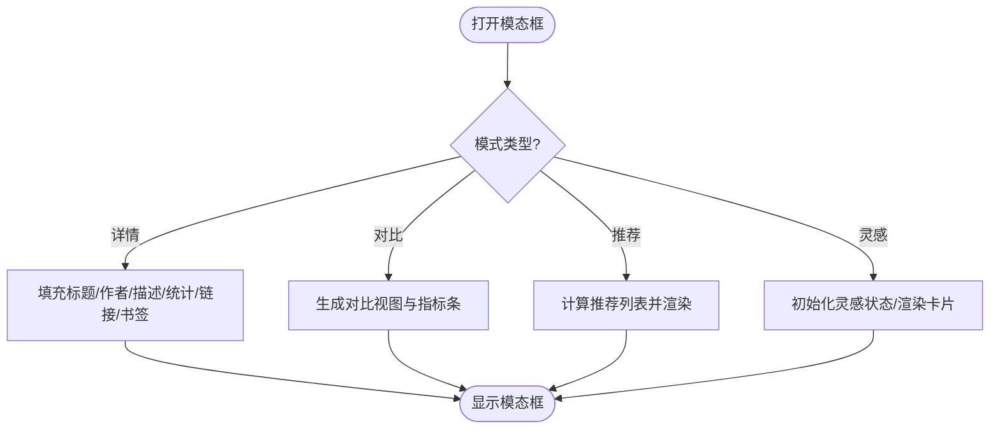
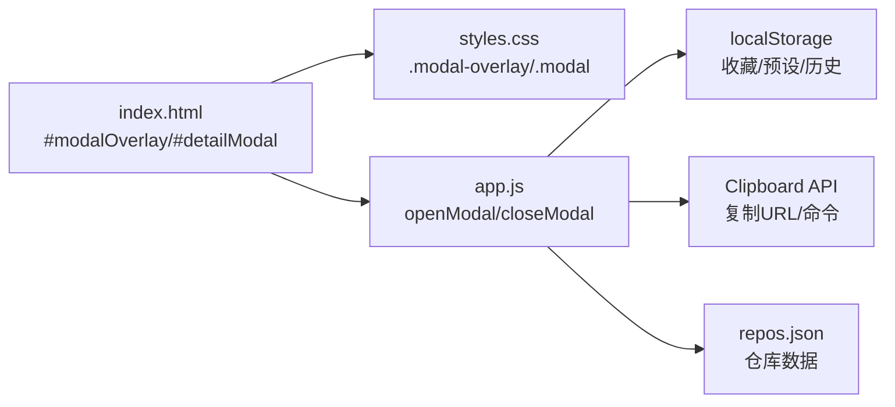

# 模态框组件

<cite>
**本文引用的文件**
- [web/app.js](file://web/app.js)
- [web/index.html](file://web/index.html)
- [web/styles.css](file://web/styles.css)
</cite>

## 目录
1. [简介](#简介)
2. [项目结构](#项目结构)
3. [核心组件](#核心组件)
4. [架构总览](#架构总览)
5. [详细组件分析](#详细组件分析)
6. [依赖关系分析](#依赖关系分析)
7. [性能考量](#性能考量)
8. [故障排查指南](#故障排查指南)
9. [结论](#结论)
10. [附录](#附录)

## 简介
本技术文档聚焦于“模态框组件”的实现与使用，涵盖以下方面：
- 打开/关闭动画效果（CSS过渡与JavaScript状态管理）
- 焦点管理机制（打开时焦点捕获、关闭时焦点恢复）
- 键盘事件处理（ESC关闭、Tab循环导航、Enter确认等）
- 内容动态渲染逻辑（项目详情展示、统计信息计算、书签状态同步）
- 无障碍访问支持（ARIA、屏幕阅读器提示）
- 移动端适配方案（触摸滑动、自动播放、震动反馈）

该模态框用于展示仓库详情、对比视图、智能推荐、灵感模式以及键盘帮助等内容。

## 项目结构
本项目为单页应用，前端资源位于 web 目录：
- index.html：页面结构与模态框容器
- styles.css：全局样式与模态框相关样式
- app.js：业务逻辑、事件绑定、模态框控制与渲染

图表来源
- [web/index.html:219-267](file://web/index.html#L219-L267)
- [web/styles.css:720-950](file://web/styles.css#L720-L950)
- [web/app.js:349-399](file://web/app.js#L349-L399)

章节来源
- [web/index.html:219-267](file://web/index.html#L219-L267)
- [web/styles.css:720-950](file://web/styles.css#L720-L950)
- [web/app.js:349-399](file://web/app.js#L349-L399)

## 核心组件
- 模态框容器与遮罩层：通过类名 active 控制显示/隐藏与过渡动画
- 模态框主体：承载标题、作者、描述、统计、链接、操作按钮等
- 多种内容模式：
  - 项目详情模式
  - 对比模式
  - 智能推荐模式
  - 灵感模式（卡片翻转、滑动、自动播放）
  - 键盘帮助模式

关键函数与入口：
- openModal(repo)：打开项目详情模态框
- closeModal()：关闭模态框并清理状态
- showKeyboardHelp()：以模态框形式展示快捷键说明
- openCompareModal()：打开对比模态框
- showRecommendations()：打开智能推荐模态框
- InspirationMode.start()/close()：启动/关闭灵感模式

章节来源
- [web/app.js:349-399](file://web/app.js#L349-L399)
- [web/app.js:789-830](file://web/app.js#L789-L830)
- [web/app.js:1437-1532](file://web/app.js#L1437-L1532)
- [web/app.js:1640-1692](file://web/app.js#L1640-L1692)
- [web/app.js:1850-1879](file://web/app.js#L1850-L1879)
- [web/app.js:2605-2616](file://web/app.js#L2605-L2616)

## 架构总览
模态框由HTML结构承载，CSS负责过渡动画与布局，JS负责状态管理与交互。

图表来源
- [web/index.html:219-267](file://web/index.html#L219-L267)
- [web/styles.css:720-756](file://web/styles.css#L720-L756)
- [web/app.js:349-399](file://web/app.js#L349-L399)
- [web/app.js:1187-1193](file://web/app.js#L1187-L1193)
- [web/app.js:1268-1278](file://web/app.js#L1268-L1278)

## 详细组件分析

### 打开/关闭动画与状态管理
- CSS过渡
  - 遮罩层：opacity 与 visibility 在 .active 下切换，配合 backdrop-filter 模糊背景
  - 模态框主体：transform scale + translateY 的进入/退出动画
- JS状态
  - 打开：overlay.classList.add('active')，body.style.overflow = 'hidden'
  - 关闭：overlay.classList.remove('active')，body.style.overflow = ''，清空当前模态数据引用

图表来源
- [web/styles.css:720-756](file://web/styles.css#L720-L756)
- [web/app.js:349-399](file://web/app.js#L349-L399)

章节来源
- [web/styles.css:720-756](file://web/styles.css#L720-L756)
- [web/app.js:349-399](file://web/app.js#L349-L399)

### 焦点管理机制
- 打开时
  - 将 body 滚动锁定，避免背景滚动
  - 在部分模式下主动聚焦到可操作元素（如灵感模式的“打开 GitHub”按钮）
- 关闭时
  - 恢复 body 滚动
  - 未显式实现“焦点恢复到触发元素”，但可通过改进实现更好的可访问性体验

注意：当前代码未记录触发元素的焦点位置并在关闭后恢复，建议后续增强。

章节来源
- [web/app.js:349-399](file://web/app.js#L349-L399)
- [web/app.js:2261-2267](file://web/app.js#L2261-L2267)

### 键盘事件处理
- 全局键盘监听
  - ESC：关闭模态框
  - /：聚焦搜索输入框
  - T/t：切换主题
  - B/b：切换收藏视图
  - L/l：切换语言
  - ?/h/H：显示键盘帮助
  - Enter：当有选中卡片时打开对应详情
  - 方向键：网格卡片选择导航（左右上下）
  - Space：对选中卡片进行收藏/取消
  - C/c：加入对比
- 模态内键盘（灵感模式）
  - 左/右箭头：上一个/下一个
  - Space：收藏
  - Enter：打开GitHub
  - F/f：翻转卡片
  - T/t：分享到X
  - P/p：自动播放开关
  - Home/End：第一个/最后一个
  - U/u：撤销；R/r：重做
  - Esc：关闭灵感模式

图表来源
- [web/app.js:1268-1346](file://web/app.js#L1268-L1346)
- [web/app.js:2533-2603](file://web/app.js#L2533-L2603)
- [web/app.js:1274-1278](file://web/app.js#L1274-L1278)

章节来源
- [web/app.js:1268-1346](file://web/app.js#L1268-L1346)
- [web/app.js:2533-2603](file://web/app.js#L2533-L2603)

### 内容动态渲染逻辑
- 项目详情模式
  - 图标、标题、作者、描述、统计（Stars/Forks/Fork率/评分）、数据来源、GitHub链接、复制URL、克隆命令、书签状态
  - 书签状态与全局 bookmarkedRepos 同步，更新UI
- 对比模式
  - 两列对比布局，指标条可视化 Stars/Forks/Score
- 智能推荐模式
  - 基于收藏的语言分布与关键词词频打分，返回Top推荐列表
- 灵感模式
  - 过滤未浏览项目，随机打乱，支持翻页、历史记录、进度条、自动播放、翻转卡片、分享、筛选语言、标记已浏览、持久化位置与已浏览集合

图表来源
- [web/app.js:349-399](file://web/app.js#L349-L399)
- [web/app.js:1437-1532](file://web/app.js#L1437-L1532)
- [web/app.js:1600-1692](file://web/app.js#L1600-L1692)
- [web/app.js:1850-1879](file://web/app.js#L1850-L1879)
- [web/app.js:2305-2466](file://web/app.js#L2305-L2466)

章节来源
- [web/app.js:349-399](file://web/app.js#L349-L399)
- [web/app.js:1437-1532](file://web/app.js#L1437-L1532)
- [web/app.js:1600-1692](file://web/app.js#L1600-L1692)
- [web/app.js:1850-1879](file://web/app.js#L1850-L1879)
- [web/app.js:2305-2466](file://web/app.js#L2305-L2466)

### 无障碍访问支持
- 语义化标签与属性
  - 模态区域使用 role="region" 与 aria-label
  - 进度条使用 role="progressbar" 及 aria-valuenow/min/max
  - 按钮提供 aria-label、aria-pressed 等
- 屏幕阅读器提示
  - 使用 aria-live 区域播报状态变化（如灵感模式切换、自动播放状态）
- 键盘可达性
  - 所有交互均可通过键盘完成，并提供帮助面板

章节来源
- [web/index.html:269](file://web/index.html#L269)
- [web/app.js:2372-2374](file://web/app.js#L2372-L2374)
- [web/app.js:2410-2416](file://web/app.js#L2410-L2416)
- [web/app.js:2169-2174](file://web/app.js#L2169-L2174)

### 移动端适配方案
- 触摸滑动
  - touchstart/touchmove/touchend 监听，根据位移阈值执行上一个/下一个
  - 实时指示器与卡片旋转/缩放反馈
- 自动播放
  - 定时器驱动自动翻页，支持暂停/继续
- 震动反馈
  - 使用 navigator.vibrate 提供轻/中/重触觉反馈
- 响应式布局
  - 模态框最大宽度、内边距、字体大小等在移动端优化

章节来源
- [web/app.js:2495-2531](file://web/app.js#L2495-L2531)
- [web/app.js:2069-2097](file://web/app.js#L2069-L2097)
- [web/app.js:2176-2182](file://web/app.js#L2176-L2182)
- [web/styles.css:2184-2379](file://web/styles.css#L2184-L2379)

## 依赖关系分析
- HTML结构依赖
  - #modalOverlay 作为遮罩层
  - #detailModal 作为模态框主体
- CSS样式依赖
  - .modal-overlay.active 控制可见性与过渡
  - .modal 控制尺寸、圆角、阴影与变换
- JavaScript依赖
  - DOM API：getElementById、classList、addEventListener
  - 本地存储：localStorage（收藏、预设、浏览历史）
  - 剪贴板API：navigator.clipboard.writeText
  - 网络请求：fetch 加载 repos.json

图表来源
- [web/index.html:219-267](file://web/index.html#L219-L267)
- [web/styles.css:720-950](file://web/styles.css#L720-L950)
- [web/app.js:349-399](file://web/app.js#L349-L399)

章节来源
- [web/index.html:219-267](file://web/index.html#L219-L267)
- [web/styles.css:720-950](file://web/styles.css#L720-L950)
- [web/app.js:349-399](file://web/app.js#L349-L399)

## 性能考量
- 虚拟滚动：当结果集较大时启用虚拟列表，减少DOM节点数量
- 防抖：搜索与滚动事件使用 debounce 降低重排重绘频率
- 预加载：灵感模式预加载相邻卡片资源（占位实现）
- 动画优化：使用 transform 与 opacity 提升合成性能

章节来源
- [web/app.js:874-925](file://web/app.js#L874-L925)
- [web/app.js:1078-1084](file://web/app.js#L1078-L1084)
- [web/app.js:2118-2125](file://web/app.js#L2118-L2125)

## 故障排查指南
- 无法打开模态框
  - 检查 #modalOverlay 与 #detailModal 是否存在
  - 确认 openModal 被正确调用且传入有效 repo 对象
- 关闭无效
  - 检查遮罩点击事件与 ESC 监听是否生效
  - 确认 closeModal 移除了 .active 并恢复了 body 滚动
- 书签状态不同步
  - 确认 toggleBookmark 更新了 bookmarkedRepos 并调用 updateBookmarkUI
  - 检查 modalBookmark 按钮状态是否与收藏集合一致
- 键盘快捷键不生效
  - 确认全局 keydown 监听未被 input/select/textarea 拦截
  - 灵感模式需确保 bindKeyboard 已执行且 unbindKeyboard 在关闭时调用

章节来源
- [web/app.js:1187-1193](file://web/app.js#L1187-L1193)
- [web/app.js:1268-1278](file://web/app.js#L1268-L1278)
- [web/app.js:308-347](file://web/app.js#L308-L347)
- [web/app.js:2533-2603](file://web/app.js#L2533-L2603)

## 结论
该模态框组件通过清晰的HTML结构、流畅的CSS过渡与完善的JS状态管理，实现了多场景的内容展示与交互。其键盘可达性、屏幕阅读器支持与移动端适配较为完善。建议在焦点恢复机制上进一步增强，以提升整体可访问性体验。

## 附录
- 常用类名与ID
  - #modalOverlay：遮罩层
  - #detailModal：模态框主体
  - .modal-overlay.active：激活态
  - .inspiration-modal：灵感模式专用样式
- 主要函数路径
  - openModal：[web/app.js:349-399](file://web/app.js#L349-L399)
  - closeModal：[web/app.js:395-399](file://web/app.js#L395-L399)
  - showKeyboardHelp：[web/app.js:789-830](file://web/app.js#L789-L830)
  - openCompareModal：[web/app.js:1437-1532](file://web/app.js#L1437-L1532)
  - showRecommendations：[web/app.js:1640-1692](file://web/app.js#L1640-L1692)
  - InspirationMode.start/close：[web/app.js:1850-1879](file://web/app.js#L1850-L1879), [web/app.js:2605-2616](file://web/app.js#L2605-L2616)