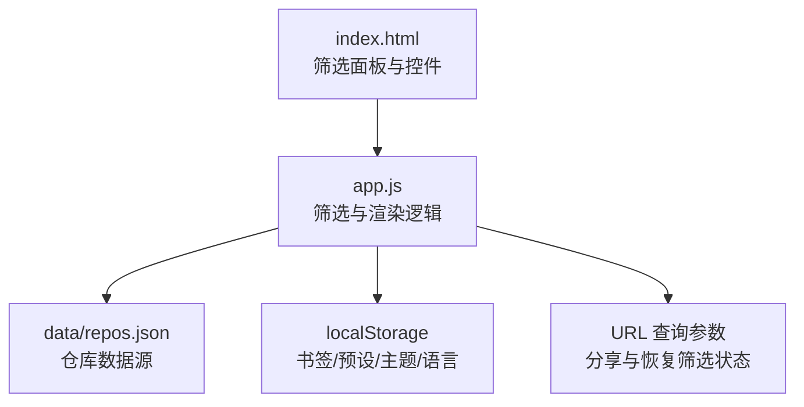
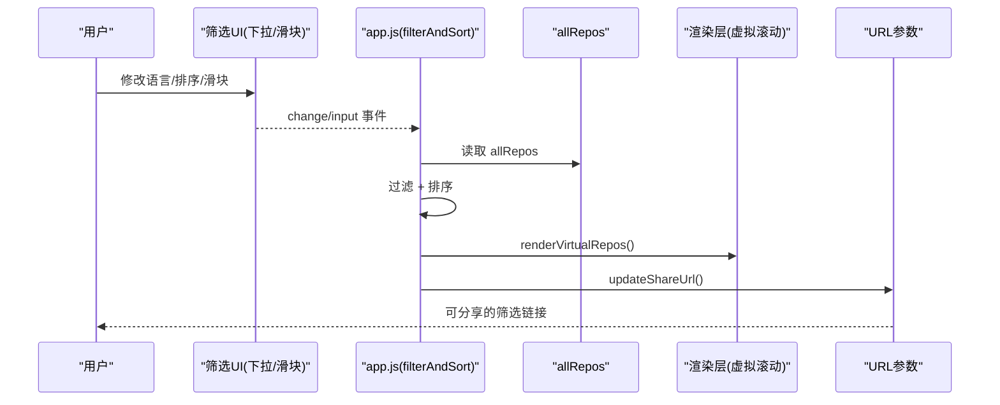
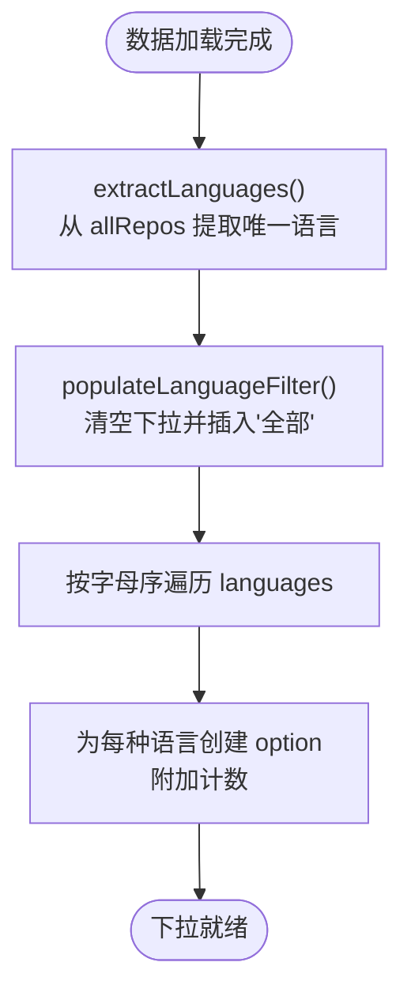
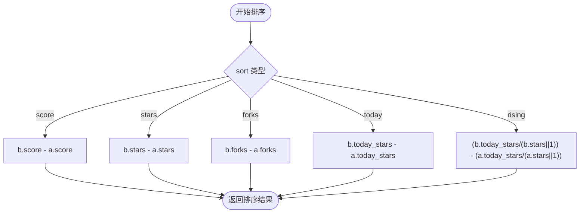
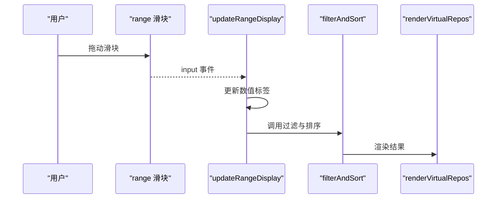
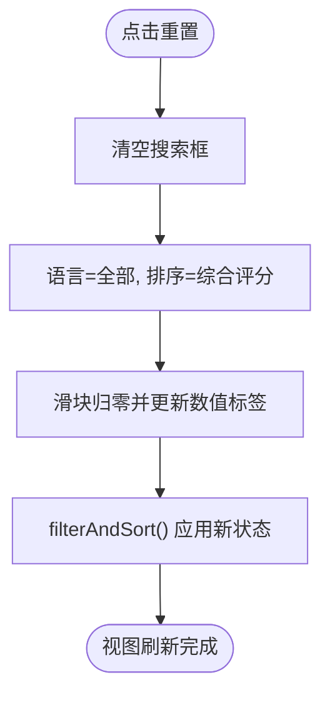
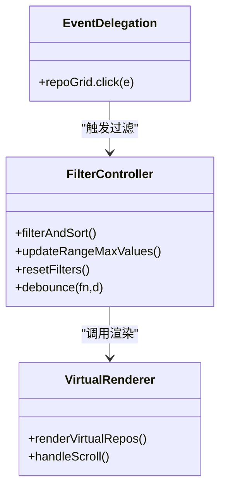
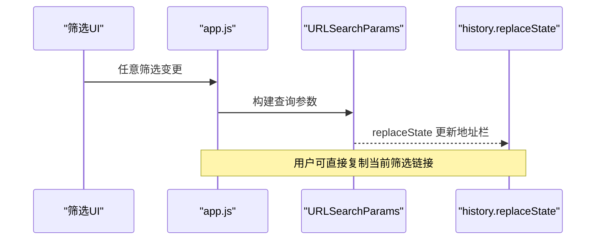
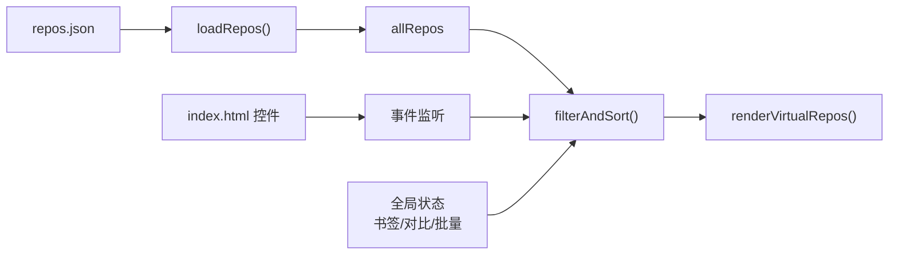

# 筛选器组件

<cite>
**本文引用的文件**
- [web/app.js](file://web/app.js)
- [web/index.html](file://web/index.html)
- [README.md](file://README.md)
</cite>

## 目录
1. [简介](#简介)
2. [项目结构](#项目结构)
3. [核心组件](#核心组件)
4. [架构总览](#架构总览)
5. [详细组件分析](#详细组件分析)
6. [依赖关系分析](#依赖关系分析)
7. [性能考量](#性能考量)
8. [故障排查指南](#故障排查指南)
9. [结论](#结论)
10. [附录](#附录)

## 简介
本技术文档聚焦于仓库前端中的“筛选器组件”，围绕以下目标展开：
- 语言筛选器的动态生成逻辑：从数据中提取唯一语言列表并填充下拉选项。
- 多维度排序实现：按评分、Stars、Forks、今日增长和飙升指数的排序算法。
- 范围滑块交互：最小值/最大值设置、实时数值显示与过滤条件应用。
- 重置按钮功能：筛选状态清除机制。
- 事件委托模式与性能优化策略。

该组件基于纯前端（HTML/CSS/JS）实现，数据来源于本地 JSON 数据集，通过 URL 参数持久化筛选状态，支持书签、对比、批量操作等扩展能力。

## 项目结构
筛选器相关的前端代码集中在 web 目录下：
- index.html：定义筛选面板、搜索框、语言下拉、排序下拉、三个范围滑块、重置按钮等 UI 元素。
- app.js：实现数据加载、语言提取与下拉填充、过滤与排序、范围滑块交互、重置、URL 同步、事件绑定与性能优化等。

图表来源
- [web/index.html:50-132](file://web/index.html#L50-L132)
- [web/app.js:1026-1076](file://web/app.js#L1026-L1076)
- [web/app.js:1351-1393](file://web/app.js#L1351-L1393)

章节来源
- [web/index.html:50-132](file://web/index.html#L50-L132)
- [web/app.js:1026-1076](file://web/app.js#L1026-L1076)

## 核心组件
- 语言筛选器：动态生成下拉选项，包含计数信息，支持清空选择以显示全部。
- 排序下拉：提供综合评分、Stars、Forks、今日增长、飙升指数五种排序方式。
- 范围滑块：Stars ≥、Forks ≥、评分 ≥，实时更新数值标签并触发过滤。
- 重置按钮：一键清空所有筛选条件并恢复默认视图。
- 事件系统：统一的事件监听与委托，结合防抖与虚拟滚动提升性能。

章节来源
- [web/app.js:832-857](file://web/app.js#L832-L857)
- [web/app.js:1026-1076](file://web/app.js#L1026-L1076)
- [web/app.js:1110-1126](file://web/app.js#L1110-L1126)

## 架构总览
筛选器组件的数据流与控制流如下：
- 数据加载后，提取唯一语言集合，更新语言下拉与范围滑块最大值。
- 用户交互（输入、下拉变化、滑块拖动）触发 filterAndSort。
- filterAndSort 读取当前筛选条件，对全量数据进行过滤与排序，更新结果集与可见区域。
- 同时更新 URL 查询参数，以便分享与恢复。
- 当结果数量较大时启用虚拟滚动，减少 DOM 节点数量，提高渲染性能。

图表来源
- [web/app.js:1026-1076](file://web/app.js#L1026-L1076)
- [web/app.js:874-925](file://web/app.js#L874-L925)
- [web/app.js:1351-1370](file://web/app.js#L1351-L1370)

## 详细组件分析

### 语言筛选器动态生成
- 数据来源：从已加载的 allRepos 中抽取 language 字段，去重得到 languages Set。
- 下拉填充：清空现有选项，插入“全部”项；随后按字母序遍历 languages，为每个语言创建 option，并在文本中附加该项目数量。
- 国际化：在切换语言时，会重新构建语言下拉的“全部”文案并保持当前选中值。

图表来源
- [web/app.js:832-847](file://web/app.js#L832-L847)
- [web/app.js:274-279](file://web/app.js#L274-L279)

章节来源
- [web/app.js:832-847](file://web/app.js#L832-L847)
- [web/app.js:274-279](file://web/app.js#L274-L279)

### 多维度排序算法
filterAndSort 根据 sortFilter 的值执行不同排序策略：
- 综合评分：按 score 降序。
- Stars：按 stars 降序。
- Forks：按 forks 降序。
- 今日增长：按 today_stars 降序。
- 飙升指数：按 (today_stars / stars) 降序，分母使用 stars || 1 避免除零。

图表来源
- [web/app.js:1044-1053](file://web/app.js#L1044-L1053)

章节来源
- [web/app.js:1044-1053](file://web/app.js#L1044-L1053)

### 范围滑块交互与过滤
- 最大值自适应：updateRangeMaxValues 计算 allRepos 中 stars/forks/score 的最大值，并按步长向上取整设置 range.max。
- 实时数值显示：input 事件触发 updateRangeDisplay，将滑块值格式化后写入对应 span。
- 过滤条件应用：每次 input 均调用 filterAndSort，即时更新结果集与视图。
- 初始值与步进：stars 步长为 1000，forks 为 100，score 为 5000，便于快速定位阈值。

图表来源
- [web/app.js:849-857](file://web/app.js#L849-L857)
- [web/app.js:1061-1063](file://web/app.js#L1061-L1063)
- [web/app.js:1117-1124](file://web/app.js#L1117-L1124)
- [web/app.js:874-903](file://web/app.js#L874-L903)

章节来源
- [web/app.js:849-857](file://web/app.js#L849-L857)
- [web/app.js:1061-1063](file://web/app.js#L1061-L1063)
- [web/app.js:1117-1124](file://web/app.js#L1117-L1124)
- [web/app.js:874-903](file://web/app.js#L874-L903)

### 重置按钮与筛选状态清除
resetFilters 负责：
- 清空搜索框、语言下拉、排序下拉恢复为“综合评分”。
- 将三个滑块归零，并同步更新数值标签。
- 调用 filterAndSort 刷新结果集与视图。

图表来源
- [web/app.js:1065-1076](file://web/app.js#L1065-L1076)

章节来源
- [web/app.js:1065-1076](file://web/app.js#L1065-L1076)

### 事件委托与性能优化
- 事件委托：对 repoGrid 使用单一 click 监听，通过 e.target.closest(...) 判断具体子元素（收藏、对比、分享、卡片），减少大量子节点事件绑定开销。
- 防抖：搜索输入使用 debounce 200ms 触发 filterAndSort，避免频繁重排。
- 虚拟滚动：当结果超过 100 条时，仅渲染可视区及缓冲区的卡片，并通过绝对定位与高度占位实现高效滚动。
- 滚动节流：window.scroll 使用 debounce 16ms 近似 60fps 的滚动处理。

图表来源
- [web/app.js:1141-1185](file://web/app.js#L1141-L1185)
- [web/app.js:1078-1084](file://web/app.js#L1078-L1084)
- [web/app.js:874-925](file://web/app.js#L874-L925)
- [web/app.js:1348](file://web/app.js#L1348)

章节来源
- [web/app.js:1141-1185](file://web/app.js#L1141-L1185)
- [web/app.js:1078-1084](file://web/app.js#L1078-L1084)
- [web/app.js:874-925](file://web/app.js#L874-L925)
- [web/app.js:1348](file://web/app.js#L1348)

### 筛选状态持久化与分享
- URL 同步：updateShareUrl 将搜索词、语言、排序、滑块值与书签视图标志写入 location.search，并替换历史状态。
- 状态恢复：loadFromUrl 在初始化时解析 URL 参数，回填到对应控件并触发一次过滤。
- 书签视图：bookmarks=1 时自动勾选“我的收藏”并进入只读书签视图。

图表来源
- [web/app.js:1351-1370](file://web/app.js#L1351-L1370)
- [web/app.js:1372-1393](file://web/app.js#L1372-L1393)

章节来源
- [web/app.js:1351-1370](file://web/app.js#L1351-L1370)
- [web/app.js:1372-1393](file://web/app.js#L1372-L1393)

## 依赖关系分析
- 数据依赖：allRepos 由 loadRepos 拉取 data/repos.json 后赋值，筛选与排序均基于此数组。
- UI 依赖：index.html 中的控件 ID 与 app.js 中的 getElementById 严格匹配。
- 状态依赖：showBookmarksOnly、bookmarkedRepos、compareRepos、batchSelectedRepos 等全局状态影响过滤分支。
- 外部依赖：浏览器 API（fetch、URLSearchParams、localStorage、navigator.clipboard）。

图表来源
- [web/app.js:401-453](file://web/app.js#L401-L453)
- [web/app.js:1026-1076](file://web/app.js#L1026-L1076)
- [web/index.html:50-132](file://web/index.html#L50-L132)

章节来源
- [web/app.js:401-453](file://web/app.js#L401-L453)
- [web/app.js:1026-1076](file://web/app.js#L1026-L1076)
- [web/index.html:50-132](file://web/index.html#L50-L132)

## 性能考量
- 防抖：搜索输入与滚动事件采用防抖，降低高频回调带来的重排与重绘压力。
- 虚拟滚动：结果大于 100 条时仅渲染可视区与缓冲区，显著减少 DOM 节点数与布局成本。
- 事件委托：在容器上统一监听点击，避免为每个卡片绑定独立事件处理器。
- 增量更新：范围滑块 input 直接更新数值标签与过滤结果，避免不必要的二次计算。
- 排序复杂度：排序为 O(n log n)，过滤为 O(n)，整体在千级数据规模下表现良好。

[本节为通用性能建议，不直接分析具体文件]

## 故障排查指南
- 无法加载数据：若通过 file:// 协议打开页面，浏览器会阻止 fetch 请求。请使用本地服务器启动（如 python3 -m http.server 8000）。
- 筛选无效果：检查 URL 是否携带了筛选参数导致状态被覆盖；确认各控件 ID 未被篡改。
- 排序异常：飙升指数排序需确保 stars 不为 0，代码中使用 stars || 1 规避除零错误。
- 滑块最大值不合理：若数据为空或异常，updateRangeMaxValues 会使用默认上限保护。

章节来源
- [web/app.js:428-453](file://web/app.js#L428-L453)
- [web/app.js:849-857](file://web/app.js#L849-L857)
- [web/app.js:1044-1053](file://web/app.js#L1044-L1053)

## 结论
筛选器组件通过清晰的数据流与事件模型，实现了语言动态下拉、多维排序、范围滑块实时过滤与重置等功能，并结合防抖、虚拟滚动与事件委托等策略保障性能。URL 参数同步使得筛选状态可分享与恢复，提升了用户体验与可复现性。

[本节为总结性内容，不直接分析具体文件]

## 附录
- 评分算法参考：综合评分由 Stars、Fork率、增长加速度等维度加权构成，详见 README 说明。
- 快捷键与辅助功能：键盘导航、屏幕阅读器提示、无障碍属性等在灵感模式中体现，可作为筛选交互的补充。

章节来源
- [README.md:109-119](file://README.md#L109-L119)