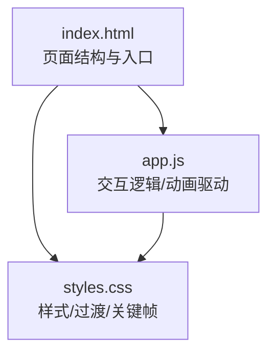
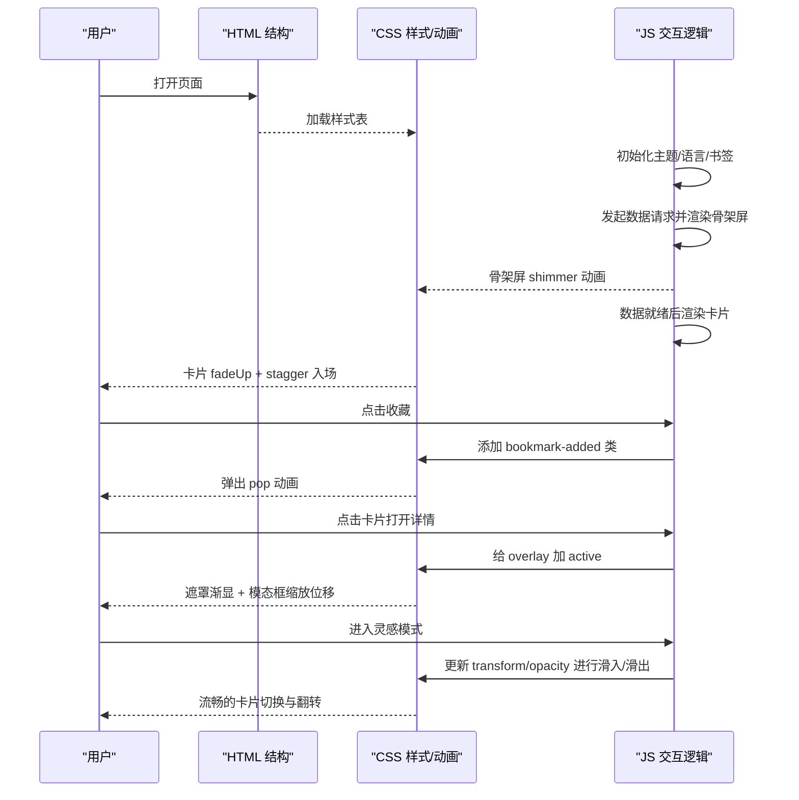
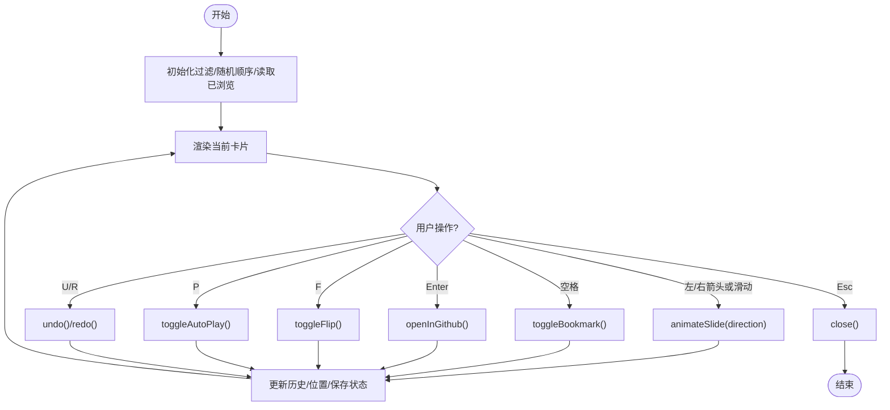
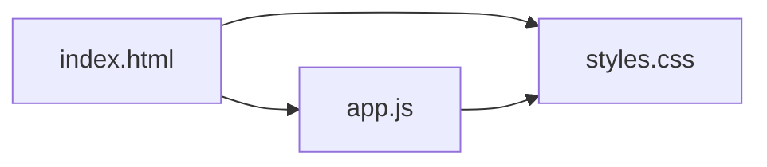

# 动画与过渡效果

<cite>
**本文引用的文件**   
- [web/index.html](file://web/index.html)
- [web/styles.css](file://web/styles.css)
- [web/app.js](file://web/app.js)
</cite>

## 目录
1. [简介](#简介)
2. [项目结构](#项目结构)
3. [核心组件](#核心组件)
4. [架构总览](#架构总览)
5. [详细组件分析](#详细组件分析)
6. [依赖关系分析](#依赖关系分析)
7. [性能考量](#性能考量)
8. [故障排查指南](#故障排查指南)
9. [结论](#结论)
10. [附录](#附录)

## 简介
本技术文档聚焦于仓库前端中的动画与过渡实现，涵盖：
- CSS 关键帧动画、过渡与缓动函数的使用
- JavaScript 驱动的交互动画（收藏反馈、模态框过渡、页面加载骨架屏）
- 高级交互模式“灵感模式”的卡片滑动、翻转、自动播放等
- 性能优化策略（will-change、GPU 加速、避免重排重绘）
- 配置示例与浏览器兼容性建议

## 项目结构
本项目为纯前端单页应用，动画相关代码主要分布在以下三个文件中：
- HTML 提供骨架结构与交互入口
- CSS 定义主题变量、布局、过渡与关键帧动画
- JS 负责数据加载、筛选排序、虚拟滚动、模态框与“灵感模式”等动态行为

图表来源
- [web/index.html:1-284](file://web/index.html#L1-L284)
- [web/styles.css:1-2574](file://web/styles.css#L1-L2574)
- [web/app.js:1-2634](file://web/app.js#L1-L2634)

章节来源
- [web/index.html:1-284](file://web/index.html#L1-L284)

## 核心组件
- 主题切换与全局过渡：通过 data-theme 切换深色/浅色，配合 CSS transition 平滑过渡背景与文字色。
- 列表卡片入场动画：使用 @keyframes 实现淡入上移，结合 animation-delay 形成交错入场。
- 骨架屏加载：在数据请求期间渲染占位骨架，使用 shimmer 闪烁动画提升感知性能。
- 模态框过渡：通过 active 类控制 overlay 透明度与 modal 缩放位移，统一 0.25s ease 过渡。
- 收藏按钮反馈：点击后对卡片添加临时类触发 pop 动画，增强操作确认感。
- 灵感模式（Inspiration Mode）：基于 transform 与 opacity 的卡片滑入/滑出、翻转、进度条、自动播放、手势滑动与键盘导航。

章节来源
- [web/styles.css:44-56](file://web/styles.css#L44-56)
- [web/styles.css:146-153](file://web/styles.css#L146-153)
- [web/styles.css:444-464](file://web/styles.css#L444-464)
- [web/styles.css:1191-1195](file://web/styles.css#L1191-1195)
- [web/styles.css:721-756](file://web/styles.css#L721-756)
- [web/styles.css:1201-1209](file://web/styles.css#L1201-1209)
- [web/styles.css:2185-2207](file://web/styles.css#L2185-2207)
- [web/app.js:401-475](file://web/app.js#L401-475)
- [web/app.js:349-399](file://web/app.js#L349-399)
- [web/app.js:308-329](file://web/app.js#L308-329)
- [web/app.js:1830-2616](file://web/app.js#L1830-2616)

## 架构总览
从用户交互到视觉反馈的整体流程如下：

图表来源
- [web/index.html:1-284](file://web/index.html#L1-L284)
- [web/styles.css:721-756](file://web/styles.css#L721-756)
- [web/styles.css:1191-1195](file://web/styles.css#L1191-1195)
- [web/styles.css:1201-1209](file://web/styles.css#L1201-1209)
- [web/app.js:401-475](file://web/app.js#L401-475)
- [web/app.js:349-399](file://web/app.js#L349-399)
- [web/app.js:1830-2616](file://web/app.js#L1830-2616)

## 详细组件分析

### 1) 主题切换与全局过渡
- 机制：body 上的 data-theme 属性切换，CSS 中对应选择器覆盖变量；body 与部分元素声明 transition，使背景与文本颜色平滑变化。
- 关键点：transition 作用于 background 与 color，时长约 0.3s，缓动 ease。
- 兼容性与优化：现代浏览器均支持；避免对大量节点同时做复杂属性过渡，保持仅必要元素参与过渡。

章节来源
- [web/styles.css:23-36](file://web/styles.css#L23-36)
- [web/styles.css:48-56](file://web/styles.css#L48-56)
- [web/app.js:193-205](file://web/app.js#L193-205)

### 2) 列表卡片入场动画（关键帧 + 交错延迟）
- 机制：@keyframes cardIn 定义从透明+下移到不透明+原位；每个卡片设置 animation-delay 递增，形成交错入场。
- 关键点：animation-fill-mode: both 确保首帧状态正确；delay 由 index 计算，避免一次性全量动画导致卡顿。
- 适用场景：大数据量网格的首次渲染体验优化。

章节来源
- [web/styles.css:444-464](file://web/styles.css#L444-464)
- [web/app.js:941](file://web/app.js#L941)

### 3) 骨架屏加载（shimmer 闪烁）
- 机制：在数据未就绪时渲染一组骨架卡片，内部区块使用 @keyframes shimmer 在 0.5~1 之间循环透明度，营造“加载中”的视觉暗示。
- 关键点：pointer-events: none 防止误触；动画周期短且简单，避免影响主线程。
- 扩展：可结合 will-change: opacity 提示浏览器提前优化。

章节来源
- [web/app.js:401-475](file://web/app.js#L401-475)
- [web/styles.css:1142-1195](file://web/styles.css#L1142-1195)

### 4) 模态框过渡（遮罩 + 缩放位移）
- 机制：overlay 使用 opacity 与 visibility 控制显隐，modal 使用 transform: scale() translateY() 组合，active 类切换触发 transition。
- 关键点：transition 时间 0.25s，ease 缓动；关闭时恢复初始 transform，避免残留状态。
- 无障碍：关闭时恢复 body overflow，保证焦点与滚动正常。

章节来源
- [web/styles.css:721-756](file://web/styles.css#L721-756)
- [web/app.js:349-399](file://web/app.js#L349-399)

### 5) 收藏按钮反馈（pop 动画）
- 机制：点击收藏后，为卡片添加 bookmark-added 类，触发 @keyframes bookmarkPop（scale 放大再回弹）。
- 关键点：使用 setTimeout 移除类名，确保动画只执行一次；避免频繁重复触发造成抖动。
- 体验：即时反馈强化操作确认感。

章节来源
- [web/styles.css:1201-1209](file://web/styles.css#L1201-1209)
- [web/app.js:308-329](file://web/app.js#L308-329)

### 6) 灵感模式（Inspiration Mode）
灵感模式是本项目最复杂的交互动画模块，包含：
- 卡片滑入/滑出：通过 transform translateX/rotate 与 opacity 组合，配合 cubic-bezier 缓动曲线，产生自然的物理感。
- 翻转查看：使用 3D transform rotateY(180deg)，配合 preserve-3d 与 backface 可见性。
- 进度条与计数：宽度随 index 线性增长，使用 transition 平滑过渡。
- 自动播放：setInterval 定时推进，支持暂停/继续。
- 手势滑动：touchstart/move/end 记录 deltaX，实时预览位移与旋转，超过阈值触发 next/prev。
- 键盘导航：左右箭头切换、空格收藏、Enter 打开、F 翻转、P 自动播放、U/R 撤销/重做、Esc 关闭。
- 历史栈：维护 history 与 historyIndex，支持有限步数的撤销/重做。
- 预取相邻卡片：减少切换时的 DOM 重建开销。
- 无障碍：aria-live 区域播报当前项信息，按钮具备 aria-label/aria-pressed 等语义。

图表来源
- [web/app.js:1830-2616](file://web/app.js#L1830-2616)
- [web/styles.css:2185-2207](file://web/styles.css#L2185-2207)

章节来源
- [web/app.js:1830-2616](file://web/app.js#L1830-2616)
- [web/styles.css:2185-2207](file://web/styles.css#L2185-2207)

### 7) 搜索预览与分享菜单动画
- 搜索预览：输入时显示下拉匹配项，hover 高亮，点击后跳转详情。
- 分享菜单：动态创建 DOM，定位到触发按钮下方，fadeIn 动画出现，点击外部区域自动收起。

章节来源
- [web/app.js:731-787](file://web/app.js#L731-787)
- [web/app.js:683-729](file://web/app.js#L683-729)
- [web/styles.css:2067-2104](file://web/styles.css#L2067-2104)

## 依赖关系分析
- HTML 引入 styles.css 与 app.js，作为唯一入口。
- app.js 通过 DOM API 与 CSS 类名协作完成动画驱动。
- CSS 通过 :root 变量与 data-theme 选择器管理主题，所有过渡与关键帧集中定义。
- 无第三方动画库依赖，全部原生实现，便于维护与优化。

图表来源
- [web/index.html:1-284](file://web/index.html#L1-L284)
- [web/styles.css:1-2574](file://web/styles.css#L1-L2574)
- [web/app.js:1-2634](file://web/app.js#L1-L2634)

章节来源
- [web/index.html:1-284](file://web/index.html#L1-L284)

## 性能考量
- 优先使用 GPU 加速属性：transform、opacity、filter、backdrop-filter。项目中广泛使用 transform 与 opacity 进行过渡与关键帧动画，避免触发 layout/paint。
- 合理使用 will-change：在灵感模式中，卡片内容容器使用 will-change: transform，提示浏览器提前提升合成层，减少滑动过程中的掉帧。
- 避免重排重绘：
  - 批量更新 DOM：如虚拟滚动仅在可视范围内渲染，减少节点数量。
  - 使用 requestAnimationFrame 与 transitionend 时机，避免阻塞主线程。
  - 将频繁变化的样式集中在 transform/opacity，避免修改尺寸、位置等布局属性。
- 动画时长与缓动：
  - 常用时长 0.15s~0.3s，缓动 ease/cubic-bezier，兼顾响应速度与自然感。
  - 长动画（如 shimmer）使用低复杂度属性（opacity），降低 CPU 压力。
- 事件节流与防抖：
  - 滚动监听使用 debounce 限制频率，避免高频重排。
  - 输入搜索使用 debounce 合并多次输入，减少渲染压力。
- 资源预取：
  - 灵感模式预取相邻卡片，减少切换时的 DOM 重建与网络等待。
- 兼容性处理：
  - backdrop-filter 用于遮罩模糊，现代浏览器支持良好；在不支持的旧环境中优雅降级为纯色遮罩。
  - 触摸事件使用 passive: true 提升滚动性能。
  - 对于不支持 vibrate 的设备，自动跳过触觉反馈。

章节来源
- [web/styles.css:2198-2207](file://web/styles.css#L2198-2207)
- [web/app.js:1348](file://web/app.js#L1348)
- [web/app.js:1110-1124](file://web/app.js#L1110-1124)
- [web/app.js:2118-2125](file://web/app.js#L2118-2125)
- [web/app.js:2503-2531](file://web/app.js#L2503-2531)
- [web/app.js:2176-2182](file://web/app.js#L2176-2182)

## 故障排查指南
- 动画不生效
  - 检查是否缺少 active 类或目标元素是否存在。
  - 确认 transition/animation 的属性与值是否正确，避免被后续样式覆盖。
- 卡顿或掉帧
  - 检查是否触发了 layout（修改 width/height/top/left 等），尽量改用 transform/opacity。
  - 评估是否一次性渲染过多节点，考虑虚拟滚动或分页。
- 触摸滑动异常
  - 确认 touchmove 使用 passive: true，避免阻塞默认滚动。
  - 检查 deltaX/deltaY 计算与阈值判断逻辑。
- 自动播放不停止
  - 检查 clearInterval 是否在 stopAutoPlay 中被调用，确保退出模式时清理定时器。
- 无障碍问题
  - 确认 aria-live 区域有文本更新，按钮具备合适的 aria-label/aria-pressed。
  - 键盘导航时焦点移动与滚动行为符合预期。

章节来源
- [web/app.js:2069-2097](file://web/app.js#L2069-2097)
- [web/app.js:2503-2531](file://web/app.js#L2503-2531)
- [web/app.js:2169-2174](file://web/app.js#L2169-2174)

## 结论
本项目以原生 CSS 与 JavaScript 实现了丰富的动画与过渡效果，包括基础的关键帧动画、过渡与缓动函数，以及复杂的交互动画（收藏反馈、模态框、骨架屏、灵感模式）。整体方案遵循性能优先原则，充分利用 GPU 加速属性、will-change、防抖节流与虚拟滚动等手段，确保在大体量数据与复杂交互下的流畅体验。同时，良好的无障碍支持与跨端适配提升了可用性与可访问性。

## 附录

### 动画配置示例（参考路径）
- 主题过渡：[web/styles.css:48-56](file://web/styles.css#L48-56)
- 卡片入场关键帧：[web/styles.css:444-464](file://web/styles.css#L444-464)
- 骨架屏 shimmer：[web/styles.css:1191-1195](file://web/styles.css#L1191-1195)
- 模态框过渡：[web/styles.css:721-756](file://web/styles.css#L721-756)
- 收藏 pop 动画：[web/styles.css:1201-1209](file://web/styles.css#L1201-1209)
- 灵感模式动画参数：[web/app.js:1818-1825](file://web/app.js#L1818-1825)
- 灵感模式滑入/滑出：[web/app.js:2127-2160](file://web/app.js#L2127-2160)
- 灵感模式翻转：[web/styles.css:2205-2207](file://web/styles.css#L2205-2207)

### 浏览器兼容性建议
- backdrop-filter：在现代浏览器中表现良好，旧环境可降级为纯色遮罩。
- will-change：广泛支持，建议在热点元素上使用以提升合成效率。
- 触摸事件：移动端普遍支持，注意 passive 选项与滚动冲突。
- vibrate API：非所有设备支持，需做特性检测与降级。