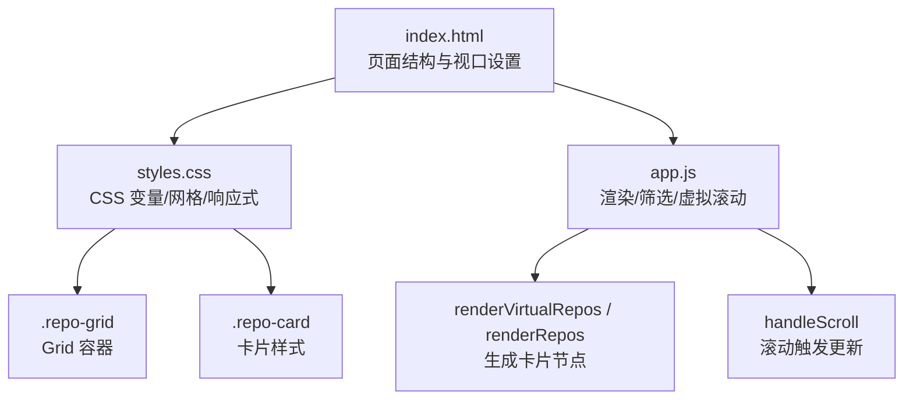
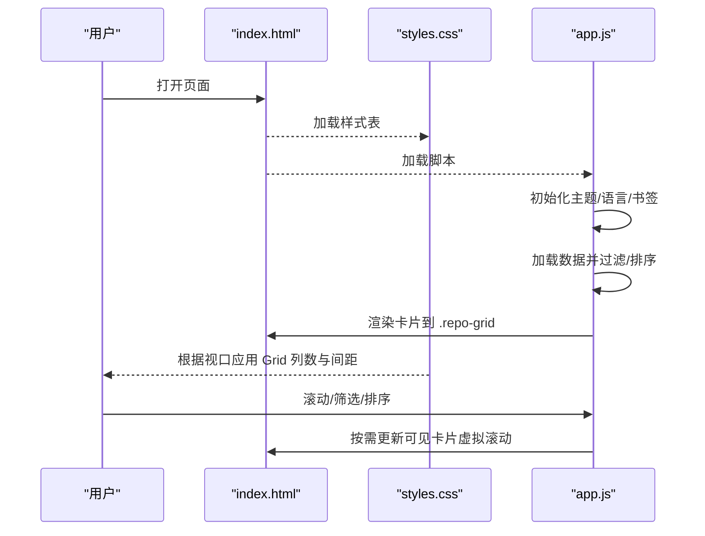
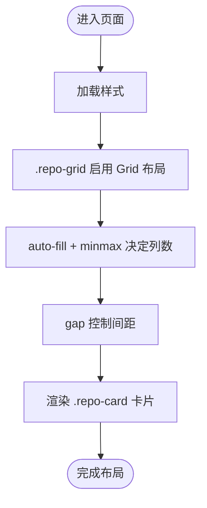
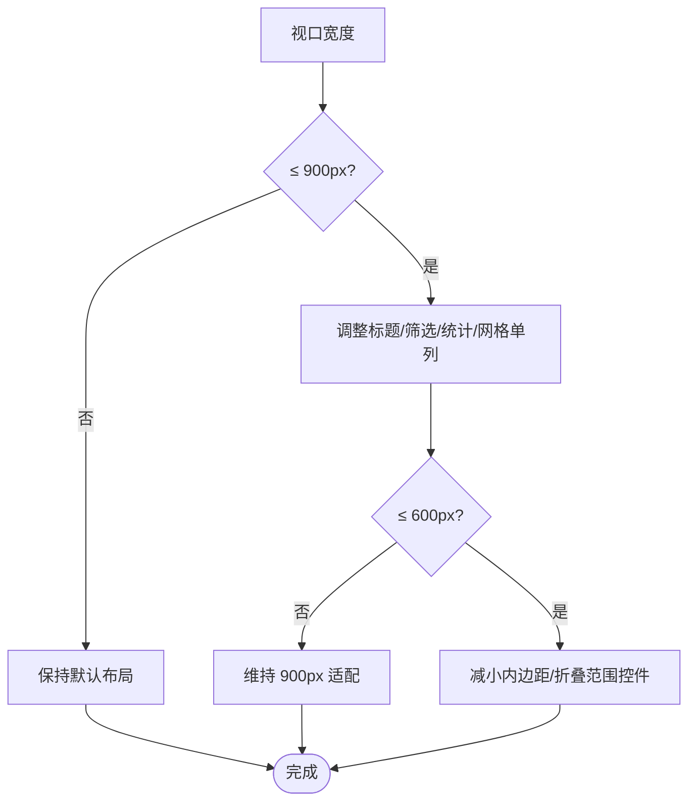
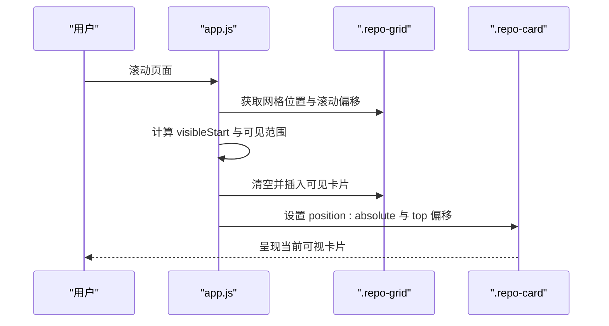
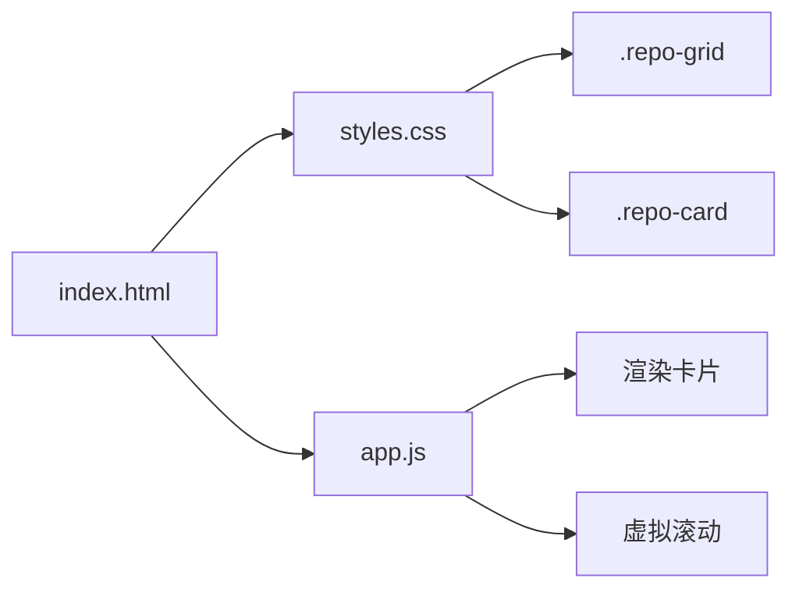

# 响应式布局系统

<cite>
**本文引用的文件**   
- [web/index.html](file://web/index.html)
- [web/styles.css](file://web/styles.css)
- [web/app.js](file://web/app.js)
</cite>

## 目录
1. [简介](#简介)
2. [项目结构](#项目结构)
3. [核心组件](#核心组件)
4. [架构总览](#架构总览)
5. [详细组件分析](#详细组件分析)
6. [依赖关系分析](#依赖关系分析)
7. [性能考量](#性能考量)
8. [故障排查指南](#故障排查指南)
9. [结论](#结论)
10. [附录](#附录)

## 简介
本技术文档聚焦于仓库前端中的响应式布局系统，重点解析基于 CSS Grid 的自适应网格布局实现、卡片组件列数计算与间距控制、移动端适配策略，以及 viewport 检测、窗口大小监听与动态布局调整机制。文档同时给出不同屏幕尺寸下的断点与样式适配规则，并提供可复用的 CSS Grid 配置示例与最佳实践建议。

## 项目结构
本项目的前端位于 web 目录下，包含页面入口、样式与脚本：
- index.html：页面结构与元信息（含 viewport 设置）
- styles.css：主题变量、全局样式、网格布局、响应式媒体查询等
- app.js：数据加载、筛选排序、虚拟滚动、事件绑定等

图表来源
- [web/index.html:1-20](file://web/index.html#L1-L20)
- [web/styles.css:426-430](file://web/styles.css#L426-L430)
- [web/app.js:874-925](file://web/app.js#L874-L925)

章节来源
- [web/index.html:1-20](file://web/index.html#L1-L20)
- [web/styles.css:426-430](file://web/styles.css#L426-L430)
- [web/app.js:874-925](file://web/app.js#L874-L925)

## 核心组件
- 视口与基础布局
  - 通过 meta viewport 确保移动端正确缩放与宽度基准
  - 使用 CSS 变量统一主题色与字体族，便于暗/亮主题切换
- 网格容器与卡片
  - .repo-grid 作为 CSS Grid 容器，定义列模板与间距
  - .repo-card 为单个项目卡片，承载标题、描述、统计信息等
- 响应式断点
  - 在两个主要断点下对布局进行适配：900px 与 600px
- 交互与动态行为
  - 大量筛选与排序逻辑由 JavaScript 驱动
  - 大数据量场景采用虚拟滚动优化渲染性能

章节来源
- [web/index.html:1-10](file://web/index.html#L1-L10)
- [web/styles.css:5-21](file://web/styles.css#L5-L21)
- [web/styles.css:426-430](file://web/styles.css#L426-L430)
- [web/styles.css:436-464](file://web/styles.css#L436-L464)
- [web/styles.css:625-685](file://web/styles.css#L625-L685)
- [web/app.js:874-925](file://web/app.js#L874-L925)

## 架构总览
下图展示了响应式布局的关键路径：HTML 提供语义化容器，CSS 通过 Grid 与媒体查询完成自适应，JS 负责数据渲染与滚动优化。

图表来源
- [web/index.html:1-20](file://web/index.html#L1-L20)
- [web/styles.css:426-430](file://web/styles.css#L426-L430)
- [web/app.js:874-925](file://web/app.js#L874-L925)

## 详细组件分析

### 基于 CSS Grid 的自适应网格布局
- 网格容器
  - 使用 repeat(auto-fill, minmax(最小列宽, 1fr)) 自动填充列，保证在不同宽度下合理分布
  - 通过 gap 控制卡片间距，提升可读性与视觉呼吸感
- 卡片组件
  - 卡片内部采用 Flex 布局组织头部、描述与统计区域，保持内容对齐与溢出处理
  - 悬停状态增加阴影与位移，增强交互反馈

图表来源
- [web/styles.css:426-430](file://web/styles.css#L426-L430)
- [web/styles.css:436-464](file://web/styles.css#L436-L464)

章节来源
- [web/styles.css:426-430](file://web/styles.css#L426-L430)
- [web/styles.css:436-464](file://web/styles.css#L436-L464)

### 列数计算与间距控制
- 列数计算
  - 通过 minmax(最小列宽, 1fr) 让浏览器自动计算每行能容纳的列数
  - 当容器宽度变化时，列数会随之增减，无需显式媒体查询
- 间距控制
  - 使用 gap 统一控制行列间距，避免使用 margin 带来的复杂计算
  - 在小屏下通过媒体查询将 grid-template-columns 改为单列，简化布局

章节来源
- [web/styles.css:426-430](file://web/styles.css#L426-L430)
- [web/styles.css:664-667](file://web/styles.css#L664-L667)

### 移动端适配策略与断点
- 断点定义
  - 900px：适用于平板与小桌面设备，调整标题字号、筛选面板布局、统计栏换行、网格单列
  - 600px：适用于手机设备，进一步减小内边距、折叠范围控件、隐藏分隔线等
- 适配要点
  - 在小屏上优先保证内容可读性与触控友好性
  - 减少不必要的装饰元素，突出关键信息

图表来源
- [web/styles.css:625-685](file://web/styles.css#L625-L685)

章节来源
- [web/styles.css:625-685](file://web/styles.css#L625-L685)

### viewport 检测与窗口大小监听
- viewport 设置
  - 通过 meta viewport 指定 width=device-width 与 initial-scale=1.0，确保移动端正确缩放
- 窗口大小监听
  - 当前代码未直接监听 window.resize；布局自适应主要由 CSS Grid 与媒体查询驱动
  - 若需动态调整布局参数（如列数或间距），可在 resize 事件中调用相应函数重新计算并刷新视图

章节来源
- [web/index.html:1-10](file://web/index.html#L1-L10)
- [web/styles.css:426-430](file://web/styles.css#L426-L430)
- [web/styles.css:625-685](file://web/styles.css#L625-L685)

### 动态布局调整机制（虚拟滚动）
- 触发条件
  - 当结果集超过阈值（例如 100 条）时启用虚拟滚动
- 工作原理
  - 固定卡片高度常量，计算总高度与可视区域起始索引
  - 仅渲染可视范围内的卡片，并通过绝对定位按行高偏移放置
  - 滚动时更新 visibleStart 与 DOM，避免全量重排
- 与响应式的结合
  - 虚拟滚动不改变 Grid 的列数与间距，但会影响整体高度与滚动体验
  - 在小屏设备上，由于单列显示，卡片数量增多，虚拟滚动尤为重要

图表来源
- [web/app.js:874-925](file://web/app.js#L874-L925)

章节来源
- [web/app.js:874-925](file://web/app.js#L874-L925)

### 具体 CSS Grid 配置示例与最佳实践
- 推荐配置
  - 使用 auto-fill 与 minmax 组合，使列数随容器宽度自适应
  - 使用 gap 统一间距，避免 margin 叠加问题
  - 在小屏媒体查询中覆盖为单列，确保移动端阅读体验
- 最佳实践
  - 将最小列宽设置为合理的像素值，以保证卡片内容不被过度压缩
  - 使用 CSS 变量管理主题与间距，便于维护与扩展
  - 在大列表场景下结合虚拟滚动，降低渲染开销

章节来源
- [web/styles.css:426-430](file://web/styles.css#L426-L430)
- [web/styles.css:625-685](file://web/styles.css#L625-L685)

## 依赖关系分析
- HTML 与 CSS 的关系
  - index.html 引入 styles.css，定义 .repo-grid 与 .repo-card 的结构与样式
- CSS 与 JS 的关系
  - app.js 向 .repo-grid 注入 .repo-card 节点，样式层负责布局与响应式
- 响应式与性能
  - 响应式由 CSS 主导，JS 负责大数据量的渲染优化（虚拟滚动）

图表来源
- [web/index.html:1-20](file://web/index.html#L1-L20)
- [web/styles.css:426-430](file://web/styles.css#L426-L430)
- [web/app.js:874-925](file://web/app.js#L874-L925)

章节来源
- [web/index.html:1-20](file://web/index.html#L1-L20)
- [web/styles.css:426-430](file://web/styles.css#L426-L430)
- [web/app.js:874-925](file://web/app.js#L874-L925)

## 性能考量
- 虚拟滚动
  - 仅在数据量较大时启用，显著减少 DOM 节点数量与重排成本
  - 固定卡片高度有助于精确计算可视区域与滚动位置
- 事件节流与防抖
  - 输入框搜索使用防抖，避免频繁触发筛选与渲染
- 媒体查询与 GPU 加速
  - 动画与过渡尽量使用 transform 与 opacity，利用 GPU 加速提升流畅度

章节来源
- [web/app.js:874-925](file://web/app.js#L874-L925)
- [web/app.js:1110-1113](file://web/app.js#L1110-L1113)

## 故障排查指南
- 网格布局异常
  - 检查 .repo-grid 是否启用了 display: grid 与正确的 grid-template-columns
  - 确认 gap 值未被其他样式覆盖
- 移动端显示错乱
  - 核对 viewport meta 是否正确设置
  - 检查 900px 与 600px 媒体查询是否生效
- 滚动卡顿
  - 确认虚拟滚动已启用且卡片高度常量合理
  - 避免在滚动回调中进行昂贵操作

章节来源
- [web/index.html:1-10](file://web/index.html#L1-L10)
- [web/styles.css:426-430](file://web/styles.css#L426-L430)
- [web/styles.css:625-685](file://web/styles.css#L625-L685)
- [web/app.js:874-925](file://web/app.js#L874-L925)

## 结论
该响应式布局系统以 CSS Grid 为核心，结合媒体查询与虚拟滚动，实现了跨设备的自适应展示与高性能渲染。通过合理的列数计算、间距控制与断点设计，系统在桌面与移动端均能提供良好的用户体验。建议在后续迭代中继续完善窗口大小监听与动态布局调整能力，进一步提升灵活性与可维护性。

## 附录
- 相关样式片段路径
  - 网格容器与卡片样式：[web/styles.css:426-464](file://web/styles.css#L426-L464)
  - 响应式媒体查询：[web/styles.css:625-685](file://web/styles.css#L625-L685)
- 相关脚本片段路径
  - 虚拟滚动与滚动处理：[web/app.js:874-925](file://web/app.js#L874-L925)
  - 输入防抖与筛选触发：[web/app.js:1110-1113](file://web/app.js#L1110-L1113)