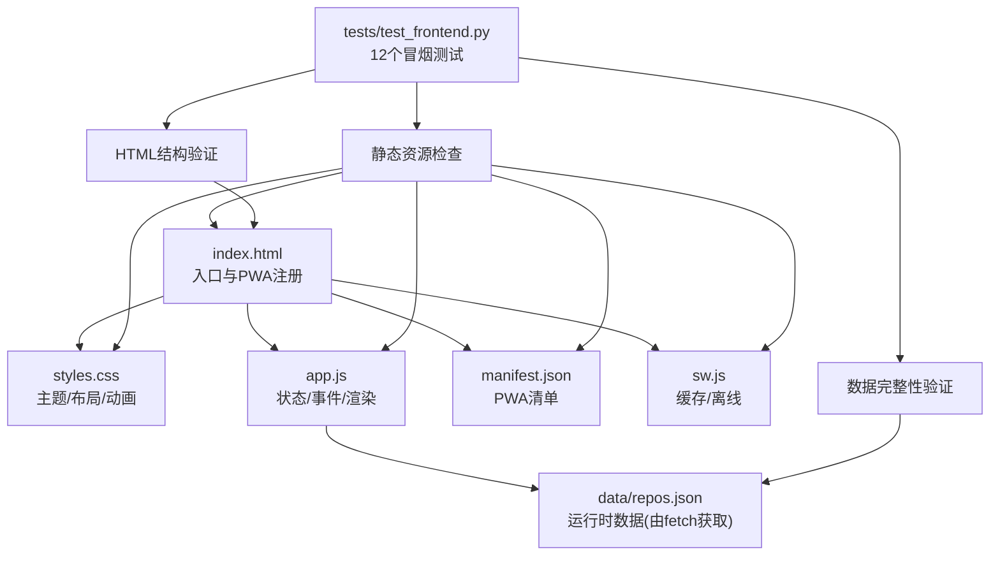
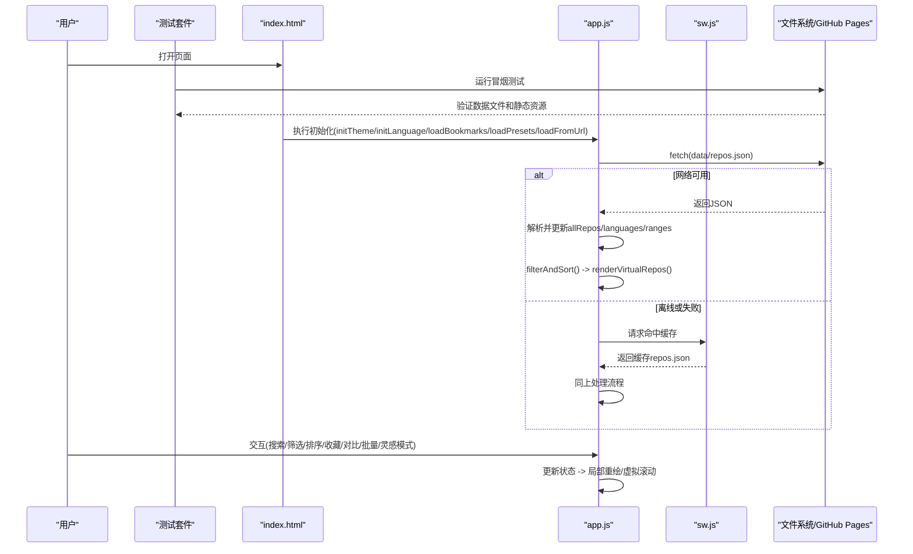
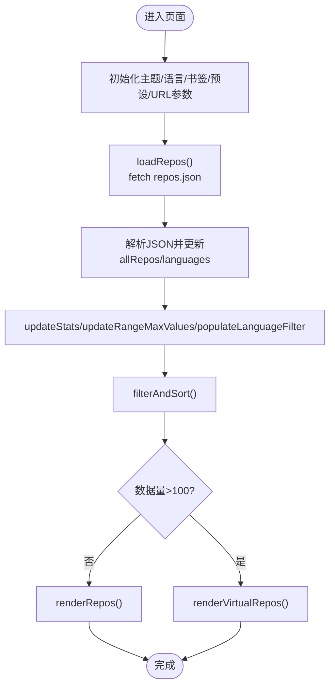
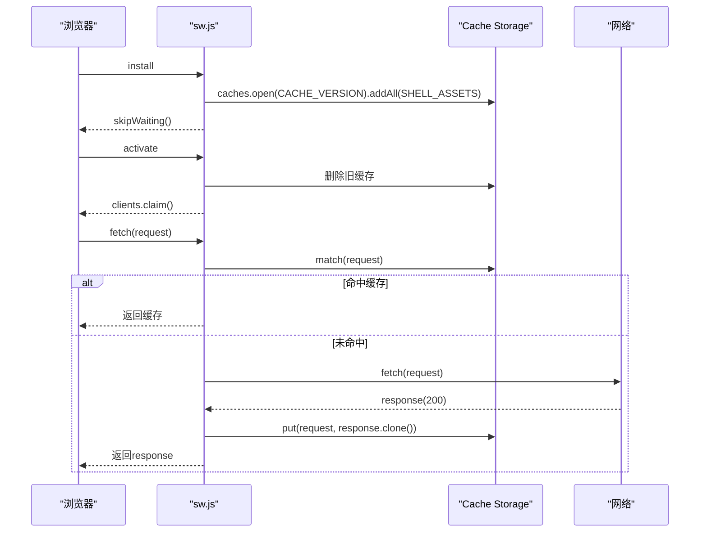
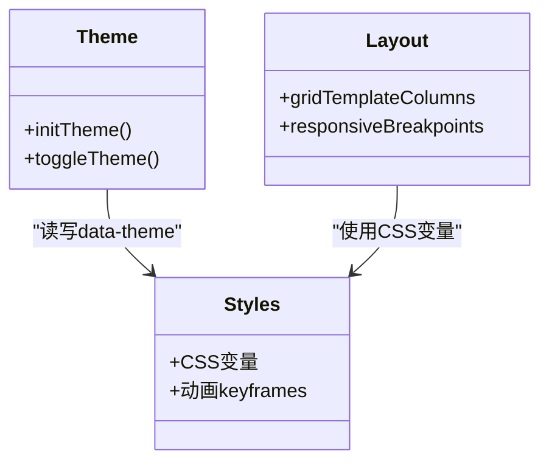
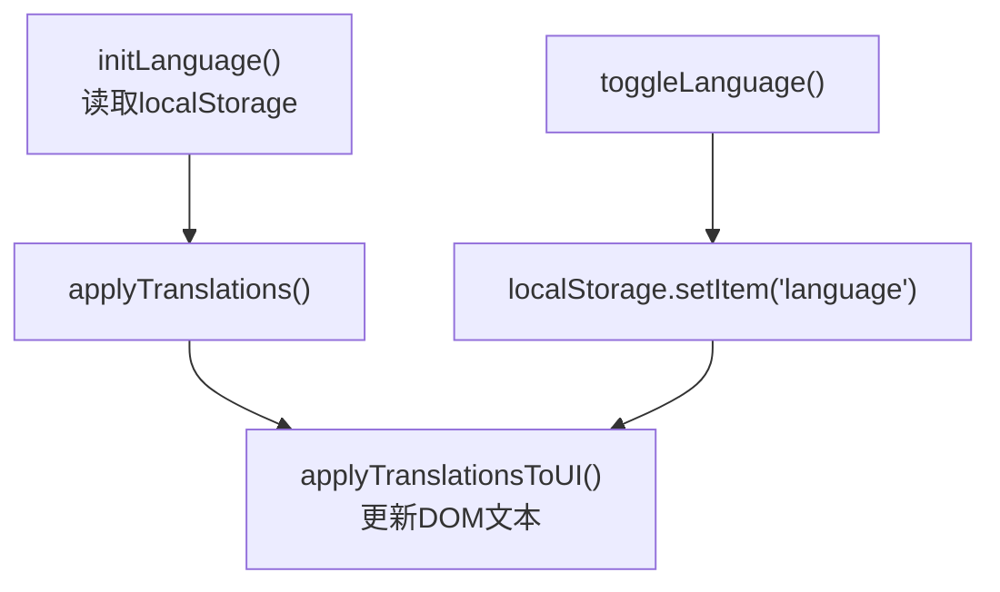
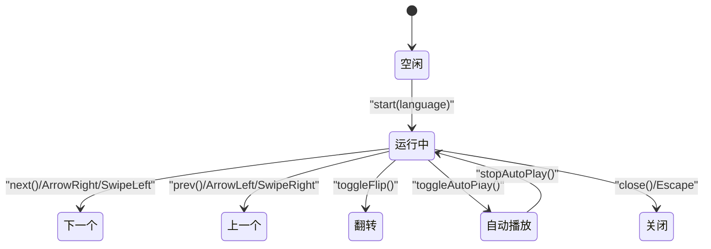
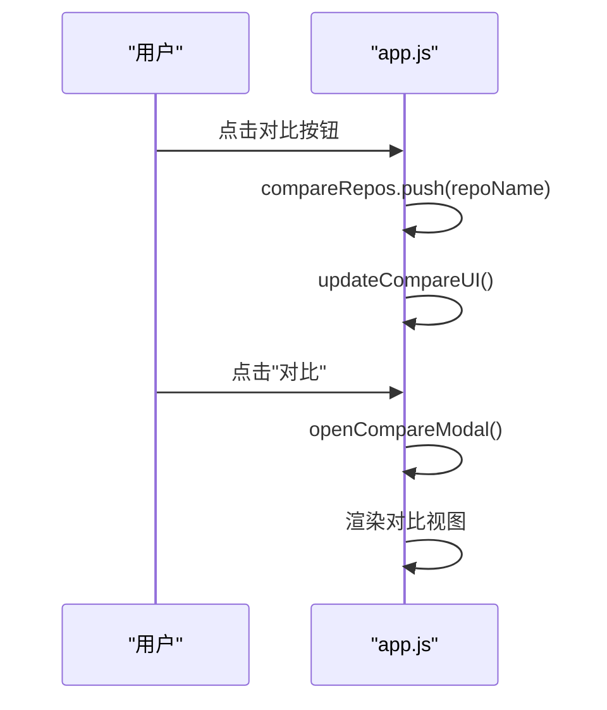
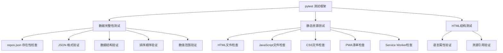
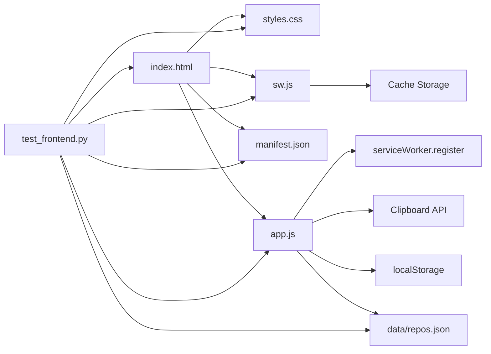

# 前端架构

<cite>
**本文引用的文件**   
- [web/index.html](file://web/index.html)
- [web/app.js](file://web/app.js)
- [web/styles.css](file://web/styles.css)
- [web/manifest.json](file://web/manifest.json)
- [web/sw.js](file://web/sw.js)
- [tests/test_frontend.py](file://tests/test_frontend.py)
- [data/repos.json](file://data/repos.json)
- [README.md](file://README.md)
</cite>

## 更新摘要
**所做更改**   
- 新增前端测试基础设施章节，详细说明12个冒烟测试的覆盖范围
- 更新数据完整性验证部分，包含JSON模式验证和排序检查
- 增强静态资源验证说明，涵盖HTML结构和依赖引用检查
- 添加测试驱动开发最佳实践指导

## 目录
1. [简介](#简介)
2. [项目结构](#项目结构)
3. [核心组件](#核心组件)
4. [架构总览](#架构总览)
5. [详细组件分析](#详细组件分析)
6. [前端测试基础设施](#前端测试基础设施)
7. [依赖关系分析](#依赖关系分析)
8. [性能考量](#性能考量)
9. [故障排查指南](#故障排查指南)
10. [结论](#结论)
11. [附录](#附录)

## 简介
本项目是一个基于 Vanilla JavaScript 的前端应用，用于展示与筛选 GitHub 优质仓库。它采用零构建、纯静态部署的架构，具备 PWA 离线能力、响应式网格布局、主题切换、国际化支持、虚拟列表、批量操作、对比模式、智能推荐与"灵感模式"等特性。数据来源于后端脚本聚合生成的 JSON 文件，前端通过 fetch 加载并在本地进行过滤、排序与渲染。

**更新** 项目现已集成完整的前端测试基础设施，包含12个冒烟测试确保数据完整性、静态资源可用性和HTML结构正确性。

## 项目结构
前端位于 web 目录下，包含入口 HTML、样式、主逻辑、PWA 清单与服务工作线程：
- index.html：页面骨架、资源引入、PWA 注册
- styles.css：主题变量、布局与交互样式
- app.js：状态管理、事件驱动、渲染与业务逻辑
- manifest.json：PWA 元信息与应用安装配置
- sw.js：Service Worker 缓存策略与离线支持
- tests/test_frontend.py：前端冒烟测试套件



图表来源
- [web/index.html:1-284](file://web/index.html#L1-L284)
- [web/styles.css:1-800](file://web/styles.css#L1-L800)
- [web/app.js:1-2634](file://web/app.js#L1-L2634)
- [web/manifest.json:1-16](file://web/manifest.json#L1-L16)
- [web/sw.js:1-128](file://web/sw.js#L1-L128)
- [tests/test_frontend.py:1-97](file://tests/test_frontend.py#L1-L97)

章节来源
- [README.md:123-148](file://README.md#L123-L148)
- [web/index.html:1-284](file://web/index.html#L1-L284)

## 核心组件
- 全局状态与数据
  - allRepos：仓库数据集
  - languages：语言集合
  - bookmarkedRepos：收藏集（localStorage）
  - showBookmarksOnly：仅收藏视图开关
  - filteredRepos：过滤后的结果集
  - visibleStart/visibleCount/BUFFER/CARD_HEIGHT：虚拟列表参数
  - currentLang：当前语言（zh/en）
  - InspirationMode：灵感模式对象（状态机）
- 渲染与交互
  - renderVirtualRepos / createCard：卡片生成与虚拟滚动
  - filterAndSort：过滤与排序
  - openModal/closeModal：详情弹窗
  - 分享、导出、对比、批量选择、预设保存
- 国际化与主题
  - I18N 字典与 t(key) 函数
  - initTheme/toggleTheme 基于 data-theme 切换
- PWA
  - manifest.json 定义应用名称、图标、启动页
  - sw.js 安装时预缓存、激活清理旧缓存、请求命中缓存优先

章节来源
- [web/app.js:1-200](file://web/app.js#L1-L200)
- [web/app.js:800-1200](file://web/app.js#L800-L1200)
- [web/app.js:1200-1700](file://web/app.js#L1200-L1700)
- [web/app.js:1700-2634](file://web/app.js#L1700-L2634)
- [web/manifest.json:1-16](file://web/manifest.json#L1-L16)
- [web/sw.js:1-128](file://web/sw.js#L1-L128)

## 架构总览
整体为单页应用（SPA），以事件驱动为核心：DOM 事件触发状态变更，状态变更驱动 UI 更新。数据层通过 fetch 拉取 JSON，渲染层使用虚拟列表优化长列表性能，PWA 层提供离线能力。测试层通过 pytest 框架确保数据完整性和静态资源可用性。



图表来源
- [web/index.html:276-282](file://web/index.html#L276-L282)
- [web/app.js:404-443](file://web/app.js#L404-L443)
- [web/sw.js:33-78](file://web/sw.js#L33-L78)
- [tests/test_frontend.py:31-97](file://tests/test_frontend.py#L31-L97)

## 详细组件分析

### 组件A：状态管理与事件驱动
- 状态设计
  - 集中式变量 + Set/Map 提升查找与去重效率
  - localStorage 持久化书签、预设、语言与主题
- 事件模型
  - 统一在 DOMContentLoaded 后绑定事件监听器
  - 输入防抖（debounce）降低高频输入导致的重排
  - 滚动监听结合虚拟列表减少 DOM 节点数量
- 关键流程
  - loadRepos：尝试多路径 fetch，失败时给出友好提示
  - filterAndSort：组合搜索、语言、阈值与排序规则
  - renderVirtualRepos：根据可见区域计算起始索引与可视数量，绝对定位卡片实现高性能滚动



图表来源
- [web/app.js:404-443](file://web/app.js#L404-L443)
- [web/app.js:839-847](file://web/app.js#L839-L847)
- [web/app.js:849-893](file://web/app.js#L849-L893)
- [web/app.js:1016-1049](file://web/app.js#L1016-L1049)

章节来源
- [web/app.js:1068-1074](file://web/app.js#L1068-L1074)
- [web/app.js:1097-1175](file://web/app.js#L1097-L1175)
- [web/app.js:1338-1338](file://web/app.js#L1338-L1338)

### 组件B：PWA 功能（Service Worker、离线缓存、安装）
- Service Worker 生命周期
  - install：预缓存静态资源与数据文件
  - activate：清理旧缓存版本，claim 控制所有客户端
  - fetch：先查缓存，再回源；成功则写入缓存；失败回退到缓存
- 应用清单
  - manifest.json 定义 name、short_name、start_url、display、theme_color、icons
- 注册时机
  - index.html 在 window.load 后检测 serviceWorker 并注册 sw.js



图表来源
- [web/sw.js:11-18](file://web/sw.js#L11-L18)
- [web/sw.js:20-31](file://web/sw.js#L20-L31)
- [web/sw.js:33-78](file://web/sw.js#L33-L78)
- [web/index.html:276-282](file://web/index.html#L276-L282)
- [web/manifest.json:1-16](file://web/manifest.json#L1-L16)

章节来源
- [web/sw.js:1-128](file://web/sw.js#L1-L128)
- [web/manifest.json:1-16](file://web/manifest.json#L1-L16)
- [web/index.html:276-282](file://web/index.html#L276-L282)

### 组件C：响应式网格布局与主题切换
- 网格布局
  - .repo-grid 使用 CSS Grid，auto-fill + minmax 实现自适应列数
  - 移动端断点下切换为单列
- 主题机制
  - :root 定义暗色变量，[data-theme="light"] 覆盖亮色变量
  - 切换按钮修改 body.dataset.theme 并持久化至 localStorage
- 字体与动效
  - 使用 Google Fonts 预连接与懒加载
  - 卡片入场动画、悬停阴影与过渡



图表来源
- [web/styles.css:5-36](file://web/styles.css#L5-L36)
- [web/styles.css:426-431](file://web/styles.css#L426-L431)
- [web/styles.css:625-685](file://web/styles.css#L625-L685)
- [web/app.js:196-208](file://web/app.js#L196-L208)

章节来源
- [web/styles.css:1-800](file://web/styles.css#L1-L800)
- [web/app.js:196-208](file://web/app.js#L196-L208)

### 组件D：国际化支持
- 字典结构
  - I18N 对象包含 zh 与 en 两套文案
- 动态替换
  - t(key) 读取当前语言对应文案
  - applyTranslationsToUI 将文案注入标题、占位符、标签、按钮等
- 语言切换
  - toggleLanguage 切换 currentLang 并持久化，随后刷新 UI



图表来源
- [web/app.js:38-190](file://web/app.js#L38-L190)
- [web/app.js:210-221](file://web/app.js#L210-L221)
- [web/app.js:223-294](file://web/app.js#L223-L294)

章节来源
- [web/app.js:38-190](file://web/app.js#L38-L190)
- [web/app.js:210-221](file://web/app.js#L210-L221)
- [web/app.js:223-294](file://web/app.js#L223-L294)

### 组件E：灵感模式（Inspiration Mode）
- 状态机
  - 维护当前索引、历史栈、是否自动播放、翻转状态、触摸滑动偏移等
- 交互
  - 键盘导航（左右箭头、空格收藏、Enter打开、F翻转、T分享、P自动播放、U/R撤销重做、Home/End首尾、Esc关闭）
  - 触摸滑动（touchstart/move/end）+ 视觉指示器
  - 自动播放定时器与进度条
- 可访问性
  - aria-* 属性与 liveRegion 播报
- 持久化
  - 记录已浏览仓库与最后位置，按语言维度恢复



图表来源
- [web/app.js:1820-2606](file://web/app.js#L1820-L2606)

章节来源
- [web/app.js:1792-2606](file://web/app.js#L1792-2606)

### 组件F：对比与批量操作
- 对比模式
  - 最多选择两个仓库，弹出对比弹窗，横向条形图比较 Stars/Forks/Score
- 批量选择
  - 勾选多个仓库，批量收藏/导出/清空
- 分享链接
  - 将筛选条件同步到 URL 查询参数，支持复制分享



图表来源
- [web/app.js:1395-1427](file://web/app.js#L1395-L1427)
- [web/app.js:1427-1527](file://web/app.js#L1427-L1527)
- [web/app.js:1529-1586](file://web/app.js#L1529-L1586)
- [web/app.js:1340-1393](file://web/app.js#L1340-L1393)

章节来源
- [web/app.js:1395-1586](file://web/app.js#L1395-L1586)
- [web/app.js:1340-1393](file://web/app.js#L1340-L1393)

## 前端测试基础设施

### 测试架构概览
项目集成了完整的 pytest 测试框架，包含12个专门针对前端资产和数据完整性的冒烟测试。这些测试确保在生产环境部署前，所有关键组件都经过严格验证。



图表来源
- [tests/test_frontend.py:1-97](file://tests/test_frontend.py#L1-L97)

### 数据完整性验证测试

#### repos.json 文件验证
- **test_data_file_exists**: 验证数据文件是否存在于预期路径
- **test_data_is_valid_json**: 检查 JSON 文件格式正确性，确保包含必需的顶层字段 `repos` 和 `total`
- **test_data_has_repos**: 验证仓库数组不为空，确保至少有一个仓库条目

#### 数据模式验证
- **test_repo_schema**: 对前50个仓库进行模式验证，确保每个仓库包含必需字段：
  - `name`: 仓库名称
  - `url`: GitHub 仓库地址
  - `description`: 仓库描述
  - `stars`: Star 数量
  - `forks`: Fork 数量
  - `language`: 编程语言
  - `today_stars`: 今日新增 Star
  - `score`: 综合评分
  - `fetched_at`: 数据抓取时间
  - `source`: 数据来源

#### 数据质量验证
- **test_repos_sorted_by_score_desc**: 验证仓库按综合评分降序排列，确保数据一致性
- **test_stars_are_non_negative**: 检查所有仓库的 Star 数量为非负数，防止数据异常

**更新** 新增的数据完整性测试确保前端应用能够可靠地加载和处理仓库数据，避免因数据格式问题导致的应用崩溃。

章节来源
- [tests/test_frontend.py:31-63](file://tests/test_frontend.py#L31-L63)

### 静态资源验证测试

#### 核心文件存在性检查
- **test_index_html_exists**: 验证入口 HTML 文件存在
- **test_app_js_exists**: 验证主应用程序 JavaScript 文件存在
- **test_styles_css_exists**: 验证样式表文件存在
- **test_manifest_json_exists**: 验证 PWA 清单文件存在
- **test_sw_js_exists**: 验证 Service Worker 文件存在

#### HTML 结构验证
- **test_index_html_has_chinese_lang**: 验证 HTML 根元素包含正确的中文语言设置 `lang="zh-CN"`
- **test_index_html_references_assets**: 验证 HTML 文件正确引用了必要的静态资源：
  - JavaScript 文件引用：`src="app.js"`
  - CSS 样式文件引用：`href="styles.css"`

**更新** 静态资源测试确保前端应用的所有必要文件都存在且正确引用，避免因文件缺失或路径错误导致的应用无法加载。

章节来源
- [tests/test_frontend.py:68-97](file://tests/test_frontend.py#L68-L97)

### 测试执行与持续集成

#### 本地测试执行
```bash
# 运行前端冒烟测试
pytest tests/test_frontend.py -v

# 运行所有测试套件
pytest tests/ -v
```

#### 测试覆盖率
- **数据层测试**: 6个测试用例覆盖数据文件的完整性、格式和质量
- **静态资源测试**: 5个测试用例覆盖核心前端文件的可用性
- **HTML结构测试**: 2个测试用例覆盖语言设置和资源引用
- **总计**: 12个冒烟测试用例

#### 测试最佳实践
- **模块级fixture**: 使用 `@pytest.fixture(scope="module")` 避免重复加载大型数据文件
- **增量验证**: 对大数据集只检查前50个条目，平衡测试速度与覆盖率
- **明确错误消息**: 每个断言都包含详细的错误信息，便于快速定位问题
- **编码规范**: 统一使用 UTF-8 编码处理文件读写，确保跨平台兼容性

**更新** 测试基础设施的引入显著提升了项目的质量保证水平，通过自动化测试确保前端应用的稳定性和可靠性。

章节来源
- [tests/test_frontend.py:1-97](file://tests/test_frontend.py#L1-L97)

## 依赖关系分析
- 模块耦合
  - index.html 依赖 styles.css、app.js、manifest.json、sw.js
  - app.js 依赖 DOM API、localStorage、navigator.clipboard、navigator.serviceWorker、fetch
  - sw.js 依赖 Cache Storage、Fetch API
  - test_frontend.py 依赖 pytest、json、pathlib
- 外部依赖
  - Google Fonts（预连接与异步加载）
  - GitHub Pages 托管静态资源
  - Python pytest 测试框架
- 潜在循环依赖
  - 无直接循环引用，均为单向依赖



图表来源
- [web/index.html:1-284](file://web/index.html#L1-L284)
- [web/app.js:1-2634](file://web/app.js#L1-L2634)
- [web/sw.js:1-128](file://web/sw.js#L1-L128)
- [tests/test_frontend.py:1-97](file://tests/test_frontend.py#L1-L97)

章节来源
- [web/index.html:1-284](file://web/index.html#L1-L284)
- [web/app.js:1-2634](file://web/app.js#L1-L2634)
- [web/sw.js:1-128](file://web/sw.js#L1-L128)
- [tests/test_frontend.py:1-97](file://tests/test_frontend.py#L1-L97)

## 性能考量
- 虚拟列表
  - 当 filteredRepos > 100 时启用虚拟滚动，固定 CARD_HEIGHT，仅渲染可视区及缓冲项，显著降低 DOM 节点数量与重排开销
- 防抖与节流
  - 搜索输入使用 debounce 降低 filterAndSort 调用频率
  - 滚动监听使用 requestAnimationFrame 与节流（16ms）避免频繁重绘
- 缓存策略
  - Service Worker 预缓存静态资源与数据文件，首次加载后离线可用
  - 请求命中缓存优先，成功后回写缓存，保证一致性
- 内存管理
  - 使用 Set 存储书签与已浏览仓库，O(1) 查找与去重
  - 及时移除事件监听（如灵感模式关闭时解绑键盘事件）
- 图片与字体
  - 使用 SVG 内联图标，减少 HTTP 请求
  - 字体使用 preconnect 与异步加载，避免阻塞首屏
- 测试性能优化
  - 使用模块级 fixture 避免重复加载大型数据文件
  - 对大数据集只检查前50个条目，平衡测试速度与覆盖率

章节来源
- [web/app.js:864-915](file://web/app.js#L864-L915)
- [web/app.js:1068-1074](file://web/app.js#L1068-L1074)
- [web/app.js:1338-1338](file://web/app.js#L1338-L1338)
- [web/sw.js:11-18](file://web/sw.js#L11-L18)
- [web/sw.js:33-78](file://web/sw.js#L33-L78)
- [web/index.html:11-13](file://web/index.html#L11-L13)
- [tests/test_frontend.py:24-28](file://tests/test_frontend.py#L24-L28)

## 故障排查指南
- 数据加载失败
  - 现象：页面显示"无法加载数据"，并提示 file:// 协议限制或需运行爬虫生成数据
  - 原因：浏览器禁止 file:// 协议下的 fetch；或 data/repos.json 不存在
  - 解决：通过本地 HTTP 服务器访问（例如 python3 -m http.server 8000），或在根目录运行爬虫生成数据
- Service Worker 不生效
  - 现象：离线不可用或缓存未更新
  - 检查：确认 sw.js 路径正确、manifest.json 存在、浏览器控制台无报错
  - 建议：在开发环境禁用缓存或使用无痕模式测试
- 键盘快捷键无效
  - 现象：部分快捷键无响应
  - 原因：焦点在输入框或 textarea 上会跳过全局快捷键
  - 解决：按 / 聚焦搜索框后再使用其他快捷键
- 测试失败排查
  - 现象：pytest 测试报告断言失败
  - 检查：确认数据文件路径正确、JSON 格式合法、静态资源文件存在
  - 调试：查看具体的断言错误消息，定位问题所在

**更新** 新增测试失败的排查指导，帮助开发者快速定位和修复前端相关问题。

章节来源
- [web/app.js:428-443](file://web/app.js#L428-L443)
- [web/index.html:276-282](file://web/index.html#L276-L282)
- [web/app.js:1258-1289](file://web/app.js#L1258-L1289)
- [tests/test_frontend.py:31-97](file://tests/test_frontend.py#L31-L97)

## 结论
该前端架构以极简技术栈实现了丰富的交互体验与工程化能力：通过事件驱动与集中状态管理，配合虚拟列表与防抖，保证了大数据量下的流畅度；借助 Service Worker 与 PWA 清单，提供了离线与安装能力；主题与国际化提升了用户体验；对比、批量与灵感模式增强了探索效率。**新增的测试基础设施**通过12个冒烟测试确保了数据完整性、静态资源可用性和HTML结构正确性，显著提升了项目的质量保证水平。整体代码组织清晰、职责单一，易于扩展与维护。

## 附录
- 快速开始与数据来源说明参见 README
- 评分算法与数据源见 README 相关章节
- 测试执行命令：`pytest tests/test_frontend.py -v`

章节来源
- [README.md:1-182](file://README.md#L1-L182)
- [tests/test_frontend.py:1-97](file://tests/test_frontend.py#L1-L97)