# 应用架构设计

<cite>
**本文引用的文件**   
- [web/app.js](file://web/app.js)
- [web/index.html](file://web/index.html)
- [web/styles.css](file://web/styles.css)
- [web/manifest.json](file://web/manifest.json)
- [web/sw.js](file://web/sw.js)
- [README.md](file://README.md)
</cite>

## 目录
1. [简介](#简介)
2. [项目结构](#项目结构)
3. [核心组件](#核心组件)
4. [架构总览](#架构总览)
5. [详细组件分析](#详细组件分析)
6. [依赖关系分析](#依赖关系分析)
7. [性能考量](#性能考量)
8. [故障排查指南](#故障排查指南)
9. [结论](#结论)
10. [附录](#附录)

## 简介
本项目是一个基于 Vanilla JavaScript 的单页应用（SPA），用于聚合与展示高质量 GitHub 仓库，并提供多维度筛选、收藏管理、对比、智能推荐与“灵感模式”等高级功能。前端采用零构建步骤的纯 HTML/CSS/JS 方案，结合 Service Worker 实现 PWA 离线能力；数据通过本地静态 JSON 提供，由后端脚本定时抓取并生成。

本技术文档聚焦于：
- 全局状态管理与事件驱动模式
- 模块组织与职责划分
- 应用初始化流程、数据加载机制与组件生命周期
- 响应式数据绑定、DOM 操作优化与内存管理策略
- 观察者模式、事件委托与模块化设计的代码级示例路径
- 前后端交互方式与错误处理机制

## 项目结构
前端位于 web 目录，包含入口页面、样式、主逻辑、PWA 清单与服务工作者。整体为扁平化单文件前端架构，所有业务逻辑集中在 app.js 中，HTML 负责结构与资源引入，CSS 负责主题与布局，sw.js 与 manifest.json 提供 PWA 能力。

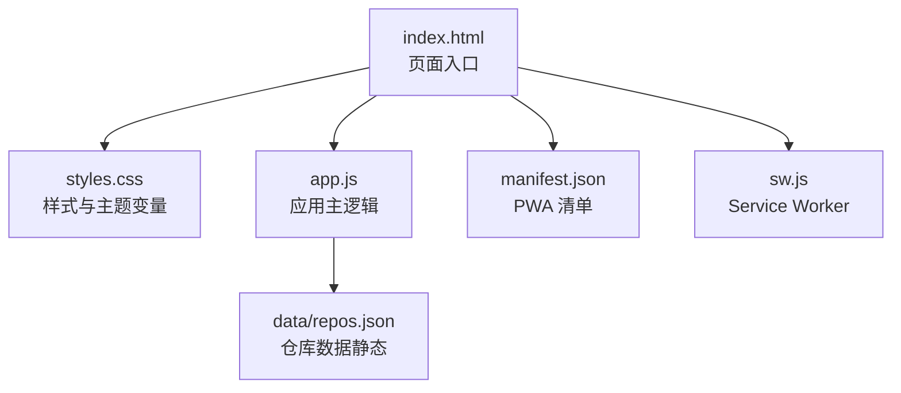

图表来源
- [web/index.html:1-284](file://web/index.html#L1-L284)
- [web/app.js:1-800](file://web/app.js#L1-L800)
- [web/styles.css:1-800](file://web/styles.css#L1-L800)
- [web/manifest.json:1-16](file://web/manifest.json#L1-L16)
- [web/sw.js:1-50](file://web/sw.js#L1-L50)

章节来源
- [README.md:123-148](file://README.md#L123-L148)
- [web/index.html:1-284](file://web/index.html#L1-L284)

## 核心组件
- 全局状态中心
  - 仓库列表 allRepos、过滤结果 filteredRepos、语言集合 languages、收藏集 bookmarkedRepos、当前弹窗项 currentModalRepo、当前语言 currentLang、加载标志 isLoading、分页可见范围 visibleStart/visibleCount 等。
- 国际化 I18N
  - 多语言字典与 t(key) 翻译函数，支持中文/英文切换。
- 主题系统
  - 通过 body.dataset.theme 控制 CSS 变量，持久化到 localStorage。
- 数据层
  - loadRepos 从多个候选路径拉取 data/repos.json，解析后更新统计、提取语言、填充筛选器、执行过滤排序与渲染。
- 视图渲染
  - renderVirtualRepos 实现虚拟滚动，createCard 生成卡片 DOM 字符串，renderSearchPreview 提供搜索预览。
- 交互与事件
  - 事件委托在 repoGrid 上统一处理收藏、对比、分享、批量选择、打开详情等操作。
- 高级特性
  - InspirationMode 对象封装“灵感模式”，包括滑动、自动播放、历史撤销/重做、键盘导航、无障碍播报等。
- 工具与辅助
  - esc、fmtNum、fmtDate、debounce、getCloneCommand、shareToTwitter/LinkedIn/copyLink 等。

章节来源
- [web/app.js:1-200](file://web/app.js#L1-L200)
- [web/app.js:404-443](file://web/app.js#L404-L443)
- [web/app.js:849-915](file://web/app.js#L849-L915)
- [web/app.js:1097-1175](file://web/app.js#L1097-L1175)
- [web/app.js:1792-2606](file://web/app.js#L1792-L2606)

## 架构总览
应用采用“单一主控制器 + 局部对象模块”的混合模式：
- 主控制器：集中式函数与全局变量承担状态与流程编排
- 局部对象模块：InspirationMode 以对象形式封装复杂子系统的状态与行为
- 事件驱动：通过事件委托将大量子元素交互收敛到父容器监听
- 数据流：JSON 数据 → 全局状态 → 过滤/排序 → 虚拟滚动渲染 → UI 反馈

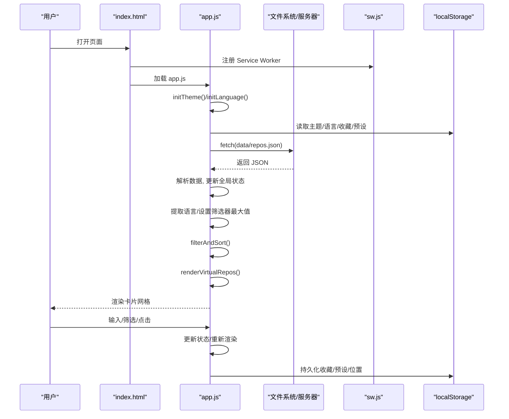

图表来源
- [web/index.html:275-282](file://web/index.html#L275-L282)
- [web/app.js:2617-2624](file://web/app.js#L2617-L2624)
- [web/app.js:404-443](file://web/app.js#L404-L443)
- [web/app.js:849-915](file://web/app.js#L849-L915)
- [web/sw.js:1-50](file://web/sw.js#L1-L50)

## 详细组件分析

### 全局状态与初始化流程
- 初始化顺序
  - 主题初始化：根据系统偏好或本地存储设置 body 主题
  - 语言初始化：读取本地存储并应用标题与 UI 文案
  - 加载收藏与预设：从 localStorage 恢复
  - URL 参数解析：将查询参数映射到筛选控件
  - 数据加载：尝试多个路径获取 repos.json，成功后更新统计、语言、筛选器、执行过滤排序与渲染
- 关键状态
  - allRepos、filteredRepos、languages、bookmarkedRepos、currentModalRepo、currentLang、isLoading、visibleStart/visibleCount

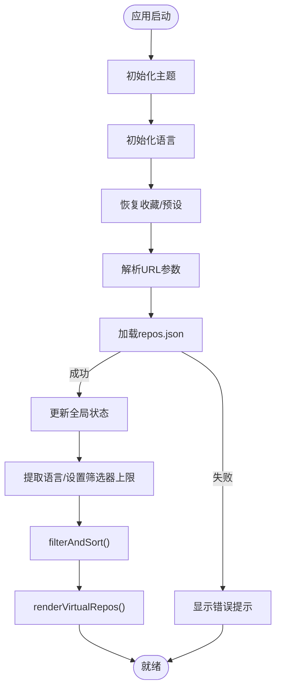

图表来源
- [web/app.js:196-225](file://web/app.js#L196-L225)
- [web/app.js:296-309](file://web/app.js#L296-L309)
- [web/app.js:1362-1383](file://web/app.js#L1362-L1383)
- [web/app.js:404-443](file://web/app.js#L404-L443)
- [web/app.js:822-847](file://web/app.js#L822-L847)
- [web/app.js:1016-1049](file://web/app.js#L1016-L1049)
- [web/app.js:864-893](file://web/app.js#L864-L893)

章节来源
- [web/app.js:196-225](file://web/app.js#L196-L225)
- [web/app.js:296-309](file://web/app.js#L296-L309)
- [web/app.js:1362-1383](file://web/app.js#L1362-L1383)
- [web/app.js:404-443](file://web/app.js#L404-L443)
- [web/app.js:822-847](file://web/app.js#L822-L847)
- [web/app.js:1016-1049](file://web/app.js#L1016-L1049)
- [web/app.js:864-893](file://web/app.js#L864-L893)

### 数据加载与错误处理
- 数据源与重试
  - 依次尝试 ../data/repos.json、./data/repos.json、data/repos.json，任一成功即使用
- 错误处理
  - 当请求失败或协议为 file:// 时，显示友好提示，指导用户使用本地 HTTP 服务或运行爬虫脚本
- 数据更新后的副作用
  - 更新统计信息、计算语言分布、渲染标签分类、设置滑块最大值、触发过滤与渲染

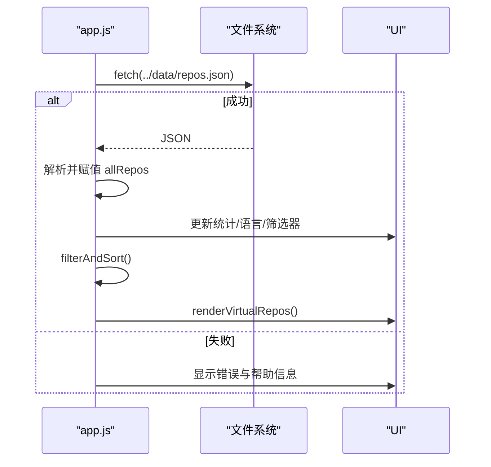

图表来源
- [web/app.js:404-443](file://web/app.js#L404-L443)
- [web/app.js:467-494](file://web/app.js#L467-L494)
- [web/app.js:517-545](file://web/app.js#L517-L545)
- [web/app.js:839-847](file://web/app.js#L839-L847)

章节来源
- [web/app.js:404-443](file://web/app.js#L404-L443)
- [web/app.js:467-494](file://web/app.js#L467-L494)
- [web/app.js:517-545](file://web/app.js#L517-L545)
- [web/app.js:839-847](file://web/app.js#L839-L847)

### 过滤、排序与响应式数据绑定
- 过滤条件
  - 关键词搜索（名称/描述）、语言筛选、Stars/Forks/Score 阈值、仅收藏视图
- 排序策略
  - 综合评分、Stars、Forks、今日增长、飙升指数（today_stars/stars）
- 响应式绑定
  - 输入框 input 事件触发防抖后调用 filterAndSort
  - 下拉框 change 与滑块 input 直接触发 filterAndSort
  - 过滤结果变化后更新计数、重置可见起始索引并渲染

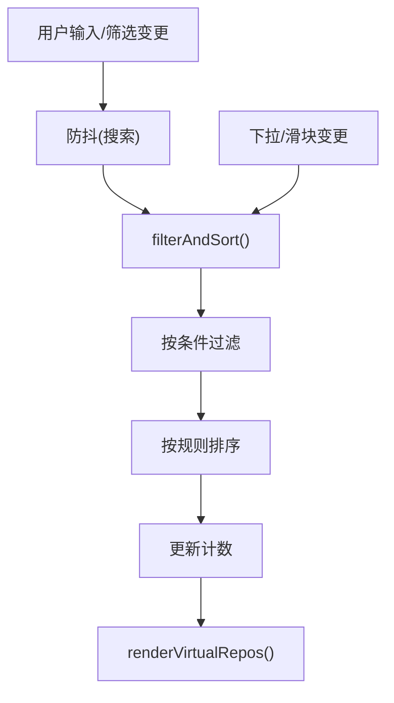

图表来源
- [web/app.js:1016-1049](file://web/app.js#L1016-L1049)
- [web/app.js:1100-1114](file://web/app.js#L1100-L1114)
- [web/app.js:1068-1074](file://web/app.js#L1068-L1074)
- [web/app.js:864-893](file://web/app.js#L864-L893)

章节来源
- [web/app.js:1016-1049](file://web/app.js#L1016-L1049)
- [web/app.js:1100-1114](file://web/app.js#L1100-L1114)
- [web/app.js:1068-1074](file://web/app.js#L1068-L1074)
- [web/app.js:864-893](file://web/app.js#L864-L893)

### 虚拟滚动与 DOM 操作优化
- 虚拟滚动策略
  - 当结果超过 100 条启用虚拟滚动，固定卡片高度，计算可视区域并只渲染可见及缓冲区的卡片
  - 滚动事件中节流/防抖更新可见区间，避免频繁重排
- DOM 优化
  - 使用 innerHTML 拼接模板字符串一次性插入
  - 对大列表使用绝对定位减少布局抖动
  - 动画延迟 stagger 提升视觉体验

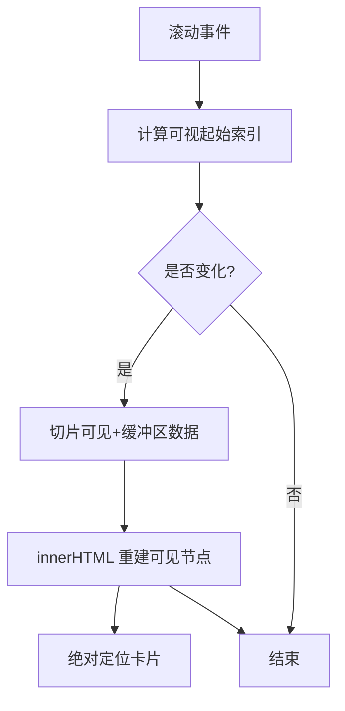

图表来源
- [web/app.js:864-893](file://web/app.js#L864-L893)
- [web/app.js:895-915](file://web/app.js#L895-L915)
- [web/app.js:1076-1080](file://web/app.js#L1076-L1080)

章节来源
- [web/app.js:864-893](file://web/app.js#L864-L893)
- [web/app.js:895-915](file://web/app.js#L895-L915)
- [web/app.js:1076-1080](file://web/app.js#L1076-L1080)

### 事件委托与交互模式
- 事件委托
  - 在 #repoGrid 上统一监听 click，通过 e.target.closest(...) 识别具体按钮（收藏、对比、分享、批量选择），减少事件监听器数量
- 模态框与分享菜单
  - 打开/关闭模态框，动态注入内容；分享菜单动态创建并点击外部区域自动移除
- 键盘导航
  - 全局 keydown 监听，支持方向键导航、Enter 打开详情、Space 收藏、C 加入对比、T/L/B 快捷切换等

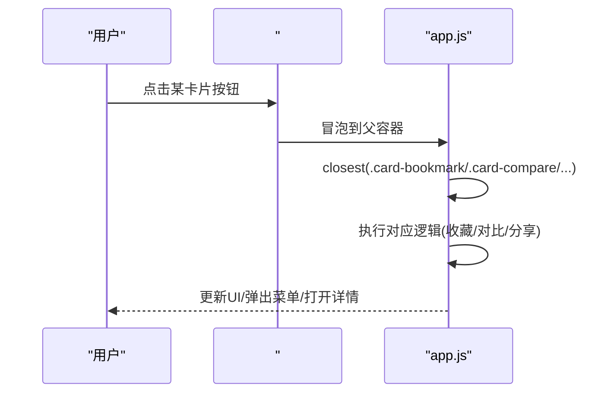

图表来源
- [web/app.js:1131-1175](file://web/app.js#L1131-L1175)
- [web/app.js:673-719](file://web/app.js#L673-L719)
- [web/app.js:1258-1336](file://web/app.js#L1258-L1336)

章节来源
- [web/app.js:1131-1175](file://web/app.js#L1131-L1175)
- [web/app.js:673-719](file://web/app.js#L673-L719)
- [web/app.js:1258-1336](file://web/app.js#L1258-L1336)

### 观察者模式与订阅-发布
- 观察模式体现
  - 主题切换：toggleTheme 修改 body.dataset.theme，CSS 变量随之生效，所有依赖主题的组件即时响应
  - 语言切换：toggleLanguage 更新 currentLang 并调用 applyTranslationsToUI，刷新所有文案
  - 收藏状态：toggleBookmark 更新 Set 并持久化，随后 updateBookmarkUI 同步所有相关按钮状态
- 订阅-发布简化版
  - 通过函数组合与回调链（如 filterAndSort 被多处触发）形成隐式的“事件总线”，各模块订阅状态变更并作出反应

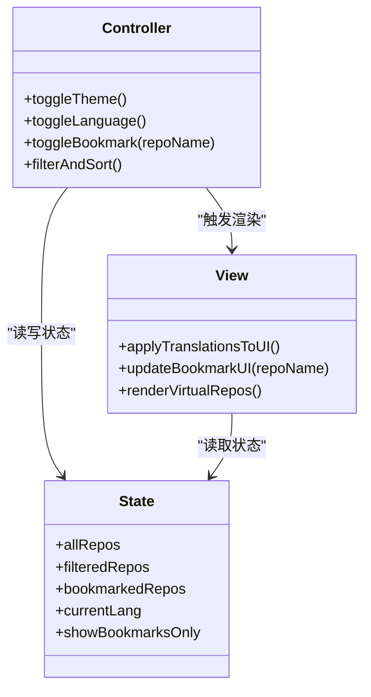

图表来源
- [web/app.js:196-225](file://web/app.js#L196-L225)
- [web/app.js:227-294](file://web/app.js#L227-L294)
- [web/app.js:311-350](file://web/app.js#L311-L350)
- [web/app.js:1016-1049](file://web/app.js#L1016-L1049)

章节来源
- [web/app.js:196-225](file://web/app.js#L196-L225)
- [web/app.js:227-294](file://web/app.js#L227-L294)
- [web/app.js:311-350](file://web/app.js#L311-L350)
- [web/app.js:1016-1049](file://web/app.js#L1016-L1049)

### 模块化设计与对象封装：InspirationMode
- 对象封装
  - InspirationMode 作为独立对象封装“灵感模式”的状态、配置、渲染、事件绑定、触摸手势、自动播放、历史栈、无障碍播报等
- 生命周期
  - start(language) 初始化并渲染，bindKeyboard 绑定键盘，close() 清理定时器与事件
- 可访问性
  - aria-* 属性、live region 播报、焦点管理

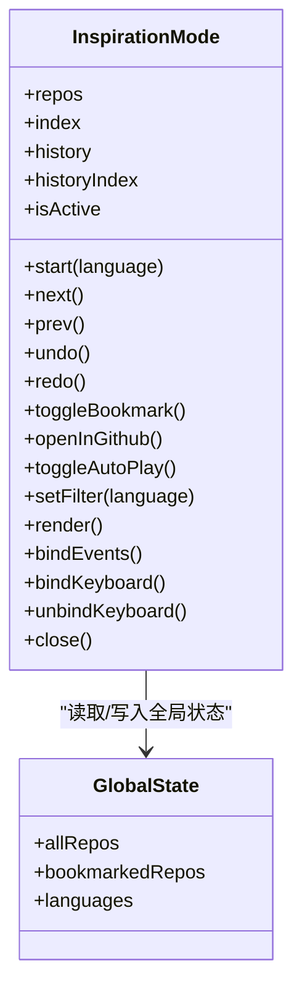

图表来源
- [web/app.js:1792-2606](file://web/app.js#L1792-L2606)

章节来源
- [web/app.js:1792-2606](file://web/app.js#L1792-L2606)

### 与后端数据的交互方式
- 数据来源
  - 静态 JSON 文件 data/repos.json，由 Python 脚本周期性抓取 Awesome Lists、GitHub Search API、Hacker News、DEV.to 等多源数据生成
- 前端交互
  - 通过 fetch 异步请求，支持多路径回退；失败时给出明确指引
- 部署与缓存
  - Service Worker 缓存静态资源与数据，提高首屏与离线可用性

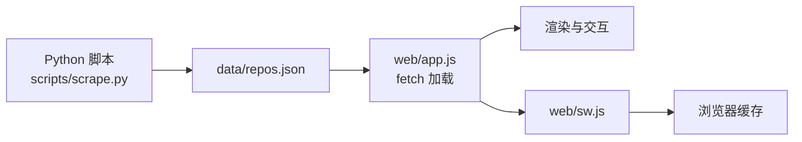

图表来源
- [README.md:98-121](file://README.md#L98-L121)
- [web/app.js:404-443](file://web/app.js#L404-L443)
- [web/sw.js:1-50](file://web/sw.js#L1-L50)

章节来源
- [README.md:98-121](file://README.md#L98-L121)
- [web/app.js:404-443](file://web/app.js#L404-L443)
- [web/sw.js:1-50](file://web/sw.js#L1-L50)

## 依赖关系分析
- 文件内依赖
  - index.html 引入 styles.css、app.js 与 sw.js 注册
  - app.js 依赖 data/repos.json 与 localStorage
  - sw.js 缓存 index.html、styles.css、app.js、data/repos.json
- 运行时依赖
  - 浏览器 API：fetch、localStorage、navigator.clipboard、matchMedia、IntersectionObserver（未使用，但可考虑）、requestAnimationFrame
- 潜在循环依赖
  - 无显式循环引用，均为单向调用

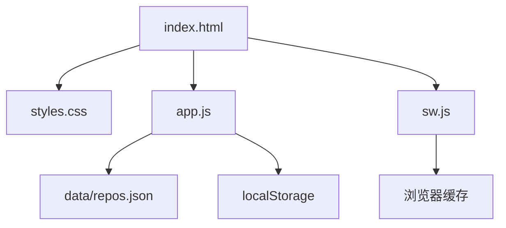

图表来源
- [web/index.html:1-284](file://web/index.html#L1-L284)
- [web/app.js:1-200](file://web/app.js#L1-L200)
- [web/sw.js:1-50](file://web/sw.js#L1-L50)

章节来源
- [web/index.html:1-284](file://web/index.html#L1-L284)
- [web/app.js:1-200](file://web/app.js#L1-L200)
- [web/sw.js:1-50](file://web/sw.js#L1-L50)

## 性能考量
- 虚拟滚动
  - 大数据量下仅渲染可视区，显著降低 DOM 节点数量与重排开销
- 防抖与节流
  - 搜索输入使用 debounce，滚动事件使用节流（16ms）降低高频回调
- 一次性 DOM 更新
  - 使用 innerHTML 拼接模板字符串，减少多次 appendChild 带来的布局抖动
- 动画与过渡
  - 使用 CSS transform 与 opacity 进行硬件加速动画，避免触发布局
- 内存管理
  - 及时移除临时 DOM（如分享菜单、Toast）
  - 停止自动播放时清除定时器
  - 离开灵感模式时解绑键盘事件，防止泄漏

[本节为通用性能建议，不直接分析具体文件]

## 故障排查指南
- 无法加载数据
  - 现象：页面显示“无法加载数据”
  - 原因：通过 file:// 协议直接打开页面，浏览器阻止跨域 fetch
  - 解决：使用本地 HTTP 服务（python3 -m http.server 8000）或在 web 目录下启动服务
- 数据为空或格式异常
  - 检查 data/repos.json 是否存在且格式正确
  - 确认爬虫脚本已执行并生成最新数据
- Service Worker 未生效
  - 确保通过 HTTPS 或 localhost 访问
  - 检查 sw.js 是否正确注册与缓存命中
- 收藏/预设丢失
  - 检查 localStorage 是否可用或被清空
  - 确认导出/导入流程正常

章节来源
- [web/app.js:428-443](file://web/app.js#L428-L443)
- [README.md:166-176](file://README.md#L166-L176)

## 结论
该 SPA 采用极简的前端架构，以单一主逻辑文件承载全部业务，配合 Service Worker 提供离线能力。其优势在于：
- 零构建、易维护、适合小型团队或个人项目
- 事件委托与虚拟滚动保证良好交互与性能
- 对象封装的子系统（InspirationMode）具备清晰的生命周期与边界
- 通过 URL 参数与 localStorage 实现状态共享与持久化

改进建议：
- 逐步拆分 app.js 为模块（状态、视图、控制器、工具），便于测试与维护
- 引入更明确的观察者/事件总线抽象，替代隐式回调链
- 增加单元测试与端到端测试覆盖关键流程
- 考虑引入 IntersectionObserver 优化虚拟滚动实现

[本节为总结性内容，不直接分析具体文件]

## 附录
- 快捷键参考
  - / 聚焦搜索、T 切换主题、B 书签视图、L 切换语言、? 帮助、↑↓←→ 导航、Enter 打开详情、Space 收藏、C 对比、←→ 灵感模式翻页、P 自动播放、F 翻转卡片
- 评分算法
  - score = stars + forks + (forks/stars)*1000 + today_stars*10 + commit_activity*2

章节来源
- [README.md:79-119](file://README.md#L79-L119)