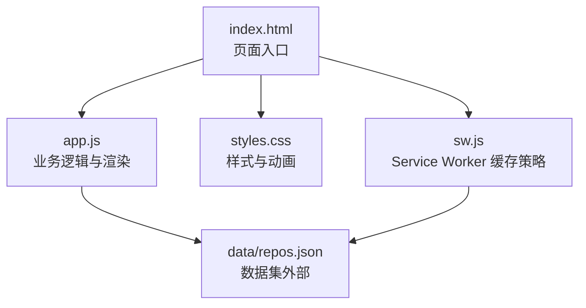
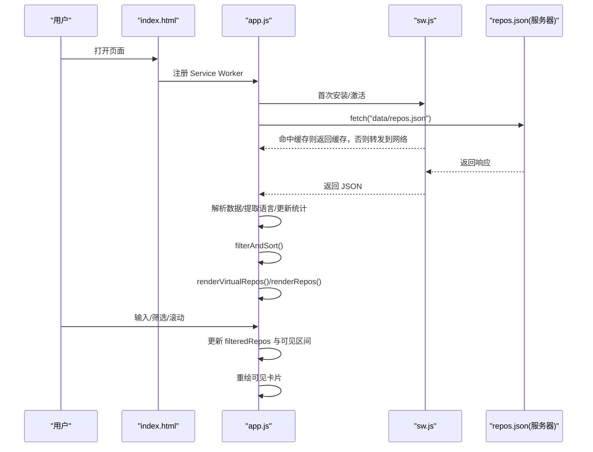
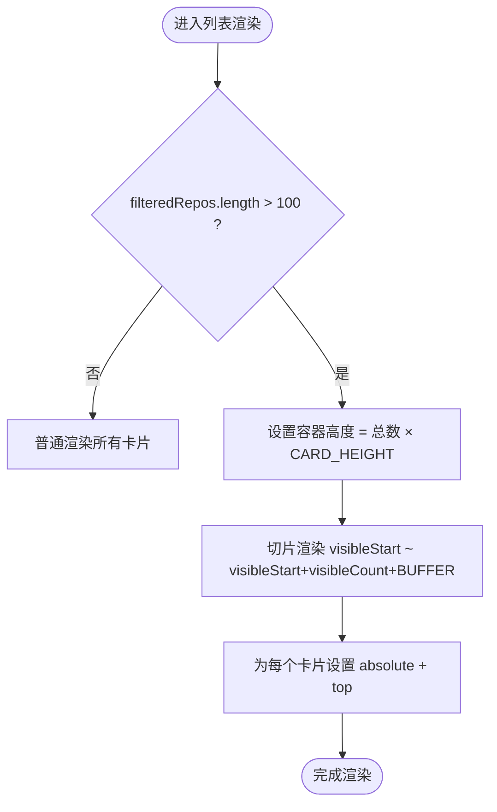
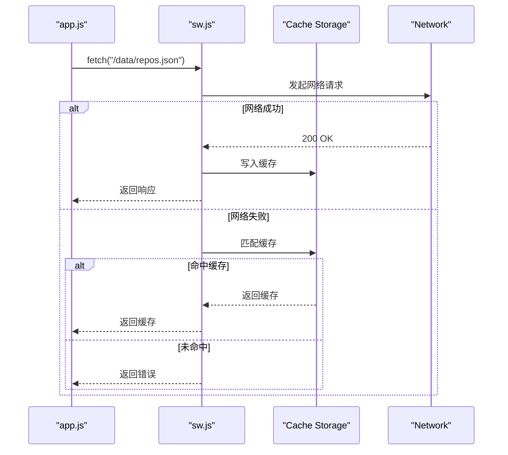
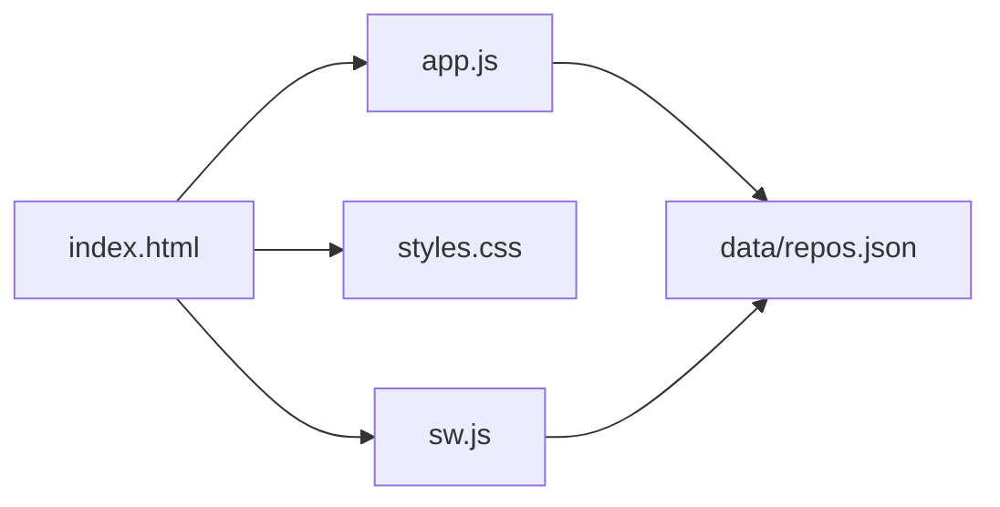

# 性能优化策略

<cite>
**本文引用的文件**   
- [web/app.js](file://web/app.js)
- [web/index.html](file://web/index.html)
- [web/sw.js](file://web/sw.js)
- [web/styles.css](file://web/styles.css)
- [README.md](file://README.md)
</cite>

## 目录
1. [引言](#引言)
2. [项目结构](#项目结构)
3. [核心组件](#核心组件)
4. [架构总览](#架构总览)
5. [详细组件分析](#详细组件分析)
6. [依赖关系分析](#依赖关系分析)
7. [性能考量与优化建议](#性能考量与优化建议)
8. [故障排查指南](#故障排查指南)
9. [结论](#结论)
10. [附录](#附录)

## 引言
本技术文档围绕前端性能优化策略，结合仓库中的纯前端实现（HTML/CSS/JS + Service Worker），系统性阐述大数据集渲染优化、内存管理、网络请求优化、渲染性能优化、监控与调试方法，并给出可落地的优化建议与测试思路。目标读者包括前端工程师与产品/运营同学，力求在保持技术深度的同时提供可操作的实践路径。

## 项目结构
本项目为单页应用，采用零构建的 Vanilla JS 方案，包含：
- 入口页面与 UI 骨架
- 主逻辑脚本（数据加载、过滤排序、虚拟滚动、交互）
- 样式表（主题、布局、动画）
- Service Worker（离线缓存与资源预取）
- 静态数据（由后端脚本生成，前端通过 fetch 获取）

图表来源
- [web/index.html:1-284](file://web/index.html#L1-L284)
- [web/app.js:1-2621](file://web/app.js#L1-L2621)
- [web/sw.js:1-128](file://web/sw.js#L1-L128)
- [web/styles.css:1-800](file://web/styles.css#L1-L800)

章节来源
- [README.md:123-148](file://README.md#L123-L148)
- [web/index.html:1-284](file://web/index.html#L1-L284)

## 核心组件
- 数据加载与错误处理：从本地或相对路径拉取 repos.json，失败时展示友好提示。
- 筛选与排序：支持关键词搜索、语言过滤、星级/Forks/评分范围滑块、多种排序维度。
- 列表渲染与虚拟滚动：当结果集大于阈值时启用虚拟滚动，仅渲染可视区域及缓冲区的卡片。
- 交互功能：收藏、对比、批量操作、分享、灵感模式（全屏滑动浏览）。
- 国际化与主题：中英文切换与深色/浅色主题持久化。
- PWA 与离线：Service Worker 对静态资源和数据文件实施不同缓存策略。

章节来源
- [web/app.js:401-440](file://web/app.js#L401-L440)
- [web/app.js:846-912](file://web/app.js#L846-L912)
- [web/app.js:1013-1046](file://web/app.js#L1013-L1046)
- [web/app.js:1094-1172](file://web/app.js#L1094-L1172)
- [web/app.js:1789-2603](file://web/app.js#L1789-L2603)
- [web/sw.js:1-128](file://web/sw.js#L1-L128)

## 架构总览
整体流程：页面初始化 → 加载数据 → 解析与统计 → 渲染筛选器与标签 → 执行筛选与排序 → 根据数据量选择普通渲染或虚拟滚动 → 用户交互触发更新。

图表来源
- [web/index.html:276-282](file://web/index.html#L276-L282)
- [web/sw.js:11-78](file://web/sw.js#L11-L78)
- [web/app.js:401-440](file://web/app.js#L401-L440)
- [web/app.js:846-912](file://web/app.js#L846-L912)
- [web/app.js:1013-1046](file://web/app.js#L1013-L1046)

## 详细组件分析

### 大数据集渲染优化（虚拟滚动、懒加载、分页）
- 虚拟滚动实现要点
  - 当结果数量超过阈值（>100）时，容器高度按“总数 × 卡片高度”计算，仅渲染可视区及前后缓冲区的节点，并通过绝对定位将卡片放置到正确位置。
  - 滚动事件节流后计算新的起始索引，按需替换 innerHTML 并重新设置卡片 top 值。
- 懒加载
  - 当前未实现图片/资源的懒加载；可在卡片中引入 IntersectionObserver 延迟加载大图或第三方资源。
- 分页加载
  - 当前为一次性加载全部数据；若数据规模进一步增大，可改为服务端分页，前端维护 visibleStart/visibleCount 并追加渲染。

图表来源
- [web/app.js:861-912](file://web/app.js#L861-L912)

章节来源
- [web/app.js:861-912](file://web/app.js#L861-L912)

### 内存管理与事件监听清理
- 事件监听
  - 全局键盘事件、滚动事件使用防抖/节流降低频率；灵感模式内绑定/解绑键盘事件，避免泄漏。
- DOM 引用
  - 大量 innerHTML 拼接会创建新节点，旧节点会被 GC 回收；注意避免持有不必要的闭包引用。
- localStorage 与对象生命周期
  - 收藏、预设、已浏览记录等使用 localStorage 持久化；关闭灵感模式时停止自动播放并移除事件监听。

章节来源
- [web/app.js:1065-1071](file://web/app.js#L1065-L1071)
- [web/app.js:1335](file://web/app.js#L1335)
- [web/app.js:2520-2526](file://web/app.js#L2520-L2526)
- [web/app.js:2592-2603](file://web/app.js#L2592-L2603)

### 网络请求优化（缓存、合并、重试）
- 缓存策略
  - 数据文件（/data/*）：网络优先，成功后写入缓存；失败回退到缓存。
  - 静态资源：先查缓存，再并行发起网络请求，成功则更新缓存；导航请求最终回退到离线页。
- 请求合并
  - 当前为单一数据源（repos.json），无并发请求合并场景；后续若有多个接口，可考虑基于 Promise.all 或队列合并。
- 错误重试
  - 当前未实现指数退避重试；可在 fetch 外层封装重试逻辑，限制最大次数与间隔。

图表来源
- [web/sw.js:33-78](file://web/sw.js#L33-L78)

章节来源
- [web/sw.js:11-78](file://web/sw.js#L11-L78)

### 渲染性能优化（DOM 批处理、重排重绘最小化、GPU 加速）
- DOM 批处理
  - 使用字符串拼接一次性 innerHTML 减少多次插入导致的重排。
- 重排重绘最小化
  - 虚拟滚动通过固定卡片高度与绝对定位减少布局抖动；CSS 动画尽量使用 transform/opacity 以利用合成层。
- GPU 加速
  - 卡片入场动画、模态框过渡均使用 transform 与 opacity，利于 GPU 合成。

章节来源
- [web/app.js:846-912](file://web/app.js#L846-L912)
- [web/styles.css:445-464](file://web/styles.css#L445-L464)
- [web/styles.css:721-756](file://web/styles.css#L721-L756)

### 用户体验增强（灵感模式）
- 全屏滑动浏览，支持左右滑动、键盘导航、自动播放、撤销/重做、翻转卡片查看详细信息。
- 状态持久化：已浏览集合与当前位置保存在 localStorage，支持跨会话恢复。
- 无障碍：aria-live 播报进度与状态变化。

章节来源
- [web/app.js:1789-2603](file://web/app.js#L1789-L2603)
- [web/index.html:269](file://web/index.html#L269)

## 依赖关系分析
- 模块耦合
  - app.js 强依赖 DOM API、localStorage、navigator.clipboard、IntersectionObserver（可扩展）、Service Worker 缓存。
  - sw.js 独立于业务逻辑，仅关注缓存策略。
- 外部依赖
  - 字体与图标来自 Google Fonts（可通过 preconnect 优化首屏）。
  - 数据文件 repos.json 由后端脚本生成，前端通过 fetch 获取。

图表来源
- [web/index.html:1-284](file://web/index.html#L1-L284)
- [web/app.js:1-2621](file://web/app.js#L1-L2621)
- [web/sw.js:1-128](file://web/sw.js#L1-L128)

章节来源
- [README.md:152-161](file://README.md#L152-L161)

## 性能考量与优化建议

### 大数据集渲染优化
- 虚拟滚动
  - 现状：>100 条启用虚拟滚动，固定卡片高度，绝对定位渲染。
  - 建议：
    - 动态估算卡片高度（内容可变时），或使用 ResizeObserver 自适应。
    - 增加缓冲区大小以适应快速滚动，避免闪烁。
    - 对复杂卡片进行模板复用与惰性创建，减少字符串拼接开销。
- 懒加载
  - 建议：对卡片内图片/视频使用 IntersectionObserver 延迟加载；SVG 图标可内联以减少请求。
- 分页加载
  - 建议：当数据量达到万级时，采用服务端分页，前端维护游标与增量渲染。

章节来源
- [web/app.js:861-912](file://web/app.js#L861-L912)

### 内存管理策略
- 事件监听器清理
  - 现状：灵感模式启动/关闭时绑定/解绑键盘事件；滚动事件使用防抖。
  - 建议：统一事件管理器，集中注册/注销；避免匿名函数导致无法 removeEventListener。
- DOM 引用管理
  - 建议：避免在循环中持有长生命周期引用；及时释放临时变量；谨慎使用闭包捕获大对象。
- 垃圾回收优化
  - 建议：减少频繁创建的大对象；必要时显式置空不再使用的引用；避免在高频回调中分配内存。

章节来源
- [web/app.js:1335](file://web/app.js#L1335)
- [web/app.js:2520-2526](file://web/app.js#L2520-L2526)
- [web/app.js:2592-2603](file://web/app.js#L2592-L2603)

### 网络请求优化
- 缓存策略
  - 现状：数据文件网络优先+缓存回退；静态资源 stale-while-revalidate。
  - 建议：
    - 为数据文件添加版本号或时间戳，便于强制刷新。
    - 针对移动端弱网环境，可增加降级策略（如只加载关键信息）。
- 请求合并
  - 建议：未来多接口场景下，使用请求去重与合并策略，减少重复请求。
- 错误重试机制
  - 建议：封装带指数退避的重试逻辑，区分可重试与不可重试错误；提供用户可感知的重试反馈。

章节来源
- [web/sw.js:33-78](file://web/sw.js#L33-L78)

### 渲染性能优化
- DOM 操作批处理
  - 现状：innerHTML 一次性拼接，减少多次插入。
  - 建议：对超大列表使用 DocumentFragment 或虚拟 DOM 思想（当前已近似实现）。
- 重排重绘最小化
  - 现状：使用 transform/opacity 动画，避免 layout thrashing。
  - 建议：批量读取/写入样式属性，避免强制同步布局。
- GPU 加速
  - 现状：动画使用 transform/opacity。
  - 建议：对复杂动画开启 will-change（谨慎使用，避免过度提升层级）。

章节来源
- [web/styles.css:445-464](file://web/styles.css#L445-L464)
- [web/styles.css:721-756](file://web/styles.css#L721-L756)

### 性能监控方法与调试技巧
- 浏览器工具
  - Performance 面板录制关键路径（加载、筛选、滚动），观察 FPS、Layout、Paint 耗时。
  - Memory 面板检查堆快照，确认是否存在内存泄漏（特别是事件监听与闭包引用）。
  - Network 面板验证缓存命中情况与服务端响应时间。
- 自定义埋点
  - 在关键函数入口/出口打点（如 filterAndSort、renderVirtualRepos、handleScroll），统计调用频次与耗时。
  - 使用 PerformanceObserver 监听长任务与掉帧。
- 回归测试
  - 基于 Lighthouse 自动化扫描，纳入 CI 流程，防止性能退化。

[本节为通用指导，不直接分析具体文件]

### 实际性能测试案例与优化效果对比（方法论）
- 基线测试
  - 在相同设备与网络条件下，测量初始加载时间、首屏渲染时间、筛选响应时间、滚动帧率。
- 优化项对照
  - 开启/关闭虚拟滚动：对比 1000 条数据下的滚动帧率与 CPU 占用。
  - 启用/禁用 Service Worker 缓存：对比二次访问的首屏时间与网络请求数。
  - 增加滚动缓冲区：对比快速滚动时的卡顿次数与重绘次数。
- 指标建议
  - 首屏时间 < 1.5s（良好网络）
  - 筛选响应 < 100ms
  - 滚动帧率 ≥ 55fps
  - 内存峰值稳定，无持续增长趋势

[本节为通用指导，不直接分析具体文件]

## 故障排查指南
- 数据加载失败
  - 现象：页面显示“无法加载数据”，提示需通过 HTTP 服务访问。
  - 排查：确认通过 http.server 或本地服务器运行；检查 CORS 与路径是否正确。
- 离线体验异常
  - 现象：离线后仍尝试网络请求或无回退页面。
  - 排查：检查 Service Worker 是否注册成功；确认缓存版本与资源清单；查看控制台报错。
- 内存增长
  - 现象：长时间使用后内存持续上升。
  - 排查：检查是否有未移除的事件监听；确认是否在高频回调中创建大对象；使用 Memory 面板对比快照。

章节来源
- [web/app.js:425-440](file://web/app.js#L425-L440)
- [web/index.html:276-282](file://web/index.html#L276-L282)
- [web/sw.js:11-31](file://web/sw.js#L11-L31)

## 结论
本项目在纯前端环境下实现了较为完善的数据展示与交互能力，并在大数据集渲染方面采用了虚拟滚动策略，显著提升了长列表的性能表现。通过 Service Worker 的差异化缓存策略，进一步优化了网络与离线体验。建议在后续迭代中补充懒加载、分页加载、请求重试与更完善的内存管理机制，并结合性能监控与自动化测试，持续保障用户体验与稳定性。

[本节为总结性内容，不直接分析具体文件]

## 附录
- 快捷键与交互说明详见 README。
- 评分算法与数据来源见 README。

章节来源
- [README.md:79-95](file://README.md#L79-L95)
- [README.md:98-121](file://README.md#L98-L121)