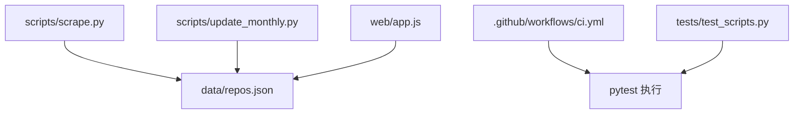
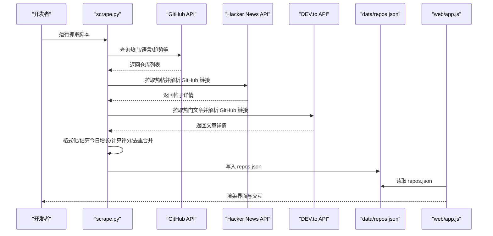
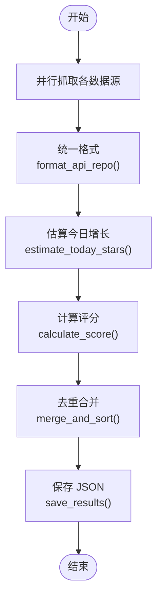
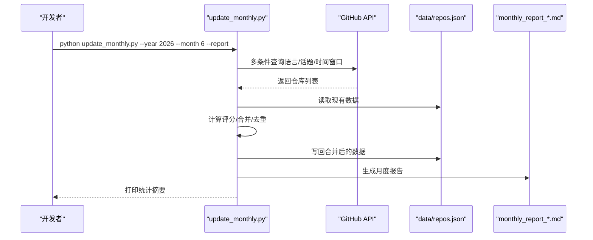
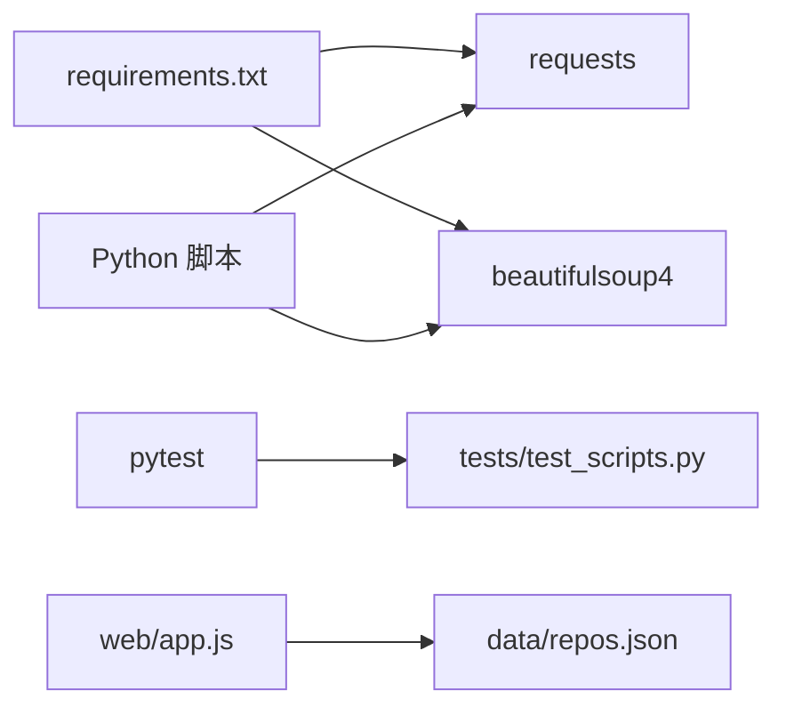

# 开发指南

<cite>
**本文引用的文件**   
- [README.md](file://README.md)
- [README.zh-CN.md](file://README.zh-CN.md)
- [requirements.txt](file://requirements.txt)
- [scripts/scrape.py](file://scripts/scrape.py)
- [scripts/update_monthly.py](file://scripts/update_monthly.py)
- [tests/test_scripts.py](file://tests/test_scripts.py)
- [.github/workflows/ci.yml](file://.github/workflows/ci.yml)
- [web/app.js](file://web/app.js)
- [.gitignore](file://.gitignore)
</cite>

## 目录
1. [简介](#简介)
2. [项目结构](#项目结构)
3. [核心组件](#核心组件)
4. [架构总览](#架构总览)
5. [详细组件分析](#详细组件分析)
6. [依赖关系分析](#依赖关系分析)
7. [性能与优化建议](#性能与优化建议)
8. [故障排查与调试技巧](#故障排查与调试技巧)
9. [贡献规范与流程](#贡献规范与流程)
10. [结论](#结论)
11. [附录：环境配置与工具链](#附录环境配置与工具链)

## 简介
本项目是一个全自动的 GitHub 优质仓库聚合器，整合 Awesome Lists、GitHub Search API、Hacker News 与 DEV.to 等多源数据，提供智能筛选、灵感模式与收藏管理的前端体验。后端通过 Python 脚本抓取并生成 JSON 数据集，前端以纯 HTML/CSS/JS 展示，支持 PWA 离线访问与本地 HTTP 服务运行。

## 项目结构
- scripts：爬虫与月度增量更新脚本
- tests：pytest 测试套件
- data：生成的数据集与月度报告
- web：零构建步骤的前端（HTML/CSS/JS + Service Worker）
- .github/workflows：CI/CD 工作流（测试、部署、定时任务）
- requirements.txt：Python 运行时依赖

图表来源
- [scripts/scrape.py:650-696](file://scripts/scrape.py#L650-L696)
- [scripts/update_monthly.py:300-344](file://scripts/update_monthly.py#L300-L344)
- [web/app.js:1-20](file://web/app.js#L1-L20)
- [.github/workflows/ci.yml:10-34](file://.github/workflows/ci.yml#L10-L34)
- [tests/test_scripts.py:1-16](file://tests/test_scripts.py#L1-L16)

章节来源
- [README.md:123-148](file://README.md#L123-L148)
- [README.zh-CN.md:140-170](file://README.zh-CN.md#L140-L170)

## 核心组件
- 多源爬虫与聚合：从 Awesome Lists、GitHub API、Hacker News、DEV.to 抓取仓库信息，统一格式、去重合并、计算评分并输出 JSON。
- 月度增量更新：按指定月份抓取新建仓库，合并到现有数据集，并可选生成 Markdown 报告。
- 前端展示：加载 data/repos.json，实现搜索、筛选、排序、收藏、对比、灵感模式等交互。
- CI/CD：在 PR 和推送时运行 pytest 与语法检查；另有部署与定时抓取工作流。

章节来源
- [scripts/scrape.py:103-112](file://scripts/scrape.py#L103-L112)
- [scripts/scrape.py:542-553](file://scripts/scrape.py#L542-L553)
- [scripts/scrape.py:555-603](file://scripts/scrape.py#L555-L603)
- [scripts/update_monthly.py:155-160](file://scripts/update_monthly.py#L155-L160)
- [scripts/update_monthly.py:162-204](file://scripts/update_monthly.py#L162-L204)
- [web/app.js:1-20](file://web/app.js#L1-L20)
- [.github/workflows/ci.yml:10-34](file://.github/workflows/ci.yml#L10-L34)

## 架构总览
系统由“数据获取层”、“数据处理层”、“数据存储层”和“前端展示层”组成。数据获取层并行调用多个外部数据源；数据处理层进行清洗、去重、评分与排序；存储层输出 JSON；前端消费 JSON 并提供交互能力。

图表来源
- [scripts/scrape.py:174-222](file://scripts/scrape.py#L174-L222)
- [scripts/scrape.py:248-279](file://scripts/scrape.py#L248-L279)
- [scripts/scrape.py:316-383](file://scripts/scrape.py#L316-L383)
- [scripts/scrape.py:385-442](file://scripts/scrape.py#L385-L442)
- [scripts/scrape.py:444-509](file://scripts/scrape.py#L444-L509)
- [scripts/scrape.py:555-603](file://scripts/scrape.py#L555-L603)
- [scripts/scrape.py:605-629](file://scripts/scrape.py#L605-L629)
- [web/app.js:1-20](file://web/app.js#L1-L20)

## 详细组件分析

### 爬虫模块（scripts/scrape.py）
- 请求头与鉴权：根据环境变量注入 Authorization，避免无 Token 时的低限额。
- 数据源采集：
  - Awesome Lists：解析 README 中的 GitHub 链接，限制数量，过滤非仓库路径与自引用。
  - GitHub API：多组查询（主题、语言、时间窗口），分页与限流处理。
  - Hacker News：拉取 Top Stories，正则提取 GitHub 链接并补全仓库详情。
  - DEV.to：拉取热文，从标签与正文中抽取 GitHub 链接。
- 数据标准化：format_api_repo 将各源结果统一为内部 schema。
- 指标估算：estimate_today_stars 基于 pushed_at/created_at 估算“今日增长”。
- 评分算法：calculate_score 综合 stars/forks/今日增长/近四周提交活跃度。
- 合并排序：merge_and_sort 对同名仓库字段级取最大值、合并 source 标签、按 score 降序。
- 持久化：save_results 输出 data/repos.json，包含元信息与仓库列表。

图表来源
- [scripts/scrape.py:526-540](file://scripts/scrape.py#L526-L540)
- [scripts/scrape.py:281-314](file://scripts/scrape.py#L281-L314)
- [scripts/scrape.py:542-553](file://scripts/scrape.py#L542-L553)
- [scripts/scrape.py:555-603](file://scripts/scrape.py#L555-L603)
- [scripts/scrape.py:605-629](file://scripts/scrape.py#L605-L629)

章节来源
- [scripts/scrape.py:103-112](file://scripts/scrape.py#L103-L112)
- [scripts/scrape.py:130-151](file://scripts/scrape.py#L130-L151)
- [scripts/scrape.py:224-246](file://scripts/scrape.py#L224-L246)
- [scripts/scrape.py:316-383](file://scripts/scrape.py#L316-L383)
- [scripts/scrape.py:385-442](file://scripts/scrape.py#L385-L442)
- [scripts/scrape.py:444-509](file://scripts/scrape.py#L444-L509)
- [scripts/scrape.py:511-524](file://scripts/scrape.py#L511-L524)
- [scripts/scrape.py:542-553](file://scripts/scrape.py#L542-L553)
- [scripts/scrape.py:555-603](file://scripts/scrape.py#L555-L603)
- [scripts/scrape.py:605-629](file://scripts/scrape.py#L605-L629)

### 月度增量更新（scripts/update_monthly.py）
- 参数解析：支持 --year/--month/--report。
- 数据抓取：按日期范围与多维度（全部语言、语言、热点话题、低星但近期活跃）查询 GitHub API。
- 数据合并：merge_with_existing 将新结果与 data/repos.json 合并，保留更高分数项，追加 sources 标记。
- 统计与报告：print_stats 输出当月语言分布与 Top 列表；generate_report 生成 Markdown 报告。

图表来源
- [scripts/update_monthly.py:300-344](file://scripts/update_monthly.py#L300-L344)
- [scripts/update_monthly.py:79-136](file://scripts/update_monthly.py#L79-L136)
- [scripts/update_monthly.py:162-204](file://scripts/update_monthly.py#L162-L204)
- [scripts/update_monthly.py:226-298](file://scripts/update_monthly.py#L226-L298)

章节来源
- [scripts/update_monthly.py:29-37](file://scripts/update_monthly.py#L29-L37)
- [scripts/update_monthly.py:79-136](file://scripts/update_monthly.py#L79-L136)
- [scripts/update_monthly.py:155-160](file://scripts/update_monthly.py#L155-L160)
- [scripts/update_monthly.py:162-204](file://scripts/update_monthly.py#L162-L204)
- [scripts/update_monthly.py:226-298](file://scripts/update_monthly.py#L226-L298)

### 前端展示（web/app.js）
- 数据加载：从 ../data/repos.json 读取数据，若使用 file:// 协议会提示需通过本地 HTTP 服务器访问。
- 国际化与主题：I18N 字典与主题切换逻辑。
- 交互功能：搜索、筛选、排序、书签、对比、灵感模式等。

章节来源
- [web/app.js:1-20](file://web/app.js#L1-L20)
- [web/app.js:38-190](file://web/app.js#L38-L190)

### 测试套件（tests/test_scripts.py）
- 覆盖范围：parse_num、calculate_score、estimate_today_stars、parse_awesome_list、merge_and_sort、format_api_repo、headers 构造等。
- 运行方式：pytest tests/ -v。

章节来源
- [tests/test_scripts.py:1-16](file://tests/test_scripts.py#L1-L16)
- [tests/test_scripts.py:18-34](file://tests/test_scripts.py#L18-L34)
- [tests/test_scripts.py:36-54](file://tests/test_scripts.py#L36-L54)
- [tests/test_scripts.py:56-107](file://tests/test_scripts.py#L56-L107)
- [tests/test_scripts.py:109-141](file://tests/test_scripts.py#L109-L141)
- [tests/test_scripts.py:143-199](file://tests/test_scripts.py#L143-L199)
- [tests/test_scripts.py:201-228](file://tests/test_scripts.py#L201-L228)
- [tests/test_scripts.py:230-250](file://tests/test_scripts.py#L230-L250)

## 依赖关系分析
- Python 依赖：requests、beautifulsoup4（requirements.txt）。
- 测试依赖：pytest（在 CI 与工作区安装）。
- 前端依赖：零构建、零依赖，直接浏览器运行。

图表来源
- [requirements.txt:1-2](file://requirements.txt#L1-L2)
- [.github/workflows/ci.yml:22-28](file://.github/workflows/ci.yml#L22-L28)
- [tests/test_scripts.py:1-16](file://tests/test_scripts.py#L1-L16)
- [web/app.js:1-20](file://web/app.js#L1-L20)

章节来源
- [requirements.txt:1-2](file://requirements.txt#L1-L2)
- [.github/workflows/ci.yml:10-34](file://.github/workflows/ci.yml#L10-L34)

## 性能与优化建议
- 速率限制与退避：
  - 设置 GITHUB_TOKEN 提升配额至 5000/hour，减少 403 错误与重试等待。
  - 对第三方 API 增加指数退避与最大重试次数，避免雪崩。
- 并发与批处理：
  - 对独立数据源抓取可引入线程池或异步 IO，注意控制并发度以避免触发限流。
  - 批量写入 JSON 前在内存中完成去重与评分，减少 I/O 次数。
- 缓存策略：
  - 对静态资源（如 Awesome Lists README）增加本地缓存与 ETag/If-Modified-Since 判断。
  - 对 commit_activity 等耗时接口做短期缓存，降低重复请求。
- 前端性能：
  - 大数据量下采用虚拟滚动或分页加载，减少 DOM 节点数量。
  - 预计算排序与筛选索引，避免每次输入都全量扫描。
- 评分与估算：
  - estimate_today_stars 可根据历史数据校准权重，提高“飙升指数”准确性。
  - calculate_score 可对不同来源加权，体现数据可信度差异。

[本节为通用指导，不直接分析具体文件]

## 故障排查与调试技巧
- 无法加载数据（前端报错）：
  - 现象：通过 file:// 打开页面时报 fetch 失败。
  - 解决：使用本地 HTTP 服务器启动（例如 python3 -m http.server 8000），再访问 localhost。
- GitHub API 受限：
  - 现象：出现 403 或 rate limited 提示。
  - 解决：设置环境变量 GITHUB_TOKEN，提升配额。
- 网络异常与超时：
  - 建议在抓取函数中捕获异常并记录日志，必要时重试或跳过该条目。
- 数据不一致：
  - 检查 merge_and_sort 的去重与字段合并逻辑，确保 numeric 字段取最大值、source 合并正确。
- 单元测试失败：
  - 使用 pytest -v 查看堆栈，定位断言失败的用例；必要时添加 monkeypatch 模拟外部依赖。

章节来源
- [README.md:166-171](file://README.md#L166-L171)
- [README.zh-CN.md:213-225](file://README.zh-CN.md#L213-L225)
- [scripts/scrape.py:153-172](file://scripts/scrape.py#L153-L172)
- [scripts/scrape.py:224-246](file://scripts/scrape.py#L224-L246)
- [scripts/scrape.py:555-603](file://scripts/scrape.py#L555-L603)
- [tests/test_scripts.py:238-250](file://tests/test_scripts.py#L238-L250)

## 贡献规范与流程
- 分支与提交：
  - 主分支为 main，PR 目标分支为 main。
  - 提交信息建议简洁明确，描述变更目的与影响范围。
- 代码风格：
  - Python：遵循 PEP 8 风格，保持可读性与一致性。
  - JS：保持模块化与注释清晰，避免全局污染。
- 测试要求：
  - 新增或修改逻辑必须补充对应测试用例，保证覆盖率与稳定性。
  - 本地运行 pytest tests/ -v 确认通过后再提交。
- Pull Request 流程：
  - Fork 本仓库，创建特性分支，提交变更与测试。
  - 发起 PR 至 main，CI 会自动运行测试与语法检查。
  - 审查通过后合并，自动触发部署工作流（如有）。
- 文档与示例：
  - 涉及用户可见行为或配置变更，请同步更新 README 或相关文档。

章节来源
- [.github/workflows/ci.yml:1-34](file://.github/workflows/ci.yml#L1-L34)
- [tests/test_scripts.py:1-16](file://tests/test_scripts.py#L1-L16)
- [README.md:70-76](file://README.md#L70-L76)

## 结论
本项目以清晰的模块化结构与完善的测试保障为基础，提供了可扩展的数据源接入点与稳定的前端展示能力。通过遵循贡献规范、完善测试与关注性能优化，可以持续扩展新的数据源与功能，并保持系统的健壮性与可维护性。

[本节为总结性内容，不直接分析具体文件]

## 附录：环境配置与工具链
- 基础环境：
  - Python 3.11（CI 使用版本）
  - pip 包管理器
- 依赖安装：
  - pip install -r requirements.txt
- 运行爬虫：
  - python3 scripts/scrape.py
- 月度增量更新：
  - python3 scripts/update_monthly.py --year 2026 --month 6 --report
- 本地前端服务：
  - cd web && python3 -m http.server 8000
- 运行测试：
  - pip install pytest
  - pytest tests/ -v
- 环境变量：
  - GITHUB_TOKEN：用于提升 GitHub API 配额
- 忽略规则：
  - .gitignore 已排除 __pycache__、venv、IDE 配置与生成的 data/repos.json 等

章节来源
- [requirements.txt:1-2](file://requirements.txt#L1-L2)
- [README.md:49-76](file://README.md#L49-L76)
- [README.zh-CN.md:51-77](file://README.zh-CN.md#L51-L77)
- [.github/workflows/ci.yml:16-28](file://.github/workflows/ci.yml#L16-L28)
- [.gitignore:1-27](file://.gitignore#L1-L27)