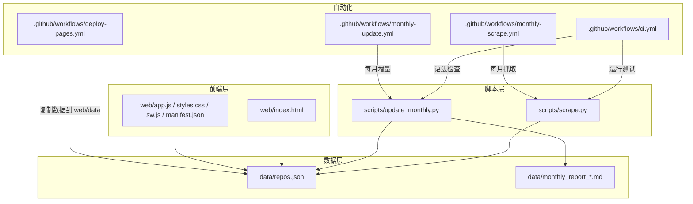
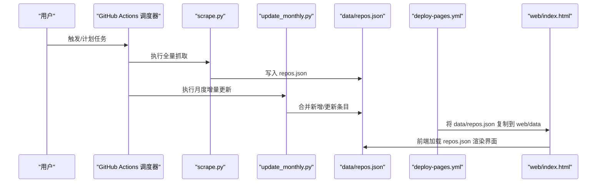
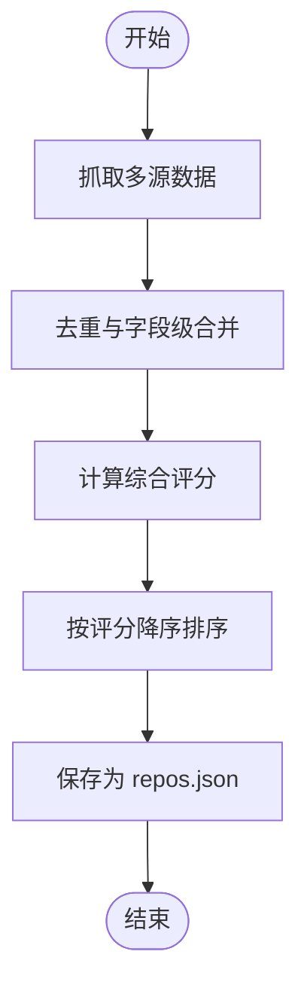
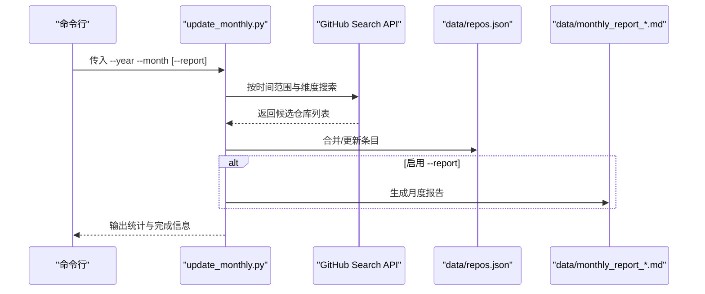
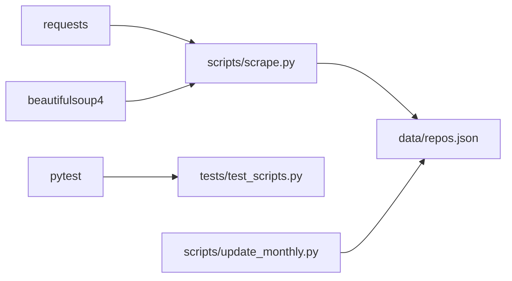

# 快速开始

<cite>
**本文引用的文件**   
- [README.md](file://README.md)
- [README.zh-CN.md](file://README.zh-CN.md)
- [requirements.txt](file://requirements.txt)
- [scripts/scrape.py](file://scripts/scrape.py)
- [scripts/update_monthly.py](file://scripts/update_monthly.py)
- [.github/workflows/ci.yml](file://.github/workflows/ci.yml)
- [.github/workflows/deploy-pages.yml](file://.github/workflows/deploy-pages.yml)
- [.github/workflows/monthly-scrape.yml](file://.github/workflows/monthly-scrape.yml)
- [.github/workflows/monthly-update.yml](file://.github/workflows/monthly-update.yml)
- [tests/test_scripts.py](file://tests/test_scripts.py)
- [web/index.html](file://web/index.html)
- [data/monthly_report_2026_06.md](file://data/monthly_report_2026_06.md)
</cite>

## 目录
1. [简介](#简介)
2. [项目结构](#项目结构)
3. [核心组件](#核心组件)
4. [架构总览](#架构总览)
5. [详细组件分析](#详细组件分析)
6. [依赖关系分析](#依赖关系分析)
7. [性能与稳定性建议](#性能与稳定性建议)
8. [故障排查指南](#故障排查指南)
9. [结论](#结论)
10. [附录：常用命令速查](#附录常用命令速查)

## 简介
GitHub Treasure Repo 是一个全自动的开源工具，聚合多源数据（Awesome Lists、GitHub Search API、Hacker News、DEV.to），提供智能筛选、灵感探索与收藏管理的一站式体验。你可以在线访问已部署的版本，也可以本地克隆并运行爬虫脚本生成数据集，再启动静态服务进行浏览。

- 在线访问（推荐）：由 GitHub Actions 每日自动刷新数据
- 本地运行：克隆仓库 → 安装 Python 依赖 → 运行爬虫脚本 → 启动本地 HTTP 服务

章节来源
- [README.md:43-76](file://README.md#L43-L76)
- [README.zh-CN.md:43-77](file://README.zh-CN.md#L43-L77)

## 项目结构
仓库采用“脚本 + 数据 + 前端 + CI/CD”的分层组织方式：
- scripts：爬虫与月度增量更新脚本
- data：聚合后的 JSON 数据集与月度报告
- web：纯前端页面与服务端静态资源
- .github/workflows：CI、部署、定时抓取与月度更新工作流
- tests：pytest 测试套件

图表来源
- [scripts/scrape.py:650-696](file://scripts/scrape.py#L650-L696)
- [scripts/update_monthly.py:300-344](file://scripts/update_monthly.py#L300-L344)
- [.github/workflows/ci.yml:1-34](file://.github/workflows/ci.yml#L1-L34)
- [.github/workflows/deploy-pages.yml:1-43](file://.github/workflows/deploy-pages.yml#L1-L43)
- [.github/workflows/monthly-scrape.yml:1-50](file://.github/workflows/monthly-scrape.yml#L1-L50)
- [.github/workflows/monthly-update.yml:1-91](file://.github/workflows/monthly-update.yml#L1-L91)
- [web/index.html:1-200](file://web/index.html#L1-L200)

章节来源
- [README.md:123-148](file://README.md#L123-L148)
- [README.zh-CN.md:140-170](file://README.zh-CN.md#L140-L170)

## 核心组件
- 多源爬虫脚本：从 Awesome Lists、GitHub API、Hacker News、DEV.to 等渠道采集项目信息，去重合并后输出统一结构的 JSON 数据集
- 月度增量更新脚本：按指定月份拉取新仓库，合并至现有数据集，并可生成 Markdown 月度报告
- 前端展示：基于纯 HTML/CSS/JS 的零构建前端，读取 data/repos.json 并提供筛选、排序、收藏等功能
- 自动化流水线：CI 校验、Pages 部署、每月全量抓取与月度增量更新

章节来源
- [scripts/scrape.py:1-696](file://scripts/scrape.py#L1-L696)
- [scripts/update_monthly.py:1-344](file://scripts/update_monthly.py#L1-L344)
- [web/index.html:1-200](file://web/index.html#L1-L200)

## 架构总览
下图展示了从数据抓取、处理、存储到前端展示的端到端流程，以及 GitHub Actions 的自动化机制。

图表来源
- [.github/workflows/monthly-scrape.yml:1-50](file://.github/workflows/monthly-scrape.yml#L1-L50)
- [.github/workflows/monthly-update.yml:1-91](file://.github/workflows/monthly-update.yml#L1-L91)
- [.github/workflows/deploy-pages.yml:1-43](file://.github/workflows/deploy-pages.yml#L1-L43)
- [scripts/scrape.py:650-696](file://scripts/scrape.py#L650-L696)
- [scripts/update_monthly.py:300-344](file://scripts/update_monthly.py#L300-L344)
- [web/index.html:1-200](file://web/index.html#L1-L200)

## 详细组件分析

### 本地环境搭建与首次使用
- 克隆仓库
- 安装 Python 依赖
- 运行爬虫脚本生成数据
- 启动本地静态服务器
- 浏览器访问本地站点

预期行为
- 成功安装依赖后，运行爬虫会输出各来源抓取进度与统计摘要
- 启动 http.server 后，在浏览器打开 http://localhost:8000 即可看到前端页面
- 若直接以 file:// 协议打开，浏览器会阻止 fetch 请求导致无法加载数据

章节来源
- [README.md:49-76](file://README.md#L49-L76)
- [README.zh-CN.md:51-77](file://README.zh-CN.md#L51-L77)
- [requirements.txt:1-2](file://requirements.txt#L1-L2)
- [web/index.html:1-200](file://web/index.html#L1-L200)

### 在线使用与自动刷新机制
- 在线版本由 GitHub Actions 每日自动刷新数据
- 部署流程会在构建时将 data/repos.json 复制到 web/data 目录供前端读取
- 可通过工作流状态徽章查看 CI、Monthly Scrape、Monthly Update、Deploy Pages 的运行情况

章节来源
- [README.md:43-48](file://README.md#L43-L48)
- [README.zh-CN.md:45-49](file://README.zh-CN.md#L45-L49)
- [.github/workflows/deploy-pages.yml:30-38](file://.github/workflows/deploy-pages.yml#L30-L38)

### 更新数据集的命令示例
- 全量抓取（所有来源）
- 增量更新指定月份（可附带 --report 生成 Markdown 报告）

预期行为
- 全量抓取完成后，控制台输出 Top 列表与统计数据
- 月度增量更新完成后，控制台输出语言分布、Top 列表与数据库总量；如开启 --report，将在 data 目录下生成对应月份的报告文件

章节来源
- [README.md:60-76](file://README.md#L60-L76)
- [README.zh-CN.md:69-77](file://README.zh-CN.md#L69-L77)
- [scripts/scrape.py:650-696](file://scripts/scrape.py#L650-L696)
- [scripts/update_monthly.py:300-344](file://scripts/update_monthly.py#L300-L344)
- [data/monthly_report_2026_06.md:1-30](file://data/monthly_report_2026_06.md#L1-L30)

### 运行测试套件
- 安装 pytest
- 运行 tests/ 目录下的用例
- CI 中也会执行同样的测试步骤

预期行为
- 通过测试后，终端显示用例数量与结果摘要
- 失败时，会打印简短回溯信息便于定位问题

章节来源
- [README.md:70-76](file://README.md#L70-L76)
- [tests/test_scripts.py:1-250](file://tests/test_scripts.py#L1-L250)
- [.github/workflows/ci.yml:22-28](file://.github/workflows/ci.yml#L22-L28)

### 关键数据处理逻辑（评分与合并）
- 评分算法综合考虑 Stars、Forks、今日增长估算、近四周提交活跃度等信号
- 多源合并时对重复项进行字段级最大值合并，并按分数降序排列

图表来源
- [scripts/scrape.py:542-602](file://scripts/scrape.py#L542-L602)
- [scripts/scrape.py:605-628](file://scripts/scrape.py#L605-L628)

章节来源
- [scripts/scrape.py:542-602](file://scripts/scrape.py#L542-L602)
- [scripts/scrape.py:605-628](file://scripts/scrape.py#L605-L628)

### 月度增量更新流程
- 支持按年/月参数抓取当月创建的新仓库
- 合并到现有 repos.json，并可选择生成 Markdown 月度报告

图表来源
- [scripts/update_monthly.py:79-136](file://scripts/update_monthly.py#L79-L136)
- [scripts/update_monthly.py:162-204](file://scripts/update_monthly.py#L162-L204)
- [scripts/update_monthly.py:226-297](file://scripts/update_monthly.py#L226-L297)
- [scripts/update_monthly.py:300-344](file://scripts/update_monthly.py#L300-L344)

章节来源
- [scripts/update_monthly.py:79-136](file://scripts/update_monthly.py#L79-L136)
- [scripts/update_monthly.py:162-204](file://scripts/update_monthly.py#L162-L204)
- [scripts/update_monthly.py:226-297](file://scripts/update_monthly.py#L226-L297)
- [scripts/update_monthly.py:300-344](file://scripts/update_monthly.py#L300-L344)

## 依赖关系分析
- 运行时依赖：requests、beautifulsoup4
- 测试依赖：pytest（仅在测试或 CI 中使用）
- 前端无构建依赖，纯静态资源

图表来源
- [requirements.txt:1-2](file://requirements.txt#L1-L2)
- [scripts/scrape.py:1-20](file://scripts/scrape.py#L1-L20)
- [tests/test_scripts.py:1-15](file://tests/test_scripts.py#L1-L15)

章节来源
- [requirements.txt:1-2](file://requirements.txt#L1-L2)
- [scripts/scrape.py:1-20](file://scripts/scrape.py#L1-L20)
- [tests/test_scripts.py:1-15](file://tests/test_scripts.py#L1-L15)

## 性能与稳定性建议
- 设置 GITHUB_TOKEN 环境变量以提升 GitHub API 速率限制，避免频繁限流
- 全量抓取耗时较长，建议在具备更高配额的环境下执行
- 月度增量更新可按需选择特定月份，减少不必要的数据拉取
- 本地开发务必通过 HTTP 服务器访问前端，避免浏览器对 file:// 协议的 fetch 限制

章节来源
- [README.md:166-171](file://README.md#L166-L171)
- [README.zh-CN.md:213-225](file://README.zh-CN.md#L213-L225)
- [scripts/scrape.py:103-111](file://scripts/scrape.py#L103-L111)
- [scripts/update_monthly.py:40-47](file://scripts/update_monthly.py#L40-L47)

## 故障排查指南
- 页面提示“无法加载数据”
  - 原因：直接使用 file:// 协议打开，浏览器禁止跨域 fetch
  - 解决：通过 python3 -m http.server 启动本地服务后再访问
- GitHub API 请求受限
  - 原因：未配置 GITHUB_TOKEN，默认限额较低
  - 解决：设置 GITHUB_TOKEN 环境变量提升限额
- 工作流失败
  - 查看 Actions 日志与 Step Summary，确认网络、令牌与权限配置
  - 手动触发工作流进行复测

章节来源
- [README.md:166-171](file://README.md#L166-L171)
- [README.zh-CN.md:213-225](file://README.zh-CN.md#L213-L225)
- [.github/workflows/monthly-scrape.yml:42-50](file://.github/workflows/monthly-scrape.yml#L42-L50)
- [.github/workflows/monthly-update.yml:81-91](file://.github/workflows/monthly-update.yml#L81-L91)

## 结论
通过本指南，你可以在几分钟内完成本地环境搭建、数据抓取与前端展示，并利用 GitHub Actions 实现数据的持续更新与在线部署。对于进阶需求，可使用月度增量更新脚本按需补充数据，并通过测试套件保障脚本质量。

## 附录：常用命令速查
- 克隆与安装
  - git clone https://github.com/allengaller/repo-hoarder.git
  - cd repo-hoarder
  - pip install -r requirements.txt
- 抓取与更新
  - python3 scripts/scrape.py
  - python3 scripts/update_monthly.py --year 2026 --month 6 --report
- 本地服务
  - cd web && python3 -m http.server 8000
  - 浏览器访问 http://localhost:8000
- 运行测试
  - pip install pytest
  - pytest tests/ -v

章节来源
- [README.md:49-76](file://README.md#L49-L76)
- [README.zh-CN.md:51-77](file://README.zh-CN.md#L51-L77)