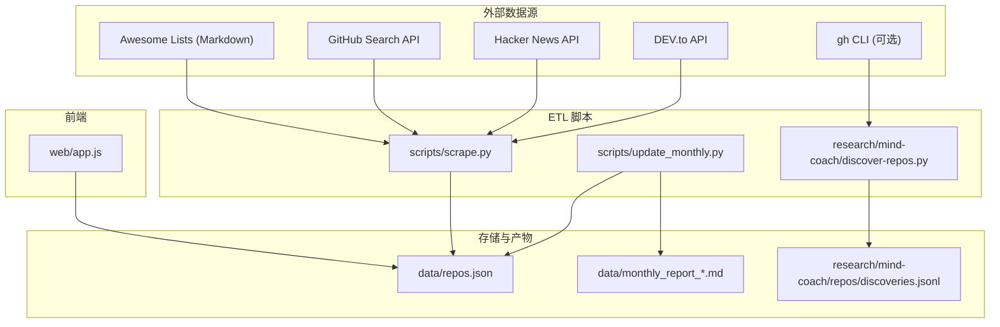
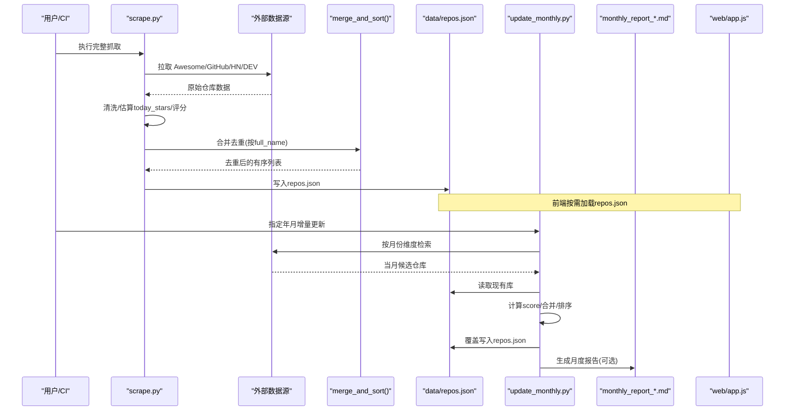
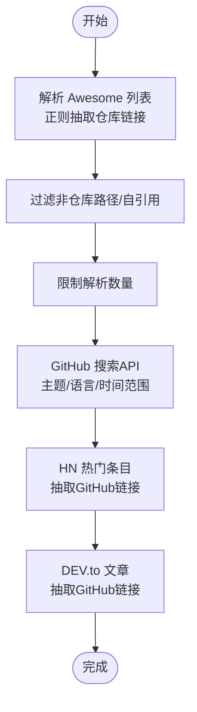
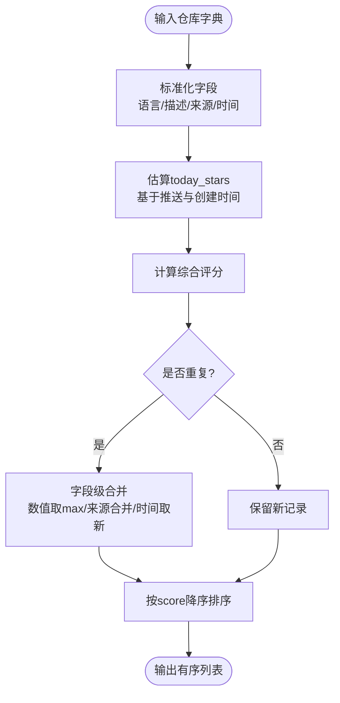
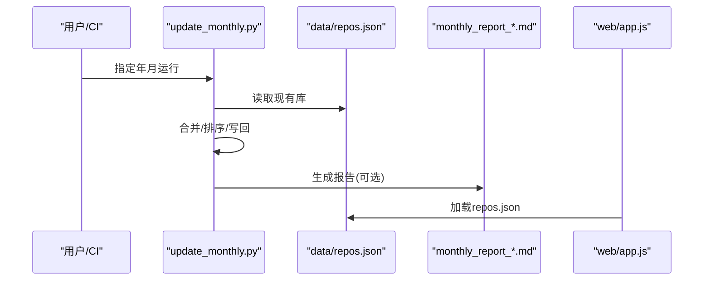
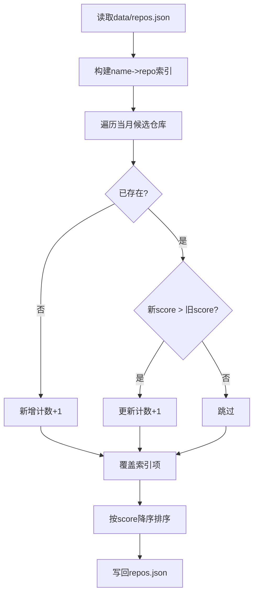
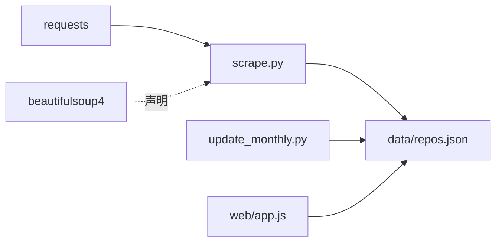

# 数据处理管道

<cite>
**本文引用的文件**   
- [README.md](file://README.md)
- [scripts/scrape.py](file://scripts/scrape.py)
- [scripts/update_monthly.py](file://scripts/update_monthly.py)
- [research/mind-coach/discover-repos.py](file://research/mind-coach/discover-repos.py)
- [tests/test_scripts.py](file://tests/test_scripts.py)
- [requirements.txt](file://requirements.txt)
- [web/app.js](file://web/app.js)
</cite>

## 目录
1. [简介](#简介)
2. [项目结构](#项目结构)
3. [核心组件](#核心组件)
4. [架构总览](#架构总览)
5. [详细组件分析](#详细组件分析)
6. [依赖关系分析](#依赖关系分析)
7. [性能与内存优化](#性能与内存优化)
8. [故障排查指南](#故障排查指南)
9. [结论](#结论)
10. [附录：配置与示例](#附录配置与示例)

## 简介
本仓库实现了一个面向 GitHub 项目的“多源聚合 + 智能评分”的数据处理管道，采用 ETL 模式：
- Extract（提取）：从 Awesome Lists、GitHub Search API、Hacker News、DEV.to 等多源抓取候选仓库。
- Transform（转换）：清洗字段、估算今日增长、计算综合评分、去重合并、标准化语言/描述等。
- Load（加载）：输出为 data/repos.json，并支持按月增量更新与 Markdown 报告生成；前端通过 web/app.js 消费数据。

该管道具备：
- 多源数据融合与去重策略（按仓库全名唯一键，数值字段取最大，来源标签合并）。
- 增量更新机制（按月拉取新仓库，合并到现有数据库，保留状态与统计）。
- 数据验证与异常处理（网络重试、限流回退、缺失字段容错）。
- 可观测性与报告（月度报告、Top 列表、语言分布等）。

## 项目结构
- scripts/scrape.py：主 ETL 脚本，负责多源提取、转换、合并与持久化。
- scripts/update_monthly.py：按月增量更新脚本，拉取当月新建仓库并合并入库。
- research/mind-coach/discover-repos.py：辅助发现脚本，基于 gh CLI 持续追加 JSONL 记录（独立于主库）。
- tests/test_scripts.py：对核心算法与流程的单元测试。
- web/app.js：前端消费 data/repos.json，提供筛选、排序、收藏、灵感模式等交互。
- requirements.txt：Python 运行时依赖。

图表来源
- [scripts/scrape.py:197-405](file://scripts/scrape.py#L197-L405)
- [scripts/update_monthly.py:79-135](file://scripts/update_monthly.py#L79-L135)
- [research/mind-coach/discover-repos.py:59-113](file://research/mind-coach/discover-repos.py#L59-L113)
- [web/app.js:1-20](file://web/app.js#L1-L20)

章节来源
- [README.md:123-148](file://README.md#L123-L148)
- [scripts/scrape.py:1-120](file://scripts/scrape.py#L1-L120)
- [scripts/update_monthly.py:1-40](file://scripts/update_monthly.py#L1-L40)
- [research/mind-coach/discover-repos.py:1-40](file://research/mind-coach/discover-repos.py#L1-L40)
- [web/app.js:1-20](file://web/app.js#L1-L20)

## 核心组件
- 多源提取器
  - Awesome Lists 解析：正则抽取 GitHub 仓库链接，过滤非仓库路径与自引用，限制单次解析数量。
  - GitHub API 搜索：按主题/语言/时间窗口检索，分页获取，统一封装请求头与限流处理。
  - Hacker News 与 DEV.to：抓取热门条目，从中提取 GitHub 链接并补全仓库详情。
- 转换与评分
  - 今日增长估算：基于推送时间与创建时间推断活跃度，结合近期推送与“新星”效应给出 today_stars。
  - 综合评分：stars + forks + (forks/stars)*1000 + today_stars*10 + commit_activity*2。
  - 字段标准化：语言、描述、来源标签、采集时间等。
- 去重与合并
  - 以 full_name 为唯一键，数值型指标取最大值，来源标签集合合并，fetched_at 取最新。
- 加载与持久化
  - 写入 data/repos.json，包含元信息（sources、criteria、total、fetched_at）与 repos 列表。
  - 月度增量：读取现有库，合并新增/更新项，重新排序后写回，并可选生成 Markdown 报告。
- 前端消费
  - web/app.js 从 ../data/repos.json 加载数据，提供多维筛选、排序、收藏、对比、灵感模式等。

章节来源
- [scripts/scrape.py:153-173](file://scripts/scrape.py#L153-L173)
- [scripts/scrape.py:247-301](file://scripts/scrape.py#L247-L301)
- [scripts/scrape.py:304-336](file://scripts/scrape.py#L304-L336)
- [scripts/scrape.py:565-576](file://scripts/scrape.py#L565-L576)
- [scripts/scrape.py:578-625](file://scripts/scrape.py#L578-L625)
- [scripts/scrape.py:628-651](file://scripts/scrape.py#L628-L651)
- [scripts/update_monthly.py:168-209](file://scripts/update_monthly.py#L168-L209)
- [web/app.js:1-20](file://web/app.js#L1-L20)

## 架构总览
下图展示了端到端的数据流：多源提取 → 清洗/评分/去重 → 落盘 → 前端消费；以及按月增量更新的分支流程。

图表来源
- [scripts/scrape.py:673-718](file://scripts/scrape.py#L673-L718)
- [scripts/update_monthly.py:306-349](file://scripts/update_monthly.py#L306-L349)
- [web/app.js:1-20](file://web/app.js#L1-L20)

## 详细组件分析

### 组件A：Extract（多源数据提取）
- Awesome Lists
  - 使用正则匹配 Markdown 中的 GitHub 链接，过滤非仓库路径与 awesome-* 自引用，限制返回数量避免后续 API 压力。
- GitHub API
  - 统一请求头构建，支持 Token 提升配额；搜索查询按主题/语言/时间范围组合；对 403 限流进行休眠重试。
- Hacker News / DEV.to
  - 从热门条目中抽取 GitHub URL，调用仓库详情接口补齐结构化字段。

图表来源
- [scripts/scrape.py:153-173](file://scripts/scrape.py#L153-L173)
- [scripts/scrape.py:247-301](file://scripts/scrape.py#L247-L301)
- [scripts/scrape.py:408-464](file://scripts/scrape.py#L408-L464)
- [scripts/scrape.py:467-531](file://scripts/scrape.py#L467-L531)

章节来源
- [scripts/scrape.py:153-173](file://scripts/scrape.py#L153-L173)
- [scripts/scrape.py:247-301](file://scripts/scrape.py#L247-L301)
- [scripts/scrape.py:408-464](file://scripts/scrape.py#L408-L464)
- [scripts/scrape.py:467-531](file://scripts/scrape.py#L467-L531)

### 组件B：Transform（清洗、去重、标准化、评分）
- 字段清洗与标准化
  - 语言默认值、描述兜底、来源标记、采集时间戳。
- 今日增长估算
  - 根据 pushed_at 与 created_at 计算推送时效与新星奖励，得到 today_stars。
- 综合评分
  - stars + forks + (forks/stars)*1000 + today_stars*10 + commit_activity*2。
- 去重与冲突解决
  - 以 full_name 为键，数值字段取 max，来源标签集合合并，fetched_at 取最新。

图表来源
- [scripts/scrape.py:304-336](file://scripts/scrape.py#L304-L336)
- [scripts/scrape.py:565-576](file://scripts/scrape.py#L565-L576)
- [scripts/scrape.py:578-625](file://scripts/scrape.py#L578-L625)

章节来源
- [scripts/scrape.py:304-336](file://scripts/scrape.py#L304-L336)
- [scripts/scrape.py:565-576](file://scripts/scrape.py#L565-L576)
- [scripts/scrape.py:578-625](file://scripts/scrape.py#L578-L625)

### 组件C：Load（数据存储、格式转换）
- 主库写入
  - 将元信息与 repos 列表序列化为 data/repos.json，便于前端直接消费。
- 月度增量
  - 读取现有库，合并当月新增/更新项，重新排序后覆盖写入；可选生成 Markdown 报告。
- 前端消费
  - web/app.js 通过相对路径加载 repos.json，提供筛选、排序、收藏、对比、灵感模式等功能。

图表来源
- [scripts/update_monthly.py:168-209](file://scripts/update_monthly.py#L168-L209)
- [scripts/update_monthly.py:232-303](file://scripts/update_monthly.py#L232-L303)
- [web/app.js:1-20](file://web/app.js#L1-L20)

章节来源
- [scripts/scrape.py:628-651](file://scripts/scrape.py#L628-L651)
- [scripts/update_monthly.py:168-209](file://scripts/update_monthly.py#L168-L209)
- [scripts/update_monthly.py:232-303](file://scripts/update_monthly.py#L232-L303)
- [web/app.js:1-20](file://web/app.js#L1-L20)

### 组件D：增量更新机制（差异检测、部分更新、状态管理）
- 差异检测
  - 以 full_name 作为唯一键，判断是否存在于现有库；若存在且新 score 更高则视为更新。
- 部分更新
  - 仅对当月候选仓库进行合并，不触发全量重建；保持 sources 与 criteria 元信息。
- 状态管理
  - 维护 fetched_at、source 标签、month_tag 等字段，用于追踪数据来源与时间线。

图表来源
- [scripts/update_monthly.py:168-209](file://scripts/update_monthly.py#L168-L209)

章节来源
- [scripts/update_monthly.py:168-209](file://scripts/update_monthly.py#L168-L209)

### 组件E：数据验证规则与异常处理
- 网络层
  - requests.Session + Retry 指数退避，针对 429/5xx 自动重试；超时控制。
- 业务层
  - 403 限流提示与休眠；404 不存在仓库快速跳过；缺失字段时提供默认值或 0。
- 测试覆盖
  - parse_num、calculate_score、estimate_today_stars、parse_awesome_list、merge_and_sort、format_api_repo、get_headers 等关键函数均有单测。

章节来源
- [scripts/scrape.py:118-134](file://scripts/scrape.py#L118-L134)
- [scripts/scrape.py:176-194](file://scripts/scrape.py#L176-L194)
- [scripts/scrape.py:247-268](file://scripts/scrape.py#L247-L268)
- [tests/test_scripts.py:18-33](file://tests/test_scripts.py#L18-L33)
- [tests/test_scripts.py:36-54](file://tests/test_scripts.py#L36-L54)
- [tests/test_scripts.py:56-107](file://tests/test_scripts.py#L56-L107)
- [tests/test_scripts.py:109-141](file://tests/test_scripts.py#L109-L141)
- [tests/test_scripts.py:143-198](file://tests/test_scripts.py#L143-L198)
- [tests/test_scripts.py:201-228](file://tests/test_scripts.py#L201-L228)
- [tests/test_scripts.py:245-257](file://tests/test_scripts.py#L245-L257)

## 依赖关系分析
- Python 依赖
  - requests：HTTP 客户端，配合 Retry 与 HTTPAdapter 实现重试与退避。
  - beautifulsoup4：在 requirements 中声明，但当前脚本主要使用正则解析 Markdown，未直接引入。
- 模块耦合
  - scrape.py 内部函数高度内聚：extractors → transform → merge → save。
  - update_monthly.py 复用 calculate_score 逻辑，保证评分一致性。
  - web/app.js 仅消费 data/repos.json，与后端解耦。

图表来源
- [requirements.txt:1-2](file://requirements.txt#L1-L2)
- [scripts/scrape.py:14-24](file://scripts/scrape.py#L14-L24)
- [scripts/update_monthly.py:168-209](file://scripts/update_monthly.py#L168-L209)
- [web/app.js:1-20](file://web/app.js#L1-L20)

章节来源
- [requirements.txt:1-2](file://requirements.txt#L1-L2)
- [scripts/scrape.py:14-24](file://scripts/scrape.py#L14-L24)
- [scripts/update_monthly.py:168-209](file://scripts/update_monthly.py#L168-L209)
- [web/app.js:1-20](file://web/app.js#L1-L20)

## 性能与内存优化
- 网络与并发
  - 使用 Session 复用连接；Retry 指数退避降低瞬时失败成本；合理设置 per_page 与 sleep 间隔避免触发限流。
- 去重与合并
  - 以 dict[name] 为索引，O(1) 查找与合并；数值字段取 max，减少比较开销。
- 评分与排序
  - 仅在合并后计算一次 score；最终一次性排序，避免多次重排。
- 内存管理
  - 大结果集建议分块写入或流式处理（当前规模下内存占用可控）。
  - 前端分页渲染（visibleStart/visibleCount）降低 DOM 压力。
- 增量更新
  - 仅处理当月候选仓库，避免全量重建；利用已有索引快速定位更新点。

[本节为通用指导，无需特定文件引用]

## 故障排查指南
- 无法加载数据
  - 浏览器 file:// 协议会阻止 fetch，需通过本地 HTTP 服务访问。
- 触发 GitHub 限流
  - 设置环境变量 GITHUB_TOKEN 提升配额；脚本内置 403 休眠与重试。
- 部署到 Fork
  - 启用 Pages 并使用 Actions 源，推送后自动部署。
- 测试失败
  - 检查 parse_num、calculate_score、estimate_today_stars、merge_and_sort 等断言是否与实现一致。

章节来源
- [README.md:164-176](file://README.md#L164-L176)
- [scripts/scrape.py:257-268](file://scripts/scrape.py#L257-L268)
- [tests/test_scripts.py:18-33](file://tests/test_scripts.py#L18-L33)
- [tests/test_scripts.py:36-54](file://tests/test_scripts.py#L36-L54)
- [tests/test_scripts.py:56-107](file://tests/test_scripts.py#L56-L107)
- [tests/test_scripts.py:143-198](file://tests/test_scripts.py#L143-L198)

## 结论
该数据处理管道以简洁清晰的 ETL 架构实现了多源聚合、智能评分与增量更新，具备良好的可扩展性与可观测性。通过严格的去重与冲突解决策略，保证了数据的准确性与一致性；完善的异常处理与测试覆盖提升了鲁棒性。前端与后端通过 JSON 解耦，便于独立演进。

[本节为总结，无需特定文件引用]

## 附录：配置与示例
- 环境变量
  - GITHUB_TOKEN：提升 GitHub API 配额。
  - DISCOVER_LIMIT：discover-repos.sh 每个关键词返回上限。
- 命令行参数
  - update_monthly.py：--year/--month/--report。
- 典型用法
  - 全量抓取：python scripts/scrape.py
  - 月度增量：python scripts/update_monthly.py --year 2026 --month 6 --report
  - 本地预览：cd web && python3 -m http.server 8000

章节来源
- [README.md:60-75](file://README.md#L60-L75)
- [scripts/update_monthly.py:306-311](file://scripts/update_monthly.py#L306-L311)
- [research/mind-coach/discover-repos.py:23](file://research/mind-coach/discover-repos.py#L23)