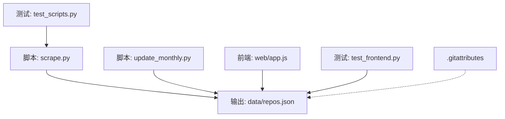
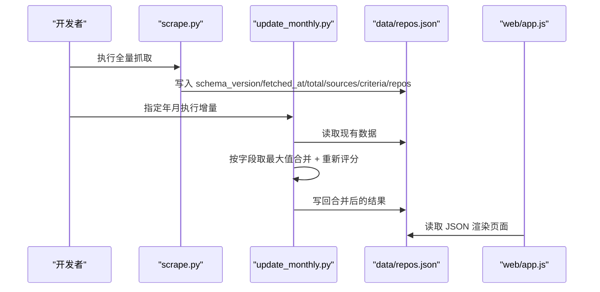
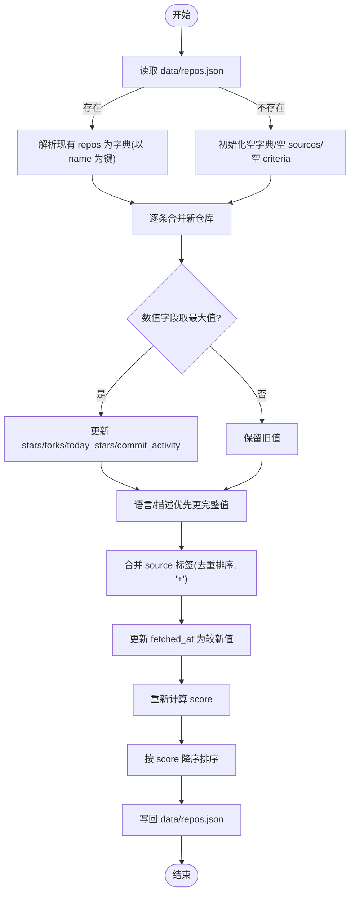
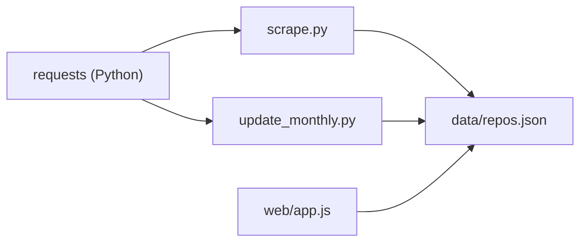

# 数据存储层

<cite>
**本文引用的文件列表**
- [README.md](file://README.md)
- [requirements.txt](file://requirements.txt)
- [scripts/scrape.py](file://scripts/scrape.py)
- [scripts/update_monthly.py](file://scripts/update_monthly.py)
- [tests/test_scripts.py](file://tests/test_scripts.py)
- [tests/test_frontend.py](file://tests/test_frontend.py)
- [.gitattributes](file://.gitattributes)
- [web/app.js](file://web/app.js)
</cite>

## 目录
1. [简介](#简介)
2. [项目结构](#项目结构)
3. [核心组件](#核心组件)
4. [架构总览](#架构总览)
5. [详细组件分析](#详细组件分析)
6. [依赖关系分析](#依赖关系分析)
7. [性能与存储优化](#性能与存储优化)
8. [故障排查指南](#故障排查指南)
9. [结论](#结论)
10. [附录：数据迁移与版本兼容](#附录数据迁移与版本兼容)

## 简介
本技术文档聚焦于项目的“数据存储层”，围绕以下目标展开：
- JSON 文件格式设计：数据结构定义、字段规范、版本兼容性
- 增量更新机制：差异检测算法、部分更新策略、状态管理
- 备份与恢复流程：文件完整性检查、损坏数据修复
- 存储优化策略：压缩、索引构建、查询优化
- 数据迁移工具与脚本使用说明

本项目通过 Python 脚本从多个来源聚合 GitHub 仓库信息，统一格式后持久化为 data/repos.json；前端以纯静态方式读取该 JSON 进行展示与交互。

## 项目结构
与数据存储直接相关的目录与文件如下：
- scripts/scrape.py：全量抓取与合并写入
- scripts/update_monthly.py：按月增量抓取与合并写入
- tests/test_scripts.py：对核心逻辑的单元测试（评分、去重、格式化等）
- tests/test_frontend.py：对最终 JSON 结构的冒烟测试（存在性、合法性、必填字段）
- .gitattributes：将大体积 JSON 标记为二进制，避免 diff/merge 噪音
- web/app.js：前端加载并消费 repos.json 的主要入口
- README.md：快速开始、数据源说明、运行方式

图表来源
- [scripts/scrape.py:625-649](file://scripts/scrape.py#L625-L649)
- [scripts/update_monthly.py:216-229](file://scripts/update_monthly.py#L216-L229)
- [web/app.js:1395-1442](file://web/app.js#L1395-L1442)
- [tests/test_scripts.py:1-54](file://tests/test_scripts.py#L1-L54)
- [tests/test_frontend.py:31-51](file://tests/test_frontend.py#L31-L51)
- [.gitattributes:1-2](file://.gitattributes#L1-L2)

章节来源
- [README.md:123-148](file://README.md#L123-L148)
- [requirements.txt:1-1](file://requirements.txt#L1-L1)

## 核心组件
- 数据生产者
  - 全量抓取器：scrape.py，负责多源采集、去重、评分、排序与落盘
  - 月度增量器：update_monthly.py，按月份范围检索新仓库，并与现有数据合并
- 数据消费者
  - 前端：web/app.js，加载 data/repos.json 渲染 UI、书签、比较等功能
- 质量保障
  - 单元测试：test_scripts.py，覆盖评分公式、去重合并、格式化等
  - 冒烟测试：test_frontend.py，校验 repos.json 结构与必填字段
- 配置与元数据
  - .gitattributes：将 data/repos.json 标记为二进制，避免 Git 产生大量 diff
  - requirements.txt：声明运行时依赖 requests

章节来源
- [scripts/scrape.py:546-649](file://scripts/scrape.py#L546-L649)
- [scripts/update_monthly.py:137-229](file://scripts/update_monthly.py#L137-L229)
- [tests/test_scripts.py:37-54](file://tests/test_scripts.py#L37-L54)
- [tests/test_frontend.py:31-51](file://tests/test_frontend.py#L31-L51)
- [.gitattributes:1-2](file://.gitattributes#L1-L2)
- [requirements.txt:1-1](file://requirements.txt#L1-L1)

## 架构总览
整体数据流：多源抓取 → 统一建模 → 去重合并 → 计算评分 → 排序 → 写入 JSON → 前端消费。

图表来源
- [scripts/scrape.py:625-649](file://scripts/scrape.py#L625-L649)
- [scripts/update_monthly.py:167-229](file://scripts/update_monthly.py#L167-L229)
- [web/app.js:1395-1442](file://web/app.js#L1395-L1442)

## 详细组件分析

### JSON 文件格式设计
- 顶层结构
  - schema_version：当前数据模式版本
  - fetched_at：最近一次抓取时间（ISO 8601）
  - total：仓库条目总数
  - sources：数据来源标签集合（如 awesome_lists、github_api、trending、hackernews、devto、monthly_new）
  - criteria：筛选条件与参数快照（最小 stars、forks、awesome list 清单等）
  - repos：仓库对象数组
- 仓库对象字段
  - name：owner/repo 全称
  - url：仓库主页链接
  - description：描述文本
  - stars：星标数
  - forks：分叉数
  - language：编程语言
  - today_stars：当日星标增长估算值
  - score：综合评分
  - fetched_at：记录更新时间
  - source：来源标签（可合并为 “+” 连接的多来源）
  - created_at：创建时间（增量场景下可能携带）
  - month_tag：月份标签（增量场景下用于统计）
- 版本兼容性
  - 写入时固定 schema_version=2
  - 读取端应忽略未知字段，仅使用已知字段，保证向前兼容
  - 新增字段时应保持向后兼容（旧版前端忽略新字段）

章节来源
- [scripts/scrape.py:625-649](file://scripts/scrape.py#L625-L649)
- [scripts/update_monthly.py:216-229](file://scripts/update_monthly.py#L216-L229)
- [tests/test_frontend.py:31-51](file://tests/test_frontend.py#L31-L51)

### 增量更新机制
- 差异检测
  - 基于仓库唯一键 name（owner/repo）进行匹配
  - 数值型信号字段采用“逐字段取最大值”策略：stars、forks、today_stars、commit_activity
  - 语言与描述优先选择更完整的信息（非空且非占位符）
  - 来源标签合并为有序去重集合，用 “+” 拼接
  - 时间戳字段保留较新的 fetched_at
- 部分更新策略
  - 月度增量脚本会先拉取当月新建仓库，再与已有数据合并
  - 合并后重新计算 score，并按 score 降序排列
  - 若不存在 data/repos.json，则从零初始化
- 状态管理
  - 通过 fetched_at 记录最新写入时间
  - 通过 sources 维护数据来源集合
  - 通过 criteria 保存筛选参数快照，便于复现与审计

图表来源
- [scripts/update_monthly.py:167-229](file://scripts/update_monthly.py#L167-L229)
- [scripts/scrape.py:575-623](file://scripts/scrape.py#L575-L623)

章节来源
- [scripts/update_monthly.py:167-229](file://scripts/update_monthly.py#L167-L229)
- [scripts/scrape.py:575-623](file://scripts/scrape.py#L575-L623)
- [tests/test_scripts.py:146-179](file://tests/test_scripts.py#L146-L179)

### 数据备份与恢复流程
- 备份
  - 建议定期复制 data/repos.json 到外部存储或归档目录
  - 由于 .gitattributes 将其标记为二进制，Git 不会生成大型 diff，适合版本化归档
- 恢复
  - 直接替换 data/repos.json 即可恢复
  - 恢复后可运行前端本地服务器验证页面是否正常加载
- 完整性检查
  - 使用 pytest 冒烟测试校验 JSON 结构、必填字段与基本约束
  - 建议在 CI 中集成该测试，确保每次提交前数据可用
- 损坏数据修复
  - 若 JSON 损坏，可从最近的备份恢复
  - 若无备份，可重新执行全量抓取脚本生成全新数据

章节来源
- [.gitattributes:1-2](file://.gitattributes#L1-L2)
- [tests/test_frontend.py:31-51](file://tests/test_frontend.py#L31-L51)
- [README.md:49-68](file://README.md#L49-L68)

### 存储优化策略
- 压缩
  - 当前未实现压缩；如需减小体积，可在导出阶段提供 gzip 压缩选项，并在前端按需解压
- 索引构建
  - 当前无独立索引文件；可通过在内存中对 repos 建立倒排索引（如按 language、source、month_tag）提升查询效率
- 查询优化
  - 前端可按需缓存已加载数据，减少重复请求
  - 对于高频过滤（语言、来源），可在客户端侧预先分组，降低渲染开销
- 传输优化
  - 结合 Service Worker 与 PWA 能力，对 repos.json 做离线缓存，提高首屏速度

章节来源
- [web/app.js:1395-1442](file://web/app.js#L1395-L1442)
- [README.md:152-161](file://README.md#L152-L161)

## 依赖关系分析
- 运行时依赖
  - requests：HTTP 客户端，用于调用 GitHub API 与其他数据源
- 脚本间耦合
  - scrape.py 与 update_monthly.py 共享评分公式与合并策略，但各自独立运行
- 前后端契约
  - web/app.js 依赖 data/repos.json 的字段结构，任何变更需同步更新前端或保持向后兼容

图表来源
- [requirements.txt:1-1](file://requirements.txt#L1-L1)
- [scripts/scrape.py:625-649](file://scripts/scrape.py#L625-L649)
- [scripts/update_monthly.py:216-229](file://scripts/update_monthly.py#L216-L229)
- [web/app.js:1395-1442](file://web/app.js#L1395-L1442)

章节来源
- [requirements.txt:1-1](file://requirements.txt#L1-L1)
- [scripts/scrape.py:625-649](file://scripts/scrape.py#L625-L649)
- [scripts/update_monthly.py:216-229](file://scripts/update_monthly.py#L216-L229)
- [web/app.js:1395-1442](file://web/app.js#L1395-L1442)

## 性能与存储优化
- 抓取阶段
  - 使用带重试与退避的 HTTP 会话，降低网络抖动影响
  - 合理分页与限频，避免触发速率限制
- 合并阶段
  - 以 name 为键的哈希表进行 O(n) 合并，逐字段取最大值，复杂度线性
  - 评分计算为常数时间，排序为 O(n log n)
- 存储阶段
  - 使用 UTF-8 编码与缩进输出，可读性好；生产环境可考虑关闭缩进或启用压缩
- 前端阶段
  - 利用浏览器缓存与 Service Worker 缓存，减少重复下载

[本节为通用指导，不直接分析具体文件]

## 故障排查指南
- 无法加载数据
  - 确认已通过本地 HTTP 服务器访问（浏览器 file:// 协议会阻止 fetch）
  - 检查 data/repos.json 是否存在且为合法 JSON
- 触发速率限制
  - 设置环境变量 GITHUB_TOKEN 以提升配额
- 数据缺失字段
  - 运行冒烟测试定位缺失字段与位置
- 增量更新未生效
  - 检查是否传入正确的 --year 与 --month
  - 查看合并日志中的 new_count 与 updated 计数

章节来源
- [README.md:164-176](file://README.md#L164-L176)
- [tests/test_frontend.py:31-51](file://tests/test_frontend.py#L31-L51)
- [scripts/update_monthly.py:326-371](file://scripts/update_monthly.py#L326-L371)

## 结论
数据存储层以简洁的 JSON 为核心载体，配合双脚本（全量与增量）完成数据采集、清洗、合并与持久化。通过明确的字段规范与版本标识，保证了前后端的稳定契约；通过单元测试与冒烟测试，保障了数据质量。后续可在压缩、索引与查询优化方面进一步增强，以满足更大规模数据的性能需求。

[本节为总结性内容，不直接分析具体文件]

## 附录：数据迁移与版本兼容
- 版本标识
  - 写入时固定 schema_version=2，读取端应据此判断兼容性
- 迁移原则
  - 新增字段：保持向后兼容，旧前端忽略未知字段
  - 废弃字段：保留一段时间并给出迁移提示，逐步移除
  - 字段类型变更：提供转换脚本，确保历史数据可被新版本正确解析
- 迁移工具与脚本
  - 全量重建：运行 scrape.py 可生成全新的 data/repos.json
  - 增量补全：运行 update_monthly.py 可对特定月份进行增量补充
  - 报告生成：可选 --report 参数生成月度 Markdown 报告，辅助审计与回溯
- 使用示例
  - 全量抓取：python3 scripts/scrape.py
  - 增量更新：python3 scripts/update_monthly.py --year 2026 --month 6 --report

章节来源
- [scripts/scrape.py:625-649](file://scripts/scrape.py#L625-L649)
- [scripts/update_monthly.py:326-371](file://scripts/update_monthly.py#L326-L371)
- [README.md:60-68](file://README.md#L60-L68)