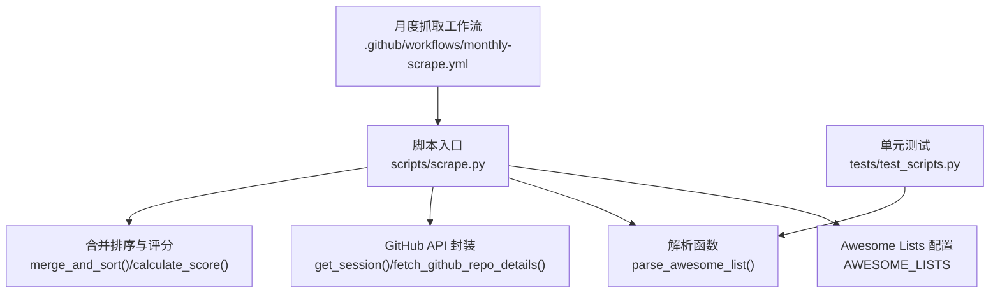
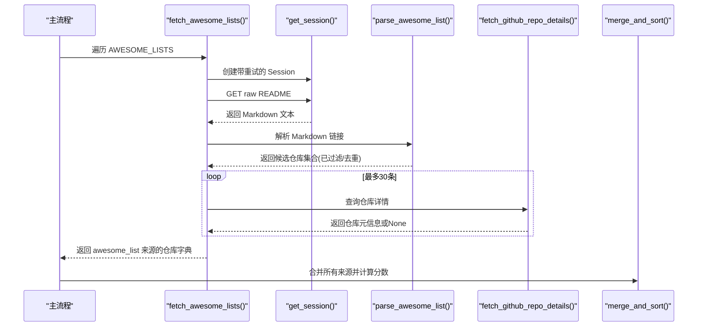
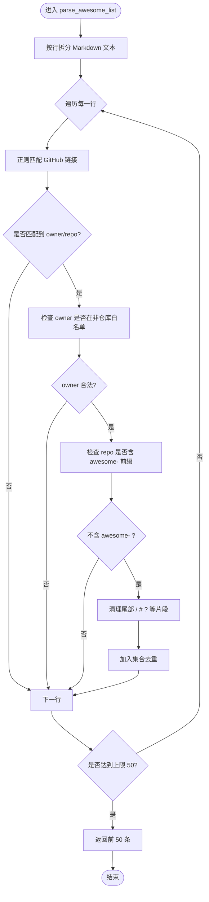
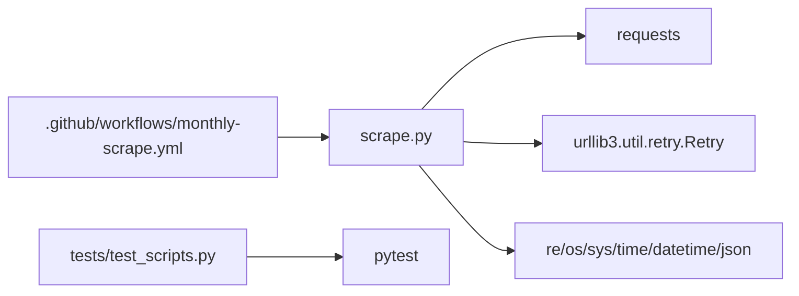

# Awesome Lists 解析器

<cite>
**本文引用的文件**
- [scripts/scrape.py](file://scripts/scrape.py)
- [tests/test_scripts.py](file://tests/test_scripts.py)
- [.github/workflows/monthly-scrape.yml](file://.github/workflows/monthly-scrape.yml)
- [README.md](file://README.md)
</cite>

## 目录
1. [简介](#简介)
2. [项目结构](#项目结构)
3. [核心组件](#核心组件)
4. [架构总览](#架构总览)
5. [详细组件分析](#详细组件分析)
6. [依赖关系分析](#依赖关系分析)
7. [性能考量](#性能考量)
8. [故障排查指南](#故障排查指南)
9. [结论](#结论)
10. [附录：扩展与示例](#附录扩展与示例)

## 简介
本技术文档聚焦于 Awesome Lists 解析器的实现细节，解释如何从多个 Awesome Lists（awesome-python、awesome-go、awesome-javascript 等共 8 个列表）中提取 GitHub 仓库链接。内容涵盖正则表达式匹配模式、Markdown 链接解析逻辑、非仓库路径过滤机制和去重策略；并说明 GITHUB_NON_REPO_OWNERS 白名单的作用以及 awesome- 前缀过滤规则。同时提供添加新数据源的具体步骤、错误处理与性能优化建议，以及面向扩展性的设计要点。

## 项目结构
本项目采用脚本驱动的数据聚合方案，Awesome Lists 解析位于主抓取脚本中，配合测试与工作流完成自动化运行与验证。

图表来源
- [scripts/scrape.py:27-60](file://scripts/scrape.py#L27-L60)
- [scripts/scrape.py:149-169](file://scripts/scrape.py#L149-L169)
- [scripts/scrape.py:114-130](file://scripts/scrape.py#L114-L130)
- [scripts/scrape.py:575-622](file://scripts/scrape.py#L575-L622)
- [tests/test_scripts.py:110-142](file://tests/test_scripts.py#L110-L142)
- [.github/workflows/monthly-scrape.yml:25-26](file://.github/workflows/monthly-scrape.yml#L25-L26)

章节来源
- [README.md:123-148](file://README.md#L123-L148)

## 核心组件
- Awesome Lists 数据源清单：集中定义在 AWESOME_LISTS 常量中，包含名称与 raw README 的 URL。
- Markdown 解析器：parse_awesome_list(content) 使用正则提取 GitHub 仓库链接，并进行过滤与去重。
- 网络会话与重试：get_session() 基于 requests.Session 与 urllib3 Retry 构建带退避的重试适配器。
- GitHub API 详情获取：fetch_github_repo_details(owner, repo) 拉取仓库元信息用于后续评分与展示。
- 合并与去重：merge_and_sort(all_repos) 对多来源结果进行字段级最大值合并与评分排序。

章节来源
- [scripts/scrape.py:27-60](file://scripts/scrape.py#L27-L60)
- [scripts/scrape.py:149-169](file://scripts/scrape.py#L149-L169)
- [scripts/scrape.py:114-130](file://scripts/scrape.py#L114-L130)
- [scripts/scrape.py:172-190](file://scripts/scrape.py#L172-L190)
- [scripts/scrape.py:575-622](file://scripts/scrape.py#L575-L622)

## 架构总览
下图展示了 Awesome Lists 解析在主流程中的位置与交互关系。

图表来源
- [scripts/scrape.py:193-240](file://scripts/scrape.py#L193-L240)
- [scripts/scrape.py:149-169](file://scripts/scrape.py#L149-L169)
- [scripts/scrape.py:114-130](file://scripts/scrape.py#L114-L130)
- [scripts/scrape.py:172-190](file://scripts/scrape.py#L172-L190)
- [scripts/scrape.py:575-622](file://scripts/scrape.py#L575-L622)

## 详细组件分析

### Awesome Lists 数据源配置
- 数据来源：AWESOME_LISTS 包含 8 个列表，覆盖 Python、Go、JavaScript、Rust、Java、C++、TypeScript、Swift。
- URL 规范：统一指向各列表仓库的 HEAD 分支 README 原始内容，便于稳定解析。
- 可扩展性：新增数据源只需在列表中追加 name/url 条目。

章节来源
- [scripts/scrape.py:27-60](file://scripts/scrape.py#L27-L60)

### Markdown 链接解析与正则匹配
- 目标：从 Markdown 行中匹配形如 [text](https://github.com/owner/repo) 的链接。
- 正则模式：匹配 owner 与 repo 两段命名段，允许可选尾部字符（如锚点、查询参数）。
- 逐行扫描：按行分割后使用 finditer 查找所有匹配项，避免整块文本匹配的性能问题。
- 输出限制：返回去重后的列表，最多保留 50 条，以控制后续 API 调用量。

图表来源
- [scripts/scrape.py:149-169](file://scripts/scrape.py#L149-L169)

章节来源
- [scripts/scrape.py:149-169](file://scripts/scrape.py#L149-L169)
- [tests/test_scripts.py:110-142](file://tests/test_scripts.py#L110-L142)

### 非仓库路径过滤机制（GITHUB_NON_REPO_OWNERS）
- 目的：排除 GitHub 平台自身的路径（如 features、trending、settings 等），这些并非实际仓库。
- 实现：将 owner 小写后与集合进行成员判断，命中则跳过。
- 维护建议：当 GitHub 新增导航路径时，及时更新该集合以避免误抓。

章节来源
- [scripts/scrape.py:78-100](file://scripts/scrape.py#L78-L100)
- [scripts/scrape.py:159-161](file://scripts/scrape.py#L159-L161)
- [tests/test_scripts.py:126-136](file://tests/test_scripts.py#L126-L136)

### awesome- 前缀过滤规则
- 目的：过滤掉 Awesome Lists 自身的仓库链接，避免自引用导致重复或噪声。
- 实现：检查 repo 名是否包含 awesome-（不区分大小写），命中则跳过。
- 影响：确保只收集第三方仓库，提升数据质量。

章节来源
- [scripts/scrape.py:162-163](file://scripts/scrape.py#L162-L163)
- [tests/test_scripts.py:126-136](file://tests/test_scripts.py#L126-L136)

### 去重策略与上限控制
- 集合去重：使用 set 存储 owner/repo 字符串，天然去重。
- 上限控制：返回 list(repos)[:50]，限制后续 API 请求数量，降低速率限制风险。
- 合并阶段二次去重：merge_and_sort 以 name 为键进行字段级合并，保证跨来源唯一性。

章节来源
- [scripts/scrape.py:151-169](file://scripts/scrape.py#L151-L169)
- [scripts/scrape.py:575-622](file://scripts/scrape.py#L575-L622)
- [tests/test_scripts.py:138-142](file://tests/test_scripts.py#L138-L142)
- [tests/test_scripts.py:146-178](file://tests/test_scripts.py#L146-L178)

### 网络会话与重试机制
- 会话复用：requests.Session 复用连接，减少握手开销。
- 指数退避：针对 429/5xx 状态码自动重试，backoff_factor=1.0，最大 3 次。
- 超时保护：为各 API 调用设置合理超时，避免长时间阻塞。

章节来源
- [scripts/scrape.py:114-130](file://scripts/scrape.py#L114-L130)
- [scripts/scrape.py:172-190](file://scripts/scrape.py#L172-L190)

### 错误处理与健壮性
- 解析异常：捕获网络异常与 JSON 解析异常，返回默认值或空集，避免中断整体流程。
- 速率限制：遇到 403 时打印提示信息并延迟重试，保障稳定性。
- 缺失字段：对日期与数值字段做容错处理，防止 KeyError/ValueError。

章节来源
- [scripts/scrape.py:172-190](file://scripts/scrape.py#L172-L190)
- [scripts/scrape.py:193-240](file://scripts/scrape.py#L193-L240)
- [tests/test_scripts.py:105-108](file://tests/test_scripts.py#L105-L108)

### 性能特性与优化
- 正则逐行匹配：避免一次性对整个大文本进行全局匹配，提高内存与时间效率。
- 结果上限：限制解析结果数量，减少后续 API 调用次数。
- 并发与限流：当前为串行调用，通过 time.sleep 控制请求频率，避免触发速率限制。
- 可改进方向：引入异步并发（如 aiohttp + asyncio）与令牌桶限流，进一步提升吞吐。

章节来源
- [scripts/scrape.py:149-169](file://scripts/scrape.py#L149-L169)
- [scripts/scrape.py:193-240](file://scripts/scrape.py#L193-L240)

## 依赖关系分析
- 外部库：requests 用于 HTTP 请求；urllib3.util.retry 提供重试能力。
- 标准库：re、os、sys、time、datetime、json 等。
- 测试依赖：pytest 用于单元测试。
- CI/CD：GitHub Actions 每月定时执行抓取任务。

图表来源
- [scripts/scrape.py:14-20](file://scripts/scrape.py#L14-L20)
- [scripts/scrape.py:114-130](file://scripts/scrape.py#L114-L130)
- [tests/test_scripts.py:1-16](file://tests/test_scripts.py#L1-16)
- [.github/workflows/monthly-scrape.yml:19-26](file://.github/workflows/monthly-scrape.yml#L19-L26)

章节来源
- [requirements.txt:1](file://requirements.txt#L1)
- [tests/test_scripts.py:1-16](file://tests/test_scripts.py#L1-16)
- [.github/workflows/monthly-scrape.yml:19-26](file://.github/workflows/monthly-scrape.yml#L19-L26)

## 性能考量
- 正则复杂度：每行 O(n) 扫描，n 为行长度；总体 O(L*N)，L 为行数，N 为平均行长。
- 集合操作：插入与查找均为 O(1)，去重高效。
- I/O 瓶颈：主要在于网络请求与 GitHub API 速率限制；可通过令牌、分页与并发优化。
- 内存占用：仅保存少量候选仓库集合，内存占用低。

[本节为通用性能讨论，无需特定文件引用]

## 故障排查指南
- 无法加载数据：需通过本地 HTTP 服务访问前端，浏览器禁止 file:// 协议下的 fetch。
- 速率限制：设置 GITHUB_TOKEN 环境变量以提升配额；脚本内已对 403 进行提示与延时。
- 解析结果为空：检查 AWESOME_LISTS 的 URL 是否可达；确认 Markdown 格式符合预期。
- 测试失败：运行 pytest tests/ -v 定位具体断言失败用例。

章节来源
- [README.md:166-171](file://README.md#L166-L171)
- [scripts/scrape.py:172-190](file://scripts/scrape.py#L172-L190)
- [tests/test_scripts.py:1-16](file://tests/test_scripts.py#L1-16)

## 结论
Awesome Lists 解析器通过简洁的正则与严格的过滤规则，从多个权威列表中提取高质量仓库链接，并结合 GitHub API 进行详情补充与评分排序。其设计具备良好的扩展性与鲁棒性，适合持续集成与自动化更新。未来可在并发与限流方面进一步优化，以应对更大规模的数据源与更高的吞吐需求。

[本节为总结性内容，无需特定文件引用]

## 附录：扩展与示例

### 如何添加新的 Awesome List 数据源
- 在 AWESOME_LISTS 中添加一条记录，包含 name 与 url（raw README 地址）。
- 确保 URL 指向稳定的 HEAD 分支，避免频繁变更导致的解析失败。
- 运行脚本或工作流，观察日志输出与测试结果，确认新增源被正确解析与去重。

章节来源
- [scripts/scrape.py:27-60](file://scripts/scrape.py#L27-L60)
- [scripts/scrape.py:193-240](file://scripts/scrape.py#L193-L240)
- [.github/workflows/monthly-scrape.yml:25-26](file://.github/workflows/monthly-scrape.yml#L25-L26)

### 正则表达式与过滤规则的注意事项
- 正则仅匹配标准的 Markdown 链接语法，若 Awesome List 使用其他链接形式，需扩展模式。
- 非仓库白名单应随 GitHub 站点结构变化而更新，避免漏抓或误抓。
- awesome- 前缀过滤能有效避免自引用，但需注意个别特殊场景是否需要放宽。

章节来源
- [scripts/scrape.py:149-169](file://scripts/scrape.py#L149-L169)
- [scripts/scrape.py:78-100](file://scripts/scrape.py#L78-L100)
- [tests/test_scripts.py:126-136](file://tests/test_scripts.py#L126-L136)

### 错误处理与健壮性实践
- 网络层：使用带重试的 Session，并对 429/5xx 进行指数退避。
- 业务层：对缺失字段与异常响应进行容错，返回默认值或空集。
- 测试层：覆盖关键路径（解析、合并、评分、头部构造、会话创建）。

章节来源
- [scripts/scrape.py:114-130](file://scripts/scrape.py#L114-L130)
- [scripts/scrape.py:172-190](file://scripts/scrape.py#L172-L190)
- [tests/test_scripts.py:246-268](file://tests/test_scripts.py#L246-L268)