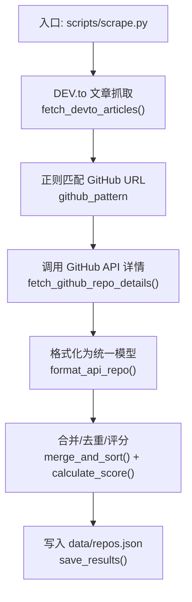
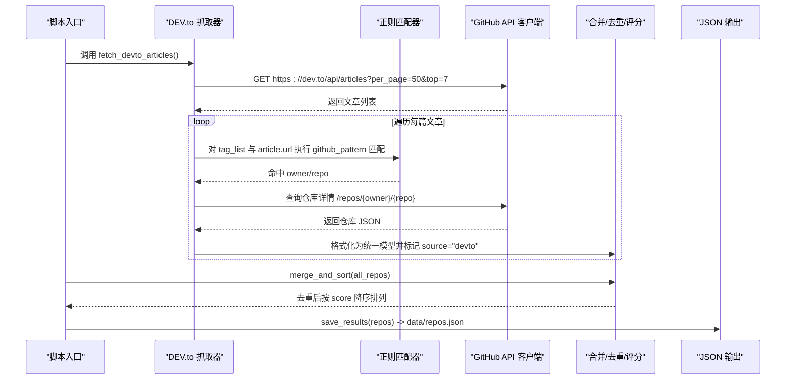
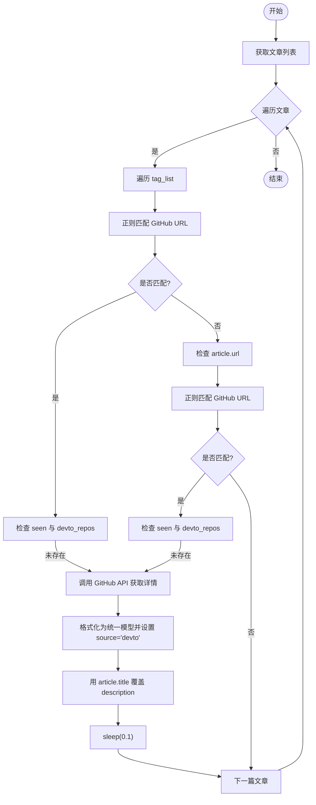
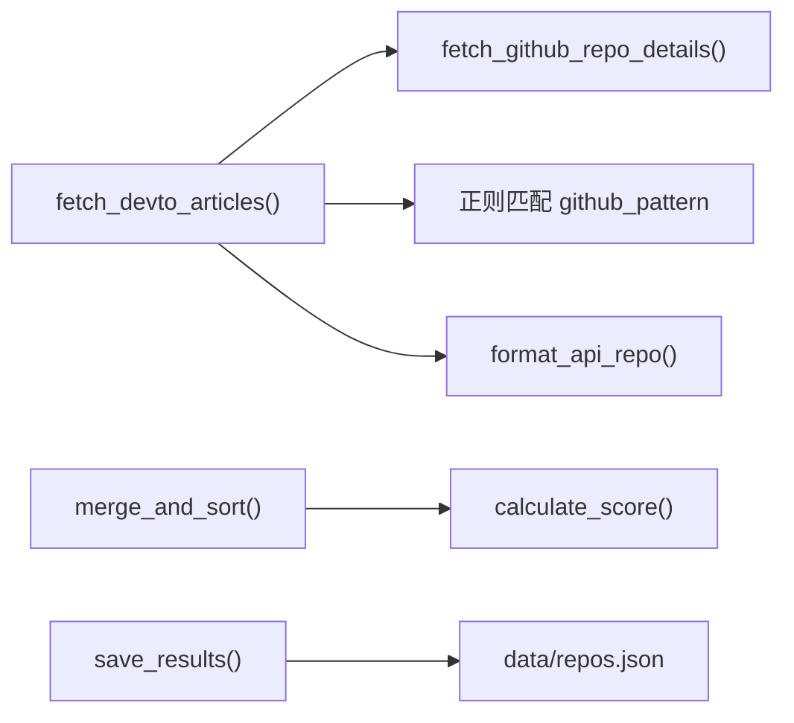

# DEV.to 文章提取器

<cite>
**本文引用的文件**   
- [README.md](file://README.md)
- [scrape.py](file://scripts/scrape.py)
- [update_monthly.py](file://scripts/update_monthly.py)
- [requirements.txt](file://requirements.txt)
- [test_scripts.py](file://tests/test_scripts.py)
</cite>

## 目录
1. [简介](#简介)
2. [项目结构](#项目结构)
3. [核心组件](#核心组件)
4. [架构总览](#架构总览)
5. [详细组件分析](#详细组件分析)
6. [依赖关系分析](#依赖关系分析)
7. [性能与限流](#性能与限流)
8. [故障排查指南](#故障排查指南)
9. [结论](#结论)
10. [附录：扩展到其他博客平台](#附录扩展到其他博客平台)

## 简介
本技术文档聚焦于仓库中的“DEV.to 文章提取器”能力，解释如何通过 DEV.to API 获取热门文章列表并从中抽取 GitHub 仓库链接，进而统一入库、去重、评分与持久化。文档还涵盖以下关键点：
- GitHub 仓库链接在标签列表和文章正文中的提取逻辑、URL 匹配模式与去重策略
- 文章标题作为仓库描述的映射机制
- 时间戳管理与数据标准化流程
- API 限流处理、内容缓存与增量更新策略
- 具体代码示例路径（以源码行号引用代替直接粘贴代码）
- 如何扩展到其他技术博客平台

## 项目结构
该仓库是一个多源聚合器，包含 Awesome Lists、GitHub Search API、Hacker News 与 DEV.to 等来源。其中 DEV.to 模块位于主抓取脚本中，负责从 DEV.to 的公开 API 拉取热门帖子，并在标签与文章 URL 中解析出 GitHub 仓库地址。

图表来源
- [scrape.py:464-528](file://scripts/scrape.py#L464-L528)
- [scrape.py:172-191](file://scripts/scrape.py#L172-L191)
- [scrape.py:546-559](file://scripts/scrape.py#L546-L559)
- [scrape.py:575-622](file://scripts/scrape.py#L575-L622)
- [scrape.py:625-649](file://scripts/scrape.py#L625-L649)

章节来源
- [README.md:123-148](file://README.md#L123-L148)
- [scrape.py:1-21](file://scripts/scrape.py#L1-L21)

## 核心组件
- DEV.to 文章抓取器：通过公开 API 获取热门标签文章，遍历 tag_list 与 article.url，使用正则匹配 GitHub 仓库地址，随后调用 GitHub API 获取仓库详情并格式化入库。
- 统一数据模型：所有来源的数据最终被 format_api_repo 转换为一致的字段集合，便于后续合并与排序。
- 合并与去重：按仓库全名去重，数值型字段取最大值，语言与描述优先选择更丰富的值，source 字段合并为有序拼接字符串。
- 评分算法：综合 stars、forks、today_stars、commit_activity 计算总分，用于前端排序与展示。
- 持久化输出：将结果保存为 JSON，包含元信息（schema_version、fetched_at、sources、criteria 等）。

章节来源
- [scrape.py:464-528](file://scripts/scrape.py#L464-L528)
- [scrape.py:546-559](file://scripts/scrape.py#L546-L559)
- [scrape.py:575-622](file://scripts/scrape.py#L575-L622)
- [scrape.py:625-649](file://scripts/scrape.py#L625-L649)

## 架构总览
下图展示了从请求到落盘的整体流程，以及各关键函数的协作关系。

图表来源
- [scrape.py:464-528](file://scripts/scrape.py#L464-L528)
- [scrape.py:172-191](file://scripts/scrape.py#L172-L191)
- [scrape.py:575-622](file://scripts/scrape.py#L575-L622)
- [scrape.py:625-649](file://scripts/scrape.py#L625-L649)

## 详细组件分析

### DEV.to 文章抓取器（fetch_devto_articles）
- 数据来源：DEV.to 公开 API 的 /api/articles，参数 per_page=50、top=7，表示获取近期热门的前若干页文章。
- 提取范围：
  - 标签列表：article.tag_list 中的每个标签字符串
  - 文章 URL：article.url
- 匹配模式：使用正则表达式匹配形如 github.com/owner/repo 的片段，捕获 owner 与 repo 两段。
- 去重策略：
  - 进程内 seen 集合避免同一文章内重复添加
  - devto_repos 字典键为 owner/repo，避免跨文章重复
- 描述映射：当成功获取仓库详情后，将 article.title 覆盖到 description 字段，实现“文章标题作为仓库描述”的映射。
- 速率控制：每次处理一篇文章后 sleep(0.1)，降低瞬时压力。

章节来源
- [scrape.py:464-528](file://scripts/scrape.py#L464-L528)

#### URL 匹配模式与边界
- 当前模式仅匹配 owner/repo 两段，未显式过滤尾部路径或查询参数；若出现类似 github.com/owner/repo/tree/main 的情况，仍会匹配到 owner/repo，但不会保留分支信息。
- 如需更严格的匹配，可在正则中加入结尾锚点或排除常见非仓库路径。

章节来源
- [scrape.py:488-507](file://scripts/scrape.py#L488-L507)

#### 流程图：单篇文章处理

图表来源
- [scrape.py:464-528](file://scripts/scrape.py#L464-L528)

### 统一数据模型与标准化（format_api_repo）
- 字段包括：name、url、description、stars、forks、language、today_stars、score、fetched_at、source。
- 缺失字段默认值：description 为空时填充“暂无描述”，language 为空时填充“Unknown”。
- 标准化目的：确保不同来源的数据可合并、可比对、可排序。

章节来源
- [scrape.py:546-559](file://scripts/scrape.py#L546-L559)

### 合并、去重与评分（merge_and_sort、calculate_score）
- 去重键：仓库全名 name（owner/repo）。
- 数值字段合并策略：stars、forks、today_stars、commit_activity 取最大值。
- 语言与描述优化：优先选择非空且非“Unknown”/“暂无描述”的值。
- 来源合并：source 字段为有序拼接字符串（如 "awesome_list+trending+devto"）。
- 评分公式：score = stars + forks + (forks/stars)*1000 + today_stars*10 + commit_activity*2。
- 排序：按 score 降序。

章节来源
- [scrape.py:562-572](file://scripts/scrape.py#L562-L572)
- [scrape.py:575-622](file://scripts/scrape.py#L575-L622)

### 时间戳管理与持久化（save_results）
- fetched_at：记录本次抓取的时间（ISO 格式），用于后续增量与报告。
- 输出结构：包含 schema_version、fetched_at、total、sources、criteria、repos 等元信息。
- 存储位置：data/repos.json。

章节来源
- [scrape.py:625-649](file://scripts/scrape.py#L625-L649)

### 与月度增量更新的衔接（update_monthly.py）
- update_monthly.py 提供按月增量抓取能力，其合并逻辑与 scrape.py 保持一致（字段级最大值、语言/描述优选、source 合并、score 计算一致）。
- 这保证了来自 DEV.to 的全量数据与按月增量数据在同一份 repos.json 中无缝融合。

章节来源
- [update_monthly.py:167-229](file://scripts/update_monthly.py#L167-L229)
- [update_monthly.py:154-165](file://scripts/update_monthly.py#L154-L165)

## 依赖关系分析
- 外部依赖：requests（HTTP 客户端）
- 内部依赖：
  - fetch_devto_articles 依赖 get_session、get_headers、fetch_github_repo_details、format_api_repo
  - 合并阶段依赖 calculate_score、merge_and_sort
  - 输出阶段依赖 save_results

图表来源
- [scrape.py:464-528](file://scripts/scrape.py#L464-L528)
- [scrape.py:172-191](file://scripts/scrape.py#L172-L191)
- [scrape.py:546-559](file://scripts/scrape.py#L546-L559)
- [scrape.py:575-622](file://scripts/scrape.py#L575-L622)
- [scrape.py:625-649](file://scripts/scrape.py#L625-L649)

章节来源
- [requirements.txt:1-1](file://requirements.txt#L1-L1)

## 性能与限流
- 会话与重试：get_session 使用 requests.Session 并挂载 HTTPAdapter，配置 Retry(total=3, backoff_factor=1.0, status_forcelist=[429,500,502,503,504])，自动重试网络抖动与临时错误。
- 速率限制：
  - DEV.to 侧：每篇文章处理后 sleep(0.1)，降低请求频率。
  - GitHub 侧：遇到 403 时打印 rate limited 并休眠 5 秒；同时可通过环境变量 GITHUB_TOKEN 提升配额。
- 并发与吞吐：当前实现为串行处理，适合小规模抓取；如需更高吞吐，可引入异步或线程池，并配合令牌桶限流。

章节来源
- [scrape.py:114-131](file://scripts/scrape.py#L114-L131)
- [scrape.py:464-528](file://scripts/scrape.py#L464-L528)
- [scrape.py:254-265](file://scripts/scrape.py#L254-L265)
- [README.md:169-171](file://README.md#L169-L171)

## 故障排查指南
- 无法加载数据（浏览器端）：需通过本地 HTTP 服务访问，避免 file:// 协议导致 fetch 被阻止。
- GitHub API 限流：设置 GITHUB_TOKEN 环境变量以提升配额；脚本已内置 403 处理与退避。
- DEV.to 返回非 200：函数会打印失败状态码并返回空结果，不影响其他来源抓取。
- 单元测试验证：
  - parse_num 数字解析
  - calculate_score 评分一致性
  - estimate_today_stars 趋势估算边界
  - parse_awesome_list 解析与上限
  - merge_and_sort 去重与排序
  - headers 与 session 行为

章节来源
- [README.md:166-171](file://README.md#L166-L171)
- [test_scripts.py:19-34](file://tests/test_scripts.py#L19-L34)
- [test_scripts.py:39-54](file://tests/test_scripts.py#L39-L54)
- [test_scripts.py:63-108](file://tests/test_scripts.py#L63-L108)
- [test_scripts.py:112-142](file://tests/test_scripts.py#L112-L142)
- [test_scripts.py:146-199](file://tests/test_scripts.py#L146-L199)
- [test_scripts.py:204-228](file://tests/test_scripts.py#L204-L228)
- [test_scripts.py:248-268](file://tests/test_scripts.py#L248-L268)

## 结论
DEV.to 文章提取器通过简洁可靠的正则匹配与统一的模型转换，将社区热点文章中的 GitHub 仓库高效地纳入整体数据管道。结合稳健的会话重试、限流与合并去重策略，系统能够在多源数据下保持高可用与高质量输出。对于需要扩展至其他博客平台的场景，只需新增对应的抓取函数，复用统一的格式化和合并流程即可。

## 附录：扩展到其他博客平台
- 新增抓取函数：参考 fetch_devto_articles 的实现，定义新的 fetch_xxx_articles()，调用目标平台 API 或页面，解析文章列表。
- 统一匹配模式：沿用 github_pattern 进行 owner/repo 提取，必要时增强正则以适配平台特有链接格式。
- 描述映射：可将文章标题或摘要映射到 description，保持语义丰富性。
- 速率控制：在循环中增加 sleep 或使用令牌桶限流，避免触发平台限流。
- 合并与评分：复用 merge_and_sort 与 calculate_score，确保新来源与其他来源一致。
- 测试用例：为新抓取器编写单元测试，覆盖解析、去重、评分与异常路径。

章节来源
- [scrape.py:464-528](file://scripts/scrape.py#L464-L528)
- [scrape.py:575-622](file://scripts/scrape.py#L575-L622)
- [scrape.py:562-572](file://scripts/scrape.py#L562-L572)