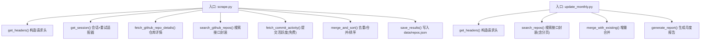
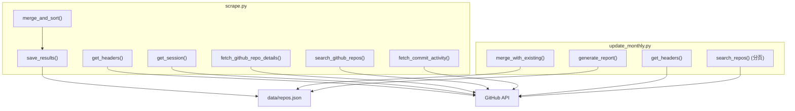
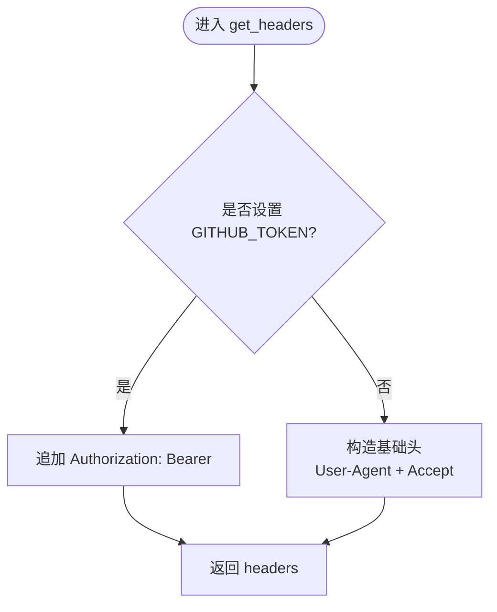
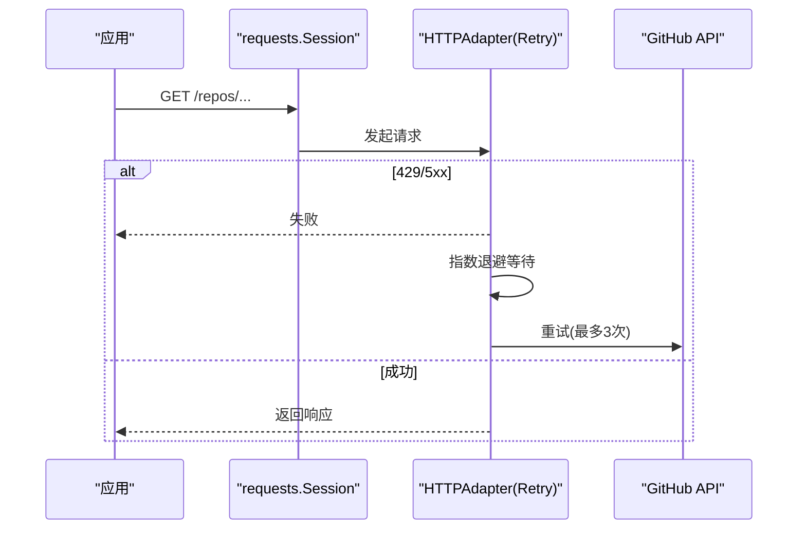
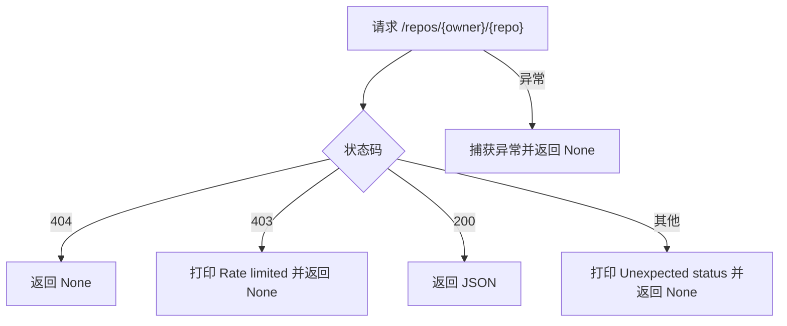
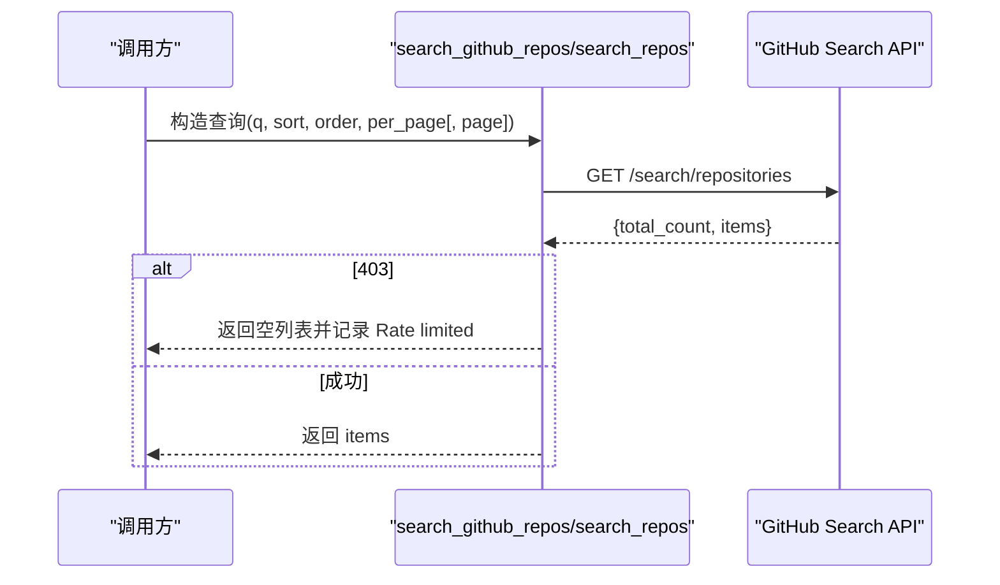
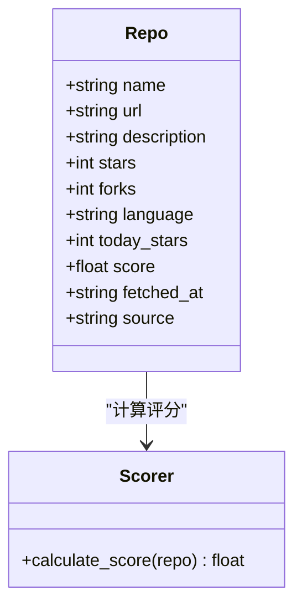
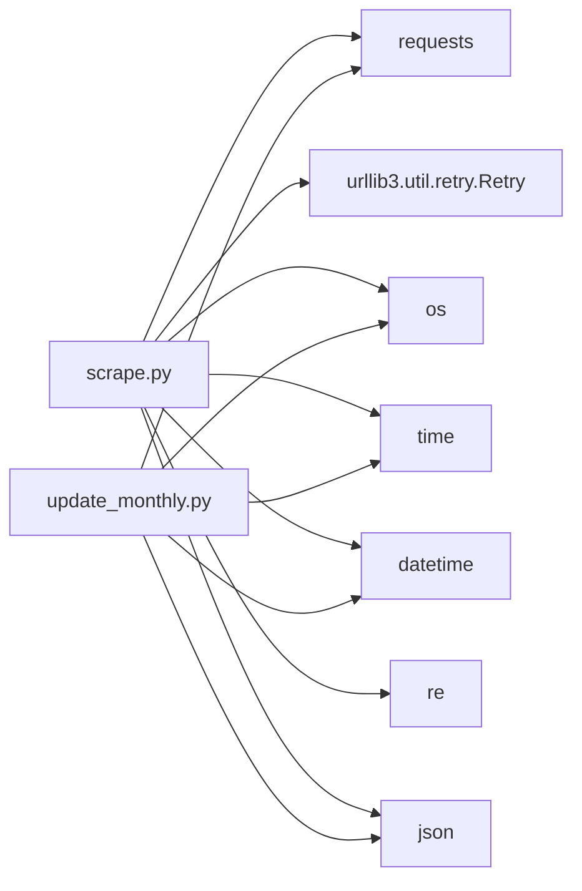

# GitHub API 集成

<cite>
**本文引用的文件**   
- [scripts/scrape.py](file://scripts/scrape.py)
- [scripts/update_monthly.py](file://scripts/update_monthly.py)
- [tests/test_scripts.py](file://tests/test_scripts.py)
- [README.md](file://README.md)
</cite>

## 目录
1. [简介](#简介)
2. [项目结构](#项目结构)
3. [核心组件](#核心组件)
4. [架构总览](#架构总览)
5. [详细组件分析](#详细组件分析)
6. [依赖关系分析](#依赖关系分析)
7. [性能与限流优化](#性能与限流优化)
8. [故障排除指南](#故障排除指南)
9. [结论](#结论)
10. [附录：最佳实践与示例路径](#附录最佳实践与示例路径)

## 简介
本技术文档聚焦于仓库中的 GitHub API 集成实现，系统性阐述认证机制、请求头配置、限流处理策略、仓库详情获取、搜索查询构建、分页处理、错误响应处理，以及 GITHUB_TOKEN 环境变量配置、速率限制检测与重试逻辑。同时提供复杂搜索查询、API 响应数据处理和并发请求的实现思路与参考路径，并给出最佳实践、性能优化技巧与故障排除指南。

## 项目结构
本项目包含两个主要的 Python 脚本用于数据抓取与更新：
- scripts/scrape.py：多源聚合爬虫（Awesome Lists、GitHub Search API、Hacker News、DEV.to），负责全量抓取、评分、合并与持久化。
- scripts/update_monthly.py：按月增量抓取新仓库，并与已有数据合并，生成月度报告。

图表来源
- [scripts/scrape.py:103-131](file://scripts/scrape.py#L103-L131)
- [scripts/scrape.py:172-191](file://scripts/scrape.py#L172-L191)
- [scripts/scrape.py:243-266](file://scripts/scrape.py#L243-L266)
- [scripts/scrape.py:133-147](file://scripts/scrape.py#L133-L147)
- [scripts/scrape.py:575-622](file://scripts/scrape.py#L575-L622)
- [scripts/scrape.py:625-649](file://scripts/scrape.py#L625-L649)
- [scripts/update_monthly.py:39-46](file://scripts/update_monthly.py#L39-L46)
- [scripts/update_monthly.py:49-76](file://scripts/update_monthly.py#L49-L76)
- [scripts/update_monthly.py:167-229](file://scripts/update_monthly.py#L167-L229)
- [scripts/update_monthly.py:252-323](file://scripts/update_monthly.py#L252-L323)

章节来源
- [README.md:123-148](file://README.md#L123-L148)

## 核心组件
本节从代码层面梳理与 GitHub API 集成的关键能力：

- 认证与请求头
  - 通过环境变量 GITHUB_TOKEN 注入 Authorization: Bearer <token>，提升速率上限至 5000/hour；未设置时默认 60/hour。
  - 统一使用 User-Agent 与 Accept 头，确保兼容 GitHub API v3 JSON 格式。

- 会话与重试
  - 基于 requests.Session + urllib3 Retry 的指数退避重试，针对 429/500/502/503/504 自动重试最多 3 次，间隔因子 1.0（1s, 2s, 4s）。

- 仓库详情获取
  - 调用 /repos/{owner}/{repo}，对 404/403 等状态码进行专门处理，返回 None 或解析后的 JSON。

- 搜索查询构建
  - 使用 /search/repositories，支持按语言、时间范围、stars 阈值、pushed/created 条件组合查询。
  - 在 scrape.py 中采用“主题词 + 年份”、“language:xxx”等多维度查询；update_monthly.py 支持 per_page/page 分页。

- 分页处理
  - update_monthly.py 显式传入 page 参数，循环翻页直至结果不足 per_page。
  - scrape.py 当前未实现分页，单次请求 per_page=25~30，适合小批量采集。

- 错误响应处理
  - 403 触发“Rate limited”提示与休眠；异常捕获后返回空列表或 None，避免中断整体流程。

- 数据模型与评分
  - 统一的 repo 字段 schema（name/url/description/stars/forks/language/today_stars/score/fetched_at/source），并提供 calculate_score 公式。

章节来源
- [scripts/scrape.py:22-26](file://scripts/scrape.py#L22-L26)
- [scripts/scrape.py:103-131](file://scripts/scrape.py#L103-L131)
- [scripts/scrape.py:172-191](file://scripts/scrape.py#L172-L191)
- [scripts/scrape.py:243-266](file://scripts/scrape.py#L243-L266)
- [scripts/update_monthly.py:39-46](file://scripts/update_monthly.py#L39-L46)
- [scripts/update_monthly.py:49-76](file://scripts/update_monthly.py#L49-L76)
- [scripts/scrape.py:546-559](file://scripts/scrape.py#L546-L559)
- [scripts/scrape.py:562-573](file://scripts/scrape.py#L562-L573)
- [scripts/update_monthly.py:154-165](file://scripts/update_monthly.py#L154-L165)

## 架构总览
下图展示了 GitHub API 集成在两个脚本中的职责划分与交互关系。

图表来源
- [scripts/scrape.py:103-131](file://scripts/scrape.py#L103-L131)
- [scripts/scrape.py:172-191](file://scripts/scrape.py#L172-L191)
- [scripts/scrape.py:243-266](file://scripts/scrape.py#L243-L266)
- [scripts/scrape.py:133-147](file://scripts/scrape.py#L133-L147)
- [scripts/scrape.py:575-622](file://scripts/scrape.py#L575-L622)
- [scripts/scrape.py:625-649](file://scripts/scrape.py#L625-L649)
- [scripts/update_monthly.py:39-46](file://scripts/update_monthly.py#L39-L46)
- [scripts/update_monthly.py:49-76](file://scripts/update_monthly.py#L49-L76)
- [scripts/update_monthly.py:167-229](file://scripts/update_monthly.py#L167-L229)
- [scripts/update_monthly.py:252-323](file://scripts/update_monthly.py#L252-L323)

## 详细组件分析

### 认证机制与请求头配置
- 环境变量读取：GITHUB_TOKEN = os.environ.get("GITHUB_TOKEN")
- 请求头构造：
  - 始终包含 User-Agent 与 Accept: application/vnd.github.v3+json
  - 若存在 token，则追加 Authorization: Bearer <token>
- 测试覆盖：无 token 时不包含 Authorization；有 token 时正确拼接 Bearer。

图表来源
- [scripts/scrape.py:103-111](file://scripts/scrape.py#L103-L111)
- [scripts/update_monthly.py:39-46](file://scripts/update_monthly.py#L39-L46)
- [tests/test_scripts.py:248-257](file://tests/test_scripts.py#L248-L257)

章节来源
- [scripts/scrape.py:22-26](file://scripts/scrape.py#L22-L26)
- [scripts/scrape.py:103-111](file://scripts/scrape.py#L103-L111)
- [scripts/update_monthly.py:24-26](file://scripts/update_monthly.py#L24-L26)
- [scripts/update_monthly.py:39-46](file://scripts/update_monthly.py#L39-L46)
- [tests/test_scripts.py:248-257](file://tests/test_scripts.py#L248-L257)

### 会话与重试（指数退避）
- 使用 requests.Session 复用连接。
- 通过 urllib3.util.retry.Retry 配置：
  - total=3，backoff_factor=1.0，status_forcelist=[429, 500, 502, 503, 504]，allowed_methods=["GET"]
  - 将 HTTPAdapter 挂载到 http/https 协议上。
- 测试验证：session.get_adapter("https://api.github.com").max_retries.total == 3。

图表来源
- [scripts/scrape.py:114-131](file://scripts/scrape.py#L114-L131)
- [tests/test_scripts.py:262-268](file://tests/test_scripts.py#L262-L268)

章节来源
- [scripts/scrape.py:114-131](file://scripts/scrape.py#L114-L131)
- [tests/test_scripts.py:262-268](file://tests/test_scripts.py#L262-L268)

### 仓库详情获取与错误处理
- 端点：/repos/{owner}/{repo}
- 状态码处理：
  - 404：返回 None（仓库不存在）
  - 403：打印 Rate limited 信息并返回 None
  - 200：返回 JSON
  - 其他：打印 Unexpected status 并返回 None
- 异常捕获：任何异常均返回 None，保证上层流程不中断。

图表来源
- [scripts/scrape.py:172-191](file://scripts/scrape.py#L172-L191)

章节来源
- [scripts/scrape.py:172-191](file://scripts/scrape.py#L172-L191)

### 搜索查询构建与分页处理
- 通用搜索函数：
  - scrape.py 的 search_github_repos：构造 q、sort、order、per_page，返回 items。
  - update_monthly.py 的 search_repos：增加 page 参数，支持分页；返回 total_count 与 items。
- 典型查询模式：
  - 主题词 + 年份：q="agent skills created:YYYY-01-01..YYYY-12-31 stars:>=N"
  - 语言筛选：q="language:python stars:>2000"
  - 趋势类：pushed:>{date} stars:>N、created:>{date} stars:>N、rising 区间 stars:100..2000
- 分页策略：
  - update_monthly.py 循环 page=1..N，当 len(items) < per_page 停止。
  - scrape.py 未实现分页，适合小规模采集。

图表来源
- [scripts/scrape.py:243-266](file://scripts/scrape.py#L243-L266)
- [scripts/update_monthly.py:49-76](file://scripts/update_monthly.py#L49-L76)

章节来源
- [scripts/scrape.py:243-266](file://scripts/scrape.py#L243-L266)
- [scripts/update_monthly.py:49-76](file://scripts/update_monthly.py#L49-L76)

### 复杂搜索查询示例（路径指引）
- 主题词 + 年份 + stars 阈值：参见 [scripts/scrape.py:243-266](file://scripts/scrape.py#L243-L266)
- 按语言筛选：参见 [scripts/scrape.py:286-295](file://scripts/scrape.py#L286-L295)
- 趋势类多维查询（hot-today/hot-week/new-month/new-quarter/rising）：参见 [scripts/scrape.py:354-360](file://scripts/scrape.py#L354-L360)
- 按月增量（多页）：参见 [scripts/update_monthly.py:93-103](file://scripts/update_monthly.py#L93-L103)

章节来源
- [scripts/scrape.py:243-266](file://scripts/scrape.py#L243-L266)
- [scripts/scrape.py:286-295](file://scripts/scrape.py#L286-L295)
- [scripts/scrape.py:354-360](file://scripts/scrape.py#L354-L360)
- [scripts/update_monthly.py:93-103](file://scripts/update_monthly.py#L93-L103)

### 并发请求（建议与扩展）
当前实现为串行请求，并通过 time.sleep 控制频率以避免触发限流。如需并发：
- 可引入 concurrent.futures.ThreadPoolExecutor 或 asyncio + aiohttp，结合令牌桶/信号量控制并发度。
- 注意：
  - 保持全局会话与会话级重试适配器的兼容性。
  - 对 429 进行更细粒度的退避（如解析 Retry-After 头）。
  - 对每个任务设置超时与最大重试次数，防止单个任务阻塞线程池。

[本节为概念性建议，不直接分析具体文件]

### 数据模型与评分算法
- 统一字段：name/url/description/stars/forks/language/today_stars/score/fetched_at/source
- 评分公式：score = stars + forks + (forks/stars)*1000 + today_stars*10 + commit_activity*2
- 去重合并：数值型字段取最大值，source 合并为有序集合字符串，fetched_at 取较新值。

图表来源
- [scripts/scrape.py:546-559](file://scripts/scrape.py#L546-L559)
- [scripts/scrape.py:562-573](file://scripts/scrape.py#L562-L573)
- [scripts/update_monthly.py:154-165](file://scripts/update_monthly.py#L154-L165)
- [scripts/scrape.py:575-622](file://scripts/scrape.py#L575-L622)

章节来源
- [scripts/scrape.py:546-559](file://scripts/scrape.py#L546-L559)
- [scripts/scrape.py:562-573](file://scripts/scrape.py#L562-L573)
- [scripts/update_monthly.py:154-165](file://scripts/update_monthly.py#L154-L165)
- [scripts/scrape.py:575-622](file://scripts/scrape.py#L575-L622)

## 依赖关系分析
- 外部依赖：requests、urllib3（Retry）、os、time、datetime、re、json
- 模块内依赖：
  - scrape.py：get_headers/get_session → fetch_github_repo_details/search_github_repos/fetch_commit_activity → merge_and_sort → save_results
  - update_monthly.py：get_headers → search_repos → merge_with_existing → generate_report

图表来源
- [scripts/scrape.py:1-21](file://scripts/scrape.py#L1-L21)
- [scripts/update_monthly.py:1-24](file://scripts/update_monthly.py#L1-L24)

章节来源
- [scripts/scrape.py:1-21](file://scripts/scrape.py#L1-L21)
- [scripts/update_monthly.py:1-24](file://scripts/update_monthly.py#L1-L24)

## 性能与限流优化
- 启用 GITHUB_TOKEN：显著提升速率上限（60→5000/hour），减少 403 概率。
- 指数退避重试：对 429/5xx 自动重试，降低瞬时抖动影响。
- 合理 per_page 与 sleep：
  - scrape.py 使用较小的 per_page（25~30）与固定 sleep（0.15~1s）控制频率。
  - update_monthly.py 每页之间 sleep（0.8~1s），避免突发流量。
- 可选增强：
  - 解析 429 响应中的 Retry-After 头，动态等待。
  - 使用令牌桶/滑动窗口限流器，平滑请求分布。
  - 对热门查询结果做本地缓存，减少重复请求。

[本节为通用指导，不直接分析具体文件]

## 故障排除指南
- 页面无法加载数据：需通过 HTTP 服务器访问，浏览器 file:// 协议下 fetch 被阻止。
- GitHub API 受限：
  - 检查是否设置 GITHUB_TOKEN。
  - 观察日志中的 “Rate limited” 提示，适当延长 sleep 或降低并发。
- 404/403 处理：
  - 404：仓库不存在，跳过。
  - 403：限流或权限问题，检查 token 有效性及配额。
- 网络异常：
  - 重试机制已内置，若仍失败，检查网络连通性与 DNS。

章节来源
- [README.md:166-171](file://README.md#L166-L171)
- [scripts/scrape.py:172-191](file://scripts/scrape.py#L172-L191)
- [scripts/scrape.py:254-266](file://scripts/scrape.py#L254-L266)
- [scripts/update_monthly.py:59-76](file://scripts/update_monthly.py#L59-L76)

## 结论
本项目在 GitHub API 集成方面实现了稳健的认证、请求头管理、指数退避重试、错误处理与数据合并。通过多维度搜索与分页策略，能够稳定地采集高质量仓库数据。建议在后续迭代中引入并发与更精细的限流控制，进一步提升吞吐与鲁棒性。

## 附录：最佳实践与示例路径
- 认证与环境变量
  - 设置 GITHUB_TOKEN 以提升速率上限：参见 [README.md:169-171](file://README.md#L169-L171)、[scripts/scrape.py:22-26](file://scripts/scrape.py#L22-L26)、[scripts/update_monthly.py:24-26](file://scripts/update_monthly.py#L24-L26)
- 请求头与重试
  - 构造请求头与重试适配器：参见 [scripts/scrape.py:103-131](file://scripts/scrape.py#L103-L131)、[scripts/update_monthly.py:39-46](file://scripts/update_monthly.py#L39-L46)
- 搜索与分页
  - 搜索封装与分页：参见 [scripts/scrape.py:243-266](file://scripts/scrape.py#L243-L266)、[scripts/update_monthly.py:49-76](file://scripts/update_monthly.py#L49-L76)
- 错误处理
  - 404/403 与异常捕获：参见 [scripts/scrape.py:172-191](file://scripts/scrape.py#L172-L191)、[scripts/scrape.py:254-266](file://scripts/scrape.py#L254-L266)、[scripts/update_monthly.py:59-76](file://scripts/update_monthly.py#L59-L76)
- 数据模型与评分
  - 统一字段与评分公式：参见 [scripts/scrape.py:546-573](file://scripts/scrape.py#L546-L573)、[scripts/update_monthly.py:154-165](file://scripts/update_monthly.py#L154-L165)
- 并发请求（扩展）
  - 建议使用 ThreadPoolExecutor/asyncio + aiohttp，并结合令牌桶限流与 Retry-After 解析。