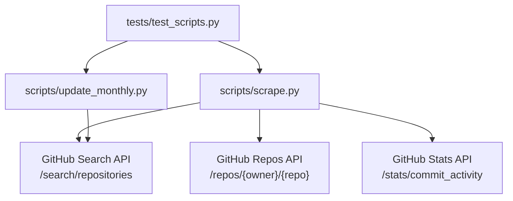
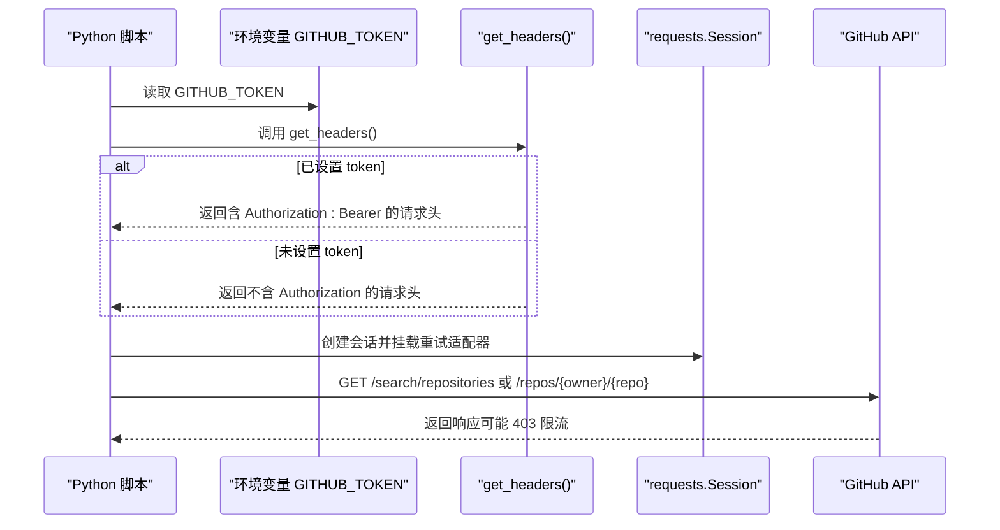
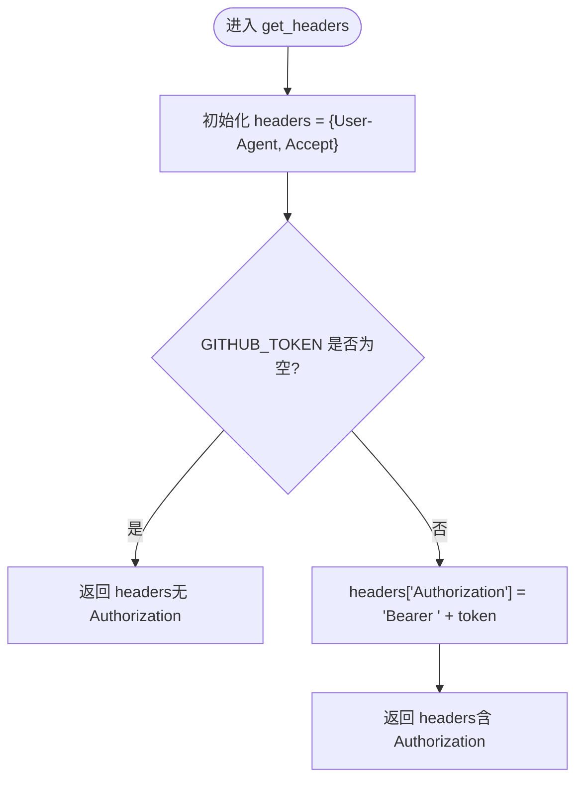
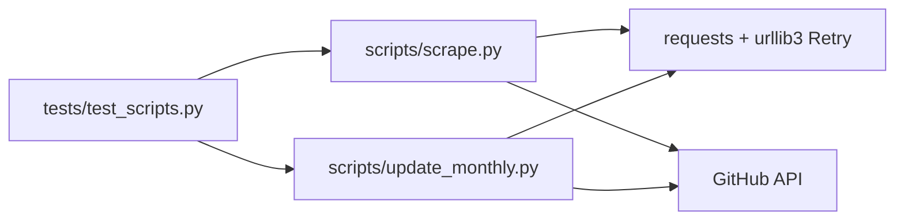

# GitHub 认证配置

<cite>
**本文引用的文件**   
- [scripts/scrape.py](file://scripts/scrape.py)
- [scripts/update_monthly.py](file://scripts/update_monthly.py)
- [tests/test_scripts.py](file://tests/test_scripts.py)
- [README.md](file://README.md)
</cite>

## 目录
1. [简介](#简介)
2. [项目结构](#项目结构)
3. [核心组件](#核心组件)
4. [架构总览](#架构总览)
5. [详细组件分析](#详细组件分析)
6. [依赖关系分析](#依赖关系分析)
7. [性能与配额说明](#性能与配额说明)
8. [故障排除指南](#故障排除指南)
9. [结论](#结论)

## 简介
本文件聚焦于仓库中 GitHub API 的认证配置，围绕以下目标展开：
- 环境变量 GITHUB_TOKEN 的设置方法与获取步骤
- get_headers() 函数如何构建请求头（User-Agent、Accept、Authorization Bearer）
- 未认证与认证两种模式下的速率限制差异（60 req/hour vs 5000 req/hour）
- 环境变量配置示例、错误处理逻辑与调试技巧
- 常见认证问题的排查清单

## 项目结构
与认证相关的代码集中在两个脚本中：
- scripts/scrape.py：多源聚合爬虫，统一通过 get_headers() 构造请求头并调用 GitHub API
- scripts/update_monthly.py：月度增量抓取，同样使用 get_headers() 注入认证信息
- tests/test_scripts.py：对 get_headers() 的行为进行断言式验证
- README.md：FAQ 中明确提示设置 GITHUB_TOKEN 可提升限额

图表来源
- [scripts/scrape.py:103-130](file://scripts/scrape.py#L103-L130)
- [scripts/update_monthly.py:39-46](file://scripts/update_monthly.py#L39-L46)
- [tests/test_scripts.py:246-267](file://tests/test_scripts.py#L246-L267)

章节来源
- [scripts/scrape.py:103-130](file://scripts/scrape.py#L103-L130)
- [scripts/update_monthly.py:39-46](file://scripts/update_monthly.py#L39-L46)
- [tests/test_scripts.py:246-267](file://tests/test_scripts.py#L246-L267)
- [README.md:169-170](file://README.md#L169-L170)

## 核心组件
- 环境变量读取
  - scrape.py 与 update_monthly.py 均从进程环境读取 GITHUB_TOKEN，作为可选认证凭据。
- 请求头构建
  - get_headers() 固定包含 User-Agent 与 Accept；当存在 GITHUB_TOKEN 时，追加 Authorization: Bearer <token>。
- 会话与重试
  - scrape.py 提供 get_session()，基于 requests.Session 挂载 HTTPAdapter，针对 429/5xx 指数退避重试。
- 限流提示
  - main() 启动时会打印是否检测到 GITHUB_TOKEN，并提示未认证的默认限额与认证后的高配额。

章节来源
- [scripts/scrape.py:22-23](file://scripts/scrape.py#L22-L23)
- [scripts/scrape.py:103-111](file://scripts/scrape.py#L103-L111)
- [scripts/scrape.py:114-130](file://scripts/scrape.py#L114-L130)
- [scripts/scrape.py:671-683](file://scripts/scrape.py#L671-L683)
- [scripts/update_monthly.py:24-25](file://scripts/update_monthly.py#L24-L25)
- [scripts/update_monthly.py:39-46](file://scripts/update_monthly.py#L39-L46)
- [scripts/update_monthly.py:340-345](file://scripts/update_monthly.py#L340-L345)

## 架构总览
下图展示了认证在请求链路中的位置：应用层读取环境变量 → 构建请求头 → 发起 HTTP 请求 → GitHub 服务端鉴权与限流。

图表来源
- [scripts/scrape.py:22-23](file://scripts/scrape.py#L22-L23)
- [scripts/scrape.py:103-111](file://scripts/scrape.py#L103-L111)
- [scripts/scrape.py:114-130](file://scripts/scrape.py#L114-L130)
- [scripts/scrape.py:172-190](file://scripts/scrape.py#L172-L190)
- [scripts/update_monthly.py:24-25](file://scripts/update_monthly.py#L24-L25)
- [scripts/update_monthly.py:39-46](file://scripts/update_monthly.py#L39-L46)

## 详细组件分析

### 环境变量 GITHUB_TOKEN
- 读取位置
  - scrape.py 模块级变量从 os.environ.get("GITHUB_TOKEN") 获取
  - update_monthly.py 同理
- 作用范围
  - 仅影响当前进程；若以 CI 运行，需在对应 workflow 的 secrets 或 env 中注入
- 安全建议
  - 不要将 token 硬编码进源码或提交到版本库
  - 优先使用 CI 平台的 Secrets 管理（如 GitHub Actions Secrets）
  - 最小权限原则：仅授予必要权限（通常 Public Repo 访问即可）

章节来源
- [scripts/scrape.py:22-23](file://scripts/scrape.py#L22-L23)
- [scripts/update_monthly.py:24-25](file://scripts/update_monthly.py#L24-L25)

### get_headers() 构建请求头
- 固定头部
  - User-Agent：标识客户端（repo-hoarder）
  - Accept：指定 GitHub v3 JSON 格式
- 条件头部
  - 当 GITHUB_TOKEN 非空时，追加 Authorization: Bearer <token>
- 测试覆盖
  - 无 token 时不应包含 Authorization
  - 有 token 时应包含正确的 Bearer 前缀

图表来源
- [scripts/scrape.py:103-111](file://scripts/scrape.py#L103-L111)
- [scripts/update_monthly.py:39-46](file://scripts/update_monthly.py#L39-L46)
- [tests/test_scripts.py:246-257](file://tests/test_scripts.py#L246-L257)

章节来源
- [scripts/scrape.py:103-111](file://scripts/scrape.py#L103-L111)
- [scripts/update_monthly.py:39-46](file://scripts/update_monthly.py#L39-L46)
- [tests/test_scripts.py:246-257](file://tests/test_scripts.py#L246-L257)

### 会话与重试策略（scrape.py）
- 使用 requests.Session 复用连接
- 为 http/https 挂载 HTTPAdapter，启用 Retry：
  - 状态码：429、500、502、503、504
  - 最大重试次数：3
  - 退避因子：1.0（约 1s、2s、4s）
- 适用场景：提高对瞬时错误的鲁棒性，避免频繁触发限流导致失败

章节来源
- [scripts/scrape.py:114-130](file://scripts/scrape.py#L114-L130)
- [tests/test_scripts.py:260-267](file://tests/test_scripts.py#L260-L267)

### 限流与错误处理
- 未认证模式
  - 默认限额：60 次/小时
  - 触发 403 时，脚本会打印“Rate limited”并返回空结果或跳过
- 认证模式
  - 限额提升至：5000 次/小时
  - 启动时会输出提示信息，便于确认是否生效
- 典型错误路径
  - 403：解析 message 字段并打印，随后返回 None 或空列表
  - 其他异常：捕获并打印错误信息，保证流程不中断

章节来源
- [scripts/scrape.py:172-190](file://scripts/scrape.py#L172-L190)
- [scripts/scrape.py:254-265](file://scripts/scrape.py#L254-L265)
- [scripts/scrape.py:671-683](file://scripts/scrape.py#L671-L683)
- [scripts/update_monthly.py:59-75](file://scripts/update_monthly.py#L59-L75)
- [scripts/update_monthly.py:340-345](file://scripts/update_monthly.py#L340-L345)
- [README.md:169-170](file://README.md#L169-L170)

## 依赖关系分析
- 模块内依赖
  - scrape.py 与 update_monthly.py 都依赖 requests 及其重试机制
  - 两者共享相同的认证策略：通过环境变量注入 Authorization
- 外部服务
  - GitHub Search API、Repos API、Stats API
- 测试依赖
  - tests/test_scripts.py 直接导入两个脚本模块，对 get_headers() 行为做断言

图表来源
- [tests/test_scripts.py:1-16](file://tests/test_scripts.py#L1-L16)
- [scripts/scrape.py:14-20](file://scripts/scrape.py#L14-L20)
- [scripts/update_monthly.py:19-23](file://scripts/update_monthly.py#L19-L23)

章节来源
- [tests/test_scripts.py:1-16](file://tests/test_scripts.py#L1-L16)
- [scripts/scrape.py:14-20](file://scripts/scrape.py#L14-L20)
- [scripts/update_monthly.py:19-23](file://scripts/update_monthly.py#L19-L23)

## 性能与配额说明
- 未认证
  - 限额：60 次/小时
  - 适合低频本地调试或小规模数据更新
- 认证
  - 限额：5000 次/小时
  - 适合批量抓取、定时任务与自动化流水线
- 建议
  - 在 CI 中使用 Secrets 注入 GITHUB_TOKEN
  - 合理分页与间隔（脚本已内置 sleep），避免短时间内集中请求
  - 利用重试与退避降低瞬时失败概率

章节来源
- [scripts/scrape.py:671-683](file://scripts/scrape.py#L671-L683)
- [scripts/update_monthly.py:340-345](file://scripts/update_monthly.py#L340-L345)
- [README.md:169-170](file://README.md#L169-L170)

## 故障排除指南

- 现象：出现 403 Rate limited
  - 检查是否设置了 GITHUB_TOKEN
  - 确认 token 有效且未被撤销
  - 观察日志中是否打印了“Rate limited”消息
  - 适当增加请求间隔，等待配额恢复
  - 参考：[scripts/scrape.py:172-190](file://scripts/scrape.py#L172-L190)、[scripts/scrape.py:254-265](file://scripts/scrape.py#L254-L265)

- 现象：请求头缺少 Authorization
  - 确认环境变量名正确为 GITHUB_TOKEN（大小写敏感）
  - 确认在运行脚本的进程中该变量已导出
  - 参考：[scripts/scrape.py:22-23](file://scripts/scrape.py#L22-L23)、[scripts/update_monthly.py:24-25](file://scripts/update_monthly.py#L24-L25)

- 现象：CI 中仍被限流
  - 检查工作流是否注入了 Secrets（例如 ${{ secrets.GITHUB_TOKEN }} 或自定义 Secret）
  - 确认工作流 job 的环境变量是否正确传递到 Python 进程
  - 参考：[README.md:169-170](file://README.md#L169-L170)

- 现象：本地调试无法加载数据
  - 通过 HTTP 服务器访问页面（浏览器禁止 file:// 协议下的 fetch）
  - 参考：[README.md:166-167](file://README.md#L166-L167)

- 调试技巧
  - 在调用 get_headers() 前后打印 headers 内容，确认 Authorization 是否存在
  - 临时增大日志输出，记录每次请求的 URL、状态码与耗时
  - 使用 pytest 快速验证 get_headers() 行为（见测试用例）
  - 参考：[tests/test_scripts.py:246-257](file://tests/test_scripts.py#L246-L257)

## 结论
- 本项目通过统一的 get_headers() 实现认证注入，确保所有 GitHub API 调用具备一致的鉴权策略
- 未认证与认证模式的配额差异显著，建议在自动化与批量场景中始终启用 GITHUB_TOKEN
- 完善的错误处理与重试机制提升了稳定性；结合合理的请求间隔与 CI Secrets 管理，可获得更可靠的运行体验