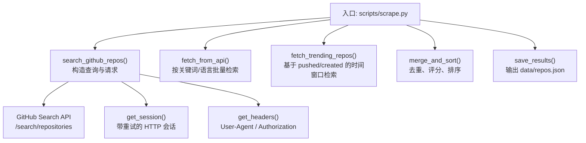
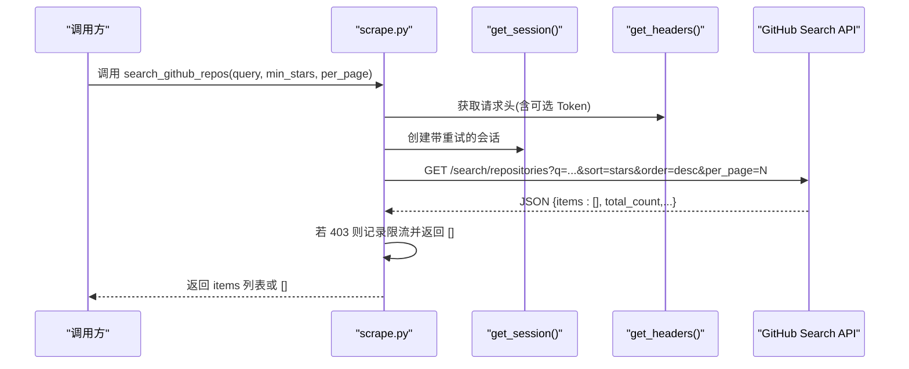
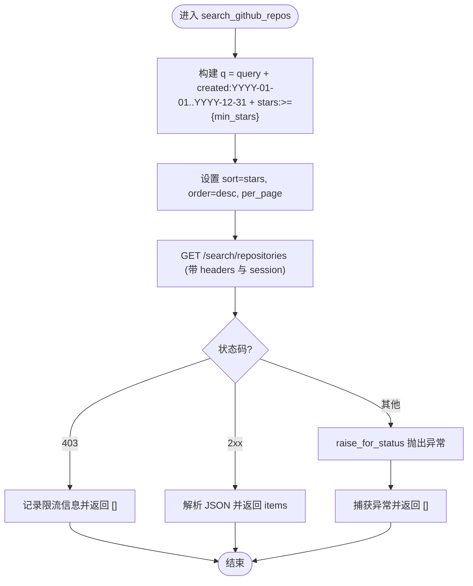
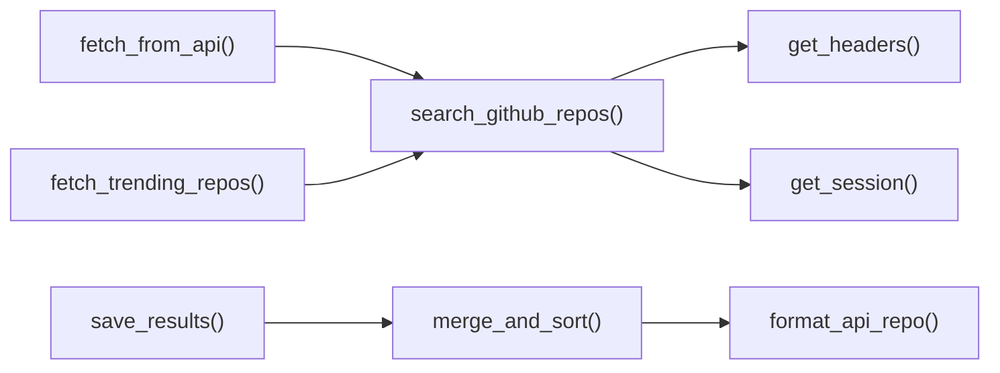

# 仓库搜索 API

<cite>
**本文引用的文件**
- [scripts/scrape.py](file://scripts/scrape.py)
- [tests/test_scripts.py](file://tests/test_scripts.py)
</cite>

## 目录
1. [简介](#简介)
2. [项目结构](#项目结构)
3. [核心组件](#核心组件)
4. [架构总览](#架构总览)
5. [详细组件分析](#详细组件分析)
6. [依赖关系分析](#依赖关系分析)
7. [性能与限制](#性能与限制)
8. [故障排查指南](#故障排查指南)
9. [结论](#结论)
10. [附录：查询语法与示例](#附录查询语法与示例)

## 简介
本技术文档聚焦于 GitHub 仓库搜索 API 的调用实现，重点解析 search_github_repos() 函数在仓库聚合脚本中的使用方式。内容涵盖：
- 搜索查询字符串的构建（语言过滤、时间范围、星标数量等）
- 分页参数 per_page 的配置与限制
- 排序参数 sort 与 order 的使用
- 搜索结果数据处理与错误响应处理的最佳实践
- 结合仓库实际代码给出可复用的查询示例路径

## 项目结构
仓库采用“脚本驱动 + 前端静态展示”的结构。与仓库搜索 API 直接相关的核心逻辑位于 Python 脚本中，负责从多个数据源采集并合并高质量仓库信息，其中 GitHub Search API 是重要来源之一。

图表来源
- [scripts/scrape.py:242-266](file://scripts/scrape.py#L242-L266)
- [scripts/scrape.py:114-131](file://scripts/scrape.py#L114-L131)
- [scripts/scrape.py:103-111](file://scripts/scrape.py#L103-L111)
- [scripts/scrape.py:268-298](file://scripts/scrape.py#L268-L298)
- [scripts/scrape.py:336-402](file://scripts/scrape.py#L336-L402)
- [scripts/scrape.py:575-622](file://scripts/scrape.py#L575-L622)
- [scripts/scrape.py:625-649](file://scripts/scrape.py#L625-L649)

章节来源
- [scripts/scrape.py:1-717](file://scripts/scrape.py#L1-L717)

## 核心组件
- search_github_repos(query, min_stars=1000, per_page=30)
  - 职责：根据传入 query 与筛选条件，向 GitHub Search API 发起 GET 请求，返回 items 列表。
  - 关键行为：
    - 自动拼接年份时间窗 created:YYYY-01-01..YYYY-12-31
    - 追加 stars:>={min_stars} 条件
    - 设置 sort=stars, order=desc, per_page=per_page
    - 通过 get_session() 发送请求，统一超时与重试策略
    - 对 403 限流进行友好处理并返回空结果
    - 其他异常捕获后返回空结果，避免中断整体流程

- fetch_from_api()
  - 职责：组合多组关键词与语言维度，循环调用 search_github_repos()，并对结果做去重与格式化。

- fetch_trending_repos()
  - 职责：基于 pushed/created 时间窗口与 stars 区间，构造“趋势类”查询，进一步丰富候选集。

- get_session() 与 get_headers()
  - 职责：提供带指数退避重试的 requests.Session；组装 User-Agent 与可选的 Authorization 头。

章节来源
- [scripts/scrape.py:242-266](file://scripts/scrape.py#L242-L266)
- [scripts/scrape.py:268-298](file://scripts/scrape.py#L268-L298)
- [scripts/scrape.py:336-402](file://scripts/scrape.py#L336-L402)
- [scripts/scrape.py:114-131](file://scripts/scrape.py#L114-L131)
- [scripts/scrape.py:103-111](file://scripts/scrape.py#L103-L111)

## 架构总览
下图展示了 search_github_repos() 在整体抓取流程中的位置与交互关系。

图表来源
- [scripts/scrape.py:242-266](file://scripts/scrape.py#L242-L266)
- [scripts/scrape.py:114-131](file://scripts/scrape.py#L114-L131)
- [scripts/scrape.py:103-111](file://scripts/scrape.py#L103-L111)

## 详细组件分析

### search_github_repos() 实现要点
- 查询字符串构建
  - 基础语法：将传入的 query 与年份时间窗 created:YYYY-01-01..YYYY-12-31 以及 stars:>={min_stars} 拼接为最终 q 参数。
  - 这意味着所有调用都会限定在当前年份且满足最低星标数。
- 分页与排序
  - sort=stars, order=desc：按星标降序排列。
  - per_page：默认 30，可在调用处调整（例如 trending 场景使用 25）。
- 网络与容错
  - 使用 get_session() 提供的带重试适配器，针对 429/5xx 自动重试。
  - 对 403 限流进行专门处理：打印消息、短暂休眠后返回空列表，避免阻塞主流程。
  - 其他异常均被捕获并返回空列表，保证健壮性。

图表来源
- [scripts/scrape.py:242-266](file://scripts/scrape.py#L242-L266)

章节来源
- [scripts/scrape.py:242-266](file://scripts/scrape.py#L242-L266)

### 调用方用法与查询模式
- 关键词检索
  - 示例路径：fetch_from_api() 中对 agent/AI 相关关键词的循环调用，设置较低的 min_stars 以扩大覆盖面。
- 语言维度检索
  - 示例路径：fetch_from_api() 中遍历 LANGUAGES 前缀，构造 language:{lang} 查询，并提高 min_stars 阈值。
- 趋势类检索
  - 示例路径：fetch_trending_repos() 中使用 pushed:/created: 时间窗口与 stars 区间组合，per_page 调整为 25。

章节来源
- [scripts/scrape.py:268-298](file://scripts/scrape.py#L268-L298)
- [scripts/scrape.py:336-402](file://scripts/scrape.py#L336-L402)

### 搜索结果数据处理
- 去重与格式化
  - 调用方在收集结果时，依据 full_name 去重，并通过 format_api_repo() 标准化字段。
- 合并与评分
  - merge_and_sort() 对多来源数据进行字段级取最大值合并，计算综合评分并按分降序排序。
- 持久化
  - save_results() 将最终结果写入 data/repos.json，包含元信息与统计。

章节来源
- [scripts/scrape.py:268-298](file://scripts/scrape.py#L268-L298)
- [scripts/scrape.py:546-559](file://scripts/scrape.py#L546-L559)
- [scripts/scrape.py:575-622](file://scripts/scrape.py#L575-L622)
- [scripts/scrape.py:625-649](file://scripts/scrape.py#L625-L649)

### 错误响应处理最佳实践
- 限流处理
  - 当收到 403 时，记录 message 并休眠后返回空列表，避免影响后续任务。
- 通用异常
  - 捕获网络或解析异常，返回空列表，确保上层流程继续执行。
- 幂等与重试
  - 通过 Retry 适配器对 429/5xx 进行指数退避重试，降低瞬时失败概率。

章节来源
- [scripts/scrape.py:242-266](file://scripts/scrape.py#L242-L266)
- [scripts/scrape.py:114-131](file://scripts/scrape.py#L114-L131)

## 依赖关系分析
- 模块内依赖
  - search_github_repos() 依赖 get_session() 与 get_headers()。
  - fetch_from_api() 与 fetch_trending_repos() 依赖 search_github_repos()。
  - 结果处理依赖 format_api_repo()、merge_and_sort()、save_results()。
- 外部依赖
  - requests 库用于 HTTP 请求与重试适配。
  - urllib3.util.retry 提供重试策略。
  - datetime/timedelta 用于日期与时间窗计算。

图表来源
- [scripts/scrape.py:242-266](file://scripts/scrape.py#L242-L266)
- [scripts/scrape.py:103-111](file://scripts/scrape.py#L103-L111)
- [scripts/scrape.py:114-131](file://scripts/scrape.py#L114-L131)
- [scripts/scrape.py:268-298](file://scripts/scrape.py#L268-L298)
- [scripts/scrape.py:336-402](file://scripts/scrape.py#L336-L402)
- [scripts/scrape.py:546-559](file://scripts/scrape.py#L546-L559)
- [scripts/scrape.py:575-622](file://scripts/scrape.py#L575-L622)
- [scripts/scrape.py:625-649](file://scripts/scrape.py#L625-L649)

章节来源
- [scripts/scrape.py:1-717](file://scripts/scrape.py#L1-L717)

## 性能与限制
- 速率限制
  - 未配置 GITHUB_TOKEN 时，默认 60 次/小时；配置后可提升至 5000 次/小时。
- 分页限制
  - per_page 最大支持 100。当前实现默认 30，趋势场景使用 25，均未超过上限。
- 排序与顺序
  - 固定使用 sort=stars, order=desc，便于快速定位高星仓库。
- 重试与退避
  - 对 429/5xx 启用最多 3 次重试，退避因子 1.0（1s、2s、4s），有助于缓解瞬时抖动。
- 时间窗约束
  - 所有 search_github_repos() 调用均附加当年 created 时间窗，可能遗漏历史仓库，需按需调整。

章节来源
- [README.md:169-171](file://README.md#L169-L171)
- [scripts/scrape.py:242-266](file://scripts/scrape.py#L242-L266)
- [scripts/scrape.py:114-131](file://scripts/scrape.py#L114-L131)

## 故障排查指南
- 常见问题
  - 页面加载失败：需通过本地 HTTP 服务访问，浏览器禁止 file:// 协议下的 fetch。
  - 触发速率限制：设置 GITHUB_TOKEN 环境变量提升配额。
- 定位建议
  - 检查日志中的限流提示与异常信息。
  - 确认 per_page 与 sort/order 是否符合预期。
  - 验证时间窗是否过窄导致结果为空。

章节来源
- [README.md:166-171](file://README.md#L166-L171)
- [scripts/scrape.py:242-266](file://scripts/scrape.py#L242-L266)

## 结论
search_github_repos() 提供了简洁而健壮的 GitHub 仓库搜索封装，结合年份时间窗与星标下限，能够快速定位热门新仓库。配合 fetch_from_api() 与 fetch_trending_repos() 的多维查询策略，以及统一的错误处理与重试机制，整个采集链路具备较好的鲁棒性与可扩展性。建议在需要更广泛覆盖的场景下，灵活调整 per_page、时间窗与 min_stars，并结合 GITHUB_TOKEN 提升配额。

## 附录：查询语法与示例
以下示例均基于仓库实际调用方式，可直接参考对应行号进行复用或扩展。

- 语言过滤
  - 示例路径：[scripts/scrape.py:287-295](file://scripts/scrape.py#L287-L295)
  - 说明：language:{lang} 与 min_stars 组合，适合按语言筛选高星仓库。
- 时间范围（当年）
  - 示例路径：[scripts/scrape.py:242-266](file://scripts/scrape.py#L242-L266)
  - 说明：自动拼接 created:YYYY-01-01..YYYY-12-31，限定当年创建仓库。
- 时间范围（近期推送/创建）
  - 示例路径：[scripts/scrape.py:354-360](file://scripts/scrape.py#L354-L360)
  - 说明：pushed:>{date} 与 created:>{date} 组合，用于趋势与新兴仓库发现。
- 星标数量
  - 示例路径：[scripts/scrape.py:242-266](file://scripts/scrape.py#L242-L266)、[scripts/scrape.py:354-360](file://scripts/scrape.py#L354-L360)
  - 说明：stars:>={min_stars} 或 stars:A..B 区间，控制质量门槛。
- 排序与分页
  - 示例路径：[scripts/scrape.py:242-266](file://scripts/scrape.py#L242-L266)、[scripts/scrape.py:362-365](file://scripts/scrape.py#L362-L365)
  - 说明：sort=stars, order=desc；per_page 默认 30，趋势场景使用 25。
- 高级组合（示例）
  - 示例路径：[scripts/scrape.py:354-360](file://scripts/scrape.py#L354-L360)
  - 说明：pushed:>{date} + stars:100..2000 捕捉上升期仓库；created:>{date} + stars:>N 捕捉新近高星仓库。

章节来源
- [scripts/scrape.py:242-266](file://scripts/scrape.py#L242-L266)
- [scripts/scrape.py:287-295](file://scripts/scrape.py#L287-L295)
- [scripts/scrape.py:354-365](file://scripts/scrape.py#L354-L365)