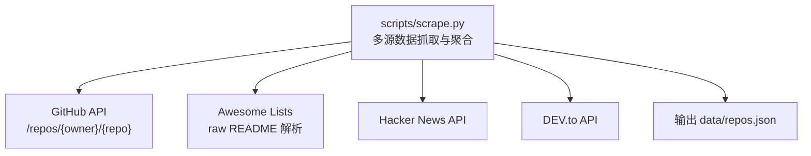
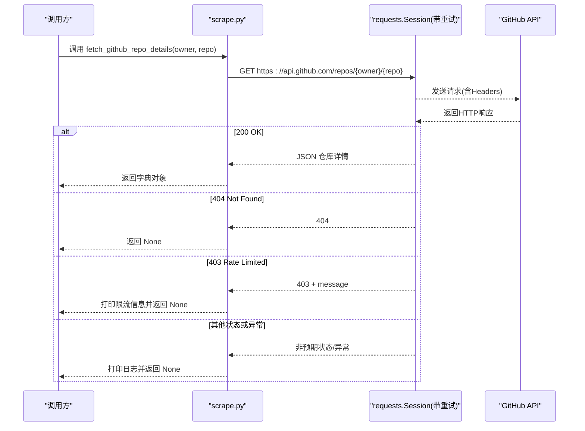
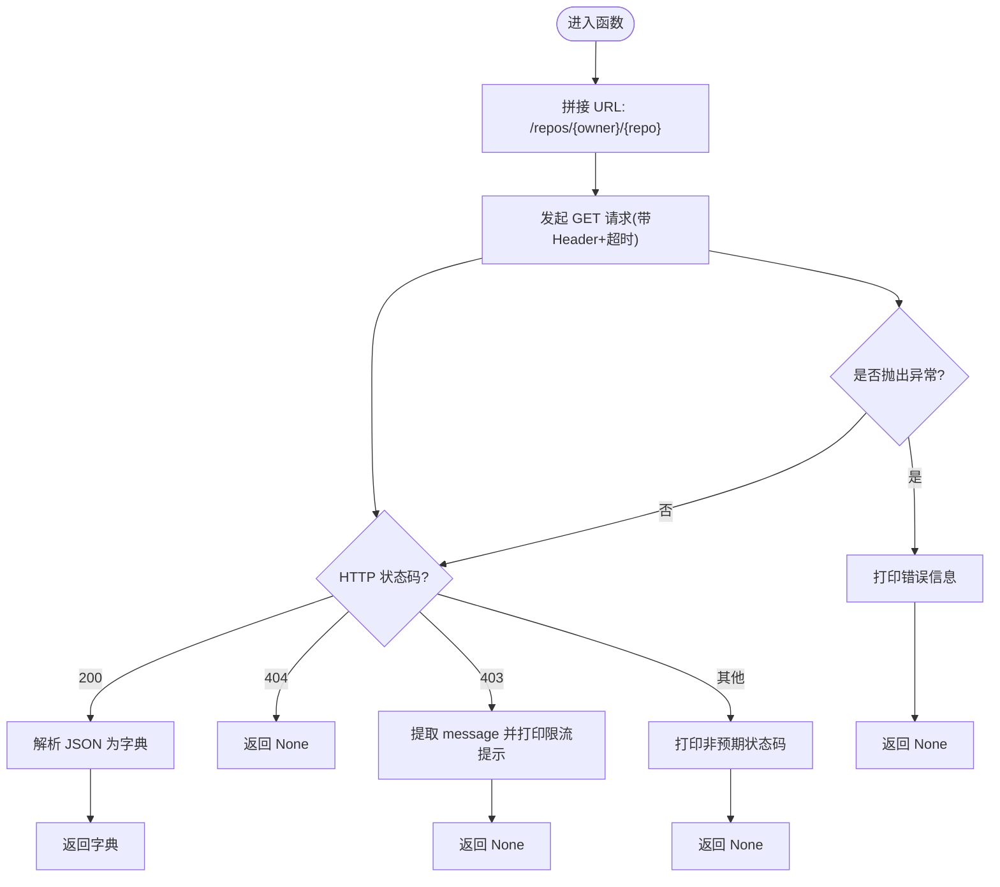
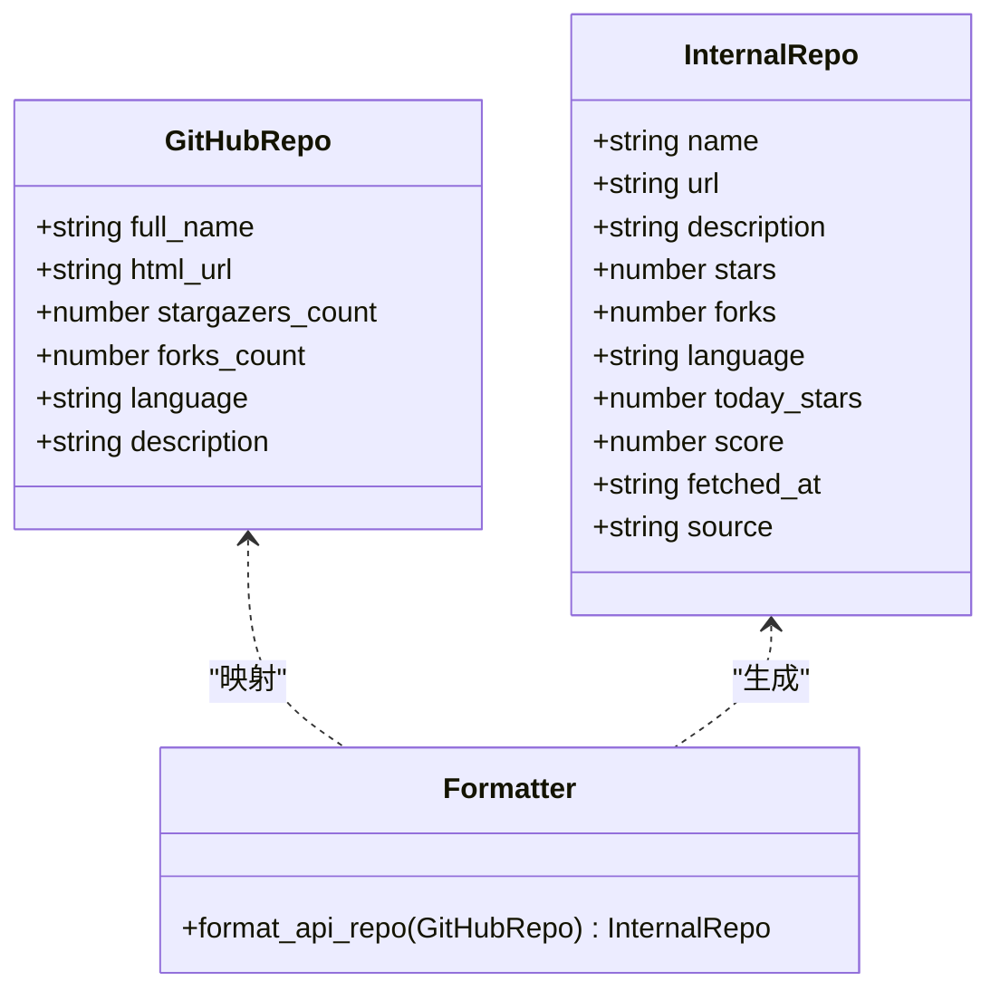
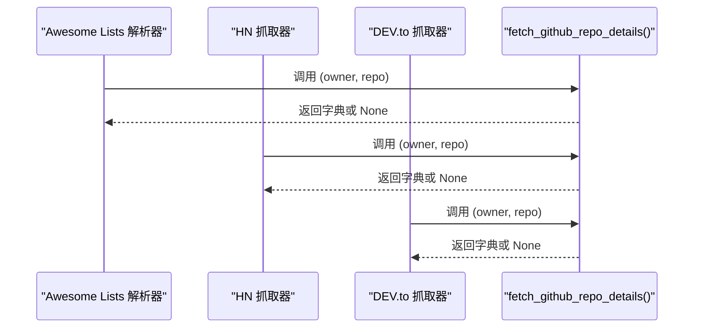
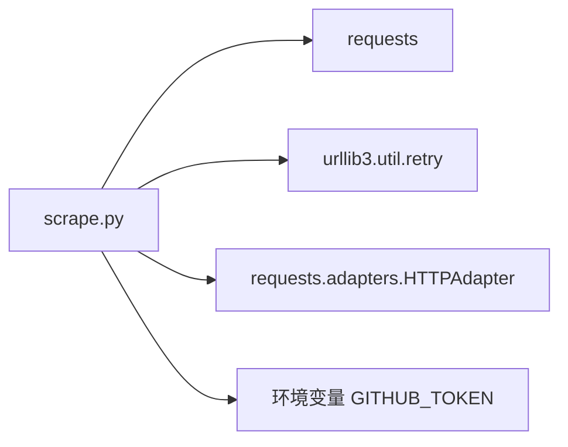

# 仓库详情获取 API

<cite>
**本文引用的文件**
- [scripts/scrape.py](file://scripts/scrape.py)
- [tests/test_scripts.py](file://tests/test_scripts.py)
- [README.md](file://README.md)
- [requirements.txt](file://requirements.txt)
</cite>

## 目录
1. [简介](#简介)
2. [项目结构](#项目结构)
3. [核心组件](#核心组件)
4. [架构总览](#架构总览)
5. [详细组件分析](#详细组件分析)
6. [依赖关系分析](#依赖关系分析)
7. [性能与重试策略](#性能与重试策略)
8. [故障排查指南](#故障排查指南)
9. [结论](#结论)
10. [附录：调用示例与最佳实践](#附录调用示例与最佳实践)

## 简介
本技术文档聚焦于“仓库详情获取 API”的实现与使用，围绕函数 fetch_github_repo_details() 展开，详细说明其如何调用 GitHub RESTful API 端点 /repos/{owner}/{repo}，如何处理 HTTP 状态码（404、403、200），以及响应数据的格式转换与异常处理机制。同时提供调用方式、JSON 解析要点、错误处理建议、性能优化与重试策略等实用指导。

## 项目结构
该仓库采用脚本驱动的数据聚合方案，核心爬虫逻辑位于 scripts/scrape.py；测试用例位于 tests/；前端静态资源在 web/；说明与清单在根目录。

图表来源
- [scripts/scrape.py:172-190](file://scripts/scrape.py#L172-L190)
- [scripts/scrape.py:193-240](file://scripts/scrape.py#L193-L240)
- [scripts/scrape.py:405-461](file://scripts/scrape.py#L405-L461)
- [scripts/scrape.py:464-528](file://scripts/scrape.py#L464-L528)
- [scripts/scrape.py:625-649](file://scripts/scrape.py#L625-L649)

章节来源
- [README.md:123-148](file://README.md#L123-L148)
- [scripts/scrape.py:1-21](file://scripts/scrape.py#L1-L21)

## 核心组件
- get_headers(): 构建请求头，支持可选的 GITHUB_TOKEN 提升速率限制。
- get_session(): 创建带重试与指数退避的 requests.Session，适配 429/5xx 场景。
- fetch_github_repo_details(owner, repo): 调用 GitHub REST API 获取仓库详情，统一处理 404/403/200 及异常。
- format_api_repo(r): 将 GitHub API 返回的仓库对象转换为内部统一 schema。
- merge_and_sort()/save_results(): 合并多源结果并持久化到 data/repos.json。

章节来源
- [scripts/scrape.py:103-130](file://scripts/scrape.py#L103-L130)
- [scripts/scrape.py:172-190](file://scripts/scrape.py#L172-L190)
- [scripts/scrape.py:546-559](file://scripts/scrape.py#L546-L559)
- [scripts/scrape.py:575-622](file://scripts/scrape.py#L575-L622)
- [scripts/scrape.py:625-649](file://scripts/scrape.py#L625-L649)

## 架构总览
下图展示了 fetch_github_repo_details() 在整体抓取流程中的位置与交互关系。

图表来源
- [scripts/scrape.py:172-190](file://scripts/scrape.py#L172-L190)
- [scripts/scrape.py:114-130](file://scripts/scrape.py#L114-L130)
- [scripts/scrape.py:103-111](file://scripts/scrape.py#L103-L111)

## 详细组件分析

### fetch_github_repo_details() 实现原理
- 目标端点：https://api.github.com/repos/{owner}/{repo}
- 请求头：通过 get_headers() 注入 User-Agent、Accept 与可选 Authorization（GITHUB_TOKEN）
- 会话与超时：通过 get_session() 复用连接并启用重试；设置合理超时避免阻塞
- 状态码处理：
  - 200：解析 JSON 并返回字典
  - 404：返回 None（仓库不存在）
  - 403：读取响应体 message 字段并打印限流提示，返回 None
  - 其他：打印非预期状态码并返回 None
- 异常处理：捕获网络/解析异常，打印错误并返回 None，保证上层流程稳定

图表来源
- [scripts/scrape.py:172-190](file://scripts/scrape.py#L172-L190)
- [scripts/scrape.py:103-111](file://scripts/scrape.py#L103-L111)
- [scripts/scrape.py:114-130](file://scripts/scrape.py#L114-L130)

章节来源
- [scripts/scrape.py:172-190](file://scripts/scrape.py#L172-L190)

### 响应数据格式转换与内部 Schema
- 输入：GitHub API 返回的仓库对象（包含 full_name、html_url、stargazers_count、forks_count、language、description 等）
- 输出：内部统一 schema，字段包括 name、url、description、stars、forks、language、today_stars、score、fetched_at、source
- 转换函数：format_api_repo() 负责映射与补齐默认值（如 description 为空时填充“暂无描述”，language 缺失时填充“Unknown”）

图表来源
- [scripts/scrape.py:546-559](file://scripts/scrape.py#L546-L559)

章节来源
- [scripts/scrape.py:546-559](file://scripts/scrape.py#L546-L559)

### 调用方集成与使用模式
- Awesome Lists 流程：解析 README 中的仓库链接后，逐个调用 fetch_github_repo_details() 补全详情，再经 format_api_repo() 转为内部 schema
- Hacker News 流程：从 HN 文章链接中抽取 owner/repo，调用 fetch_github_repo_details() 获取详情并补充描述
- DEV.to 流程：从标签与正文中提取 GitHub 链接，调用 fetch_github_repo_details() 获取详情并标注来源

图表来源
- [scripts/scrape.py:193-240](file://scripts/scrape.py#L193-L240)
- [scripts/scrape.py:405-461](file://scripts/scrape.py#L405-L461)
- [scripts/scrape.py:464-528](file://scripts/scrape.py#L464-L528)

章节来源
- [scripts/scrape.py:193-240](file://scripts/scrape.py#L193-L240)
- [scripts/scrape.py:405-461](file://scripts/scrape.py#L405-L461)
- [scripts/scrape.py:464-528](file://scripts/scrape.py#L464-L528)

## 依赖关系分析
- 外部库：requests（用于 HTTP 请求）、urllib3.util.retry（重试策略）、requests.adapters.HTTPAdapter（适配器挂载）
- 环境变量：GITHUB_TOKEN（提升速率限制）
- 模块内依赖：get_headers()、get_session() 被 fetch_github_repo_details() 复用

图表来源
- [scripts/scrape.py:14-20](file://scripts/scrape.py#L14-L20)
- [scripts/scrape.py:103-130](file://scripts/scrape.py#L103-L130)
- [requirements.txt:1](file://requirements.txt#L1)

章节来源
- [scripts/scrape.py:14-20](file://scripts/scrape.py#L14-L20)
- [scripts/scrape.py:103-130](file://scripts/scrape.py#L103-L130)
- [requirements.txt:1](file://requirements.txt#L1)

## 性能与重试策略
- 连接复用：通过 requests.Session 复用 TCP 连接，减少握手开销
- 自动重试：对 429/500/502/503/504 进行最多 3 次重试，退避因子 1.0（间隔约 1s、2s、4s）
- 速率控制：在批量抓取处插入 time.sleep()，降低瞬时并发，避免触发限流
- 超时保护：为各请求设置合理 timeout，防止长时间阻塞
- Token 提升限额：配置 GITHUB_TOKEN 可将速率限制从 60 提升至 5000 次/小时

章节来源
- [scripts/scrape.py:114-130](file://scripts/scrape.py#L114-L130)
- [scripts/scrape.py:215-237](file://scripts/scrape.py#L215-L237)
- [scripts/scrape.py:452-454](file://scripts/scrape.py#L452-L454)
- [scripts/scrape.py:521-522](file://scripts/scrape.py#L521-L522)
- [README.md:169-171](file://README.md#L169-L171)

## 故障排查指南
- 404 不存在：确认 owner/repo 拼写正确，仓库是否为公开；若为私有仓库需确保已配置 GITHUB_TOKEN 且具备访问权限
- 403 限流：检查是否设置了 GITHUB_TOKEN；若无 Token，免费配额较低，建议增加 sleep 间隔或分批执行
- 网络异常：检查网络连接与代理设置；必要时增大超时时间或降低并发
- 解析异常：确认 GitHub API 返回结构与预期一致；对缺失字段做容错处理（如 description/language 默认值）
- 前端加载失败：本地直接打开 index.html 会因 file:// 协议受限，应通过本地 HTTP 服务器启动

章节来源
- [scripts/scrape.py:172-190](file://scripts/scrape.py#L172-L190)
- [scripts/scrape.py:103-111](file://scripts/scrape.py#L103-L111)
- [README.md:166-171](file://README.md#L166-L171)

## 结论
fetch_github_repo_details() 以简洁稳健的方式封装了 GitHub REST API 的仓库详情获取能力，结合统一的头部构建、会话级重试与合理的异常处理，能够在多源抓取流程中可靠地工作。配合 rate limit 管理与批量节流策略，可在生产环境中稳定运行。

## 附录：调用示例与最佳实践
- 基本调用
  - 构造 owner 与 repo 参数
  - 调用 fetch_github_repo_details(owner, repo)
  - 判断返回值：若为 None，表示不存在或受限流影响；否则继续处理
- 解析 JSON 响应
  - 成功时返回 Python 字典，可直接访问 full_name、html_url、stargazers_count、forks_count、language、description 等字段
  - 如需统一 schema，可传入 format_api_repo() 进行转换
- 异常处理建议
  - 对 404 与 403 分别记录日志与指标，便于监控限流与缺失情况
  - 对网络异常进行兜底处理，避免中断整个抓取任务
- 性能优化建议
  - 使用 Session 复用连接
  - 合理设置超时与重试次数
  - 批量抓取时加入随机抖动与节流
  - 优先使用 GITHUB_TOKEN 提高配额
- 单元测试参考
  - 验证 get_headers() 在无 Token 与有 Token 两种情形下的行为
  - 验证 get_session() 是否正确挂载重试适配器

章节来源
- [scripts/scrape.py:172-190](file://scripts/scrape.py#L172-L190)
- [scripts/scrape.py:546-559](file://scripts/scrape.py#L546-L559)
- [tests/test_scripts.py:246-267](file://tests/test_scripts.py#L246-L267)