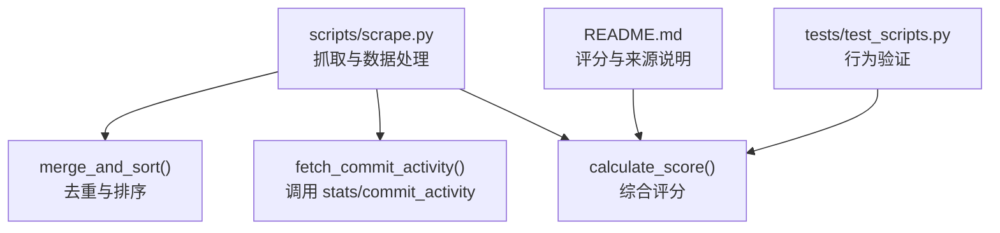
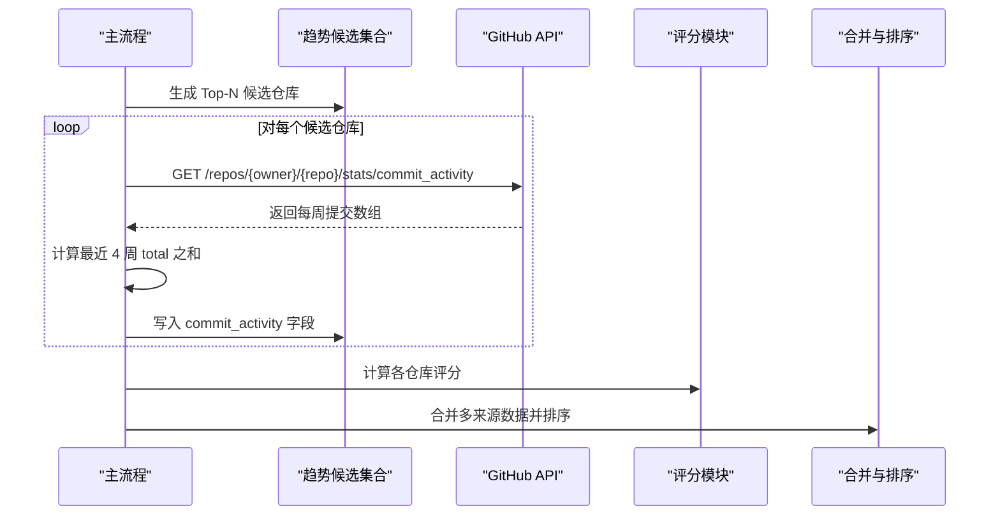
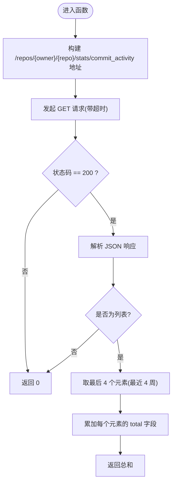
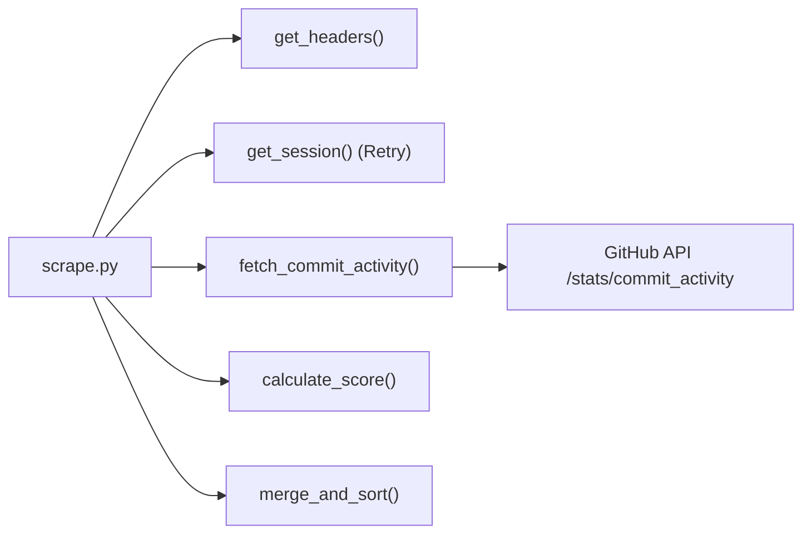

# 提交活动统计 API

<cite>
**本文引用的文件**
- [scripts/scrape.py](file://scripts/scrape.py)
- [README.md](file://README.md)
- [tests/test_scripts.py](file://tests/test_scripts.py)
</cite>

## 目录
1. [简介](#简介)
2. [项目结构](#项目结构)
3. [核心组件](#核心组件)
4. [架构总览](#架构总览)
5. [详细组件分析](#详细组件分析)
6. [依赖关系分析](#依赖关系分析)
7. [性能与缓存建议](#性能与缓存建议)
8. [故障排查指南](#故障排查指南)
9. [结论](#结论)
10. [附录](#附录)

## 简介
本技术文档聚焦于 GitHub 提交活动统计 API 在项目中的使用方式，重点解析 fetch_commit_activity() 函数的实现原理、数据格式、免费访问特性与限制、最近 4 周提交数计算逻辑、异常处理策略，以及与评分算法和其他模块的集成模式。该函数通过调用 /repos/{owner}/{repo}/stats/commit_activity 端点获取仓库的每周提交统计，并聚合为“最近 4 周的提交总数”，作为衡量仓库活跃度的重要信号参与最终评分。

## 项目结构
本项目是一个多源 GitHub 仓库聚合器，包含爬虫脚本、前端展示、测试与数据输出等模块。与提交活动统计相关的核心代码位于 scripts/scrape.py，其中实现了 fetch_commit_activity() 以及与之配合的评分与合并逻辑；README.md 对评分公式与数据来源做了说明；tests/test_scripts.py 提供了相关行为的单元测试。

图表来源
- [scripts/scrape.py:133-146](file://scripts/scrape.py#L133-L146)
- [scripts/scrape.py:562-572](file://scripts/scrape.py#L562-L572)
- [scripts/scrape.py:575-622](file://scripts/scrape.py#L575-L622)
- [README.md:109-120](file://README.md#L109-L120)
- [tests/test_scripts.py:39-48](file://tests/test_scripts.py#L39-L48)

章节来源
- [scripts/scrape.py:133-146](file://scripts/scrape.py#L133-L146)
- [README.md:109-120](file://README.md#L109-L120)
- [tests/test_scripts.py:39-48](file://tests/test_scripts.py#L39-L48)

## 核心组件
- fetch_commit_activity(owner, repo): 调用 GitHub 提交活动统计端点，返回最近 4 周的提交总数。失败或不可用时返回 0。
- calculate_score(repo): 将 stars、forks、today_stars、commit_activity 等指标加权合成最终评分。
- merge_and_sort(all_repos): 对来自不同来源的仓库进行字段级合并（取最大值）与按评分降序排序。

章节来源
- [scripts/scrape.py:133-146](file://scripts/scrape.py#L133-L146)
- [scripts/scrape.py:562-572](file://scripts/scrape.py#L562-L572)
- [scripts/scrape.py:575-622](file://scripts/scrape.py#L575-L622)

## 架构总览
下图展示了从抓取到评分的整体流程，突出 fetch_commit_activity() 在趋势候选仓库上的增强作用：

图表来源
- [scripts/scrape.py:336-402](file://scripts/scrape.py#L336-L402)
- [scripts/scrape.py:133-146](file://scripts/scrape.py#L133-L146)
- [scripts/scrape.py:562-572](file://scripts/scrape.py#L562-L572)
- [scripts/scrape.py:575-622](file://scripts/scrape.py#L575-L622)

## 详细组件分析

### fetch_commit_activity() 实现原理
- 端点与请求
  - URL: https://api.github.com/repos/{owner}/{repo}/stats/commit_activity
  - 认证：无需 Token 即可访问（免费），但受未认证速率限制约束。
  - 超时：设置 10 秒超时，避免长时间阻塞。
- 响应校验
  - 仅当状态码为 200 且响应体为列表时视为有效。
  - 若状态码非 200 或响应体不是列表，返回 0。
- 数据聚合
  - 响应为“每周提交统计”数组，每项包含 total 字段表示该周提交数。
  - 取数组最后 4 项（即最近 4 周），累加其 total 得到最近 4 周提交总数。
- 异常处理
  - 任何异常（网络错误、JSON 解析失败、键缺失等）均返回 0，保证上层流程稳定。

图表来源
- [scripts/scrape.py:133-146](file://scripts/scrape.py#L133-L146)

章节来源
- [scripts/scrape.py:133-146](file://scripts/scrape.py#L133-L146)

### 免费 API 的限制与无认证访问优势
- 免费访问优势
  - 无需 GITHUB_TOKEN 即可调用 stats/commit_activity，降低接入门槛。
  - 适合小批量、低频场景，如仅对 Top-N 候选仓库做活跃度增强。
- 免费限制
  - 未认证请求存在较低速率限制（例如每小时 60 次）。
  - 在高并发或大规模抓取时容易触发限流，需结合重试与退避策略。
- 项目中的缓解措施
  - 使用 requests.Session + Retry 适配器，针对 429/5xx 自动重试并指数退避。
  - 仅在 Top-N 候选仓库上调用该端点，控制请求总量。
  - 对异常与无效响应采用“返回 0”的容错策略，避免中断整体流程。

章节来源
- [scripts/scrape.py:114-130](file://scripts/scrape.py#L114-L130)
- [scripts/scrape.py:336-402](file://scripts/scrape.py#L336-L402)
- [README.md:168-170](file://README.md#L168-L170)

### 返回数据结构与 total 字段含义
- 数据结构
  - 响应体为数组，每一项代表一周的提交统计。
  - 关键字段 total：该周内提交的总次数。
- 时间窗口选择
  - 取数组最后 4 项，对应最近 4 周，用于反映近期活跃度。
  - 4 周窗口兼顾“新鲜度”与“稳定性”，既能捕捉短期活跃，又避免单周波动过大。
- 计算结果
  - 将最近 4 周的 total 相加，得到“最近 4 周提交总数”，作为 commit_activity 字段。

章节来源
- [scripts/scrape.py:133-146](file://scripts/scrape.py#L133-L146)

### 最近 4 周提交数的计算逻辑与时间窗口原因
- 计算逻辑
  - 从响应数组末尾截取 4 项，逐项读取 total 并求和。
- 时间窗口原因
  - 4 周能较好平衡“近期活跃”与“抗噪声”，避免单周异常值影响评分。
  - 与评分公式中 commit_activity × 2 的权重相匹配，体现活跃度对排名的正向贡献。

章节来源
- [scripts/scrape.py:133-146](file://scripts/scrape.py#L133-L146)
- [README.md:109-120](file://README.md#L109-L120)

### 数据解析示例（路径引用）
- 成功路径
  - 状态码 200，响应为列表，包含若干周对象，每项有 total 字段。
  - 取最后 4 项，累加 total 得到最近 4 周提交总数。
- 失败路径
  - 状态码非 200 或响应体不是列表：返回 0。
  - 网络异常、JSON 解析异常、total 字段缺失：返回 0。

章节来源
- [scripts/scrape.py:133-146](file://scripts/scrape.py#L133-L146)

### 与其他 API 的集成模式
- 与趋势候选仓库的集成
  - 在趋势候选阶段，对 Top-N 仓库调用 fetch_commit_activity()，将结果写入 commit_activity 字段。
- 与评分算法的集成
  - calculate_score() 将 commit_activity 以固定权重纳入总分，提升近期活跃仓库的排名。
- 与合并排序的集成
  - merge_and_sort() 在多来源合并时对 commit_activity 执行字段级最大值合并，确保更优信号保留。

章节来源
- [scripts/scrape.py:336-402](file://scripts/scrape.py#L336-L402)
- [scripts/scrape.py:562-572](file://scripts/scrape.py#L562-L572)
- [scripts/scrape.py:575-622](file://scripts/scrape.py#L575-L622)

## 依赖关系分析
- 直接依赖
  - requests.Session 与 urllib3 Retry 适配器：提供连接复用与自动重试。
  - get_headers(): 可选注入 Authorization 头以提升速率上限。
- 间接依赖
  - 评分与合并逻辑：依赖 commit_activity 字段的存在与数值合理性。
- 外部依赖
  - GitHub API：stats/commit_activity 端点（免费可访问，但有速率限制）。

图表来源
- [scripts/scrape.py:103-130](file://scripts/scrape.py#L103-L130)
- [scripts/scrape.py:133-146](file://scripts/scrape.py#L133-L146)
- [scripts/scrape.py:562-572](file://scripts/scrape.py#L562-L572)
- [scripts/scrape.py:575-622](file://scripts/scrape.py#L575-L622)

章节来源
- [scripts/scrape.py:103-130](file://scripts/scrape.py#L103-L130)
- [scripts/scrape.py:133-146](file://scripts/scrape.py#L133-L146)
- [scripts/scrape.py:562-572](file://scripts/scrape.py#L562-L572)
- [scripts/scrape.py:575-622](file://scripts/scrape.py#L575-L622)

## 性能与缓存建议
- 当前实现特点
  - 仅在 Top-N 候选仓库上调用 commit_activity，减少请求量。
  - 使用 Session + Retry 自动重试，提高成功率。
- 进一步优化建议
  - 本地缓存：对同一仓库的 commit_activity 结果进行短时缓存（如 24 小时），避免重复请求。
  - 异步并发：对候选仓库的请求改为并发（注意速率限制与退避）。
  - 降级策略：当频繁出现 429 时，暂时跳过 commit_activity 增强，优先保障基础数据完整性。
  - 监控与告警：记录失败率与耗时，便于定位瓶颈。

[本节为通用优化建议，不直接分析具体文件]

## 故障排查指南
- 常见问题
  - 未认证速率限制：在未设置 GITHUB_TOKEN 的情况下，请求频率受限，可能触发 403。
  - 响应非预期：状态码非 200 或响应体不是列表，函数会返回 0。
  - 网络异常：超时、DNS 解析失败、SSL 错误等，函数会捕获异常并返回 0。
- 排查步骤
  - 检查是否设置了 GITHUB_TOKEN 环境变量以提升速率上限。
  - 确认目标仓库是否存在且公开，确保端点可访问。
  - 查看日志输出，定位具体失败原因（状态码、消息等）。
  - 适当增加重试次数或退避因子，降低瞬时失败概率。

章节来源
- [scripts/scrape.py:114-130](file://scripts/scrape.py#L114-L130)
- [scripts/scrape.py:133-146](file://scripts/scrape.py#L133-L146)
- [README.md:168-170](file://README.md#L168-L170)

## 结论
fetch_commit_activity() 通过免费可用的 stats/commit_activity 端点，为仓库活跃度提供可靠的量化信号。其实现简洁稳健：严格校验响应、合理的时间窗口（最近 4 周）、完善的异常处理与重试机制。与评分与合并逻辑的良好集成，使得近期活跃仓库能在最终排序中获得正向增益。对于生产环境，建议引入本地缓存与并发控制，进一步提升性能与鲁棒性。

[本节为总结性内容，不直接分析具体文件]

## 附录
- 评分公式参考
  - score = stars + forks + (forks/stars)*1000 + today_stars*10 + commit_activity*2
  - commit_activity 即为最近 4 周提交总数，由 fetch_commit_activity() 提供。

章节来源
- [README.md:109-120](file://README.md#L109-L120)
- [scripts/scrape.py:562-572](file://scripts/scrape.py#L562-L572)