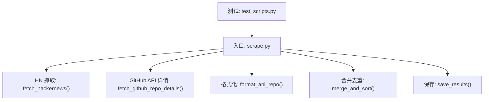
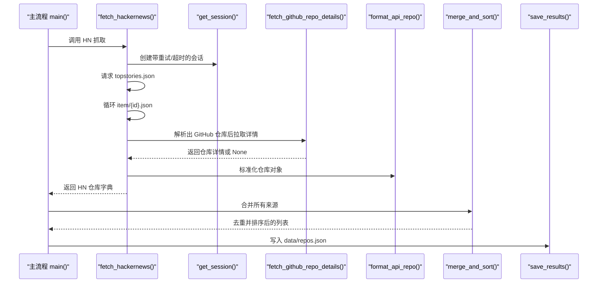
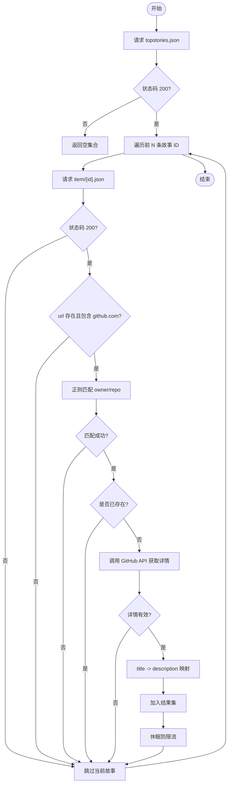
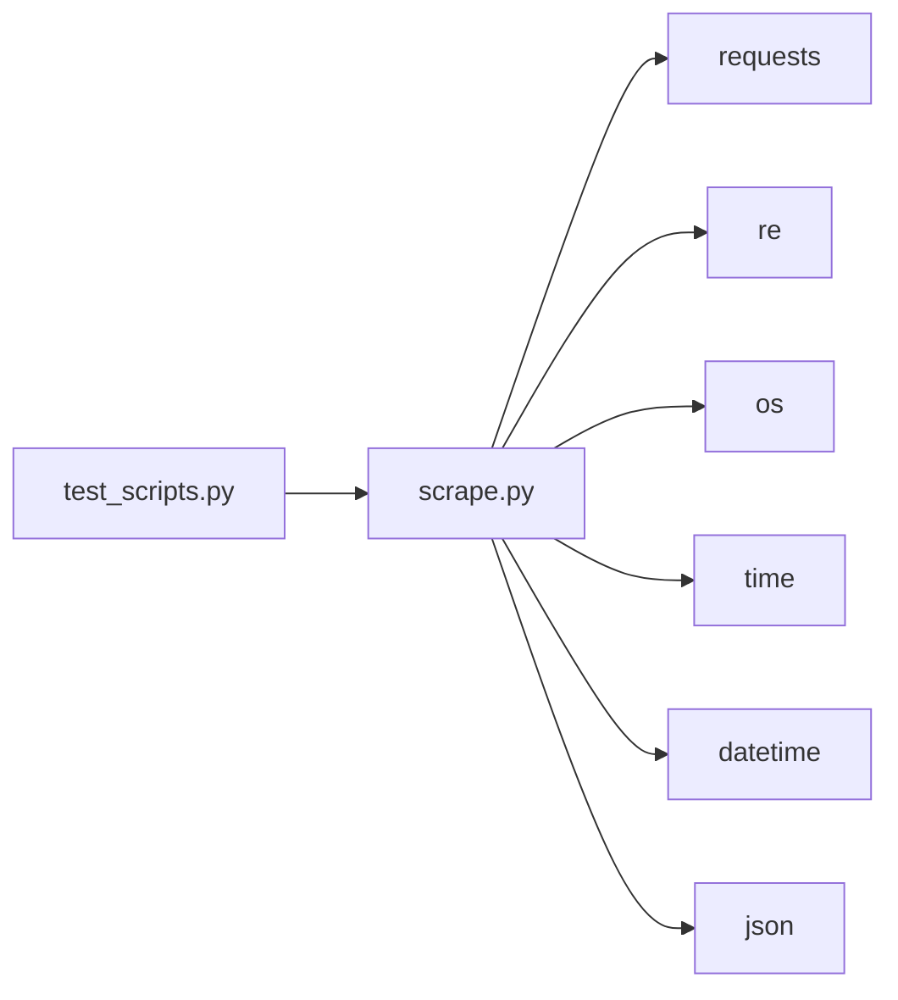

# Hacker News 数据抓取

<cite>
**本文引用的文件**   
- [scripts/scrape.py](file://scripts/scrape.py)
- [README.md](file://README.md)
- [requirements.txt](file://requirements.txt)
- [tests/test_scripts.py](file://tests/test_scripts.py)
</cite>

## 目录
1. [简介](#简介)
2. [项目结构](#项目结构)
3. [核心组件](#核心组件)
4. [架构总览](#架构总览)
5. [详细组件分析](#详细组件分析)
6. [依赖关系分析](#依赖关系分析)
7. [性能与网络优化](#性能与网络优化)
8. [故障排查指南](#故障排查指南)
9. [结论](#结论)
10. [附录：扩展其他社区平台](#附录扩展其他社区平台)

## 简介
本技术文档聚焦于通过 Hacker News Firebase API 抓取热门故事，并从中识别 GitHub 仓库链接、解析 URL、提取数据，以及将结果与整体仓库聚合流程融合。文档涵盖正则表达式模式、URL 解析逻辑、标题与描述映射、重复检测机制、错误处理策略，并提供可扩展到其他社区平台的实践建议。同时给出网络请求优化、超时处理和异常恢复机制的说明。

## 项目结构
本项目采用“多源聚合 + 统一评分”的后端爬虫方案，Hacker News 作为其中一个数据源参与全局去重与排序。关键脚本位于 scripts/ 目录，测试位于 tests/，前端静态资源在 web/，数据输出在 data/。

图表来源
- [scripts/scrape.py:405-461](file://scripts/scrape.py#L405-L461)
- [scripts/scrape.py:172-190](file://scripts/scrape.py#L172-L190)
- [scripts/scrape.py:546-559](file://scripts/scrape.py#L546-L559)
- [scripts/scrape.py:575-622](file://scripts/scrape.py#L575-L622)
- [scripts/scrape.py:625-649](file://scripts/scrape.py#L625-L649)
- [tests/test_scripts.py:1-268](file://tests/test_scripts.py#L1-L268)

章节来源
- [README.md:123-148](file://README.md#L123-L148)
- [scripts/scrape.py:1-21](file://scripts/scrape.py#L1-L21)

## 核心组件
- Hacker News 抓取器：从 HN Firebase API 获取 topstories，遍历前若干条故事，筛选包含 GitHub 链接的故事，解析 owner/repo，调用 GitHub API 获取详情，并写入统一数据结构。
- GitHub 详情拉取：封装统一的 HTTP 会话、重试与超时，返回标准化仓库信息。
- 数据格式化：将 GitHub API 响应转换为内部 schema，便于后续合并与评分。
- 合并与去重：跨来源字段级合并（数值取最大值、语言与描述择优、时间戳更新），并按综合评分排序。
- 持久化：输出 JSON 到 data/repos.json，供前端消费。

章节来源
- [scripts/scrape.py:405-461](file://scripts/scrape.py#L405-L461)
- [scripts/scrape.py:172-190](file://scripts/scrape.py#L172-L190)
- [scripts/scrape.py:546-559](file://scripts/scrape.py#L546-L559)
- [scripts/scrape.py:575-622](file://scripts/scrape.py#L575-L622)
- [scripts/scrape.py:625-649](file://scripts/scrape.py#L625-L649)

## 架构总览
下图展示了 HN 抓取在主流程中的位置及与其他模块的交互关系。

图表来源
- [scripts/scrape.py:671-716](file://scripts/scrape.py#L671-L716)
- [scripts/scrape.py:405-461](file://scripts/scrape.py#L405-L461)
- [scripts/scrape.py:114-130](file://scripts/scrape.py#L114-L130)
- [scripts/scrape.py:172-190](file://scripts/scrape.py#L172-L190)
- [scripts/scrape.py:546-559](file://scripts/scrape.py#L546-L559)
- [scripts/scrape.py:575-622](file://scripts/scrape.py#L575-L622)
- [scripts/scrape.py:625-649](file://scripts/scrape.py#L625-L649)

## 详细组件分析

### Hacker News 抓取流程
- 数据源：使用 Firebase 公开接口获取 topstories 列表，再逐个拉取 item 详情。
- 过滤条件：仅处理 url 字段中包含 github.com 的故事。
- URL 解析：使用正则匹配 owner 和 repo 两段路径段，构造 full_name。
- 详情补充：对每个 unique full_name 调用 GitHub API 获取仓库详情。
- 标题与描述映射：优先使用 HN 故事的 title 作为 description；若为空则回退到 GitHub 仓库的 description。
- 去重：以 full_name 为键，避免同一仓库重复入库。
- 速率控制：每次处理完一个 story 后休眠固定时长，降低请求频率。

图表来源
- [scripts/scrape.py:405-461](file://scripts/scrape.py#L405-L461)

章节来源
- [scripts/scrape.py:405-461](file://scripts/scrape.py#L405-L461)

### GitHub 仓库链接识别的正则表达式模式
- 用于 HN 场景的模式：匹配形如 https://github.com/owner/repo 的路径段，捕获 owner 与 repo。
- 用于 Awesome Lists 的场景：匹配 Markdown 链接语法中的 GitHub 仓库链接，并对非仓库路径进行过滤。

要点
- HN 模式更简洁，直接针对 URL 文本片段进行匹配。
- Awesome Lists 模式需考虑 Markdown 链接上下文，并过滤掉 GitHub 自身导航路径与 awesome-* 自引用。

章节来源
- [scripts/scrape.py:436-438](file://scripts/scrape.py#L436-L438)
- [scripts/scrape.py:152-169](file://scripts/scrape.py#L152-L169)

### URL 解析逻辑与数据提取流程
- 解析步骤：
  - 判断 url 是否包含 github.com。
  - 使用正则提取 owner 与 repo。
  - 拼接 full_name 作为唯一标识。
- 数据提取：
  - 调用 GitHub API 获取仓库详情。
  - 使用 format_api_repo 将 API 响应转为内部 schema。
  - 设置 source 为 hackernews，description 优先使用 HN 故事 title。

章节来源
- [scripts/scrape.py:432-450](file://scripts/scrape.py#L432-L450)
- [scripts/scrape.py:546-559](file://scripts/scrape.py#L546-L559)

### 故事标题与仓库描述的映射关系
- 优先级：HN 故事的 title > GitHub 仓库 description。
- 目的：保留社区传播语境下的“标题”，提升可读性与相关性。

章节来源
- [scripts/scrape.py:448-450](file://scripts/scrape.py#L448-L450)

### 重复检测机制
- 基于 full_name 的去重：在 HN 抓取阶段即检查是否已存在，避免重复拉取详情。
- 全局合并阶段的字段级合并：不同来源的同一仓库会合并数值型信号（stars/forks/today_stars/commit_activity）取最大值，语言与描述择优，source 标签合并，fetched_at 取最新。

章节来源
- [scripts/scrape.py:443-450](file://scripts/scrape.py#L443-L450)
- [scripts/scrape.py:575-622](file://scripts/scrape.py#L575-L622)

### 错误处理策略
- 网络层：
  - 使用 requests.Session 配合 Retry 与 HTTPAdapter，自动重试 429/5xx 等错误，指数退避。
  - 所有外部请求均设置 timeout，防止阻塞。
- 业务层：
  - 对 HN item 请求失败或解析异常时跳过当前条目，继续处理下一条。
  - 对 GitHub API 404/403 等情况进行分支处理，避免中断整体流程。
- 健壮性：
  - 外层 try/except 包裹 HN 抓取主流程，确保单点失败不影响整体运行。

章节来源
- [scripts/scrape.py:114-130](file://scripts/scrape.py#L114-L130)
- [scripts/scrape.py:172-190](file://scripts/scrape.py#L172-L190)
- [scripts/scrape.py:405-461](file://scripts/scrape.py#L405-L461)

## 依赖关系分析
- 运行时依赖：requests（HTTP 客户端）。
- 内置库：re（正则）、os、sys、time、datetime、json。
- 测试覆盖：单元测试验证 parse_num、calculate_score、estimate_today_stars、parse_awesome_list、merge_and_sort、format_api_repo、get_headers、get_session 等行为。

图表来源
- [scripts/scrape.py:1-21](file://scripts/scrape.py#L1-L21)
- [tests/test_scripts.py:1-268](file://tests/test_scripts.py#L1-L268)

章节来源
- [requirements.txt:1-1](file://requirements.txt#L1-L1)
- [tests/test_scripts.py:1-268](file://tests/test_scripts.py#L1-L268)

## 性能与网络优化
- 会话复用：通过 get_session 复用连接池，减少握手开销。
- 自动重试：对 429/5xx 错误进行指数退避重试，提高稳定性。
- 超时控制：所有外部请求设置合理 timeout，避免长时间挂起。
- 速率限制：在 HN 抓取循环中增加 sleep，降低瞬时请求压力。
- 增量与分页：虽然 HN 抓取只取 top 30，但可通过调整切片上限扩大覆盖面。
- 前端侧重试：前端加载数据时具备多次重试与延迟策略，增强用户体验。

章节来源
- [scripts/scrape.py:114-130](file://scripts/scrape.py#L114-L130)
- [scripts/scrape.py:405-461](file://scripts/scrape.py#L405-L461)
- [web/app.js:401-434](file://web/app.js#L401-L434)

## 故障排查指南
- 无法加载数据：浏览器下 file:// 协议会阻止 fetch，需通过本地 HTTP 服务器访问。
- GitHub API 限流：未设置 GITHUB_TOKEN 时请求受限，设置后可显著提升配额。
- HN 抓取失败：检查网络连接与 Firebase 服务可用性；确认 topstories/item 接口可达。
- 正则不匹配：确认目标 URL 符合 github.com/owner/repo 格式；注意大小写与特殊字符。
- 数据缺失：检查 GitHub API 返回是否为 404/403；必要时查看日志输出。

章节来源
- [README.md:166-171](file://README.md#L166-L171)
- [scripts/scrape.py:172-190](file://scripts/scrape.py#L172-L190)
- [scripts/scrape.py:405-461](file://scripts/scrape.py#L405-L461)

## 结论
该实现以最小依赖与清晰流程完成了从 Hacker News 到 GitHub 仓库的数据抓取与整合。通过正则精准识别仓库链接、合理的标题/描述映射、严格的去重与合并策略，以及稳健的网络层重试与超时控制，保证了系统的可用性与可维护性。结合前端的多源重试与 UI 提示，整体体验良好。

## 附录：扩展其他社区平台
以下以 DEV.to 为例展示如何扩展新的社区平台数据抓取，其模式与 HN 类似：
- 获取热门内容列表（文章/帖子）。
- 在内容元数据或正文中搜索 GitHub 链接。
- 使用相同正则解析 owner/repo。
- 调用 GitHub API 获取详情并格式化。
- 设置 source 标签，并在合并阶段参与全局去重与评分。

参考实现位置
- [scripts/scrape.py:464-528](file://scripts/scrape.py#L464-L528)

章节来源
- [scripts/scrape.py:464-528](file://scripts/scrape.py#L464-L528)