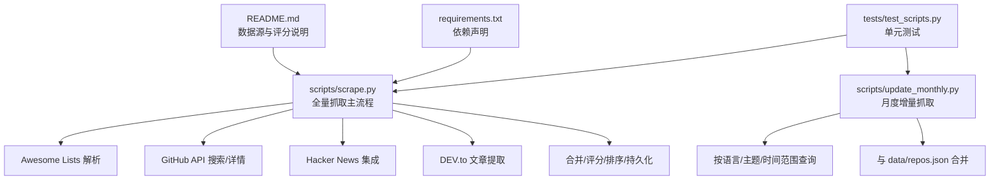
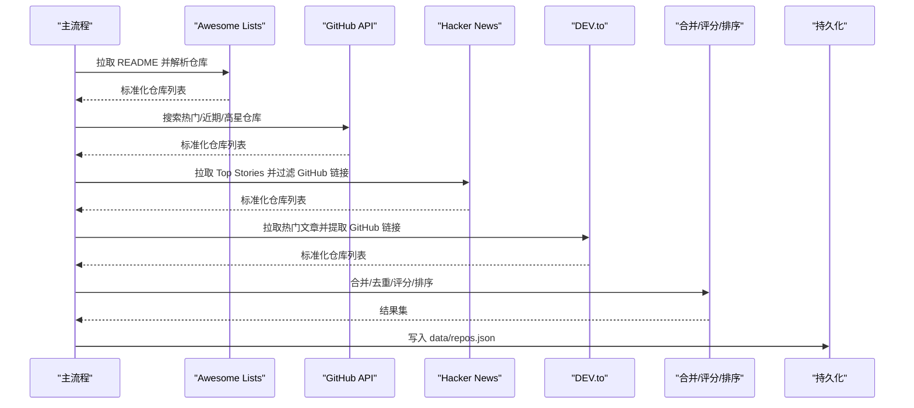
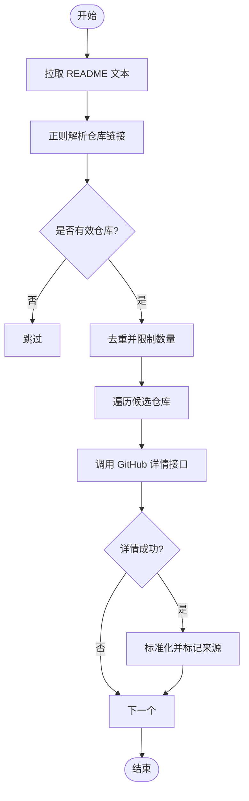
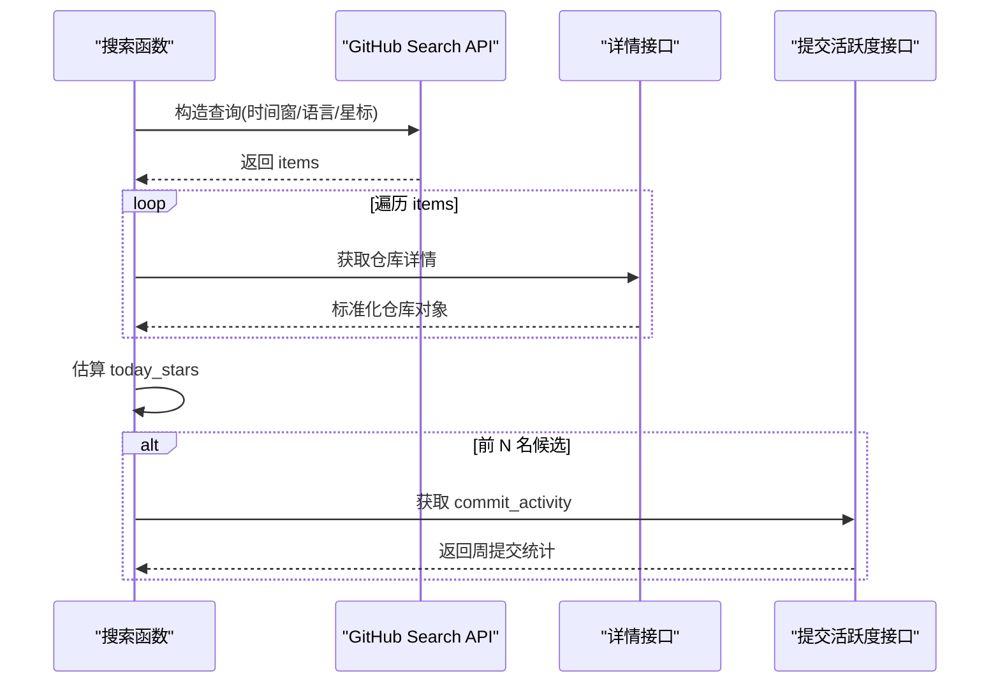
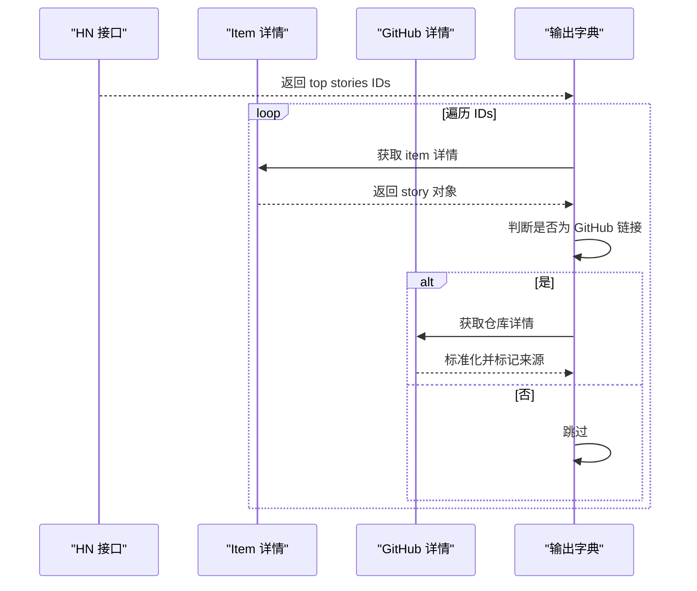
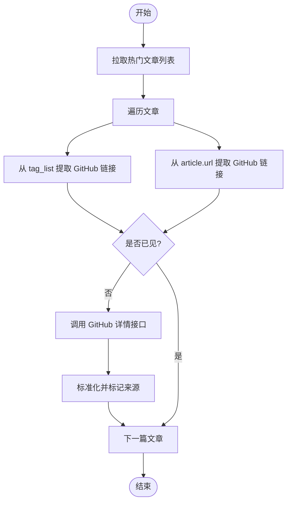
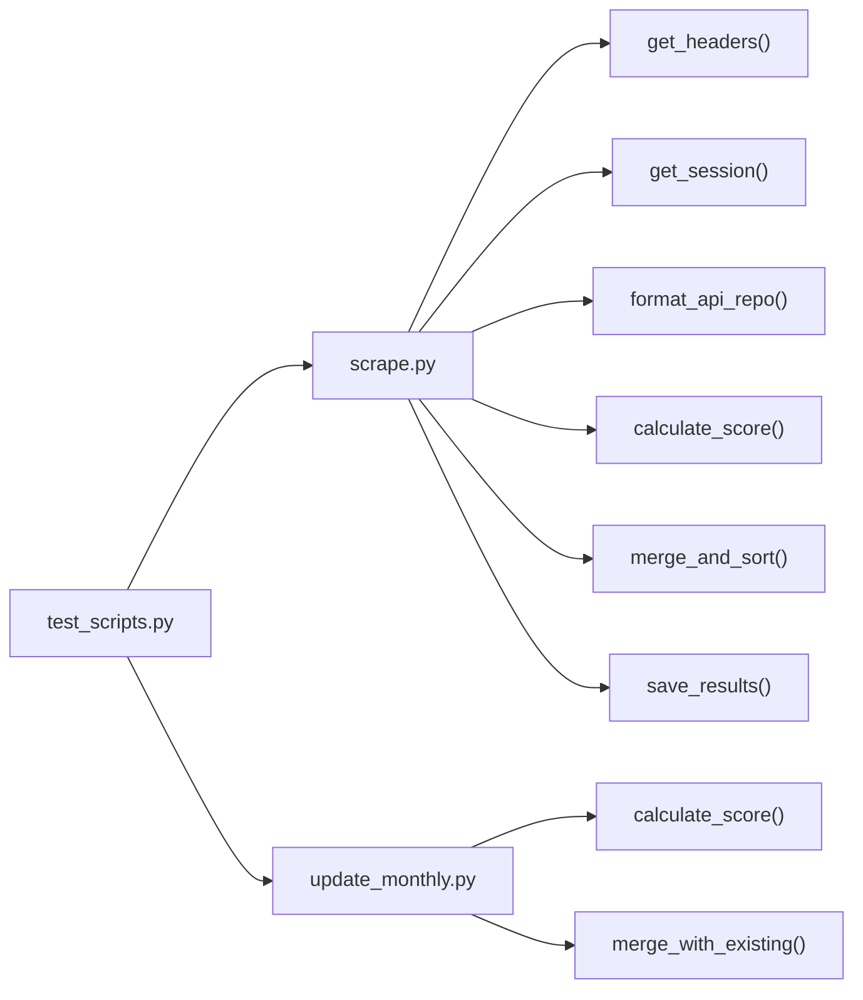

# 数据提取层

<cite>
**本文引用的文件**   
- [scripts/scrape.py](file://scripts/scrape.py)
- [scripts/update_monthly.py](file://scripts/update_monthly.py)
- [tests/test_scripts.py](file://tests/test_scripts.py)
- [requirements.txt](file://requirements.txt)
- [README.md](file://README.md)
</cite>

## 目录
1. [简介](#简介)
2. [项目结构](#项目结构)
3. [核心组件](#核心组件)
4. [架构总览](#架构总览)
5. [详细组件分析](#详细组件分析)
6. [依赖关系分析](#依赖关系分析)
7. [性能与并发策略](#性能与并发策略)
8. [故障排查指南](#故障排查指南)
9. [结论](#结论)
10. [附录：扩展新数据源指南](#附录扩展新数据源指南)

## 简介
本技术文档聚焦于“数据提取层”的实现，系统性解析多源数据聚合方案，覆盖以下五个数据源的实现细节与工程化实践：
- Awesome Lists 解析器
- GitHub API 搜索（含趋势估算）
- Hacker News 集成
- DEV.to 文章提取
- 月度增量更新（按月维度补充仓库）

文档将深入说明每个数据源的请求策略、错误处理机制、限流与重试逻辑、数据标准化格式与字段映射规则，并提供可扩展的扩展点与并发优化建议。

## 项目结构
数据提取层主要位于脚本目录中，包含全量抓取与月度增量两个入口；测试用例覆盖关键算法与行为契约；依赖仅包含 requests。

图表来源
- [scripts/scrape.py:1-717](file://scripts/scrape.py#L1-L717)
- [scripts/update_monthly.py:1-371](file://scripts/update_monthly.py#L1-L371)
- [tests/test_scripts.py:1-268](file://tests/test_scripts.py#L1-L268)
- [requirements.txt:1-1](file://requirements.txt#L1-L1)
- [README.md:98-120](file://README.md#L98-L120)

章节来源
- [scripts/scrape.py:1-717](file://scripts/scrape.py#L1-L717)
- [scripts/update_monthly.py:1-371](file://scripts/update_monthly.py#L1-L371)
- [requirements.txt:1-1](file://requirements.txt#L1-L1)
- [README.md:98-120](file://README.md#L98-L120)

## 核心组件
- 会话与重试：基于 requests.Session + urllib3 Retry，统一挂载到 HTTPAdapter，对 429/5xx 进行指数退避重试。
- 头部构建：自动注入 User-Agent、Accept，可选 Authorization（GITHUB_TOKEN）。
- 数据源采集器：
  - Awesome Lists：拉取 README 原始文本，正则抽取 GitHub 仓库链接，去重并限制数量。
  - GitHub API：搜索热门/近期创建/高星仓库，获取详情，估算今日星标增长，可选补全提交活跃度。
  - Hacker News：拉取 Top Stories，过滤 GitHub 链接，解析 owner/repo 后调用 GitHub 详情接口。
  - DEV.to：拉取热门文章列表，从标签与文章 URL 中提取 GitHub 链接，再调用详情接口。
- 标准化与合并：统一输出 schema，跨源去重时数值字段取最大值，描述/语言优先更丰富值，source 合并为有序集合字符串。
- 评分与排序：综合 stars/forks/today_stars/commit_activity 计算分数，降序排列。
- 持久化：输出 JSON 至 data/repos.json，附带元信息（schema_version、fetched_at、sources、criteria、total、repos）。

章节来源
- [scripts/scrape.py:114-130](file://scripts/scrape.py#L114-L130)
- [scripts/scrape.py:103-111](file://scripts/scrape.py#L103-L111)
- [scripts/scrape.py:149-169](file://scripts/scrape.py#L149-L169)
- [scripts/scrape.py:243-298](file://scripts/scrape.py#L243-L298)
- [scripts/scrape.py:336-402](file://scripts/scrape.py#L336-L402)
- [scripts/scrape.py:405-461](file://scripts/scrape.py#L405-L461)
- [scripts/scrape.py:464-528](file://scripts/scrape.py#L464-L528)
- [scripts/scrape.py:546-559](file://scripts/scrape.py#L546-L559)
- [scripts/scrape.py:575-622](file://scripts/scrape.py#L575-L622)
- [scripts/scrape.py:625-649](file://scripts/scrape.py#L625-L649)

## 架构总览
下图展示了数据提取层的端到端流程：各数据源并行或串行采集，统一格式化后进入合并/评分/排序阶段，最终落盘。

图表来源
- [scripts/scrape.py:671-716](file://scripts/scrape.py#L671-L716)
- [scripts/scrape.py:193-240](file://scripts/scrape.py#L193-L240)
- [scripts/scrape.py:267-298](file://scripts/scrape.py#L267-L298)
- [scripts/scrape.py:336-402](file://scripts/scrape.py#L336-L402)
- [scripts/scrape.py:405-461](file://scripts/scrape.py#L405-L461)
- [scripts/scrape.py:464-528](file://scripts/scrape.py#L464-L528)
- [scripts/scrape.py:575-622](file://scripts/scrape.py#L575-L622)
- [scripts/scrape.py:625-649](file://scripts/scrape.py#L625-L649)

## 详细组件分析

### Awesome Lists 解析器
- 请求策略：通过 raw 链接拉取 README 文本，设置通用 User-Agent，超时控制。
- 解析逻辑：正则匹配 Markdown 链接中的 GitHub 仓库路径，过滤非仓库路径与 awesome 自身引用，清理尾部片段与查询参数，去重并限制返回数量。
- 错误处理：网络异常或状态码非 200 直接跳过该列表；后续逐条调用 GitHub 详情接口，失败则忽略。
- 限流与重试：使用全局 Session 的 Retry 适配器；每条详情请求之间增加短延时，避免触发速率限制。
- 标准化：复用 format_api_repo 生成统一结构，标记 source 为 awesome_list。

图表来源
- [scripts/scrape.py:193-240](file://scripts/scrape.py#L193-L240)
- [scripts/scrape.py:149-169](file://scripts/scrape.py#L149-L169)
- [scripts/scrape.py:171-190](file://scripts/scrape.py#L171-L190)
- [scripts/scrape.py:546-559](file://scripts/scrape.py#L546-L559)

章节来源
- [scripts/scrape.py:193-240](file://scripts/scrape.py#L193-L240)
- [scripts/scrape.py:149-169](file://scripts/scrape.py#L149-L169)
- [scripts/scrape.py:171-190](file://scripts/scrape.py#L171-L190)
- [scripts/scrape.py:546-559](file://scripts/scrape.py#L546-L559)

### GitHub API 搜索与详情
- 搜索策略：
  - 主题/关键词搜索：限定当年创建、最低星标阈值，按星标降序分页。
  - 语言维度：针对主流语言分别查询，提高覆盖面。
  - 趋势近似：使用 pushed/created 时间窗与星标区间组合，模拟 trending 效果。
- 详情获取：对每个仓库调用 /repos/{owner}/{repo}，处理 404/403 等状态码，异常捕获并记录日志。
- 今日星标估算：根据最近推送时间与仓库年龄估算当日星标增长，用于前端“Surge Index”。
- 提交活跃度增强：对 top-N 候选调用 stats/commit_activity（免费无需 token），汇总近四周提交数作为新鲜度信号。
- 限流与重试：统一使用带退避的重试适配器；遇到 403 时打印速率限制消息并休眠等待。

图表来源
- [scripts/scrape.py:243-298](file://scripts/scrape.py#L243-L298)
- [scripts/scrape.py:336-402](file://scripts/scrape.py#L336-L402)
- [scripts/scrape.py:171-190](file://scripts/scrape.py#L171-L190)
- [scripts/scrape.py:133-146](file://scripts/scrape.py#L133-L146)
- [scripts/scrape.py:301-333](file://scripts/scrape.py#L301-L333)

章节来源
- [scripts/scrape.py:243-298](file://scripts/scrape.py#L243-L298)
- [scripts/scrape.py:336-402](file://scripts/scrape.py#L336-L402)
- [scripts/scrape.py:171-190](file://scripts/scrape.py#L171-L190)
- [scripts/scrape.py:133-146](file://scripts/scrape.py#L133-L146)
- [scripts/scrape.py:301-333](file://scripts/scrape.py#L301-L333)

### Hacker News 集成
- 请求策略：拉取 topstories.json，取前 30 条故事 ID，逐个获取 item 详情。
- 过滤逻辑：仅保留 url 中包含 github.com 的故事，正则提取 owner/repo。
- 详情获取：调用 GitHub 详情接口，成功后标准化并标记 source 为 hackernews，同时用故事标题覆盖默认描述。
- 限流与重试：使用统一 Session；单条请求间增加延时，异常捕获继续下一条。

图表来源
- [scripts/scrape.py:405-461](file://scripts/scrape.py#L405-L461)
- [scripts/scrape.py:171-190](file://scripts/scrape.py#L171-L190)
- [scripts/scrape.py:546-559](file://scripts/scrape.py#L546-L559)

章节来源
- [scripts/scrape.py:405-461](file://scripts/scrape.py#L405-L461)
- [scripts/scrape.py:171-190](file://scripts/scrape.py#L171-L190)
- [scripts/scrape.py:546-559](file://scripts/scrape.py#L546-L559)

### DEV.to 文章提取
- 请求策略：调用 dev.to/api/articles，参数 per_page=50、top=7，设置 User-Agent。
- 提取逻辑：遍历 tag_list 与 article.url，正则匹配 GitHub 仓库链接。
- 详情获取：对唯一仓库调用 GitHub 详情接口，成功后标准化并标记 source 为 devto，使用文章标题覆盖描述。
- 限流与重试：统一 Session；循环内延时，异常捕获继续。

图表来源
- [scripts/scrape.py:464-528](file://scripts/scrape.py#L464-L528)
- [scripts/scrape.py:171-190](file://scripts/scrape.py#L171-L190)
- [scripts/scrape.py:546-559](file://scripts/scrape.py#L546-L559)

章节来源
- [scripts/scrape.py:464-528](file://scripts/scrape.py#L464-L528)
- [scripts/scrape.py:171-190](file://scripts/scrape.py#L171-L190)
- [scripts/scrape.py:546-559](file://scripts/scrape.py#L546-L559)

### 数据标准化与字段映射
- 统一字段：name、url、description、stars、forks、language、today_stars、score、fetched_at、source。
- 字段来源映射：
  - name ← full_name
  - url ← html_url
  - description ← description 或默认占位
  - stars ← stargazers_count
  - forks ← forks_count
  - language ← language 或 Unknown
  - today_stars ← 估算或 0
  - score ← 初始为 stars，后续由 calculate_score 计算
  - fetched_at ← 当前 ISO 时间
  - source ← 数据来源标识（awesome_list/github_api/trending/hackernews/devto）
- 合并策略：同名仓库跨源合并时，数值字段取最大值，语言/描述优先更完整值，source 合并为有序集合字符串，fetched_at 取较新值。

章节来源
- [scripts/scrape.py:546-559](file://scripts/scrape.py#L546-L559)
- [scripts/scrape.py:575-622](file://scripts/scrape.py#L575-L622)

### 评分与排序
- 评分公式：score = stars + forks + (forks/stars)*1000 + today_stars*10 + commit_activity*2。
- 排序：按 score 降序排列。
- 边界处理：当 stars 为 0 时，fork_ratio 按 0 处理，避免除零。

章节来源
- [scripts/scrape.py:562-572](file://scripts/scrape.py#L562-L572)
- [scripts/scrape.py:615-622](file://scripts/scrape.py#L615-L622)

### 月度增量更新
- 目标：按指定年月的 created 时间范围，多维度（全部语言、各语言、热点主题、低星但近期推送）抓取新增仓库，并与现有 data/repos.json 合并。
- 搜索策略：使用 GitHub Search API，支持分页与 per_page 控制；对 403 做限流处理。
- 合并策略：与全量抓取一致的字段级合并与评分逻辑，保留 month_tag 以便报告统计。
- 输出：更新 data/repos.json，并在需要时生成月度 Markdown 报告。

章节来源
- [scripts/update_monthly.py:78-134](file://scripts/update_monthly.py#L78-L134)
- [scripts/update_monthly.py:136-151](file://scripts/update_monthly.py#L136-L151)
- [scripts/update_monthly.py:167-229](file://scripts/update_monthly.py#L167-L229)
- [scripts/update_monthly.py:252-323](file://scripts/update_monthly.py#L252-L323)

## 依赖关系分析
- 外部依赖：requests（HTTP 客户端）、urllib3（Retry 与 HTTPAdapter 底层）。
- 内部模块耦合：
  - scrape.py 为主入口，聚合多个数据源，依赖统一的 get_headers/get_session/format_api_repo/calculate_score/merge_and_sort/save_results。
  - update_monthly.py 复用评分与合并思想，独立实现月度抓取与报告生成。
  - tests/test_scripts.py 验证 parse_num、calculate_score、estimate_today_stars、parse_awesome_list、merge_and_sort、format_api_repo、get_headers、get_session 等行为契约。

图表来源
- [scripts/scrape.py:103-130](file://scripts/scrape.py#L103-L130)
- [scripts/scrape.py:546-572](file://scripts/scrape.py#L546-L572)
- [scripts/scrape.py:575-649](file://scripts/scrape.py#L575-L649)
- [scripts/update_monthly.py:154-229](file://scripts/update_monthly.py#L154-L229)
- [tests/test_scripts.py:1-268](file://tests/test_scripts.py#L1-L268)

章节来源
- [scripts/scrape.py:103-130](file://scripts/scrape.py#L103-L130)
- [scripts/scrape.py:546-649](file://scripts/scrape.py#L546-L649)
- [scripts/update_monthly.py:154-229](file://scripts/update_monthly.py#L154-L229)
- [tests/test_scripts.py:1-268](file://tests/test_scripts.py#L1-L268)

## 性能与并发策略
- 连接复用：通过 requests.Session 复用 TCP 连接，减少握手开销。
- 重试与退避：对 429/5xx 自动重试，指数退避因子 1.0（1s、2s、4s），降低瞬时失败影响。
- 限流控制：在循环中插入 time.sleep，避免触发第三方服务速率限制。
- 分页与批量：GitHub Search 支持 per_page 与 page 参数，合理分页提升吞吐。
- 并发建议（扩展点）：
  - 使用线程池或 asyncio 并发拉取不同数据源（如 HN、DEV.to、GitHub 详情），注意共享 Session 与令牌配额。
  - 对同一域名（如 api.github.com）的请求需维护令牌配额与退避策略，避免并发导致 403。
  - 对本地磁盘 IO（保存结果）采用异步或缓冲写入，避免阻塞主流程。

[本节为通用性能指导，不直接分析具体代码文件]

## 故障排查指南
- 速率限制（403）：检查是否设置 GITHUB_TOKEN；若未设置，默认 60 次/小时，开启 Token 后可提升至 5000 次/小时。
- 网络异常：确认超时配置与重试策略生效；查看控制台输出的错误信息。
- 解析失败：检查 Awesome Lists README 链接是否可达；确认正则表达式与过滤规则是否符合预期。
- 数据缺失：确认 GitHub 仓库是否存在（404）；某些仓库可能无 description/language，将被填充默认值。
- 测试结果：运行 pytest 验证核心函数行为是否符合契约。

章节来源
- [README.md:169-171](file://README.md#L169-L171)
- [scripts/scrape.py:114-130](file://scripts/scrape.py#L114-L130)
- [scripts/scrape.py:171-190](file://scripts/scrape.py#L171-L190)
- [tests/test_scripts.py:246-268](file://tests/test_scripts.py#L246-L268)

## 结论
数据提取层以简洁清晰的模块化设计实现了多源聚合：Awesome Lists、GitHub API、Hacker News、DEV.to 以及月度增量更新。通过统一的标准化格式、稳健的错误处理与限流重试机制，系统能够在资源受限环境下稳定产出高质量仓库清单。评分与排序策略兼顾静态指标与动态趋势，便于前端展示与用户决策。未来可通过并发优化与缓存策略进一步提升吞吐与稳定性。

[本节为总结性内容，不直接分析具体代码文件]

## 附录：扩展新数据源指南
- 步骤概览：
  1. 新增数据源函数：定义 fetch_xxx()，负责拉取原始数据、解析出仓库 owner/repo。
  2. 复用详情接口：对每个仓库调用 fetch_github_repo_details(owner, repo)。
  3. 标准化输出：使用 format_api_repo(r) 生成统一结构，并设置 source 为自定义标识。
  4. 加入主流程：在 main() 中调用新函数，并将结果并入 all_repos。
  5. 合并与评分：merge_and_sort 会自动去重、合并字段、计算 score 并排序。
  6. 持久化：save_results 会写入 data/repos.json，并在 sources 列表中追加新来源。
- 示例路径参考：
  - 新增函数位置：参考 fetch_hackernews 与 fetch_devto_articles 的实现模式。
  - 标准化与合并：参考 format_api_repo 与 merge_and_sort。
  - 主流程编排：参考 main() 中对各数据源的调用顺序与合并逻辑。
- 注意事项：
  - 遵循统一的错误处理与限流策略，确保健壮性。
  - 为新来源编写单元测试，覆盖解析、标准化与合并行为。
  - 如需额外字段（如 month_tag），请在合并逻辑中兼容处理。

章节来源
- [scripts/scrape.py:405-461](file://scripts/scrape.py#L405-L461)
- [scripts/scrape.py:464-528](file://scripts/scrape.py#L464-L528)
- [scripts/scrape.py:546-559](file://scripts/scrape.py#L546-L559)
- [scripts/scrape.py:575-622](file://scripts/scrape.py#L575-L622)
- [scripts/scrape.py:671-716](file://scripts/scrape.py#L671-L716)