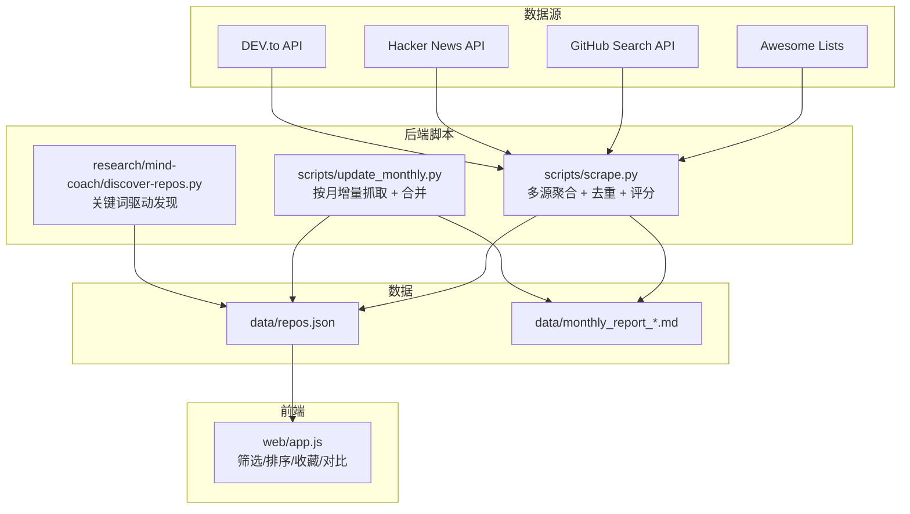
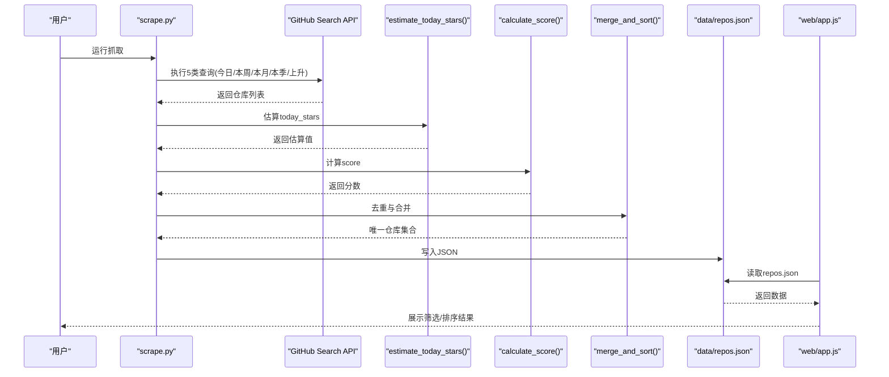
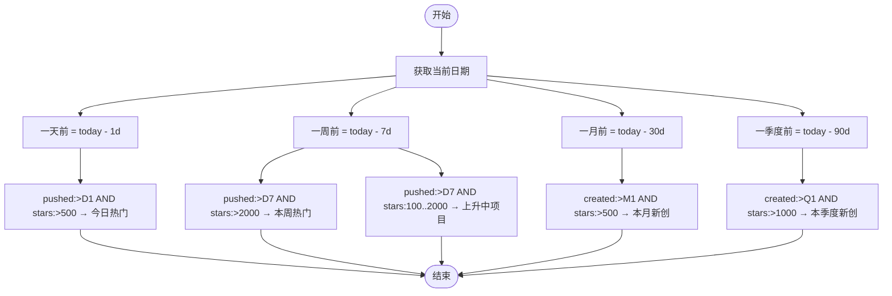
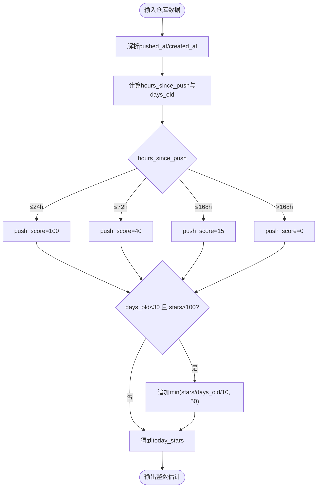
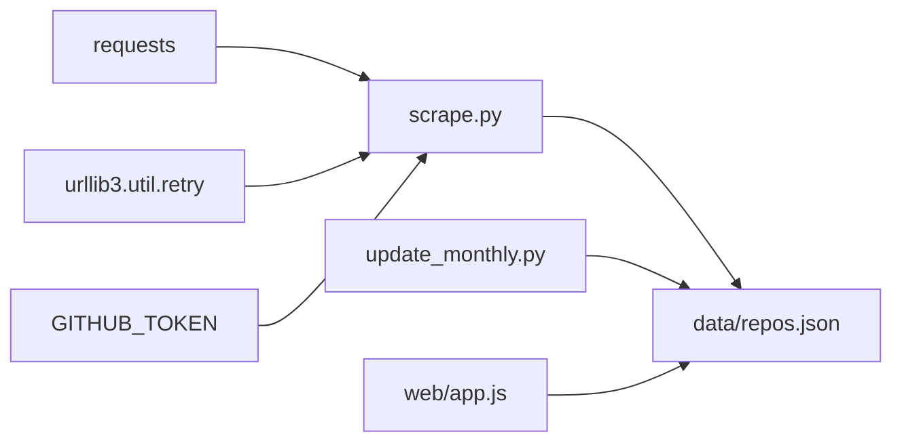

# 热门仓库发现器

<cite>
**本文引用的文件**
- [README.md](file://README.md)
- [scripts/scrape.py](file://scripts/scrape.py)
- [scripts/update_monthly.py](file://scripts/update_monthly.py)
- [research/mind-coach/discover-repos.py](file://research/mind-coach/discover-repos.py)
- [web/app.js](file://web/app.js)
- [requirements.txt](file://requirements.txt)
</cite>

## 目录
1. [简介](#简介)
2. [项目结构](#项目结构)
3. [核心组件](#核心组件)
4. [架构总览](#架构总览)
5. [详细组件分析](#详细组件分析)
6. [依赖关系分析](#依赖关系分析)
7. [性能与优化](#性能与优化)
8. [故障排查指南](#故障排查指南)
9. [结论](#结论)
10. [附录：自定义查询与权重调整示例](#附录自定义查询与权重调整示例)

## 简介
本项目是一个开源的“热门仓库发现器”，通过多源聚合（Awesome Lists、GitHub Search API、Hacker News、DEV.to）和智能评分，持续发现并展示高质量 GitHub 项目。其核心能力包括：
- 基于 GitHub Search API 的多维度查询策略，覆盖“今日热门、本周热门、本月新创、本季度新创、上升中项目”等场景
- 今日星标增长 today_stars 的估算算法，结合 push 时间分析与活跃度信号
- 综合评分模型，融合 stars、forks、社区参与度、增长势头与近期提交活跃度
- 前端可视化筛选、排序、收藏与对比等功能

## 项目结构
- scripts/：数据抓取与处理脚本（主爬虫、月度增量更新）
- research/mind-coach/：专题研究脚本（按关键词持续发现）
- web/：纯前端页面与交互逻辑
- data/：聚合后的 JSON 数据集与月度报告
- tests/：单元测试
- .github/workflows/：CI/CD 工作流

图表来源
- [scripts/scrape.py:193-240](file://scripts/scrape.py#L193-L240)
- [scripts/scrape.py:268-298](file://scripts/scrape.py#L268-L298)
- [scripts/scrape.py:336-402](file://scripts/scrape.py#L336-L402)
- [scripts/scrape.py:405-461](file://scripts/scrape.py#L405-L461)
- [scripts/scrape.py:464-528](file://scripts/scrape.py#L464-L528)
- [scripts/update_monthly.py:78-134](file://scripts/update_monthly.py#L78-L134)
- [research/mind-coach/discover-repos.py:79-113](file://research/mind-coach/discover-repos.py#L79-L113)
- [web/app.js:401-453](file://web/app.js#L401-L453)

章节来源
- [README.md:123-148](file://README.md#L123-L148)
- [scripts/scrape.py:1-21](file://scripts/scrape.py#L1-L21)

## 核心组件
- 多源抓取器：从 Awesome Lists、GitHub Search API、Hacker News、DEV.to 拉取仓库信息
- 趋势抓取器：使用 5 种查询类型覆盖不同时间窗口与热度区间
- 活跃度估算：根据 pushed_at 与 created_at 估算 today_stars
- 评分系统：stars + forks + fork/stars 比率 + today_stars 加速度 + 近 4 周提交数
- 去重与合并：字段级最大值合并，保留更丰富的描述与语言信息
- 前端筛选与排序：支持按 stars/forks/score/today/rising 排序，以及多维过滤

章节来源
- [scripts/scrape.py:546-572](file://scripts/scrape.py#L546-L572)
- [scripts/scrape.py:575-622](file://scripts/scrape.py#L575-L622)
- [scripts/scrape.py:301-333](file://scripts/scrape.py#L301-L333)
- [scripts/scrape.py:336-402](file://scripts/scrape.py#L336-L402)
- [web/app.js:38-186](file://web/app.js#L38-L186)

## 架构总览
整体流程：
- 抓取阶段：并行或串行调用各数据源，统一格式化为内部 schema
- 估算阶段：为每个仓库计算 today_stars 与 score
- 合并阶段：按仓库名去重，字段级取最大值，合并 source 标签
- 输出阶段：保存为 data/repos.json，供前端加载渲染

图表来源
- [scripts/scrape.py:336-402](file://scripts/scrape.py#L336-L402)
- [scripts/scrape.py:301-333](file://scripts/scrape.py#L301-L333)
- [scripts/scrape.py:561-572](file://scripts/scrape.py#L561-L572)
- [scripts/scrape.py:575-622](file://scripts/scrape.py#L575-L622)
- [web/app.js:401-453](file://web/app.js#L401-L453)

## 详细组件分析

### 五种查询类型与时间范围
- 今日热门：最近 1 天内有 push，且 stars > 500
- 本周热门：最近 7 天内有 push，且 stars > 2000
- 本月新创：最近 30 天内创建，且 stars > 500
- 本季度新创：最近 90 天内创建，且 stars > 1000
- 上升中项目：最近 7 天内有 push，且 stars 在 100..2000 之间（捕捉快速成长但尚未爆红的仓库）

这些查询由 fetch_trending_repos 构建，分别对应 hot-today、hot-week、new-month、new-quarter、rising 五个标签。

图表来源
- [scripts/scrape.py:336-378](file://scripts/scrape.py#L336-L378)

章节来源
- [scripts/scrape.py:336-378](file://scripts/scrape.py#L336-L378)

### today_stars 估算算法
原理：
- 解析 pushed_at 与 created_at，计算距离当前时间的小时数与天数
- 根据推送时效性打分：
  - ≤24h：100分
  - ≤72h：40分
  - ≤168h（1周）：15分
  - 其他：0分
- 对新仓库（<30天）且 stars > 100 给予额外加分，按 stars/days_old/10 上限 50 分
- 最终返回整数估计值，量级约 0..~150，用于前端“飙升指数”（today_stars / stars）

图表来源
- [scripts/scrape.py:301-333](file://scripts/scrape.py#L301-L333)

章节来源
- [scripts/scrape.py:301-333](file://scripts/scrape.py#L301-L333)

### 活跃度信号与 commit_activity 增强
- 对 top-N trending 候选仓库，调用免费 stats/commit_activity 接口，汇总最近 4 周的提交总数作为活跃度信号
- 该信号参与评分，提升“新鲜度”权重

章节来源
- [scripts/scrape.py:133-146](file://scripts/scrape.py#L133-L146)
- [scripts/scrape.py:380-402](file://scripts/scrape.py#L380-L402)

### 评分模型与排序
评分公式：
- score = stars + forks + (forks / stars) × 1000 + today_stars × 10 + commit_activity × 2
- 其中 fork/stars 比率体现社区参与度；today_stars 体现增长势头；commit_activity 体现近期活跃

章节来源
- [scripts/scrape.py:561-572](file://scripts/scrape.py#L561-L572)

### 去重与合并策略
- 以仓库全名为键进行去重
- 数值型字段（stars、forks、today_stars、commit_activity）取最大值
- 语言与描述优先选择非空/非占位符的更丰富版本
- source 字段合并为有序的去重字符串（如 "trending+github_api"）
- fetched_at 保留最新时间戳

章节来源
- [scripts/scrape.py:575-622](file://scripts/scrape.py#L575-L622)

### 前端筛选、排序与飙升指数
- 支持按 stars、forks、score、today、rising（飙升指数）排序
- 多维过滤：语言、stars≥、forks≥、score≥
- 收藏与对比功能，书签持久化到 localStorage
- 搜索预览与键盘快捷键

章节来源
- [web/app.js:38-186](file://web/app.js#L38-L186)
- [web/app.js:401-453](file://web/app.js#L401-L453)

## 依赖关系分析
- 外部依赖：requests（HTTP 请求）、urllib3（重试与退避）
- 环境变量：GITHUB_TOKEN 提高速率限制
- 数据文件：data/repos.json 为前后端共享的数据契约

图表来源
- [requirements.txt:1-1](file://requirements.txt#L1-L1)
- [scripts/scrape.py:14-20](file://scripts/scrape.py#L14-L20)
- [scripts/scrape.py:23-26](file://scripts/scrape.py#L23-L26)
- [scripts/scrape.py:625-649](file://scripts/scrape.py#L625-L649)
- [scripts/update_monthly.py:167-229](file://scripts/update_monthly.py#L167-L229)
- [web/app.js:401-453](file://web/app.js#L401-L453)

章节来源
- [requirements.txt:1-1](file://requirements.txt#L1-L1)
- [scripts/scrape.py:14-20](file://scripts/scrape.py#L14-L20)
- [scripts/scrape.py:23-26](file://scripts/scrape.py#L23-L26)

## 性能与优化
- 网络层：
  - requests.Session + Retry 自动重试 429/5xx，指数退避（1s、2s、4s），降低瞬时失败影响
  - 合理 per_page 与 sleep 控制，避免触发速率限制
- 查询优化：
  - 针对 trending 的 5 类查询限定 per_page=25，减少单次负载
  - 仅对 top-N 候选调用 commit_activity，平衡准确度与成本
- 去重与合并：
  - 字典 O(1) 查找，线性扫描合并，适合万级规模
- 前端渲染：
  - 分页与骨架屏，提升首屏体验

章节来源
- [scripts/scrape.py:114-130](file://scripts/scrape.py#L114-L130)
- [scripts/scrape.py:336-378](file://scripts/scrape.py#L336-L378)
- [scripts/scrape.py:380-402](file://scripts/scrape.py#L380-L402)
- [scripts/scrape.py:575-622](file://scripts/scrape.py#L575-L622)
- [web/app.js:455-475](file://web/app.js#L455-L475)

## 故障排查指南
- 无法加载数据：
  - 本地需通过 HTTP 服务器访问（浏览器 file:// 协议会阻止 fetch）
  - 先运行抓取脚本生成 data/repos.json
- 触发速率限制：
  - 设置 GITHUB_TOKEN 环境变量，将速率从 60 提升至 5000 次/小时
- 网络错误与超时：
  - 检查网络连接与代理设置
  - 查看日志中的 Rate limited 提示，适当增加 sleep 间隔

章节来源
- [README.md:166-171](file://README.md#L166-L171)
- [scripts/scrape.py:254-265](file://scripts/scrape.py#L254-L265)
- [web/app.js:428-453](file://web/app.js#L428-L453)

## 结论
该项目通过多维度查询与稳健的估算/评分体系，有效替代已停用的 GitHub Trending 页面，提供稳定、可复现的热门仓库发现能力。其模块化设计便于扩展新的查询策略与评分因子，同时前端具备完善的筛选与交互体验。

## 附录：自定义查询与权重调整示例

- 自定义查询条件
  - 修改 fetch_trending_repos 中的 queries 列表，调整时间窗口与 stars 阈值
  - 新增语言或主题维度的查询，参考 fetch_from_api 的 language 循环模式
  - 参考路径：[fetch_trending_repos:336-402](file://scripts/scrape.py#L336-L402)、[fetch_from_api:268-298](file://scripts/scrape.py#L268-L298)

- 调整评分权重
  - 修改 calculate_score 中的系数，例如增大 today_stars 或 commit_activity 的权重
  - 参考路径：[calculate_score:561-572](file://scripts/scrape.py#L561-L572)

- 自定义月度抓取策略
  - 在 update_monthly.py 中扩展 TOPICS 或 LANGUAGES，调整每页数量与页数
  - 参考路径：[fetch_monthly_repos:78-134](file://scripts/update_monthly.py#L78-L134)

- 关键词驱动的持续发现
  - 在 discover-repos.py 中维护 QUERIES 列表，按需添加领域关键词
  - 参考路径：[discover-repos.py:25-39](file://research/mind-coach/discover-repos.py#L25-L39)

章节来源
- [scripts/scrape.py:336-402](file://scripts/scrape.py#L336-L402)
- [scripts/scrape.py:268-298](file://scripts/scrape.py#L268-L298)
- [scripts/scrape.py:561-572](file://scripts/scrape.py#L561-L572)
- [scripts/update_monthly.py:78-134](file://scripts/update_monthly.py#L78-L134)
- [research/mind-coach/discover-repos.py:25-39](file://research/mind-coach/discover-repos.py#L25-L39)