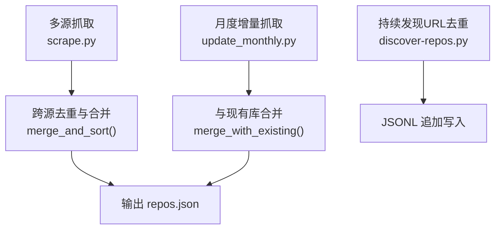
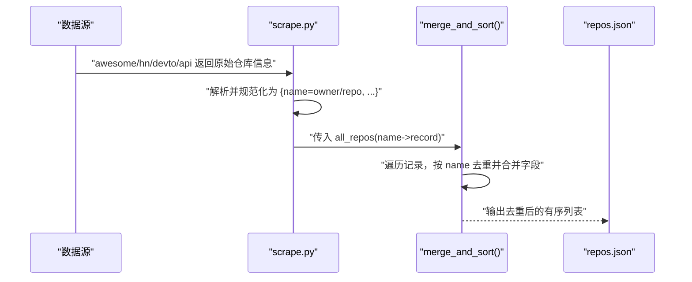
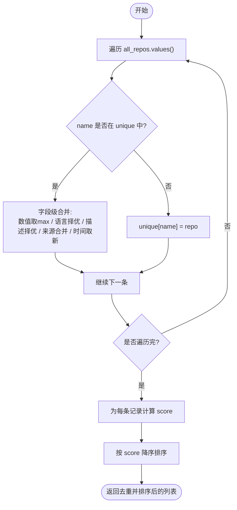
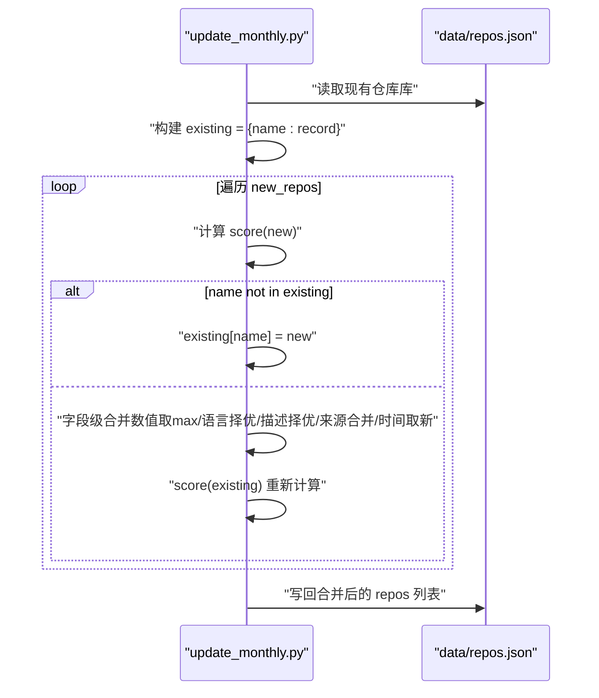
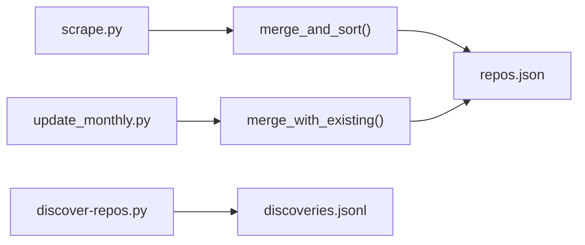

# 去重算法

<cite>
**本文引用的文件**
- [scripts/scrape.py](file://scripts/scrape.py)
- [scripts/update_monthly.py](file://scripts/update_monthly.py)
- [research/mind-coach/discover-repos.py](file://research/mind-coach/discover-repos.py)
- [tests/test_scripts.py](file://tests/test_scripts.py)
</cite>

## 目录
1. [简介](#简介)
2. [项目结构](#项目结构)
3. [核心组件](#核心组件)
4. [架构总览](#架构总览)
5. [详细组件分析](#详细组件分析)
6. [依赖关系分析](#依赖关系分析)
7. [性能考量](#性能考量)
8. [故障排查指南](#故障排查指南)
9. [结论](#结论)
10. [附录](#附录)

## 简介
本技术文档聚焦于仓库中的“去重算法”，围绕以下目标展开：
- 基于仓库名称的精确匹配机制，特别是 full_name 字段的唯一性保证。
- 重复检测策略的实现原理，包括字典键值对的去重逻辑。
- merge_and_sort 函数中的重复处理流程，包括 existing 记录与 new 记录的比较和合并策略。
- 来自不同数据源的相同仓库的处理示例。
- 性能优化考虑，包含时间复杂度与空间复杂度分析。

该项目的多源抓取脚本在多个阶段进行去重：
- 各数据源内部使用 full_name 作为唯一键，避免同一来源内的重复。
- 最终汇总阶段通过 merge_and_sort 执行跨源合并与字段级最大化策略。
- 月度增量更新脚本将新结果与已有数据库进行字段级合并。
- 研究子模块以 URL 为唯一键进行追加式去重。

## 项目结构
与去重相关的关键代码位于以下位置：
- scripts/scrape.py：多源聚合、统一格式、跨源去重与排序。
- scripts/update_monthly.py：按月增量抓取并与 data/repos.json 合并。
- research/mind-coach/discover-repos.py：按 URL 去重的持续发现工具。
- tests/test_scripts.py：覆盖去重与评分等关键行为的单元测试。

图表来源
- [scripts/scrape.py:575-622](file://scripts/scrape.py#L575-L622)
- [scripts/update_monthly.py:167-229](file://scripts/update_monthly.py#L167-L229)
- [research/mind-coach/discover-repos.py:42-109](file://research/mind-coach/discover-repos.py#L42-L109)

章节来源
- [scripts/scrape.py:575-622](file://scripts/scrape.py#L575-L622)
- [scripts/update_monthly.py:167-229](file://scripts/update_monthly.py#L167-L229)
- [research/mind-coach/discover-repos.py:42-109](file://research/mind-coach/discover-repos.py#L42-L109)

## 核心组件
- 唯一键定义与规范化
  - 全名键：full_name 由 owner/repo 拼接而成，作为跨源唯一标识。
  - 标准化：在解析 awesome 列表、HN/DEV.to 链接时，均会提取并规范化为 owner/repo 形式。
- 去重数据结构
  - 字典映射：以 name（即 full_name）为键，值为仓库记录对象。
  - 集合辅助：在各源内使用 set 快速判断是否已见，减少重复请求与格式化开销。
- 合并策略
  - 数值型信号取最大值：stars、forks、today_stars、commit_activity。
  - 文本型字段择优：language 优先非空且非 Unknown；description 优先非空且非占位符。
  - 来源标签合并：source 字段采用集合去重后以 + 连接，保留多源证据。
  - 时间戳更新：fetched_at 取较新的时间。
- 排序与评分
  - 计算 score 后按降序排列，确保热门仓库靠前。

章节来源
- [scripts/scrape.py:546-559](file://scripts/scrape.py#L546-L559)
- [scripts/scrape.py:575-622](file://scripts/scrape.py#L575-L622)
- [scripts/update_monthly.py:137-151](file://scripts/update_monthly.py#L137-L151)
- [scripts/update_monthly.py:167-229](file://scripts/update_monthly.py#L167-L229)
- [research/mind-coach/discover-repos.py:42-56](file://research/mind-coach/discover-repos.py#L42-L56)

## 架构总览
下图展示了从多源抓取到最终去重合并的数据流与控制流。

图表来源
- [scripts/scrape.py:193-240](file://scripts/scrape.py#L193-L240)
- [scripts/scrape.py:268-298](file://scripts/scrape.py#L268-L298)
- [scripts/scrape.py:336-402](file://scripts/scrape.py#L336-L402)
- [scripts/scrape.py:405-461](file://scripts/scrape.py#L405-L461)
- [scripts/scrape.py:464-528](file://scripts/scrape.py#L464-L528)
- [scripts/scrape.py:575-622](file://scripts/scrape.py#L575-L622)

## 详细组件分析

### 基于 full_name 的精确匹配与唯一性保证
- 来源侧去重
  - awesome 列表解析：正则提取 owner/repo，过滤非仓库路径与自我引用，并以 owner/repo 加入集合或字典键。
  - API 搜索：以 r["full_name"] 作为 seen 集合与 api_repos 字典键，避免重复入库。
  - HN/DEV.to：从 URL 中抽取 owner/repo，构造 full_name 后进行存在性检查。
- 唯一性约束
  - 所有入口均以 owner/repo 作为唯一键，确保同一仓库不会在同一来源内重复出现。
  - 跨源合并前，all_repos 字典已由各来源各自去重，再进入 merge_and_sort 做最终合并。

章节来源
- [scripts/scrape.py:149-169](file://scripts/scrape.py#L149-L169)
- [scripts/scrape.py:268-298](file://scripts/scrape.py#L268-L298)
- [scripts/scrape.py:405-461](file://scripts/scrape.py#L405-L461)
- [scripts/scrape.py:464-528](file://scripts/scrape.py#L464-L528)

### 重复检测策略：字典键值对去重
- 设计要点
  - 使用 Python dict 的 O(1) 查找特性，以 name 为键实现高效去重。
  - 在循环中先判 key in dict/set，命中则走合并分支，未命中则新增。
- 典型模式
  - 单源内：seen 集合 + dict[name] = record。
  - 跨源合并：unique[name] = existing 或 new，并在命中时执行字段级合并。

章节来源
- [scripts/scrape.py:268-298](file://scripts/scrape.py#L268-L298)
- [scripts/scrape.py:575-622](file://scripts/scrape.py#L575-L622)

### merge_and_sort 的重复处理流程与合并策略
- 输入：all_repos 字典，键为 name（owner/repo），值为仓库记录。
- 处理步骤
  - 遍历 values()，以 name 为键查表。
  - 若存在：
    - 数值字段取 max(stars/forks/today_stars/commit_activity)。
    - language 优先非空且非 Unknown。
    - description 优先非空且非占位符。
    - source 合并为去重后的有序集合，用 + 连接。
    - fetched_at 取较新的时间。
  - 若不存在：直接插入。
  - 最后为每个记录计算 score，并按 score 降序排序。
- 行为验证
  - 测试用例断言：同名仓库合并后 stars/forks/today_stars 取最大值，source 合并为 “awesome_list+trending”，fetched_at 取较新者。

图表来源
- [scripts/scrape.py:575-622](file://scripts/scrape.py#L575-L622)

章节来源
- [scripts/scrape.py:575-622](file://scripts/scrape.py#L575-L622)
- [tests/test_scripts.py:146-179](file://tests/test_scripts.py#L146-L179)

### 月度增量合并：merge_with_existing
- 读取 data/repos.json，构建 existing 字典（name -> record）。
- 对新抓取的 new_repos 逐条处理：
  - 若 name 不在 existing：新增。
  - 若存在：执行与 merge_and_sort 一致的字段级合并，并重新计算 score。
- 写回 data/repos.json，保持 sources 元信息与 schema_version。

图表来源
- [scripts/update_monthly.py:167-229](file://scripts/update_monthly.py#L167-L229)

章节来源
- [scripts/update_monthly.py:167-229](file://scripts/update_monthly.py#L167-L229)

### 持续发现：基于 URL 的去重
- 加载 discoveries.jsonl，维护一个 seen_url 集合。
- 每次查询结果按 url 去重，仅追加新发现的记录。
- 适合长期增量采集场景，避免重复写入。

章节来源
- [research/mind-coach/discover-repos.py:42-56](file://research/mind-coach/discover-repos.py#L42-L56)
- [research/mind-coach/discover-repos.py:79-109](file://research/mind-coach/discover-repos.py#L79-L109)

### 来自不同数据源的相同仓库处理示例
- 场景说明
  - 同一仓库 a/b 出现在 awesome_list 与 trending 两个来源。
  - awesome_list 提供 stars=1000，trending 提供 today_stars=80。
- 合并结果
  - stars 取 max(1000, 900)=1000。
  - forks 取 max(100, 200)=200。
  - today_stars 取 max(0, 80)=80。
  - source 合并为 "awesome_list+trending"。
  - fetched_at 取较新的时间戳。
- 行为验证
  - 测试用例明确断言上述合并规则。

章节来源
- [tests/test_scripts.py:146-179](file://tests/test_scripts.py#L146-L179)

## 依赖关系分析
- 模块耦合
  - scrape.py 负责多源抓取与最终合并，是去重主流程的核心。
  - update_monthly.py 复用相同的合并语义，面向增量场景。
  - discover-repos.py 独立运行，以 URL 为键进行追加式去重。
- 外部依赖
  - requests 用于 HTTP 请求与重试策略。
  - JSON/JSONL 持久化存储。
- 潜在风险
  - 命名规范一致性：必须保证所有来源输出的 name 均为 owner/repo 形式，否则无法正确去重。
  - 字段缺失：当某些字段为空或缺失时，合并逻辑需有默认值保护（如 get("field", 0)）。

图表来源
- [scripts/scrape.py:575-622](file://scripts/scrape.py#L575-L622)
- [scripts/update_monthly.py:167-229](file://scripts/update_monthly.py#L167-L229)
- [research/mind-coach/discover-repos.py:42-109](file://research/mind-coach/discover-repos.py#L42-L109)

章节来源
- [scripts/scrape.py:575-622](file://scripts/scrape.py#L575-L622)
- [scripts/update_monthly.py:167-229](file://scripts/update_monthly.py#L167-L229)
- [research/mind-coach/discover-repos.py:42-109](file://research/mind-coach/discover-repos.py#L42-L109)

## 性能考量
- 时间复杂度
  - 单源内去重：O(N)，N 为该源返回的记录数。
  - 跨源合并 merge_and_sort：O(M)，M 为合并前的总记录数（dict 插入与查找近似 O(1)）。
  - 排序：O(K log K)，K 为去重后的唯一仓库数量。
  - 月度增量合并：O(P + Q)，P 为现有库大小，Q 为新抓取数量（构建 existing 字典 O(P)，遍历 new_repos O(Q)）。
- 空间复杂度
  - 单源去重：O(N)。
  - 跨源合并：O(M) 存储 all_repos，O(K) 存储 unique。
  - 月度增量：O(P + Q) 存储 existing 与 new_repos。
- 优化建议
  - 预去重：在各源内部尽量使用 dict/set 去重，减少后续合并压力。
  - 惰性计算：仅在必要时计算 score，避免重复计算。
  - 批量写入：合并完成后一次性写入磁盘，减少 I/O 次数。
  - 并发控制：API 调用增加退避与限流，避免触发速率限制导致整体耗时上升。

[本节为通用性能讨论，不直接分析具体文件]

## 故障排查指南
- 常见问题
  - 命中 GitHub API 速率限制：检查是否设置 GITHUB_TOKEN，确认重试与退避配置生效。
  - 页面无法加载数据：需通过 HTTP 服务器访问，浏览器禁止 file:// 协议下的 fetch。
  - 去重异常：确认所有来源输出的 name 字段均为 owner/repo 形式，避免大小写或路径差异导致误判。
- 定位方法
  - 查看日志输出：各抓取阶段打印了收集到的仓库数量与状态码。
  - 检查中间产物：data/repos.json 的结构与 schema_version 是否符合预期。
  - 运行测试：pytest 覆盖去重与评分逻辑，可快速验证合并行为。

章节来源
- [README.md:166-176](file://README.md#L166-L176)
- [tests/test_scripts.py:146-179](file://tests/test_scripts.py#L146-L179)

## 结论
本项目在多源抓取场景中实现了稳健的去重与合并机制：
- 以 full_name（owner/repo）作为唯一键，确保精确匹配与唯一性。
- 通过字典键值对的高效去重与字段级合并策略，保证跨源数据的完整性与准确性。
- 月度增量与持续发现分别适配不同的业务需求，兼顾效率与可扩展性。
- 测试覆盖关键行为，便于回归与维护。

[本节为总结性内容，不直接分析具体文件]

## 附录
- 术语
  - full_name：owner/repo 形式的仓库唯一标识。
  - 字段级合并：对多条同源或跨源记录，按字段类型选择最优值进行合并。
- 参考实现路径
  - 跨源去重与合并：[scripts/scrape.py:575-622](file://scripts/scrape.py#L575-L622)
  - 月度增量合并：[scripts/update_monthly.py:167-229](file://scripts/update_monthly.py#L167-L229)
  - URL 去重追加：[research/mind-coach/discover-repos.py:42-109](file://research/mind-coach/discover-repos.py#L42-L109)
  - 去重行为测试：[tests/test_scripts.py:146-179](file://tests/test_scripts.py#L146-L179)