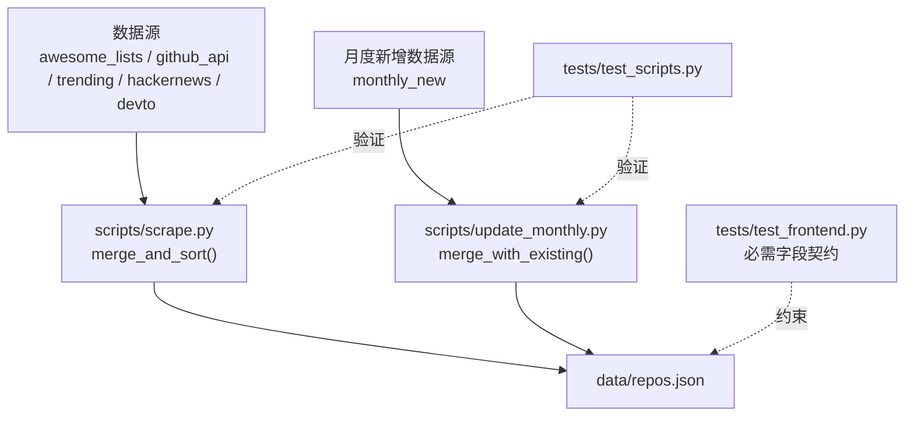
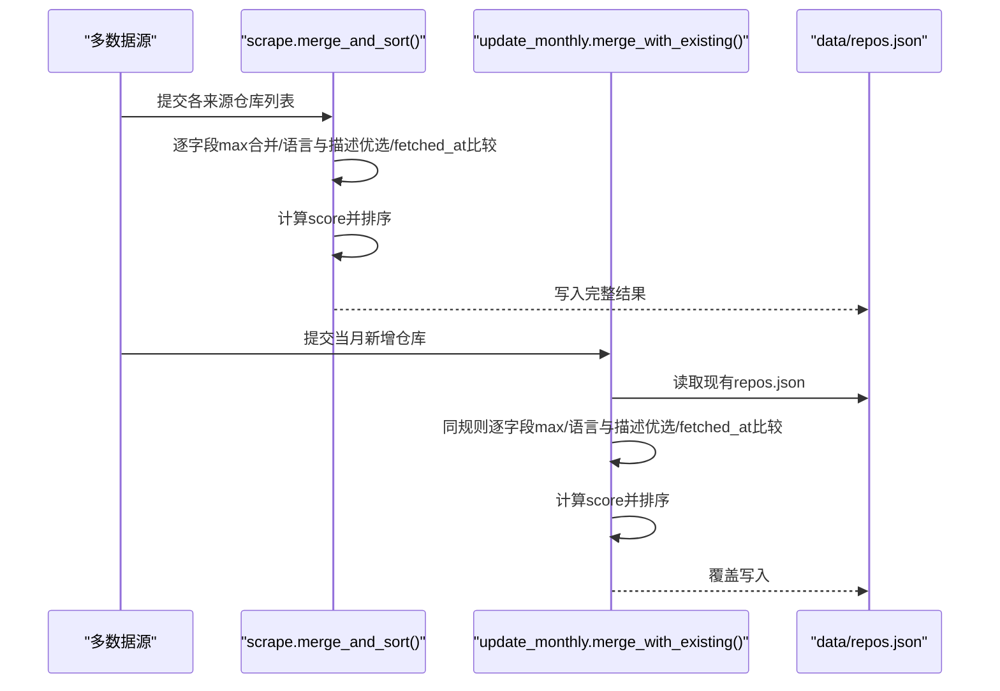
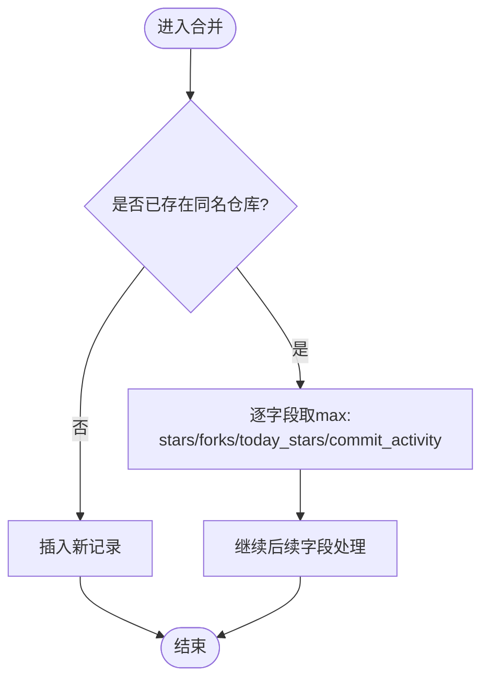
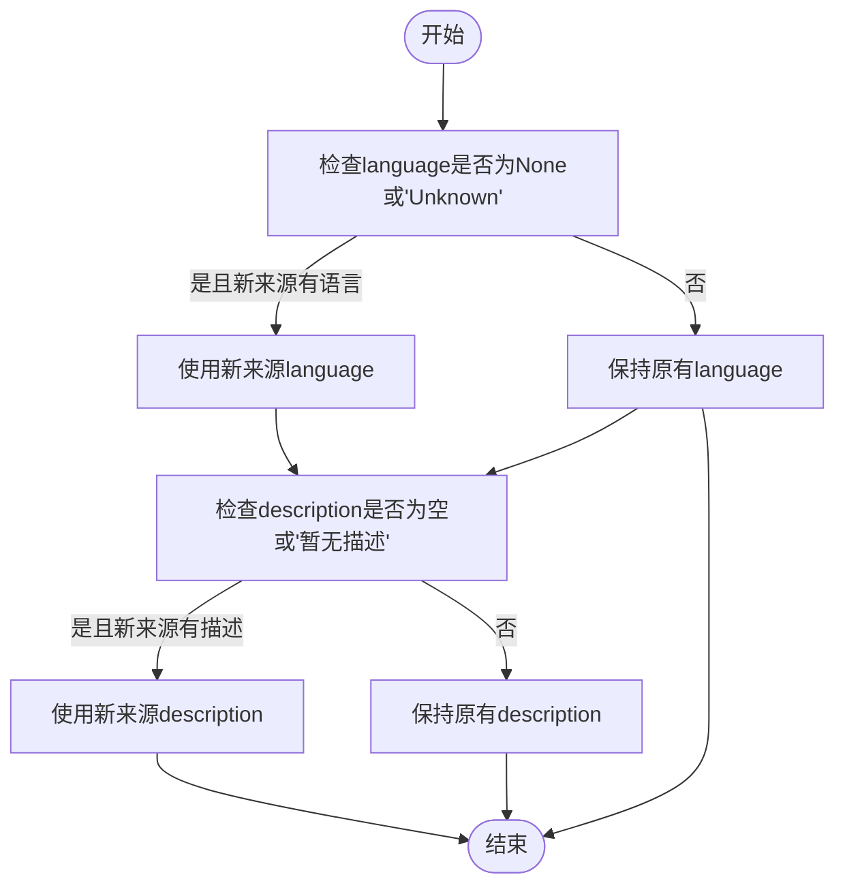
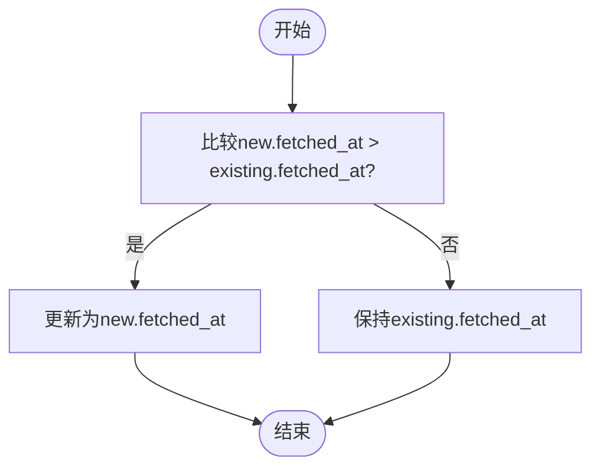
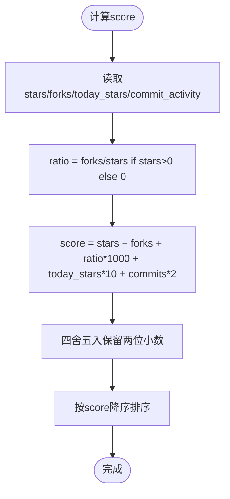
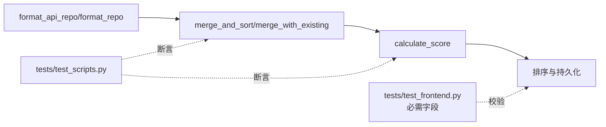

# 字段合并规则

<cite>
**本文引用的文件**
- [scripts/scrape.py](file://scripts/scrape.py)
- [scripts/update_monthly.py](file://scripts/update_monthly.py)
- [tests/test_scripts.py](file://tests/test_scripts.py)
- [tests/test_frontend.py](file://tests/test_frontend.py)
</cite>

## 目录
1. [引言](#引言)
2. [项目结构](#项目结构)
3. [核心组件](#核心组件)
4. [架构总览](#架构总览)
5. [详细组件分析](#详细组件分析)
6. [依赖关系分析](#依赖关系分析)
7. [性能考量](#性能考量)
8. [故障排查指南](#故障排查指南)
9. [结论](#结论)
10. [附录](#附录)

## 引言
本文件聚焦于仓库中“多数据源仓库信息”的字段合并规则，系统性说明：
- 数值型信号字段（stars、forks、today_stars、commit_activity）的最大值选择策略
- 字符串字段（language、description）的优先级与空值处理逻辑
- 时间戳字段（fetched_at）的比较与更新条件
- 典型融合场景示例
- 设计原则与业务考量

该规则贯穿两个关键流程：
- 全量抓取后的合并排序（scrape.py）
- 月度增量入库时的就地合并（update_monthly.py）

## 项目结构
与字段合并直接相关的代码集中在脚本层：
- scripts/scrape.py：多源抓取后统一合并、去重、打分与排序
- scripts/update_monthly.py：按月增量抓取并与已有 data/repos.json 进行字段级合并
- tests/test_scripts.py：对合并与打分等关键逻辑的单元测试
- tests/test_frontend.py：定义前端消费的数据字段契约（schema）

图表来源
- [scripts/scrape.py:575-622](file://scripts/scrape.py#L575-L622)
- [scripts/update_monthly.py:167-229](file://scripts/update_monthly.py#L167-L229)
- [tests/test_scripts.py:146-178](file://tests/test_scripts.py#L146-L178)
- [tests/test_frontend.py:15-18](file://tests/test_frontend.py#L15-L18)

章节来源
- [scripts/scrape.py:575-622](file://scripts/scrape.py#L575-L622)
- [scripts/update_monthly.py:167-229](file://scripts/update_monthly.py#L167-L229)
- [tests/test_scripts.py:146-178](file://tests/test_scripts.py#L146-L178)
- [tests/test_frontend.py:15-18](file://tests/test_frontend.py#L15-L18)

## 核心组件
- 数值字段最大值策略
  - stars、forks、today_stars、commit_activity 在合并时采用逐字段取 max 的策略，确保同一仓库在不同来源下的最强信号被保留。
- 字符串字段优先级策略
  - language：若现有记录为 None 或 "Unknown"，则优先使用新来源提供的语言；否则保持原值。
  - description：若现有描述为空或占位符“暂无描述”，且新来源提供非空描述，则替换为新描述。
- 时间戳字段更新策略
  - fetched_at：仅当新来源的时间戳严格大于现有记录时才更新，保证“最新采集时间”的正确性。
- 评分计算与排序
  - 合并完成后按统一的评分公式重新计算 score，并降序排列，使跨来源聚合后的仓库质量更优。

章节来源
- [scripts/scrape.py:575-622](file://scripts/scrape.py#L575-L622)
- [scripts/update_monthly.py:167-229](file://scripts/update_monthly.py#L167-L229)
- [scripts/scrape.py:562-572](file://scripts/scrape.py#L562-L572)
- [scripts/update_monthly.py:154-164](file://scripts/update_monthly.py#L154-L164)

## 架构总览
下图展示从多源汇聚到最终持久化的整体流程，以及字段合并的关键节点。

图表来源
- [scripts/scrape.py:575-622](file://scripts/scrape.py#L575-L622)
- [scripts/update_monthly.py:167-229](file://scripts/update_monthly.py#L167-L229)

## 详细组件分析

### 数值字段最大值策略（stars、forks、today_stars、commit_activity）
- 规则要点
  - 对每个重复仓库名，逐字段执行 max(existing, new)，避免丢失更强的信号。
  - 缺失字段默认按 0 参与比较，防止 None 导致异常。
- 适用场景
  - 同一仓库出现在多个来源（如 awesome_list 与 trending），取各自最强的指标。
- 复杂度
  - 单次合并 O(1) 每字段；总体 O(N) 遍历 N 个候选仓库。
- 边界情况
  - 当某来源未提供 commit_activity 时，视为 0，不影响其他来源的有效值。

图表来源
- [scripts/scrape.py:588-596](file://scripts/scrape.py#L588-L596)
- [scripts/update_monthly.py:191-194](file://scripts/update_monthly.py#L191-L194)

章节来源
- [scripts/scrape.py:588-596](file://scripts/scrape.py#L588-L596)
- [scripts/update_monthly.py:191-194](file://scripts/update_monthly.py#L191-L194)
- [tests/test_scripts.py:174-176](file://tests/test_scripts.py#L174-L176)

### 字符串字段优先级（language、description）
- language 字段
  - 若现有值为 None 或 "Unknown"，且新来源提供了有效语言，则替换为新语言。
  - 目的：尽可能填充未知语言，提升分类与筛选体验。
- description 字段
  - 若现有描述为空或等于占位符“暂无描述”，且新来源提供非空描述，则替换为新描述。
  - 目的：用更丰富的描述替代占位文本，改善可读性与搜索匹配。
- 注意
  - 一旦已有语言或描述不为空且非占位符，将不再被覆盖，避免破坏已有高质量信息。

图表来源
- [scripts/scrape.py:597-605](file://scripts/scrape.py#L597-L605)
- [scripts/update_monthly.py:195-198](file://scripts/update_monthly.py#L195-L198)

章节来源
- [scripts/scrape.py:597-605](file://scripts/scrape.py#L597-L605)
- [scripts/update_monthly.py:195-198](file://scripts/update_monthly.py#L195-L198)

### 时间戳字段更新策略（fetched_at）
- 规则要点
  - 仅当新来源的 fetched_at 严格大于现有记录时才更新。
  - 用于反映“最近一次成功采集时间”，便于前端展示数据新鲜度。
- 边界情况
  - 若任一来源缺少 fetched_at，按空串比较，不会错误覆盖。

图表来源
- [scripts/scrape.py:610-611](file://scripts/scrape.py#L610-L611)
- [scripts/update_monthly.py:206-207](file://scripts/update_monthly.py#L206-L207)

章节来源
- [scripts/scrape.py:610-611](file://scripts/scrape.py#L610-L611)
- [scripts/update_monthly.py:206-207](file://scripts/update_monthly.py#L206-L207)

### 评分计算与排序
- 评分公式（两脚本一致）
  - score = stars + forks + (forks/stars)*1000 + today_stars*10 + commit_activity*2
  - 当 stars=0 时，fork_ratio 按 0 处理，避免除零。
- 排序
  - 合并完成后按 score 降序排列，确保跨来源聚合后的仓库质量更优。

图表来源
- [scripts/scrape.py:562-572](file://scripts/scrape.py#L562-L572)
- [scripts/update_monthly.py:154-164](file://scripts/update_monthly.py#L154-L164)

章节来源
- [scripts/scrape.py:562-572](file://scripts/scrape.py#L562-L572)
- [scripts/update_monthly.py:154-164](file://scripts/update_monthly.py#L154-L164)
- [tests/test_scripts.py:39-54](file://tests/test_scripts.py#L39-L54)

### 典型融合场景示例
以下示例基于测试用例与实现逻辑归纳，帮助理解不同来源数据的融合过程。

- 场景一：同一仓库来自 awesome_list 与 trending
  - 输入
    - r1: stars=1000, forks=100, today_stars=0, source="awesome_list", fetched_at="2026-01-01"
    - r2: stars=900, forks=200, today_stars=80, source="trending", fetched_at="2026-06-01"
  - 合并结果
    - stars=1000（取max）
    - forks=200（取max）
    - today_stars=80（取max）
    - source="awesome_list+trending"（合并来源标签）
    - fetched_at="2026-06-01"（取较新时间）
    - score 按公式重新计算并排序
  - 依据
    - 字段级max与source合并、时间比较与score重算

- 场景二：语言与描述的“补全”
  - 输入
    - 现有记录: language="Unknown", description="暂无描述"
    - 新来源: language="Python", description="一个优秀的工具库"
  - 合并结果
    - language 替换为 "Python"
    - description 替换为 "一个优秀的工具库"
  - 依据
    - language 与 description 的优先级与空值替换规则

- 场景三：仅更新 fetched_at
  - 输入
    - 现有: fetched_at="2026-01-01"
    - 新来源: fetched_at="2026-06-01"
  - 合并结果
    - fetched_at 更新为 "2026-06-01"
  - 依据
    - 严格大于才更新的策略

章节来源
- [tests/test_scripts.py:146-178](file://tests/test_scripts.py#L146-L178)
- [scripts/scrape.py:588-611](file://scripts/scrape.py#L588-L611)
- [scripts/update_monthly.py:191-207](file://scripts/update_monthly.py#L191-L207)

## 依赖关系分析
- 模块耦合
  - scrape.merge_and_sort 与 update_monthly.merge_with_existing 遵循相同的字段合并语义，形成一致的跨流程行为。
- 外部依赖
  - GitHub API 返回的原始字段经 format_api_repo/format_repo 映射为标准字段，再进入合并流程。
- 前端契约
  - tests/test_frontend.py 定义了必须存在的字段集合，确保后端合并输出满足前端消费需求。

图表来源
- [scripts/scrape.py:546-559](file://scripts/scrape.py#L546-L559)
- [scripts/update_monthly.py:137-151](file://scripts/update_monthly.py#L137-L151)
- [scripts/scrape.py:562-572](file://scripts/scrape.py#L562-L572)
- [scripts/update_monthly.py:154-164](file://scripts/update_monthly.py#L154-L164)
- [tests/test_scripts.py:146-178](file://tests/test_scripts.py#L146-L178)
- [tests/test_frontend.py:15-18](file://tests/test_frontend.py#L15-L18)

章节来源
- [scripts/scrape.py:546-559](file://scripts/scrape.py#L546-L559)
- [scripts/update_monthly.py:137-151](file://scripts/update_monthly.py#L137-L151)
- [tests/test_frontend.py:15-18](file://tests/test_frontend.py#L15-L18)

## 性能考量
- 时间复杂度
  - merge_and_sort/merge_with_existing 均为线性扫描，O(N) 次字典查找与常数时间的字段比较。
- I/O 成本
  - 月度增量模式会读写 data/repos.json，建议在高并发场景下考虑锁或原子写入。
- 可扩展性
  - 当前规则简单直观，易于扩展新的数值字段（加入 max 比较）或字符串字段（补充优先级逻辑）。

[本节为通用指导，不直接分析具体文件]

## 故障排查指南
- 常见问题
  - 字段缺失：若某些来源未提供 commit_activity 或 today_stars，合并时会以 0 参与比较，不会报错。
  - 语言未知：若所有来源均返回 Unknown，则最终仍为 Unknown，需检查上游数据源。
  - 描述占位符：若所有来源均未提供真实描述，将保留“暂无描述”。
  - 时间戳异常：若 fetched_at 格式不一致，字符串比较可能不符合预期，应确保 ISO 格式。
- 定位方法
  - 通过单元测试快速验证合并与打分逻辑是否符合预期。
  - 检查 data/repos.json 中的 schema_version、sources、criteria 等元信息，确认数据来源与版本。

章节来源
- [tests/test_scripts.py:39-54](file://tests/test_scripts.py#L39-L54)
- [tests/test_scripts.py:146-178](file://tests/test_scripts.py#L146-L178)
- [scripts/scrape.py:629-649](file://scripts/scrape.py#L629-L649)
- [scripts/update_monthly.py:216-228](file://scripts/update_monthly.py#L216-L228)

## 结论
本项目的字段合并规则以“强信号优先、丰富信息优先、最新时间优先”为核心原则：
- 数值信号取最大，避免低估仓库热度
- 语言与描述优先补全，提升可发现性与可读性
- 时间戳严格比较，保障数据新鲜度
- 统一评分与排序，确保跨来源聚合后的质量一致性

这些规则在多源抓取与月度增量两种模式下保持一致，并通过单元测试与前端契约进行约束与验证。

[本节为总结性内容，不直接分析具体文件]

## 附录
- 数据字段契约（前端必需字段）
  - name、url、description、stars、forks、language、today_stars、score、fetched_at、source
- 相关函数路径
  - 合并与排序：scripts/scrape.py::merge_and_sort、scripts/update_monthly.py::merge_with_existing
  - 评分计算：scripts/scrape.py::calculate_score、scripts/update_monthly.py::calculate_score
  - 格式化入口：scripts/scrape.py::format_api_repo、scripts/update_monthly.py::format_repo

章节来源
- [tests/test_frontend.py:15-18](file://tests/test_frontend.py#L15-L18)
- [scripts/scrape.py:575-622](file://scripts/scrape.py#L575-L622)
- [scripts/update_monthly.py:167-229](file://scripts/update_monthly.py#L167-L229)
- [scripts/scrape.py:562-572](file://scripts/scrape.py#L562-L572)
- [scripts/update_monthly.py:154-164](file://scripts/update_monthly.py#L154-L164)
- [scripts/scrape.py:546-559](file://scripts/scrape.py#L546-L559)
- [scripts/update_monthly.py:137-151](file://scripts/update_monthly.py#L137-L151)