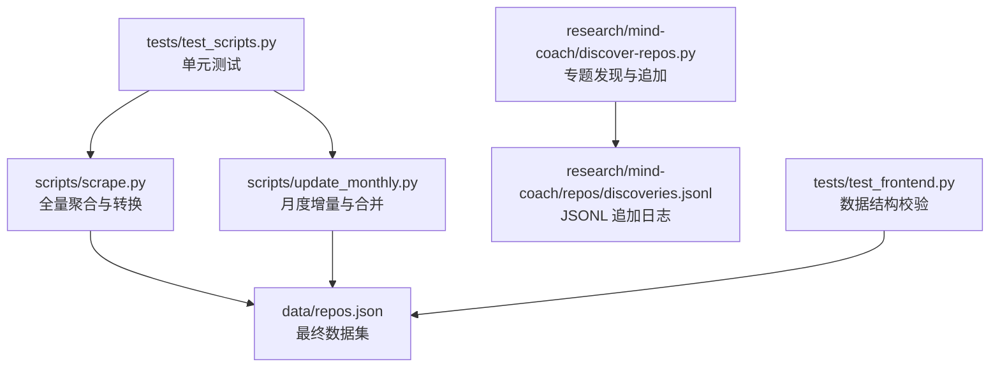
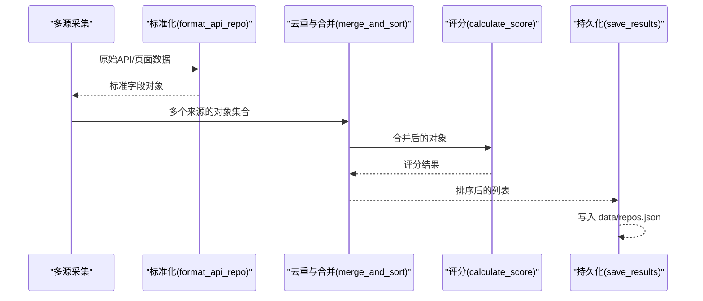
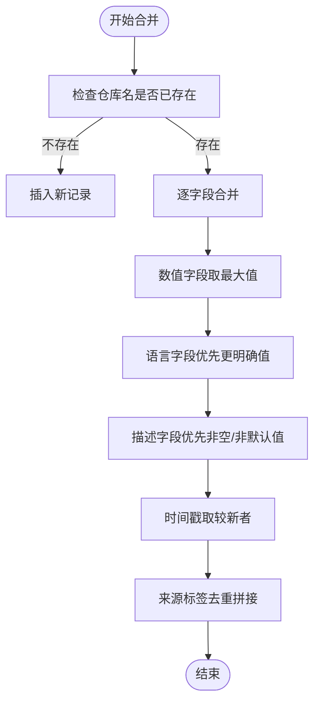
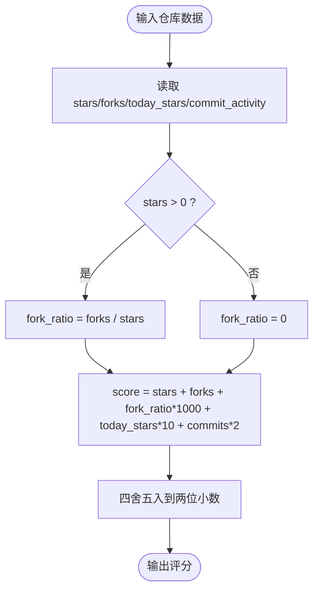
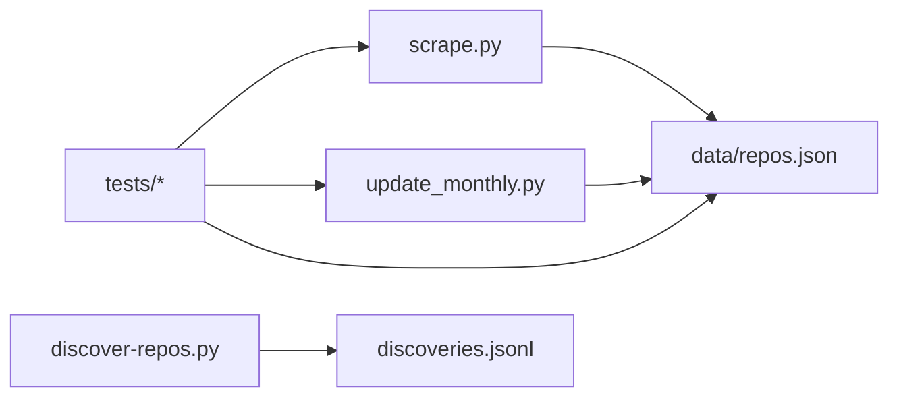

# 数据转换层

<cite>
**本文引用的文件**   
- [scripts/scrape.py](file://scripts/scrape.py)
- [scripts/update_monthly.py](file://scripts/update_monthly.py)
- [research/mind-coach/discover-repos.py](file://research/mind-coach/discover-repos.py)
- [tests/test_scripts.py](file://tests/test_scripts.py)
- [tests/test_frontend.py](file://tests/test_frontend.py)
- [README.md](file://README.md)
</cite>

## 目录
1. [引言](#引言)
2. [项目结构](#项目结构)
3. [核心组件](#核心组件)
4. [架构总览](#架构总览)
5. [详细组件分析](#详细组件分析)
6. [依赖关系分析](#依赖关系分析)
7. [性能考量](#性能考量)
8. [故障排查指南](#故障排查指南)
9. [结论](#结论)
10. [附录](#附录)

## 引言
本技术文档聚焦于“数据转换层”，围绕仓库级数据的清洗、去重与标准化流程展开，重点解释：
- 重复检测策略（基于仓库名称的精确匹配）
- 字段合并规则（数值取最大值、字符串优先级选择、时间戳更新策略）
- 评分算法（多维度加权计算、活跃度估算模型）
- 数据验证规则与异常处理流程

该转换层由多源采集脚本共同实现，包括全量聚合脚本、月度增量脚本以及专题发现脚本。其目标是将来自 Awesome Lists、GitHub Search API、Hacker News、DEV.to 等多渠道的数据统一为一致的结构化数据集，并输出到 data/repos.json 供前端展示与分析使用。

## 项目结构
与数据转换层直接相关的代码位于 scripts/ 与 research/mind-coach/ 下，测试覆盖在 tests/ 中，说明性信息在 README.md 中。

图表来源
- [scripts/scrape.py:574-622](file://scripts/scrape.py#L574-L622)
- [scripts/update_monthly.py:166-229](file://scripts/update_monthly.py#L166-L229)
- [research/mind-coach/discover-repos.py:79-109](file://research/mind-coach/discover-repos.py#L79-L109)
- [tests/test_scripts.py:145-200](file://tests/test_scripts.py#L145-L200)
- [tests/test_frontend.py:47-51](file://tests/test_frontend.py#L47-L51)

章节来源
- [README.md:123-148](file://README.md#L123-L148)

## 核心组件
- 数据格式与标准化
  - 所有来源通过统一的格式化函数将原始响应映射为标准字段集合，确保后续合并与排序的一致性。
- 重复检测与字段合并
  - 以仓库名称作为唯一键进行精确匹配；对数值型信号字段采用逐字段取最大值；对语言与描述等文本字段采用“更完整优先”的策略；来源标签进行去重拼接；时间戳按较新者覆盖。
- 评分与活跃度估算
  - 评分包含星标、分叉、分叉比率、当日星标估算、近四周提交活动等多个维度；活跃度估算基于推送时间与创建时间的相对关系，并结合近期热度进行修正。
- 数据验证与异常处理
  - 通过单元测试保障关键函数的行为正确性与边界条件；前端数据完整性测试保证输出 JSON 结构与必填字段存在；网络请求具备重试与限流处理。

章节来源
- [scripts/scrape.py:546-573](file://scripts/scrape.py#L546-L573)
- [scripts/scrape.py:574-622](file://scripts/scrape.py#L574-L622)
- [scripts/update_monthly.py:154-229](file://scripts/update_monthly.py#L154-L229)
- [tests/test_scripts.py:39-55](file://tests/test_scripts.py#L39-L55)
- [tests/test_scripts.py:145-200](file://tests/test_scripts.py#L145-L200)
- [tests/test_frontend.py:47-51](file://tests/test_frontend.py#L47-L51)

## 架构总览
数据转换层整体流程如下：
- 多源采集：Awesome Lists、GitHub API、Trending、Hacker News、DEV.to
- 标准化：各来源数据经格式化函数转换为统一 schema
- 合并去重：按仓库名精确匹配，逐字段合并与优先级选择
- 评分与排序：计算多维评分并按降序排列
- 持久化：写入 data/repos.json，附带元数据（schema_version、fetched_at、sources、criteria、total）

图表来源
- [scripts/scrape.py:546-573](file://scripts/scrape.py#L546-L573)
- [scripts/scrape.py:574-622](file://scripts/scrape.py#L574-L622)
- [scripts/scrape.py:625-649](file://scripts/scrape.py#L625-L649)

## 详细组件分析

### 数据清洗与标准化
- 输入来源
  - Awesome Lists：解析 Markdown 链接，提取 owner/repo，过滤非仓库路径与自引用，限制数量上限。
  - GitHub API：搜索与详情接口返回结构化 JSON。
  - Hacker News / DEV.to：从文章或帖子中提取 GitHub URL，再调用 GitHub API 获取详情。
- 标准化过程
  - 统一字段集合：name、url、description、stars、forks、language、today_stars、score、fetched_at、source。
  - 缺失值填充：description 默认“暂无描述”，language 默认“Unknown”。
  - 初始 score 赋值：暂用 stars 作为占位，后续合并阶段会重新计算。
- 复杂度与健壮性
  - 正则表达式用于 URL 提取，避免无效链接进入下游。
  - 对空值与异常状态码进行容错处理，避免中断主流程。

章节来源
- [scripts/scrape.py:149-169](file://scripts/scrape.py#L149-L169)
- [scripts/scrape.py:172-191](file://scripts/scrape.py#L172-L191)
- [scripts/scrape.py:546-559](file://scripts/scrape.py#L546-L559)
- [scripts/scrape.py:405-461](file://scripts/scrape.py#L405-L461)
- [scripts/scrape.py:464-528](file://scripts/scrape.py#L464-L528)

### 重复检测策略
- 精确匹配
  - 以仓库名称（owner/repo）作为唯一键进行精确匹配，不实现模糊匹配。
  - 当同一仓库出现在多个来源时，视为重复项并进行字段合并。
- 去重位置
  - 全量聚合：merge_and_sort 中对 all_repos 字典进行 key=name 的去重与合并。
  - 月度增量：merge_with_existing 读取已有 repos.json，按 name 合并新增记录。
  - 专题发现：discover-repos.py 基于 URL 去重，仅追加新发现记录到 discoveries.jsonl。

章节来源
- [scripts/scrape.py:574-622](file://scripts/scrape.py#L574-L622)
- [scripts/update_monthly.py:166-229](file://scripts/update_monthly.py#L166-L229)
- [research/mind-coach/discover-repos.py:79-109](file://research/mind-coach/discover-repos.py#L79-L109)

### 字段合并规则
- 数值字段取最大值
  - stars、forks、today_stars、commit_activity 均取现有值与新值的较大者，确保信号强度不被低估。
- 字符串字段优先级选择
  - language：若现有值为 None 或 “Unknown”，则替换为新值，优先保留更明确的语言信息。
  - description：若现有值为空或默认“暂无描述”，且新值存在，则替换为新描述，提升可读性。
- 时间戳更新策略
  - fetched_at：比较新旧时间戳，保留较新的时间，反映最近一次抓取时间。
- 来源标签合并
  - source 字段支持多来源拼接（如 awesome_list+trending），去重后按字母顺序连接，便于溯源。

图表来源
- [scripts/scrape.py:574-622](file://scripts/scrape.py#L574-L622)
- [scripts/update_monthly.py:166-229](file://scripts/update_monthly.py#L166-L229)

章节来源
- [scripts/scrape.py:574-622](file://scripts/scrape.py#L574-L622)
- [scripts/update_monthly.py:166-229](file://scripts/update_monthly.py#L166-L229)

### 评分算法与活跃度估算
- 评分公式
  - score = stars + forks + (forks/stars)*1000 + today_stars*10 + commit_activity*2
  - 其中 fork_ratio 在 stars=0 时置零以避免除零错误。
- 活跃度估算（today_stars）
  - 基于 pushed_at 与 created_at 的时间差，设置不同时间窗口的 push_score。
  - 对于新仓库（创建天数小于阈值）且星标较高时，给予额外加分，模拟“病毒式增长”。
  - 针对热门候选仓库，可选地查询 stats/commit_activity 以补充真实活跃度信号。
- 一致性保障
  - scrape.py 与 update_monthly.py 中的 calculate_score 保持一致，确保全量与增量场景下的评分可比性。

图表来源
- [scripts/scrape.py:562-573](file://scripts/scrape.py#L562-L573)
- [scripts/update_monthly.py:154-165](file://scripts/update_monthly.py#L154-L165)

章节来源
- [scripts/scrape.py:301-334](file://scripts/scrape.py#L301-L334)
- [scripts/scrape.py:562-573](file://scripts/scrape.py#L562-L573)
- [scripts/update_monthly.py:154-165](file://scripts/update_monthly.py#L154-L165)
- [README.md:109-120](file://README.md#L109-L120)

### 数据验证规则与异常处理
- 数据验证
  - 前端测试要求每个仓库对象必须包含必需字段集合，确保下游渲染与交互正常。
  - 月度报告生成逻辑依赖 month_tag 与语言统计，需保证字段存在与可解析。
- 异常处理
  - 网络请求：使用带重试与指数退避的会话适配器，对 429/5xx 进行自动重试；遇到限流提示时主动休眠。
  - 解析异常：parse_num 对非法数字返回 0；日期解析失败时活跃度估算返回 0；JSONL 加载跳过畸形行。
  - 文件操作：保存前确保 data 目录存在；读写异常被捕获并打印错误信息。

章节来源
- [tests/test_frontend.py:47-51](file://tests/test_frontend.py#L47-L51)
- [scripts/scrape.py:114-131](file://scripts/scrape.py#L114-L131)
- [scripts/scrape.py:531-544](file://scripts/scrape.py#L531-L544)
- [research/mind-coach/discover-repos.py:42-56](file://research/mind-coach/discover-repos.py#L42-L56)
- [scripts/scrape.py:625-649](file://scripts/scrape.py#L625-L649)

## 依赖关系分析
- 模块耦合
  - scrape.py 与 update_monthly.py 共享评分公式与合并策略，保持跨运行的一致性。
  - discover-repos.py 独立维护 discoveries.jsonl，不与 repos.json 直接耦合，降低耦合度。
- 外部依赖
  - requests 用于 HTTP 请求；urllib3 Retry 提供重试能力；datetime 用于时间计算。
- 潜在循环依赖
  - 当前脚本之间无相互导入，不存在循环依赖风险。

图表来源
- [scripts/scrape.py:625-649](file://scripts/scrape.py#L625-L649)
- [scripts/update_monthly.py:216-229](file://scripts/update_monthly.py#L216-L229)
- [research/mind-coach/discover-repos.py:79-109](file://research/mind-coach/discover-repos.py#L79-L109)
- [tests/test_scripts.py:1-16](file://tests/test_scripts.py#L1-L16)
- [tests/test_frontend.py:1-14](file://tests/test_frontend.py#L1-L14)

章节来源
- [scripts/scrape.py:1-20](file://scripts/scrape.py#L1-L20)
- [scripts/update_monthly.py:1-24](file://scripts/update_monthly.py#L1-L24)
- [research/mind-coach/discover-repos.py:1-20](file://research/mind-coach/discover-repos.py#L1-L20)

## 性能考量
- 去重与合并
  - 使用字典按仓库名索引，时间复杂度 O(n)，适合大规模数据合并。
- 网络请求
  - 会话复用与重试机制减少失败率与延迟；限流休眠避免触发 API 配额。
- 评分计算
  - 评分公式为常数时间操作，批量计算开销低。
- I/O 优化
  - 写入 JSON 时使用 ensure_ascii=False 与缩进，兼顾可读性与体积；大文件标记为二进制以减少 Git 噪音。

[本节为通用指导，无需具体文件分析]

## 故障排查指南
- 常见问题
  - 页面无法加载数据：需在 HTTP 服务器环境下访问，浏览器禁止 file:// 协议下的 fetch。
  - 触发 GitHub 限流：配置 GITHUB_TOKEN 提高配额；脚本内置限流提示与休眠。
  - 数据缺失字段：前端测试会报错，检查 format_api_repo 与 merge 逻辑是否覆盖默认值。
- 定位步骤
  - 查看控制台错误信息与脚本输出日志。
  - 检查 data/repos.json 的 schema_version 与 repos 数组是否为空。
  - 运行 pytest 用例确认 parse_num、calculate_score、merge_and_sort 等行为符合预期。

章节来源
- [README.md:164-176](file://README.md#L164-L176)
- [tests/test_scripts.py:39-55](file://tests/test_scripts.py#L39-L55)
- [tests/test_scripts.py:145-200](file://tests/test_scripts.py#L145-L200)
- [tests/test_frontend.py:47-51](file://tests/test_frontend.py#L47-L51)

## 结论
数据转换层通过严格的标准化、精确匹配去重、逐字段合并与一致的评分算法，实现了多源数据的高质量整合。其设计强调可维护性与可扩展性：新增来源只需遵循统一 schema 并在合并阶段自然融合；评分与活跃度估算模型为趋势识别提供了可靠依据；完善的测试与异常处理保障了系统的稳健运行。未来可在以下方面增强：
- 引入模糊匹配以提升跨来源同义仓库的合并精度
- 扩展活跃度估算模型，结合更多指标（如 issue 活跃度、PR 合并频率）
- 增加数据质量评分与异常告警机制

[本节为总结性内容，无需具体文件分析]

## 附录
- 数据字段定义（必需字段）
  - name：仓库全称（owner/repo）
  - url：仓库 HTML 地址
  - description：仓库描述（默认“暂无描述”）
  - stars：星标数
  - forks：分叉数
  - language：编程语言（默认“Unknown”）
  - today_stars：当日星标估算
  - score：综合评分
  - fetched_at：抓取时间戳
  - source：数据来源标签（可拼接）

章节来源
- [tests/test_frontend.py:15-18](file://tests/test_frontend.py#L15-L18)
- [scripts/scrape.py:546-559](file://scripts/scrape.py#L546-L559)