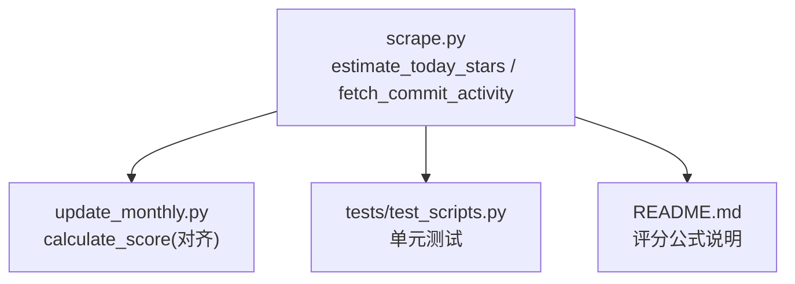
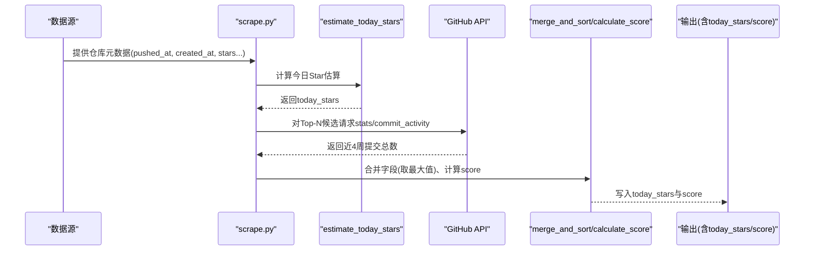
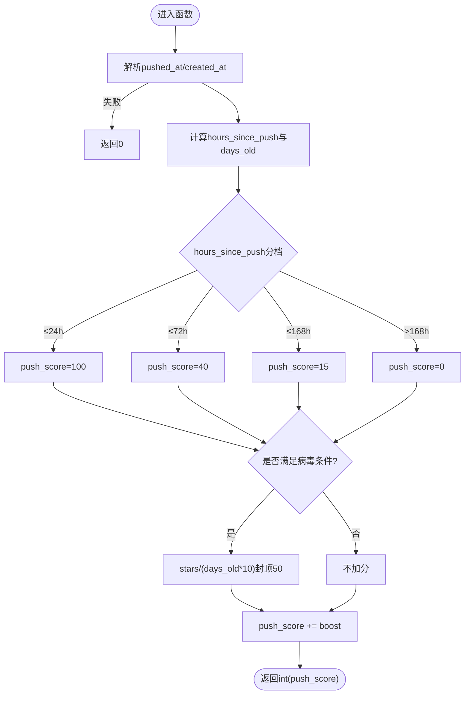
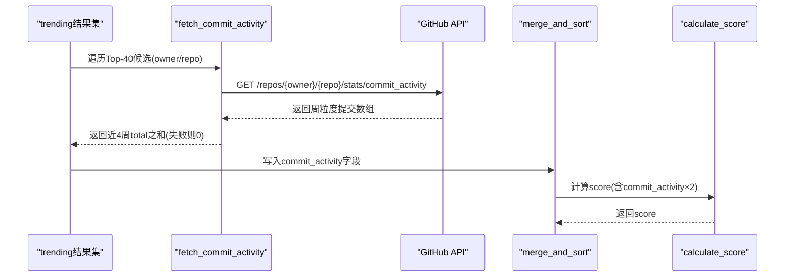
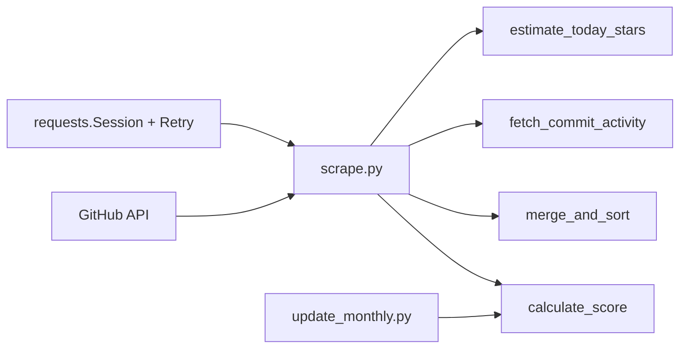

# 活跃度估算

<cite>
**本文引用的文件**   
- [scripts/scrape.py](file://scripts/scrape.py)
- [tests/test_scripts.py](file://tests/test_scripts.py)
- [README.md](file://README.md)
- [scripts/update_monthly.py](file://scripts/update_monthly.py)
</cite>

## 目录
1. [简介](#简介)
2. [项目结构](#项目结构)
3. [核心组件](#核心组件)
4. [架构总览](#架构总览)
5. [详细组件分析](#详细组件分析)
6. [依赖关系分析](#依赖关系分析)
7. [性能与准确性](#性能与准确性)
8. [故障排查指南](#故障排查指南)
9. [结论](#结论)

## 简介
本技术文档聚焦于“活跃度估算”子系统，围绕 estimate_today_stars 函数的实现原理、push_score 分层权重、新项目病毒式传播识别、commit_activity 数据获取与集成，以及整体准确度与局限性进行系统化说明。该子系统用于在无法直接获取每日 Star 增长的情况下，基于推送时间（pushed_at）与创建时间（created_at）等信号，对仓库的“今日新增 Star”进行合理估算，并作为最终评分体系的重要动量因子。

## 项目结构
与活跃度估算相关的代码主要位于脚本层：
- scrape.py：聚合多源数据，计算 today_stars 与综合评分，并对 Top-N 候选补充 commit_activity。
- update_monthly.py：按月增量抓取新仓库，复用相同评分公式，保持与主流程一致。
- tests/test_scripts.py：针对 estimate_today_stars 及评分逻辑的单元测试，覆盖边界与异常路径。
- README.md：对外说明评分公式与 today_stars 的定位。

图表来源
- [scripts/scrape.py:301-333](file://scripts/scrape.py#L301-L333)
- [scripts/update_monthly.py:154-164](file://scripts/update_monthly.py#L154-L164)
- [tests/test_scripts.py:57-108](file://tests/test_scripts.py#L57-L108)
- [README.md:109-119](file://README.md#L109-L119)

章节来源
- [scripts/scrape.py:301-333](file://scripts/scrape.py#L301-L333)
- [scripts/update_monthly.py:154-164](file://scripts/update_monthly.py#L154-L164)
- [tests/test_scripts.py:57-108](file://tests/test_scripts.py#L57-L108)
- [README.md:109-119](file://README.md#L109-L119)

## 核心组件
- estimate_today_stars(repo_data)：根据 pushed_at 与 created_at 的时间差，结合 stargazers_count，输出一个 0..~150 的“今日 Star 估算值”。
- push_score 分层：按距离最近一次推送的小时数分档，分别赋予不同基础权重。
- 新项目病毒式传播增强：当仓库成立不足 30 天且 Stars 超过阈值时，按单位时间 Star 增速给予额外加分。
- commit_activity 获取与融合：对 Top-N 候选调用 GitHub 免费接口 stats/commit_activity，汇总近四周提交数，作为新鲜度信号参与最终评分。

章节来源
- [scripts/scrape.py:301-333](file://scripts/scrape.py#L301-L333)
- [scripts/scrape.py:133-146](file://scripts/scrape.py#L133-L146)
- [scripts/scrape.py:379-402](file://scripts/scrape.py#L379-L402)
- [scripts/update_monthly.py:154-164](file://scripts/update_monthly.py#L154-L164)

## 架构总览
下图展示了从仓库元数据到活跃度估算，再到最终评分与数据融合的端到端流程。

图表来源
- [scripts/scrape.py:301-333](file://scripts/scrape.py#L301-L333)
- [scripts/scrape.py:133-146](file://scripts/scrape.py#L133-L146)
- [scripts/scrape.py:379-402](file://scripts/scrape.py#L379-L402)
- [scripts/scrape.py:562-572](file://scripts/scrape.py#L562-L572)
- [scripts/scrape.py:575-622](file://scripts/scrape.py#L575-L622)

## 详细组件分析

### estimate_today_stars 函数详解
- 输入：包含 pushed_at、created_at、stargazers_count 等字段的仓库数据字典。
- 解析与容错：
  - 使用 ISO 格式解析时间；若缺失或格式错误，直接返回 0。
  - 以推送时间的时区为基准计算 now，避免跨时区误差。
- 时间差计算：
  - hours_since_push = (now - pushed_at) 的小时数，下限为 0。
  - days_old = (now - created_at) 的天数，下限为 1，防止除以 0。
- push_score 分层权重：
  - ≤24 小时：基础分 100
  - ≤72 小时：基础分 40
  - ≤168 小时（一周内）：基础分 15
  - >168 小时：基础分 0
- 新项目病毒式传播增强：
  - 条件：days_old < 30 且 stargazers_count > 100
  - 增益：min(int(stars / days_old / 10), 50)
  - 含义：越新且单位时间 Star 增速越高，加分越多，上限 50。
- 输出：int(push_score)，范围大致 0..~150，用于近似真实日增 Star 的量级。

图表来源
- [scripts/scrape.py:301-333](file://scripts/scrape.py#L301-L333)

章节来源
- [scripts/scrape.py:301-333](file://scripts/scrape.py#L301-L333)
- [tests/test_scripts.py:57-108](file://tests/test_scripts.py#L57-L108)

### push_score 分层权重设计
- 24 小时内：高权重 100，反映近期推送通常伴随显著关注度提升。
- 24–72 小时：中权重 40，仍具较强动量但衰减明显。
- 72–168 小时：低权重 15，代表一周内的活跃窗口。
- 超过一周：权重归零，不再视为短期动量信号。

该分层策略兼顾了“时效性”和“稳定性”，避免将长期无推送的仓库误判为高动量。

章节来源
- [scripts/scrape.py:319-326](file://scripts/scrape.py#L319-L326)
- [tests/test_scripts.py:73-91](file://tests/test_scripts.py#L73-L91)

### 新项目病毒式传播识别算法
- 触发条件：
  - days_old < 30（仓库成立不到一个月）
  - stargazers_count > 100（已有一定热度）
- 增益计算：
  - 按 stars / days_old / 10 计算单位时间 Star 增速，再取整并封顶 50。
- 目的：
  - 对新项目的高增速给予额外奖励，使其在今日 Star 估算中更突出，便于前端“激增指数”排序。

章节来源
- [scripts/scrape.py:328-332](file://scripts/scrape.py#L328-L332)
- [tests/test_scripts.py:94-102](file://tests/test_scripts.py#L94-L102)

### commit_activity 数据的获取与集成
- 数据来源：
  - GitHub 免费接口 stats/commit_activity，无需 Token，返回每周提交统计列表。
- 获取逻辑：
  - 仅对 trending 候选中按 stars 排序的前 40 个仓库发起请求。
  - 对每个仓库，取最近 4 周的 total 求和，得到近四周提交总数。
  - 任何异常或非 200 响应均返回 0，保证鲁棒性。
- 集成方式：
  - 将 commit_activity 写入仓库记录，后续 merge_and_sort 会与其他来源的数值字段做“逐字段取最大值”合并。
  - 最终 calculate_score 将 commit_activity 作为新鲜度信号加权参与总分。

图表来源
- [scripts/scrape.py:133-146](file://scripts/scrape.py#L133-L146)
- [scripts/scrape.py:379-402](file://scripts/scrape.py#L379-L402)
- [scripts/scrape.py:575-622](file://scripts/scrape.py#L575-L622)
- [scripts/scrape.py:562-572](file://scripts/scrape.py#L562-L572)

章节来源
- [scripts/scrape.py:133-146](file://scripts/scrape.py#L133-L146)
- [scripts/scrape.py:379-402](file://scripts/scrape.py#L379-L402)
- [scripts/scrape.py:562-572](file://scripts/scrape.py#L562-L572)
- [scripts/scrape.py:575-622](file://scripts/scrape.py#L575-L622)

### 与月度更新的一致性
- update_monthly.py 中的 calculate_score 与 scrape.py 保持一致的评分公式，确保不同来源的数据可统一比较。
- 字段合并策略同样采用“逐字段取最大值”，保证多源数据融合后不会低估任一指标。

章节来源
- [scripts/update_monthly.py:154-164](file://scripts/update_monthly.py#L154-L164)
- [scripts/update_monthly.py:167-229](file://scripts/update_monthly.py#L167-L229)

## 依赖关系分析
- 外部依赖：
  - requests + urllib3 Retry/HTTPAdapter：自动重试与退避，应对 429/5xx 等临时错误。
  - GitHub API：搜索接口、仓库详情接口、commit_activity 接口。
- 内部耦合：
  - estimate_today_stars 被 trending 采集流程调用，用于填充 today_stars。
  - fetch_commit_activity 仅在 Top-N 候选上调用，控制成本。
  - merge_and_sort 负责去重与字段合并，calculate_score 统一打分。

图表来源
- [scripts/scrape.py:114-130](file://scripts/scrape.py#L114-L130)
- [scripts/scrape.py:301-333](file://scripts/scrape.py#L301-L333)
- [scripts/scrape.py:133-146](file://scripts/scrape.py#L133-L146)
- [scripts/scrape.py:562-572](file://scripts/scrape.py#L562-L572)
- [scripts/scrape.py:575-622](file://scripts/scrape.py#L575-L622)
- [scripts/update_monthly.py:154-164](file://scripts/update_monthly.py#L154-L164)

章节来源
- [scripts/scrape.py:114-130](file://scripts/scrape.py#L114-L130)
- [scripts/scrape.py:301-333](file://scripts/scrape.py#L301-L333)
- [scripts/scrape.py:133-146](file://scripts/scrape.py#L133-L146)
- [scripts/scrape.py:562-572](file://scripts/scrape.py#L562-L572)
- [scripts/scrape.py:575-622](file://scripts/scrape.py#L575-L622)
- [scripts/update_monthly.py:154-164](file://scripts/update_monthly.py#L154-L164)

## 性能与准确性

### 复杂度与开销
- estimate_today_stars：O(1)，仅涉及时间解析与常数分支判断。
- fetch_commit_activity：每次调用一次 HTTP 请求，超时与重试可控；仅对 Top-40 候选调用，总体开销有限。
- merge_and_sort：线性扫描与字典合并，整体 O(N)。

### 准确性评估
- 今日 Star 估算的优势：
  - 利用推送时效性与新项目增速，能较好捕捉短期动量。
  - 对 Top-N 候选引入真实 commit_activity，使评分更贴近实际活跃度。
- 已知局限：
  - 非推送驱动的热点（如社区讨论、媒体曝光）可能未被充分反映。
  - 对于长期维护但近期无推送的项目，today_stars 可能偏低。
  - commit_activity 仅覆盖 Top-N 候选，其余仓库缺少真实提交信号。
  - 免费接口的缓存未命中（202）会被当作 0，存在一定噪声。

### 优化建议
- 扩展更多动量信号：例如 issue 活跃度、PR 合并频率、下载量（如适用）。
- 动态调整分档阈值：依据历史数据回归校准 push_score 的分段点与增益系数。
- 扩大 commit_activity 覆盖范围：通过分页或异步批量请求提高覆盖率。
- 增加置信度标注：为 today_stars 附加置信区间或来源标签，辅助前端展示。

[本节为通用指导，不直接分析具体文件]

## 故障排查指南
- 常见错误与处理：
  - 时间字段缺失或格式错误：estimate_today_stars 捕获 KeyError/TypeError/ValueError，返回 0。
  - GitHub 限流（403/429）：get_session 配置了指数退避重试；search_github_repos 遇到 403 会打印消息并休眠后继续。
  - commit_activity 接口异常或非 200：返回 0，不影响整体流程。
- 定位步骤：
  - 检查环境变量 GITHUB_TOKEN 是否正确设置，以提升配额。
  - 查看日志中 Rate limited 提示，确认是否需要降低并发或等待。
  - 验证测试用例：pytest tests/ -v，重点观察 estimate_today_stars 相关断言。

章节来源
- [scripts/scrape.py:114-130](file://scripts/scrape.py#L114-L130)
- [scripts/scrape.py:254-265](file://scripts/scrape.py#L254-L265)
- [scripts/scrape.py:133-146](file://scripts/scrape.py#L133-L146)
- [tests/test_scripts.py:57-108](file://tests/test_scripts.py#L57-L108)

## 结论
estimate_today_stars 通过“推送时效 + 新项目增速”的组合信号，提供了低成本且相对稳健的“今日 Star”代理指标。配合 Top-N 候选的真实 commit_activity 数据，系统能够在不依赖每日 Star 明细的前提下，有效识别短期动量与潜在热门项目。尽管存在若干局限，但在当前约束下，该方案具备良好的工程可行性与可扩展性，适合作为活跃度估算的核心模块持续演进。