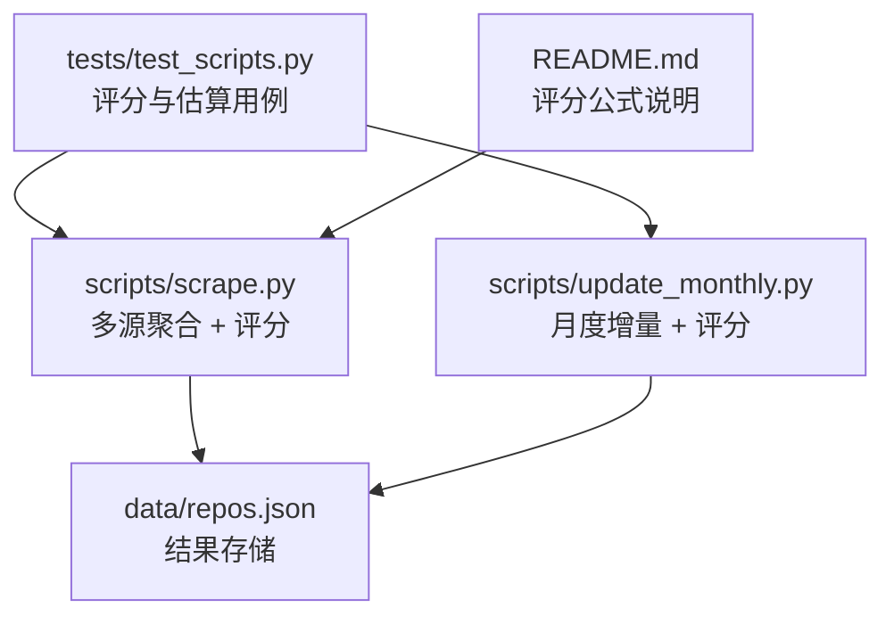
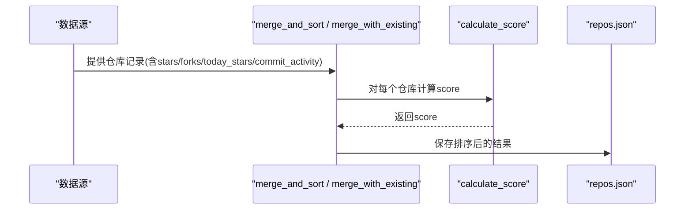
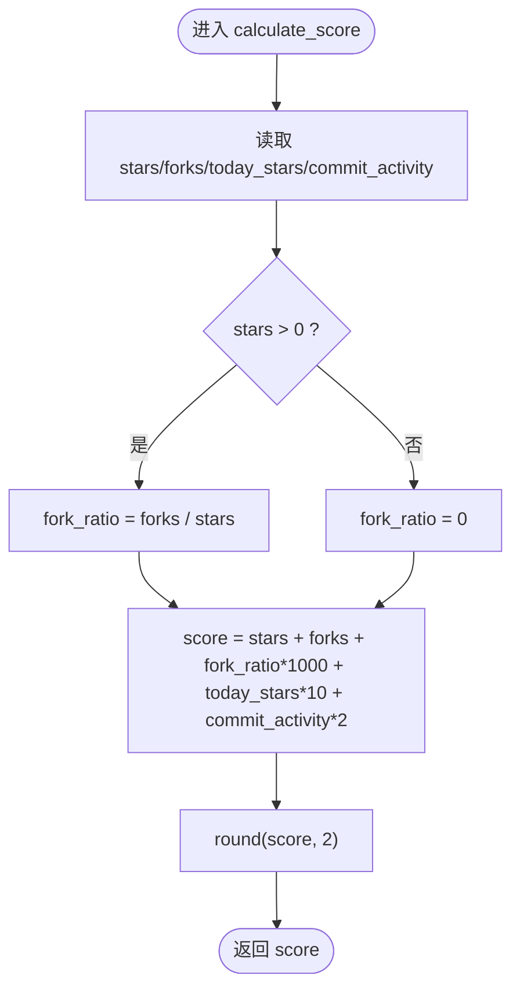
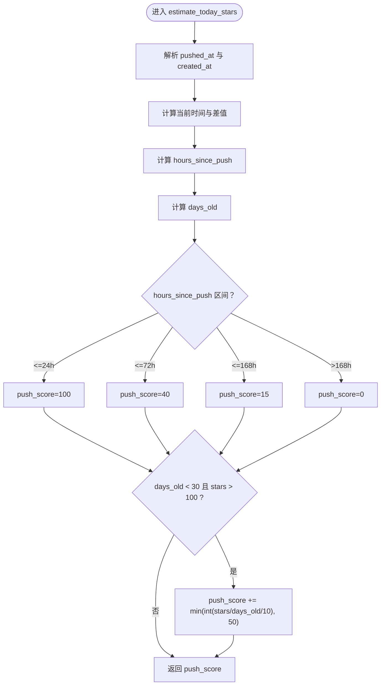
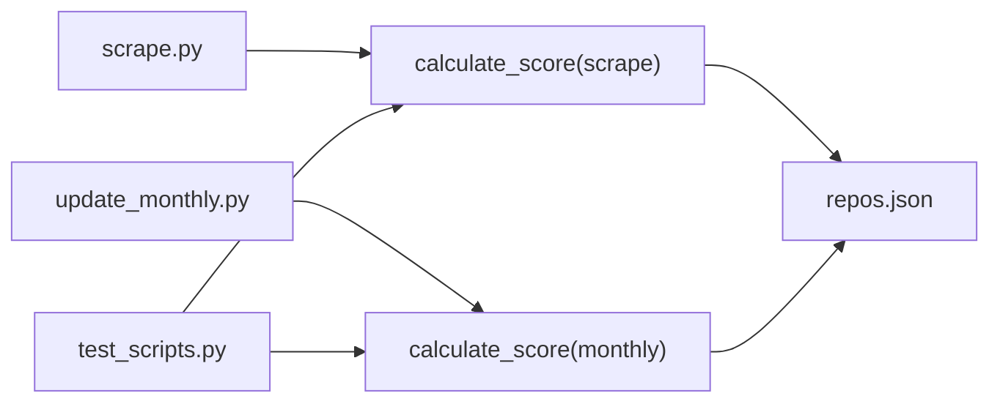

# 评分系统

<cite>
**本文引用的文件**
- [scripts/scrape.py](file://scripts/scrape.py)
- [scripts/update_monthly.py](file://scripts/update_monthly.py)
- [tests/test_scripts.py](file://tests/test_scripts.py)
- [README.md](file://README.md)
</cite>

## 目录
1. [简介](#简介)
2. [项目结构](#项目结构)
3. [核心组件](#核心组件)
4. [架构总览](#架构总览)
5. [详细组件分析](#详细组件分析)
6. [依赖关系分析](#依赖关系分析)
7. [性能与可扩展性](#性能与可扩展性)
8. [故障排查指南](#故障排查指南)
9. [结论](#结论)

## 简介
本技术文档聚焦于仓库中的“宝藏仓库”评分系统，重点解析 calculate_score 函数的核心算法、权重参数设计原理与业务意义、fork_ratio 的计算逻辑与边界保护，以及不同项目类型的评分示例。同时给出系统的扩展性与自定义配置建议，帮助读者理解并优化该评分体系。

## 项目结构
评分系统主要位于脚本层：
- 全量聚合脚本：scripts/scrape.py
- 月度增量脚本：scripts/update_monthly.py
- 单元测试：tests/test_scripts.py
- 公开说明（含公式）：README.md

图表来源
- [scripts/scrape.py:562-572](file://scripts/scrape.py#L562-L572)
- [scripts/update_monthly.py:154-164](file://scripts/update_monthly.py#L154-L164)
- [tests/test_scripts.py:39-54](file://tests/test_scripts.py#L39-L54)
- [README.md:109-119](file://README.md#L109-L119)

章节来源
- [scripts/scrape.py:562-572](file://scripts/scrape.py#L562-L572)
- [scripts/update_monthly.py:154-164](file://scripts/update_monthly.py#L154-L164)
- [tests/test_scripts.py:39-54](file://tests/test_scripts.py#L39-L54)
- [README.md:109-119](file://README.md#L109-L119)

## 核心组件
- 评分函数：calculate_score(repo)
  - 输入：仓库对象，包含 stars、forks、today_stars、commit_activity 等字段
  - 输出：数值型评分（保留两位小数）
  - 核心公式：score = stars + forks + (forks/stars)*1000 + today_stars*10 + commits_4w*2
- 今日星标估算：estimate_today_stars(repo_data)
  - 基于推送时间与创建时间估算当日星标增长，用于提升“飙升指数”的准确性
- 提交活跃度获取：fetch_commit_activity(owner, repo)
  - 通过 GitHub API 获取最近四周的提交总数，作为新鲜度信号

章节来源
- [scripts/scrape.py:562-572](file://scripts/scrape.py#L562-L572)
- [scripts/scrape.py:301-333](file://scripts/scrape.py#L301-L333)
- [scripts/scrape.py:133-146](file://scripts/scrape.py#L133-L146)
- [scripts/update_monthly.py:154-164](file://scripts/update_monthly.py#L154-L164)

## 架构总览
评分系统在数据汇聚流程中处于关键位置：各数据源产出仓库记录后，统一进入合并与排序阶段，计算最终 score 并排序展示。

图表来源
- [scripts/scrape.py:575-622](file://scripts/scrape.py#L575-L622)
- [scripts/update_monthly.py:167-229](file://scripts/update_monthly.py#L167-L229)
- [scripts/scrape.py:562-572](file://scripts/scrape.py#L562-L572)
- [scripts/update_monthly.py:154-164](file://scripts/update_monthly.py#L154-L164)

## 详细组件分析

### 评分函数 calculate_score 的核心算法
- 公式构成
  - stars：基础影响力指标，直接线性加权
  - forks：二次影响力指标，反映复用与协作意愿
  - fork_ratio × 1000：fork 相对 stars 的比例奖励，鼓励高参与度社区生态
  - today_stars × 10：近期热度加成，放大短期爆发潜力
  - commit_activity × 2：近四周提交数，体现维护活跃度与新鲜度
- 实现要点
  - 使用字典 get 方法安全读取字段，缺失时默认 0
  - fork_ratio 采用条件分支避免除零：当 stars > 0 时计算比例，否则为 0
  - 结果 round 到两位小数，保证输出稳定

图表来源
- [scripts/scrape.py:562-572](file://scripts/scrape.py#L562-L572)
- [scripts/update_monthly.py:154-164](file://scripts/update_monthly.py#L154-L164)

章节来源
- [scripts/scrape.py:562-572](file://scripts/scrape.py#L562-L572)
- [scripts/update_monthly.py:154-164](file://scripts/update_monthly.py#L154-L164)
- [README.md:109-119](file://README.md#L109-L119)

### 权重参数的设计原理与业务意义
- star 权重（线性项）
  - 作用：衡量项目的总体认可度与可见度
  - 业务意义：作为基础分，确保高星项目在排名中具备基本优势
- fork 比率奖励（forks/stars × 1000）
  - 作用：在相同 stars 下，fork 越多说明社区参与和复用程度越高
  - 业务意义：鼓励“可被广泛借鉴与二次开发”的项目，提升生态价值
  - 边界处理：当 stars=0 时，fork_ratio 设为 0，避免除零错误
- 活跃度加成（today_stars × 10）
  - 作用：放大短期热度，捕捉“飙升”趋势
  - 业务意义：有助于发现新兴热门项目，提高推荐时效性
  - 数据来源：estimate_today_stars 基于推送时间与创建时间的代理估算
- 提交频率影响（commit_activity × 2）
  - 作用：以近四周提交数衡量维护活跃度
  - 业务意义：降低“僵尸项目”风险，优先推荐活跃维护的项目

章节来源
- [scripts/scrape.py:562-572](file://scripts/scrape.py#L562-L572)
- [scripts/scrape.py:301-333](file://scripts/scrape.py#L301-L333)
- [scripts/scrape.py:133-146](file://scripts/scrape.py#L133-L146)
- [README.md:109-119](file://README.md#L109-L119)

### fork_ratio 的计算逻辑与边界情况
- 计算逻辑
  - 若 stars > 0：fork_ratio = forks / stars
  - 若 stars == 0：fork_ratio = 0
- 边界情况
  - 除零保护：通过条件判断避免除以 0
  - 低星高 fork 场景：即使 stars 很小，fork_ratio 仍可能较大，从而获得较高比例奖励
  - 无 stars 且无 forks：fork_ratio 为 0，仅由其他项贡献分数

章节来源
- [scripts/scrape.py:562-572](file://scripts/scrape.py#L562-L572)
- [scripts/update_monthly.py:154-164](file://scripts/update_monthly.py#L154-L164)
- [tests/test_scripts.py:51-54](file://tests/test_scripts.py#L51-L54)

### 不同项目类型的评分示例
以下示例基于测试断言与公式推导，展示算法如何区分不同类型项目质量：
- 基础型项目（无今日星标与提交）
  - stars=1000, forks=100, today_stars=0, commit_activity=0
  - 预期 score=1200.0
- 活跃型项目（有今日星标与提交）
  - stars=1000, forks=100, today_stars=50, commit_activity=30
  - 预期 score=1760.0
- 零星项目（除零保护）
  - stars=0, forks=0, today_stars=10, commit_activity=0
  - 预期 score=100.0（仅由 today_stars 贡献）

这些用例验证了：
- 基础项与活跃度项叠加的正确性
- 除零保护的健壮性
- 不同项目类型（基础/活跃/新星）的区分能力

章节来源
- [tests/test_scripts.py:39-54](file://tests/test_scripts.py#L39-L54)
- [scripts/scrape.py:562-572](file://scripts/scrape.py#L562-L572)

### 活跃度估算 estimate_today_stars 的流程

图表来源
- [scripts/scrape.py:301-333](file://scripts/scrape.py#L301-L333)

章节来源
- [scripts/scrape.py:301-333](file://scripts/scrape.py#L301-L333)

## 依赖关系分析
- 模块耦合
  - scrape.py 与 update_monthly.py 各自实现 calculate_score，保持独立但公式一致
  - tests/test_scripts.py 覆盖两个脚本的评分与估算逻辑，保障一致性
- 外部依赖
  - requests：HTTP 请求与重试机制
  - datetime：时间计算与格式化
- 数据流
  - 多源采集 → 合并去重 → 计算 score → 排序 → 持久化 repos.json

图表来源
- [scripts/scrape.py:562-572](file://scripts/scrape.py#L562-L572)
- [scripts/update_monthly.py:154-164](file://scripts/update_monthly.py#L154-L164)
- [tests/test_scripts.py:39-54](file://tests/test_scripts.py#L39-L54)

章节来源
- [scripts/scrape.py:562-572](file://scripts/scrape.py#L562-L572)
- [scripts/update_monthly.py:154-164](file://scripts/update_monthly.py#L154-L164)
- [tests/test_scripts.py:39-54](file://tests/test_scripts.py#L39-L54)

## 性能与可扩展性
- 性能特性
  - 评分计算为 O(1)，复杂度极低
  - 合并与排序阶段为 O(N log N)，N 为仓库数量
  - 活跃度估算与提交活跃度查询涉及外部 API，存在网络延迟与限流风险
- 可扩展性与自定义配置
  - 权重系数可调：可通过修改 calculate_score 中的乘数（如 1000、10、2）调整各项影响
  - 新增维度：可在 repo 对象中增加新字段（如 issues_count、contributors），并在评分公式中加入相应项
  - 阈值过滤：结合 MIN_STARS/MIN_FORKS 等配置进行前置筛选，减少后续计算压力
  - 数据源扩展：在 merge_and_sort 或 merge_with_existing 中支持更多来源，统一走同一评分流程

章节来源
- [scripts/scrape.py:562-572](file://scripts/scrape.py#L562-L572)
- [scripts/scrape.py:575-622](file://scripts/scrape.py#L575-L622)
- [scripts/update_monthly.py:167-229](file://scripts/update_monthly.py#L167-L229)

## 故障排查指南
- 常见问题
  - 除零异常：当 stars=0 时，fork_ratio 应设为 0；测试已覆盖此边界
  - 字段缺失：使用字典 get 方法并提供默认值 0，避免 KeyError
  - 网络限流：GitHub API 限流会导致 fetch_commit_activity 失败，函数会返回 0
- 定位建议
  - 检查 repo 对象是否包含 stars/forks/today_stars/commit_activity
  - 确认 estimate_today_stars 的时间解析是否正确（ISO 格式与时区）
  - 查看 README 中关于 GITHUB_TOKEN 的配置，提升请求限额

章节来源
- [tests/test_scripts.py:51-54](file://tests/test_scripts.py#L51-L54)
- [scripts/scrape.py:133-146](file://scripts/scrape.py#L133-L146)
- [scripts/scrape.py:301-333](file://scripts/scrape.py#L301-L333)
- [README.md:169-171](file://README.md#L169-L171)

## 结论
该评分系统以简洁而有效的线性组合公式为核心，兼顾基础影响力、社区参与度、短期热度与维护活跃度。fork_ratio 的引入有效识别高参与度的项目，today_stars 与 commit_activity 则分别捕捉“飙升”与“新鲜度”。通过完善的边界保护与单元测试，系统在稳定性与可解释性方面表现良好。未来可通过权重调优与维度扩展进一步提升对不同项目类型的区分能力与推荐效果。