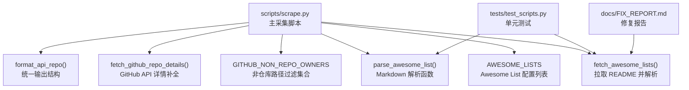
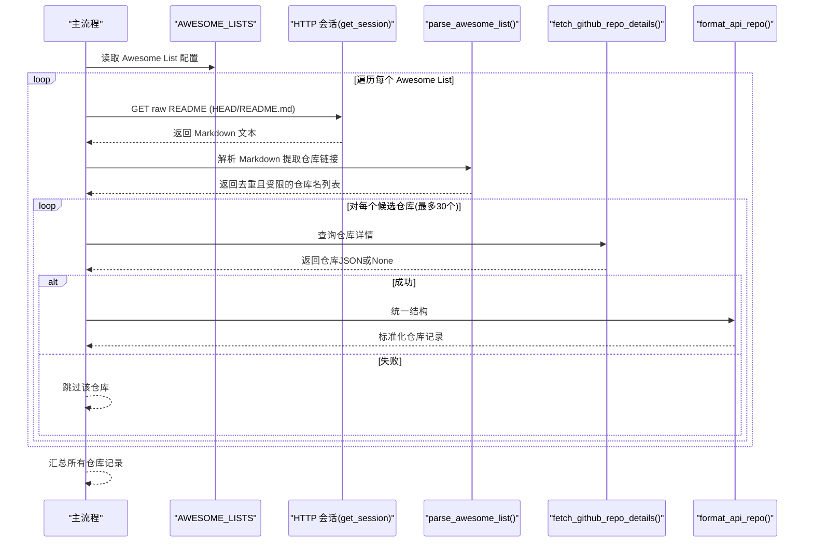
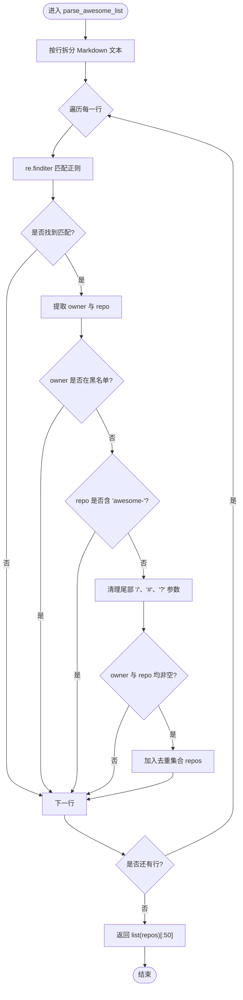
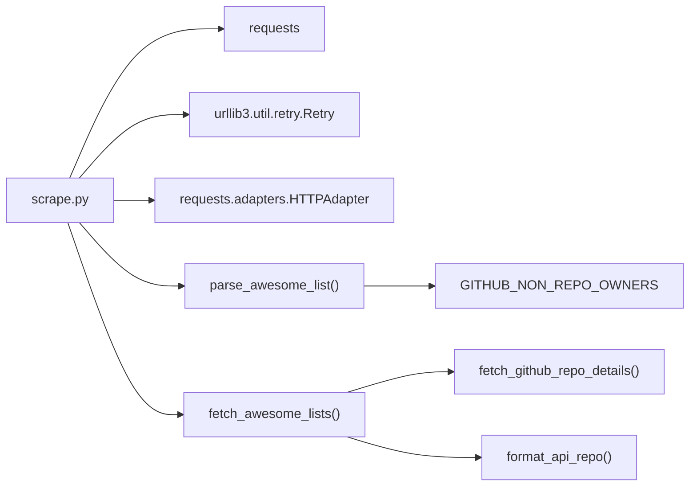

# Awesome Lists 采集器

<cite>
**本文引用的文件**
- [scripts/scrape.py](file://scripts/scrape.py)
- [tests/test_scripts.py](file://tests/test_scripts.py)
- [docs/FIX_REPORT.md](file://docs/FIX_REPORT.md)
</cite>

## 目录
1. [简介](#简介)
2. [项目结构](#项目结构)
3. [核心组件](#核心组件)
4. [架构总览](#架构总览)
5. [详细组件分析](#详细组件分析)
6. [依赖关系分析](#依赖关系分析)
7. [性能考量](#性能考量)
8. [故障排查指南](#故障排查指南)
9. [结论](#结论)
10. [附录：扩展新的 Awesome List 数据源](#附录扩展新的-awesome-list-数据源)

## 简介
本技术文档聚焦于“Awesome Lists 采集器”的实现与工作机制，重点解析 Markdown 格式解析算法、正则表达式匹配模式的工作原理、非仓库链接过滤逻辑、awesome- 前缀项目的处理策略、URL 尾部清理规则，以及 parse_awesome_list 函数的错误处理、性能优化与结果限制机制。同时提供扩展新数据源的实践指引。

## 项目结构
本项目采用脚本驱动的数据采集方案，Awesome Lists 采集逻辑集中在爬虫脚本中，并通过单元测试覆盖关键行为。

图表来源
- [scripts/scrape.py:27-60](file://scripts/scrape.py#L27-L60)
- [scripts/scrape.py:77-100](file://scripts/scrape.py#L77-L100)
- [scripts/scrape.py:149-169](file://scripts/scrape.py#L149-L169)
- [scripts/scrape.py:193-240](file://scripts/scrape.py#L193-L240)
- [scripts/scrape.py:172-190](file://scripts/scrape.py#L172-L190)
- [scripts/scrape.py:546-559](file://scripts/scrape.py#L546-L559)
- [tests/test_scripts.py:112-141](file://tests/test_scripts.py#L112-L141)
- [docs/FIX_REPORT.md:26-45](file://docs/FIX_REPORT.md#L26-L45)

章节来源
- [scripts/scrape.py:27-60](file://scripts/scrape.py#L27-L60)
- [scripts/scrape.py:77-100](file://scripts/scrape.py#L77-L100)
- [scripts/scrape.py:149-169](file://scripts/scrape.py#L149-L169)
- [scripts/scrape.py:193-240](file://scripts/scrape.py#L193-L240)
- [tests/test_scripts.py:112-141](file://tests/test_scripts.py#L112-L141)
- [docs/FIX_REPORT.md:26-45](file://docs/FIX_REPORT.md#L26-L45)

## 核心组件
- AWESOME_LISTS：定义待采集的 Awesome List 清单，包含名称与 raw README 地址（使用 HEAD 自动指向默认分支）。
- GITHUB_NON_REPO_OWNERS：用于过滤 GitHub 平台非仓库路径（如 features、trending、blog 等）的黑名单集合。
- parse_awesome_list(content)：从 Markdown 内容中提取 GitHub 仓库链接，执行过滤与清理，返回去重后的仓库名列表，并限制最大数量。
- fetch_awesome_lists()：遍历 AWESOME_LISTS，拉取 README 文本，调用 parse_awesome_list 解析，再对每个候选仓库通过 GitHub API 获取详情并格式化入库。
- fetch_github_repo_details(owner, repo)：封装 GitHub API 请求，处理 404/403 及异常，返回仓库 JSON 或 None。
- format_api_repo(r)：将 GitHub API 响应映射为内部统一结构，便于后续合并与评分。

章节来源
- [scripts/scrape.py:27-60](file://scripts/scrape.py#L27-L60)
- [scripts/scrape.py:77-100](file://scripts/scrape.py#L77-L100)
- [scripts/scrape.py:149-169](file://scripts/scrape.py#L149-L169)
- [scripts/scrape.py:193-240](file://scripts/scrape.py#L193-L240)
- [scripts/scrape.py:172-190](file://scripts/scrape.py#L172-L190)
- [scripts/scrape.py:546-559](file://scripts/scrape.py#L546-L559)

## 架构总览
下图展示了 Awesome Lists 采集流程的整体交互：从配置读取、README 拉取、Markdown 解析、API 详情补全到最终入库。

图表来源
- [scripts/scrape.py:193-240](file://scripts/scrape.py#L193-L240)
- [scripts/scrape.py:149-169](file://scripts/scrape.py#L149-L169)
- [scripts/scrape.py:172-190](file://scripts/scrape.py#L172-L190)
- [scripts/scrape.py:546-559](file://scripts/scrape.py#L546-L559)

## 详细组件分析

### Markdown 解析算法与正则表达式
- 目标：从 Markdown 行中匹配形如 [文本](https://github.com/owner/repo) 的链接，提取 owner 与 repo。
- 正则表达式模式：r"\[([^\]]*)\]\(https?://github\.com/([a-zA-Z0-9_.-]+)/([a-zA-Z0-9_.-]+)/?[^)]*\)"
  - \[([^\]]*)\]：匹配方括号内的任意字符作为链接文本（不捕获用于业务逻辑）。
  - \(https?://github\.com/...：严格限定协议为 http/https，域名必须为 github.com。
  - ([a-zA-Z0-9_.-]+)：匹配 owner，允许字母数字、下划线、点、连字符。
  - /([a-zA-Z0-9_.-]+)：匹配 repo，同样允许上述字符集。
  - /?[^)]*：可选的路径片段和查询参数，确保能匹配带锚点或参数的 URL。
- 逐行扫描：content.split("\n") 后对每行进行 re.finditer 匹配，避免整段匹配带来的回溯开销。
- 过滤与清理：
  - 非仓库路径过滤：若 owner.lower() 在 GITHUB_NON_REPO_OWNERS 中则跳过。
  - awesome- 前缀过滤：若 repo.lower() 包含 "awesome-" 则跳过，避免重复收录 Awesome 列表自身。
  - 清理尾部字符：repo.rstrip("/").split("#")[0].split("?")[0] 去除末尾斜杠、锚点与查询串。
- 结果限制：返回 list(repos)[:50]，限制单份列表的最大候选数，控制后续 API 调用量。

图表来源
- [scripts/scrape.py:149-169](file://scripts/scrape.py#L149-L169)
- [scripts/scrape.py:77-100](file://scripts/scrape.py#L77-L100)

章节来源
- [scripts/scrape.py:149-169](file://scripts/scrape.py#L149-L169)
- [scripts/scrape.py:77-100](file://scripts/scrape.py#L77-L100)
- [tests/test_scripts.py:112-141](file://tests/test_scripts.py#L112-L141)

### 非仓库链接过滤（GITHUB_NON_REPO_OWNERS）
- 目的：排除 GitHub 平台导航页或非仓库资源（如 features、trending、blog、marketplace、enterprise、collections、sponsors、mobile、security、team、pricing、readme、about、login、signup 等），避免误入无关页面。
- 实现：owner.lower() in GITHUB_NON_REPO_OWNERS 判断，大小写不敏感。
- 影响：显著降低无效链接比例，减少后续 API 调用与噪声数据。

章节来源
- [scripts/scrape.py:77-100](file://scripts/scrape.py#L77-L100)
- [scripts/scrape.py:159-161](file://scripts/scrape.py#L159-L161)
- [tests/test_scripts.py:126-135](file://tests/test_scripts.py#L126-L135)

### awesome- 前缀项目处理
- 目的：避免将 Awesome 列表自身（如 vinta/awesome-python）纳入仓库集合，防止自我引用与重复。
- 实现：检查 repo.lower() 是否包含 "awesome-"，命中则跳过。
- 效果：提升候选质量，减少无意义条目。

章节来源
- [scripts/scrape.py:162-163](file://scripts/scrape.py#L162-L163)
- [tests/test_scripts.py:126-135](file://tests/test_scripts.py#L126-L135)

### URL 尾部清理逻辑
- 清理项：
  - 末尾斜杠：rstrip("/")
  - 锚点：split("#")[0]
  - 查询参数：split("?")[0]
- 作用：确保 owner/repo 规范化，避免因 #section 或 ?query 导致匹配失败或重复。

章节来源
- [scripts/scrape.py:165](file://scripts/scrape.py#L165)

### parse_awesome_list 的错误处理与健壮性
- 输入容错：仅基于正则匹配，忽略无法解析的行；owner/repo 为空时直接丢弃。
- 异常隔离：上层 fetch_awesome_lists 使用 try/except 包裹单个列表的处理，异常不会中断整体流程。
- 稳定性：通过 set 去重，避免重复计数；限制返回长度，控制下游压力。

章节来源
- [scripts/scrape.py:149-169](file://scripts/scrape.py#L149-L169)
- [scripts/scrape.py:193-240](file://scripts/scrape.py#L193-L240)

### 性能优化与结果限制机制
- 正则优化：逐行 finditer 而非一次性跨行匹配，降低回溯成本。
- 候选上限：单份列表最多返回 50 条候选，后续仅对前 30 条发起 API 请求，避免 rate limit 耗尽。
- 延迟控制：每次 API 调用后 sleep(0.15)，列表间 sleep(0.3)，缓解服务端压力。
- 去重：set 存储候选，避免重复请求。

章节来源
- [scripts/scrape.py:149-169](file://scripts/scrape.py#L149-L169)
- [scripts/scrape.py:217-230](file://scripts/scrape.py#L217-L230)
- [scripts/scrape.py:237](file://scripts/scrape.py#L237)
- [tests/test_scripts.py:138-141](file://tests/test_scripts.py#L138-L141)

### 结果限制机制
- 单份列表限制：list(repos)[:50] 保证单次解析结果不超过 50 条。
- 上游消费限制：fetch_awesome_lists 仅对 repo_names[:30] 发起 API 请求，进一步降低负载。

章节来源
- [scripts/scrape.py:169](file://scripts/scrape.py#L169)
- [scripts/scrape.py:217](file://scripts/scrape.py#L217)
- [tests/test_scripts.py:138-141](file://tests/test_scripts.py#L138-L141)

## 依赖关系分析
- 外部依赖：requests 库用于网络请求；urllib3 Retry + HTTPAdapter 实现重试与退避。
- 内部依赖：
  - fetch_awesome_lists 依赖 parse_awesome_list、fetch_github_repo_details、format_api_repo。
  - parse_awesome_list 依赖 GITHUB_NON_REPO_OWNERS 与正则模块。
  - fetch_github_repo_details 依赖 get_headers、get_session。
  - format_api_repo 负责统一输出结构，供 merge_and_sort 与保存流程使用。

图表来源
- [scripts/scrape.py:14-20](file://scripts/scrape.py#L14-L20)
- [scripts/scrape.py:114-130](file://scripts/scrape.py#L114-L130)
- [scripts/scrape.py:149-169](file://scripts/scrape.py#L149-L169)
- [scripts/scrape.py:193-240](file://scripts/scrape.py#L193-L240)
- [scripts/scrape.py:172-190](file://scripts/scrape.py#L172-L190)
- [scripts/scrape.py:546-559](file://scripts/scrape.py#L546-L559)

章节来源
- [scripts/scrape.py:14-20](file://scripts/scrape.py#L14-L20)
- [scripts/scrape.py:114-130](file://scripts/scrape.py#L114-L130)
- [scripts/scrape.py:149-169](file://scripts/scrape.py#L149-L169)
- [scripts/scrape.py:193-240](file://scripts/scrape.py#L193-L240)
- [scripts/scrape.py:172-190](file://scripts/scrape.py#L172-L190)
- [scripts/scrape.py:546-559](file://scripts/scrape.py#L546-L559)

## 性能考量
- 正则匹配复杂度：逐行扫描与 finditer 有效降低回溯风险，适合大文本。
- 网络请求限流：通过 sleep 与 Retry 机制，避免触发 GitHub 速率限制。
- 候选裁剪：单份列表限制 50 条，实际只请求前 30 条，平衡覆盖率与成本。
- 内存占用：set 去重与有限列表输出，避免内存膨胀。

[本节为通用性能建议，无需特定文件分析]

## 故障排查指南
- README 拉取失败：检查 AWESOME_LISTS 中的 URL 是否为 HEAD/README.md，确认 HTTP 状态码与超时设置。
- 解析结果为空：验证 Markdown 链接格式是否符合预期，确认正则未误过滤。
- 大量 403 错误：检查 GITHUB_TOKEN 环境变量是否正确注入，必要时提高速率限制。
- 结果数量不足：确认候选上限与上游消费上限是否过严，适当调整。

章节来源
- [scripts/scrape.py:193-240](file://scripts/scrape.py#L193-L240)
- [scripts/scrape.py:172-190](file://scripts/scrape.py#L172-L190)
- [docs/FIX_REPORT.md:26-45](file://docs/FIX_REPORT.md#L26-L45)

## 结论
Awesome Lists 采集器通过严格的正则匹配、黑名单过滤、前缀过滤与 URL 清理，实现了高鲁棒性的 Markdown 解析；结合结果限制与网络重试，保证了采集过程的稳定与高效。测试用例覆盖了关键行为，修复报告验证了改进的有效性。

[本节为总结性内容，无需特定文件分析]

## 附录：扩展新的 Awesome List 数据源
步骤说明：
- 在 AWESOME_LISTS 中添加新条目，包含 name 与 url（建议使用 HEAD/README.md 以适配默认分支）。
- 运行采集流程，系统会自动拉取 README、解析链接、过滤与清理，并对候选仓库发起 API 请求补全详情。
- 如需调整过滤规则或上限，可修改 GITHUB_NON_REPO_OWNERS 或 parse_awesome_list 的结果限制。

示例路径参考：
- 新增条目位置：AWESOME_LISTS 列表
- 解析入口：parse_awesome_list
- 消费入口：fetch_awesome_lists

章节来源
- [scripts/scrape.py:27-60](file://scripts/scrape.py#L27-L60)
- [scripts/scrape.py:149-169](file://scripts/scrape.py#L149-L169)
- [scripts/scrape.py:193-240](file://scripts/scrape.py#L193-L240)