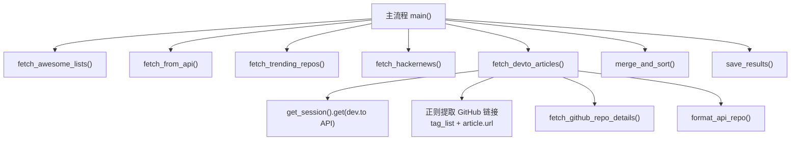
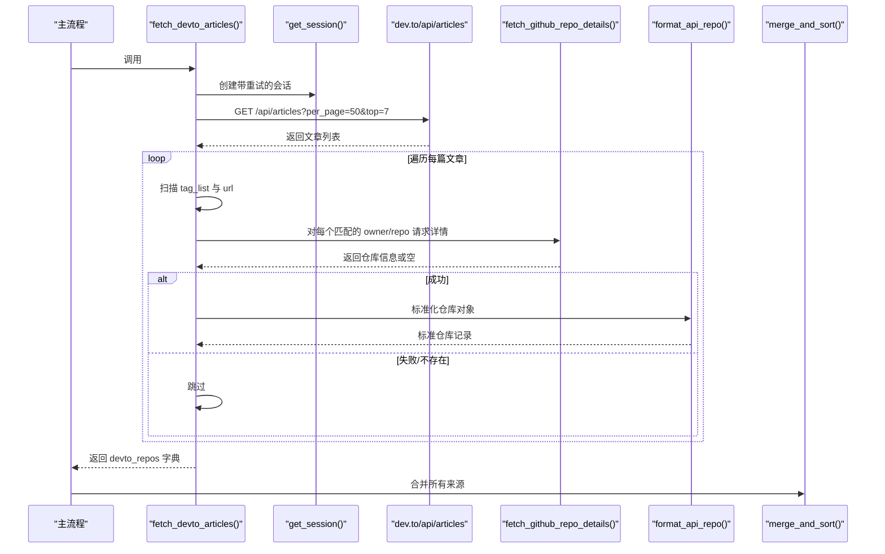
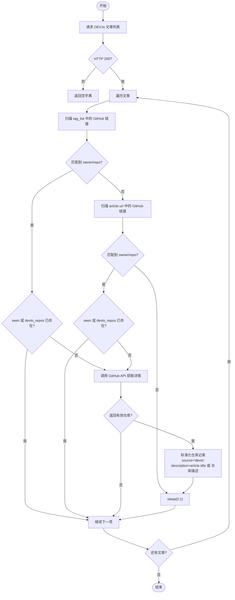
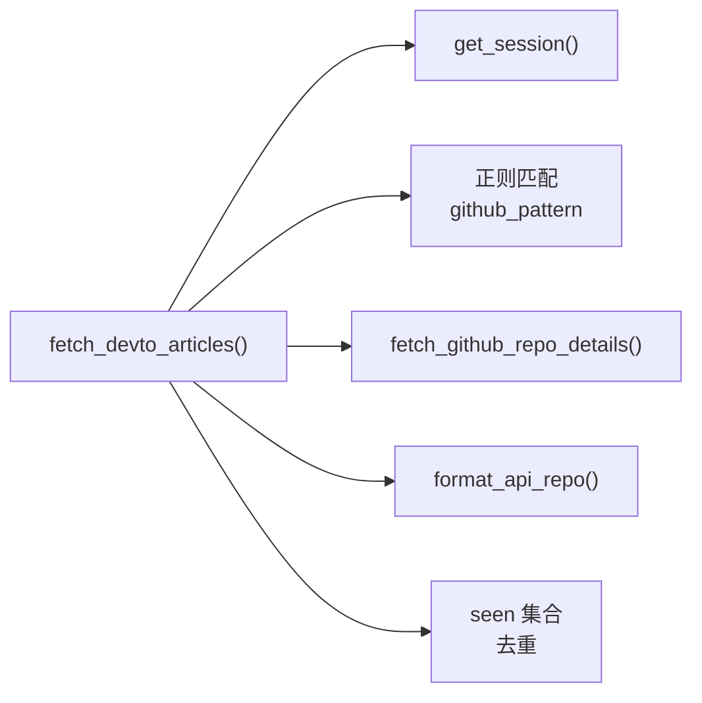

# DEV.to 采集器

<cite>
**本文引用的文件**
- [scripts/scrape.py](file://scripts/scrape.py)
- [tests/test_scripts.py](file://tests/test_scripts.py)
- [README.md](file://README.md)
- [requirements.txt](file://requirements.txt)
</cite>

## 目录
1. [简介](#简介)
2. [项目结构](#项目结构)
3. [核心组件](#核心组件)
4. [架构总览](#架构总览)
5. [详细组件分析](#详细组件分析)
6. [依赖关系分析](#依赖关系分析)
7. [性能考量](#性能考量)
8. [故障排查指南](#故障排查指南)
9. [结论](#结论)
10. [附录](#附录)

## 简介
本文件聚焦于仓库中的 DEV.to 采集器，深入解析 fetch_devto_articles 函数的实现原理与数据处理流程。该函数通过调用 DEV.to 的公开文章 API，从热门文章中提取 GitHub 仓库链接（包括标签、文章 URL），并进一步使用 GitHub API 获取仓库详情，最终将结果纳入统一的数据模型进行去重、评分与排序。文档同时涵盖错误处理策略、性能优化建议以及关键数据结构与匹配规则。

## 项目结构
DEV.to 采集逻辑位于脚本入口文件中，作为多源聚合的一部分被主流程调用。整体结构如下：
- 数据采集层：Awesome Lists、GitHub Search API、Hacker News、DEV.to
- 数据标准化层：统一仓库字段格式
- 合并与评分层：跨来源去重、指标取最大值、计算综合得分
- 输出层：JSON 持久化与前端展示

图表来源
- [scripts/scrape.py:671-716](file://scripts/scrape.py#L671-L716)
- [scripts/scrape.py:464-528](file://scripts/scrape.py#L464-L528)
- [scripts/scrape.py:172-191](file://scripts/scrape.py#L172-L191)
- [scripts/scrape.py:546-559](file://scripts/scrape.py#L546-L559)
- [scripts/scrape.py:575-622](file://scripts/scrape.py#L575-L622)
- [scripts/scrape.py:625-649](file://scripts/scrape.py#L625-L649)

章节来源
- [README.md:98-106](file://README.md#L98-L106)
- [scripts/scrape.py:671-716](file://scripts/scrape.py#L671-L716)

## 核心组件
- fetch_devto_articles：DEV.to 文章抓取与 GitHub 链接提取的核心函数
- get_session：带重试与退避的 HTTP 会话
- fetch_github_repo_details：调用 GitHub API 获取仓库详情
- format_api_repo：将 GitHub API 响应标准化为内部仓库模型
- merge_and_sort：跨来源合并、去重、指标取最大值与排序

章节来源
- [scripts/scrape.py:464-528](file://scripts/scrape.py#L464-L528)
- [scripts/scrape.py:114-131](file://scripts/scrape.py#L114-L131)
- [scripts/scrape.py:172-191](file://scripts/scrape.py#L172-L191)
- [scripts/scrape.py:546-559](file://scripts/scrape.py#L546-L559)
- [scripts/scrape.py:575-622](file://scripts/scrape.py#L575-L622)

## 架构总览
下图展示了 fetch_devto_articles 在整体系统中的位置与交互关系：

图表来源
- [scripts/scrape.py:464-528](file://scripts/scrape.py#L464-L528)
- [scripts/scrape.py:114-131](file://scripts/scrape.py#L114-L131)
- [scripts/scrape.py:172-191](file://scripts/scrape.py#L172-L191)
- [scripts/scrape.py:546-559](file://scripts/scrape.py#L546-L559)
- [scripts/scrape.py:575-622](file://scripts/scrape.py#L575-L622)

## 详细组件分析

### fetch_devto_articles 函数详解
- 目标：从 DEV.to 热门文章中识别 GitHub 仓库链接，拉取仓库详情并写入统一模型
- 输入参数：无（内部固定查询参数）
- 输出：以 full_name 为键的仓库字典（如 "owner/repo" -> 仓库记录）

#### 关键步骤
1. 发起请求
   - 端点：https://dev.to/api/articles
   - 参数：per_page=50, top=7
   - 超时：15s
   - 用户代理：Mozilla/5.0
2. 解析文章列表
   - 遍历 articles 数组
   - 维护 seen 集合用于重复检测
3. 提取 GitHub 链接
   - 扫描 tag_list 中的每个标签字符串
   - 扫描 article.url 字段
   - 使用正则匹配 owner/repo 片段
4. 获取仓库详情
   - 调用 fetch_github_repo_details(owner, repo)
   - 若返回有效数据，则标准化并加入 devto_repos
5. 设置描述与来源
   - description 优先使用文章标题，否则回退到仓库原始描述
   - source 标记为 "devto"
6. 控制速率
   - 每篇文章处理后 sleep(0.1)，降低请求频率
7. 异常处理
   - 捕获网络异常并打印错误，返回空字典

#### 正则匹配规则
- 模式：github\.com/([a-zA-Z0-9_.-]+)/([a-zA-Z0-9_.-]+)
- 作用：从任意文本中提取形如 github.com/owner/repo 的片段
- 注意：当前未过滤子路径（如 github.com/owner/repo/issues），仅取 owner/repo 前缀

#### 重复检测机制（seen 集合）
- 目的：避免同一仓库在同一来源内重复处理
- 策略：在首次发现 owner/repo 时加入 seen；后续遇到相同 full_name 直接跳过
- 范围：仅在 fetch_devto_articles 内部生效；全局去重在 merge_and_sort 阶段完成

#### 文章标题作为项目描述
- 当从 DEV.to 提取到仓库时，description 字段优先采用文章的 title
- 若文章无标题，则回退到 GitHub API 返回的仓库 description
- 这有助于在聚合后保留“上下文”信息，便于前端展示

#### 错误处理策略
- 网络层：get_session 内置重试与指数退避（针对 429/5xx）
- 业务层：
  - 非 200 状态码直接返回空字典
  - GitHub API 403/404 等状态码分支处理
  - 通用异常捕获并打印错误日志

章节来源
- [scripts/scrape.py:464-528](file://scripts/scrape.py#L464-L528)
- [scripts/scrape.py:114-131](file://scripts/scrape.py#L114-L131)
- [scripts/scrape.py:172-191](file://scripts/scrape.py#L172-L191)
- [scripts/scrape.py:546-559](file://scripts/scrape.py#L546-L559)

#### 流程图：DEV.to 文章处理

图表来源
- [scripts/scrape.py:464-528](file://scripts/scrape.py#L464-L528)

### API 响应数据结构
- DEV.to 文章列表
  - 类型：数组
  - 元素字段（相关）：
    - tag_list：字符串数组，可能包含 GitHub 链接片段
    - url：文章页面 URL，可能包含 GitHub 链接片段
    - title：文章标题，用作仓库描述
- GitHub 仓库详情
  - 类型：对象
  - 关键字段（相关）：
    - full_name：owner/repo
    - html_url：仓库主页地址
    - description：仓库描述
    - stargazers_count：星标数
    - forks_count：分叉数
    - language：主要语言

章节来源
- [scripts/scrape.py:464-528](file://scripts/scrape.py#L464-L528)
- [scripts/scrape.py:172-191](file://scripts/scrape.py#L172-L191)
- [scripts/scrape.py:546-559](file://scripts/scrape.py#L546-L559)

### URL 匹配规则与示例
- 正则表达式：github\.com/([a-zA-Z0-9_.-]+)/([a-zA-Z0-9_.-]+)
- 匹配行为：
  - 从任意文本片段中提取 owner/repo
  - 不校验完整 URL 路径，仅取 owner/repo 前缀
- 示例场景：
  - tag_list 中包含 "Check out https://github.com/owner/repo for details"
  - article.url 为 "https://dev.to/author/article-title"（不包含 GitHub 链接）
  - tag_list 中包含 "github.com/owner/repo/issues/123"（仍会匹配 owner/repo）

章节来源
- [scripts/scrape.py:487-507](file://scripts/scrape.py#L487-L507)

### 数据处理流程示例
- 输入：DEV.to 文章列表（含 tag_list、url、title）
- 处理：
  - 遍历文章，扫描 tag_list 与 url
  - 对每个匹配的 owner/repo 调用 GitHub API
  - 标准化仓库记录并设置 source="devto"
  - 使用 article.title 作为 description（若无则回退）
- 输出：devto_repos 字典（full_name -> 标准化仓库记录）

章节来源
- [scripts/scrape.py:464-528](file://scripts/scrape.py#L464-L528)
- [scripts/scrape.py:546-559](file://scripts/scrape.py#L546-L559)

## 依赖关系分析
- 外部库
  - requests：HTTP 客户端，提供会话与重试能力
- 内部依赖
  - get_session：构建带重试的会话
  - fetch_github_repo_details：GitHub API 封装
  - format_api_repo：标准化仓库对象
  - merge_and_sort：跨来源合并与排序

图表来源
- [scripts/scrape.py:464-528](file://scripts/scrape.py#L464-L528)
- [scripts/scrape.py:114-131](file://scripts/scrape.py#L114-L131)
- [scripts/scrape.py:172-191](file://scripts/scrape.py#L172-L191)
- [scripts/scrape.py:546-559](file://scripts/scrape.py#L546-L559)

章节来源
- [requirements.txt:1-1](file://requirements.txt#L1-L1)
- [scripts/scrape.py:464-528](file://scripts/scrape.py#L464-L528)

## 性能考量
- 请求限流与重试
  - get_session 配置了 Retry(total=3, backoff_factor=1.0)，对 429/5xx 自动重试
  - 每次请求设置合理超时（DEV.to 15s，GitHub 10s）
- 速率控制
  - 每篇文章处理完成后 sleep(0.1)，降低突发流量
- 去重优化
  - seen 集合避免同一来源内重复处理
  - merge_and_sort 阶段跨来源去重，并对数值指标取最大值
- 资源限制
  - per_page=50, top=7 限制单次请求量，减少带宽与解析开销
- 建议优化
  - 增加并发控制（如线程池或异步）以提升吞吐，但需考虑 API 限频
  - 缓存 GitHub 仓库详情，避免重复请求
  - 更严格的 URL 校验（例如要求完整路径为 /owner/repo 且无子路径）

[本节为通用性能讨论，无需具体文件引用]

## 故障排查指南
- 常见问题
  - 无法连接 DEV.to API：检查网络与代理设置，确认端口未被拦截
  - 429 限频：等待退避重试或降低请求频率
  - 403/404 GitHub API：仓库不存在或权限受限，跳过处理
  - 正则未匹配：确认 tag_list 与 url 是否包含有效的 GitHub 链接片段
- 调试建议
  - 打印请求参数与响应状态码
  - 输出正则匹配结果与 owner/repo 片段
  - 验证 seen 集合增长情况，确保去重生效
  - 检查 normalize 后的仓库记录字段完整性

章节来源
- [scripts/scrape.py:464-528](file://scripts/scrape.py#L464-L528)
- [scripts/scrape.py:114-131](file://scripts/scrape.py#L114-L131)
- [scripts/scrape.py:172-191](file://scripts/scrape.py#L172-L191)

## 结论
fetch_devto_articles 函数通过简洁而稳健的流程，从 DEV.to 热门文章中高效提取 GitHub 仓库链接，结合 GitHub API 获取仓库详情，并将结果纳入统一的聚合管道。其设计在错误处理、速率控制与去重方面表现良好，具备可扩展性与可维护性。建议在保持现有稳定性的基础上，逐步引入并发与缓存优化，进一步提升采集效率与鲁棒性。

[本节为总结性内容，无需具体文件引用]

## 附录

### 单元测试覆盖要点
- parse_num、calculate_score、estimate_today_stars、parse_awesome_list、merge_and_sort、format_api_repo、get_headers、get_session 等均有测试用例
- 这些测试间接验证了 fetch_devto_articles 所依赖的标准化与合并逻辑的正确性

章节来源
- [tests/test_scripts.py:1-268](file://tests/test_scripts.py#L1-L268)