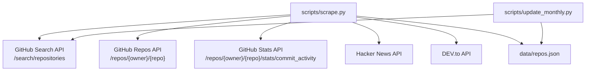
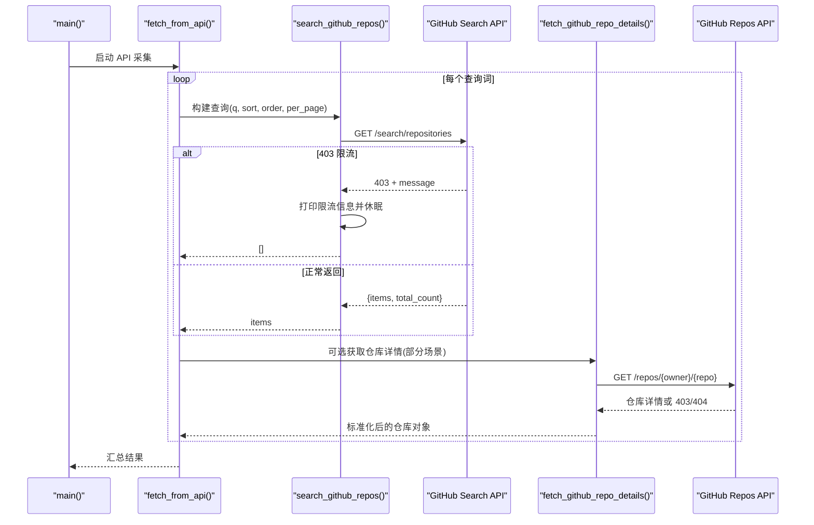
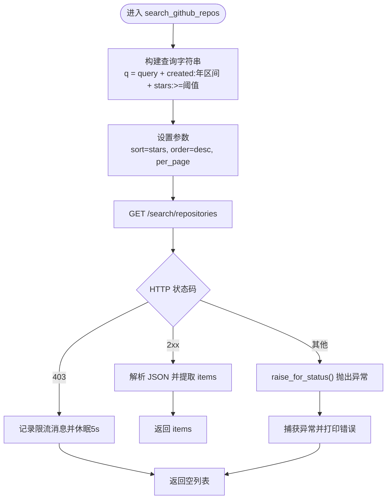
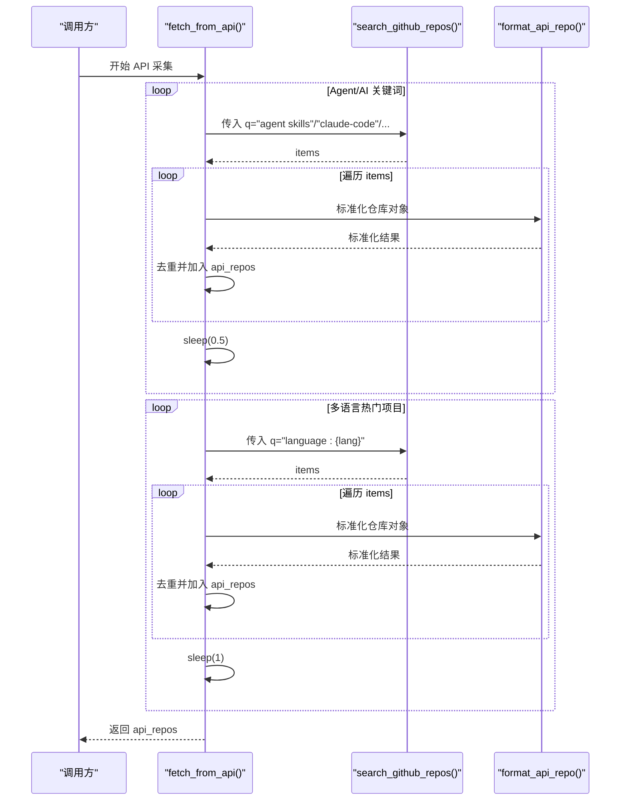
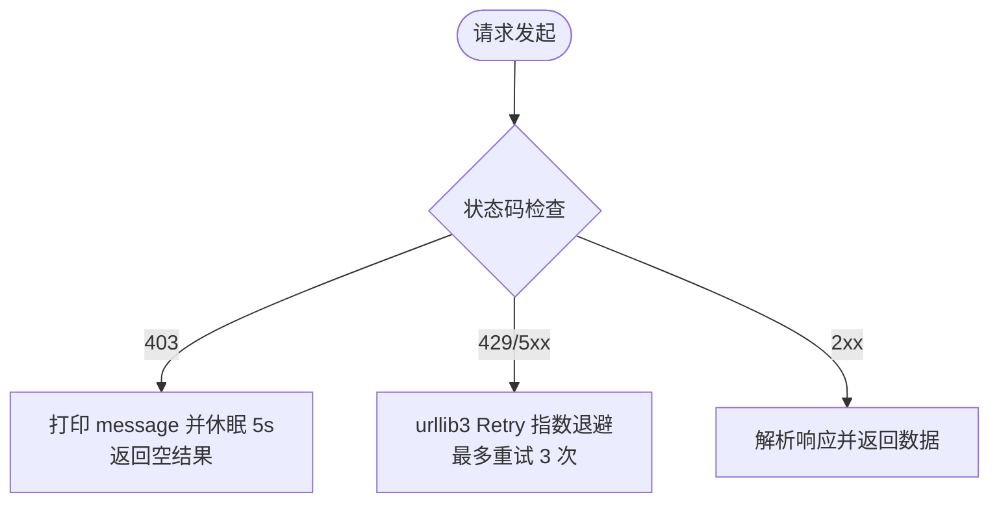
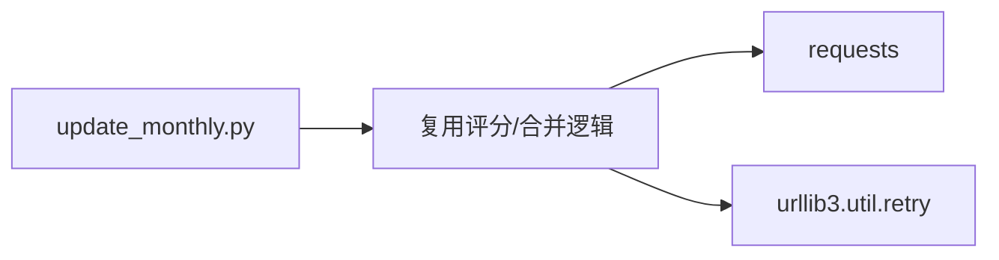

# GitHub API 采集器

<cite>
**本文引用的文件**
- [scripts/scrape.py](file://scripts/scrape.py)
- [scripts/update_monthly.py](file://scripts/update_monthly.py)
- [tests/test_scripts.py](file://tests/test_scripts.py)
- [README.md](file://README.md)
- [requirements.txt](file://requirements.txt)
</cite>

## 目录
1. [简介](#简介)
2. [项目结构](#项目结构)
3. [核心组件](#核心组件)
4. [架构总览](#架构总览)
5. [详细组件分析](#详细组件分析)
6. [依赖关系分析](#依赖关系分析)
7. [性能与限流](#性能与限流)
8. [故障排查指南](#故障排查指南)
9. [结论](#结论)
10. [附录：API 调用示例与参数说明](#附录api-调用示例与参数说明)

## 简介
本仓库实现了一个多源 GitHub 高质量项目采集器，通过 Awesome Lists、GitHub Search API、Hacker News、DEV.to 等数据源聚合，统一评分排序后输出结构化数据集。本文聚焦于 GitHub API 采集器的实现细节，重点解析 search_github_repos 与 fetch_from_api 两个关键函数，涵盖查询语法构建、分页参数设置、排序规则配置、多策略搜索（Agent/AI 关键词与多语言热门项目）、限流处理（403 状态码）、重试策略与错误恢复，并给出具体 API 调用示例与响应数据处理流程。

## 项目结构
- scripts/scrape.py：主采集脚本，包含多源抓取、合并、评分、保存逻辑
- scripts/update_monthly.py：按月增量更新脚本，复用评分与合并策略
- tests/test_scripts.py：单元测试，覆盖评分、格式化、会话重试等
- README.md：使用说明、数据源、评分算法概述
- requirements.txt：运行时依赖（requests）

图表来源
- [scripts/scrape.py:243-298](file://scripts/scrape.py#L243-L298)
- [scripts/scrape.py:172-191](file://scripts/scrape.py#L172-L191)
- [scripts/scrape.py:133-147](file://scripts/scrape.py#L133-L147)
- [scripts/update_monthly.py:49-76](file://scripts/update_monthly.py#L49-L76)

章节来源
- [README.md:123-148](file://README.md#L123-L148)
- [requirements.txt:1-1](file://requirements.txt#L1-L1)

## 核心组件
- 请求头与会话管理
  - get_headers：构造 User-Agent、Accept，可选 Authorization（GITHUB_TOKEN）
  - get_session：基于 requests.Session + urllib3 Retry，对 429/500/502/503/504 指数退避重试
- GitHub API 封装
  - search_github_repos：按查询语法、时间范围、最小星标、排序与分页访问 /search/repositories
  - fetch_github_repo_details：获取单个仓库详情，处理 404/403 等异常
  - fetch_commit_activity：免费端点获取近四周提交量，用于活跃度信号
- 多策略采集
  - fetch_from_api：Agent/AI 关键词 + 多语言热门项目双通道
  - fetch_trending_repos：近期推送/创建、新星项目等多维度组合查询
- 数据处理与评分
  - format_api_repo：标准化字段
  - estimate_today_stars：基于推送时间与仓库年龄估算“今日星标增长”
  - calculate_score：综合 stars/forks/today_stars/commits 的评分公式
  - merge_and_sort：跨源去重、字段级取最大值、合并 source 标签、最终排序

章节来源
- [scripts/scrape.py:103-131](file://scripts/scrape.py#L103-L131)
- [scripts/scrape.py:243-266](file://scripts/scrape.py#L243-L266)
- [scripts/scrape.py:268-298](file://scripts/scrape.py#L268-L298)
- [scripts/scrape.py:172-191](file://scripts/scrape.py#L172-L191)
- [scripts/scrape.py:133-147](file://scripts/scrape.py#L133-L147)
- [scripts/scrape.py:301-333](file://scripts/scrape.py#L301-L333)
- [scripts/scrape.py:546-559](file://scripts/scrape.py#L546-L559)
- [scripts/scrape.py:562-573](file://scripts/scrape.py#L562-L573)
- [scripts/scrape.py:575-622](file://scripts/scrape.py#L575-L622)

## 架构总览
下图展示了从入口到各数据源的调用链路与数据流向，突出 GitHub API 采集路径与错误/限流处理分支。

图表来源
- [scripts/scrape.py:268-298](file://scripts/scrape.py#L268-L298)
- [scripts/scrape.py:243-266](file://scripts/scrape.py#L243-L266)
- [scripts/scrape.py:172-191](file://scripts/scrape.py#L172-L191)

## 详细组件分析

### search_github_repos 函数详解
- 功能：封装 GitHub Search API 的通用调用，支持查询语法、时间窗口、最小星标、排序与分页。
- 查询语法构建
  - 基础语法：{query} created:{year}-01-01..{year}-12-31 stars:>={min_stars}
  - 年份动态计算：使用当前年份，确保仅检索当年创建的仓库
  - 排序与顺序：sort=stars, order=desc
  - 分页：per_page 控制每页数量（默认 30）
- 限流与错误处理
  - 403 状态码：打印 message 并休眠 5 秒后返回空列表，避免阻塞后续任务
  - 其他异常：捕获并打印错误，返回空列表，保证整体流程健壮性
- 返回值：items 数组（若成功），否则为空列表

图表来源
- [scripts/scrape.py:243-266](file://scripts/scrape.py#L243-L266)

章节来源
- [scripts/scrape.py:243-266](file://scripts/scrape.py#L243-L266)

### fetch_from_api 函数详解
- 功能：执行多策略搜索，包括 Agent/AI 相关关键词与多语言热门项目。
- 多策略搜索
  - Agent/AI 关键词：agent skills、claude-code、AI framework、LLM inference、RAG
  - 多语言热门项目：遍历 LANGUAGES[:6]（python、javascript、typescript、go、rust、java），按 language:{lang} 查询
- 去重与标准化
  - 使用 seen 集合避免重复入库
  - 通过 format_api_repo 将 API 原始响应转换为统一 schema
- 速率控制
  - 每次查询后 time.sleep(0.5~1)，降低瞬时并发，减少触发限流概率

图表来源
- [scripts/scrape.py:268-298](file://scripts/scrape.py#L268-L298)
- [scripts/scrape.py:546-559](file://scripts/scrape.py#L546-L559)

章节来源
- [scripts/scrape.py:268-298](file://scripts/scrape.py#L268-L298)
- [scripts/scrape.py:546-559](file://scripts/scrape.py#L546-L559)

### 限流处理机制（403 状态码）
- 在 search_github_repos 中显式检测 403，打印 message 并休眠 5 秒后返回空列表，避免继续消耗配额
- 在 fetch_github_repo_details 中对 403 进行同样处理，防止阻塞详情获取
- 全局重试策略（get_session）针对 429/500/502/503/504 指数退避，但 403 由业务层单独处理，体现“限流 vs 服务器错误”的区别

图表来源
- [scripts/scrape.py:243-266](file://scripts/scrape.py#L243-L266)
- [scripts/scrape.py:172-191](file://scripts/scrape.py#L172-L191)
- [scripts/scrape.py:114-131](file://scripts/scrape.py#L114-L131)

章节来源
- [scripts/scrape.py:243-266](file://scripts/scrape.py#L243-L266)
- [scripts/scrape.py:172-191](file://scripts/scrape.py#L172-L191)
- [scripts/scrape.py:114-131](file://scripts/scrape.py#L114-L131)

### 重试策略与错误恢复
- 会话级重试：get_session 使用 HTTPAdapter + Retry，对 429/500/502/503/504 自动重试，backoff_factor=1.0（间隔 1s、2s、4s）
- 业务层恢复：403 限流时主动休眠并返回空结果；其他异常捕获后打印错误并返回空结果，确保整体流程不中断
- 测试验证：单元测试验证 get_session 返回 Session 且 mounted adapter 的 max_retries.total == 3

章节来源
- [scripts/scrape.py:114-131](file://scripts/scrape.py#L114-L131)
- [tests/test_scripts.py:260-268](file://tests/test_scripts.py#L260-L268)

### 响应数据处理流程
- 标准化格式：format_api_repo 将 full_name/html_url/description/stargazers_count/forks_count/language 映射为统一字段，并补充 today_stars/score/fetched_at/source
- 去重与合并：merge_and_sort 对同名仓库进行字段级取最大值（stars/forks/today_stars/commit_activity），合并 source 标签，并按 score 降序排列
- 评分算法：calculate_score 综合 stars、forks、today_stars、commit_activity，体现热度、社区参与度与活跃度

章节来源
- [scripts/scrape.py:546-559](file://scripts/scrape.py#L546-L559)
- [scripts/scrape.py:575-622](file://scripts/scrape.py#L575-L622)
- [scripts/scrape.py:562-573](file://scripts/scrape.py#L562-L573)

## 依赖关系分析
- 外部依赖
  - requests：HTTP 客户端
  - urllib3.util.retry：重试策略
- 内部模块关系
  - scrape.py 作为主入口，协调多个采集函数与数据处理函数
  - update_monthly.py 复用评分与合并策略，专注月度增量采集

图表来源
- [requirements.txt:1-1](file://requirements.txt#L1-L1)
- [scripts/scrape.py:114-131](file://scripts/scrape.py#L114-L131)
- [scripts/update_monthly.py:154-165](file://scripts/update_monthly.py#L154-L165)

章节来源
- [requirements.txt:1-1](file://requirements.txt#L1-L1)
- [scripts/scrape.py:114-131](file://scripts/scrape.py#L114-L131)
- [scripts/update_monthly.py:154-165](file://scripts/update_monthly.py#L154-L165)

## 性能与限流
- 并发与节流
  - fetch_from_api 在每个查询后插入 sleep(0.5~1)，降低瞬时请求频率
  - 建议结合 GITHUB_TOKEN 提升配额上限（60→5000 req/hour）
- 分页策略
  - search_github_repos 默认 per_page=30，可按需增大以减少往返次数
  - update_monthly.py 演示了 page 参数与 total_count 统计，便于多页拉取
- 预估指标优化
  - estimate_today_stars 利用 pushed_at/created_at 与 stargazers_count 估算“今日星标”，提高前端 Surge Index 准确性
  - 对 top-N trending 候选额外调用 stats/commit_activity 以真实提交量增强信号

章节来源
- [scripts/scrape.py:268-298](file://scripts/scrape.py#L268-L298)
- [scripts/scrape.py:301-333](file://scripts/scrape.py#L301-L333)
- [scripts/scrape.py:133-147](file://scripts/scrape.py#L133-L147)
- [scripts/update_monthly.py:49-76](file://scripts/update_monthly.py#L49-L76)

## 故障排查指南
- 常见错误
  - 403 限流：检查是否设置 GITHUB_TOKEN；确认未短时间内高频调用；观察日志中的 message
  - 429/5xx：由 Retry 自动处理，若仍失败，适当增加 sleep 或降低 per_page
  - 网络超时：调整 timeout 参数（当前默认 10~30 秒）
- 定位方法
  - 查看 print 输出中的限流信息与错误堆栈
  - 使用单元测试验证 get_session 的 retry 配置是否正确挂载
- 恢复建议
  - 遇到 403 时等待 5 秒后重试；必要时暂停整个采集任务一段时间
  - 降低并发与 per_page，分批执行

章节来源
- [scripts/scrape.py:243-266](file://scripts/scrape.py#L243-L266)
- [scripts/scrape.py:172-191](file://scripts/scrape.py#L172-L191)
- [tests/test_scripts.py:260-268](file://tests/test_scripts.py#L260-L268)

## 结论
search_github_repos 与 fetch_from_api 构成了 GitHub API 采集的核心能力：前者提供统一的查询接口与限流保护，后者通过多策略关键词与语言维度扩展覆盖面。配合全局重试、字段级合并与评分体系，系统能够在高并发与限流环境下稳定产出高质量项目清单。建议在生产环境中启用 GITHUB_TOKEN、合理设置 per_page 与 sleep，并结合月度增量脚本持续维护数据新鲜度。

## 附录：API 调用示例与参数说明

- 基本调用（Python）
  - 使用 get_session().get(url, params=params, headers=get_headers(), timeout=30)
  - url：https://api.github.com/search/repositories
  - params：
    - q：查询字符串（见下方语法）
    - sort：stars
    - order：desc
    - per_page：每页数量（默认 30）
    - page：页码（update_monthly.py 中使用）
  - headers：User-Agent、Accept、Authorization（可选）

- 查询语法示例
  - 年度新仓库 + 最低星标：agent skills created:2026-01-01..2026-12-31 stars:>=500
  - 指定语言热门项目：language:python stars:>=2000
  - 近期推送/创建：pushed:>2026-06-01 stars:>500；created:>2026-05-01 stars:>1000
  - 上升项目（低星但活跃）：pushed:>2026-06-01 stars:3..50

- 响应数据结构
  - items：仓库列表，包含 full_name、html_url、description、stargazers_count、forks_count、language 等
  - total_count：总匹配数（update_monthly.py 中打印）

- 数据处理流程
  - format_api_repo：标准化字段并补充 today_stars/score/fetched_at/source
  - merge_and_sort：去重、字段级取最大值、合并 source、按 score 降序
  - calculate_score：stars + forks + (forks/stars)*1000 + today_stars*10 + commit_activity*2

章节来源
- [scripts/scrape.py:243-266](file://scripts/scrape.py#L243-L266)
- [scripts/scrape.py:268-298](file://scripts/scrape.py#L268-L298)
- [scripts/scrape.py:546-559](file://scripts/scrape.py#L546-L559)
- [scripts/scrape.py:562-573](file://scripts/scrape.py#L562-L573)
- [scripts/scrape.py:575-622](file://scripts/scrape.py#L575-L622)
- [scripts/update_monthly.py:49-76](file://scripts/update_monthly.py#L49-L76)