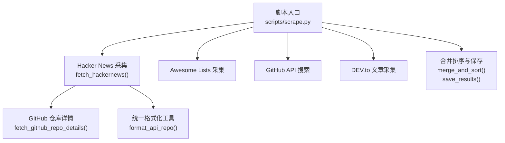
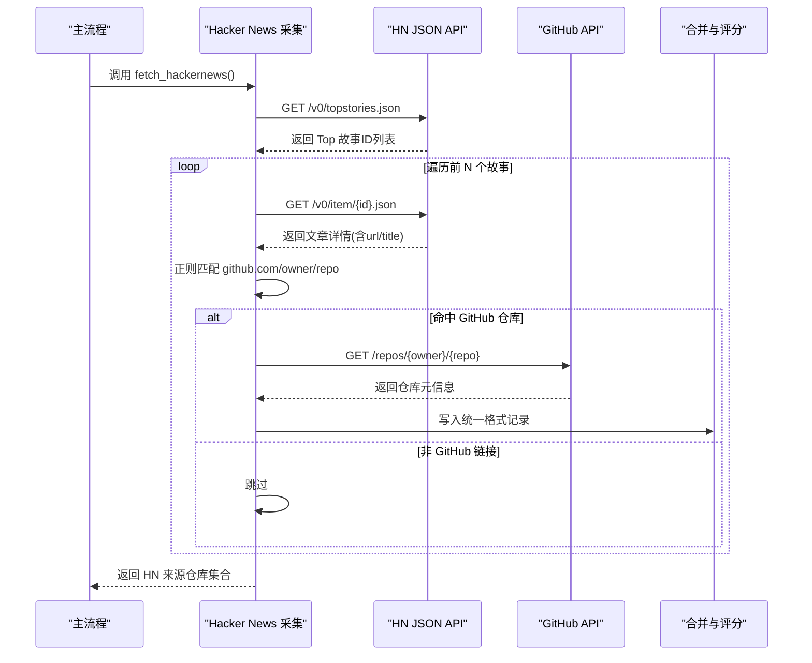
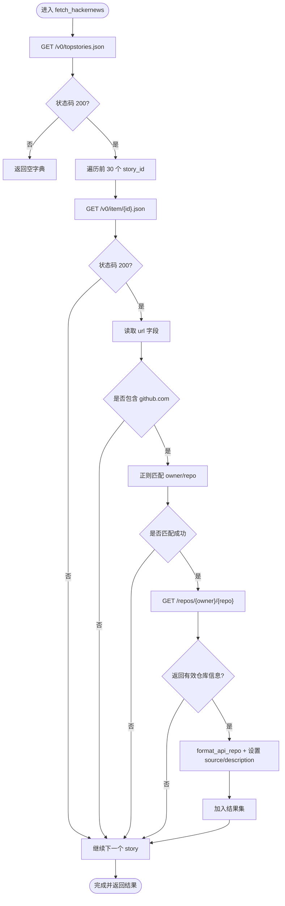
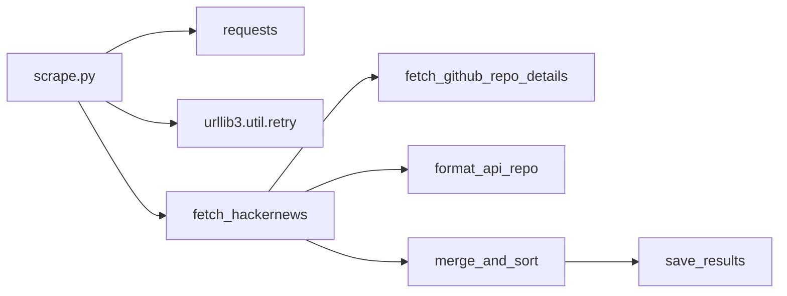

# Hacker News 采集器

<cite>
**本文引用的文件**
- [scripts/scrape.py](file://scripts/scrape.py)
- [README.md](file://README.md)
- [requirements.txt](file://requirements.txt)
- [tests/test_scripts.py](file://tests/test_scripts.py)
</cite>

## 目录
1. [简介](#简介)
2. [项目结构](#项目结构)
3. [核心组件](#核心组件)
4. [架构总览](#架构总览)
5. [详细组件分析](#详细组件分析)
6. [依赖关系分析](#依赖关系分析)
7. [性能与稳定性](#性能与稳定性)
8. [故障排查指南](#故障排查指南)
9. [结论](#结论)
10. [附录：API 调用示例与数据流](#附录api-调用示例与数据流)

## 简介
本技术文档聚焦于仓库中的 Hacker News 采集能力，围绕 fetch_hackernews 函数的实现进行深入解析。内容涵盖：
- topstories.json 接口调用流程
- 文章详情获取与 URL 解析
- GitHub 仓库识别的正则匹配规则
- 以文章标题作为项目描述的处理策略
- 错误处理与超时控制机制
- 具体 API 调用示例、数据转换流程与异常处理路径

该功能是多源聚合脚本中的一个子模块，负责从 Hacker News 的公开 JSON API 抓取热门帖子，筛选出指向 GitHub 仓库的链接，并进一步通过 GitHub API 拉取仓库元信息，最终与其他来源（Awesome Lists、GitHub Search、DEV.to）合并输出。

## 项目结构
与 Hacker News 采集相关的代码位于 Python 脚本中，主入口为多源聚合脚本；测试用例覆盖部分通用逻辑；README 提供总体说明与运行方式。

图表来源
- [scripts/scrape.py:405-461](file://scripts/scrape.py#L405-L461)
- [scripts/scrape.py:172-191](file://scripts/scrape.py#L172-L191)
- [scripts/scrape.py:546-559](file://scripts/scrape.py#L546-L559)
- [scripts/scrape.py:575-622](file://scripts/scrape.py#L575-L622)
- [scripts/scrape.py:625-649](file://scripts/scrape.py#L625-L649)

章节来源
- [README.md:123-148](file://README.md#L123-L148)
- [scripts/scrape.py:671-716](file://scripts/scrape.py#L671-L716)

## 核心组件
- HTTP 会话与重试：基于 requests.Session 与 urllib3 Retry，对 429/5xx 进行指数退避重试，提升稳定性。
- Hacker News 采集：调用 topstories.json 获取 ID 列表，再逐个请求 item/{id}.json 获取文章详情，过滤 GitHub 链接并提取 owner/repo。
- GitHub 仓库详情：通过 /repos/{owner}/{repo} 获取仓库元信息，处理 404/403 等状态码。
- 数据格式化：将 GitHub API 返回的结构转换为统一 schema，包含 stars/forks/language/description/score 等字段。
- 合并与评分：跨来源去重，按数值字段取最大值，计算综合评分并排序。

章节来源
- [scripts/scrape.py:114-130](file://scripts/scrape.py#L114-L130)
- [scripts/scrape.py:405-461](file://scripts/scrape.py#L405-L461)
- [scripts/scrape.py:172-191](file://scripts/scrape.py#L172-L191)
- [scripts/scrape.py:546-559](file://scripts/scrape.py#L546-L559)
- [scripts/scrape.py:575-622](file://scripts/scrape.py#L575-L622)

## 架构总览
下图展示了 Hacker News 采集在整体系统中的位置与交互关系。

图表来源
- [scripts/scrape.py:405-461](file://scripts/scrape.py#L405-L461)
- [scripts/scrape.py:172-191](file://scripts/scrape.py#L172-L191)

## 详细组件分析

### fetch_hackernews 函数实现原理
- 调用 HN 的 topstories.json 接口，获取热门故事 ID 列表，仅处理前 30 条以降低请求量。
- 对每个 story_id 发起 item/{id}.json 请求，读取 url 字段。
- 使用正则表达式 r"github\.com/([a-zA-Z0-9_.-]+)/([a-zA-Z0-9_.-]+)" 匹配 GitHub 仓库地址，捕获 owner 和 repo。
- 若匹配成功且未重复，调用 GitHub API 获取仓库详情，并通过 format_api_repo 转为统一结构。
- 将 HN 文章的 title 作为 description 的优先值，否则回退到仓库自身的 description。
- 设置 source 为 "hackernews"，用于后续合并时标记来源。

图表来源
- [scripts/scrape.py:405-461](file://scripts/scrape.py#L405-L461)
- [scripts/scrape.py:172-191](file://scripts/scrape.py#L172-L191)
- [scripts/scrape.py:546-559](file://scripts/scrape.py#L546-L559)

章节来源
- [scripts/scrape.py:405-461](file://scripts/scrape.py#L405-L461)

### 正则表达式匹配模式详解
- 模式：r"github\.com/([a-zA-Z0-9_.-]+)/([a-zA-Z0-9_.-]+)"
- 作用：从任意字符串中提取形如 https://github.com/owner/repo 的仓库地址片段，捕获 owner 与 repo 两部分。
- 字符集说明：
  - [a-zA-Z0-9_.-] 允许字母、数字、下划线、点、连字符，符合 GitHub 用户名与仓库名的常见命名规范。
  - 使用分组 () 分别捕获 owner 与 repo，便于后续构造 full_name 与调用 GitHub API。
- 使用场景：
  - HN 文章详情页的 url 字段可能包含完整链接或带查询参数/锚点的变体，该模式能稳健地提取 owner/repo。
  - DEV.to 的文章标签与正文中也复用相同模式进行仓库识别。
- 注意事项：
  - 不匹配组织级页面或非仓库路径（如 /features、/topics），因为路径段不符合 owner/repo 的两段式结构。
  - 若 URL 中包含额外路径（例如 /issues、/pulls），该模式仍会匹配到 owner/repo 前缀，但通常 HN 链接直接指向仓库首页。

章节来源
- [scripts/scrape.py:436-438](file://scripts/scrape.py#L436-L438)
- [scripts/scrape.py:488-491](file://scripts/scrape.py#L488-L491)

### 文章标题作为项目描述的处理
- 当 HN 文章指向 GitHub 仓库时，优先使用文章的 title 作为 description，以便更贴近社区传播语境。
- 若文章无 title 或为空，则回退到仓库自身 description。
- 该策略有助于在展示层提供更丰富的上下文信息，同时保证有兜底描述可用。

章节来源
- [scripts/scrape.py:448-450](file://scripts/scrape.py#L448-L450)

### 错误处理与超时控制
- 网络层：
  - 使用 requests.Session 配合 urllib3 Retry，针对 429/500/502/503/504 自动重试，最大 3 次，指数退避因子 1.0。
  - 所有外部请求均设置 timeout，避免长时间阻塞。
- 业务层：
  - HN 接口失败（非 200）直接返回空结果，不影响其他来源采集。
  - 单个 item 请求失败或解析异常会被 try/except 包裹，跳过当前条目继续处理。
  - GitHub API 404 表示仓库不存在，403 表示限流，均安全返回 None 并打印提示。
- 速率限制：
  - 对 HN 与 GitHub 的请求间插入 time.sleep，降低瞬时并发，减少被限流风险。

章节来源
- [scripts/scrape.py:114-130](file://scripts/scrape.py#L114-L130)
- [scripts/scrape.py:405-461](file://scripts/scrape.py#L405-L461)
- [scripts/scrape.py:172-191](file://scripts/scrape.py#L172-L191)

### 数据转换流程
- 输入：HN 文章详情（包含 url、title 等）。
- 中间步骤：
  - URL 解析与正则匹配得到 owner/repo。
  - 调用 GitHub API 获取仓库元信息。
  - 使用 format_api_repo 将 GitHub API 响应映射为统一结构。
- 输出：标准仓库对象，包含 name/url/description/stars/forks/language/today_stars/score/fetched_at/source 等字段。

章节来源
- [scripts/scrape.py:546-559](file://scripts/scrape.py#L546-L559)

## 依赖关系分析
- 外部依赖：
  - requests：HTTP 客户端库，用于发起网络请求。
  - urllib3.util.retry：重试策略，集成在 requests.adapters.HTTPAdapter 中。
- 内部依赖：
  - get_session：创建带重试的 Session。
  - fetch_github_repo_details：获取仓库详情。
  - format_api_repo：统一数据结构。
  - merge_and_sort/save_results：汇总与持久化。

图表来源
- [scripts/scrape.py:114-130](file://scripts/scrape.py#L114-L130)
- [scripts/scrape.py:405-461](file://scripts/scrape.py#L405-L461)
- [scripts/scrape.py:575-622](file://scripts/scrape.py#L575-L622)
- [scripts/scrape.py:625-649](file://scripts/scrape.py#L625-L649)

章节来源
- [requirements.txt:1-1](file://requirements.txt#L1-L1)
- [scripts/scrape.py:114-130](file://scripts/scrape.py#L114-L130)

## 性能与稳定性
- 请求节流：
  - HN 循环中对每个 item 请求后 sleep 0.2 秒，避免过快触发限流。
  - GitHub API 请求也采用 sleep 与重试策略，提高成功率。
- 超时控制：
  - 各接口均设置合理超时（10~30 秒），防止长时间挂起。
- 资源裁剪：
  - HN 仅处理前 30 条热门故事，平衡覆盖面与成本。
- 可扩展性：
  - 可通过调整 topstories 切片大小、sleep 间隔与重试次数来优化吞吐与稳定性。

[本节为通用指导，无需特定文件引用]

## 故障排查指南
- 无法加载数据（前端报错）：
  - 需通过本地 HTTP 服务访问，浏览器禁止 file:// 协议下的 fetch 请求。
- 触发 GitHub API 限流：
  - 设置环境变量 GITHUB_TOKEN，可将配额从 60 提升至 5000 次/小时。
- 常见问题定位：
  - 检查 HN 接口状态码是否为 200。
  - 确认正则是否能正确匹配目标 URL。
  - 查看 GitHub API 返回的 404/403 消息，必要时增加 token 或降低并发。

章节来源
- [README.md:166-171](file://README.md#L166-L171)
- [scripts/scrape.py:172-191](file://scripts/scrape.py#L172-L191)

## 结论
fetch_hackernews 以简洁可靠的流程实现了从 Hacker News 到 GitHub 仓库的发现链路：通过 topstories.json 快速定位热点，利用正则精准识别仓库链接，结合 GitHub API 获取结构化元数据，并以文章标题增强描述语义。其错误处理与超时控制确保了在外部服务不稳定时的鲁棒性，适合作为多源聚合系统的重要补充来源。

[本节为总结性内容，无需特定文件引用]

## 附录：API 调用示例与数据流

### API 调用示例
- 获取 HN 热门故事 ID 列表
  - 方法：GET
  - 端点：https://hacker-news.firebaseio.com/v0/topstories.json
  - 超时：10 秒
  - 返回：整数 ID 数组
- 获取 HN 文章详情
  - 方法：GET
  - 端点：https://hacker-news.firebaseio.com/v0/item/{id}.json
  - 超时：10 秒
  - 关键字段：url、title
- 获取 GitHub 仓库详情
  - 方法：GET
  - 端点：https://api.github.com/repos/{owner}/{repo}
  - 超时：10 秒
  - 关键字段：full_name、html_url、description、stargazers_count、forks_count、language

章节来源
- [scripts/scrape.py:413-427](file://scripts/scrape.py#L413-L427)
- [scripts/scrape.py:172-191](file://scripts/scrape.py#L172-L191)

### 数据转换流程
- 输入：HN 文章详情（url、title）
- 处理：
  - 正则匹配 owner/repo
  - 调用 GitHub API 获取仓库元信息
  - 使用 format_api_repo 生成统一结构
- 输出：标准仓库对象（name/url/description/stars/forks/language/today_stars/score/fetched_at/source）

章节来源
- [scripts/scrape.py:436-450](file://scripts/scrape.py#L436-L450)
- [scripts/scrape.py:546-559](file://scripts/scrape.py#L546-L559)

### 异常处理机制
- 网络异常：try/except 包裹，记录日志并跳过当前条目。
- 状态码异常：
  - HN 非 200：返回空结果或跳过当前项。
  - GitHub 404：仓库不存在，返回 None。
  - GitHub 403：限流，打印消息并返回 None。
- 超时：所有请求设置 timeout，避免阻塞。

章节来源
- [scripts/scrape.py:405-461](file://scripts/scrape.py#L405-L461)
- [scripts/scrape.py:172-191](file://scripts/scrape.py#L172-L191)