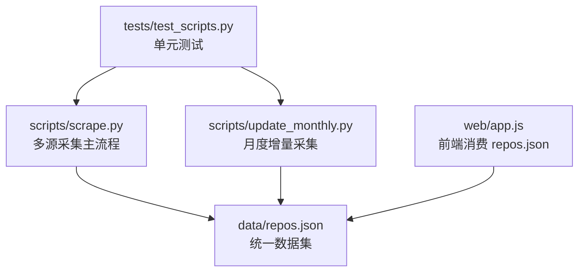
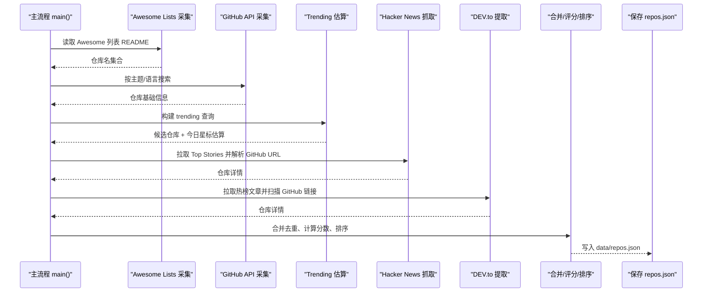
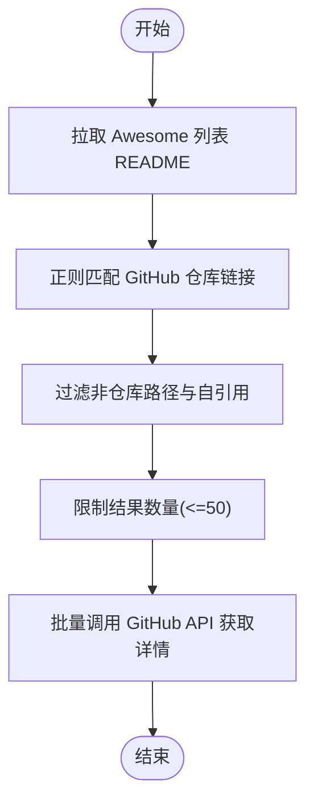
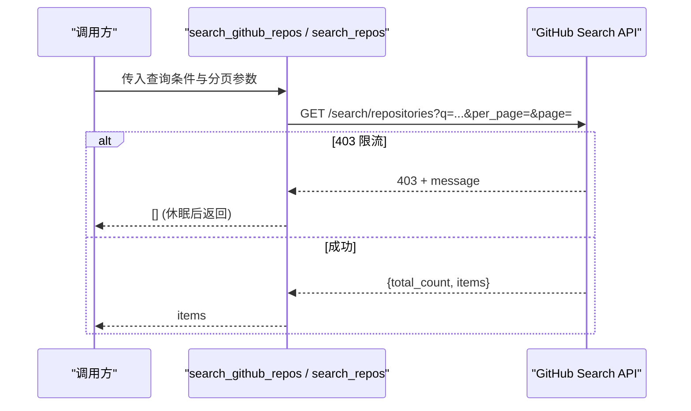
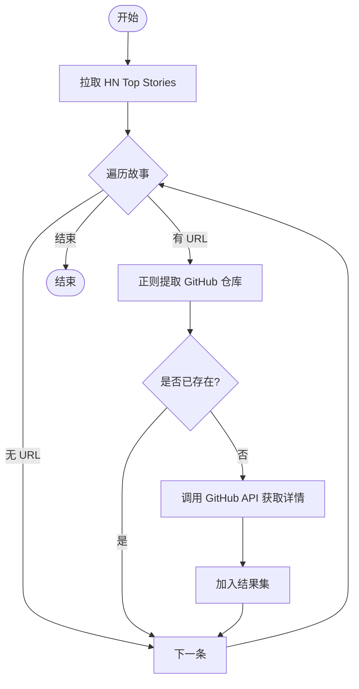
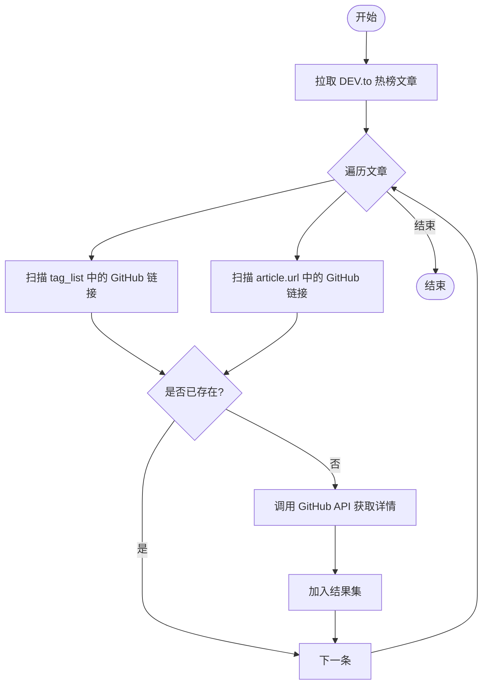
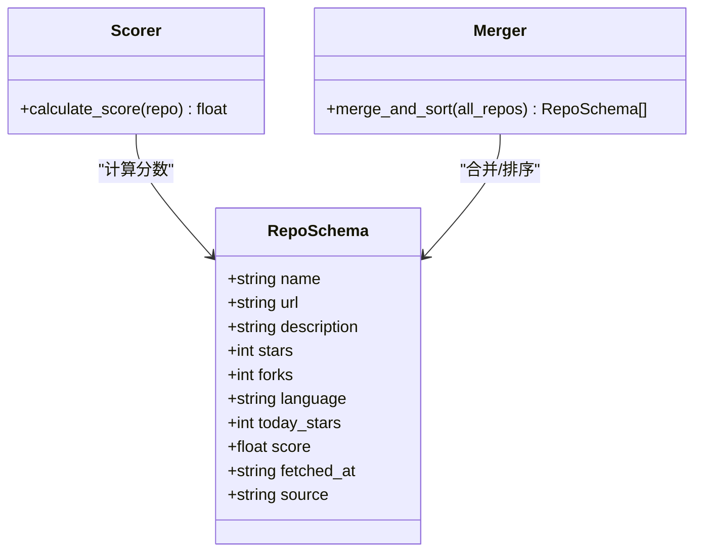
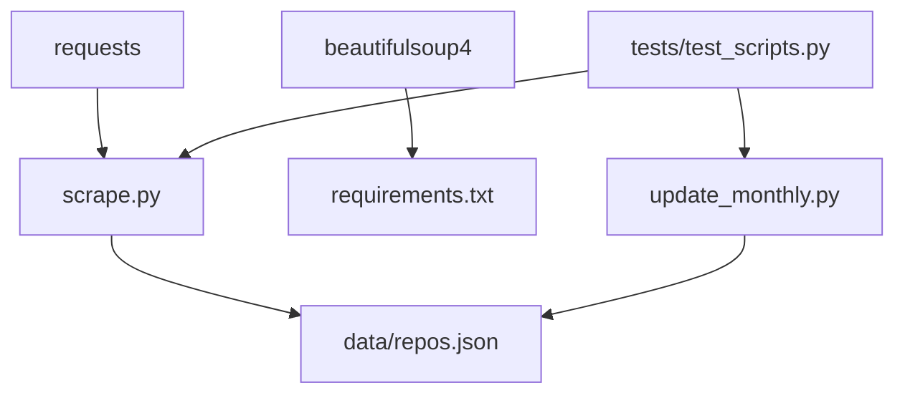

# 数据源采集器

<cite>
**本文引用的文件**
- [README.md](file://README.md)
- [scripts/scrape.py](file://scripts/scrape.py)
- [scripts/update_monthly.py](file://scripts/update_monthly.py)
- [requirements.txt](file://requirements.txt)
- [tests/test_scripts.py](file://tests/test_scripts.py)
</cite>

## 目录
1. [简介](#简介)
2. [项目结构](#项目结构)
3. [核心组件](#核心组件)
4. [架构总览](#架构总览)
5. [详细组件分析](#详细组件分析)
6. [依赖关系分析](#依赖关系分析)
7. [性能与优化](#性能与优化)
8. [故障排查指南](#故障排查指南)
9. [结论](#结论)
10. [附录：扩展新数据源采集器](#附录扩展新数据源采集器)

## 简介
本项目是一个开源的、全自动化的高质量 GitHub 项目聚合器，整合了五大类数据源：Awesome Lists（Markdown 列表解析）、GitHub Search API（多维度查询）、Hacker News（热门帖子链接提取）、DEV.to（文章标签与正文扫描），并通过统一的评分算法与标准化数据结构输出到前端展示。系统支持增量月度更新、离线 PWA 浏览、书签管理与灵感模式等特性。

本技术文档聚焦于“数据源采集器”的实现原理、错误处理与重试策略、性能优化方法，以及统一接口设计与数据标准化流程，并提供扩展新数据源的实践指导。

## 项目结构
仓库采用脚本驱动的数据采集与合并方案，核心逻辑集中在 scripts 目录下，测试用例位于 tests 目录，静态资源与前端在 web 目录，数据产物保存在 data 目录。

图表来源
- [scripts/scrape.py:650-696](file://scripts/scrape.py#L650-L696)
- [scripts/update_monthly.py:300-344](file://scripts/update_monthly.py#L300-L344)
- [tests/test_scripts.py:1-250](file://tests/test_scripts.py#L1-L250)

章节来源
- [README.md:123-148](file://README.md#L123-L148)

## 核心组件
- Awesome Lists 解析器：从多个 Awesome 列表的 README 中通过正则匹配 GitHub 仓库链接，过滤非仓库路径与自引用，限制结果数量以避免后续 API 压力。
- GitHub Search API 集成：按主题与语言维度发起搜索请求，构造查询语法，控制分页与限流，返回仓库基础信息并格式化至统一 schema。
- Hacker News 抓取器：调用 HN 公开 API 获取 Top Stories，逐个拉取详情，使用正则从 URL 中提取 GitHub 仓库地址，再调用 GitHub API 补充详细信息。
- DEV.to 文章提取器：调用 DEV.to 公开 API 获取热榜文章，从标签列表与文章 URL 中扫描 GitHub 链接，去重后调用 GitHub API 获取详情。
- 数据标准化与评分：将各来源数据映射到统一字段，计算分数（stars、forks、today_stars、commit_activity 加权），合并去重并按分数排序。

章节来源
- [scripts/scrape.py:130-151](file://scripts/scrape.py#L130-L151)
- [scripts/scrape.py:224-278](file://scripts/scrape.py#L224-L278)
- [scripts/scrape.py:385-441](file://scripts/scrape.py#L385-L441)
- [scripts/scrape.py:444-508](file://scripts/scrape.py#L444-L508)
- [scripts/scrape.py:526-552](file://scripts/scrape.py#L526-L552)

## 架构总览
整体采集流程由主入口函数编排，依次执行各数据源采集器，汇总结果后进行去重、评分与排序，最终写入 JSON 文件供前端消费。

图表来源
- [scripts/scrape.py:650-696](file://scripts/scrape.py#L650-L696)
- [scripts/scrape.py:174-222](file://scripts/scrape.py#L174-L222)
- [scripts/scrape.py:248-278](file://scripts/scrape.py#L248-L278)
- [scripts/scrape.py:316-382](file://scripts/scrape.py#L316-L382)
- [scripts/scrape.py:385-441](file://scripts/scrape.py#L385-L441)
- [scripts/scrape.py:444-508](file://scripts/scrape.py#L444-L508)
- [scripts/scrape.py:555-602](file://scripts/scrape.py#L555-L602)

## 详细组件分析

### Awesome Lists 解析（Markdown 格式处理、正则表达式匹配）
- 实现要点
  - 遍历预配置的 Awesome 列表原始 README 链接，下载文本内容。
  - 使用正则匹配 Markdown 链接中的 GitHub 仓库地址，过滤非仓库路径（如 features、topics 等）与 awesome- 前缀的自引用。
  - 对每个仓库名进行去重与上限限制（最多 50 个），随后批量调用 GitHub API 获取详情。
- 错误处理
  - README 拉取失败时跳过当前列表继续下一个。
  - 单个仓库详情获取失败或 404/403 时记录日志并忽略。
- 性能优化
  - 限制解析后的仓库数量，避免过多 API 调用。
  - 在循环间加入短暂休眠，降低瞬时请求频率。
- 复杂度分析
  - 正则匹配为线性扫描，时间复杂度 O(N)，N 为 README 行数；后续 API 调用次数受限于上限。

图表来源
- [scripts/scrape.py:130-151](file://scripts/scrape.py#L130-L151)
- [scripts/scrape.py:174-222](file://scripts/scrape.py#L174-L222)

章节来源
- [scripts/scrape.py:130-151](file://scripts/scrape.py#L130-L151)
- [scripts/scrape.py:174-222](file://scripts/scrape.py#L174-L222)
- [tests/test_scripts.py:109-141](file://tests/test_scripts.py#L109-L141)

### GitHub Search API 集成（查询语法、分页处理、限流控制）
- 实现要点
  - 构造查询字符串，包含时间范围、语言、主题关键词与最低 stars 阈值。
  - 支持 per_page 与 page 参数进行分页（月度脚本中显式翻页）。
  - 设置 User-Agent 与可选 Authorization 头以规避默认低配额。
- 错误处理
  - 403 限流时打印消息并休眠后返回空结果，避免中断整个流程。
  - 其他异常捕获并返回空结果，保证健壮性。
- 性能优化
  - 合理设置 per_page 与间隔休眠，平衡吞吐与限流风险。
  - 使用 seen 集合去重，减少重复入库。
- 复杂度分析
  - 每次搜索为一次 HTTP 请求，时间复杂度 O(P)，P 为返回条目数；总体复杂度取决于查询数量与分页页数。

图表来源
- [scripts/scrape.py:224-246](file://scripts/scrape.py#L224-L246)
- [scripts/update_monthly.py:50-76](file://scripts/update_monthly.py#L50-L76)

章节来源
- [scripts/scrape.py:224-278](file://scripts/scrape.py#L224-L278)
- [scripts/update_monthly.py:50-135](file://scripts/update_monthly.py#L50-L135)
- [tests/test_scripts.py:238-249](file://tests/test_scripts.py#L238-L249)

### Hacker News 数据抓取（API 调用、URL 提取）
- 实现要点
  - 调用 HN 公开 API 获取 topstories，遍历前 N 条故事详情。
  - 使用正则从 story.url 中提取 owner/repo，若命中则调用 GitHub API 获取详情。
  - 将 HN 标题作为描述优先填充，便于前端展示。
- 错误处理
  - 单条故事拉取失败时 continue，不影响整体流程。
  - 网络异常或 JSON 解析异常均被捕获并忽略。
- 性能优化
  - 对每条故事请求之间增加短暂休眠，避免触发上游限流。
- 复杂度分析
  - 线性遍历 Top Stories，时间复杂度 O(S)，S 为故事数量；其中仅对含 GitHub URL 的故事进行额外 API 调用。

图表来源
- [scripts/scrape.py:385-441](file://scripts/scrape.py#L385-L441)

章节来源
- [scripts/scrape.py:385-441](file://scripts/scrape.py#L385-L441)

### DEV.to 文章提取（标签解析、正文扫描）
- 实现要点
  - 调用 DEV.to 公开 API 获取热榜文章（top:7, per_page:50）。
  - 从 tag_list 与 article.url 中扫描 GitHub 链接，去重后调用 GitHub API 获取详情。
  - 使用文章标题作为描述优先填充。
- 错误处理
  - 拉取文章失败时直接返回空结果。
  - 单个链接解析或详情获取失败时 continue。
- 性能优化
  - 使用 seen 集合避免重复调用 GitHub API。
  - 请求间隔休眠，降低瞬时压力。
- 复杂度分析
  - 遍历文章与标签，时间复杂度 O(A+T)，A 为文章数，T 为标签总数；仅对首次出现的 GitHub 链接进行 API 调用。

图表来源
- [scripts/scrape.py:444-508](file://scripts/scrape.py#L444-L508)

章节来源
- [scripts/scrape.py:444-508](file://scripts/scrape.py#L444-L508)

### 数据标准化与统一接口设计
- 统一字段
  - name、url、description、stars、forks、language、today_stars、score、fetched_at、source。
- 标准化函数
  - format_api_repo 将 GitHub API 响应映射到统一 schema。
  - calculate_score 根据 stars、forks、today_stars、commit_activity 计算综合得分。
- 合并与去重
  - merge_and_sort 对同名仓库进行字段级最大值合并（stars/forks/today_stars/commit_activity），合并 source 标签，保留最新 fetched_at，最后按 score 降序排序。
- 复杂度分析
  - 合并阶段为 O(U)，U 为唯一仓库数；排序阶段为 O(U log U)。

图表来源
- [scripts/scrape.py:526-552](file://scripts/scrape.py#L526-L552)
- [scripts/scrape.py:555-602](file://scripts/scrape.py#L555-L602)

章节来源
- [scripts/scrape.py:526-602](file://scripts/scrape.py#L526-L602)
- [tests/test_scripts.py:143-198](file://tests/test_scripts.py#L143-L198)

## 依赖关系分析
- 外部依赖
  - requests：HTTP 客户端，用于访问 GitHub API、HN API、DEV.to API 与 Awesome 列表 README。
  - beautifulsoup4：声明在 requirements.txt，但当前采集脚本未直接使用（可能用于未来扩展）。
- 内部模块耦合
  - scrape.py 为主采集器，依赖统一格式与评分函数。
  - update_monthly.py 复用相同头部构造与搜索逻辑，侧重按月增量采集与报告生成。
  - tests/test_scripts.py 覆盖关键函数行为，确保稳定性。

图表来源
- [requirements.txt:1-2](file://requirements.txt#L1-L2)
- [scripts/scrape.py:650-696](file://scripts/scrape.py#L650-L696)
- [scripts/update_monthly.py:300-344](file://scripts/update_monthly.py#L300-L344)
- [tests/test_scripts.py:1-250](file://tests/test_scripts.py#L1-L250)

章节来源
- [requirements.txt:1-2](file://requirements.txt#L1-L2)

## 性能与优化
- 限流与退避
  - 针对 403 限流，统一在搜索函数中休眠固定秒数后返回空结果，避免阻塞主流程。
  - 建议在更复杂场景引入指数退避与最大重试次数，提升鲁棒性。
- 并发与并行
  - 当前实现为串行请求，适合小规模采集；如需扩展更多数据源或更大规模，可考虑线程池或异步 IO。
- 缓存与去重
  - 使用内存集合（seen）避免重复 API 调用；对于跨进程或持久化场景，可引入本地缓存（如 SQLite 或 Redis）。
- 分页与批处理
  - 月度脚本显式分页，建议结合 total_count 动态决定翻页次数，避免无效请求。
- 指标监控
  - 建议记录每次采集的请求耗时、成功率与限流次数，便于定位瓶颈。

[本节为通用性能讨论，不直接分析具体文件]

## 故障排查指南
- 常见问题
  - 页面加载失败：需通过 HTTP 服务器启动前端，浏览器禁止 file:// 协议下的 fetch。
  - GitHub API 限流：设置 GITHUB_TOKEN 环境变量以提升配额。
- 诊断步骤
  - 检查网络连通性与超时配置。
  - 查看控制台输出的限流信息与错误堆栈。
  - 验证输入参数（查询语法、日期范围、分页参数）是否符合 API 规范。
- 恢复策略
  - 遇到 403 时等待并重试；必要时降低 per_page 或增加休眠间隔。
  - 对不可用数据源（如 README 无法拉取）跳过并继续其他源。

章节来源
- [README.md:164-176](file://README.md#L164-L176)
- [scripts/scrape.py:153-171](file://scripts/scrape.py#L153-L171)
- [scripts/scrape.py:234-246](file://scripts/scrape.py#L234-L246)
- [scripts/update_monthly.py:60-76](file://scripts/update_monthly.py#L60-L76)

## 结论
本项目通过模块化采集器与统一数据 schema，实现了多源高质量 GitHub 项目的聚合与推荐。其错误处理与限流策略保证了采集过程的稳健性，评分算法兼顾热度与活跃度，满足前端多样化展示需求。未来可在并发、缓存与监控方面进一步优化，并基于现有接口快速扩展新的数据源采集器。

[本节为总结性内容，不直接分析具体文件]

## 附录：扩展新数据源采集器
- 目标
  - 在不破坏现有流程的前提下，新增一个数据源采集器，并将其结果纳入统一 schema 与评分体系。
- 步骤
  - 定义采集函数：遵循现有命名风格（如 fetch_new_source），负责拉取原始数据、解析与去重。
  - 统一字段映射：使用 format_api_repo 或自定义映射函数，确保输出包含 name、url、description、stars、forks、language、today_stars、score、fetched_at、source。
  - 错误处理与限流：参考现有函数的 try/except 与 403 处理逻辑，添加必要的休眠。
  - 集成到主流程：在 main() 中调用新采集器，并将结果合并到 all_repos。
  - 测试覆盖：为新采集器的关键逻辑编写单元测试，覆盖边界情况与异常分支。
- 示例路径（代码片段位置）
  - 采集器函数定义与调用：参见 [scripts/scrape.py:650-696](file://scripts/scrape.py#L650-L696)
  - 统一字段映射：参见 [scripts/scrape.py:526-539](file://scripts/scrape.py#L526-L539)
  - 错误处理与限流：参见 [scripts/scrape.py:234-246](file://scripts/scrape.py#L234-L246)、[scripts/scrape.py:153-171](file://scripts/scrape.py#L153-L171)
  - 单元测试模板：参见 [tests/test_scripts.py:1-250](file://tests/test_scripts.py#L1-L250)

章节来源
- [scripts/scrape.py:650-696](file://scripts/scrape.py#L650-L696)
- [scripts/scrape.py:526-539](file://scripts/scrape.py#L526-L539)
- [scripts/scrape.py:234-246](file://scripts/scrape.py#L234-L246)
- [scripts/scrape.py:153-171](file://scripts/scrape.py#L153-L171)
- [tests/test_scripts.py:1-250](file://tests/test_scripts.py#L1-L250)