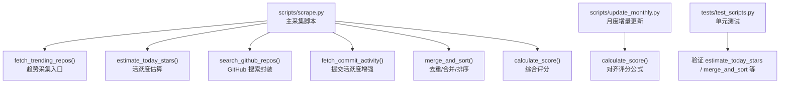
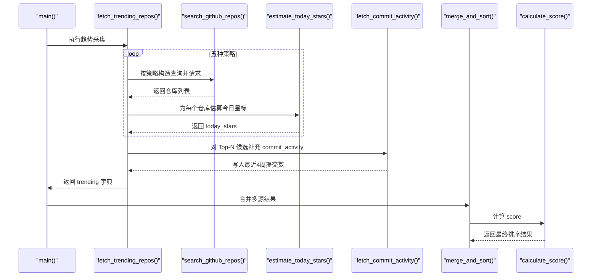
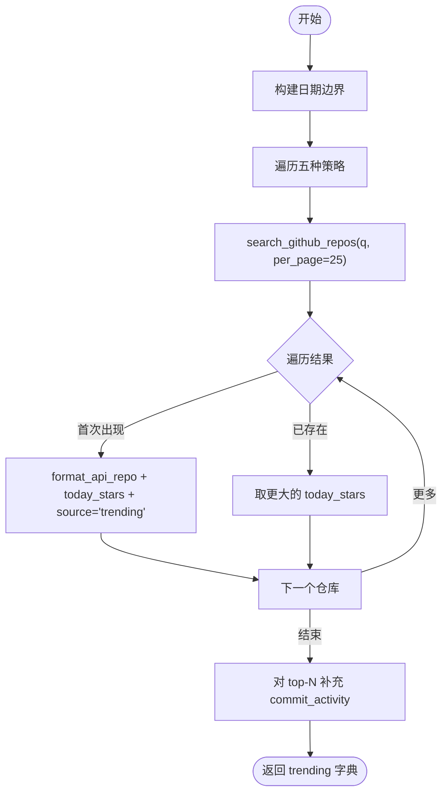
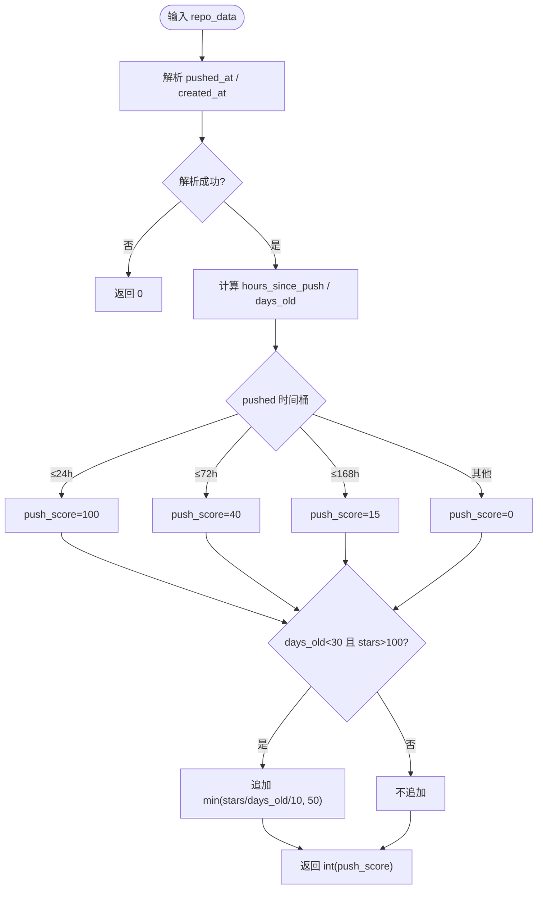
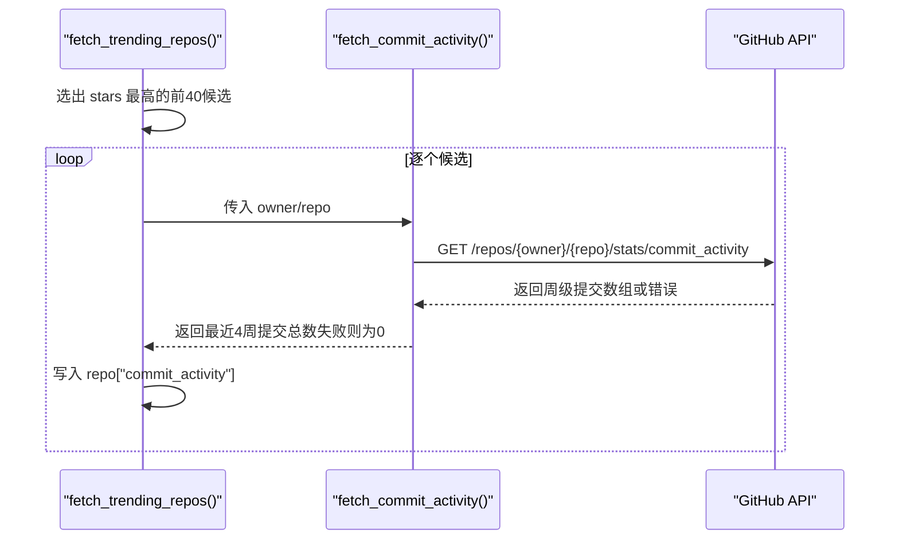
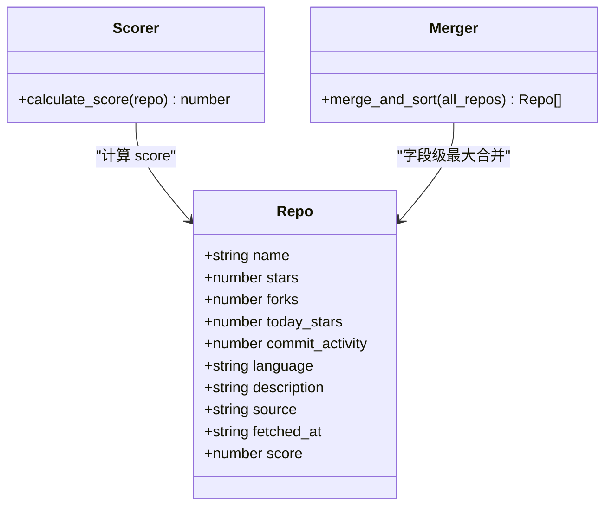
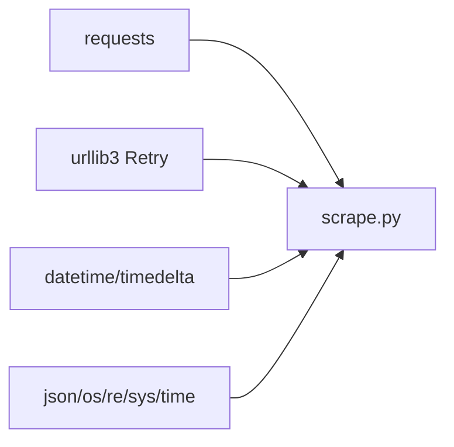

# 趋势项目采集器

<cite>
**本文引用的文件**
- [scripts/scrape.py](file://scripts/scrape.py)
- [scripts/update_monthly.py](file://scripts/update_monthly.py)
- [tests/test_scripts.py](file://tests/test_scripts.py)
- [README.md](file://README.md)
- [requirements.txt](file://requirements.txt)
</cite>

## 目录
1. [简介](#简介)
2. [项目结构](#项目结构)
3. [核心组件](#核心组件)
4. [架构总览](#架构总览)
5. [详细组件分析](#详细组件分析)
6. [依赖关系分析](#依赖关系分析)
7. [性能考量](#性能考量)
8. [故障排查指南](#故障排查指南)
9. [结论](#结论)
10. [附录：查询参数与结果处理示例](#附录查询参数与结果处理示例)

## 简介
本技术文档聚焦“趋势项目采集器”的实现，重点解析以下能力：
- fetch_trending_repos 函数的五种搜索策略：hot-today、hot-week、new-month、new-quarter、rising
- estimate_today_stars 活跃度估算算法：推送时间分析、项目年龄计算、星标增长预测
- commit_activity 数据增强机制与分数合并策略
- 查询参数配置与结果处理示例（以路径引用形式给出）

该采集器通过 GitHub Search API 与多个外部源聚合高质量仓库，并以统一的评分体系进行排序与展示。

## 项目结构
与趋势采集相关的代码主要位于 scripts 目录下，测试用例位于 tests 目录，说明文档在 README.md 中。

图表来源
- [scripts/scrape.py:336-402](file://scripts/scrape.py#L336-L402)
- [scripts/scrape.py:301-333](file://scripts/scrape.py#L301-L333)
- [scripts/scrape.py:243-266](file://scripts/scrape.py#L243-L266)
- [scripts/scrape.py:133-147](file://scripts/scrape.py#L133-L147)
- [scripts/scrape.py:575-622](file://scripts/scrape.py#L575-L622)
- [scripts/scrape.py:562-572](file://scripts/scrape.py#L562-L572)
- [scripts/update_monthly.py:154-164](file://scripts/update_monthly.py#L154-L164)
- [tests/test_scripts.py:57-108](file://tests/test_scripts.py#L57-L108)
- [tests/test_scripts.py:144-178](file://tests/test_scripts.py#L144-L178)

章节来源
- [README.md:123-148](file://README.md#L123-L148)
- [requirements.txt:1-1](file://requirements.txt#L1-L1)

## 核心组件
- 趋势采集入口：fetch_trending_repos
- 活跃度估算：estimate_today_stars
- 搜索封装：search_github_repos
- 提交活跃度增强：fetch_commit_activity
- 合并与排序：merge_and_sort
- 评分函数：calculate_score

章节来源
- [scripts/scrape.py:336-402](file://scripts/scrape.py#L336-L402)
- [scripts/scrape.py:301-333](file://scripts/scrape.py#L301-L333)
- [scripts/scrape.py:243-266](file://scripts/scrape.py#L243-L266)
- [scripts/scrape.py:133-147](file://scripts/scrape.py#L133-L147)
- [scripts/scrape.py:575-622](file://scripts/scrape.py#L575-L622)
- [scripts/scrape.py:562-572](file://scripts/scrape.py#L562-L572)

## 架构总览
下图展示了从查询构造到结果落盘的整体流程，以及关键函数之间的调用关系。

图表来源
- [scripts/scrape.py:336-402](file://scripts/scrape.py#L336-L402)
- [scripts/scrape.py:243-266](file://scripts/scrape.py#L243-L266)
- [scripts/scrape.py:301-333](file://scripts/scrape.py#L301-L333)
- [scripts/scrape.py:133-147](file://scripts/scrape.py#L133-L147)
- [scripts/scrape.py:575-622](file://scripts/scrape.py#L575-L622)
- [scripts/scrape.py:562-572](file://scripts/scrape.py#L562-L572)

## 详细组件分析

### fetch_trending_repos：五种搜索策略
该函数通过 GitHub Search API 组合五类查询，覆盖“近期活跃”、“新近创建”和“上升潜力”三个维度：
- hot-today：最近24小时推送且 stars > 500
- hot-week：最近一周推送且 stars > 2000
- new-month：本月创建且 stars > 500
- new-quarter：本季度创建且 stars > 1000
- rising：最近一周推送且 stars 在 100..2000 区间（捕捉上升中的项目）

实现要点：
- 动态计算日期边界（today、one_day_ago、one_week_ago、one_month_ago、three_months_ago）
- 依次执行查询，统一格式化为内部 schema，并标注 source="trending"
- 对重复仓库保留更高的 today_stars 估计值
- 可选增强：对 top-N（按 stars 排序前40）调用 stats/commit_activity 获取最近4周提交总数，作为新鲜度信号

图表来源
- [scripts/scrape.py:336-402](file://scripts/scrape.py#L336-L402)
- [scripts/scrape.py:243-266](file://scripts/scrape.py#L243-L266)
- [scripts/scrape.py:133-147](file://scripts/scrape.py#L133-L147)

章节来源
- [scripts/scrape.py:336-402](file://scripts/scrape.py#L336-L402)
- [scripts/scrape.py:243-266](file://scripts/scrape.py#L243-L266)
- [scripts/scrape.py:133-147](file://scripts/scrape.py#L133-L147)

### estimate_today_stars：活跃度估算算法
该函数基于推送时间与项目年龄推断“今日星标增长”，弥补 GitHub Search API 不提供逐日星标数据的限制。

算法步骤：
- 解析 pushed_at 与 created_at，计算 hours_since_push 与 days_old
- 推送时效分档：
  - ≤24h → push_score = 100
  - ≤72h → push_score = 40
  - ≤168h（一周）→ push_score = 15
  - 其他 → push_score = 0
- 新项目病毒式加分：若 days_old < 30 且 stars > 100，则追加 min(int(stars / days_old / 10), 50)
- 返回整数形式的估算值

复杂度与健壮性：
- 时间复杂度 O(1)，空间复杂度 O(1)
- 缺失或非法字段时返回 0，避免异常传播

图表来源
- [scripts/scrape.py:301-333](file://scripts/scrape.py#L301-L333)

章节来源
- [scripts/scrape.py:301-333](file://scripts/scrape.py#L301-L333)
- [tests/test_scripts.py:57-108](file://tests/test_scripts.py#L57-L108)

### commit_activity 数据增强机制
- 目标：为 top-N 候选仓库补充最近4周的提交总数，作为新鲜度信号
- 接口：stats/commit_activity（免费，无需 token），返回每周提交数组
- 取值：取最后4周的 total 之和；失败或缓存未命中（202）返回 0
- 使用：在 fetch_trending_repos 中对 stars 最高的前40个仓库逐一增强

图表来源
- [scripts/scrape.py:133-147](file://scripts/scrape.py#L133-L147)
- [scripts/scrape.py:380-402](file://scripts/scrape.py#L380-L402)

章节来源
- [scripts/scrape.py:133-147](file://scripts/scrape.py#L133-L147)
- [scripts/scrape.py:380-402](file://scripts/scrape.py#L380-L402)

### 分数合并策略与评分公式
- 合并策略（merge_and_sort）：
  - 去重键：name
  - 数值型字段（stars、forks、today_stars、commit_activity）取最大值
  - language/description 优先选择更完整信息
  - source 字段合并为有序集合并用“+”连接
  - fetched_at 取较新的时间戳
- 评分公式（calculate_score）：
  - score = stars + forks + (forks/stars)*1000 + today_stars*10 + commit_activity*2
  - 当 stars=0 时，fork_ratio 视为 0，避免除零
- 一致性：update_monthly.calculate_score 与 scrape.calculate_score 公式一致，确保跨脚本可比较

图表来源
- [scripts/scrape.py:562-572](file://scripts/scrape.py#L562-L572)
- [scripts/scrape.py:575-622](file://scripts/scrape.py#L575-L622)
- [scripts/update_monthly.py:154-164](file://scripts/update_monthly.py#L154-L164)

章节来源
- [scripts/scrape.py:562-572](file://scripts/scrape.py#L562-L572)
- [scripts/scrape.py:575-622](file://scripts/scrape.py#L575-L622)
- [scripts/update_monthly.py:154-164](file://scripts/update_monthly.py#L154-L164)
- [tests/test_scripts.py:144-178](file://tests/test_scripts.py#L144-L178)

## 依赖关系分析
- 外部依赖：requests（HTTP 客户端）
- 内置模块：json、os、re、sys、time、datetime
- 重试与退避：基于 urllib3.util.retry 的指数退避，针对 429/5xx 状态码自动重试
- 速率限制：无 token 时 60 req/h，有 token 时 5000 req/h

图表来源
- [requirements.txt:1-1](file://requirements.txt#L1-L1)
- [scripts/scrape.py:114-130](file://scripts/scrape.py#L114-L130)

章节来源
- [requirements.txt:1-1](file://requirements.txt#L1-L1)
- [scripts/scrape.py:114-130](file://scripts/scrape.py#L114-L130)

## 性能考量
- 并发与限流：当前采用串行请求 + time.sleep 控制频率，避免触发速率限制
- 分页与上限：趋势采集每策略 per_page=25，月度更新支持分页抓取
- 增强成本：仅对 top-N（默认40）调用 commit_activity，降低额外开销
- 重试策略：指数退避提升稳定性，减少瞬时失败影响

[本节为通用指导，不涉及具体文件分析]

## 故障排查指南
- 速率限制（403/429）：设置环境变量 GITHUB_TOKEN 以提升配额；脚本内包含限流提示与等待逻辑
- 网络异常与超时：get_session 提供超时与重试；建议检查网络连通性与代理设置
- 数据缺失：estimate_today_stars 对缺失字段容错返回 0；merge_and_sort 会尽量补齐语言与描述
- 本地运行问题：浏览器直接打开 data/repos.json 可能受限，需通过 HTTP 服务访问前端页面

章节来源
- [README.md:166-176](file://README.md#L166-L176)
- [scripts/scrape.py:114-130](file://scripts/scrape.py#L114-L130)
- [scripts/scrape.py:301-333](file://scripts/scrape.py#L301-L333)
- [scripts/scrape.py:575-622](file://scripts/scrape.py#L575-L622)

## 结论
本采集器通过多维度搜索策略与活跃度估算，有效模拟了“趋势”效果；结合 commit_activity 增强与稳健的合并评分策略，输出具备较高可解释性与可比性的结果。建议在大规模采集场景下引入异步与缓存优化，进一步提升吞吐与稳定性。

[本节为总结性内容，不涉及具体文件分析]

## 附录：查询参数与结果处理示例
以下为常用查询参数与结果处理的参考路径，便于快速定位实现细节：

- 趋势采集入口与策略定义
  - [fetch_trending_repos 函数:336-402](file://scripts/scrape.py#L336-L402)
  - [五种策略查询字符串:354-360](file://scripts/scrape.py#L354-L360)
- 搜索封装与分页
  - [search_github_repos 函数:243-266](file://scripts/scrape.py#L243-266)
- 活跃度估算
  - [estimate_today_stars 函数:301-333](file://scripts/scrape.py#L301-333)
  - [单元测试：recent push / week old / stale / viral:63-108](file://tests/test_scripts.py#L63-L108)
- 提交活跃度增强
  - [fetch_commit_activity 函数:133-147](file://scripts/scrape.py#L133-147)
  - [增强调用位置（top-N）:380-402](file://scripts/scrape.py#L380-402)
- 合并与评分
  - [merge_and_sort 函数:575-622](file://scripts/scrape.py#L575-622)
  - [calculate_score 函数:562-572](file://scripts/scrape.py#L562-572)
  - [月度脚本评分一致性:154-164](file://scripts/update_monthly.py#L154-164)
- 结果保存与元数据
  - [save_results 函数:625-649](file://scripts/scrape.py#L625-649)
  - [数据源与筛选条件记录:629-640](file://scripts/scrape.py#L629-640)

章节来源
- [scripts/scrape.py:336-402](file://scripts/scrape.py#L336-L402)
- [scripts/scrape.py:243-266](file://scripts/scrape.py#L243-266)
- [scripts/scrape.py:301-333](file://scripts/scrape.py#L301-333)
- [scripts/scrape.py:133-147](file://scripts/scrape.py#L133-147)
- [scripts/scrape.py:575-622](file://scripts/scrape.py#L575-L622)
- [scripts/scrape.py:562-572](file://scripts/scrape.py#L562-L572)
- [scripts/scrape.py:625-649](file://scripts/scrape.py#L625-L649)
- [scripts/update_monthly.py:154-164](file://scripts/update_monthly.py#L154-L164)
- [tests/test_scripts.py:63-108](file://tests/test_scripts.py#L63-L108)