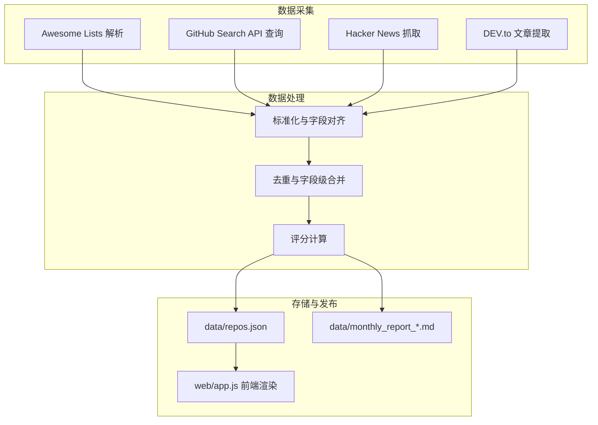
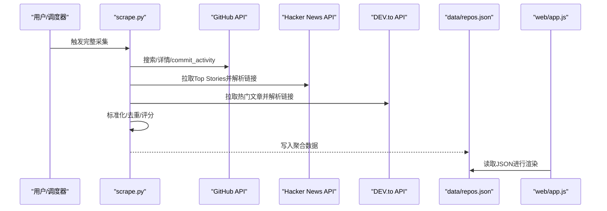
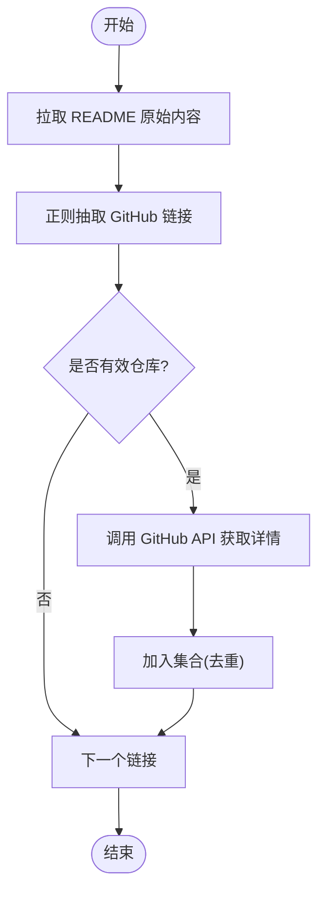
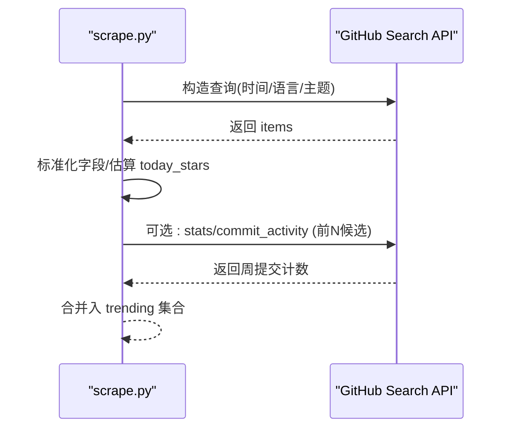
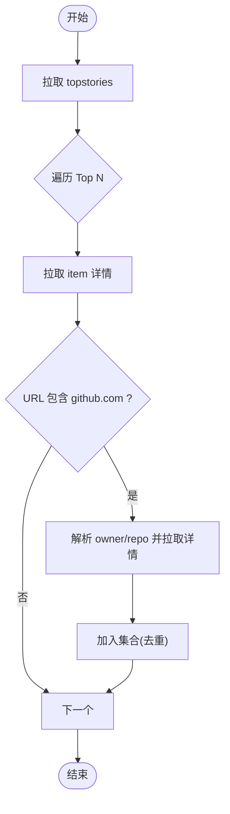
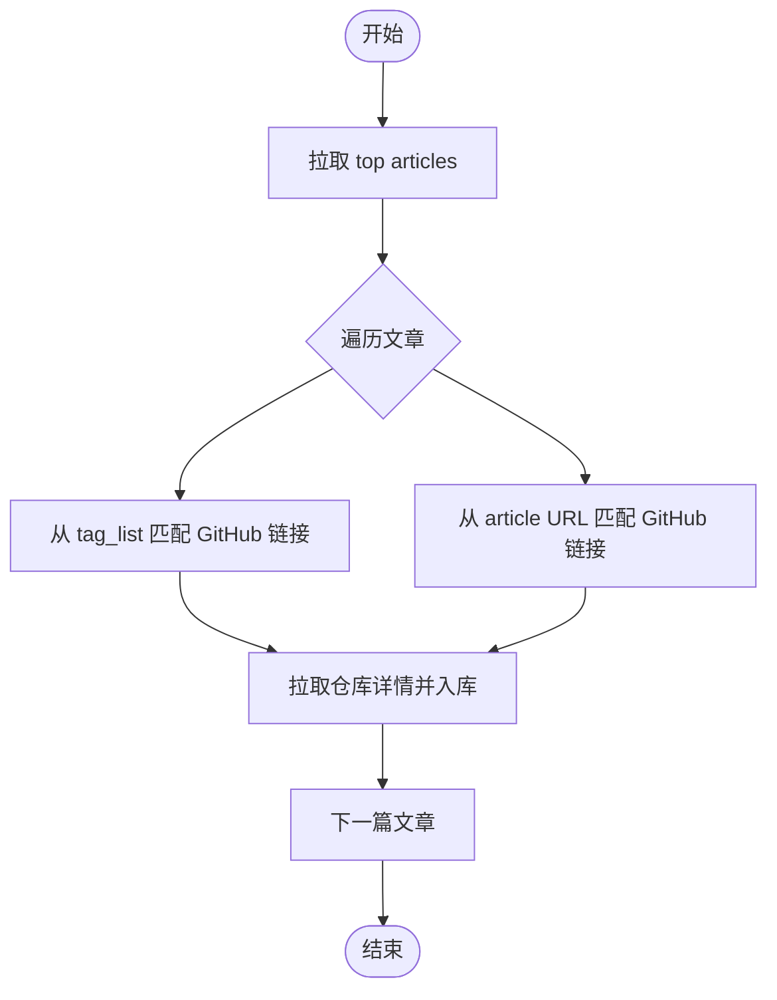
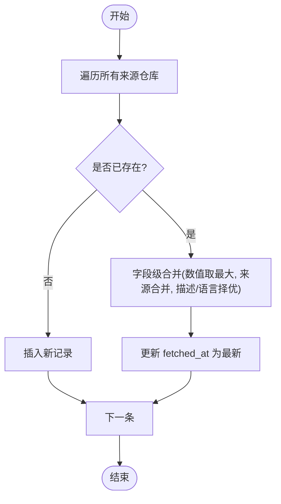
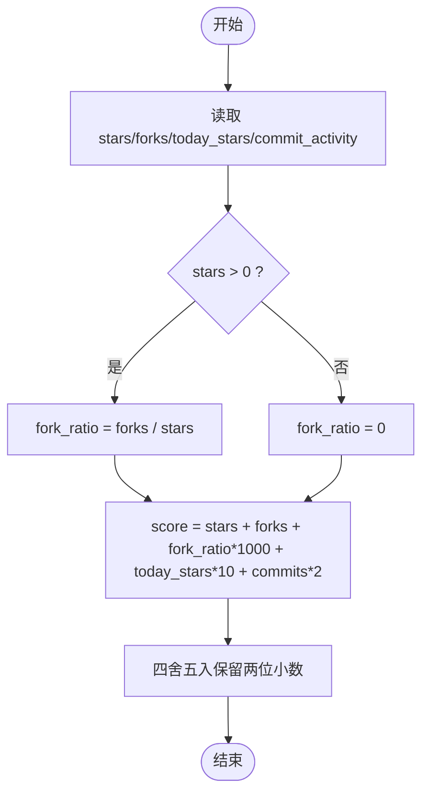
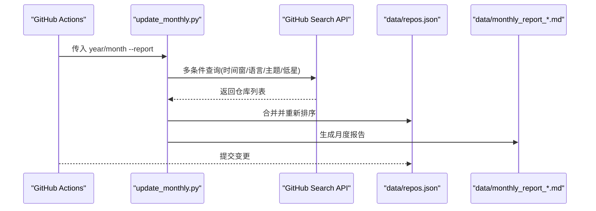
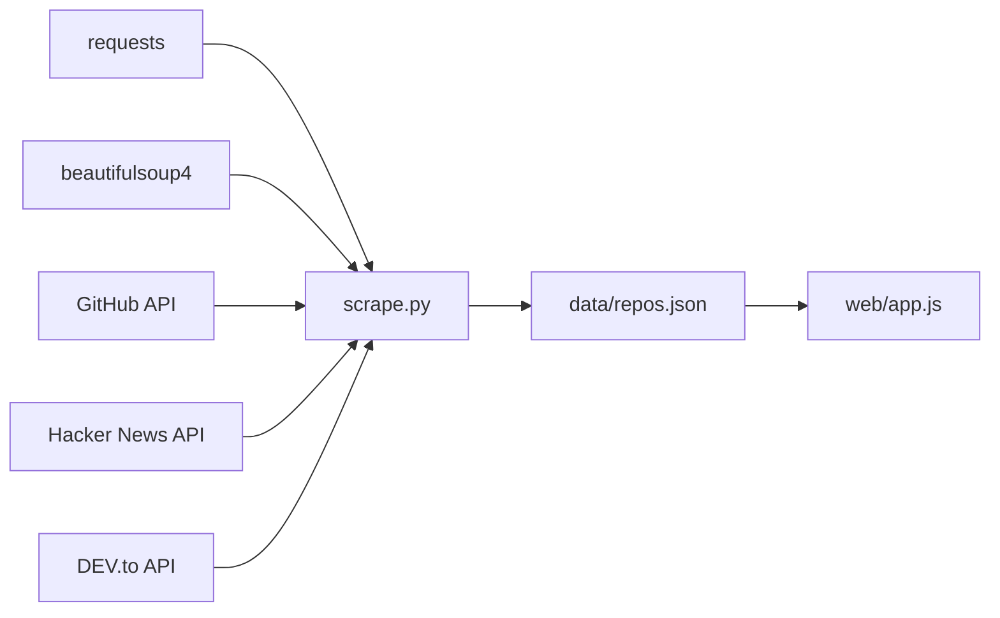

# 数据聚合系统

<cite>
**本文引用的文件**
- [README.md](file://README.md)
- [scrape.py](file://scripts/scrape.py)
- [update_monthly.py](file://scripts/update_monthly.py)
- [requirements.txt](file://requirements.txt)
- [test_scripts.py](file://tests/test_scripts.py)
- [monthly-scrape.yml](file://.github/workflows/monthly-scrape.yml)
- [monthly-update.yml](file://.github/workflows/monthly-update.yml)
- [app.js](file://web/app.js)
- [monthly_report_2026_06.md](file://data/monthly_report_2026_06.md)
</cite>

## 目录
1. [简介](#简介)
2. [项目结构](#项目结构)
3. [核心组件](#核心组件)
4. [架构总览](#架构总览)
5. [详细组件分析](#详细组件分析)
6. [依赖关系分析](#依赖关系分析)
7. [性能与可扩展性](#性能与可扩展性)
8. [故障排查指南](#故障排查指南)
9. [结论](#结论)
10. [附录：配置与使用](#附录配置与使用)

## 简介
本系统是一个开源、全自动的高质量 GitHub 项目聚合器。它整合多源数据（Awesome Lists、GitHub Search API、Hacker News、DEV.to），通过标准化、去重与多维度评分，输出统一的仓库数据集，并支持增量更新与月度报告生成。前端提供筛选、收藏、灵感模式等交互能力，并通过 GitHub Actions 自动化调度执行。

## 项目结构
- 脚本层
  - scripts/scrape.py：多源采集、标准化、去重、评分、落盘
  - scripts/update_monthly.py：按月份增量抓取、合并、生成报告
- 数据层
  - data/repos.json：聚合后的仓库清单
  - data/monthly_report_*.md：月度报告
- 前端层
  - web/app.js：纯前端展示与交互（读取 data/repos.json）
- 测试与流水线
  - tests/test_scripts.py：单元测试
  - .github/workflows/*.yml：CI/CD 与定时任务

图表来源
- [scrape.py:174-221](file://scripts/scrape.py#L174-L221)
- [scrape.py:248-278](file://scripts/scrape.py#L248-L278)
- [scrape.py:385-441](file://scripts/scrape.py#L385-L441)
- [scrape.py:444-508](file://scripts/scrape.py#L444-L508)
- [scrape.py:555-602](file://scripts/scrape.py#L555-L602)
- [scrape.py:542-552](file://scripts/scrape.py#L542-L552)
- [scrape.py:605-628](file://scripts/scrape.py#L605-L628)
- [update_monthly.py:226-297](file://scripts/update_monthly.py#L226-L297)
- [app.js:1-200](file://web/app.js#L1-L200)

章节来源
- [README.md:123-148](file://README.md#L123-L148)

## 核心组件
- Awesome Lists 解析器：从多个 curated 列表的 README 中抽取 GitHub 仓库链接，过滤非仓库路径与自引用，限制单次处理数量以避免过载。
- GitHub Search API 集成：基于时间窗口、语言、主题等多维度查询，获取高星或近期活跃仓库；对热门候选补充 commit_activity 以增强活跃度信号。
- Hacker News 抓取：拉取 Top Stories，匹配其中指向 GitHub 的链接，补全仓库详情。
- DEV.to 文章提取：拉取热门文章，从标签与正文中提取 GitHub 链接，补全仓库详情。
- 标准化与去重：统一字段命名与默认值，按仓库名去重，数值型字段取最大值，来源标签合并，描述与语言择优填充。
- 评分算法：综合 stars、forks、fork 率、今日增长估计、近四周提交量等维度加权计算。
- 增量更新与月度报告：按月范围抓取新仓库，合并到主库，统计并生成 Markdown 报告。

章节来源
- [scrape.py:130-150](file://scripts/scrape.py#L130-L150)
- [scrape.py:248-278](file://scripts/scrape.py#L248-L278)
- [scrape.py:385-441](file://scripts/scrape.py#L385-L441)
- [scrape.py:444-508](file://scripts/scrape.py#L444-L508)
- [scrape.py:555-602](file://scripts/scrape.py#L555-L602)
- [scrape.py:542-552](file://scripts/scrape.py#L542-L552)
- [update_monthly.py:79-135](file://scripts/update_monthly.py#L79-L135)
- [update_monthly.py:226-297](file://scripts/update_monthly.py#L226-L297)

## 架构总览
系统采用“采集—清洗—评分—存储—展示”的分层架构，各采集模块独立运行，结果经统一格式后进入合并与评分阶段，最终写入 JSON 供前端消费，同时按需生成月度报告。

图表来源
- [scrape.py:650-695](file://scripts/scrape.py#L650-L695)
- [scrape.py:114-127](file://scripts/scrape.py#L114-L127)
- [scrape.py:224-245](file://scripts/scrape.py#L224-L245)
- [scrape.py:385-441](file://scripts/scrape.py#L385-L441)
- [scrape.py:444-508](file://scripts/scrape.py#L444-L508)
- [scrape.py:555-602](file://scripts/scrape.py#L555-L602)
- [scrape.py:605-628](file://scripts/scrape.py#L605-L628)
- [app.js:1-200](file://web/app.js#L1-L200)

## 详细组件分析

### Awesome Lists 解析
- 实现要点
  - 正则匹配 markdown 中的 GitHub 链接，过滤非仓库 owner 与 awesome 自身仓库，截断片段与参数，限制返回数量上限。
  - 对每个候选仓库调用 GitHub API 获取详情，标记来源为 awesome_list。
- 复杂度与优化
  - 解析为 O(N) 文本扫描；API 请求受速率限制，已做 sleep 控制与异常捕获。
- 错误处理
  - 网络异常、状态码非 200、403 限流均被捕获并跳过。

图表来源
- [scrape.py:130-150](file://scripts/scrape.py#L130-L150)
- [scrape.py:174-221](file://scripts/scrape.py#L174-L221)

章节来源
- [scrape.py:130-150](file://scripts/scrape.py#L130-L150)
- [scrape.py:174-221](file://scripts/scrape.py#L174-L221)

### GitHub Search API 集成
- 实现要点
  - 多组查询：Agent/AI 相关关键词、主流语言 top 仓库、近期推送/创建、低星但近期活跃的上升候选。
  - 对热门候选补充 commit_activity（最近四周提交数），用于活跃度与评分。
- 复杂度与优化
  - 多次分页与排序，sleep 控制避免限流；对 403 限流进行休眠重试。
- 错误处理
  - 超时、非 2xx、403 限流均有分支处理。

图表来源
- [scrape.py:224-245](file://scripts/scrape.py#L224-L245)
- [scrape.py:248-278](file://scripts/scrape.py#L248-L278)
- [scrape.py:316-382](file://scripts/scrape.py#L316-L382)
- [scrape.py:114-127](file://scripts/scrape.py#L114-L127)

章节来源
- [scrape.py:224-245](file://scripts/scrape.py#L224-L245)
- [scrape.py:248-278](file://scripts/scrape.py#L248-L278)
- [scrape.py:316-382](file://scripts/scrape.py#L316-L382)

### Hacker News 数据抓取
- 实现要点
  - 拉取 topstories，遍历 item 详情，匹配 github.com 链接，补全仓库详情并记录标题作为描述。
- 复杂度与优化
  - 固定 Top N 条目，逐条请求，sleep 控制频率。
- 错误处理
  - 网络异常、非 200 直接跳过。

图表来源
- [scrape.py:385-441](file://scripts/scrape.py#L385-L441)

章节来源
- [scrape.py:385-441](file://scripts/scrape.py#L385-L441)

### DEV.to 文章提取
- 实现要点
  - 拉取 top articles，从 tag_list 与 article URL 中匹配 GitHub 链接，补全仓库详情并记录文章标题作为描述。
- 复杂度与优化
  - 固定 per_page 与 top 周期，sleep 控制频率。
- 错误处理
  - 网络异常、非 200 直接跳过。

图表来源
- [scrape.py:444-508](file://scripts/scrape.py#L444-L508)

章节来源
- [scrape.py:444-508](file://scripts/scrape.py#L444-L508)

### 数据标准化与去重算法
- 标准化
  - 统一字段：name、url、description、stars、forks、language、today_stars、score、fetched_at、source。
  - 缺失字段设置默认值（如 description 默认中文提示）。
- 去重与合并
  - 以 name 为键，数值型字段（stars、forks、today_stars、commit_activity）取最大值；语言与描述择优填充；source 合并为有序集合拼接；fetched_at 取最新。
- 复杂度
  - 线性扫描合并，O(N)。

图表来源
- [scrape.py:555-602](file://scripts/scrape.py#L555-L602)

章节来源
- [scrape.py:526-539](file://scripts/scrape.py#L526-L539)
- [scrape.py:555-602](file://scripts/scrape.py#L555-L602)

### 评分算法实现细节
- 公式
  - score = stars + forks + (forks / stars) × 1000 + today_stars × 10 + commit_activity × 2
  - 当 stars=0 时，fork_ratio 按 0 处理，避免除零。
- 指标说明
  - stars/forks：基础影响力
  - fork/stars：社区参与度
  - today_stars：近日内增长估计（由 pushed_at/created_at 推导）
  - commit_activity：近四周提交总数（真实数据）
- 估算策略
  - estimate_today_stars 根据推送时间与仓库年龄打分，近期推送与新爆红仓库给予更高权重。

图表来源
- [scrape.py:542-552](file://scripts/scrape.py#L542-L552)
- [scrape.py:281-313](file://scripts/scrape.py#L281-L313)

章节来源
- [scrape.py:542-552](file://scripts/scrape.py#L542-L552)
- [scrape.py:281-313](file://scripts/scrape.py#L281-L313)

### 增量更新机制与月度报告生成
- 增量更新
  - 按指定年月的 created 时间窗，分维度（全部语言、各语言、热点主题、低星但近期推送）抓取，合并到 data/repos.json，保持全局排序。
- 月度报告
  - 统计当月仓库语言分布、Top 榜单、高参与度的 Rising Stars（fork 比率），输出 Markdown 报告。
- 工作流
  - monthly-update.yml 每月自动执行，支持手动输入年月，自动生成报告并推送到仓库。

图表来源
- [update_monthly.py:79-135](file://scripts/update_monthly.py#L79-L135)
- [update_monthly.py:162-203](file://scripts/update_monthly.py#L162-L203)
- [update_monthly.py:226-297](file://scripts/update_monthly.py#L226-L297)
- [monthly-update.yml:51-79](file://.github/workflows/monthly-update.yml#L51-L79)

章节来源
- [update_monthly.py:79-135](file://scripts/update_monthly.py#L79-L135)
- [update_monthly.py:162-203](file://scripts/update_monthly.py#L162-L203)
- [update_monthly.py:226-297](file://scripts/update_monthly.py#L226-L297)
- [monthly-update.yml:51-79](file://.github/workflows/monthly-update.yml#L51-L79)

### 前端展示与交互
- 数据来源
  - 前端通过相对路径加载 data/repos.json，进行筛选、排序、收藏、对比、灵感模式等功能。
- 国际化与主题
  - 内置中英文切换与深色/浅色主题持久化。
- 离线支持
  - Service Worker 与 PWA 配置，提升离线体验。

章节来源
- [app.js:1-200](file://web/app.js#L1-L200)

## 依赖关系分析
- Python 依赖
  - requests：HTTP 客户端
  - beautifulsoup4：HTML 解析（当前主要使用正则与 API，备用）
- 外部服务
  - GitHub API（Search、Repo Details、Commit Activity）
  - Hacker News API
  - DEV.to API
- 前端依赖
  - 原生 HTML/CSS/JS，无构建步骤

图表来源
- [requirements.txt:1-2](file://requirements.txt#L1-L2)
- [scrape.py:1-20](file://scripts/scrape.py#L1-L20)
- [scrape.py:605-628](file://scripts/scrape.py#L605-L628)
- [app.js:1-200](file://web/app.js#L1-L200)

章节来源
- [requirements.txt:1-2](file://requirements.txt#L1-L2)
- [scrape.py:1-20](file://scripts/scrape.py#L1-L20)

## 性能与可扩展性
- 速率限制与节流
  - 多处 time.sleep 控制请求频率；对 403 限流进行休眠重试。
- 并发与并行
  - 当前为串行请求，可通过异步 IO（如 aiohttp/asyncio）提升吞吐。
- 缓存与增量
  - 已有按仓库名的去重与字段级合并；可引入本地缓存（如 SQLite）减少重复请求。
- 分页与批量
  - 月度更新支持分页抓取；可按需扩展每页大小与页数上限。
- 资源裁剪
  - Awesome Lists 仅取前若干候选；Trending 仅对 Top-N 补充 commit_activity，降低开销。

[本节为通用建议，不直接分析具体文件]

## 故障排查指南
- 无法加载数据
  - 浏览器通过 file:// 协议打开会阻止 fetch，请使用本地 HTTP 服务器启动。
- 触发 GitHub API 限流
  - 设置环境变量 GITHUB_TOKEN 以提升配额；检查日志中的 Rate limited 提示。
- 网络异常
  - 检查超时与状态码分支；确认目标站点可达。
- 数据不一致
  - 核对 merge_and_sort 的去重逻辑与字段取值规则；确认 fetched_at 是否为最新。

章节来源
- [README.md:166-175](file://README.md#L166-L175)
- [scrape.py:224-245](file://scripts/scrape.py#L224-L245)
- [scrape.py:555-602](file://scripts/scrape.py#L555-L602)

## 结论
该系统通过多源采集、严格标准化与去重、多维评分与增量更新，构建了高质量、可维护的仓库发现平台。配合前端交互与自动化流水线，实现了从数据到展示的闭环。未来可在并发、缓存、更细粒度的评分权重调优等方面持续演进。

[本节为总结性内容，不直接分析具体文件]

## 附录：配置与使用
- 环境准备
  - 安装依赖：pip install -r requirements.txt
  - 可选：设置 GITHUB_TOKEN 环境变量以提高 GitHub API 配额
- 运行方式
  - 完整采集：python scripts/scrape.py
  - 增量更新（指定年月并生成报告）：python scripts/update_monthly.py --year 2026 --month 6 --report
  - 本地预览：cd web && python3 -m http.server 8000
- 关键配置项
  - MIN_STARS、MIN_FORKS：最低门槛
  - AWESOME_LISTS：Awesome 列表源
  - LANGUAGES/TOPICS：搜索维度
  - GITHUB_TOKEN：认证令牌
- 示例参考
  - 月度报告样例：data/monthly_report_2026_06.md

章节来源
- [README.md:43-75](file://README.md#L43-L75)
- [scrape.py:22-76](file://scripts/scrape.py#L22-L76)
- [update_monthly.py:300-343](file://scripts/update_monthly.py#L300-L343)
- [monthly_report_2026_06.md:1-141](file://data/monthly_report_2026_06.md#L1-L141)