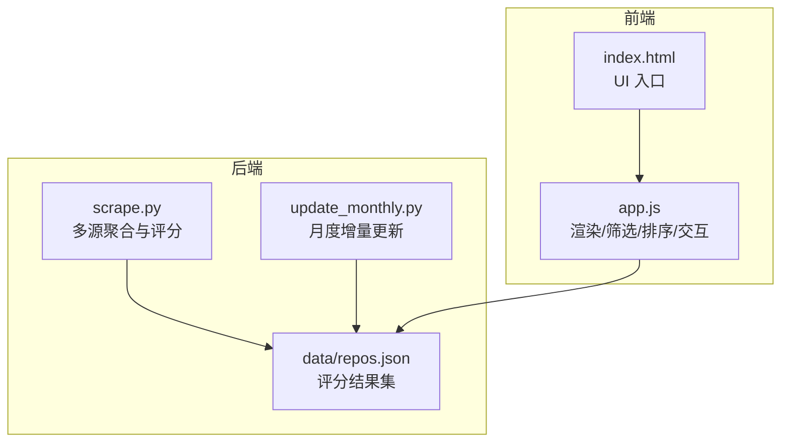
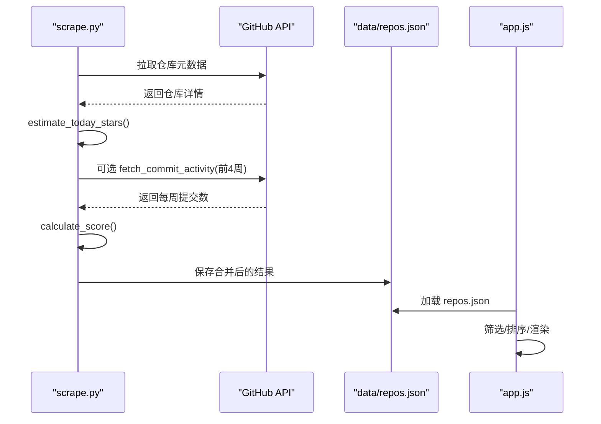
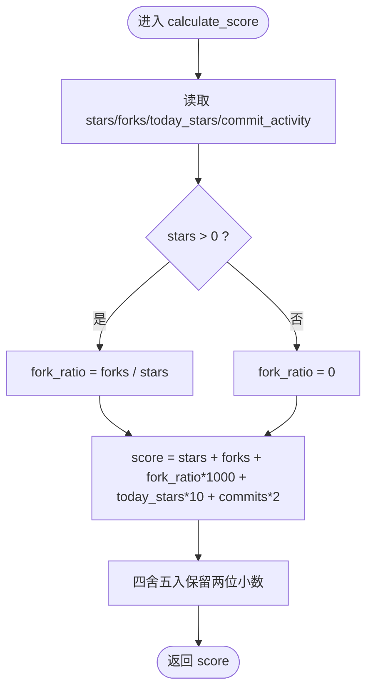
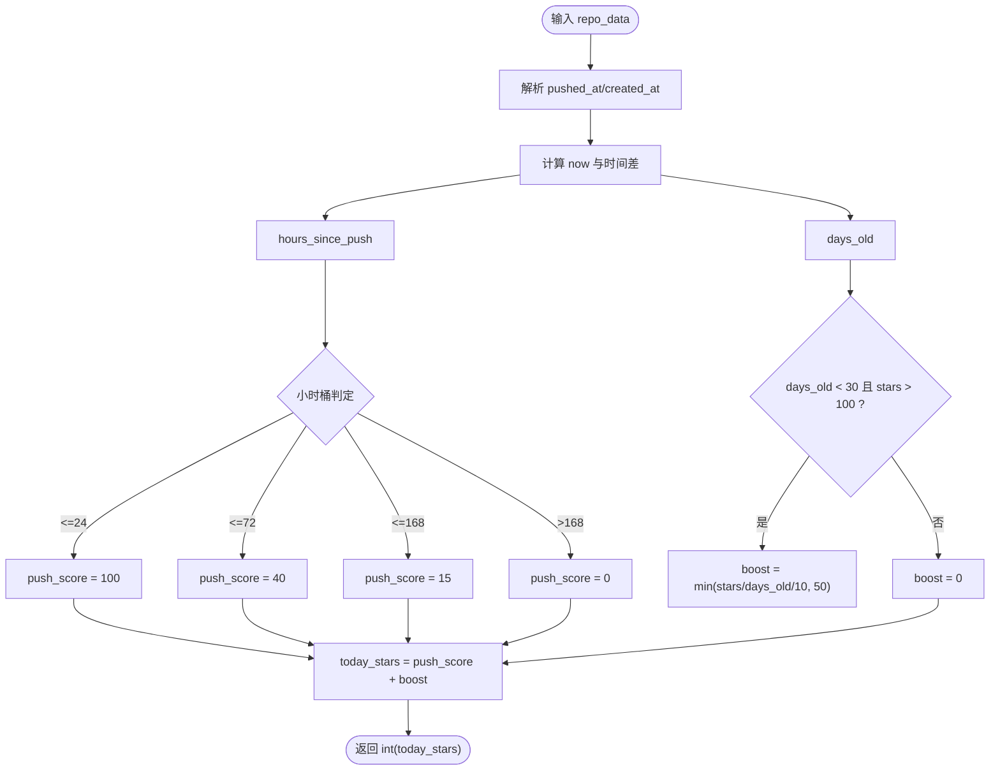
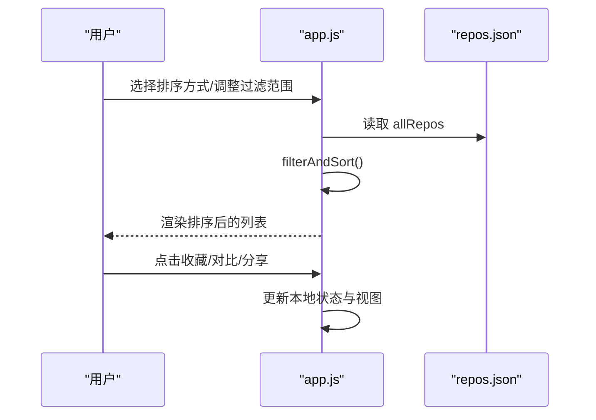
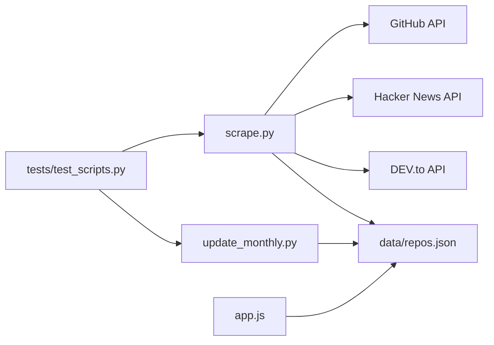

# 智能评分算法

<cite>
**本文引用的文件**   
- [README.md](file://README.md)
- [scrape.py](file://scripts/scrape.py)
- [update_monthly.py](file://scripts/update_monthly.py)
- [test_scripts.py](file://tests/test_scripts.py)
- [app.js](file://web/app.js)
- [index.html](file://web/index.html)
</cite>

## 目录
1. [引言](#引言)
2. [项目结构](#项目结构)
3. [核心组件](#核心组件)
4. [架构总览](#架构总览)
5. [详细组件分析](#详细组件分析)
6. [依赖关系分析](#依赖关系分析)
7. [性能考量](#性能考量)
8. [故障排查指南](#故障排查指南)
9. [结论](#结论)
10. [附录](#附录)

## 引言
本技术文档围绕仓库中的“智能评分算法”展开，系统性解释多维度加权评分公式的实现原理与调优策略。重点覆盖以下维度：
- stars 权重计算
- forks 贡献度分析与 fork_ratio 比率评估
- today_stars 活跃度信号估算
- commit_activity 开发活跃度（近四周提交量）
- 活跃度估算方法：push 时间分析、项目生命周期评估、viral 项目识别
- 评分结果的前端展示与用户交互影响
- 具体评分计算示例与调优建议

该算法由后端爬虫脚本生成数据并持久化，前端基于 JSON 数据进行筛选、排序与可视化呈现。

## 项目结构
本项目采用“后端聚合 + 前端展示”的轻量架构：
- 后端：Python 脚本从多源采集 GitHub 仓库信息，计算分数并输出 JSON 数据集
- 前端：纯 HTML/CSS/JS 页面加载 JSON 数据，提供筛选、排序、收藏、对比等交互

图表来源
- [scrape.py:542-602](file://scripts/scrape.py#L542-L602)
- [update_monthly.py:155-209](file://scripts/update_monthly.py#L155-L209)
- [index.html:111-131](file://web/index.html#L111-L131)
- [app.js:404-443](file://web/app.js#L404-L443)

章节来源
- [README.md:109-148](file://README.md#L109-L148)

## 核心组件
- 评分函数 calculate_score：实现多维加权评分公式
- 活跃度估算 estimate_today_stars：基于 push/recency 估计今日新增 stars
- 提交活跃度 fetch_commit_activity：获取近四周提交总数作为新鲜度信号
- 合并与排序 merge_and_sort：去重、字段级取最大值、按 score 降序排列
- 前端展示 app.js：加载 repos.json，支持按 score/stars/forks/today/rising 排序，以及星级/Fork率/评分区间过滤

章节来源
- [scrape.py:542-602](file://scripts/scrape.py#L542-L602)
- [scrape.py:281-313](file://scripts/scrape.py#L281-L313)
- [scrape.py:114-127](file://scripts/scrape.py#L114-L127)
- [app.js:404-443](file://web/app.js#L404-L443)

## 架构总览
评分算法的数据流如下：
- 多源抓取 Awesome Lists、GitHub Search API、Hacker News、DEV.to
- 对 trending 候选进行 commit_activity 增强
- 统一格式化为标准 schema，计算 score
- 合并去重并按 score 排序，写入 data/repos.json
- 前端读取 JSON，提供筛选、排序、收藏、对比等交互

图表来源
- [scrape.py:248-382](file://scripts/scrape.py#L248-L382)
- [scrape.py:542-602](file://scripts/scrape.py#L542-L602)
- [app.js:404-443](file://web/app.js#L404-L443)

## 详细组件分析

### 评分公式与数学模型
- 基础公式
  - score = stars + forks + (forks / stars) × 1000 + today_stars × 10 + commit_activity × 2
- 设计意图
  - stars：影响力基线
  - forks：协作与复用价值
  - fork_ratio：社区参与度比率，放大高 Fork 率项目的可见性
  - today_stars：短期增长动量，捕捉热点趋势
  - commit_activity：近四周提交总量，反映维护活跃度和新鲜度
- 动态平衡策略
  - 通过线性加权和，各维度以固定系数参与；若需调整相对重要性，可修改对应系数
  - 对于 stars=0 的情况，fork_ratio 被安全处理为 0，避免除零异常

章节来源
- [scrape.py:542-552](file://scripts/scrape.py#L542-L552)
- [update_monthly.py:155-165](file://scripts/update_monthly.py#L155-L165)
- [README.md:109-119](file://README.md#L109-L119)

#### 评分计算流程图

图表来源
- [scrape.py:542-552](file://scripts/scrape.py#L542-L552)

### 今日星标增长估算（today_stars）
- 估算依据
  - 最近一次 push 时间与创建时间的相对差值
  - 近期推送越频繁，today_stars 越高
  - 新项目且高 stars 会获得额外 boost，用于识别 viral 项目
- 关键阈值
  - 推送在 24h 内：基础分 100
  - 推送在 72h 内：基础分 40
  - 推送在 168h（一周）内：基础分 15
  - 超过一周：基础分 0
  - 新项目（<30天）且 stars>100：额外加分 min(stars/days_old/10, 50)
- 复杂度
  - O(1)，仅涉及时间差与常数阈值判断

章节来源
- [scrape.py:281-313](file://scripts/scrape.py#L281-L313)
- [test_scripts.py:62-106](file://tests/test_scripts.py#L62-L106)

#### 活跃度估算流程

图表来源
- [scrape.py:281-313](file://scripts/scrape.py#L281-L313)

### 提交活跃度（commit_activity）
- 数据来源：GitHub 免费接口 stats/commit_activity（无需 token）
- 指标含义：最近 4 周的提交总数，作为新鲜度信号
- 使用场景：trending 候选中选取 Top-N 进行增强，提升评分准确性
- 容错处理：任何异常或缓存未命中（202）均返回 0

章节来源
- [scrape.py:114-127](file://scripts/scrape.py#L114-L127)
- [scrape.py:360-382](file://scripts/scrape.py#L360-L382)

### 合并与排序（merge_and_sort）
- 去重策略：同名仓库按字段级取最大值（stars/forks/today_stars/commit_activity），语言与描述优先非空/更完整
- 来源标签合并：多个来源以 “+” 连接
- 排序规则：按 score 降序
- 目的：确保跨源重复项的数值信号更强，综合表现优于单一视角

章节来源
- [scrape.py:555-602](file://scripts/scrape.py#L555-L602)

### 前端展示与用户交互
- 数据加载：app.js 从 data/repos.json 加载所有仓库数据
- 筛选与排序：
  - 支持按综合评分、Stars、Forks、今日增长、飙升指数排序
  - 支持 Stars ≥、Forks ≥、评分 ≥ 区间过滤
- 展示内容：
  - 卡片显示 stars、forks、fork_ratio%、score
  - 详情页弹窗展示更多统计信息与来源
- 交互功能：
  - 收藏（localStorage）、批量操作、分享链接、对比模式
  - 灵感模式与键盘快捷键

章节来源
- [app.js:404-443](file://web/app.js#L404-L443)
- [app.js:352-396](file://web/app.js#L352-L396)
- [index.html:111-131](file://web/index.html#L111-L131)

#### 前端排序与筛选序列图

图表来源
- [app.js:404-443](file://web/app.js#L404-L443)
- [index.html:111-131](file://web/index.html#L111-L131)

## 依赖关系分析
- scrape.py 依赖 requests 与 datetime 等标准库，调用 GitHub API 与外部站点（HN、DEV.to）
- update_monthly.py 复用相同评分公式，保证前后端一致性
- tests/test_scripts.py 覆盖 parse_num、calculate_score、estimate_today_stars、merge_and_sort 等关键路径
- 前端 app.js 依赖浏览器环境与 data/repos.json

图表来源
- [scrape.py:248-382](file://scripts/scrape.py#L248-L382)
- [update_monthly.py:155-209](file://scripts/update_monthly.py#L155-L209)
- [test_scripts.py:36-106](file://tests/test_scripts.py#L36-L106)
- [app.js:404-443](file://web/app.js#L404-L443)

章节来源
- [test_scripts.py:36-106](file://tests/test_scripts.py#L36-L106)

## 性能考量
- 网络请求限频与超时控制：API 调用设置 timeout，遇到 403 限流时休眠重试
- 并发与串行：为避免触发速率限制，多数请求串行执行并加入 sleep
- 数据规模：前端分页与虚拟滚动未在代码中显式实现，但通过 visibleStart/visibleCount 控制初始渲染数量，减少 DOM 压力
- 评分计算：O(n) 遍历，n 为仓库数量，整体开销较低

[本节为通用指导，不直接分析具体文件]

## 故障排查指南
- 无法加载数据
  - 现象：页面提示“无法加载数据”，建议使用本地 HTTP 服务器访问
  - 原因：浏览器 file:// 协议阻止 fetch 请求
  - 解决：cd web && python3 -m http.server 8000
- 触发 GitHub API 限流
  - 现象：Rate limited 提示
  - 解决：设置 GITHUB_TOKEN 环境变量，提高每小时请求上限
- 评分结果为 0 或异常
  - 检查 fields：stars/forks/today_stars/commit_activity 是否存在
  - 确认 calculate_score 分支逻辑：stars=0 时 fork_ratio 应为 0

章节来源
- [README.md:166-171](file://README.md#L166-L171)
- [scrape.py:234-245](file://scripts/scrape.py#L234-L245)
- [scrape.py:542-552](file://scripts/scrape.py#L542-L552)

## 结论
该智能评分算法通过线性加权融合影响力（stars）、协作度（forks）、社区参与度（fork_ratio）、短期增长（today_stars）与维护活跃度（commit_activity），形成一套简洁而有效的排名机制。前端提供了丰富的筛选与排序能力，便于用户快速定位高质量项目。后续可通过调整权重系数或引入非线性变换进一步优化对不同类别项目的敏感度。

[本节为总结，不直接分析具体文件]

## 附录

### 评分计算示例
- 示例一
  - 输入：stars=1000, forks=100, today_stars=0, commit_activity=0
  - 计算：1000 + 100 + (100/1000)*1000 = 1200
  - 参考测试用例路径：[test_scripts.py:38-41](file://tests/test_scripts.py#L38-L41)
- 示例二
  - 输入：stars=1000, forks=100, today_stars=50, commit_activity=30
  - 计算：1000 + 100 + 100 + 500 + 60 = 1760
  - 参考测试用例路径：[test_scripts.py:44-47](file://tests/test_scripts.py#L44-L47)
- 示例三（zero stars 保护）
  - 输入：stars=0, forks=0, today_stars=10, commit_activity=0
  - 计算：0 + 0 + 0 + 100 + 0 = 100
  - 参考测试用例路径：[test_scripts.py:50-53](file://tests/test_scripts.py#L50-L53)

章节来源
- [test_scripts.py:38-53](file://tests/test_scripts.py#L38-L53)

### 调优建议
- 权重调整
  - 若希望更强调社区参与度，可提高 fork_ratio 系数（当前为 1000）
  - 若关注长期维护质量，可提高 commit_activity 系数（当前为 2）
  - 若追求热点发现，可提高 today_stars 系数（当前为 10）
- 非线性变换
  - 对 stars/forks 使用对数缩放，缓解头部效应
  - 对 today_stars 使用饱和函数，避免极端波动
- 活跃度估算优化
  - 引入更细粒度的时间衰减曲线（如指数衰减）
  - 结合 issue/PR 活跃度作为补充信号
- 前端交互增强
  - 增加“飙升指数”（today_stars / stars）排序选项，已在 UI 中预留
  - 提供自定义权重滑块，允许用户实时调整评分偏好

[本节为通用指导，不直接分析具体文件]