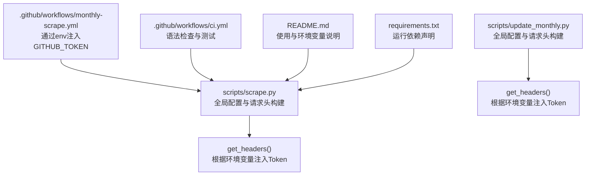
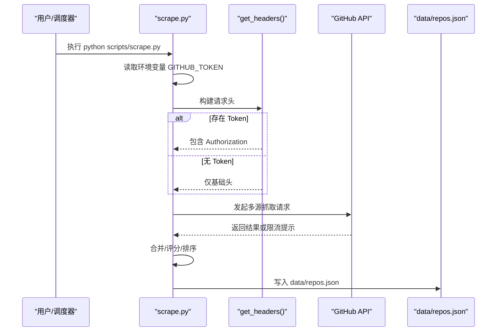
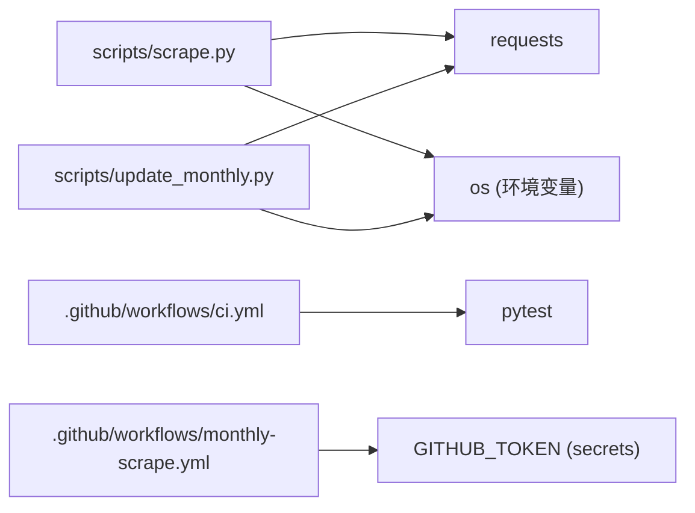

# 配置管理系统

<cite>
**本文引用的文件**
- [scripts/scrape.py](file://scripts/scrape.py)
- [scripts/update_monthly.py](file://scripts/update_monthly.py)
- [.github/workflows/monthly-scrape.yml](file://.github/workflows/monthly-scrape.yml)
- [.github/workflows/ci.yml](file://.github/workflows/ci.yml)
- [README.md](file://README.md)
- [requirements.txt](file://requirements.txt)
</cite>

## 目录
1. [简介](#简介)
2. [项目结构](#项目结构)
3. [核心组件](#核心组件)
4. [架构总览](#架构总览)
5. [详细组件分析](#详细组件分析)
6. [依赖关系分析](#依赖关系分析)
7. [性能与可扩展性](#性能与可扩展性)
8. [故障排除指南](#故障排除指南)
9. [结论](#结论)
10. [附录：配置示例与最佳实践](#附录配置示例与最佳实践)

## 简介
本技术文档聚焦于仓库中的“配置管理系统”，围绕以下目标展开：
- 说明配置的层次结构与优先级：环境变量（如 GITHUB_TOKEN）、硬编码参数（如 AWESOME_LISTS、LANGUAGES）、运行时配置。
- 解释配置验证机制与默认值处理策略。
- 描述热重载支持与动态参数调整能力。
- 提供配置最佳实践与安全考虑，包括敏感信息保护、配置备份与版本管理。
- 给出具体配置示例与故障排除指南。

该系统的配置主要分布在两个 Python 脚本中，并通过 GitHub Actions 注入环境变量以支持高配额 API 访问。

## 项目结构
与配置相关的核心位置如下：
- 爬虫主脚本：scripts/scrape.py
- 月度增量抓取脚本：scripts/update_monthly.py
- CI/CD 工作流：.github/workflows/*.yml
- 用户文档与使用说明：README.md
- 依赖清单：requirements.txt

图表来源
- [scripts/scrape.py:26-115](file://scripts/scrape.py#L26-L115)
- [scripts/update_monthly.py:26-47](file://scripts/update_monthly.py#L26-L47)
- [.github/workflows/monthly-scrape.yml:25-28](file://.github/workflows/monthly-scrape.yml#L25-L28)
- [.github/workflows/ci.yml:22-33](file://.github/workflows/ci.yml#L22-L33)
- [README.md:169-171](file://README.md#L169-L171)
- [requirements.txt:1-2](file://requirements.txt#L1-L2)

章节来源
- [scripts/scrape.py:26-115](file://scripts/scrape.py#L26-L115)
- [scripts/update_monthly.py:26-47](file://scripts/update_monthly.py#L26-L47)
- [.github/workflows/monthly-scrape.yml:25-28](file://.github/workflows/monthly-scrape.yml#L25-L28)
- [.github/workflows/ci.yml:22-33](file://.github/workflows/ci.yml#L22-L33)
- [README.md:169-171](file://README.md#L169-L171)
- [requirements.txt:1-2](file://requirements.txt#L1-L2)

## 核心组件
- 环境变量配置
  - GITHUB_TOKEN：用于提升 GitHub API 的速率限制。由脚本在启动时从环境变量读取，并在请求头中注入 Authorization。
- 硬编码参数
  - MIN_STARS、MIN_FORKS：筛选阈值，当前为常量。
  - AWESOME_LISTS：Awesome 列表源集合，包含名称与 README raw URL。
  - LANGUAGES：语言维度搜索列表。
- 运行时配置
  - 通过命令行参数或调用上下文传入的参数（例如 update_monthly.py 的 --year、--month、--report）。
  - 输出路径与数据文件位置（data/repos.json）等。

章节来源
- [scripts/scrape.py:26-80](file://scripts/scrape.py#L26-L80)
- [scripts/update_monthly.py:26-37](file://scripts/update_monthly.py#L26-37)
- [scripts/update_monthly.py:306-311](file://scripts/update_monthly.py#L306-L311)

## 架构总览
配置加载与使用的关键流程如下：
- 启动阶段：脚本进程初始化时读取环境变量并设置全局常量。
- 请求阶段：统一通过 get_headers() 构造请求头，若存在 GITHUB_TOKEN 则注入 Authorization。
- 执行阶段：各数据源抓取函数按顺序执行，最终合并、评分、排序并持久化到 data/repos.json。
- CI/CD 阶段：GitHub Actions 在工作流步骤中以 env 注入 GITHUB_TOKEN，确保自动化任务具备更高配额。

图表来源
- [scripts/scrape.py:26-115](file://scripts/scrape.py#L26-L115)
- [scripts/scrape.py:673-719](file://scripts/scrape.py#L673-L719)
- [scripts/scrape.py:628-651](file://scripts/scrape.py#L628-L651)

## 详细组件分析

### 配置层次结构与优先级
- 环境变量优先
  - GITHUB_TOKEN 通过 os.environ.get("GITHUB_TOKEN") 读取，若未设置则保持为空，不会中断程序运行。
- 硬编码参数作为默认值
  - MIN_STARS、MIN_FORKS、AWESOME_LISTS、LANGUAGES 均为模块级常量，直接参与业务逻辑。
- 运行时配置
  - update_monthly.py 通过 argparse 解析 --year、--month、--report 等参数，影响抓取范围与报告生成。
- 优先级总结
  - 环境变量 > 硬编码默认值；运行时参数覆盖部分行为（如月份范围），但不改变模块级常量。

章节来源
- [scripts/scrape.py:26-80](file://scripts/scrape.py#L26-L80)
- [scripts/update_monthly.py:26-37](file://scripts/update_monthly.py#L26-37)
- [scripts/update_monthly.py:306-311](file://scripts/update_monthly.py#L306-L311)

### 配置验证机制与默认值处理
- 环境变量验证
  - 对 GITHUB_TOKEN 采用“存在即启用”的策略：若存在则注入请求头，否则降级为匿名访问。
  - 启动时会打印是否检测到 Token 的提示信息，便于快速定位限流问题。
- 默认值处理
  - MIN_STARS、MIN_FORKS 使用固定默认值，无需额外校验。
  - AWESOME_LISTS、LANGUAGES 作为列表常量，直接使用；若需要扩展，建议通过外部配置文件或环境变量注入。
- 错误处理
  - 网络请求失败或限流时，脚本会捕获异常并记录日志，避免整体崩溃。

章节来源
- [scripts/scrape.py:107-115](file://scripts/scrape.py#L107-L115)
- [scripts/scrape.py:673-685](file://scripts/scrape.py#L673-L685)
- [scripts/scrape.py:179-194](file://scripts/scrape.py#L179-L194)

### 配置热重载与动态参数调整
- 热重载支持
  - 当前实现为一次性进程模型，配置在进程启动时加载，不支持运行时热重载。
- 动态参数调整
  - 可通过命令行参数调整月度抓取范围（update_monthly.py），但无法在运行中修改模块级常量（如 AWESOME_LISTS、LANGUAGES）。
- 改进建议
  - 引入配置类或配置管理器，支持在进程内更新配置对象，并在关键函数入口处重新读取最新配置。
  - 对于令牌轮换，可在请求前动态刷新 Authorization 头。

章节来源
- [scripts/update_monthly.py:306-311](file://scripts/update_monthly.py#L306-L311)
- [scripts/scrape.py:26-80](file://scripts/scrape.py#L26-L80)

### 安全考虑与敏感信息管理
- 敏感信息保护
  - GITHUB_TOKEN 应通过环境变量或 CI/CD Secrets 注入，避免硬编码或提交到代码库。
  - 工作流中使用 secrets.GITHUB_TOKEN 自动注入，符合安全最佳实践。
- 配置备份与版本管理
  - 数据文件 data/repos.json 已标记为二进制以避免差异噪音，适合纳入版本控制。
  - 建议在变更 AWESOME_LISTS、LANGUAGES 等配置时保留变更记录，便于回溯。

章节来源
- [.github/workflows/monthly-scrape.yml:25-28](file://.github/workflows/monthly-scrape.yml#L25-L28)
- [README.md:169-171](file://README.md#L169-L171)

### 配置示例与使用方式
- 本地运行
  - 设置环境变量后执行抓取脚本，或使用默认配置运行。
- CI/CD 运行
  - 工作流在运行抓取步骤时注入 GITHUB_TOKEN，提高配额上限。
- 月度增量抓取
  - 通过命令行参数指定年份与月份，可选择生成 Markdown 报告。

章节来源
- [README.md:49-68](file://README.md#L49-L68)
- [.github/workflows/monthly-scrape.yml:25-28](file://.github/workflows/monthly-scrape.yml#L25-L28)
- [scripts/update_monthly.py:306-311](file://scripts/update_monthly.py#L306-L311)

## 依赖关系分析
- 模块内依赖
  - scrape.py 与 update_monthly.py 均依赖 requests 进行 HTTP 请求，并使用 os 读取环境变量。
- 外部依赖
  - requirements.txt 声明了 requests 与 beautifulsoup4，CI 工作流在安装依赖时也会安装 pytest 用于测试。
- 耦合与内聚
  - 配置集中在模块顶部，内聚性良好；但缺乏集中式配置管理，扩展性受限。

图表来源
- [scripts/scrape.py:14-24](file://scripts/scrape.py#L14-L24)
- [scripts/update_monthly.py:19-24](file://scripts/update_monthly.py#L19-L24)
- [requirements.txt:1-2](file://requirements.txt#L1-L2)
- [.github/workflows/ci.yml:22-28](file://.github/workflows/ci.yml#L22-L28)
- [.github/workflows/monthly-scrape.yml:25-28](file://.github/workflows/monthly-scrape.yml#L25-L28)

章节来源
- [scripts/scrape.py:14-24](file://scripts/scrape.py#L14-L24)
- [scripts/update_monthly.py:19-24](file://scripts/update_monthly.py#L19-L24)
- [requirements.txt:1-2](file://requirements.txt#L1-L2)
- [.github/workflows/ci.yml:22-28](file://.github/workflows/ci.yml#L22-L28)
- [.github/workflows/monthly-scrape.yml:25-28](file://.github/workflows/monthly-scrape.yml#L25-L28)

## 性能与可扩展性
- 性能特征
  - 请求重试与退避：使用 Retry 与 HTTPAdapter 对 429/5xx 进行重试，降低瞬时失败的影响。
  - 速率限制：未设置 Token 时受限于 60 req/hour，设置后可提升至 5000 req/hour。
- 可扩展性建议
  - 将 AWESOME_LISTS、LANGUAGES 等配置外置为 JSON/YAML 文件，并提供环境变量覆盖选项。
  - 引入配置校验层，对必填字段与类型进行检查，提前暴露配置错误。
  - 增加配置热重载接口，支持在不重启进程的情况下调整参数。

章节来源
- [scripts/scrape.py:118-134](file://scripts/scrape.py#L118-L134)
- [scripts/scrape.py:673-685](file://scripts/scrape.py#L673-L685)

## 故障排除指南
- 常见问题
  - 页面无法加载数据：需通过本地 HTTP 服务器访问，而非 file:// 协议。
  - 触发 GitHub API 限流：设置 GITHUB_TOKEN 环境变量以提升配额。
- 排查步骤
  - 确认环境变量是否正确注入（本地或 CI）。
  - 检查脚本启动时的 Token 检测提示。
  - 查看网络请求的错误日志与状态码。
- 恢复措施
  - 修正环境变量或 Secrets 配置。
  - 必要时降低抓取频率或分页数量，避免触发限流。

章节来源
- [README.md:166-171](file://README.md#L166-L171)
- [scripts/scrape.py:673-685](file://scripts/scrape.py#L673-L685)

## 结论
当前配置管理系统以“环境变量 + 硬编码默认值”为主，结构简单且易于理解。通过 CI/CD 注入 GITHUB_TOKEN，可显著提升抓取效率与稳定性。未来可引入集中式配置管理与校验层，增强可维护性与安全性，同时支持热重载以满足更灵活的运行时需求。

## 附录：配置示例与最佳实践
- 环境变量
  - GITHUB_TOKEN：在本地或 CI 环境中设置，避免硬编码。
- 硬编码参数
  - MIN_STARS、MIN_FORKS：根据业务需求调整，注意与 API 配额平衡。
  - AWESOME_LISTS、LANGUAGES：按需增减，定期审查链接有效性。
- 运行时参数
  - update_monthly.py：--year、--month、--report 控制抓取范围与报告生成。
- 安全与版本管理
  - 使用 Secrets 管理敏感信息。
  - 对配置变更进行版本化管理，保留变更记录。
- 备份策略
  - 定期备份 data/repos.json 与相关报告文件，确保数据可恢复。

章节来源
- [scripts/scrape.py:26-80](file://scripts/scrape.py#L26-L80)
- [scripts/update_monthly.py:306-311](file://scripts/update_monthly.py#L306-L311)
- [.github/workflows/monthly-scrape.yml:25-28](file://.github/workflows/monthly-scrape.yml#L25-L28)
- [README.md:169-171](file://README.md#L169-L171)