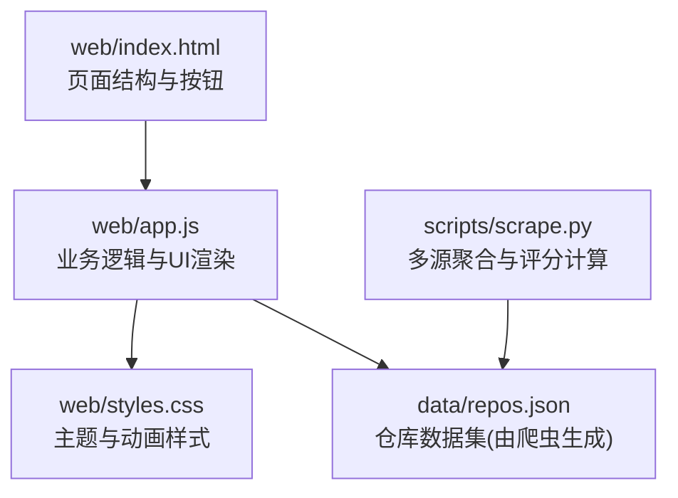
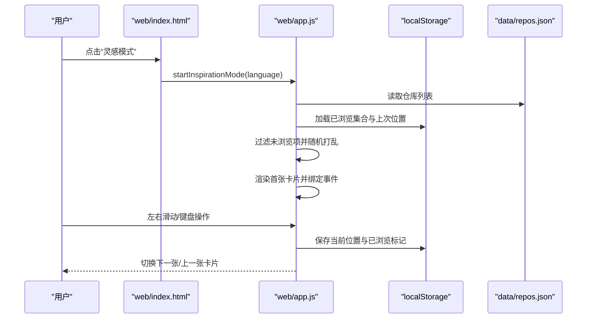
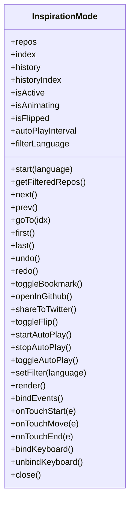
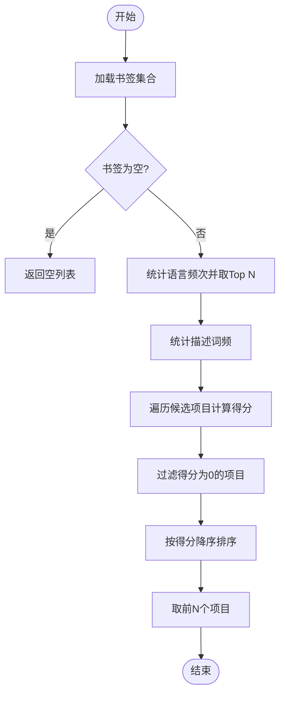
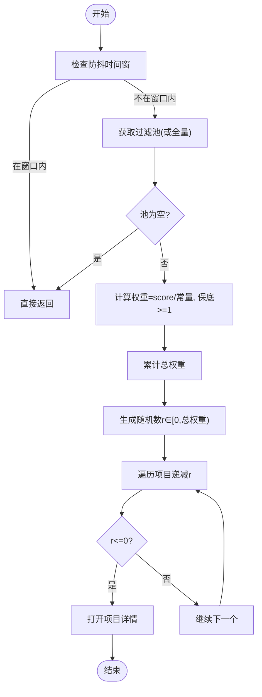
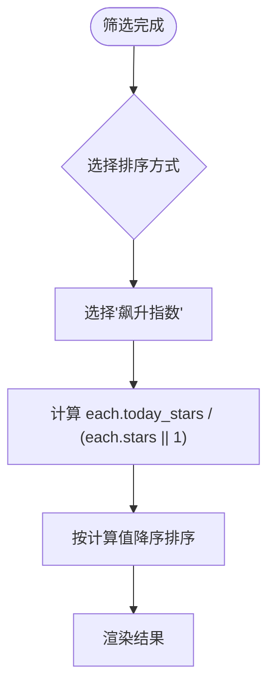
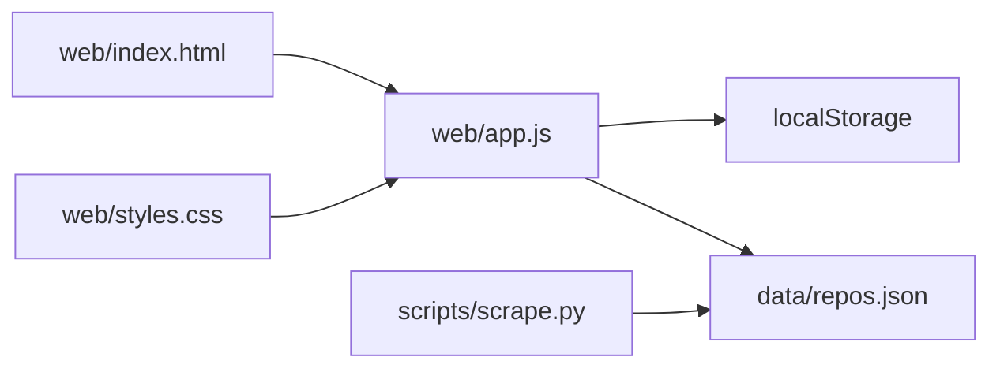

# 发现功能

<cite>
**本文引用的文件**
- [README.md](file://README.md)
- [README.zh-CN.md](file://README.zh-CN.md)
- [web/index.html](file://web/index.html)
- [web/app.js](file://web/app.js)
- [web/styles.css](file://web/styles.css)
- [scripts/scrape.py](file://scripts/scrape.py)
</cite>

## 目录
1. [简介](#简介)
2. [项目结构](#项目结构)
3. [核心组件](#核心组件)
4. [架构总览](#架构总览)
5. [详细组件分析](#详细组件分析)
6. [依赖关系分析](#依赖关系分析)
7. [性能考量](#性能考量)
8. [故障排查指南](#故障排查指南)
9. [结论](#结论)
10. [附录](#附录)

## 简介
本章节聚焦“发现”能力，包括：
- 灵感模式（Inspiration Mode）：全屏沉浸式浏览，支持左右滑动、键盘导航与自动播放。
- 智能推荐：基于用户书签的语言偏好与关键词进行个性化排序推荐。
- 随机宝藏：按权重随机抽取高质量项目。
- 飙升指数：以今日增长与Stars的比值进行排序，快速定位高增长项目。

这些能力在前端通过纯HTML/CSS/JS实现，数据来源于后端聚合脚本生成的仓库数据集。

## 项目结构
前端入口位于 web/index.html，交互逻辑集中在 web/app.js，样式在 web/styles.css；评分与数据生成由 scripts/scrape.py 完成。

图表来源
- [web/index.html:179-210](file://web/index.html#L179-L210)
- [web/app.js:1792-1869](file://web/app.js#L1792-L1869)
- [web/styles.css:1-200](file://web/styles.css#L1-L200)
- [scripts/scrape.py:542-562](file://scripts/scrape.py#L542-L562)

章节来源
- [web/index.html:179-210](file://web/index.html#L179-L210)
- [web/app.js:1792-1869](file://web/app.js#L1792-L1869)
- [web/styles.css:1-200](file://web/styles.css#L1-L200)
- [scripts/scrape.py:542-562](file://scripts/scrape.py#L542-L562)

## 核心组件
- 灵感模式模块：提供全屏卡片式浏览、手势与键盘控制、自动播放、历史撤销/重做、进度与已浏览状态持久化。
- 智能推荐模块：基于书签语言分布与描述词频，对候选项目进行打分并返回Top N。
- 随机宝藏模块：按综合得分加权随机选择，避免低质量项目被频繁选中。
- 飙升指数排序：使用 today_stars / stars 作为排序依据，突出当日增长最快的项目。

章节来源
- [web/app.js:1792-2606](file://web/app.js#L1792-L2606)
- [web/app.js:1588-1682](file://web/app.js#L1588-L1682)
- [web/app.js:1691-1715](file://web/app.js#L1691-L1715)
- [web/app.js:1016-1049](file://web/app.js#L1016-L1049)

## 架构总览
发现功能的整体流程如下：
- 用户点击“灵感模式/智能推荐/随机宝藏/飙升指数”等入口，触发对应逻辑。
- 灵感模式维护独立的状态机（索引、历史、是否翻转、自动播放等），并通过本地存储持久化位置与已浏览集合。
- 智能推荐与随机宝藏均读取当前过滤结果或全量数据，分别采用“语言+关键词打分”和“得分加权随机”策略。
- 飙升指数为一种排序方式，在筛选与排序流程中生效。

图表来源
- [web/index.html:202-207](file://web/index.html#L202-L207)
- [web/app.js:2608-2610](file://web/app.js#L2608-L2610)
- [web/app.js:1840-1869](file://web/app.js#L1840-L1869)
- [web/app.js:1889-1926](file://web/app.js#L1889-L1926)

## 详细组件分析

### 灵感模式（Inspiration Mode）
- 启动与数据准备
  - 根据可选语言筛选仓库，剔除已浏览项，随机打乱顺序后进入浏览。
  - 从本地存储恢复上次位置与已浏览集合，保证会话连续性。
- 交互与导航
  - 触摸滑动：检测水平滑动距离与方向，超过阈值则前进/后退，同时显示滑动指示器与轻微旋转缩放效果。
  - 键盘导航：←/→ 切换卡片，Space 收藏，Enter 打开GitHub，F 翻转卡片，P 自动播放，Home/End 首尾跳转，U/R 撤销/重做，Esc 关闭。
  - 自动播放：定时推进到下一张，到达末尾自动停止。
- 状态与持久化
  - 记录已浏览集合与当前索引，刷新时恢复。
  - 历史记录栈限制最大长度，支持撤销/重做。
- 可访问性与反馈
  - 使用 aria-* 属性与 live region 播报当前卡片信息。
  - 移动端支持轻触反馈（vibrate）。

图表来源
- [web/app.js:1820-2606](file://web/app.js#L1820-L2606)

使用示例与界面交互流程
- 启动：点击“灵感模式”按钮，进入全屏卡片视图。
- 浏览：左右滑动或按←/→切换；按Space收藏；按F翻转查看详细信息；按P开启自动播放。
- 筛选：顶部下拉选择语言，仅展示该语言的未浏览项目。
- 结束：按Esc退出，系统会保存当前位置与已浏览标记。

代码实现细节（路径引用）
- 启动与过滤：[web/app.js:1840-1878](file://web/app.js#L1840-L1878)
- 已浏览与位置持久化：[web/app.js:1889-1926](file://web/app.js#L1889-L1926)
- 滑动处理与指示器：[web/app.js:2493-2521](file://web/app.js#L2493-L2521), [web/app.js:2174-2210](file://web/app.js#L2174-L2210)
- 键盘绑定与处理：[web/app.js:2523-2593](file://web/app.js#L2523-L2593)
- 自动播放控制：[web/app.js:2059-2087](file://web/app.js#L2059-L2087)
- 渲染与事件绑定：[web/app.js:2295-2456](file://web/app.js#L2295-L2456), [web/app.js:2458-2491](file://web/app.js#L2458-L2491)

章节来源
- [web/app.js:1840-1926](file://web/app.js#L1840-L1926)
- [web/app.js:2174-2210](file://web/app.js#L2174-L2210)
- [web/app.js:2493-2521](file://web/app.js#L2493-L2521)
- [web/app.js:2523-2593](file://web/app.js#L2523-L2593)
- [web/app.js:2059-2087](file://web/app.js#L2059-L2087)
- [web/app.js:2295-2456](file://web/app.js#L2295-L2456)
- [web/app.js:2458-2491](file://web/app.js#L2458-L2491)

### 智能推荐算法（基于书签语言偏好）
- 输入：用户的书签集合。
- 特征提取：
  - 语言分布：统计各语言出现次数，取Top N语言作为强偏好。
  - 关键词分布：将描述分词，统计高频词。
- 打分规则：
  - 若候选项目的语言属于Top N语言，加分。
  - 若候选项目描述包含书签中的高频词，按词频加权加分。
- 输出：按分数降序返回前N个候选项目。

图表来源
- [web/app.js:1588-1628](file://web/app.js#L1588-L1628)

使用示例与界面交互流程
- 先收藏若干项目，点击“智能推荐”，弹出推荐列表。
- 点击某推荐项，跳转到该项目详情。

代码实现细节（路径引用）
- 推荐算法核心：[web/app.js:1588-1628](file://web/app.js#L1588-L1628)
- 弹窗展示与点击跳转：[web/app.js:1630-1682](file://web/app.js#L1630-L1682)

章节来源
- [web/app.js:1588-1682](file://web/app.js#L1588-L1682)

### 随机宝藏（加权随机选择）
- 输入：当前过滤后的仓库列表（若无过滤则使用全部）。
- 权重计算：每个项目的权重为其综合得分除以常数（确保最小权重≥1）。
- 选择逻辑：按权重区间累加，用随机数命中对应项目。
- 防抖：同一秒内多次点击只响应一次，避免频繁弹窗。

图表来源
- [web/app.js:1691-1715](file://web/app.js#L1691-L1715)

使用示例与界面交互流程
- 点击“发现宝藏”按钮，立即弹出一个高质量项目详情。
- 连续点击会被限流保护，间隔至少5秒。

代码实现细节（路径引用）
- 随机选择逻辑与防抖：[web/app.js:1691-1715](file://web/app.js#L1691-L1715)

章节来源
- [web/app.js:1691-1715](file://web/app.js#L1691-L1715)

### 飙升指数计算方法与排序机制
- 定义：飙升指数 = 今日增长 / Stars（当Stars为0时使用1以避免除零）。
- 排序：在筛选与排序流程中，选择“飙升指数”排序时，按该指标降序排列。
- 数据来源：today_stars 字段来自后端聚合脚本的计算与估算。

图表来源
- [web/app.js:1016-1049](file://web/app.js#L1016-L1049)

使用示例与界面交互流程
- 在“排序”下拉中选择“飙升指数”，列表即刻按飙升指数从高到低排列。
- 结合语言、Stars/Forks/评分范围等多维筛选，精准定位高增长项目。

代码实现细节（路径引用）
- 排序分支与飙升指数计算：[web/app.js:1016-1049](file://web/app.js#L1016-L1049)

章节来源
- [web/app.js:1016-1049](file://web/app.js#L1016-L1049)

## 依赖关系分析
- 前端依赖
  - HTML 提供入口按钮与模态容器。
  - app.js 负责所有发现功能的逻辑与渲染。
  - styles.css 提供主题、布局与动画。
- 数据依赖
  - data/repos.json 由 scripts/scrape.py 生成，包含 stars、forks、today_stars、score 等字段。
- 外部依赖
  - localStorage 用于书签、预设、灵感模式状态与已浏览集合的持久化。
  - navigator.vibrate 提供移动端触觉反馈。
  - window.open 用于打开 GitHub 链接与分享。

图表来源
- [web/index.html:179-210](file://web/index.html#L179-L210)
- [web/app.js:1792-1869](file://web/app.js#L1792-L1869)
- [web/styles.css:1-200](file://web/styles.css#L1-L200)
- [scripts/scrape.py:542-562](file://scripts/scrape.py#L542-L562)

章节来源
- [web/index.html:179-210](file://web/index.html#L179-L210)
- [web/app.js:1792-1869](file://web/app.js#L1792-L1869)
- [web/styles.css:1-200](file://web/styles.css#L1-L200)
- [scripts/scrape.py:542-562](file://scripts/scrape.py#L542-L562)

## 性能考量
- 虚拟滚动：当结果集较大时启用虚拟滚动，减少DOM节点数量，提升滚动性能。
- 防抖与节流：搜索与滚动事件使用防抖，降低频繁重排重绘开销。
- 预加载相邻卡片：在灵感模式中预留相邻卡片资源，减少切换时的卡顿。
- 动画优化：使用CSS transform与opacity进行过渡，避免触发布局抖动。

章节来源
- [web/app.js:864-915](file://web/app.js#L864-L915)
- [web/app.js:1068-1074](file://web/app.js#L1068-L1074)
- [web/app.js:2108-2115](file://web/app.js#L2108-L2115)

## 故障排查指南
- 无法加载数据
  - 现象：页面提示“无法加载数据”。
  - 原因：浏览器安全策略禁止 file:// 协议下的 fetch 请求。
  - 解决：通过本地HTTP服务运行（例如 python3 -m http.server 8000）。
- 灵感模式无内容
  - 现象：进入灵感模式后提示“没有找到匹配的项目”。
  - 原因：当前语言筛选下没有未浏览项目。
  - 解决：清除语言筛选或等待更多项目入库。
- 自动播放不工作
  - 现象：点击自动播放无效。
  - 原因：可能已被其他操作中断或达到末尾。
  - 解决：重新点击自动播放按钮，或切换到非末尾位置。

章节来源
- [web/app.js:404-443](file://web/app.js#L404-L443)
- [web/app.js:1844-1847](file://web/app.js#L1844-L1847)
- [web/app.js:2059-2087](file://web/app.js#L2059-L2087)

## 结论
发现功能围绕“灵感模式、智能推荐、随机宝藏、飙升指数”四大能力构建，兼顾用户体验与性能。灵感模式提供沉浸式浏览与完整的手势/键盘/自动播放支持；智能推荐基于书签语言与关键词进行轻量级个性化排序；随机宝藏通过得分加权提高优质项目曝光；飙升指数帮助用户快速捕捉高增长项目。整体实现简洁高效，易于扩展与维护。

## 附录
- 快捷键参考
  - 灵感模式：←/→ 切换、Space 收藏、Enter 打开、F 翻转、T 分享、P 自动播放、Home/End 首尾、U/R 撤销/重做、Esc 关闭。
  - 全局：/ 聚焦搜索、T 切换主题、B 书签视图、L 切换语言、? 帮助。
- 数据来源与评分
  - 数据来源：Awesome Lists、GitHub Search API、Hacker News、DEV.to。
  - 评分公式：stars + forks + (forks/stars)*1000 + today_stars*10 + commit_activity*2。

章节来源
- [README.zh-CN.md:102-139](file://README.zh-CN.md#L102-L139)
- [README.md:98-120](file://README.md#L98-L120)
- [scripts/scrape.py:542-562](file://scripts/scrape.py#L542-L562)