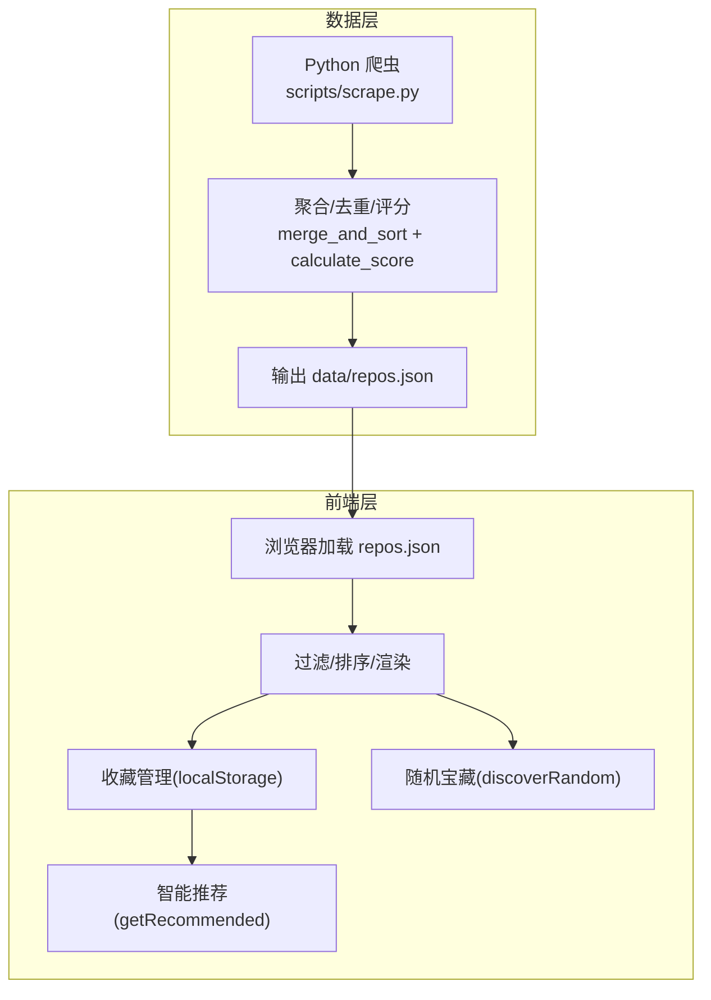
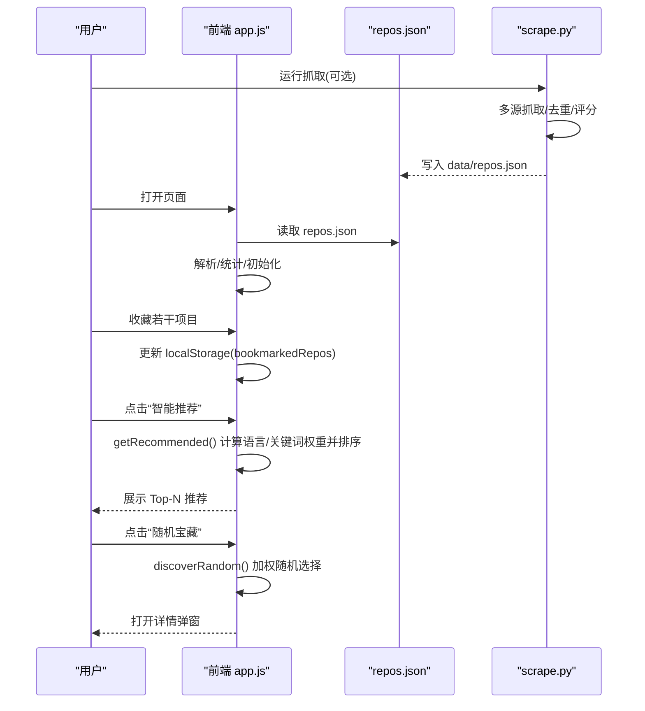
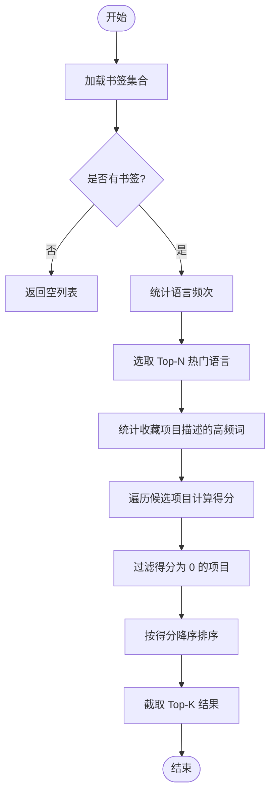
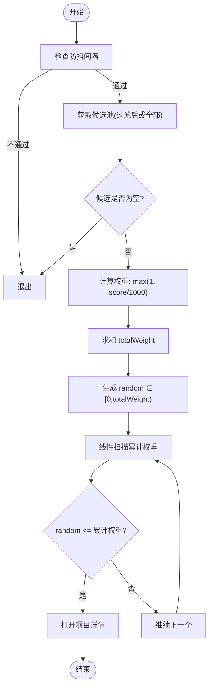
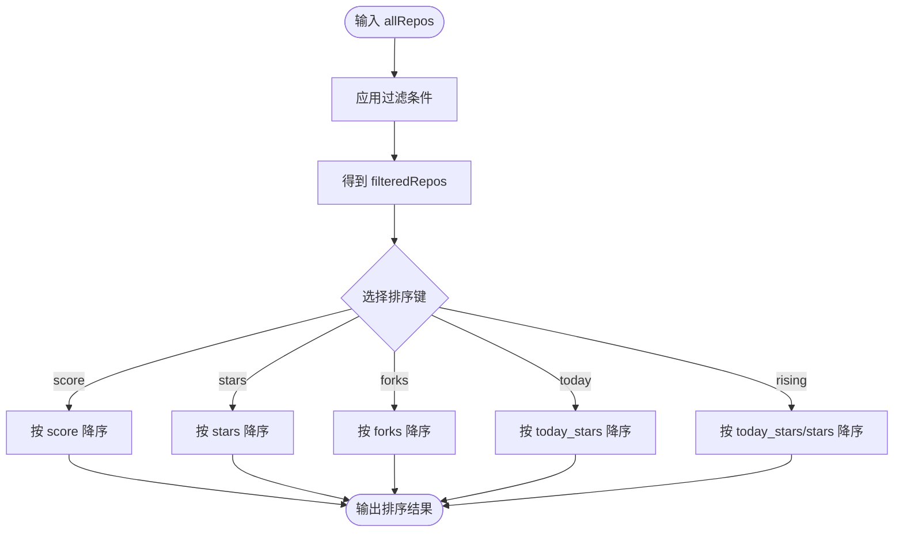
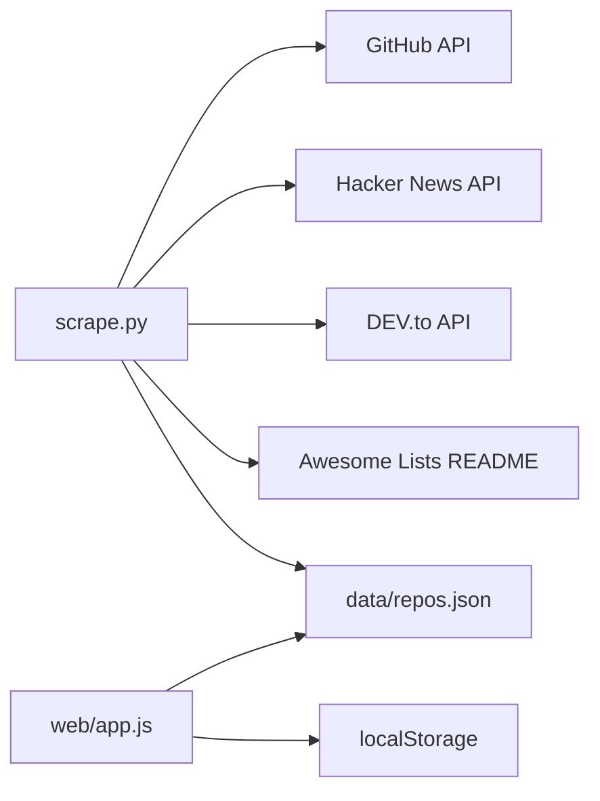

# 智能推荐

<cite>
**本文引用的文件**   
- [README.md](file://README.md)
- [README.zh-CN.md](file://README.zh-CN.md)
- [web/app.js](file://web/app.js)
- [scripts/scrape.py](file://scripts/scrape.py)
</cite>

## 目录
1. [简介](#简介)
2. [项目结构](#项目结构)
3. [核心组件](#核心组件)
4. [架构总览](#架构总览)
5. [详细组件分析](#详细组件分析)
6. [依赖关系分析](#依赖关系分析)
7. [性能考量](#性能考量)
8. [故障排查指南](#故障排查指南)
9. [结论](#结论)
10. [附录](#附录)

## 简介
本文件聚焦于 GitHub Treasure Repo 的“智能推荐”与“随机宝藏”两大能力，系统性说明其实现原理、数据流、算法细节与可配置项。内容覆盖：
- 基于用户书签语言偏好的个性化推荐算法（书签收集、语言权重计算、关键词匹配、排序规则）
- 随机宝藏功能的加权随机选择与防抖机制
- 推荐结果的数据过滤与排序规则
- 评分体系与数据来源对推荐的影响
- 可扩展点与自定义方法建议

## 项目结构
仓库采用前后端分离的轻量架构：
- 后端脚本负责多源抓取、去重、评分与持久化 JSON 数据集
- 前端页面直接消费该数据集，提供筛选、收藏、推荐、灵感模式等交互

图表来源
- [scripts/scrape.py:575-622](file://scripts/scrape.py#L575-L622)
- [scripts/scrape.py:562-573](file://scripts/scrape.py#L562-L573)
- [web/app.js:401-440](file://web/app.js#L401-L440)
- [web/app.js:1013-1046](file://web/app.js#L1013-L1046)
- [web/app.js:1586-1625](file://web/app.js#L1586-L1625)
- [web/app.js:1688-1712](file://web/app.js#L1688-L1712)

章节来源
- [README.md:123-148](file://README.md#L123-L148)
- [README.zh-CN.md:140-170](file://README.zh-CN.md#L140-L170)

## 核心组件
- 数据采集与评分（后端）
  - 多源抓取：Awesome Lists、GitHub API、Hacker News、DEV.to
  - 去重合并：按仓库名去重，数值字段取最大值，描述/语言优先保留更完整信息
  - 综合评分：stars + forks + (forks/stars)*1000 + today_stars*10 + commit_activity*2
- 前端交互与推荐（前端）
  - 书签管理：localStorage 持久化收藏集合
  - 智能推荐：根据收藏的语言分布与高频词进行打分排序
  - 随机宝藏：基于评分的加权随机选择
  - 过滤与排序：支持搜索、语言、Stars/Forks/Score 范围、飙升指数等

章节来源
- [scripts/scrape.py:193-240](file://scripts/scrape.py#L193-L240)
- [scripts/scrape.py:268-298](file://scripts/scrape.py#L268-L298)
- [scripts/scrape.py:336-402](file://scripts/scrape.py#L336-L402)
- [scripts/scrape.py:405-461](file://scripts/scrape.py#L405-L461)
- [scripts/scrape.py:464-528](file://scripts/scrape.py#L464-L528)
- [scripts/scrape.py:575-622](file://scripts/scrape.py#L575-L622)
- [scripts/scrape.py:562-573](file://scripts/scrape.py#L562-L573)
- [web/app.js:293-329](file://web/app.js#L293-L329)
- [web/app.js:1013-1046](file://web/app.js#L1013-L1046)
- [web/app.js:1586-1625](file://web/app.js#L1586-L1625)
- [web/app.js:1688-1712](file://web/app.js#L1688-L1712)

## 架构总览
从数据到推荐的端到端流程如下：

图表来源
- [scripts/scrape.py:671-716](file://scripts/scrape.py#L671-L716)
- [scripts/scrape.py:575-622](file://scripts/scrape.py#L575-L622)
- [web/app.js:401-440](file://web/app.js#L401-L440)
- [web/app.js:1586-1625](file://web/app.js#L1586-L1625)
- [web/app.js:1688-1712](file://web/app.js#L1688-L1712)

## 详细组件分析

### 书签数据收集与存储
- 书签集合以 Set 形式维护在内存中，并通过 localStorage 持久化
- 收藏操作会同步更新 UI 状态与列表视图（当处于“仅收藏”模式时）

关键路径
- 书签读写：[web/app.js:293-329](file://web/app.js#L293-L329)
- 收藏切换触发过滤刷新：[web/app.js:308-329](file://web/app.js#L308-L329)

章节来源
- [web/app.js:293-329](file://web/app.js#L293-L329)

### 智能推荐算法（基于书签语言偏好与关键词）
算法步骤
1. 收集已收藏项目集合
2. 统计语言频次，选出 Top-N 热门语言（默认前 3）
3. 统计收藏项目描述中的高频词（长度大于 3 的词），构建关键词权重表
4. 遍历未收藏项目，逐项打分：
   - 若项目语言属于热门语言，加分（固定权重）
   - 若项目描述包含高频词，按词频累加得分
5. 过滤掉得分为 0 的项目，按得分降序排序，返回 Top-K（默认 5）

复杂度与特性
- 时间复杂度：O(B + N·W)，B 为收藏数，N 为候选集大小，W 为平均描述词数
- 空间复杂度：O(L + Kc)，L 为不同语言数量，Kc 为高频词数量
- 优点：简单高效、无需外部模型；能体现用户的语言偏好与主题兴趣
- 局限：未考虑项目质量分或活跃度；关键词粒度较粗

图表来源
- [web/app.js:1586-1625](file://web/app.js#L1586-L1625)

章节来源
- [web/app.js:1586-1625](file://web/app.js#L1586-L1625)

### 随机宝藏功能（加权随机选择与防抖）
算法要点
- 输入：当前过滤后的结果集（若无过滤则使用全部）
- 权重：每个项目的权重 = max(1, score / 1000)
- 选择：生成 [0, totalWeight) 的随机数，线性扫描累计权重，命中即返回
- 防抖：同一秒内多次点击会被忽略，避免频繁弹窗

图表来源
- [web/app.js:1688-1712](file://web/app.js#L1688-L1712)

章节来源
- [web/app.js:1688-1712](file://web/app.js#L1688-L1712)

### 推荐结果的过滤与排序规则
- 过滤维度
  - 文本搜索：名称/描述模糊匹配
  - 语言筛选：精确匹配
  - 数值范围：Stars ≥ X、Forks ≥ Y、Score ≥ Z
  - 收藏视图：仅显示已收藏项目
- 排序方式
  - 综合评分（score）
  - Stars
  - Forks
  - 今日增长（today_stars）
  - 飙升指数（today_stars / stars）

图表来源
- [web/app.js:1013-1046](file://web/app.js#L1013-L1046)

章节来源
- [web/app.js:1013-1046](file://web/app.js#L1013-L1046)

### 评分体系与数据来源对推荐的影响
- 评分公式（后端计算）
  - score = stars + forks + (forks/stars)*1000 + today_stars*10 + commit_activity*2
- 数据来源
  - Awesome Lists、GitHub API、Trending 近似查询、Hacker News、DEV.to
  - 去重策略：同名仓库保留更高数值信号与更完整元数据
- 影响
  - 评分越高，随机宝藏被选中的概率越大
  - today_stars 与 commit_activity 提升“活跃度”信号，间接影响飙升排序

章节来源
- [scripts/scrape.py:562-573](file://scripts/scrape.py#L562-L573)
- [scripts/scrape.py:575-622](file://scripts/scrape.py#L575-L622)
- [README.md:109-120](file://README.md#L109-L120)
- [README.zh-CN.md:130-137](file://README.zh-CN.md#L130-L137)

## 依赖关系分析
- 前端依赖
  - 静态数据：data/repos.json（由 Python 脚本生成）
  - 本地存储：localStorage（书签、预设、浏览历史等）
- 后端依赖
  - requests、urllib3（重试与退避）
  - 外部接口：GitHub API、HN API、DEV.to API、Awesome Lists 原始 README

图表来源
- [scripts/scrape.py:114-131](file://scripts/scrape.py#L114-L131)
- [scripts/scrape.py:193-240](file://scripts/scrape.py#L193-L240)
- [scripts/scrape.py:268-298](file://scripts/scrape.py#L268-L298)
- [scripts/scrape.py:336-402](file://scripts/scrape.py#L336-L402)
- [scripts/scrape.py:405-461](file://scripts/scrape.py#L405-L461)
- [scripts/scrape.py:464-528](file://scripts/scrape.py#L464-L528)
- [web/app.js:401-440](file://web/app.js#L401-L440)
- [web/app.js:293-329](file://web/app.js#L293-L329)

章节来源
- [scripts/scrape.py:114-131](file://scripts/scrape.py#L114-L131)
- [web/app.js:401-440](file://web/app.js#L401-L440)

## 性能考量
- 大数据量渲染优化
  - 虚拟滚动：当结果超过阈值时启用绝对定位+可视区域渲染，减少 DOM 节点数量
- 事件节流与防抖
  - 搜索输入使用 debounce 降低重算频率
  - 随机宝藏增加防抖，防止短时间内重复触发
- 前端计算复杂度
  - 智能推荐主要开销在描述分词与匹配，可通过限制候选集或缓存词频进一步优化

章节来源
- [web/app.js:861-912](file://web/app.js#L861-L912)
- [web/app.js:1065-1071](file://web/app.js#L1065-L1071)
- [web/app.js:1688-1712](file://web/app.js#L1688-L1712)

## 故障排查指南
- 无法加载数据
  - 现象：提示“无法加载数据”
  - 原因：通过 file:// 协议直接打开页面，浏览器禁止 fetch 请求
  - 解决：使用本地 HTTP 服务启动 web 目录
- GitHub API 限流
  - 现象：抓取失败或速率受限
  - 解决：设置环境变量 GITHUB_TOKEN 提高配额
- 推荐结果为空
  - 现象：点击“智能推荐”无结果
  - 原因：尚未收藏任何项目
  - 解决：先收藏若干项目后再尝试

章节来源
- [web/app.js:425-440](file://web/app.js#L425-L440)
- [README.md:166-171](file://README.md#L166-L171)
- [README.zh-CN.md:213-220](file://README.zh-CN.md#L213-L220)
- [web/app.js:1627-1632](file://web/app.js#L1627-L1632)

## 结论
本项目将“高质量数据聚合”与“轻量级前端智能推荐”结合，实现了：
- 基于书签语言偏好与关键词匹配的个性化推荐
- 基于评分的加权随机宝藏发现
- 多维度过滤与多种排序策略
整体方案简洁高效、易于扩展。后续可在以下方向增强：
- 引入更细粒度的语义相似度（如 TF-IDF/Embedding）
- 融合用户行为反馈（点击、停留时长）做在线学习
- 增加推荐多样性与冷启动策略

## 附录

### 配置参数与自定义方法
- 推荐相关可调项（前端）
  - 热门语言数量：Top-N 热门语言（默认 3）
  - 推荐数量：Top-K 结果（默认 5）
  - 语言匹配加分：热门语言固定加分值
  - 关键词匹配系数：词频×系数
- 随机宝藏相关可调项（前端）
  - 权重缩放因子：score / divisor（默认 1000）
  - 最小权重：min_weight（默认 1）
  - 防抖间隔：ms（默认 5000）
- 评分相关可调项（后端）
  - 各分项权重：stars/forks/today_stars/commit_activity 的系数
  - today_stars 估算策略：推送时间与创建时间窗口
  - 去重合并策略：数值字段取最大值、语言/描述择优

章节来源
- [web/app.js:1586-1625](file://web/app.js#L1586-L1625)
- [web/app.js:1688-1712](file://web/app.js#L1688-L1712)
- [scripts/scrape.py:562-573](file://scripts/scrape.py#L562-L573)
- [scripts/scrape.py:301-334](file://scripts/scrape.py#L301-L334)
- [scripts/scrape.py:575-622](file://scripts/scrape.py#L575-L622)