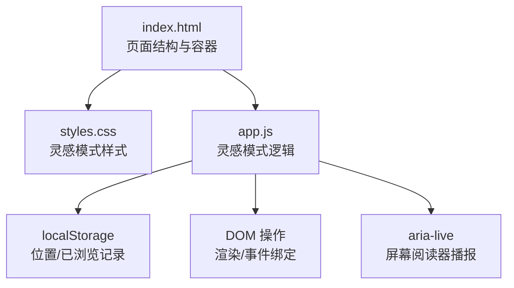
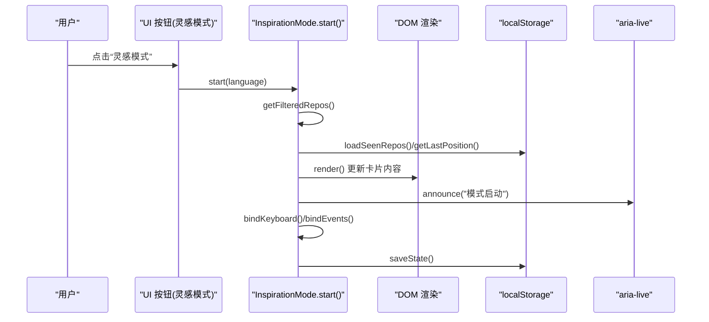
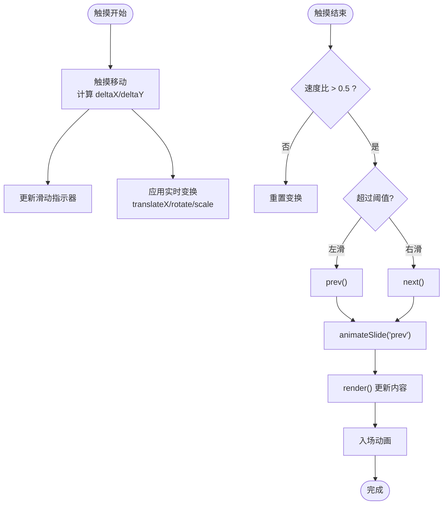
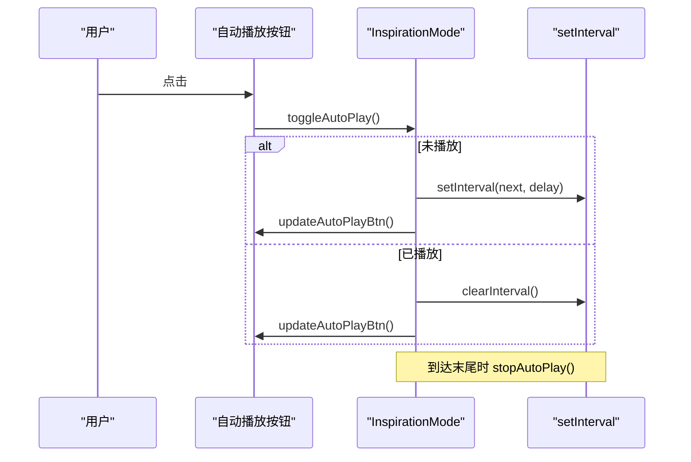
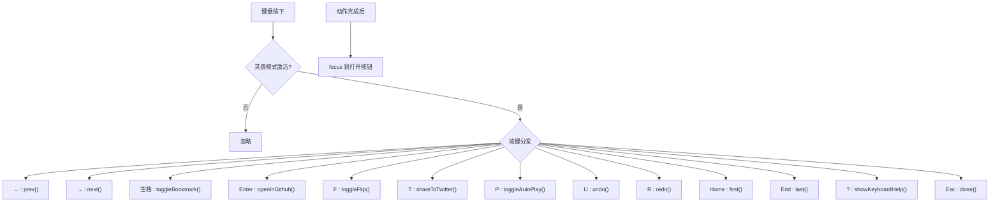
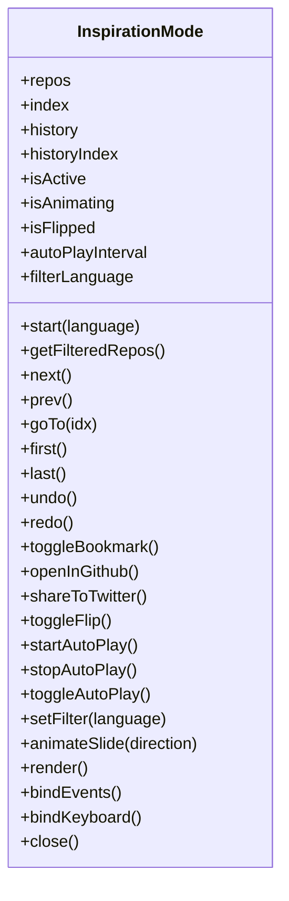
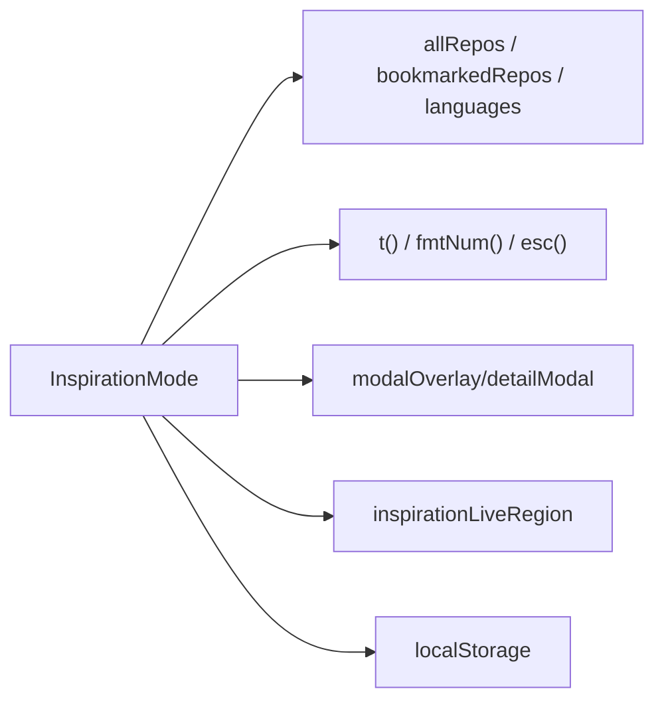

# 灵感模式

<cite>
**本文引用的文件**
- [web/app.js](file://web/app.js)
- [web/index.html](file://web/index.html)
- [web/styles.css](file://web/styles.css)
- [README.md](file://README.md)
</cite>

## 目录
1. [简介](#简介)
2. [项目结构](#项目结构)
3. [核心组件](#核心组件)
4. [架构总览](#架构总览)
5. [详细组件分析](#详细组件分析)
6. [依赖关系分析](#依赖关系分析)
7. [性能考量](#性能考量)
8. [故障排查指南](#故障排查指南)
9. [结论](#结论)

## 简介
本文件围绕“灵感模式”功能，系统性解析左右滑动交互、自动播放控制、键盘导航、卡片切换动画与状态管理等关键实现。灵感模式以全屏卡片浏览为核心，提供：
- 触摸手势识别（左/右滑）与实时视觉反馈
- 自动播放（定时器管理、暂停/恢复、速度可调）
- 完整键盘导航（方向键、快捷键映射、焦点管理）
- 平滑的卡片过渡动画与翻转效果
- 历史撤销/重做、进度与已浏览计数、语言筛选等增强体验

该功能通过复用现有详情弹窗容器进行渲染，结合无障碍支持（aria-live）、本地持久化（localStorage）与事件委托，形成高性能且易用的沉浸式浏览体验。

## 项目结构
灵感模式位于前端单页应用中，主要涉及以下文件：
- web/index.html：页面骨架与入口，包含详情弹窗容器与无障碍提示区域
- web/app.js：全部业务逻辑，包括灵感模式对象 InspirationMode 及其事件绑定、动画、自动播放、键盘处理等
- web/styles.css：灵感模式的样式定义，含卡片容器、按钮、进度条、翻转与移动端适配
- README.md：全局快捷键说明与功能概览

图表来源
- [web/index.html:219-284](file://web/index.html#L219-L284)
- [web/app.js:1789-2607](file://web/app.js#L1789-L2607)
- [web/styles.css:2182-2574](file://web/styles.css#L2182-L2574)

章节来源
- [web/index.html:219-284](file://web/index.html#L219-L284)
- [web/app.js:1789-2607](file://web/app.js#L1789-L2607)
- [web/styles.css:2182-2574](file://web/styles.css#L2182-L2574)

## 核心组件
- InspirationMode 对象：封装灵感模式的状态机、渲染、事件、动画、自动播放、历史、持久化等能力
- 配置常量 INSPIRATION_CONFIG：控制自动播放间隔、滑动阈值、动画时长、触觉反馈开关、历史长度上限
- 全局数据与工具：allRepos、bookmarkedRepos、seenRepos、t()、fmtNum()、esc() 等

关键职责划分
- 状态与生命周期：repos、index、history、isActive、isAnimating、isFlipped、autoPlayInterval
- 过滤与排序：按语言筛选、排除已浏览、随机打乱
- 交互层：触摸事件、键盘事件、UI 按钮点击
- 动画层：CSS transform + transition 驱动卡片进出场与翻转
- 辅助层：无障碍播报、触觉反馈、本地持久化

章节来源
- [web/app.js:1789-1812](file://web/app.js#L1789-L1812)
- [web/app.js:1817-2607](file://web/app.js#L1817-L2607)

## 架构总览
灵感模式在现有详情弹窗中渲染，通过类名切换进入“灵感模式”布局，并接管键盘与触摸事件。

图表来源
- [web/app.js:1837-1866](file://web/app.js#L1837-L1866)
- [web/app.js:2292-2453](file://web/app.js#L2292-L2453)
- [web/app.js:2520-2590](file://web/app.js#L2520-L2590)
- [web/index.html:269-269](file://web/index.html#L269-L269)

## 详细组件分析

### 左右滑动交互（触摸事件处理、手势识别、动画过渡）
- 触摸事件绑定：在卡片容器上监听 touchstart/touchmove/touchend，使用 passive 提升滚动性能
- 手势识别：计算 deltaX/deltaY，基于速度比判断是否为水平滑动；超过阈值触发 prev/next
- 实时反馈：touchmove 时根据位移设置 transform（平移+旋转+缩放），并显示方向指示器
- 动画过渡：onTouchEnd 后调用 animateSlide，先出再入，配合 cubic-bezier 曲线，确保流畅

图表来源
- [web/app.js:2482-2518](file://web/app.js#L2482-L2518)
- [web/app.js:2171-2207](file://web/app.js#L2171-L2207)
- [web/app.js:2114-2147](file://web/app.js#L2114-L2147)
- [web/styles.css:2191-2221](file://web/styles.css#L2191-L2221)

章节来源
- [web/app.js:2482-2518](file://web/app.js#L2482-L2518)
- [web/app.js:2171-2207](file://web/app.js#L2171-L2207)
- [web/app.js:2114-2147](file://web/app.js#L2114-L2147)
- [web/styles.css:2191-2221](file://web/styles.css#L2191-L2221)

### 自动播放控制机制（定时器管理、暂停/恢复、播放速度设置）
- 定时器：使用 setInterval 周期性执行 next()，到达末尾自动停止
- 暂停/恢复：toggleAutoPlay 内部判断是否已有定时器，存在则 clearInterval，否则重新创建
- 速度设置：INSPIRATION_CONFIG.autoPlayDelay 控制间隔（默认 5000ms），可通过修改配置调整
- UI 同步：updateAutoPlayBtn 动态切换图标与标题，反映当前播放状态

图表来源
- [web/app.js:2056-2084](file://web/app.js#L2056-L2084)
- [web/app.js:2217-2233](file://web/app.js#L2217-L2233)
- [web/app.js:1805-1812](file://web/app.js#L1805-L1812)

章节来源
- [web/app.js:2056-2084](file://web/app.js#L2056-L2084)
- [web/app.js:2217-2233](file://web/app.js#L2217-L2233)
- [web/app.js:1805-1812](file://web/app.js#L1805-L1812)

### 键盘导航支持（方向键操作、快捷键映射、焦点管理）
- 方向键：←/→ 分别触发 prev/next；Home/End 跳转首尾
- 常用快捷键：Space 收藏、Enter 打开 GitHub、F 翻转、T 分享、P 自动播放、U/R 撤销/重做、? 帮助、Esc 关闭
- 焦点管理：每次切换后聚焦“打开 GitHub”按钮，保证键盘可访问性
- 事件隔离：仅在 isActive 为真时响应，避免干扰主界面

图表来源
- [web/app.js:2528-2590](file://web/app.js#L2528-L2590)
- [web/app.js:2248-2254](file://web/app.js#L2248-L2254)

章节来源
- [web/app.js:2528-2590](file://web/app.js#L2528-L2590)
- [web/app.js:2248-2254](file://web/app.js#L2248-L2254)

### 卡片切换动画与状态管理
- 状态字段：index、history/historyIndex、isAnimating、isFlipped、filterLanguage、seenRepos
- 历史记录：next/prev/goTo/undo/redo 维护固定长度的历史栈，支持撤销/重做
- 动画流程：先出（带旋转与透明度变化），再渲染新内容，最后入场（从侧边滑入）
- 翻转效果：通过 CSS transform rotateY(180deg) 实现卡片背面展示（用于更多细节）
- 进度与计数：progress 百分比、已浏览计数 seenCount、筛选标签显示

图表来源
- [web/app.js:1817-2607](file://web/app.js#L1817-L2607)

章节来源
- [web/app.js:1817-2607](file://web/app.js#L1817-L2607)
- [web/styles.css:2205-2207](file://web/styles.css#L2205-L2207)

### 数据过滤与随机顺序
- 过滤规则：可选按语言过滤，排除已浏览项目
- 随机顺序：对结果集进行随机打乱，提升探索感
- 语言筛选：在模式内提供下拉选择，支持即时切换与清除

章节来源
- [web/app.js:1868-1875](file://web/app.js#L1868-L1875)
- [web/app.js:2086-2103](file://web/app.js#L2086-L2103)

### 本地持久化与无障碍
- 已浏览记录：seenRepos 集合持久化到 localStorage，避免重复推荐
- 位置恢复：记录 index 与 filterLanguage，下次进入时恢复到上次位置
- 屏幕阅读器：通过 aria-live 区域播报当前项信息与模式状态

章节来源
- [web/app.js:1886-1923](file://web/app.js#L1886-L1923)
- [web/app.js:2156-2161](file://web/app.js#L2156-L2161)
- [web/index.html:269-269](file://web/index.html#L269-L269)

## 依赖关系分析
- 外部依赖：无第三方库，纯原生 JavaScript/CSS
- 内部依赖：
  - 全局数据 allRepos、bookmarkedRepos、languages
  - 工具函数 t()、fmtNum()、esc()
  - 通用弹窗容器 modalOverlay/detailModal
  - 无障碍区域 inspirationLiveRegion

图表来源
- [web/app.js:1817-2607](file://web/app.js#L1817-L2607)
- [web/index.html:219-284](file://web/index.html#L219-L284)

章节来源
- [web/app.js:1817-2607](file://web/app.js#L1817-L2607)
- [web/index.html:219-284](file://web/index.html#L219-L284)

## 性能考量
- 被动事件：触摸事件使用 passive:true，减少滚动阻塞
- GPU 加速：transform 与 will-change 启用合成层优化
- 防抖与节流：滚动与输入使用 debounce，降低频繁重排
- 虚拟列表：主列表大于 100 项时使用虚拟滚动，灵感模式仅渲染单卡，内存占用低
- 预加载占位：预留相邻卡片预加载接口（可扩展图片等资源）

章节来源
- [web/app.js:1065-1071](file://web/app.js#L1065-L1071)
- [web/app.js:861-912](file://web/app.js#L861-L912)
- [web/styles.css:2198-2203](file://web/styles.css#L2198-L2203)

## 故障排查指南
- 无法加载数据：需通过 HTTP 服务器访问，浏览器 file:// 协议会阻止 fetch
- 自动播放不停止：检查是否在末尾正确调用 stopAutoPlay；确认 autoPlayInterval 被清空
- 触摸无效：确认卡片容器存在且绑定了 touch 事件；检查 touch-action 与 user-select 样式
- 键盘不响应：确认 isActive 为真；检查是否有其他全局 keydown 拦截
- 屏幕阅读器无播报：确认 aria-live 元素存在且文本被更新

章节来源
- [README.md:166-167](file://README.md#L166-L167)
- [web/app.js:2070-2076](file://web/app.js#L2070-L2076)
- [web/app.js:2482-2518](file://web/app.js#L2482-L2518)
- [web/app.js:2528-2590](file://web/app.js#L2528-L2590)
- [web/app.js:2156-2161](file://web/app.js#L2156-L2161)

## 结论
灵感模式以轻量原生实现提供了完整的沉浸式浏览体验：
- 交互层面：触摸手势与键盘双通道，覆盖桌面与移动端
- 控制层面：自动播放、历史回溯、语言筛选、进度可视化
- 体验层面：流畅动画、翻转查看、无障碍播报、本地持久化
- 性能层面：被动事件、GPU 加速、虚拟列表与防抖策略

建议后续扩展：
- 增加图片资源预加载与懒加载
- 支持自定义播放速度与手势灵敏度
- 导出浏览历史与书签联动
- 增加多端同步（如后端存储）