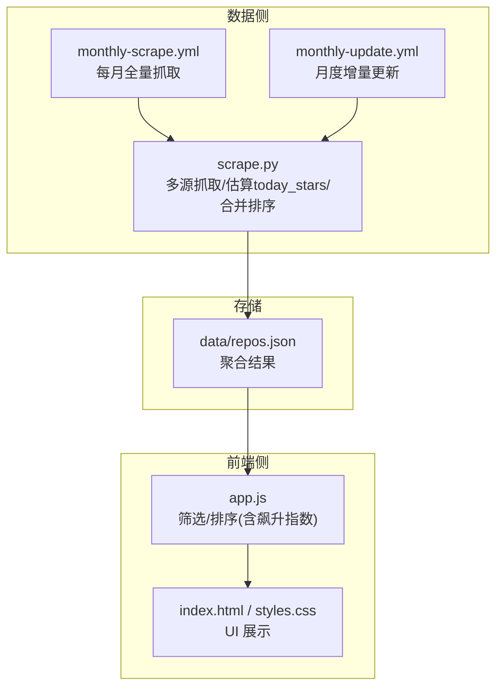
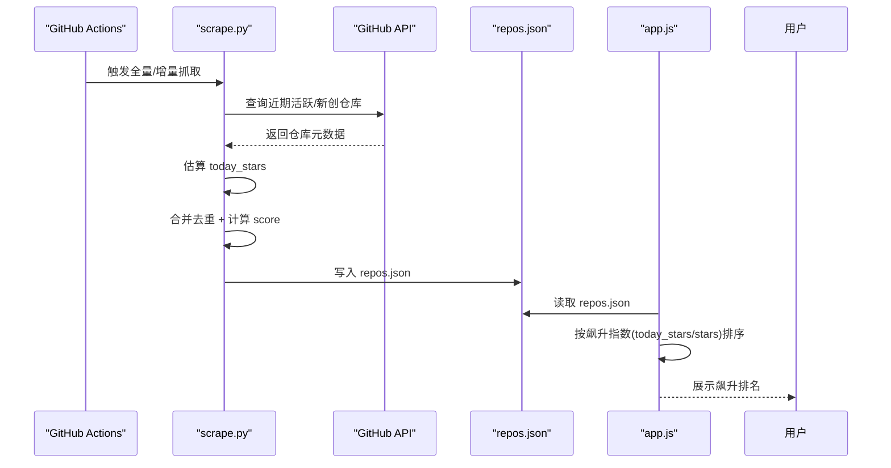
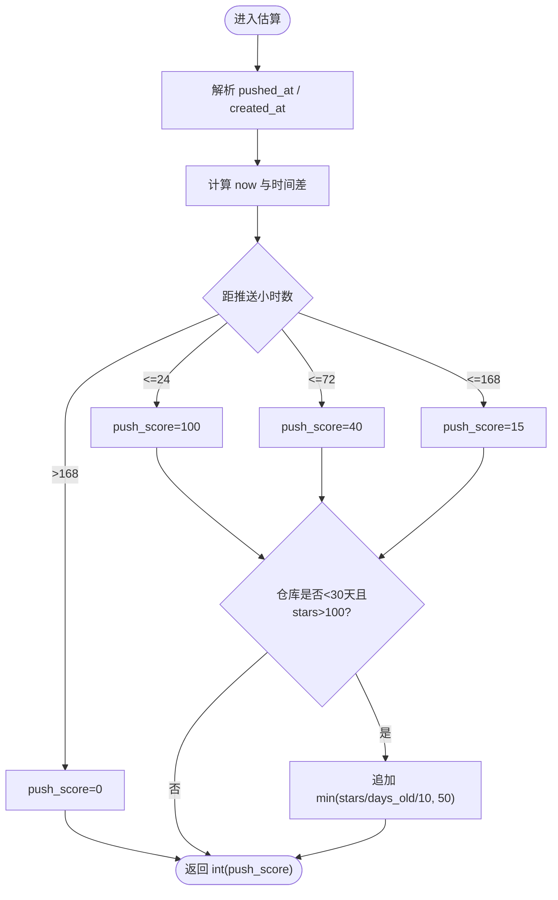
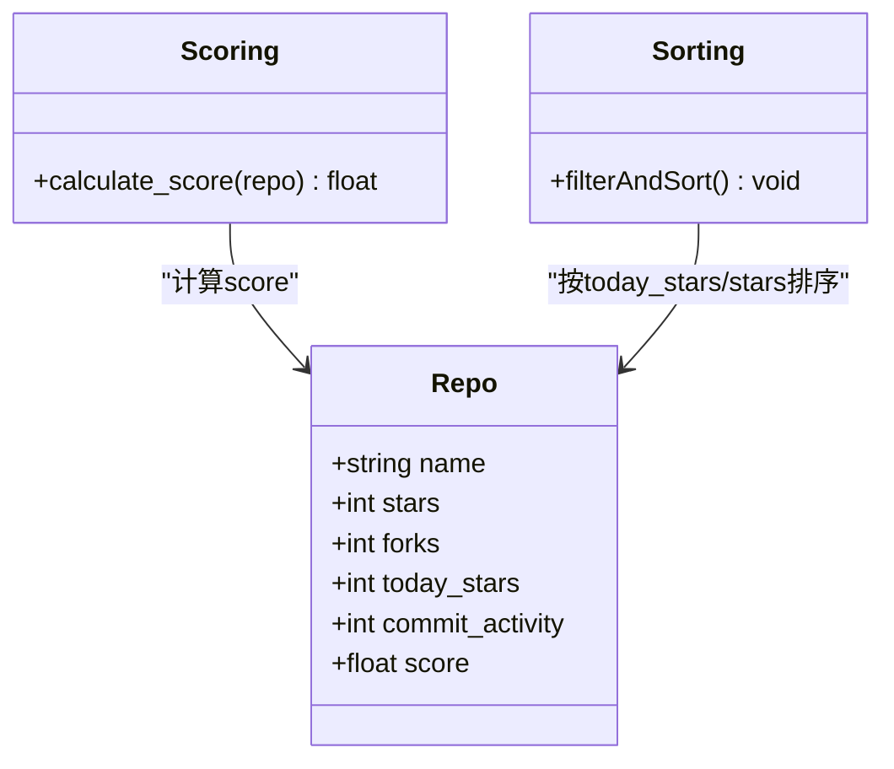
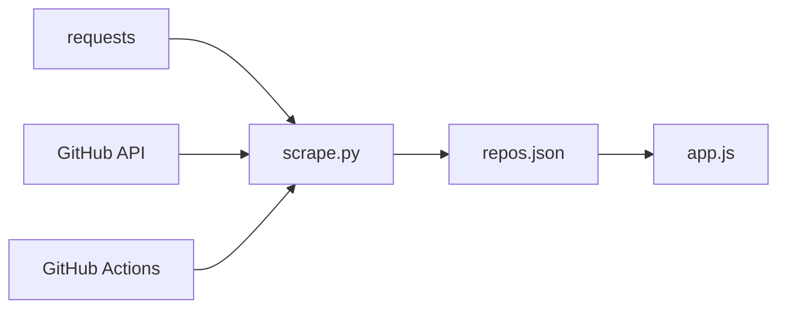

# 飙升指数

<cite>
**本文引用的文件**   
- [scripts/scrape.py](file://scripts/scrape.py)
- [web/app.js](file://web/app.js)
- [.github/workflows/monthly-scrape.yml](file://.github/workflows/monthly-scrape.yml)
- [.github/workflows/monthly-update.yml](file://.github/workflows/monthly-update.yml)
- [README.md](file://README.md)
- [README.zh-CN.md](file://README.zh-CN.md)
- [tests/test_scripts.py](file://tests/test_scripts.py)
</cite>

## 目录
1. [简介](#简介)
2. [项目结构](#项目结构)
3. [核心组件](#核心组件)
4. [架构总览](#架构总览)
5. [详细组件分析](#详细组件分析)
6. [依赖关系分析](#依赖关系分析)
7. [性能与更新策略](#性能与更新策略)
8. [故障排查指南](#故障排查指南)
9. [结论](#结论)

## 简介
本文件聚焦“飙升指数”功能，系统性说明其数据来源、计算方式、排序机制以及与基础评分系统的关系。飙升指数的目标是识别“今日增长最快”的项目，通过估算的“今日新增 Stars”与“当前 Stars”的比率进行排序，从而发现近期热度快速上升的新星仓库。

## 项目结构
与飙升指数直接相关的代码分布在爬虫脚本（数据侧）和前端页面（展示与排序侧），并由 GitHub Actions 定时触发更新：
- 数据侧：Python 脚本负责多源抓取、估算“今日增长”信号、合并去重并输出 JSON 数据集
- 前端侧：纯 JS 实现筛选与排序，支持按“飙升指数”排序
- 自动化：GitHub Actions 按月全量抓取与增量更新，驱动数据刷新

图表来源
- [scripts/scrape.py:336-402](file://scripts/scrape.py#L336-L402)
- [.github/workflows/monthly-scrape.yml:1-50](file://.github/workflows/monthly-scrape.yml#L1-L50)
- [.github/workflows/monthly-update.yml:1-106](file://.github/workflows/monthly-update.yml#L1-L106)
- [web/app.js:1026-1059](file://web/app.js#L1026-L1059)

章节来源
- [README.md:109-120](file://README.md#L109-L120)
- [README.zh-CN.md:130-137](file://README.zh-CN.md#L130-L137)

## 核心组件
- 今日增长估算模块：基于推送时间、创建时间与星标规模估算“今日新增 Stars”
- 飙升指数排序：前端以“今日增长/Stars”为指标进行排序
- 基础评分系统：综合 Stars、Forks、Fork率、今日增长、近四周提交活跃度等加权得分
- 数据更新流水线：GitHub Actions 定时执行抓取与更新，产出 repos.json

章节来源
- [scripts/scrape.py:301-334](file://scripts/scrape.py#L301-L334)
- [scripts/scrape.py:562-573](file://scripts/scrape.py#L562-L573)
- [web/app.js:1044-1053](file://web/app.js#L1044-L1053)
- [.github/workflows/monthly-scrape.yml:1-50](file://.github/workflows/monthly-scrape.yml#L1-L50)
- [.github/workflows/monthly-update.yml:1-106](file://.github/workflows/monthly-update.yml#L1-L106)

## 架构总览
飙升指数在数据侧由 Python 脚本估算“今日增长”，在前端侧作为排序维度使用；基础评分系统则用于整体质量排序。两者并行存在，服务于不同需求：飙升指数关注“短期爆发力”，基础评分关注“综合价值”。

图表来源
- [.github/workflows/monthly-scrape.yml:25-40](file://.github/workflows/monthly-scrape.yml#L25-L40)
- [scripts/scrape.py:336-402](file://scripts/scrape.py#L336-L402)
- [scripts/scrape.py:575-622](file://scripts/scrape.py#L575-L622)
- [web/app.js:1026-1059](file://web/app.js#L1026-L1059)

## 详细组件分析

### 1) 飙升指数计算方法
- 时间窗口选择
  - “今日增长”并非真实每日 Star 计数（GitHub Search API 不提供），而是基于“最近推送时间”与“仓库年龄”估算的信号，覆盖 24h、72h、168h 三个时间桶，并对“新仓高星”给予额外加分
- 增长率计算公式
  - 飙升指数 = today_stars / stars
  - 其中 today_stars 来自估算函数，stars 为当前总星标数
- 权重分配策略
  - 飙升指数仅使用两个字段：today_stars 与 stars，无额外权重参数
  - 该比率天然对“小基数高增长”更敏感，适合发现新星项目

关键实现路径
- 估算今日增长：[scripts/scrape.py:301-334](file://scripts/scrape.py#L301-L334)
- 飙升指数排序：[web/app.js:1044-1053](file://web/app.js#L1044-L1053)

图表来源
- [scripts/scrape.py:301-334](file://scripts/scrape.py#L301-L334)

章节来源
- [scripts/scrape.py:301-334](file://scripts/scrape.py#L301-L334)
- [web/app.js:1044-1053](file://web/app.js#L1044-L1053)

### 2) 排序机制的实现原理
- 多指标综合评分（基础评分系统）
  - 综合得分 = stars + forks + (forks/stars)*1000 + today_stars*10 + commit_activity*2
  - 用于整体质量排序，兼顾规模、社区参与度、增长势头与活跃度
- 动态调整算法（飙升指数）
  - 前端按 today_stars / stars 降序排列，体现“相对增长强度”
  - 当 stars 为 0 时，使用分母保护（除以 1），避免除零异常
- 与基础评分的关系与差异
  - 基础评分侧重“绝对体量+活跃度+增长贡献”，飙升指数侧重“相对增长速度”
  - 二者可并存：基础评分用于“宝藏推荐”，飙升指数用于“发现新星”

关键实现路径
- 基础评分计算：[scripts/scrape.py:562-573](file://scripts/scrape.py#L562-L573)
- 飙升指数排序：[web/app.js:1044-1053](file://web/app.js#L1044-L1053)

图表来源
- [scripts/scrape.py:562-573](file://scripts/scrape.py#L562-L573)
- [web/app.js:1026-1059](file://web/app.js#L1026-L1059)

章节来源
- [scripts/scrape.py:562-573](file://scripts/scrape.py#L562-L573)
- [web/app.js:1026-1059](file://web/app.js#L1026-L1059)

### 3) 数据来源、计算频率与更新策略
- 数据来源
  - Awesome Lists、GitHub Search API（多时间维度）、Hacker News、DEV.to
  - 针对“飙升指数”，重点依赖“近期推送/创建”的仓库集合，并估算 today_stars
- 计算频率
  - 全量抓取：每月 1 日 00:00 UTC 触发
  - 月度增量：每月 1 日 06:00 UTC 触发，补充当月新项目
- 更新策略
  - 合并去重：同仓库保留各数值字段的最大值，合并 source 标签
  - 可选增强：对 Top-N 候选调用免费 commit_activity 接口，提升活跃度信号

关键实现路径
- 全量抓取调度：[.github/workflows/monthly-scrape.yml:1-50](file://.github/workflows/monthly-scrape.yml#L1-L50)
- 月度增量调度：[.github/workflows/monthly-update.yml:1-106](file://.github/workflows/monthly-update.yml#L1-L106)
- 合并去重逻辑：[scripts/scrape.py:575-622](file://scripts/scrape.py#L575-L622)
- 趋势抓取入口：[scripts/scrape.py:336-402](file://scripts/scrape.py#L336-L402)

章节来源
- [.github/workflows/monthly-scrape.yml:1-50](file://.github/workflows/monthly-scrape.yml#L1-L50)
- [.github/workflows/monthly-update.yml:1-106](file://.github/workflows/monthly-update.yml#L1-L106)
- [scripts/scrape.py:336-402](file://scripts/scrape.py#L336-L402)
- [scripts/scrape.py:575-622](file://scripts/scrape.py#L575-L622)

### 4) 数学公式与代码实现细节
- 飙升指数
  - 公式：飙升指数 = today_stars / stars
  - 代码位置：[web/app.js:1044-1053](file://web/app.js#L1044-L1053)
- 今日增长估算
  - 规则：
    - 推送时间 ≤ 24h → push_score=100
    - 推送时间 ≤ 72h → push_score=40
    - 推送时间 ≤ 168h → push_score=15
    - 推送时间 > 168h → push_score=0
    - 若仓库 < 30 天且 stars > 100，追加 min(stars/days_old/10, 50)
  - 代码位置：[scripts/scrape.py:301-334](file://scripts/scrape.py#L301-L334)
- 基础评分
  - 公式：score = stars + forks + (forks/stars)*1000 + today_stars*10 + commit_activity*2
  - 代码位置：[scripts/scrape.py:562-573](file://scripts/scrape.py#L562-L573)

章节来源
- [web/app.js:1044-1053](file://web/app.js#L1044-L1053)
- [scripts/scrape.py:301-334](file://scripts/scrape.py#L301-L334)
- [scripts/scrape.py:562-573](file://scripts/scrape.py#L562-L573)

### 5) 单元测试验证（估算逻辑）
- 用例覆盖：
  - 最近推送（3h）→ 估算值为 100
  - 一周内推送（5天）→ 落入 72..168h 区间，估算值为 15
  - 长期未推送（60天）→ 估算值为 0
- 测试文件位置：[tests/test_scripts.py:57-91](file://tests/test_scripts.py#L57-L91)

章节来源
- [tests/test_scripts.py:57-91](file://tests/test_scripts.py#L57-L91)

## 依赖关系分析
- 数据侧依赖
  - requests 库用于 HTTP 请求与重试策略
  - GitHub API（Search、Repo、Commit Activity）提供原始数据
- 前端依赖
  - 原生 JS 实现筛选与排序，无外部框架依赖
- 自动化依赖
  - GitHub Actions 定时任务驱动数据更新

图表来源
- [requirements.txt:1-1](file://requirements.txt#L1-L1)
- [scripts/scrape.py:1-20](file://scripts/scrape.py#L1-L20)
- [.github/workflows/monthly-scrape.yml:1-50](file://.github/workflows/monthly-scrape.yml#L1-L50)

章节来源
- [requirements.txt:1-1](file://requirements.txt#L1-L1)
- [scripts/scrape.py:1-20](file://scripts/scrape.py#L1-L20)
- [.github/workflows/monthly-scrape.yml:1-50](file://.github/workflows/monthly-scrape.yml#L1-L50)

## 性能与更新策略
- 性能考虑
  - 前端排序为 O(n log n)，飙升指数排序仅涉及简单除法比较，开销极低
  - 虚拟滚动在列表较大时启用，减少 DOM 渲染压力
- 更新策略
  - 全量抓取每月一次，确保榜单完整性
  - 月度增量抓取补充当月新项目，提高时效性
  - 合并去重采用“逐字段取最大”的策略，保证多源信息互补

章节来源
- [web/app.js:874-925](file://web/app.js#L874-L925)
- [.github/workflows/monthly-scrape.yml:1-50](file://.github/workflows/monthly-scrape.yml#L1-L50)
- [.github/workflows/monthly-update.yml:1-106](file://.github/workflows/monthly-update.yml#L1-L106)
- [scripts/scrape.py:575-622](file://scripts/scrape.py#L575-L622)

## 故障排查指南
- 页面显示“无法加载数据”
  - 原因：浏览器安全策略禁止 file:// 协议下的 fetch 请求
  - 解决：通过本地 HTTP 服务器访问（如 python3 -m http.server 8000）
- GitHub API 请求受限
  - 原因：未设置 GITHUB_TOKEN，限额较低
  - 解决：设置环境变量 GITHUB_TOKEN，提升配额
- 飙升指数排序异常
  - 检查：确认 repos.json 中 today_stars 与 stars 字段是否存在且非空
  - 定位：前端排序逻辑位于 filterAndSort 的 rising 分支

章节来源
- [README.md:166-171](file://README.md#L166-L171)
- [README.zh-CN.md:215-220](file://README.zh-CN.md#L215-L220)
- [web/app.js:1026-1059](file://web/app.js#L1026-L1059)

## 结论
飙升指数通过“估算今日增长/当前星标”的比率，有效捕捉短期增长最快的仓库，与基础评分系统形成互补：前者强调“相对增速”，后者强调“综合价值”。依托 GitHub Actions 的定期更新与多源数据融合，该功能具备较高的时效性与稳定性。前端实现简洁高效，易于扩展更多排序维度或可视化呈现。