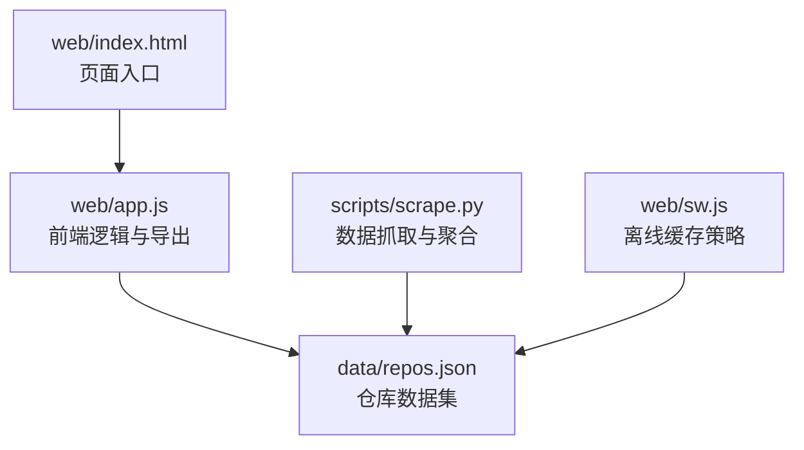
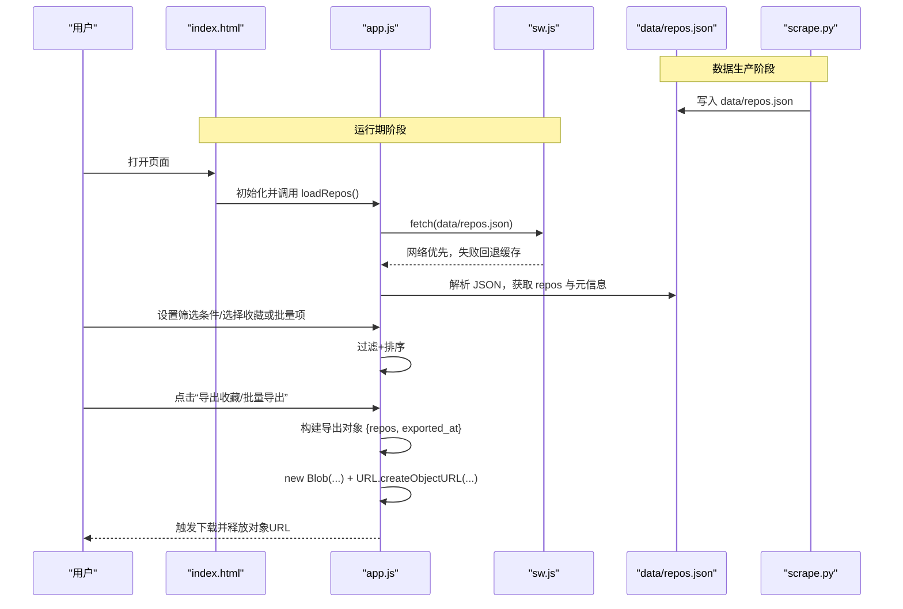
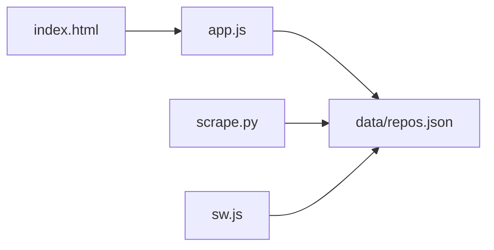
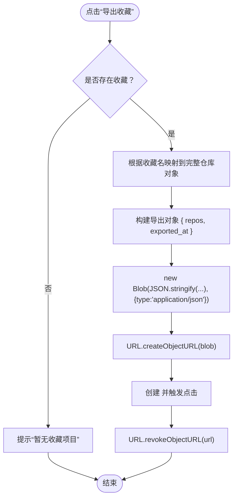

# JSON导出

<cite>
**本文引用的文件**   
- [web/app.js](file://web/app.js)
- [web/index.html](file://web/index.html)
- [scripts/scrape.py](file://scripts/scrape.py)
- [README.md](file://README.md)
- [web/sw.js](file://web/sw.js)
</cite>

## 目录
1. [简介](#简介)
2. [项目结构](#项目结构)
3. [核心组件](#核心组件)
4. [架构总览](#架构总览)
5. [详细组件分析](#详细组件分析)
6. [依赖关系分析](#依赖关系分析)
7. [性能与内存优化](#性能与内存优化)
8. [故障排查指南](#故障排查指南)
9. [结论](#结论)
10. [附录：数据格式规范](#附录数据格式规范)

## 简介
本文件面向 GitHub Treasure Repo 的“JSON导出”功能，系统性说明以下要点：
- 导出数据的格式定义（repos.json 顶层结构与仓库对象字段）
- 前端下载实现（Blob + URL.createObjectURL）
- 导出内容的筛选逻辑（语言、评分、收藏状态等）
- 大文件处理与性能优化（虚拟滚动、分块导出建议、内存管理）
- 流程图与错误处理机制

## 项目结构
与导出相关的前端入口与脚本位于 web/ 目录；数据由 Python 爬虫生成并输出到 data/repos.json。

图表来源
- [web/index.html:1-284](file://web/index.html#L1-L284)
- [web/app.js:1-2634](file://web/app.js#L1-L2634)
- [scripts/scrape.py:545-717](file://scripts/scrape.py#L545-L717)
- [web/sw.js:1-54](file://web/sw.js#L1-L54)

章节来源
- [README.md:123-148](file://README.md#L123-L148)

## 核心组件
- 数据加载与解析：从 data/repos.json 读取顶层对象，提取 repos 数组与元信息（如 fetched_at）。
- 筛选与排序：支持按语言、Stars/Forks/Score 阈值、关键词搜索、是否仅展示收藏等条件过滤。
- 导出能力：
  - 导出收藏：将当前本地收藏集合映射为仓库对象列表后导出。
  - 批量导出：将用户勾选的仓库对象列表导出。
- 下载实现：使用 Blob 构造 JSON 文本，URL.createObjectURL 创建可下载链接，触发 <a download> 完成下载，随后释放对象 URL。

章节来源
- [web/app.js:401-453](file://web/app.js#L401-L453)
- [web/app.js:1026-1059](file://web/app.js#L1026-L1059)
- [web/app.js:1092-1105](file://web/app.js#L1092-L1105)
- [web/app.js:1581-1591](file://web/app.js#L1581-L1591)

## 架构总览
下图展示了从数据源到前端导出的整体流程，包括数据生产、静态资源缓存、前端加载与导出路径。

图表来源
- [web/app.js:401-453](file://web/app.js#L401-L453)
- [web/sw.js:33-54](file://web/sw.js#L33-L54)
- [scripts/scrape.py:625-649](file://scripts/scrape.py#L625-L649)

## 详细组件分析

### 数据加载与解析
- 加载策略：尝试多个相对路径以适配不同部署位置；成功响应后解析 JSON。
- 数据结构：顶层包含 repos 数组与 fetched_at 等元信息；前端据此更新统计信息与语言过滤器。

章节来源
- [web/app.js:401-453](file://web/app.js#L401-L453)

### 筛选与排序
- 筛选维度：
  - 关键词：匹配 name 与 description
  - 语言：精确匹配 language
  - Stars/Forks/Score：最小值阈值
  - 收藏视图：仅显示已收藏仓库
- 排序维度：综合评分、Stars、Forks、今日增长、飙升指数（today_stars/stars）

章节来源
- [web/app.js:1026-1059](file://web/app.js#L1026-L1059)

### 导出收藏
- 触发入口：页面按钮“导出收藏”。
- 数据范围：基于本地收藏集合 bookmarkedRepos 映射到 allRepos 中的完整仓库对象。
- 导出内容：{ repos: [...], exported_at: ISO时间 }。
- 下载实现：Blob -> createObjectURL -> 动态 a.download -> click -> revokeObjectURL。

章节来源
- [web/index.html:102-108](file://web/index.html#L102-L108)
- [web/app.js:1092-1105](file://web/app.js#L1092-L1105)

### 批量导出
- 触发入口：批量操作栏“导出”。
- 数据范围：用户勾选的 batchSelectedRepos 对应的仓库对象。
- 导出内容：同收藏导出，统一为 { repos: [...], exported_at: ISO时间 }。
- 下载实现：同上。

章节来源
- [web/index.html:169-174](file://web/index.html#L169-L174)
- [web/app.js:1581-1591](file://web/app.js#L1581-L1591)

### 下载实现细节（Blob + URL.createObjectURL）
- 步骤：
  1) 序列化目标数据为 JSON 字符串
  2) 通过 new Blob([jsonString], { type: 'application/json' }) 创建二进制对象
  3) URL.createObjectURL(blob) 生成临时 URL
  4) 创建 <a> 元素，设置 href 与 download 文件名，模拟点击
  5) 立即 URL.revokeObjectURL(url) 释放内存引用

章节来源
- [web/app.js:1092-1105](file://web/app.js#L1092-L1105)
- [web/app.js:1581-1591](file://web/app.js#L1581-L1591)

### 错误处理与用户体验
- 数据加载失败：
  - 自动重试（带退避），最多两次
  - 最终失败时提示“无法加载数据”，并提供本地服务器启动命令或重新抓取指引
- 无收藏可导出：
  - 弹出提示“暂无收藏项目”
- 分享链接复制：
  - 使用 Clipboard API，失败则静默忽略

章节来源
- [web/app.js:401-453](file://web/app.js#L401-L453)
- [web/app.js:1092-1105](file://web/app.js#L1092-L1105)

## 依赖关系分析
- 前端 app.js 依赖：
  - DOM 元素（index.html 提供）
  - 静态数据 data/repos.json（由 scrape.py 生成）
  - Service Worker sw.js（对 data 目录做网络优先+缓存回退）
- 数据生产 scrape.py 负责：
  - 多源抓取与合并
  - 计算 score、today_stars、commit_activity 等指标
  - 输出 data/repos.json

图表来源
- [web/index.html:1-284](file://web/index.html#L1-L284)
- [web/app.js:1-2634](file://web/app.js#L1-L2634)
- [scripts/scrape.py:545-717](file://scripts/scrape.py#L545-L717)
- [web/sw.js:1-54](file://web/sw.js#L1-L54)

章节来源
- [README.md:123-148](file://README.md#L123-L148)

## 性能与内存优化
- 虚拟滚动：当结果集 > 100 条时启用，仅渲染可视区域及缓冲区的卡片，降低 DOM 压力。
- 防抖：输入与滚动事件采用 debounce，减少频繁重排与重绘。
- 对象 URL 生命周期：每次导出后立即 revokeObjectURL，避免内存泄漏。
- 建议的分块导出方案（可选增强）：
  - 将 large JSON 拆分为多个分片（例如每片 N 条记录），分别生成 Blob 并触发多次下载
  - 或使用流式压缩（如浏览器端 zlib）减小体积
  - 注意：当前实现未内置分块导出，可按需扩展

章节来源
- [web/app.js:874-925](file://web/app.js#L874-L925)
- [web/app.js:1078-1084](file://web/app.js#L1078-L1084)
- [web/app.js:1092-1105](file://web/app.js#L1092-L1105)
- [web/app.js:1581-1591](file://web/app.js#L1581-L1591)

## 故障排查指南
- “无法加载数据”
  - 现象：页面提示需要本地 HTTP 服务或先执行抓取脚本
  - 原因：浏览器 file:// 协议下 fetch 被限制；或 data/repos.json 不存在
  - 解决：
    - 使用本地 HTTP 服务访问（见 README 快速开始）
    - 在根目录运行抓取脚本生成 data/repos.json
- 导出为空
  - 现象：点击“导出收藏”无反应或提示“暂无收藏项目”
  - 原因：本地 localStorage 中无收藏条目
  - 解决：先收藏若干项目后再导出
- 下载失败
  - 现象：未触发下载或文件损坏
  - 排查：检查控制台是否有权限错误（剪贴板/下载）；确认 MIME 类型为 application/json

章节来源
- [README.md:166-168](file://README.md#L166-L168)
- [web/app.js:401-453](file://web/app.js#L401-L453)
- [web/app.js:1092-1105](file://web/app.js#L1092-L1105)

## 结论
- 导出功能以“收藏导出”和“批量导出”两种模式覆盖常见场景，输出统一的 JSON 结构，便于二次处理。
- 下载实现遵循现代浏览器最佳实践（Blob + Object URL + 及时释放），兼顾易用性与内存安全。
- 结合虚拟滚动与防抖，可在大数据量下保持流畅体验；如需更大规模导出，可引入分块导出与压缩策略。

## 附录：数据格式规范

### 顶层结构（data/repos.json）
- schema_version: 整数，表示数据模型版本
- fetched_at: ISO 8601 时间戳，数据抓取时间
- total: 整数，仓库总数
- sources: 字符串数组，数据来源标签集合
- criteria: 对象，采集标准（min_stars、min_forks、awesome_lists 等）
- repos: 仓库对象数组

章节来源
- [scripts/scrape.py:625-649](file://scripts/scrape.py#L625-L649)

### 仓库对象字段（每个 repo）
- name: 字符串，owner/repo
- url: 字符串，GitHub 主页链接
- description: 字符串，项目描述
- stars: 整数，Stars 数
- forks: 整数，Forks 数
- language: 字符串，主语言（未知时为 Unknown）
- today_stars: 整数，估算当日星标增长
- commit_activity: 整数（可选），最近四周提交活跃度
- score: 数字，综合评分
- source: 字符串，来源标签（可能为多个来源拼接）
- fetched_at: 字符串，抓取时间

章节来源
- [scripts/scrape.py:545-573](file://scripts/scrape.py#L545-L573)
- [scripts/scrape.py:575-623](file://scripts/scrape.py#L575-L623)

### 导出文件结构（前端导出）
- 导出收藏 / 批量导出均输出如下结构：
  - repos: 仓库对象数组（来自 data/repos.json 的完整记录）
  - exported_at: ISO 8601 时间戳，导出时间

章节来源
- [web/app.js:1092-1105](file://web/app.js#L1092-L1105)
- [web/app.js:1581-1591](file://web/app.js#L1581-L1591)

### 导出流程图（收藏导出）

图表来源
- [web/app.js:1092-1105](file://web/app.js#L1092-L1105)