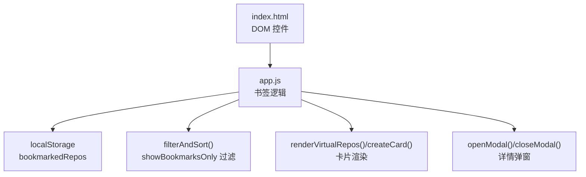
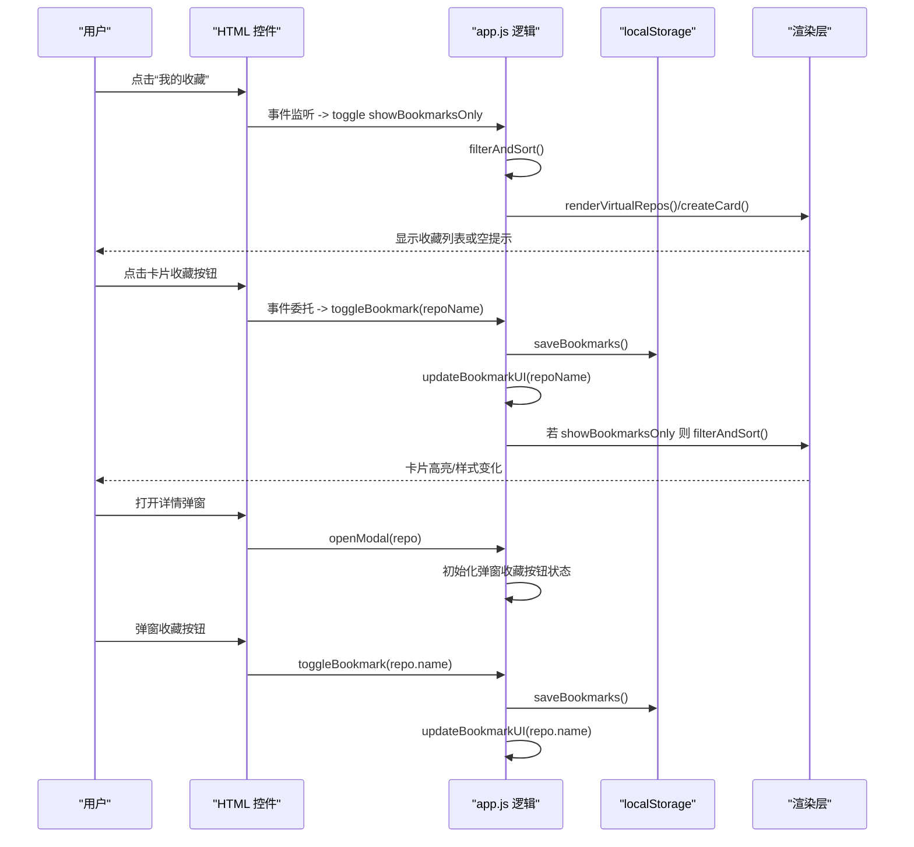
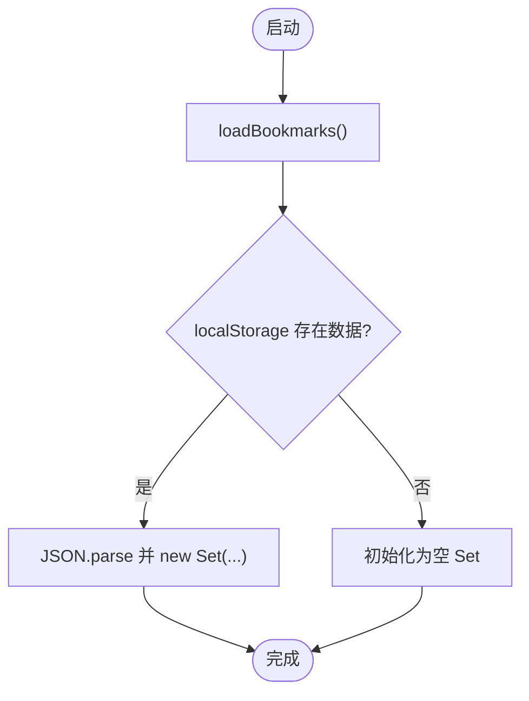
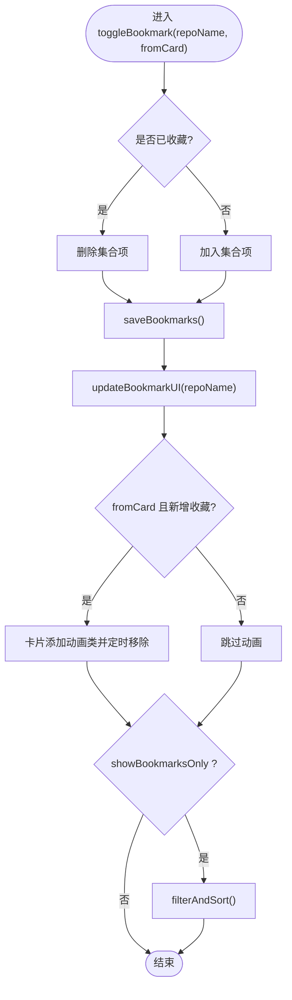
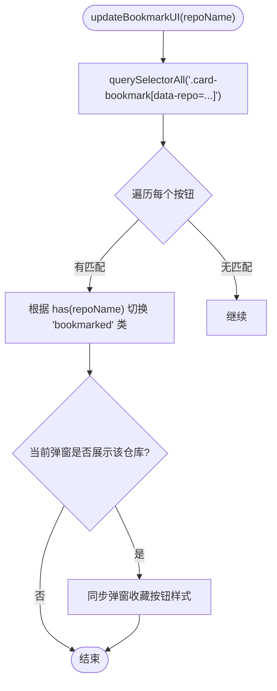
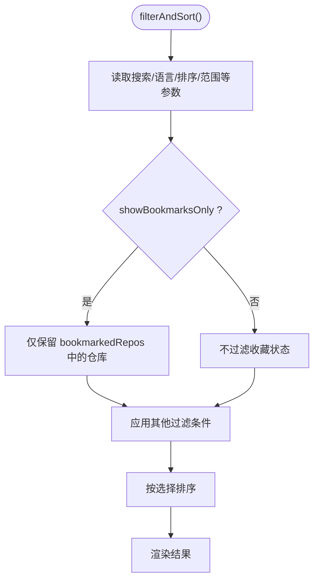
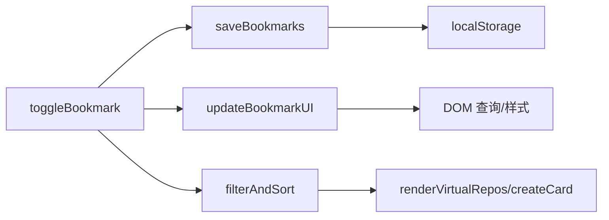

# 书签系统

<cite>
**本文引用的文件**
- [web/app.js](file://web/app.js)
- [web/index.html](file://web/index.html)
</cite>

## 目录
1. [简介](#简介)
2. [项目结构](#项目结构)
3. [核心组件](#核心组件)
4. [架构总览](#架构总览)
5. [详细组件分析](#详细组件分析)
6. [依赖关系分析](#依赖关系分析)
7. [性能考量](#性能考量)
8. [故障排查指南](#故障排查指南)
9. [结论](#结论)
10. [附录](#附录)

## 简介
本文件聚焦于 GitHub Treasure Repo 的“书签系统”，系统性解析基于浏览器 localStorage 的书签存储机制与前端交互逻辑。内容涵盖：
- 数据模型：bookmarkedRepos Set 的设计与使用
- 持久化：loadBookmarks 与 saveBookmarks 的实现策略与错误处理
- 状态切换：toggleBookmark 的收藏/取消收藏算法
- UI 同步：updateBookmarkUI 如何保持界面与数据一致
- 过滤模式：showBookmarksOnly 的工作原理与联动
- 用户体验优化：动画反馈、批量操作、导出、URL 分享等

## 项目结构
书签功能主要位于前端单页应用的主脚本中，HTML 提供相关按钮与容器元素。关键位置如下：
- web/app.js：书签数据模型、持久化、交互逻辑、筛选与渲染
- web/index.html：书签视图开关、导出按钮、详情弹窗中的收藏按钮等 DOM 节点

图表来源
- [web/app.js:293-347](file://web/app.js#L293-L347)
- [web/app.js:1013-1046](file://web/app.js#L1013-L1046)
- [web/app.js:846-890](file://web/app.js#L846-L890)
- [web/index.html:96-108](file://web/index.html#L96-L108)
- [web/index.html:229-233](file://web/index.html#L229-L233)

章节来源
- [web/app.js:1-15](file://web/app.js#L1-L15)
- [web/index.html:96-108](file://web/index.html#L96-L108)
- [web/index.html:229-233](file://web/index.html#L229-L233)

## 核心组件
本节从数据模型、持久化、状态切换、UI 同步、过滤模式五个维度深入解析书签系统。

- 数据模型
  - bookmarkedRepos：Set<string>，用于高效判断某仓库是否已收藏（O(1) 查找）
  - showBookmarksOnly：boolean，控制是否仅展示收藏项
  - currentModalRepo：当前详情弹窗中的仓库对象，用于在弹窗内更新收藏状态

- 持久化
  - loadBookmarks()：从 localStorage 读取 JSON 字符串并重建 Set；异常时回退为空集
  - saveBookmarks()：将 Set 转为数组后以 JSON 写入 localStorage

- 状态切换
  - toggleBookmark(repoName, fromCard = false)：根据是否存在进行添加或删除，随后持久化并刷新 UI；若来自卡片且新增收藏，触发卡片动画；若处于收藏视图，重新过滤排序

- UI 同步
  - updateBookmarkUI(repoName)：遍历所有同名收藏按钮并切换样式类；同时更新弹窗内的收藏按钮状态

- 过滤模式
  - filterAndSort()：当 showBookmarksOnly 为真时，过滤条件包含“必须存在于 bookmarkedRepos”；否则正常按搜索、语言、评分等过滤

章节来源
- [web/app.js:4-6](file://web/app.js#L4-L6)
- [web/app.js:293-306](file://web/app.js#L293-L306)
- [web/app.js:308-329](file://web/app.js#L308-L329)
- [web/app.js:331-347](file://web/app.js#L331-L347)
- [web/app.js:1013-1046](file://web/app.js#L1013-L1046)

## 架构总览
下图展示了书签系统在页面加载、用户交互、过滤渲染、弹窗交互等关键路径中的数据流与控制流。

图表来源
- [web/app.js:1115-1120](file://web/app.js#L1115-L1120)
- [web/app.js:1013-1046](file://web/app.js#L1013-L1046)
- [web/app.js:846-890](file://web/app.js#L846-L890)
- [web/app.js:308-329](file://web/app.js#L308-L329)
- [web/app.js:331-347](file://web/app.js#L331-L347)
- [web/app.js:349-393](file://web/app.js#L349-L393)

## 详细组件分析

### 数据模型与存储策略
- bookmarkedRepos：使用 Set 保证唯一性与 O(1) 查询，适合频繁判断“是否已收藏”的场景
- 存储键名：bookmarkedRepos
- 序列化策略：保存时将 Set 转为数组再 JSON.stringify；加载时 JSON.parse 后 new Set(...)
- 错误处理：加载失败时捕获异常并重置为空集，避免崩溃

图表来源
- [web/app.js:293-302](file://web/app.js#L293-L302)

章节来源
- [web/app.js:4-6](file://web/app.js#L4-L6)
- [web/app.js:293-306](file://web/app.js#L293-L306)

### 收藏/取消收藏算法（toggleBookmark）
- 输入：repoName，fromCard（可选，默认 false）
- 流程：
  - 判断是否已收藏
  - 若已收藏则删除，否则添加
  - 立即持久化
  - 更新 UI（卡片与弹窗）
  - 若来自卡片且新增收藏，给卡片添加短暂动画类
  - 若处于收藏视图，重新执行过滤排序

图表来源
- [web/app.js:308-329](file://web/app.js#L308-L329)

章节来源
- [web/app.js:308-329](file://web/app.js#L308-L329)

### UI 同步（updateBookmarkUI）
- 目标：确保所有与该 repoName 相关的收藏按钮状态与内存数据一致
- 行为：
  - 通过 data-repo 属性定位所有同名收藏按钮，依据集合状态切换样式类
  - 若当前弹窗正在展示该仓库，同步弹窗收藏按钮样式

图表来源
- [web/app.js:331-347](file://web/app.js#L331-L347)

章节来源
- [web/app.js:331-347](file://web/app.js#L331-L347)

### 收藏视图过滤（showBookmarksOnly）
- 作用域：filterAndSort() 内部
- 规则：当 showBookmarksOnly 为真时，任何不在 bookmarkedRepos 中的仓库都会被过滤掉
- 联动：
  - 点击“我的收藏”按钮或键盘快捷键 B 切换布尔值
  - URL 参数 bookmarks=1 可恢复收藏视图
  - 新增收藏后若处于收藏视图，会触发一次重过滤

图表来源
- [web/app.js:1013-1046](file://web/app.js#L1013-L1046)
- [web/app.js:1115-1120](file://web/app.js#L1115-L1120)
- [web/app.js:1376-1379](file://web/app.js#L1376-L1379)

章节来源
- [web/app.js:1013-1046](file://web/app.js#L1013-L1046)
- [web/app.js:1115-1120](file://web/app.js#L1115-L1120)
- [web/app.js:1376-1379](file://web/app.js#L1376-L1379)

### 事件绑定与入口
- 卡片收藏按钮：通过事件委托在 #repoGrid 上监听 .card-bookmark 点击，调用 toggleBookmark
- 弹窗收藏按钮：#modalBookmark 点击调用 toggleBookmark(currentModalRepo.name)
- 收藏视图切换：#bookmarkToggle 点击切换 showBookmarksOnly 并触发过滤
- 导出收藏：#exportBookmarks 点击导出当前收藏为 JSON 文件
- 键盘快捷键：B 切换收藏视图，Space 对选中卡片执行收藏/取消

章节来源
- [web/app.js:1128-1172](file://web/app.js#L1128-L1172)
- [web/app.js:1182-1186](file://web/app.js#L1182-L1186)
- [web/app.js:1115-1120](file://web/app.js#L1115-L1120)
- [web/app.js:1078-1092](file://web/app.js#L1078-L1092)
- [web/app.js:1273-1278](file://web/app.js#L1273-L1278)
- [web/app.js:1322-1326](file://web/app.js#L1322-L1326)

### 数据导出与导入
- 导出：exportBookmarks() 将当前 allRepos 中与 bookmarkedRepos 匹配的仓库打包为 JSON Blob，生成下载链接
- 导入：当前代码未实现直接导入到 localStorage 的功能；如需导入，可在现有导出格式基础上扩展读取与合并逻辑

章节来源
- [web/app.js:1078-1092](file://web/app.js#L1078-L1092)

### 与灵感模式的集成
- 灵感模式中的收藏动作复用全局 toggleBookmark，并在操作后给出 Toast 提示与触觉反馈
- 灵感模式也维护“已浏览”状态（独立于收藏），不影响收藏逻辑

章节来源
- [web/app.js:2021-2030](file://web/app.js#L2021-L2030)

## 依赖关系分析
- 模块耦合
  - toggleBookmark 依赖：saveBookmarks、updateBookmarkUI、filterAndSort（条件）、DOM 动画类
  - updateBookmarkUI 依赖：DOM 查询与 classList 操作
  - filterAndSort 依赖：showBookmarksOnly、allRepos、filteredRepos、渲染函数
- 外部依赖
  - localStorage：本地持久化
  - DOM API：querySelectorAll、classList、createElement 等
- 潜在循环依赖
  - 无明显循环引用；各函数职责清晰，单向调用链

图表来源
- [web/app.js:308-329](file://web/app.js#L308-L329)
- [web/app.js:331-347](file://web/app.js#L331-L347)
- [web/app.js:1013-1046](file://web/app.js#L1013-L1046)
- [web/app.js:846-890](file://web/app.js#L846-L890)

章节来源
- [web/app.js:308-329](file://web/app.js#L308-L329)
- [web/app.js:331-347](file://web/app.js#L331-L347)
- [web/app.js:1013-1046](file://web/app.js#L1013-L1046)
- [web/app.js:846-890](file://web/app.js#L846-L890)

## 性能考量
- 数据结构选择
  - Set 提供 O(1) 的 has/add/delete，适合高频收藏状态判断
- 渲染优化
  - 大数据量时使用虚拟滚动（visibleStart/visibleCount/BUFFER），减少 DOM 节点数量
- 事件节流
  - 滚动与搜索输入使用 debounce，降低重排重绘频率
- 存储开销
  - localStorage 容量有限（通常 5-10MB），建议定期清理无用数据或限制收藏数量

[本节为通用指导，不直接分析具体文件]

## 故障排查指南
- 现象：收藏状态丢失
  - 可能原因：浏览器禁用 localStorage、隐私模式、存储空间不足
  - 排查步骤：检查控制台是否有 Storage 相关错误；确认 loadBookmarks 的 try/catch 分支是否被触发
- 现象：收藏按钮状态不同步
  - 可能原因：DOM 未正确更新或重复渲染覆盖
  - 排查步骤：确认 updateBookmarkUI 是否被调用；检查 data-repo 属性是否正确
- 现象：收藏视图不生效
  - 可能原因：showBookmarksOnly 未被设置或 URL 参数未解析
  - 排查步骤：检查 #bookmarkToggle 事件与 loadFromUrl 中对 bookmarks 参数的处理
- 现象：导出为空
  - 可能原因：当前 no bookmarks
  - 排查步骤：确认 exportBookmarks 的提示逻辑与 allRepos 过滤结果

章节来源
- [web/app.js:293-302](file://web/app.js#L293-L302)
- [web/app.js:331-347](file://web/app.js#L331-L347)
- [web/app.js:1115-1120](file://web/app.js#L1115-L1120)
- [web/app.js:1376-1379](file://web/app.js#L1376-L1379)
- [web/app.js:1078-1092](file://web/app.js#L1078-L1092)

## 结论
书签系统以简洁的数据模型（Set）和清晰的函数分工实现了可靠的收藏能力：
- 数据层：bookmarkedRepos 提供高效的状态管理
- 持久化层：load/save 封装了 JSON 序列化和异常处理
- 交互层：toggleBookmark 串联状态变更、持久化与 UI 更新
- 视图层：updateBookmarkUI 与 filterAndSort 共同保障界面一致性
- 体验层：动画反馈、批量操作、导出、URL 分享等增强可用性

整体设计具备良好的可扩展性，便于后续引入导入、分组标签、云端同步等功能。

[本节为总结性内容，不直接分析具体文件]

## 附录

### 关键函数与位置索引
- 数据模型与初始化
  - bookmarkedRepos / showBookmarksOnly：[web/app.js:4-6](file://web/app.js#L4-L6)
- 持久化
  - loadBookmarks：[web/app.js:293-302](file://web/app.js#L293-L302)
  - saveBookmarks：[web/app.js:304-306](file://web/app.js#L304-L306)
- 状态切换
  - toggleBookmark：[web/app.js:308-329](file://web/app.js#L308-L329)
- UI 同步
  - updateBookmarkUI：[web/app.js:331-347](file://web/app.js#L331-L347)
- 过滤与渲染
  - filterAndSort：[web/app.js:1013-1046](file://web/app.js#L1013-L1046)
  - renderVirtualRepos/createCard：[web/app.js:846-890](file://web/app.js#L846-L890)
- 事件绑定
  - 卡片收藏按钮：[web/app.js:1128-1172](file://web/app.js#L1128-L1172)
  - 弹窗收藏按钮：[web/app.js:1182-1186](file://web/app.js#L1182-L1186)
  - 收藏视图切换：[web/app.js:1115-1120](file://web/app.js#L1115-L1120)
  - 键盘快捷键：[web/app.js:1273-1278](file://web/app.js#L1273-L1278), [web/app.js:1322-1326](file://web/app.js#L1322-L1326)
- 导出
  - exportBookmarks：[web/app.js:1078-1092](file://web/app.js#L1078-L1092)
- HTML 控件
  - 收藏视图与导出按钮：[web/index.html:96-108](file://web/index.html#L96-L108)
  - 弹窗收藏按钮：[web/index.html:229-233](file://web/index.html#L229-L233)